## प्रस्तावना: ऑपरेटिंग सिस्टम का वास्तविक सार क्या है — «सुंदर डिज़ाइन» या «व्यावहारिक संचालन»?

जब आप कंप्यूटर साइंस के व्याख्यानों को सुनते हैं या सॉफ्टवेयर इंजीनियरिंग की सुंदर पाठ्यपुस्तकों को खोलते हैं, तो वहां हमेशा «सुरुचिपूर्ण अमूर्तता (Clean Abstraction)», «चिंताओं का पृथक्करण (Separation of Concerns)», और «लंबकोणीय API डिज़ाइन (Orthogonal API Design)» जैसे मनमोहक आदर्शों की चर्चा मिलती है। इस दृष्टिकोण के अनुसार, एक ऑपरेटिंग सिस्टम (OS) को हार्डवेयर की जटिलताओं को छिपाने वाला और एप्लिकेशनों को एक सुसंगत, सहज और शुद्ध इंटरफ़ेस प्रदान करने वाला एक पवित्र मध्यस्थ होना चाहिए।

लेकिन जैसे ही कोई विश्वविद्यालय की अकादमिक दुनिया से बाहर निकलकर वास्तविक वाणिज्यिक डेस्कटॉप ऑपरेटिंग सिस्टम के युद्धक्षेत्र में कदम रखता है, वे सभी निष्कलंक आदर्श चकनाचूर हो जाते हैं। इसका कारण यह है कि पर्सनल कंप्यूटर के इतिहास में सबसे अधिक व्यावसायिक सफलता प्राप्त करने वाले और दुनिया भर के अरबों पीसी पर राज करने वाले महाबली Windows ने जिस दर्शन को साकार किया है, वह किताबी सुंदरता के ठीक विपरीत खड़ा है — **«अतिवादी और कठोर व्यावहारिक यथार्थवाद (Pragmatism)»**।

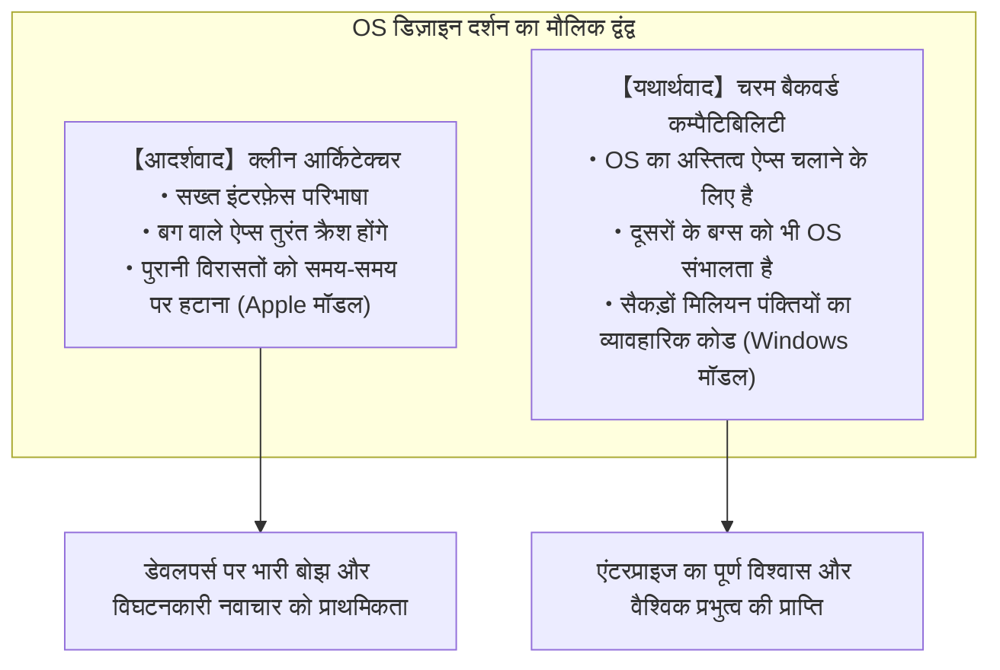

विश्व में मौजूद सभी ऑपरेटिंग सिस्टमों में से किसी ने भी «अतीत की विरासतों» के प्रति ऐसा असाधारण और अदम्य समर्पण प्रदर्शित नहीं किया है जैसा Windows ने किया है। 1995 में जारी की गई गेम की सीडी-रोम, 1990 के दशक की शुरुआत में Visual Basic 3.0 या C++ में लिखे गए कॉर्पोरेट अकाउंटिंग सॉफ्टवेयर, डॉस (DOS) युग की विरासतें, और सिस्टम के अप्रलेखित आंतरिक व्यवहारों को अनुचित तरीके से हैक करके चलने वाले पुराने यूटिलिटी टूल्स — ये सभी 2020 के दशक के मध्य के अत्याधुनिक ऑपरेटिंग सिस्टम «Windows 11» पर बिना किसी झिझक के शुरू होते हैं और पूरी तरह काम करते हैं।

अधिकांश लोग इसे सामान्य मानकर उपभोग करते हैं और सोचते हैं कि «सॉफ़्टवेयर बस चल ही तो रहा है»। लेकिन जब सिस्टम प्रोग्रामर Windows के आंतरिक सोर्स कोड को रिवर्स-इंजीनियर करते हैं और उसकी अगाध गहराइयों में झांकते हैं, तो वे विस्मय और भय से भर जाते हैं। वहां थर्ड-पार्टी एप्लिकेशनों के अनगिनत बग्स, विनिर्देशों के उल्लंघनों, मेमोरी विनाश और अपरिभाषित व्यवहारों से सॉफ़्टवेयर को बचाने के लिए Microsoft के इंजीनियरों द्वारा 30 से अधिक वर्षों में जमा की गई **«हजारों पंक्तियों के विशेष नियम, APIs का डायनामिक छद्म रूप, और OS द्वारा जानबूझकर झूठ बोलने का तंत्र (Shim)»** भूगर्भीय परतों की तरह संचित हैं।

Microsoft को दूसरों द्वारा लिखे गए घटिया और टूटे हुए कोड का बोझ अपने कंधों पर उठाकर OS के स्तर पर तालमेल क्यों बिठाना पड़ा?  
Apple की तरह अतीत को निर्ममता से काटकर आगे बढ़ने का रास्ता क्यों नहीं चुना गया?  
और इस अभूतपूर्व इंजीनियरिंग ने Windows को एक कभी न ढहने वाले «विश्व के सबसे शक्तिशाली प्लेटफ़ॉर्म» के रूप में कैसे स्थापित किया?

यह लेख Microsoft के दिग्गज प्रोग्रामरों की गवाही, Windows के आंतरिक रिवर्स-इंजीनियरिंग डेटा, PE बाइनरी और NT कर्नेल की गहन संरचनाओं, और आईटी प्लेटफ़ॉर्म रणनीतियों के इतिहास का अन्वेषण करते हुए Windows के सर्वोच्च नियम — **«पुराने ऐप्स को कभी न तोड़ें (Don't break old apps)»** की संपूर्ण वास्तविकता को उजागर करने वाला एक निर्णायक और प्रामाणिक दस्तावेज़ है।

---

## अध्याय 1: दो ऐतिहासिक स्रोत उजागर करते हैं «लौह नियम (The Prime Directive)»

बैकवर्ड कम्पैटिबिलिटी के प्रति Windows विकास दल का यह अगाध समर्पण बाहर के लोगों की कल्पना मात्र नहीं है, बल्कि उस अग्रिम मोर्चे पर कोड लिखने वाले और आर्किटेक्चर तय करने वाले दो दिग्गज प्रोग्रामरों द्वारा दुनिया के सामने सजीव रूप से प्रस्तुत किया गया है।

### 1.1 रेमंड चेन (Raymond Chen) और 'The Old New Thing'

Microsoft के Windows विकास दल में एक ऐसा व्यक्ति है जो 30 से अधिक वर्षों से «जीवित किंवदंती» के रूप में प्रतिष्ठित है। वे हैं प्रिंसिपल सॉफ़्टवेयर इंजीनियर **रेमंड चेन (Raymond Chen)**, जो 1992 में Microsoft में शामिल होने के बाद से Windows 95 के शेल, User32 और Win32 सबसिस्टम के अंतरतम भागों का विकास और रखरखाव करते आ रहे हैं।

चेन ने आंतरिक ब्लॉग के रूप में जो शुरुआत की थी और जो आज भी Microsoft के आधिकारिक तकनीकी पोर्टल पर निरंतर प्रकाशित होती है — ब्लॉग **'The Old New Thing'** (जिसे बाद में पुस्तक का रूप दिया गया और जो सिस्टम प्रोग्रामरों के लिए बाइबिल बन गई) — इस बात का एक अविश्वसनीय संग्रह है कि Windows ने कम्पैटिबिलिटी की जमीनी समस्याओं को कैसे हल किया।

Windows विकास दल का जो मूल सिद्धांत चेन बार-बार दोहराते हैं, वह अत्यंत सरल और अकाट्य है:

> "Windows ऑपरेटिंग सिस्टम का अस्तित्व केवल प्रोग्राम चलाने के लिए है। उपयोगकर्ता OS की सुंदरता की प्रशंसा करने के लिए पीसी नहीं खरीदते हैं। वे पीसी इसलिए खरीदते हैं क्योंकि वे उस पर चलने वाले किसी विशिष्ट एप्लिकेशन का उपयोग करना चाहते हैं।
> 
> और सबसे कठोर सत्य यह है: **जब कोई उपयोगकर्ता नए Windows पर अपग्रेड करता है और उसका पसंदीदा एप्लिकेशन काम करना बंद कर देता है, तो वह एप्लिकेशन के डेवलपर को कभी दोष नहीं देता। वह 100% Microsoft पर ही आरोप लगाता है कि 'Windows ख़राब हो गया है' या 'नया Windows दोषपूर्ण है'**।"

प्रोग्रामर के स्वाभिमान के दृष्टिकोण से यह तर्क दिया जा सकता है कि «चूंकि एप्लिकेशन के कोड में बग है, इसलिए उसका क्रैश होना स्वाभाविक है और ऐप निर्माता कंपनी को ही इसका फिक्स जारी करना चाहिए»। लेकिन वाणिज्यिक OS के बाज़ार में यह किताबी तर्क बिल्कुल काम नहीं करता। उपयोगकर्ता के लिए केवल एक ही वास्तविकता मायने रखती है: «जो सॉफ़्टवेयर कल तक ठीक चल रहा था, वह Windows अपडेट करते ही बंद हो गया»।

यदि Microsoft यह कहकर पल्ला झाड़ लेता कि «यह सॉफ़्टवेयर कंपनी की गलती है», तो उपयोगकर्ता अपग्रेड करने से इनकार कर देते, पुराने OS पर ही टिके रहते, या प्रतिस्पर्धी प्लेटफ़ॉर्म पर जाने का विचार करते। इसलिए व्यावसायिक आवश्यकता के रूप में Windows विकास दल पर यह कठोर दायित्व सौंपा गया:

**"चाहे एप्लिकेशन डेवलपर ने कितना भी बेतुका, मानकों के विपरीत और टूटा हुआ कोड क्यों न लिखा हो, OS को उसका पता लगाना होगा, पर्दे के पीछे सब कुछ संभालना होगा, और उसे ऐसे चलाना होगा जैसे कुछ हुआ ही न हो।"**

चेन के ब्लॉग में उन मार्मिक और अकल्पनीय तरकीबों का विस्तृत ब्योरा दर्ज है जो उन्हें और उनके साथियों को इस निष्ठा के कारण अपनानी पड़ीं।

### 1.2 जोएल स्पोलस्की (Joel Spolsky) का रहस्योद्घाटन: 'How Microsoft Lost the API War'

इस दर्शन की विशालता को दुनिया भर के वेब इंजीनियरों और आईटी उद्योग तक पहुंचाने वाले प्रमुख व्यक्ति **जोएल स्पोलस्की (Joel Spolsky)** हैं। वे 1990 के दशक की शुरुआत में Microsoft में Excel टीम के प्रोग्राम मैनेजर रहे, और बाद में प्रोग्रामरों के प्रसिद्ध प्रश्नोत्तर मंच 'Stack Overflow' तथा परियोजना प्रबंधन उपकरण 'Trello' के संस्थापक बने।

2004 में, स्पोलस्की ने अपनी वेबसाइट पर 'How Microsoft Lost the API War (Microsoft API युद्ध कैसे हार गया)' शीर्षक से एक ऐतिहासिक निबंध लिखा। उसमें उन्होंने तत्कालीन Windows टीम के प्रमुख जॉन डेवान (Jon DeVaan) के दृढ़ नेतृत्व को याद करते हुए लिखा:

> "In the Windows team, the prime directive was: **don't break old apps.**"  
> (Windows टीम में सर्वोच्च और अटल निर्देश (प्राइम डायरेक्टिव) यही था: **पुराने ऐप्स को कभी न तोड़ें**।)

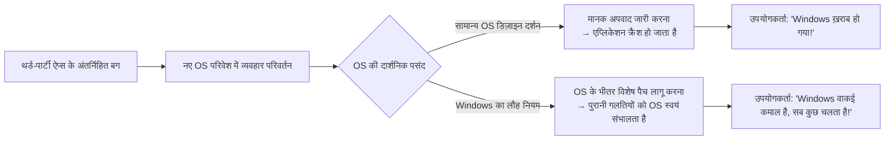

स्पोलस्की समझाते हैं कि जिस प्रकार साइंस-फिक्शन धारावाहिक 'Star Trek' में स्टारफ़्लीट के अधिकारियों के लिए सर्वोच्च नियम «प्राइम डायरेक्टिव» (अविकसित सभ्यताओं के विकास में हस्तक्षेप न करना) था, उसी प्रकार Windows टीम के प्रोग्रामरों के लिए प्राइम डायरेक्टिव था: «मौजूदा एप्लिकेशनों के कार्य में कभी कोई बाधा न डालना»।

यदि किसी Windows डेवलपर ने कर्नेल या API के कोड को बहुत खूबसूरती से रीफ़ैक्टर करके उसकी गति दोगुनी कर दी, लेकिन उस बदलाव के कारण दुनिया में चल रहा कोई एक अनजान बिज़नेस सॉफ़्टवेयर भी क्रैश हो गया, तो उस रीफ़ैक्टरिंग को तुरंत निरस्त (रिजेक्ट) कर दिया जाता था। Windows टीम में कोड का सौंदर्य या आर्किटेक्चर की शुद्धता गौण थी; **«मौजूदा बाइनरी का 100% चलना ही सर्वोच्च धर्म था»**।

### 1.3 «बग भी विनिर्देश बन जाता है»: हाइरम का नियम (Hyrum's Law) और APIs की अपरिवर्तनीयता

सॉफ़्टवेयर इंजीनियरिंग में Google के सॉफ़्टवेयर इंजीनियर हाइरम राइट (Hyrum Wright) द्वारा प्रतिपादित एक प्रसिद्ध अनुभवजन्य नियम है जिसे **«हाइरम का नियम (Hyrum's Law)»** कहा जाता है:

> **हाइरम का नियम**:  
> "जब किसी API के उपयोगकर्ताओं की संख्या पर्याप्त रूप से बड़ी हो जाती है, तो इससे कोई फ़र्क नहीं पड़ता कि API निर्माता ने दस्तावेज़ों में क्या वादा किया है। सिस्टम का प्रत्येक अवलोकनीय व्यवहार (जिसमें बग्स और अनिर्दिष्ट दुष्प्रभाव शामिल हैं) अंततः किसी न किसी के कोड द्वारा निर्भर बना लिया जाएगा।"

Windows वह प्लेटफ़ॉर्म है जिसने दुनिया में सबसे बड़े पैमाने पर और सबसे कठोर रूप में हाइरम के नियम को सच साबित किया है।

उदाहरण के लिए, मान लीजिए कि किसी Windows API के दस्तावेज़ में स्पष्ट लिखा था: "तीसरे तर्क (argument) में एक वैध विंडो हैंडल पास किया जाना चाहिए। अमान्य मान पास करने पर व्यवहार अपरिभाषित (undefined) होगा।" लेकिन दुनिया के किसी लापरवाह प्रोग्रामर ने गलती से वहां `NULL` या कोई अमान्य पॉइंटर पास कर दिया, और तत्कालीन Windows 3.1 के कार्यान्वयन में संयोगवश बिना किसी त्रुटि के वह बच निकला।

इस ऐप की हज़ारों प्रतियां बाज़ार में बिक जाने के बाद, अगली पीढ़ी के Windows 95 या Windows NT की टीम यदि कोड को सुधारकर यह नियम बना दे कि "अमान्य पॉइंटर आने पर सही तरीके से `ERROR_INVALID_PARAMETER` लौटाया जाए", तो क्या होगा?

हज़ारों कार्यालयों में वह पुराना सॉफ़्टवेयर अचानक एरर डायलॉग दिखाकर बंद हो जाएगा। और उपयोगकर्ता क्रोधित होकर Microsoft के सहायता केंद्र पर फोन करेंगे: "Windows नया करते ही हमारा काम रुक गया!"।

परिणामस्वरूप, Microsoft के इंजीनियरों को अपना लिखा हुआ «सही कोड» वापस लेना पड़ा और इस प्रकार का समझौतावादी कोड लिखना पड़ा:

```c
// Windows के आंतरिक API का वैचारिक पुनर्निर्माण
BOOL WINAPI DoSomething(HWND hWnd, UINT uMsg, WPARAM wParam, LPARAM lParam)
{
    // सैद्धांतिक रूप से सही सत्यापन
    if (!IsWindow(hWnd)) {
        // सामान्यतः यहाँ तुरंत त्रुटि लौटाई जानी चाहिए:
        // SetLastError(ERROR_INVALID_WINDOW_HANDLE);
        // return FALSE;

        // 【कम्पैटिबिलिटी के लिए विशेष हैक】
        // पुराना प्रसिद्ध ऐप X इनिशियलाइज़ेशन के समय NULL हैंडल भेजता है।
        // यहाँ त्रुटि लौटाने पर ऐप X क्रैश हो जाएगा,
        // इसलिए चुपचाप डेस्कटॉप विंडो के हैंडल से बदलकर स्थिति संभाल ली जाती है।
        if (IsTargetBadApplication("AppX.exe")) {
            hWnd = GetDesktopWindow();
        } else {
            SetLastError(ERROR_INVALID_WINDOW_HANDLE);
            return FALSE;
        }
    }

    // वास्तविक कार्य जारी रखना...
    return InternalDoSomething(hWnd, uMsg, wParam, lParam);
}
```

एक बार जब कोई ऑपरेटिंग सिस्टम बाज़ार का मानक बन जाता है, तो API का विनिर्देश केवल दस्तावेज़ों में लिखे शब्द नहीं रह जाते, बल्कि **«मौजूदा कार्यान्वयन द्वारा प्रदर्शित किए गए समस्त व्यवहारों का कुल योग (जिसमें बग्स भी शामिल हैं)»** बन जाता है। Windows टीम ने इस वास्तविकता को स्वीकार किया और दुनिया भर के एप्लिकेशनों के बग्स को हमेशा के लिए OS के विनिर्देश के रूप में अपने ऊपर ले लिया।

---

## अध्याय 2: किंवदंती की शुरुआत — «सिमसिटी (SimCity) कांड» का तकनीकी सच

Windows विकास दल के बैकवर्ड कम्पैटिबिलिटी के प्रति जुनून का प्रतीक बनने वाली एक ऐसी घटना है जो कंप्यूटर इतिहास में अमर हो चुकी है। वह है 1995 में Windows 95 के विकास के अंतिम चरण में हुआ **«सिमसिटी (SimCity) कांड»**।

### 2.1 Use-After-Free (मेमोरी मुक्त करने के बाद पहुंच) की भौतिकी

1989 में विल राइट (Will Wright) के नेतृत्व में Maxis कंपनी द्वारा बनाया गया शहर प्रबंधन सिमुलेशन गेम 'SimCity' पीसी गेमिंग इतिहास का एक मील का पत्थर था, और उस समय दुनिया भर में अत्यधिक लोकप्रिय था। आम उपयोगकर्ताओं के साथ-साथ कार्यालयों में काम के बीच में तनाव दूर करने वाले कर्मचारियों के लिए भी पीसी पर SimCity का सुचारू रूप से चलना अत्यंत महत्वपूर्ण था।

उस समय DOS और Windows 3.1 के लिए बेचे जा रहे SimCity के पीसी संस्करण में एक ऐसा गंभीर बग छिपा हुआ था, जिसे आज के सुरक्षा मानकों के तहत तुरंत एक गंभीर सुरक्षा भेद्यता माना जाता। वह बग था **«Use-After-Free (मेमोरी मुक्त करने के बाद उस तक पहुंचना)»**।

SimCity का कोड शहर के ग्राफ़िक्स बनाने और सिमुलेशन की गणना करते समय OS के हीप एलोकेटर से मेमोरी ब्लॉक आवंटित करता था, और उपयोग के बाद उसे मुक्त (`free` या `GlobalFree`) कर देता था। लेकिन दुर्भाग्य से, प्रोग्राम के आंतरिक पॉइंटर्स को मुक्त करने के बाद साफ़ नहीं किया जाता था, और **«प्रोग्राम OS को वापस लौटाई जा चुकी मेमोरी में बेझिझक डेटा पढ़ने और लिखने का काम जारी रखता था!»**

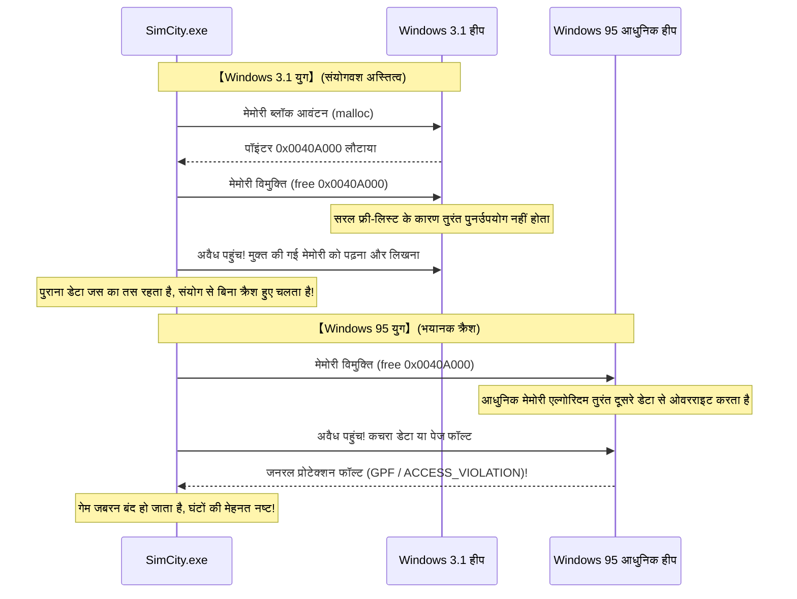

16-बिट OS Windows 3.1 में मेमोरी प्रबंधन बहुत आदिम था। जब कोई एप्लिकेशन मेमोरी मुक्त करता था, तो फ्री-लिस्ट संरचना की सादगी के कारण उस मेमोरी क्षेत्र को तुरंत किसी अन्य कार्य के लिए आवंटित या अधिलेखित (overwrite) नहीं किया जाता था। इसका अर्थ यह था कि SimCity का कोड पूरी तरह दूषित होने के बावजूद **«Windows 3.1 के सरल और सुस्त मेमोरी प्रबंधन के कारण संयोगवश बिना क्रैश हुए चल रहा था»**।

### 2.2 सामान्य सॉफ़्टवेयर इंजीनियरिंग बनाम Windows टीम का समर्पण

लेकिन 1995 में पीसी उद्योग में क्रांति लाने वाला अगली पीढ़ी का 32-बिट ऑपरेटिंग सिस्टम «Windows 95» सामने आया।

Windows 95 में वास्तविक प्रीमेप्टिव मल्टीटास्किंग, परिष्कृत वर्चुअल मेमोरी मैनेजर, और मेमोरी विखंडन को रोकने वाला उच्च गति का आधुनिक हीप एलोकेटर शामिल था। इस आधुनिक मेमोरी मैनेजर को इस तरह डिज़ाइन किया गया था कि जैसे ही कोई एप्लिकेशन मेमोरी लौटाता, दक्षता बढ़ाने के लिए **उस क्षेत्र को तुरंत किसी अन्य उद्देश्य के लिए पुनः उपयोग किया जाता और डेटा को रीसेट कर दिया जाता**।

इस आधुनिक एलोकेटर पर SimCity को चलाते ही क्या हुआ?  
SimCity ने तुरंत मुक्त की गई मेमोरी को पढ़ने का प्रयास किया, और वहां किसी अन्य प्रोसेस का डेटा या खाली शून्यता पाई। अगले ही पल कुख्यात **«जनरल प्रोटेक्शन फॉल्ट (General Protection Fault: GPF)»** का डायलॉग बॉक्स प्रकट हुआ, और खिलाड़ियों द्वारा दर्जनों घंटों में बनाए गए महानगर पलक झपकते ही नष्ट हो गए।

इस स्थिति का सामना करने पर एक सामान्य सॉफ़्टवेयर कंपनी या किसी अन्य OS निर्माता का क्या निर्णय होता?

उत्तर स्पष्ट है: "यह 100% Maxis कंपनी की प्रोग्रामिंग त्रुटि है। OS का मेमोरी प्रबंधन विनिर्देशों के अनुसार पूरी तरह सही काम कर रहा है। हमें Maxis को सूचित करना चाहिए ताकि वे उपयोगकर्ताओं के लिए फ़्लॉपी डिस्क पर सुधार पैच (SimCity 1.01) जारी करें।" — यही तार्किक दृष्टिकोण होता।

लेकिन Microsoft के शीर्ष नेतृत्व और Windows 95 के विकास दल का निर्णय पारंपरिक सोच से परे था:

**"SimCity क्रैश नहीं होना चाहिए। गेम कंपनी द्वारा इसे ठीक करने का इंतज़ार करने का समय हमारे पास नहीं है। Windows 95 के कर्नेल मेमोरी मैनेजर में ही विशेष पैच जोड़ें, और OS को संशोधित करें ताकि SimCity काम करे!"**

### 2.3 मेमोरी एलोकेटर में किए गए SimCity-विशिष्ट हैक का विवरण

जोएल स्पोलस्की ने अपने निबंध में इस ऐतिहासिक क्षण का उल्लेख इस प्रकार किया है:

> "Windows 95 के बीटा परीक्षण के दौरान उन्होंने पाया कि SimCity ठीक से काम नहीं कर रहा था। Microsoft ने क्या किया?  
> उन्होंने SimCity के निर्माताओं पर दबाव नहीं डाला। Windows 95 के मेमोरी मैनेजर के डेवलपर ने एक विशेष कोड जोड़ा: **'यदि वर्तमान में चल रहा प्रोग्राम SimCity है, तो मुक्त की गई मेमोरी को तुरंत पुनः आवंटित न करें, बल्कि उसे कुछ समय के लिए सुरक्षित रखें'**।"

इस हैक का तकनीकी सार आधुनिक शब्दों में «क्वारंटीन हीप (Quarantine Heap)» या «विलंबित विमुक्ति (Delayed Free)» का पूर्वज था।

Windows 95 का हीप एलोकेटर प्रोसेस शुरू होते समय निष्पादन योग्य फ़ाइल के नाम (`SIMCITY.EXE`) और हेडर की जांच करता था। यदि लक्षित ऐप SimCity होता, तो मेमोरी आवंटन को सामान्य मोड से बदलकर «SimCity राहत मोड» में कर दिया जाता था। सामान्यतः मुक्त किए गए ब्लॉक को तुरंत खाली सूची में मिला दिया जाता था, लेकिन SimCity के चलने पर मुक्त किए गए पॉइंटर को एक अस्थायी रिंग बफ़र में सुरक्षित रखा जाता था ताकि पूर्ववर्ती डेटा कुछ समय तक नष्ट न हो।

OS के इस अभूतपूर्व आत्म-बलिदान के कारण, Windows 95 के विमोचन के दिन दुनिया भर के उपयोगकर्ताओं ने अपनी प्रिय SimCity फ़्लॉपी डिस्क पीसी में डाली और बिना किसी त्रुटि के अपने शहर का प्रशासन जारी रखा।

उपयोगकर्ताओं ने प्रशंसा की: "Windows 95 अद्भुत है! पुराने सभी सॉफ़्टवेयर जस के तस चलते हैं!"। इसके पीछे अपने आधुनिक कर्नेल में दूसरों के बग्स को संभालने वाले Microsoft इंजीनियरों की विवश मुस्कान को कोई नहीं जानता था।

---

## अध्याय 3: इतिहास के पन्नों में दर्ज व्यावहारिक कम्पैटिबिलिटी हैक्स

सिमसिटी की घटना केवल एक उदाहरण मात्र थी। आज तक के 30 से अधिक वर्षों के इतिहास में Windows ने दुनिया भर के अनगिनत अनियंत्रित सॉफ़्टवेयरों को जीवित रखने के लिए कई असाधारण कम्पैटिबिलिटी उपाय किए हैं।

### 3.1 Lotus 1-2-3 और Excel का «1900 लीप वर्ष बग»

कंप्यूटर की कैलेंडर गणना में दुनिया का सबसे प्रसिद्ध और आज भी सभी पीसी में जीवित रहने वाला एक बग है: **«वर्ष 1900 को लीप वर्ष मान लेना»**।

ग्रेगोरियन कैलेंडर के नियमों के अनुसार:
1. जो वर्ष 4 से विभाज्य है, वह लीप वर्ष होता है।
2. लेकिन जो वर्ष 100 से विभाज्य है, वह सामान्य वर्ष होता है।
3. परंतु जो वर्ष 400 से विभाज्य है, वह लीप वर्ष होता है।

अतः वर्ष 1900 एक ऐसा वर्ष है जो 100 से विभाज्य है लेकिन 400 से नहीं, इसलिए यह **एक सामान्य वर्ष है और 29 फ़रवरी 1900 का कोई अस्तित्व नहीं है**।

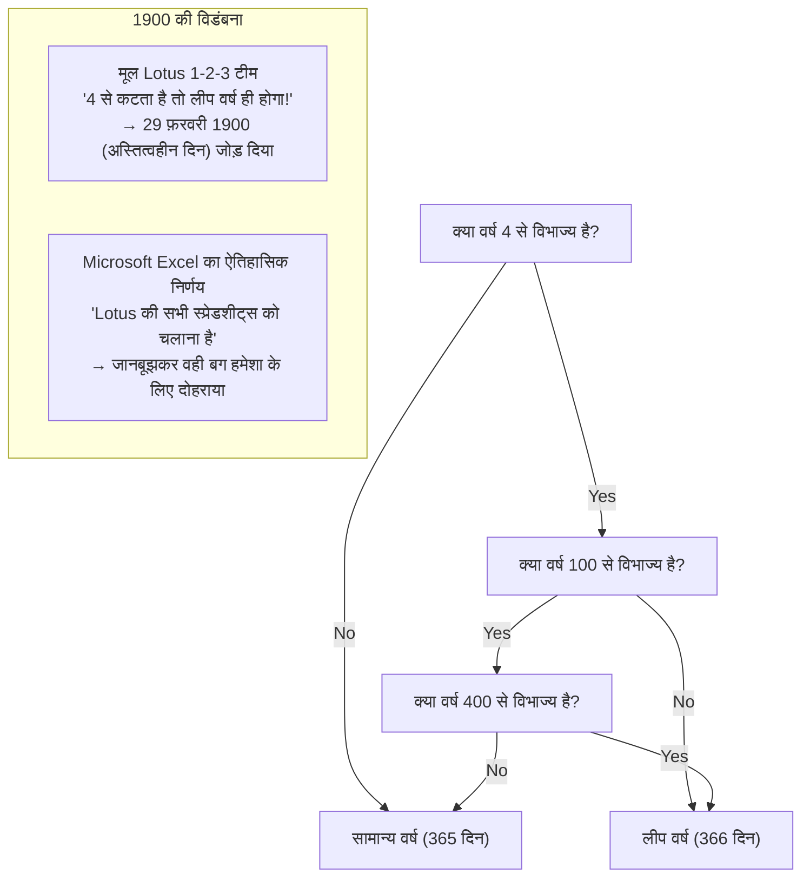

परंतु 1980 के दशक की शुरुआत में DOS बाज़ार पर राज करने वाले स्प्रेडशीट सॉफ़्टवेयर 'Lotus 1-2-3' के डेवलपर्स ने 100 के अपवाद नियम पर ध्यान नहीं दिया और 1900 को लीप वर्ष मानकर कोड लिख दिया। इस कारण Lotus 1-2-3 में काल्पनिक तारीख "29 फ़रवरी 1900" दर्ज हो गई, जिससे तिथियों का सीरियल नंबर एक दिन आगे खिसक गया।

जब बाद में Microsoft की 'Excel' टीम ने बाज़ार में प्रवेश किया, तो उनके सामने यह दुविधा आई: क्या वे गणितीय और खगोलीय रूप से सही कैलेंडर लागू करें, या फिर कंपनियों द्वारा Lotus 1-2-3 में बनाई गई करोड़ों वित्तीय शीट्स के गणना परिणामों के साथ पूर्ण समानता बनाए रखें?

बिल गेट्स और Microsoft का निर्णय स्पष्ट था। Lotus 1-2-3 से डेटा के निर्बाध स्थानांतरण को सुनिश्चित करने के लिए Excel ने **«स्वयं भी जानबूझकर यह बग लागू करने का निर्णय लिया कि 29 फ़रवरी 1900 मौजूद है»**।

आज अपने आधुनिक Microsoft 365 Excel को खोलें और किसी सेल में `=DATE(1900, 2, 29)` दर्ज करें। 21वीं सदी के नवीनतम AI से लैस Excel भी बिना किसी त्रुटि के काल्पनिक तारीख "1900/2/29" प्रदर्शित करेगा। दूसरों के बग को अपनाने का निर्णय एक बार ले लिया जाए, तो उसे दशकों या शताब्दियों तक वापस नहीं लिया जा सकता।

### 3.2 «Windows 9» का नाम क्यों छोड़ दिया गया?

2014 में Microsoft ने 'Windows 8.1' के बाद नए OS की घोषणा की। सभी को उम्मीद थी कि अगला नाम 'Windows 9' होगा, लेकिन मंच पर अधिकारियों ने जिस नाम की घोषणा की वह था **«Windows 10»**।

'9' को क्यों छोड़ दिया गया? आधिकारिक विपणन कारणों के पीछे डेवलपर समुदाय और पूर्व कर्मचारियों द्वारा एक अत्यंत व्यावहारिक कम्पैटिबिलिटी समस्या का खुलासा किया गया।

दुनिया भर के अनगिनत पुराने थर्ड-पार्टी एप्लिकेशनों, जावा लाइब्रेरीज़ और सॉफ़्टवेयर इंस्टॉलर्स में वर्तमान OS के संस्करण की पहचान के लिए इस प्रकार का आलसी कोड लिखा हुआ था:

```java
// दुनिया भर के पुराने सॉफ़्टवेयरों में फैला कोड पैटर्न
String osName = System.getProperty("os.name");

if (osName.startsWith("Windows 9")) {
    // Windows 95 या Windows 98 के लिए पुराना कोड निष्पादित करें!
    // 16-बिट कम्पैटिबिलिटी मोड या पुराने रजिस्ट्री पाथ देखें
    enableLegacyWin9xMode();
} else {
    // आधुनिक NT-आधारित OS (Windows NT, 2000, XP, 7, 8 आदि) के लिए कोड
    enableModernNTMode();
}
```

इन प्रोग्रामरों ने "Windows 95" और "Windows 98" दोनों की आसानी से पहचान करने के लिए शॉर्टकट के रूप में `startsWith("Windows 9")` का उपयोग किया था।

यदि Microsoft वास्तव में "Windows 9" नाम जारी कर देता, तो क्या होता?  
अत्याधुनिक पीसी पर Windows 9 स्थापित होते ही दुनिया भर के हज़ारों कॉर्पोरेट सॉफ़्टवेयर यह समझ बैठते कि यह 1995 का Windows 95 है, और आधुनिक NT कर्नेल APIs को छोड़कर DOS युग का कोड चलाने की कोशिश में तुरंत क्रैश हो जाते!

"केवल एक नाम के कारण दुनिया भर के सॉफ़्टवेयर को खतरे में नहीं डाला जा सकता।" कम्पैटिबिलिटी टूटने के इस सहज भय ने "Windows 9" नाम को इतिहास के पन्नों में दफन करवा दिया।

### 3.3 अप्रलेखित APIs (Undocumented APIs) और Norton Utilities

1990 के दशक में Symantec की 'Norton Utilities' दुनिया भर के पीसी उपयोगकर्ताओं के लिए एक अनिवार्य टूल थी। लेकिन Windows विकास दल के लिए Norton Utilities हमेशा एक सिरदर्द और सबसे अनियंत्रित सॉफ़्टवेयर का प्रतिनिधि थी।

Norton जैसे निचले स्तर के यूटिलिटी टूल्स केवल आधिकारिक Win32 APIs से संतुष्ट नहीं होते थे, बल्कि **«Windows के अप्रलेखित आंतरिक डेटा स्ट्रक्चर्स, अप्रलेखित फ़ंक्शंस, और DLLs के विशिष्ट मेमोरी ऑफ़सेट्स पर सीधे हाथ डालते थे»**।

रेमंड चेन याद करते हैं कि Windows 95 के विकास के दौरान Norton Utilities के साथ भयंकर संघर्ष हुआ था। जब आंतरिक आर्किटेक्चर बदला गया और मेमोरी या टास्क स्ट्रक्चर में 1 बाइट का भी अंतर आया, तो Norton Utilities ने ब्लू स्क्रीन (BSoD) ला दी और पीसी क्रैश हो गया।

यहाँ भी Microsoft का निर्णय Norton पर प्रतिबंध लगाने का नहीं था। उन्होंने Norton Utilities के बाइनरी को डिसअसेंबल करके रिवर्स-इंजीनियर किया, यह पता लगाया कि Norton किन ऑफ़सेट्स को पढ़ रहा है, और **«Norton द्वारा अपेक्षित डमी आंतरिक डेटा स्ट्रक्चर्स को ठीक उसी पुराने मेमोरी पते पर बनाए रखने का काम किया»**।

### 3.4 जब बिल गेट्स ने शॉटगन उठाई: DOOM और DirectX/WinG की शुरुआत

Windows 95 के आने से ठीक पहले पीसी गेमिंग बाज़ार में Windows की स्थिति दयनीय थी। गेम डेवलपर्स Windows को एक धीमा और भारी बिजनेस OS मानते थे जिसमें एक्शन गेम्स बनाना असंभव था, और सभी गंभीर गेम्स MS-DOS के लिए सीधे ग्राफ़िक्स चिप और साउंड कार्ड (Sound Blaster) के I/O पोर्ट्स को नियंत्रित करके बनाए जाते थे।

इसका प्रतीक id Software का प्रसिद्ध गेम 'DOOM' था, जो उस समय कार्यालयों में व्यापक रूप से खेला जा रहा था।

बिल गेट्स ने संकट को पहचाना: "यदि पीसी उपयोगकर्ता गेम खेलने के लिए DOS में रीबूट करते रहे, तो Windows 95 कभी पूरी तरह सफल नहीं हो सकता। DOOM को Windows 95 पर DOS संस्करण से भी तेज़ चलना होगा।"

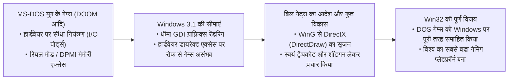

गेट्स ने अपनी टीम को DOS गेम्स के हार्डवेयर एक्सेस को Windows पर एमुलेट और तेज़ करने के लिए 'WinG' और बाद में 'DirectX' (प्रोजेक्ट मैनहट्टन) विकसित करने का आदेश दिया।

गेट्स ने स्वयं ट्रेंचकोट पहनकर और DOOM गेम के भीतर शॉटगन हाथ में लेकर एक प्रचार वीडियो बनाया, जिसमें उन्होंने घोषणा की कि Windows 95 ही गेमिंग का सर्वोच्च प्लेटफ़ॉर्म है। प्रोटेक्टेड मोड में हार्डवेयर एक्सेस को नियंत्रित करने का यह अनुभव बाद में Windows की शक्तिशाली मल्टीमीडिया कम्पैटिबिलिटी का आधार बना।

---

## अध्याय 4: आधुनिक Windows का विशाल दुर्ग — «AppCompat (Application Compatibility)»

Windows 95 के दौर में कम्पैटिबिलिटी पैच OS के विभिन्न मॉड्यूल्स में तदर्थ (ad-hoc) कोड के रूप में बिखरे हुए थे। लेकिन Windows 2000 और XP के दौर में सॉफ़्टवेयर की संख्या में भारी उछाल के साथ यह तरीका अव्यवहारिक हो गया, क्योंकि OS का अपना कोड दूसरों के बग्स को संभालने वाले कोड से भर गया था।

तब Microsoft के आर्किटेक्ट्स ने एक आधुनिक और शक्तिशाली कम्पैटिबिलिटी इंजन तैयार किया, जो आज के Windows 11 तक चला आ रहा है — **«Application Compatibility (AppCompat)» सबसिस्टम**।

### 4.1 AppCompat सबसिस्टम की समग्र संरचना

AppCompat सबसिस्टम **«एक ऐसा इंटेलिजेंट इंटरसेप्शन सिस्टम है जो प्रोसेस लोड होते ही एप्लिकेशन और OS कर्नेल के बीच में एक पारदर्शी छद्म परत (Shim) गतिशील रूप से जोड़ देता है»**।

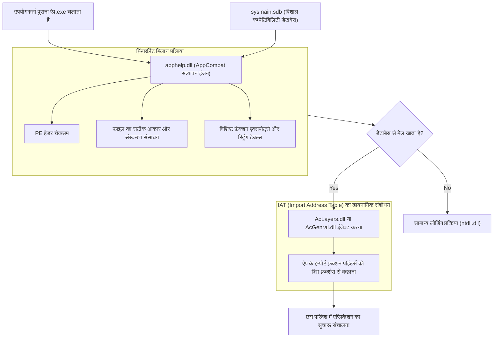

जब किसी EXE फ़ाइल पर डबल-क्लिक किया जाता है, तो Windows प्रोसेस निर्माण रूटीन (`ntdll.dll`) सीधे निष्पादन शुरू करने के बजाय पहले **`apphelp.dll`** को कॉल करता है।

`apphelp.dll` विशाल डेटाबेस **`sysmain.sdb`** को स्कैन करता है और जांचता है कि क्या इस बाइनरी को पहले से किसी विशेष सहायता की आवश्यकता के रूप में पहचाना गया है। यदि ऐसा है, तो OS लोडर मुख्य सिस्टम DLLs (`kernel32.dll` आदि) से पहले **`AcLayers.dll`** या **`AcGenral.dll`** को प्रोसेस के एड्रेस स्पेस में इंजेक्ट कर देता है।

### 4.2 शिम (Shim) इंजन: IAT हुकिंग द्वारा API प्रतिस्थापन का तंत्र

इंजेक्ट किया गया शिम इंजन एप्लिकेशन को कैसे नियंत्रित करता है? इसकी मुख्य तकनीक PE (Portable Executable) हेडर की **«IAT (Import Address Table) हुकिंग»** है।

जब कोई Windows प्रोग्राम किसी बाहरी DLL फ़ंक्शन (`GetVersionEx` आदि) को कॉल करता है, तो कंपाइल किए गए मशीन कोड में DLL का मेमोरी एड्रेस हार्डकोड नहीं होता। प्रोग्राम लोड होते समय OS लोडर DLLs के पते देखकर 'IAT' (फ़ंक्शन पॉइंटर्स की तालिका) में पते लिखता है। प्रोग्राम हमेशा इस IAT के माध्यम से ही APIs को कॉल करता है।

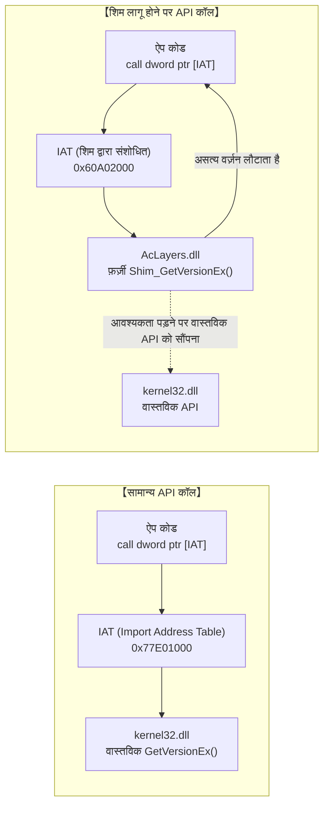

शिम इंजन इस व्यवस्था का लाभ उठाता है। प्रोग्राम निष्पादन शुरू करने से ठीक पहले शिम इंजन IAT के मेमोरी प्रोटेक्शन को `PAGE_READWRITE` में बदलता है और **«IAT में मौजूद वास्तविक फ़ंक्शन पॉइंटर को शिम इंजन के छद्म फ़ंक्शन पते से बदल देता है»**।

C/C++ वैचारिक कोड में यह इस प्रकार दिखाई देता है:

```c
// IAT हुकिंग द्वारा शिम इंजेक्शन का वैचारिक कोड
#include <windows.h>
#include <imagehlp.h>

// छद्म GetVersionEx फ़ंक्शन (शिम का वास्तविक रूप)
BOOL WINAPI Shim_GetVersionExA(LPOSVERSIONINFOA lpVersionInformation)
{
    // बुनियादी जानकारी प्राप्त करने के लिए वास्तविक API को कॉल करना
    typedef BOOL (WINAPI *PFN_GETVER)(LPOSVERSIONINFOA);
    HMODULE hKernel = GetModuleHandleA("kernel32.dll");
    PFN_GETVER pfnRealGetVer = (PFN_GETVER)GetProcAddress(hKernel, "GetVersionExA");
    
    BOOL bResult = pfnRealGetVer(lpVersionInformation);
    
    // 【छद्म रूप】
    // ऐप से झूठ बोलना कि वर्तमान OS Windows 95 (Major: 4, Minor: 0) है
    lpVersionInformation->dwMajorVersion = 4;
    lpVersionInformation->dwMinorVersion = 0;
    lpVersionInformation->dwBuildNumber = 950;
    lpVersionInformation->dwPlatformId = VER_PLATFORM_WIN32_WINDOWS;
    strcpy(lpVersionInformation->szCSDVersion, "");

    return TRUE; // ऐप बिना किसी संदेह के Windows 95 मानकर काम करता है
}

// PE बाइनरी के IAT को स्कैन करके हुक लगाने वाला रूटीन
void InstallShimHook(HMODULE hAppModule, LPCSTR targetDll, LPCSTR targetFunc, PVOID newFuncAddress)
{
    ULONG size;
    // PE हेडर से इम्पोर्ट डायरेक्टरी प्राप्त करना
    PIMAGE_IMPORT_DESCRIPTOR pImportDesc = (PIMAGE_IMPORT_DESCRIPTOR)
        ImageDirectoryEntryToData(hAppModule, TRUE, IMAGE_DIRECTORY_ENTRY_IMPORT, &size);

    while (pImportDesc->Name) {
        LPCSTR dllName = (LPCSTR)((PBYTE)hAppModule + pImportDesc->Name);
        if (_stricmp(dllName, targetDll) == 0) {
            // लक्षित DLL (जैसे kernel32.dll) के थंक टेबल की खोज
            PIMAGE_THUNK_DATA pThunk = (PIMAGE_THUNK_DATA)((PBYTE)hAppModule + pImportDesc->FirstThunk);
            while (pThunk->u1.Function) {
                PROC* ppfn = (PROC*)&pThunk->u1.Function;
                // अभीष्ट फ़ंक्शन पॉइंटर मिलने पर पता बदलना
                DWORD oldProtect;
                VirtualProtect(ppfn, sizeof(PROC), PAGE_READWRITE, &oldProtect);
                *ppfn = (PROC)newFuncAddress; // छद्म फ़ंक्शन का पता लिखना!
                VirtualProtect(ppfn, sizeof(PROC), oldProtect, &oldProtect);
                break;
            }
        }
        pImportDesc++;
    }
}
```

इस हुकिंग तंत्र की सहायता से डिस्क पर मौजूद एप्लिकेशन फ़ाइल में 1 बाइट का भी बदलाव किए बिना और OS कर्नेल को प्रभावित किए बिना, लक्षित ऐप को एक आदर्श आभासी अतीत के परिवेश में चलाना संभव हो जाता है।

### 4.3 रहस्यमयी बाइनरी फ़ाइल `sysmain.sdb` (शिम डेटाबेस)

AppCompat प्रणाली का केंद्र प्रत्येक Windows के `C:\Windows\AppPatch\` फ़ोल्डर में स्थित **`sysmain.sdb`** बाइनरी फ़ाइल है।

यह फ़ाइल Microsoft के मालिकाना SDB प्रारूप में है, जिसमें दुनिया भर के वाणिज्यिक सॉफ़्टवेयर, शेयरवेयर, गेम्स और कॉर्पोरेट टूल्स — **लाखों एप्लिकेशनों के निवारण उपाय** संचित हैं।

केवल फ़ाइल नाम `setup.exe` होने पर शिम लागू करने से आधुनिक प्रोग्राम्स में समस्या हो सकती है। इसलिए `sysmain.sdb` का मिलान इंजन बहुआयामी फ़िंगरप्रिंट का उपयोग करता है:

1. **फ़ाइल का नाम और पूर्ण पाथ**
2. **फ़ाइल का सटीक आकार (बाइट्स में)**
3. **PE हेडर का टाइमस्टैम्प (Linker Timestamp)**
4. **PE चेकसम (CheckSum)**
5. **वर्ज़न संसाधन विवरण (CompanyName, ProductName, FileVersion आदि)**
6. **विशिष्ट अनुभागों के हैश मान और एक्सपोर्ट फ़ंक्शन तालिका की संरचना**

यदि कोई उपयोगकर्ता 2001 का पुराना एनसाइक्लोपीडिया सीडी-रोम Windows 11 में डालता है, तो `apphelp.dll` तुरंत उसके फ़िंगरप्रिंट की पहचान करता है और `sysmain.sdb` से आवश्यक शिम्स (जैसे हीप अलाइनमेंट, रजिस्ट्री वर्चुअलाइजेशन आदि) एक साथ लागू कर देता है।

---

## अध्याय 5: प्रमुख शिम्स (छद्म तकनीकों) की सूची

Windows में सैकड़ों प्रकार के शिम्स उपलब्ध हैं, जो अतीत के प्रोग्रामरों द्वारा की गई गलतियों को सुधारने के लिए तैयार किए गए हैं।

### 5.1 `VersionLie`: "मैं वही Windows 95 हूँ जो आप चाहते हैं"

सबसे पुराना और सर्वाधिक उपयोग किया जाने वाला शिम **`VersionLie`** (संस्करण छद्मीकरण) है।

प्रोग्राम्स शुरू होते समय OS की जांच के लिए `GetVersionEx` को कॉल करते थे। लेकिन कई प्रोग्राम्स में ऐसा कोड लिखा था:

```c
// दोषपूर्ण वर्ज़न जाँच का उदाहरण
OSVERSIONINFO vi;
GetVersionEx(&vi);

// केवल Windows 95 की अपेक्षा करने वाला कोड
if (vi.dwMajorVersion == 4 && vi.dwMinorVersion == 0) {
    // सामान्य प्रारंभ
} else {
    MessageBox(NULL, "यह सॉफ़्टवेयर केवल Windows 95 के लिए है। नए OS पर काम नहीं करेगा।", "त्रुटि", MB_OK);
    ExitProcess(1); // स्वयं बंद हो जाना!
}
```

यह सॉफ़्टवेयर भविष्य के उत्कृष्ट ऑपरेटिंग सिस्टमों पर केवल इसलिए चलने से मना कर देता था क्योंकि MajorVersion 4 नहीं था।

यहाँ `VersionLie` लागू होता है। जब ऐप `GetVersionEx` को कॉल करता है, तो Windows 11 गंभीरता से उत्तर देता है: **"वर्तमान OS Windows 95 (Major: 4, Minor: 0) है"**। ऐप पूरी तरह संतुष्ट होकर आधुनिक मल्टी-कोर CPU और NVMe SSD पर Windows 95 समझकर सुचारू रूप से चलना शुरू कर देता है।

### 5.2 `EmulateGetDiskFreeSpace`: 2GB से अधिक डिस्क क्षमता पर ओवरफ़्लो से बचाव

1990 के दशक में हार्ड डिस्क सैकड़ों मेगाबाइट से 1 गीगाबाइट के आसपास होती थी। तत्कालीन Win32 API `GetDiskFreeSpace` 32-बिट हस्ताक्षरित पूर्णांक (signed integer) लौटाता था।

खाली स्थान की गणना के लिए कोड इस प्रकार था:

$$ \text{FreeBytes} = \text{SectorsPerCluster} \times \text{BytesPerSector} \times \text{NumberOfFreeClusters} $$

लेकिन जैसे ही हार्ड डिस्क की क्षमता **2 गीगाबाइट ($2^{31} - 1$ बाइट्स)** से अधिक हुई, 32-बिट पूर्णांक ओवरफ़्लो होकर **ऋणात्मक संख्या (माइनस सैकड़ों MB)** में बदल गया।

परिणामस्वरूप, बड़े डिस्क वाले आधुनिक पीसी पर पुराने गेम्स या सॉफ़्टवेयर इंस्टॉल करते समय इंस्टॉलर चेतावनी देता था: "केवल -500MB खाली स्थान बचा है। डिस्क स्पेस अपर्याप्त है" और इंस्टॉलेशन रोक देता था।

इस समस्या के लिए **`EmulateGetDiskFreeSpace`** शिम बनाया गया। जब ऐप खाली स्थान पूछता है, तो चाहे वास्तविक ड्राइव में कितने भी टेराबाइट खाली क्यों न हों, यह शिम उत्तर देता है: **"वर्तमान में खाली स्थान ठीक 2,147,151,872 बाइट्स (लगभग 1.99GB) है"**। ऐप संतुष्ट होकर सफलतापूर्वक इंस्टॉल हो जाता है।

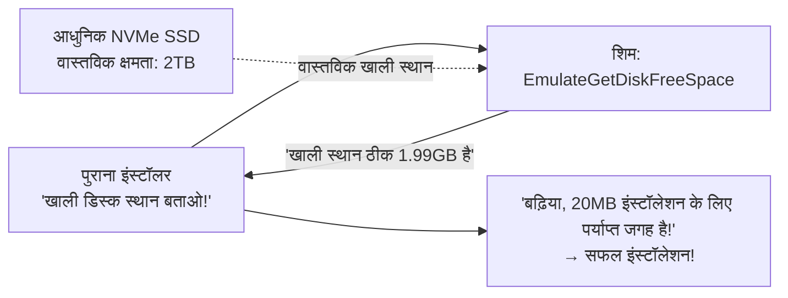

### 5.3 `VirtualRegistry` और `VirtualStore`: UAC लागू होने पर पुनर्निर्देशन

2006 के Windows Vista में सुरक्षा मॉडल में भारी बदलाव आया: **«UAC (User Account Control)»** की शुरुआत।

इससे पहले Windows 95/98 या XP में उपयोगकर्ता लगभग हमेशा प्रशासक (Administrator) के रूप में काम करते थे, और ऐप्स बिना किसी झिझक के `C:\Program Files` या रजिस्ट्री की `HKEY_LOCAL_MACHINE\Software` कुंजी में सेटिंग्स लिखते थे।

लेकिन Vista के बाद सामान्य यूज़र अनुमतियों से सिस्टम क्षेत्रों में लिखने पर रोक (`ACCESS_DENIED`) लगा दी गई। इसे सीधे लागू करने पर लाखों पुराने ऐप्स क्रैश हो जाते।

इसके समाधान के रूप में **«VirtualStore (फ़ाइल एवं रजिस्ट्री वर्चुअलाइजेशन शिम)»** पेश किया गया।

जब कोई पुराना ऐप प्रशासक विशेषाधिकारों के बिना `C:\Program Files\Game\save.dat` में लिखने का प्रयास करता है, तो OS त्रुटि लौटाने के बजाय उस लेखन अनुरोध को गुप्त रूप से उपयोगकर्ता के सुरक्षित फ़ोल्डर में पुनर्निर्देशित कर देता है:  
`C:\Users\<UserName>\AppData\Local\VirtualStore\Program Files\Game\save.dat`।

ऐप को लगता है कि वह सिस्टम फ़ोल्डर में ही लिख रहा है, जबकि वह सुरक्षित सैंडबॉक्स में अलग रहकर काम करता रहता है।

### 5.4 `DXPrimaryBltPunt`: 2D DirectDraw गेम्स के रंग और रिफ्रेश रेट का समायोजन

Windows 95 से XP के शुरुआती दौर के 2D गेम्स (जैसे 'Age of Empires') DirectDraw का उपयोग करके स्क्रीन रेंडर करते थे। ये 256 रंगों (8-बिट पैलेट) पर आधारित थे और VRAM के प्राइमरी सरफ़ेस के पैलेट को सीधे संशोधित करके दृश्य प्रभाव उत्पन्न करते थे।

लेकिन आधुनिक GPUs और Windows का ग्राफ़िक्स स्टैक (DWM) पूरी स्क्रीन को 32-बिट TrueColor टेक्सचर के रूप में 3D पाइपलाइन से कंपोज़ करते हैं। 256 रंगों का प्रत्यक्ष संशोधन अब संभव नहीं था।

बिना किसी सुरक्षा के आधुनिक पीसी पर पुराना DirectDraw गेम चलाने पर रंग विकृत होकर अजीब दिखाई देते थे, या रिफ्रेश रेट की विसंगति के कारण गेम अत्यधिक तेज़ गति से भागने लगता था।

**`DXPrimaryBltPunt`** और **`ForceDirectDrawEmulation`** जैसे ग्राफ़िक्स शिम्स DirectDraw के पुराने कमांड्स को इंटरसेप्ट करते हैं, उन्हें पृष्ठभूमि में आधुनिक Direct3D टेक्सचर्स में बदलते हैं, और DWM के साथ सुरक्षित रूप से तालमेल बिठाते हैं। 30 साल पुराने पिक्सेल गेम्स का 4K स्क्रीन पर मूल रंगों में दिखना इसी छद्म तकनीक की देन है।

---

## अध्याय 6: 64-बिट और ARM की ओर महायात्रा — WOW64 और एमुलेशन की कला

जब CPU का आर्किटेक्चर ही बदल जाता है, तो केवल सतही API हुक्स पर्याप्त नहीं होते। इस ऐतिहासिक चुनौती का सामना Windows ने OS के भीतर "एक दूसरा संपूर्ण OS शामिल करके" किया।

### 6.1 NTVDM से WOW64 तक: फ़ाइल सिस्टम और रजिस्ट्री का दोहरा संसार

16-बिट से 32-बिट में बदलाव के समय Windows NT ने **NTVDM (NT Virtual DOS Machine)** प्रदान किया, जिसने 8086 प्रोसेसर के वर्चुअल 86 मोड का उपयोग करके DOS और Win16 ऐप्स को चलाया।

और 2000 के दशक के मध्य में जब AMD64 (x64) के साथ 32-बिट से 64-बिट का रूपांतरण हुआ, तो Microsoft ने **«WOW64 (Windows 32-bit On Windows 64-bit)»** सबसिस्टम पेश किया।

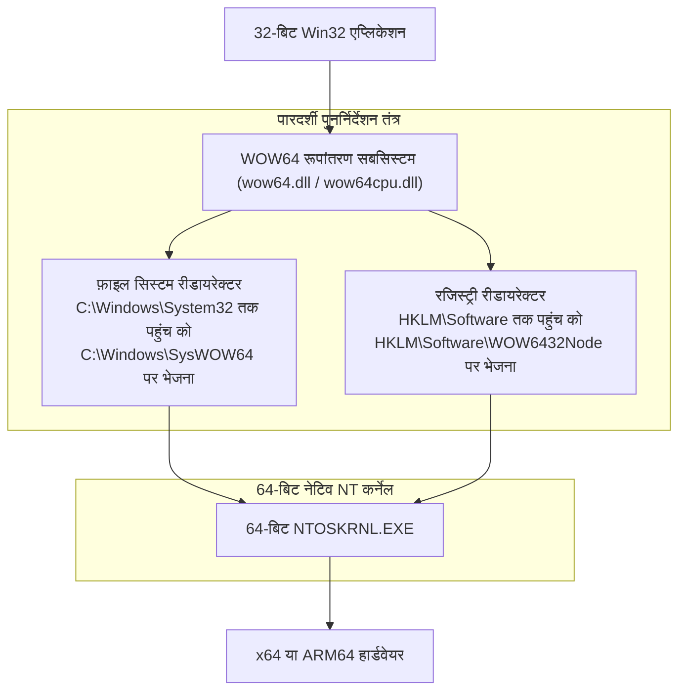

WOW64 की सबसे बड़ी विशेषता यह है कि यह 32-बिट एप्लिकेशनों को **«फ़ाइल सिस्टम और रजिस्ट्री का पूर्ण समानांतर दोहरा संसार»** दिखाता है:

- **फ़ाइल सिस्टम रीडायरेक्टर**:  
  64-बिट OS में शुद्ध 64-बिट सिस्टम DLLs `C:\Windows\System32` में होती हैं। जब कोई पुराना 32-बिट ऐप इस फ़ोल्डर तक पहुँचने का प्रयास करता है, तो OS पृष्ठभूमि में पारदर्शी रूप से उसे `C:\Windows\SysWOW64` (जहाँ 32-बिट DLLs रखी होती हैं) पर भेज देता है।
- **रजिस्ट्री रिफ्लेक्शन और रीडायरेक्शन**:  
  इसी प्रकार, जब कोई 32-बिट ऐप `HKEY_LOCAL_MACHINE\Software` में लिखता है, तो WOW64 उसे स्वचालित रूप से `HKEY_LOCAL_MACHINE\Software\WOW6432Node` पर पुनर्निर्देशित कर देता है।

इस समानांतर संसार के कारण 1998 का 32-बिट सॉफ़्टवेयर यह जाने बिना कि वह 64-बिट OS पर चल रहा है, अपने परिचित System32 और रजिस्ट्री के साथ सामान्य रूप से काम करता रहता है।

### 6.2 ARM64 पर स्थानांतरण और Prism एमुलेटर

वर्तमान में सबसे महत्वपूर्ण बदलाव x86/x64 से **ARM64 (Qualcomm Snapdragon X Elite आदि)** की ओर हो रहा है।

2012 में Microsoft ने 'Windows RT' जारी किया था और ARM पर पुराने Win32 ऐप्स को न चलाने की 'Apple जैसी नीति' अपनाई थी। परिणाम क्या हुआ? बाज़ार ने Windows RT को नकार दिया और Microsoft को भारी वित्तीय नुकसान हुआ। इस सबक ने Windows टीम को समझाया: "ARM पर भी पुराने Win32 ऐप्स न चला पाने वाला Windows वास्तव में Windows नहीं है।"

नवीनतम Windows 11 on ARM में उन्नत बाइनरी ट्रांसलेशन इंजन **«Prism»** शामिल है। Prism x86/x64 के मशीन कोड का वास्तविक समय में विश्लेषण करता है और उसे ARM64 निर्देशों में JIT कंपाइल करता है, साथ ही अनुकूलित कोड को कैश में सहेजकर लगभग नेटिव कोड जैसी उच्च गति प्रदान करता है।

CPU का आर्किटेक्चर चाहे कितना भी भिन्न क्यों न हो, "डबल-क्लिक करने पर पुराना सॉफ़्टवेयर चलना चाहिए" का अनुभव हमेशा सुरक्षित रखा गया है।

---

## अध्याय 7: तीन भिन्न डिज़ाइन दर्शन — तुलना: Windows बनाम Apple (macOS) बनाम Linux

"पुराने एप्लिकेशनों के साथ कैसा व्यवहार किया जाए?" इस प्रश्न पर विश्व के तीन प्रमुख ऑपरेटिंग सिस्टमों ने पूरी तरह भिन्न उत्तर दिए हैं। इन दर्शनों की तुलना करने से Windows की अनूठी स्थिति स्पष्ट हो जाती है।

### 7.1 Apple (शल्य-चिकित्सकीय विच्छेदन): प्रगति के लिए अतीत को नष्ट करना

स्टीव जॉब्स से लेकर टिम कुक के वर्तमान दौर तक Apple का दर्शन **«भविष्य के उपयोगकर्ता अनुभव के लिए अतीत की विरासतों को निर्ममता से मिटाना (Scorched Earth Policy)»** रहा है।

Apple का इतिहास नाटकीय आर्किटेक्चरल विच्छेदनों से भरा हुआ है:
- **Classic Mac OS का पूर्ण त्याग**: Mac OS 9 से Mac OS X (NeXT-आधारित Unix) में अनिवार्य बदलाव। पुरानी API 'Carbon' को कुछ समय बाद पूरी तरह समाप्त कर दिया गया।
- **हार्डवेयर के तीव्र परिवर्तन**: 680x0 → PowerPC → Intel x86 → Apple Silicon (M सीरीज़)। प्रत्येक बदलाव पर अस्थायी एमुलेटर दिया गया, लेकिन 3 से 5 वर्षों में उसे पूरी तरह हटाकर पुरानी बाइनरीज़ को समाप्त कर दिया गया।
- **macOS Catalina में 32-बिट ऐप्स का अंत**: 2019 के macOS Catalina में 32-बिट निष्पादन परिवेश पूरी तरह हटा दिया गया। कई पुराने ऑडियो प्लगइन्स और गेम्स हमेशा के लिए बेकार हो गए।

Apple का दृष्टिकोण स्पष्ट है: "डेवलपर्स को हमेशा नवीनतम Xcode का उपयोग करना चाहिए, Swift में कोड फिर से लिखना चाहिए, और नवीनतम macOS के लिए पुनः कंपाइल करना चाहिए।" इससे macOS का कोडबेस हमेशा स्वच्छ और आधुनिक रहता है, लेकिन डेवलपर्स और उपयोगकर्ताओं पर निरंतर पुनर्लेखन का भारी बोझ पड़ता है।

### 7.2 Linux (लाइनस का आदेश): «Never break userspace!» का प्रकाश और छाया

ओपन सोर्स दुनिया का नेतृत्व करने वाले लाइनस टोरवाल्ड्स (Linus Torvalds) Linux कर्नेल के विकास में Windows टीम जैसा ही एक सख्त नियम लागू करते हैं: **«Never break userspace! (यूज़रस्पेस को कभी न तोड़ें!)»**।

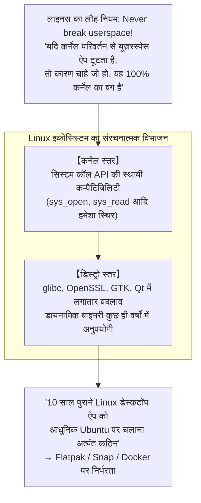

यदि किसी कर्नेल पैच से यूज़रस्पेस का कोई प्रोग्राम काम करना बंद कर देता है, तो लाइनस अत्यधिक क्रोधित होकर उस पैच को तुरंत वापस ले लेते हैं। इस मामले में Linux कर्नेल का दर्शन Windows के समान है।

लेकिन Linux डेस्कटॉप में Windows जैसा कोई केंद्रीय मध्यस्थ नहीं है। कर्नेल सिस्टम कॉल स्थिर होने के बावजूद डिस्ट्रो स्तर की शेयर्ड लाइब्रेरीज़ (`glibc`, `libssl`, GUI टूलकिट्स) लगातार कम्पैटिबिलिटी तोड़ती रहती हैं। इसलिए **«10 वर्ष पहले डायनामिक लिंक से बनी बाइनरी को आधुनिक Ubuntu पर चलाना अत्यंत कठिन है»**। Linux ने कर्नेल स्तर पर कम्पैटिबिलिटी की रक्षा की, लेकिन इकोसिस्टम के विखंडन के कारण वह 30 साल पुराने सॉफ़्टवेयर चलाने के स्तर तक नहीं पहुंच सका।

### 7.3 Windows (संचयी समावेशन): निरंतर परतों का निर्माण

इसके विपरीत Windows का मार्ग **«संचयी समावेशन (Cumulative Inclusion)»** रहा है।

पुरानी APIs को कभी न त्यागते हुए भूगर्भीय परतों की तरह नई परतें ऊपर जोड़ी गईं: Win16 के ऊपर Win32, Win32 के ऊपर .NET, उसके ऊपर WinRT/UWP, और जब UWP विफल हुआ तो पुनः Win32 की नींव पर Windows App SDK (WinUI 3) का निर्माण।

परिणामस्वरूप Windows दुनिया का सबसे जटिल और विशाल कोडबेस वाला प्लेटफ़ॉर्म बन गया, लेकिन बदले में इसने **«हर युग के सॉफ़्टवेयर का शांतिपूर्वक सह-अस्तित्व»** सुनिश्चित किया।

| तुलनात्मक बिंदु | Microsoft (Windows) | Apple (macOS) | Linux (डेस्कटॉप) |
| :--- | :--- | :--- | :--- |
| **मूल कम्पैटिबिलिटी दर्शन** | **संचयी समावेशन (Accumulation)**<br/>अतीत को पूरी तरह समेटना | **शल्य-चिकित्सकीय विच्छेदन (Disruption)**<br/>नियमित रूप से अतीत को मिटाना | **कर्नेल संरक्षण और अहस्तक्षेप**<br/>कर्नेल स्थिर, ऊपरी परतें खंडित |
| **सर्वोपरि निर्देश (Prime Directive)** | "Don't break old apps" | "Embrace the modern platform" | "Never break userspace" (कर्नेल) |
| **कम्पैटिबिलिटी की समय-सीमा** | **30 से अधिक वर्ष** (Win32/DOS) | **3 से 5 वर्ष** (संक्रमण काल समाप्त होते ही हटाना) | कर्नेल दीर्घकालिक, GUI ऐप्स अल्पकालिक |
| **32-बिट बाइनरी की वर्तमान स्थिति** | **नवीनतम Win11 पर पूर्णतः कार्यरत** (WOW64) | **Catalina (2019) में पूरी तरह समाप्त** | मल्टी-आर्क लाइब्रेरीज़ के साथ आंशिक रूप से संभव |
| **डेवलपर्स से अपेक्षा** | कुछ किए बिना भी सॉफ़्टवेयर चलता रहता है | नियमित रीकंपाइलेशन और कोड पुनर्लेखन | प्रत्येक डिस्ट्रिब्यूशन के लिए पुनः पैकेजिंग |
| **आर्किटेक्चर की शुद्धता** | व्यावहारिक और विशाल, करोड़ों पंक्तियों की परतें | अत्यंत स्वच्छ, आधुनिक और सुव्यवस्थित | कर्नेल मॉड्युलर, लेकिन यूज़रस्पेस खंडित |

---

## अध्याय 8: प्लेटफ़ॉर्म अर्थशास्त्र — कम्पैटिबिलिटी «सबसे मजबूत रणनीतिक खाई (Moat)» क्यों है?

बिल गेट्स और Microsoft के प्रबंधन ने विकास दल पर इतनी कठिन और व्यावहारिक इंजीनियरिंग का दबाव क्यों डाला? इसका उत्तर इंजीनियरिंग के सौंदर्य में नहीं, बल्कि **«व्यावसायिक मॉडल और प्लेटफ़ॉर्म अर्थशास्त्र»** में निहित है।

### 8.1 बिल गेट्स का बिजनेस मॉडल: OS का मूल्य "चलने वाले सॉफ़्टवेयर का कुल योग" है

बिल गेट्स ने शुरुआत से ही प्लेटफ़ॉर्म व्यवसाय के सार को समझ लिया था:

> **प्लेटफ़ॉर्म मूल्य प्रमेय**:  
> किसी ऑपरेटिंग सिस्टम का मूल्य उसकी अपनी एकल विशेषताओं से निर्धारित नहीं होता।  
> वह **«उस प्लेटफ़ॉर्म पर चलने वाली दुनिया भर की एप्लिकेशन संपत्तियों के कुल योग»** से निर्धारित होता है।

चाहे कोई नया OS कितना भी आधुनिक और सुंदर क्यों न हो, यदि उस पर उपयोगकर्ता के दैनिक कार्य के सॉफ़्टवेयर नहीं चलते, तो बाज़ार में उसका मूल्य शून्य है। उपयोगकर्ता OS नहीं खरीदता, बल्कि उसके भीतर चलने वाले सॉफ़्टवेयर और उससे मिलने वाली उत्पादकता खरीदता है।

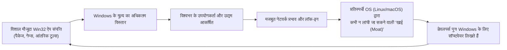

जब तक बैकवर्ड कम्पैटिबिलिटी 100% बनी रहती है, पिछले 30 वर्षों में दुनिया भर के प्रोग्रामरों द्वारा Windows के लिए लिखी गई खरबों डॉलर मूल्य की सॉफ़्टवेयर संपत्ति **स्वचालित रूप से अगली पीढ़ी के Windows का अतिरिक्त मूल्य** बन जाती है।

प्रतिस्पर्धी चाहे कितनी भी तकनीकी श्रेष्ठता का दावा करें, "हमारी कंपनी का 20 साल पुराना ऑर्डर मैनेजमेंट सिस्टम आपके OS पर नहीं चलता" कहते ही बातचीत समाप्त हो जाती है। बैकवर्ड कम्पैटिबिलिटी ही Microsoft की सबसे अभेद्य रणनीतिक खाई (Moat) थी।

### 8.2 कॉर्पोरेट बाज़ार में पूर्ण लॉक-इन

विशेष रूप से एंटरप्राइज बाज़ार में इस रणनीति ने चमत्कारी प्रभाव दिखाया।

बड़े उद्यमों, सरकारी विभागों, कारखानों और वित्तीय संस्थानों में पिछले दशकों में करोड़ों डॉलर के निवेश से बनाए गए आंतरिक बिज़नेस सिस्टम्स (जैसे VB6 या C++ टूल्स) चल रहे हैं। इनके मूल विक्रेता या तो बंद हो चुके हैं या उनके दस्तावेज़ खो चुके हैं, और वे "अछूती विरासत" बन चुके हैं।

यदि Windows कम्पैटिबिलिटी तोड़कर यह कहता कि "यह सॉफ़्टवेयर अब नहीं चलेगा; आधुनिक वेब तकनीक पर इसे दोबारा बनाएं", तो कॉर्पोरेट अधिकारी क्रोधित होकर अपग्रेड रोक देते या अन्य विकल्प तलाशते।

लेकिन Windows ने जादू की छड़ी घुमाई और कहा: "कुछ भी बदलने की आवश्यकता नहीं है। नया पीसी खरीदें, यह वैसे ही चलता रहेगा।" कॉर्पोरेट अधिकारियों के लिए इससे अधिक सुरक्षित और व्यावहारिक प्रस्ताव नहीं हो सकता था। इस प्रकार दुनिया भर के बड़े उद्यम Windows इकोसिस्टम में हमेशा के लिए बंध गए।

### 8.3 नवाचार को रोकने वाला «सफलता का जाल (Success Trap)»

परंतु यही भारी सफलता विडंबनापूर्ण रूप से Microsoft के लिए एक **«सफलता का जाल (Success Trap)»** बन गई।

2010 के दशक में स्मार्टफ़ोन क्रांति के समय Microsoft ने Windows को आधुनिक बनाने के लिए एक सुरक्षित और सैंडबॉक्स्ड एप्लिकेशन मानक «UWP (Universal Windows Platform)» पेश किया और Win32 को चरणबद्ध तरीके से हटाने का प्रयास किया।

लेकिन डेवलपर्स और उद्यमों ने UWP की उपेक्षा की: "हम सीमित सुविधाओं वाले नए फ़्रेमवर्क पर अपना कोड क्यों दोबारा लिखें? हमारा मौजूदा Win32 ऐप तो Windows 10 और 11 पर भी बेहतरीन काम कर रहा है!"।

विडंबना यह थी कि **«Win32 इतना मजबूत और सर्वव्यापी था कि स्वयं Microsoft भी उसे समाप्त नहीं कर सका»**। अंततः Microsoft को UWP का विचार छोड़ना पड़ा, Win32 ऐप्स को स्टोर में पैकेजिंग की अनुमति देनी पड़ी, और अपने नवीनतम UI टूलकिट WinUI 3 को भी Win32 के आधार पर ही बनाना पड़ा। स्वयं बनाई गई मजबूत बैकवर्ड कम्पैटिबिलिटी ही उनके अपने नवाचार के मार्ग में सबसे बड़ी दीवार बन गई।

---

## अध्याय 9: गौरव की कीमत — बढ़ता तकनीकी ऋण और सुरक्षा की चुनौतियां

दूसरों के बग्स को संभालना और अतीत की विरासतों की रक्षा करना मुफ्त में नहीं हुआ। इसके बदले में Windows विकास दल को सबसे भीषण «तकनीकी ऋण (Technical Debt)» का सामना करना पड़ रहा है।

### 9.1 करोड़ों पंक्तियों का कोडबेस और खगोलीय परीक्षण मैट्रिक्स

आज Windows का सोर्स कोड **सैकड़ों मिलियन पंक्तियों** तक पहुँच चुका है। और सबसे भयानक है प्रत्येक नए बिल्ड के लिए आवश्यक खगोलीय परीक्षण मैट्रिक्स (Test Matrix):

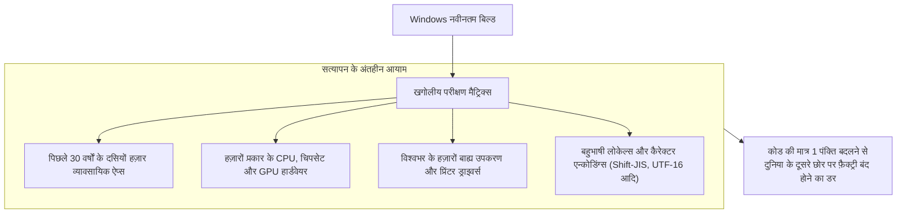

Windows के कोर में केवल एक पॉइंटर चेक जोड़ने या लॉक के क्रम को बदलने से दुनिया के किसी कारखाने की 30 साल पुरानी नियंत्रण प्रणाली डेडलॉक होकर बंद हो सकती है। इस भय से निपटने के लिए Microsoft विशाल प्रयोगशालाओं में हज़ारों वास्तविक पीसी और वर्चुअल मशीनों पर दशकों पुराने सॉफ़्टवेयर को स्वचालित रूप से चलाकर परीक्षण करता रहता है।

### 9.2 पुरानी APIs द्वारा उत्पन्न सुरक्षा छिद्र

तकनीकी ऋण का सबसे गंभीर पहलू **सुरक्षा (Security)** है।

1990 के दशक में डिज़ाइन की गई कई पुरानी Win32 APIs इंटरनेट युग से पहले के शांत दौर में बनी थीं, जिनमें बफ़र ओवरफ़्लो सुरक्षा और अनुमतियों की अवधारणाएं बहुत कमजोर थीं। लेकिन कम्पैटिबिलिटी बनाए रखने के लिए इन खतरनाक APIs को हटाया नहीं जा सकता।

हमलावर विशेषाधिकार बढ़ाने और सैंडबॉक्स से बाहर निकलने के लिए इन्हीं पुरानी APIs और कम्पैटिबिलिटी लेयर्स की दरारों को निशाना बनाते हैं। अतीत के ऐप्स को बचाने की दयालुता ही OS के समग्र हमले के दायरे (Attack Surface) को बढ़ा देती है।

### 9.3 Longhorn परियोजना का पतन और «MinWin» की ओर रीफ़ैक्टरिंग

कम्पैटिबिलिटी और नई सुविधाओं के अंतहीन संचय का संकट 2000 के दशक की शुरुआत में **«Longhorn परियोजना»** के दौरान चरम पर पहुँच गया था।

Windows XP के उत्तराधिकारी के रूप में विकसित हो रहा Longhorn अत्यधिक जटिल और अनियंत्रित कोड का जाल बन गया था। बिल्ड रोज़ाना टूटते थे, विकास की गति शून्य हो गई थी, और परियोजना पूरी तरह संकट में पड़ गई थी।

2004 में Microsoft ने Longhorn को रीसेट करने का कठोर निर्णय लिया। हज़ारों इंजीनियरों ने वर्षों के कोड को छोड़ दिया और अपेक्षाकृत स्थिर 'Windows Server 2003 SP1' के आधार से फिर से शुरुआत की (जो बाद में Windows Vista बना)।

इस विफलता के बाद Windows टीम ने कोर कर्नेल को **«MinWin»** नामक स्वतंत्र मॉड्यूल में अलग किया और कम्पैटिबिलिटी लेयर्स के साथ जुड़ाव को कम किया। Windows का आज भी सुचारू रूप से चलना इसी आर्किटेक्चरल पुनर्गठन का परिणाम है।

---

## निष्कर्ष: व्यावहारिक इंजीनियरों का गौरवगान — निरंतर संचालन के चमत्कार पर टिकी आधुनिक सभ्यता

कार्यालयों के पीसी, अस्पतालों के मेडिकल रिकॉर्ड टर्मिनल्स, बैंकों के एटीएम, रेलवे संचालन प्रणालियां और कारखानों की मशीनें — हमारे आधुनिक बुनियादी ढांचे के मूल में लगभग हर जगह Windows धड़क रहा है।

यदि Microsoft किताबी सुंदर डिज़ाइन का अंधभक्त होता और Apple की तरह हर कुछ वर्षों में पुरानी संपत्तियों को मिटा देता, तो आज दुनिया कैसी होती?

दुनिया भर के अनगिनत कारखाने बंद हो जाते, मध्यम और छोटे उद्यम बार-बार के सिस्टम नवीनीकरण खर्च से दिवालिया हो जाते, और स्वास्थ्य व नागरिक सेवाएं संकट में पड़ जातीं। आधुनिक डिजिटल समाज का बिना रुके आगे बढ़ते रहना इसलिए संभव हुआ है क्योंकि Windows ने **«दुनिया भर के प्रोग्रामरों की चूकों, गलतफहमियों, बग्स और पुरानी विरासतों को अपने कंधों पर चुपचाप उठाए रखा है»**।

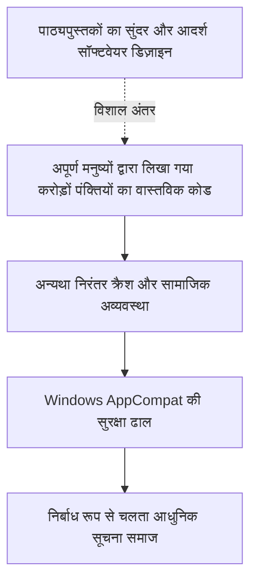

रेमंड चेन और Windows विकास दल के इंजीनियरों के लिए अपने स्वच्छ कोड को दूसरों के बग्स को संभालने वाले कोड से भरना कोई ग्लैमरस काम नहीं था। यह न तो शोध पत्रों में प्रशंसित होने वाला कोई सुरुचिपूर्ण एल्गोरिदम था और न ही सिलिकॉन वैली का कोई फैशनेबल नवाचार।

लेकिन क्या यही **«व्यावसायिक इंजीनियरिंग (Professional Engineering)»** का सच्चा और सर्वोच्च रूप नहीं है?

सच्ची इंजीनियरिंग किसी निष्फल प्रयोगशाला में सुंदर समीकरणों को निहारना नहीं है; बल्कि धूल और कीचड़ से भरे वास्तविक संसार में अपूर्ण मनुष्यों द्वारा बनाए गए तंत्रों का तालमेल बिठाना है, और इस चमत्कार को बनाए रखना है कि **«जो कल चल रहा था, वह आज भी, कल भी और दस साल बाद भी निश्चित रूप से चलता रहेगा»**।

"पुराने ऐप्स को कभी न तोड़ें" — इस दृढ़ लौह नियम और अज्ञात प्रोग्रामरों के अथक परिश्रम की नींव पर हमारा आधुनिक डिजिटल समाज आज भी ऐसे कार्य कर रहा है जैसे यह सबसे स्वाभाविक बात हो।
