## Pendahuluan: Apa Hakikat Sejati dari Sistem Operasi? — "Desain Elegan" atau "Pragmatisme Operasional"?

Jika kita membuka buku teks ilmu komputer perguruan tinggi atau risalah klasik tentang rekayasa perangkat lunak, kita akan selalu disuguhi cita-cita yang memikat: "abstraksi yang bersih", "pemisahan tanggung jawab (separation of concerns)", dan "desain API yang ortogonal". Kita diajarkan bahwa sistem operasi (OS) harus menjadi penengah yang suci dan murni, yang tugas utamanya adalah menyembunyikan kerumitan perangkat keras dan menyediakan antarmuka yang bersih, seragam, serta intuitif bagi aplikasi.

Namun, begitu kita melangkah keluar dari menara gading akademis dan memasuki medan pertempuran sistem operasi desktop komersial di dunia nyata, cita-cita murni tersebut hancur berkeping-keping. Pasalnya, dalam sejarah komputer pribadi, raksasa yang meraih kesuksesan komersial paling mutlak dan menguasai miliaran PC di seluruh penjuru bumi — Windows — justru mewujudkan filosofi yang berada di kutub berlawanan dari estetika buku teks: **sebuah pragmatisme tanpa kompromi yang nyaris berada di batas kegilaan**.

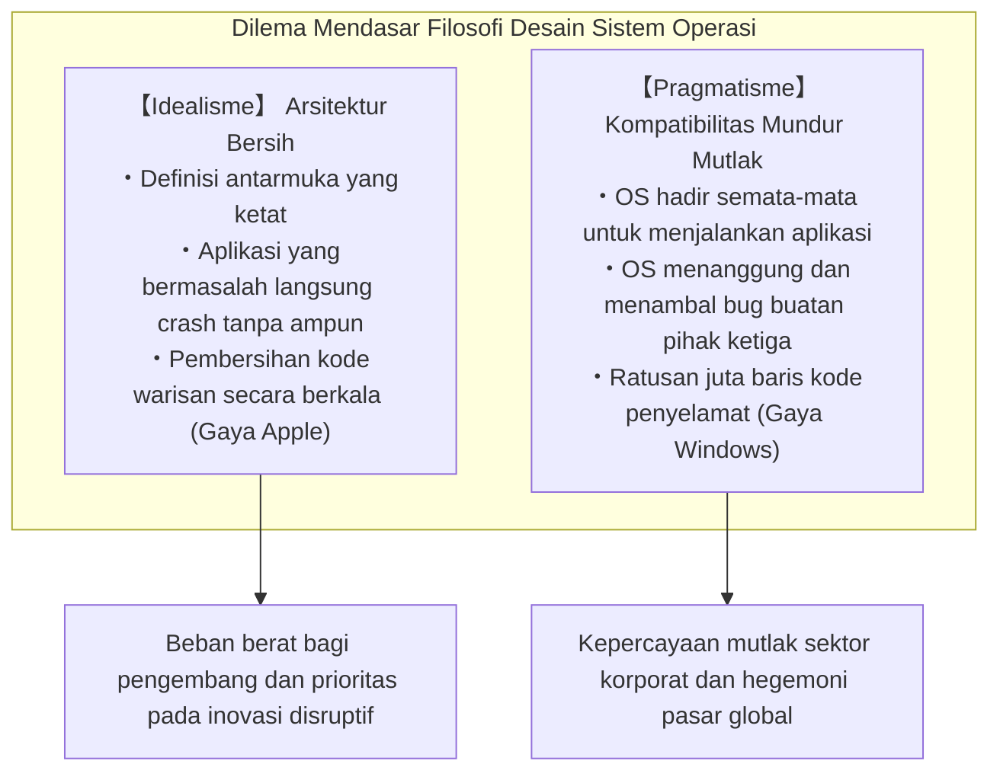

Di antara seluruh sistem operasi yang ada di muka bumi, tidak ada satu pun yang memiliki obsesi sedalam dan sefanatik Windows terhadap warisan masa lalu. CD-ROM game rilisan tahun 1995, aplikasi akuntansi perusahaan yang ditulis pada awal 1990-an dengan Visual Basic 3.0 atau C++, peninggalan era DOS, hingga utilitas kuno yang beroperasi dengan meretas perilaku internal tak terdokumentasi... luar biasa banyaknya software tersebut yang masih dapat terbuka dan berjalan mulus tanpa kendala apa pun di atas Windows 11 modern di pertengahan dekade 2020-an.

Bagi masyarakat awam, hal ini dipandang sebagai hal yang lumrah: "software-nya memang bisa jalan". Namun, bagi para pemrogram sistem yang pernah melakukan rekayasa balik (reverse engineering) terhadap kode internal Windows dan menatap langsung ke dalam jurang terdalamnya, mereka semua terpana dan bergidik. Apa yang tersembunyi di sana bukanlah sihir, melainkan **lapisan geologis yang menumpuk selama lebih dari 30 tahun: ratusan ribu baris kode perkecualian, pemalsuan API dinamis, dan mekanisme di mana OS sendiri berbohong kepada aplikasi (yang disebut Shim)** — semuanya dibangun oleh para insinyur Microsoft demi menyelamatkan ribuan bug, pelanggaran spesifikasi, kerusakan memori, dan *undefined behavior* dari para pengembang pihak ketiga.

Mengapa Microsoft bersedia melangkah sejauh itu untuk memikul beban kode cacat buatan orang lain di pundak sistem operasinya dan terus menjaganya agar tetap hidup?  
Mengapa Microsoft tidak mengambil jalan seperti Apple yang dengan tegas memangkas masa lalu demi kebaruan arsitektur?  
Dan bagaimana rekayasa perangkat lunak yang tampak gila ini berhasil melontarkan Windows menjadi benteng pertahanan platform terkuat dalam sejarah teknologi dunia?

Artikel ini adalah sebuah dokumen teknis definitif dan komprehensif yang memadukan kesaksian para pemrogram legendaris Microsoft, data rekayasa balik dari struktur biner PE dan kernel NT, serta sejarah strategi platform TI, guna menyingkap secara tuntas aturan mutlak tertinggi yang mengatur semesta Windows: **"Jangan pernah rusak aplikasi lama (Don't break old apps)"**.

---

## Bab 1: "Aturan Mutlak (Prime Directive)" Menurut Dua Sumber Legendaris

Obsesi terhadap kompatibilitas yang tertanam kuat dalam tim pengembang Windows bukanlah khayalan atau asumsi pengamat dari luar. Hal ini diungkapkan secara blak-blakan oleh dua pemrogram legendaris yang langsung menulis kodenya di garis depan dan menentukan arsitektur sistem tersebut.

### 1.1 Raymond Chen dan *The Old New Thing*

Di dalam tim pengembang Windows Microsoft, ada seorang tokoh yang telah dihormati sebagai legenda hidup selama lebih dari 30 tahun: **Raymond Chen**, Principal Software Engineer yang bergabung dengan Microsoft pada tahun 1992 dan sejak itu mengawal serta mengembangkan shell Windows 95, User32, dan bagian terdalam subsistem Win32.

Chen awalnya menulis di blog internal yang kemudian berkembang menjadi kolom teknologi resmi Microsoft berjudul **"The Old New Thing"** (yang belakangan dibukukan dan menjadi kitab suci bagi pemrogram sistem). Tulisan-tulisannya merupakan arsip sejarah yang luar biasa mengenai bagaimana Windows memecahkan masalah kompatibilitas nyata di lapangan melalui rekayasa yang mencengangkan.

Aksioma mendasar tim pengembang Windows yang berulang kali ditegaskan oleh Chen sangat sederhana dan dingin:

> "Sistem operasi Windows ada hanya untuk satu tujuan: menjalankan program. Pengguna tidak membeli komputer untuk mengagumi keindahan sistem operasinya. Mereka membeli PC karena mereka ingin menggunakan aplikasi tertentu yang berjalan di atasnya.
> 
> Dan kenyataan yang paling kejam adalah ini: **ketika seorang pengguna memperbarui Windows ke versi baru dan aplikasi favoritnya tidak bisa berjalan, pengguna sama sekali tidak akan menyalahkan pembuat aplikasi tersebut. Seratus persen mereka akan menyalahkan Microsoft dengan berteriak: 'Windows-nya rusak!' atau 'Windows baru ini produk cacat!'**"

Jika ditinjau dari kebanggaan teknis seorang perekayasa perangkat lunak, respons naluriahnya adalah membela diri: "Kalau ada bug di dalam kode aplikasinya, wajar jika program itu crash; perusahaan pembuat aplikasi itulah yang seharusnya merilis patch perbaikan." Namun, di pasar komersial sistem operasi, logika puristis semacam itu sama sekali tidak berlaku. Bagi pengguna, realitas tunggal yang mereka rasakan adalah: "Kemarin program ini jalan normal, begitu Windows diperbarui langsung mati."

Jika Microsoft menjawab secara kaku dengan berkata "itu bug vendor software", para pengguna akan menolak pembaruan, tetap bertahan di versi Windows lama, atau bahkan mempertimbangkan untuk pindah ke platform pesaing. Akibatnya, demi kelangsungan bisnis yang tak terelakkan, tim pengembang Windows dibebani amanat yang luar biasa berat:

**"Tidak peduli seberapa ngawur, melanggar standar, atau rusaknya kode yang ditulis oleh pembuat aplikasi, sistem operasi wajib mampu mendeteksinya, menambal kesalahannya di balik layar, dan membuatnya berjalan seolah-olah tidak pernah terjadi masalah apa pun."**

Blog Raymond Chen memuat catatan mendalam mengenai berbagai trik rekayasa (hacks) yang mengharukan sekaligus mencengangkan, yang terpaksa ditulis olehnya dan rekan-rekannya demi mempertahankan amanat tersebut.

### 1.2 Kesaksian Joel Spolsky: *How Microsoft Lost the API War*

Dahsyatnya filosofi ini disebarluaskan ke komunitas pengembang web dan dunia bisnis TI global oleh **Joel Spolsky**. Pada awal 1990-an, Spolsky menjabat sebagai Program Manager tim Microsoft Excel, dan di kemudian hari ia mendirikan forum tanya jawab terkemuka Stack Overflow serta alat manajemen proyek Trello, mengukuhkan dirinya sebagai salah satu esais teknologi paling berpengaruh di dunia.

Pada tahun 2004, Spolsky menerbitkan esai bersejarah di situs webnya yang berjudul *How Microsoft Lost the API War* ("Bagaimana Microsoft Kalah dalam Perang API"). Mengenang kepemimpinan tegas Jon DeVaan yang saat itu memimpin tim Windows, Spolsky menulis:

> "In the Windows team, the prime directive was: **don't break old apps.**"  
> (Di dalam tim Windows, aturan mutlak tertinggi — prime directive-nya — adalah: **jangan pernah merusak aplikasi lama**.)

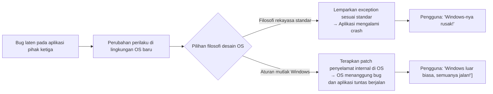

Spolsky menganalogikan prinsip ini dengan serial fiksi ilmiah *Star Trek*, di mana aturan tertinggi Starfleet yang pantang dilanggar adalah "Prime Directive" (larangan mencampuri perkembangan alami peradaban asing). Bagi para pemrogram Windows, *prime directive* mereka adalah tidak boleh merusak fungsi aplikasi yang sudah ada.

Jika seorang insinyur Windows melakukan refactor pada kernel atau API secara sangat elegan hingga kecepatannya berlipat ganda, namun perubahan tersebut menyebabkan sebuah software akuntansi usang milik satu perusahaan di pelosok dunia mengalami crash, maka hasil refactor tersebut akan langsung ditolak mentah-mentah. Di tim Windows, keindahan kode dan kemurnian arsitektur adalah urusan nomor dua; **kepastian bahwa biner yang ada tetap berfungsi 100% adalah kebajikan mutlak tertinggi**.

### 1.3 "Bahkan Bug Pun Menjadi Spesifikasi": Hukum Hyrum dan Sifat Tak Terelakkan API

Dalam dunia rekayasa perangkat lunak, terdapat sebuah aturan empiris terkenal yang dirumuskan oleh insinyur Google, Hyrum Wright, yang dikenal sebagai **Hukum Hyrum (Hyrum's Law)**:

> **Hukum Hyrum**:  
> "Ketika sebuah API memiliki jumlah pengguna yang cukup banyak, janji yang tertera pada kontrak resmi (dokumentasi) pembuat API sudah tidak relevan lagi. Setiap perilaku sistem yang dapat diamati — termasuk bug dan efek samping yang tak terdokumentasi — pada akhirnya akan dijadikan ketergantungan oleh kode orang lain."

Windows adalah wahana pembuktian Hukum Hyrum dalam skala paling masif dan paling brutal dalam sejarah komputasi.

Sebagai contoh konkret: dokumentasi resmi sebuah Windows API menyatakan dengan jelas: *"Argumen ketiga harus berupa window handle (HWND) yang valid. Perilaku saat menerima nilai tidak valid tidak terdefinisi (undefined)"*. Namun, seorang pengembang yang ceroboh secara tidak sengaja memasukkan pointer kosong (`NULL`) atau data rusak, dan kebetulan implementasi Windows 3.1 saat itu melewatkannya begitu saja tanpa memunculkan pesan error apa pun.

Setelah aplikasi tersebut terjual ratusan ribu kopi di pasaran, tim pengembang Windows 95 atau Windows NT berniat membersihkan kode: "Mari kita buat validasi argumen yang ketat dan mengembalikan nilai `ERROR_INVALID_WINDOW_HANDLE` jika parameternya tidak valid." Apa yang terjadi seketika itu juga?

Di puluhan ribu kantor perusahaan, software lawas tersebut serempak memunculkan kotak dialog error dan tertutup paksa. Para pengguna yang panik dan marah membanjiri saluran telepon dukungan pelanggan Microsoft: "Setelah Windows diperbarui, pekerjaan kami lumpuh total!".

Pada akhirnya, para insinyur Microsoft terpaksa menarik kembali kode "bersih" mereka dan menuliskan kompromi teknis yang mencengangkan seperti berikut:

```c
// Rekonstruksi konseptual implementasi internal Windows API
BOOL WINAPI DoSomething(HWND hWnd, UINT uMsg, WPARAM wParam, LPARAM lParam)
{
    // Validasi kanonikal sesuai buku teks
    if (!IsWindow(hWnd)) {
        // Dalam kondisi ideal, kode ini seharusnya langsung mengembalikan error:
        // SetLastError(ERROR_INVALID_WINDOW_HANDLE);
        // return FALSE;

        // 【HACK KOMPATIBILITAS】
        // Aplikasi komersial terkenal 'AppX' selalu mengirimkan handle NULL saat inisialisasi.
        // Jika kita kembalikan error di sini, AppX akan langsung crash.
        // Oleh karena itu, kita deteksi apakah ini AppX, lalu secara diam-diam menggantinya
        // dengan handle jendela Desktop (Desktop Window).
        if (IsTargetBadApplication("AppX.exe")) {
            hWnd = GetDesktopWindow();
        } else {
            SetLastError(ERROR_INVALID_WINDOW_HANDLE);
            return FALSE;
        }
    }

    // Melanjutkan pemrosesan normal API...
    return InternalDoSomething(hWnd, uMsg, wParam, lParam);
}
```

Begitu sebuah sistem operasi menjadi standar de-facto dunia, spesifikasi API tidak lagi ditentukan oleh tulisan dalam dokumentasi resmi, melainkan berubah menjadi **keseluruhan perilaku nyata yang pernah ditampilkan oleh implementasi aslinya, termasuk setiap cacat dan kekeliruannya**. Tim Windows berlapang dada menerima kenyataan ini dan bersiap memikul bug aplikasi buatan orang lain sebagai spesifikasi permanen dari sistem operasi itu sendiri.

---

## Bab 2: Awal Mula Sang Legenda — Kebenaran Teknis di Balik "Insiden SimCity"

Jika ada satu peristiwa dalam sejarah komputasi yang paling melambangkan kegigihan ekstrem tim Windows dalam menjaga kompatibilitas mundur, peristiwa itu adalah **"Insiden SimCity"**, yang terjadi pada puncak pengembangan Windows 95 pada tahun 1995.

### 2.1 Fisika Use-After-Free (Akses Memori Setelah Dibebaskan)

Diciptakan pada tahun 1989 oleh Maxis di bawah arahan perancang legendaris Will Wright, game simulasi pembangunan kota *SimCity* merupakan mahakarya abadi dalam sejarah video game yang mencatat kesuksesan fenomenal di seluruh dunia. Bagi pengguna rumahan maupun para profesional perkantoran yang menyempatkan diri mengelola kota virtual di sela-sela jam kerja, kelancaran bermain SimCity di PC adalah persoalan hidup dan mati.

Namun, biner komersial *SimCity* untuk DOS dan Windows 3.1 mengandung bug memori yang sangat fatal, yang berdasarkan standar audit keamanan siber modern pasti langsung diklasifikasikan sebagai kerentanan kritis: **Use-After-Free (UAF)**, yakni mengakses memori setelah memori tersebut dibebaskan.

Dalam proses simulasi dan perenderan grafisnya, kode *SimCity* mengalokasikan blok memori dari heap sistem operasi, lalu setelah selesai menggunakannya, membebaskan memori tersebut melalui pemanggilan fungsi seperti `free` atau `GlobalFree`. Sayangnya, pointer internal program tidak dibersihkan setelah pembebasan itu, sehingga aplikasi **tetap terus membaca dan menulis secara leluasa ke area memori yang seharusnya sudah diserahkan kembali kepada sistem operasi**.

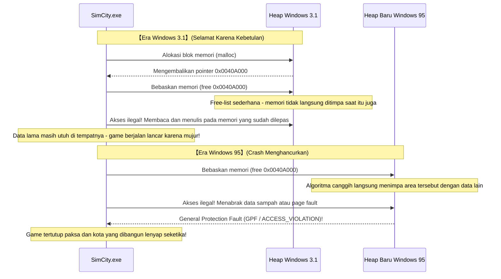

Pada era 16-bit Windows 3.1, manajemen memori masih sangat sederhana. Ketika sebuah aplikasi melepas memori, struktur daftar bebas (*free-list*) yang sederhana jarang sekali langsung mengalokasikan ulang atau menimpa alamat memori tersebut untuk kebutuhan lain dalam waktu singkat. Singkatnya: meskipun kode SimCity rusak total, **game tersebut tetap bisa berjalan semata-mata karena sistem alokasi memori Windows 3.1 masih sangat polos**.

### 2.2 Rekayasa Perangkat Lunak Konvensional vs Kegilaan Tim Windows

Namun, pada tahun 1995, hadirlah Windows 95 — sistem operasi 32-bit modern yang mengguncang dunia komputasi.

Windows 95 dibekali dengan kemampuan *preemptive multitasking* sejati, manajer memori virtual yang canggih, serta pengalokasi heap berkecepatan tinggi yang dirancang untuk menekan fragmentasi dan meningkatkan efisiensi cache prosesor. Manajer memori modern ini bekerja secara agresif: begitu sebuah blok memori dikembalikan oleh aplikasi, sistem akan **langsung menggabungkan dan menggunakan ulang area tersebut untuk data lain demi efisiensi optimal**.

Ketika SimCity dijalankan di atas pengalokasi memori baru ini, bencana tak terelakkan terjadi:  
SimCity mencoba membaca memori yang baru saja dilepasnya, dan langsung menabrak data proses lain atau halaman memori yang telah dinonaktifkan. Seketika itu juga, kotak dialog menyeramkan **"General Protection Fault (GPF)"** muncul, menutup game tanpa ampun dan menghancurkan kota megapolitan yang telah dirancang pemain selama puluhan jam.

Dalam menghadapi situasi genting seperti ini, keputusan apa yang lazimnya diambil oleh kaidah rekayasa perangkat lunak standar atau vendor sistem operasi lainnya?

Jawabannya sangat jelas: "Ini seratus persen kesalahan pemrograman Maxis. Manajemen memori sistem operasi kami telah bekerja dengan sempurna dan taat spesifikasi. Kita harus memberi tahu Maxis mengenai bug ini dan menunggu mereka membagikan disket patch pembaruan (SimCity 1.01) kepada pengguna." Sikap ini sepenuhnya logis dan benar secara akademis.

Namun, bagi jajaran pimpinan Microsoft dan tim pengembang Windows 95 yang tidak boleh membiarkan peluncuran sistem operasi tersebut terganggu sedikit pun, keputusan mereka sungguh mengejutkan:

**"SimCity tidak boleh crash dalam kondisi apa pun. Kita tidak punya waktu untuk menunggu pengembang game memperbaikinya. Modifikasi manajer memori kernel Windows 95 itu sendiri agar mengenali SimCity dan membuatnya tetap berjalan lancar."**

### 2.3 Rincian Hack Khusus SimCity pada Pengalokasi Memori

Dalam esainya, Joel Spolsky mencatat momen historis tersebut sebagai berikut:

> "Selama masa uji coba beta Windows 95, mereka menemukan bahwa SimCity tidak dapat berjalan dengan benar. Apa yang dilakukan Microsoft?  
> Mereka tidak mengejar pembuat SimCity untuk memaksa mereka memperbaikinya. Penanggung jawab manajer memori Windows 95 langsung menulis kode penanganan khusus: **'Jika program yang sedang berjalan saat ini adalah SimCity, jangan langsung mendaur ulang memori yang baru saja dibebaskan; pertahankan memori tersebut tetap utuh selama beberapa waktu'**."

Dalam kacamata arsitektur perangkat lunak modern, esensi dari hack ini merupakan prototipe awal dari apa yang sekarang dikenal sebagai "Quarantine Heap" atau "Delayed Free".

Saat sebuah proses dimulai, pengalokasi heap Windows 95 memeriksa nama file biner (`SIMCITY.EXE`) dan informasi header-nya. Begitu teridentifikasi sebagai SimCity, perilaku alokasi memori dialihkan ke mode darurat SimCity: jika biasanya blok memori yang dibebaskan langsung dilebur (*coalesced*) ke dalam kumpulan memori siap pakai, khusus untuk SimCity pointer tersebut dialihkan sementara ke dalam *ring buffer* penampungan, mencegah isinya ditimpa selama jangka waktu tertentu.

Berkat pengorbanan arsitektur di pihak sistem operasi ini, pada hari peluncuran Windows 95 jutaan pengguna di seluruh dunia dapat memasukkan disket SimCity ke dalam PC mereka dan melanjutkan tugas sebagai wali kota virtual tanpa menemui satu pun pesan kesalahan.

Para pengguna memuji setinggi langit: "Windows 95 sungguh luar biasa! Semua software lama tetap bisa berjalan lancar!". Di balik kepuasan itu, tidak ada satu pun pengguna yang menyadari bahwa para insinyur Microsoft telah mengorbankan kemurnian kernel baru mereka demi menambal kesalahan memori yang dibuat enam tahun sebelumnya oleh pembuat game pihak ketiga.


---

## Bab 3: Silsilah "Hack Kompatibilitas Menembus Batas" yang Mewarnai Sejarah

Penyelamatan SimCity hanyalah puncak dari gunung es. Perjalanan lebih dari tiga dekade yang membentuk Windows hingga hari ini adalah rentetan tanpa henti dari berbagai intervensi rekayasa yang mencengangkan, yang sengaja dirancang demi memperpanjang napas ribuan aplikasi nakal yang beredar di seluruh dunia.

### 3.1 Lotus 1-2-3 dan "Bug Tahun Kabisat 1900" di Excel

Dalam dunia komputasi penanggalan, terdapat sebuah kekeliruan perhitungan yang sangat terkenal di seluruh dunia dan hingga hari ini tetap dibiarkan hidup di miliaran komputer tanpa pernah diperbaiki: **pengakuan tahun 1900 sebagai tahun kabisat**.

Dalam kalender Gregorius, aturan penentuan tahun kabisat ditetapkan secara matematis dengan sangat tegas:
1. Tahun yang habis dibagi 4 adalah tahun kabisat.
2. Namun, tahun yang habis dibagi 100 adalah tahun biasa (bukan kabisat).
3. Kecuali tahun yang habis dibagi 400, yang tetap dihitung sebagai tahun kabisat.

Oleh karena itu, karena tahun 1900 habis dibagi 100 tetapi tidak habis dibagi 400, **tahun 1900 adalah tahun biasa; tanggal 29 Februari 1900 pada kenyataannya tidak pernah ada**.

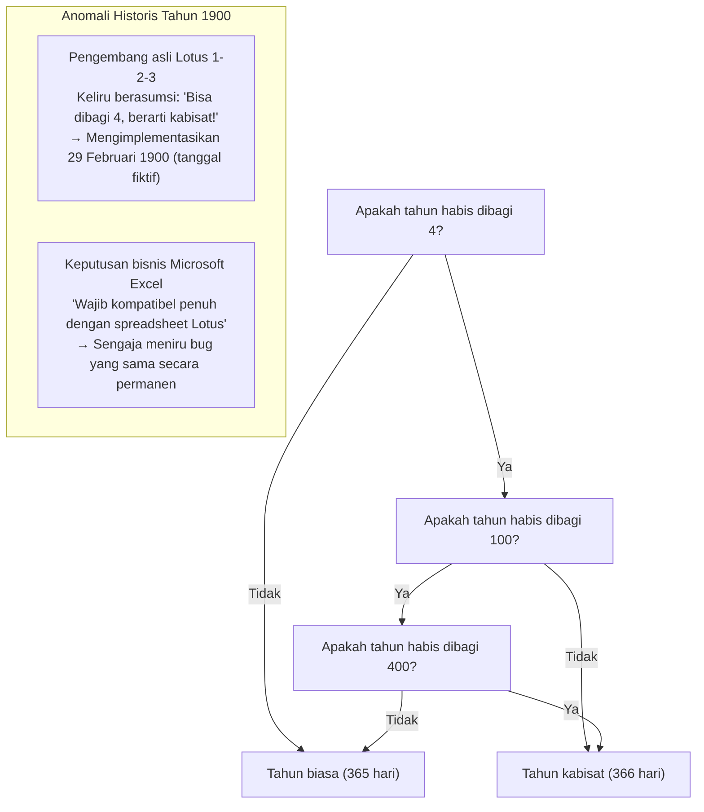

Akan tetapi, pada awal tahun 1980-an, pengembang *Lotus 1-2-3* — penguasa mutlak pasar aplikasi spreadsheet di era MS-DOS — mengabaikan aturan pengecualian 100 tahun tersebut dan memprogram tahun 1900 sebagai tahun kabisat. Akibatnya, Lotus 1-2-3 mengenali tanggal fiktif 29 Februari 1900, sehingga nilai seri penanggalan setelah tanggal tersebut bergeser satu hari lebih cepat.

Ketika tim Microsoft mengembangkan *Excel* untuk merebut pasar spreadsheet yang menguntungkan, mereka berhadapan dengan dilema besar: apakah mereka harus menerapkan kalender yang benar secara matematika, atau mengutamakan keselarasan perhitungan dengan puluhan juta lembar kerja Lotus 1-2-3 yang menjadi tulang punggung laporan keuangan korporat dunia?

Keputusan yang diambil oleh Bill Gates sangat tegas: demi memuluskan migrasi data pengguna dari Lotus 1-2-3 tanpa hambatan, **Excel secara sadar mengadopsi bug tersebut, mengakui keberadaan tanggal palsu 29 Februari 1900**.

Jika Anda membuka Microsoft 365 Excel hari ini dan mengetikkan formula `=DATE(1900, 2, 29)`, aplikasi canggih abad ke-21 tersebut tidak akan mengeluarkan error, melainkan menampilkan tanggal "29/02/1900" seolah-olah tanggal itu nyata. Sekali keputusan untuk memikul bug pihak ketiga diambil demi adopsi pasar, ikatan tersebut menjadi warisan abadi yang tak dapat ditarik kembali lintas dekade maupun abad.

### 3.2 Mengapa "Windows 9" Dilewati?

Pada musim gugur tahun 2014, Microsoft mengumpulkan media untuk mengumumkan penerus dari Windows 8.1. Seluruh industri meyakini bahwa produk berikutnya adalah "Windows 9". Namun, saat para petinggi naik ke panggung, nama yang diumumkan justru mengejutkan dunia: **"Windows 10"**.

Mengapa angka 9 dilewati begitu saja? Di balik pengumuman resmi pemasaran yang mengklaim lompatan generasi teknologi baru, komunitas pengembang dan perekayasa balik menemukan alasan teknis yang jauh lebih nyata: ladang ranjau kompatibilitas masa lalu.

Di dalam ribuan aplikasi lama, library lingkungan runtime seperti Java, dan paket installer software di seluruh dunia, para pemrogram menuliskan kode pengecekan versi sistem operasi dengan jalan pintas yang sangat ceroboh seperti ini:

```java
// Pola kode yang sangat lazim ditemukan pada software korporat lama
String osName = System.getProperty("os.name");

if (osName.startsWith("Windows 9")) {
    // Keliru menyimpulkan bahwa OS yang berjalan adalah Windows 95 atau Windows 98!
    // Mengaktifkan jalur kompatibilitas 16-bit dan registry usang era Win9x
    enableLegacyWin9xMode();
} else {
    // Jalur modern untuk sistem operasi berbasis NT (Windows NT, 2000, XP, 7, 8, dll.)
    enableModernNTMode();
}
```

Banyak pemrogram menggunakan `startsWith("Windows 9")` sebagai cara praktis untuk mencakup Windows 95 dan Windows 98 sekaligus.

Jika Microsoft benar-benar merilis sistem operasi dengan nama "Windows 9", ribuan software perusahaan dan utilitas penting akan langsung mendeteksi bahwa mereka sedang berjalan di lingkungan Windows 95 buatan tahun 1995. Akibatnya, aplikasi-aplikasi tersebut akan mematikan panggilan API kernel NT modern dan mencoba mengeksekusi instruksi usang era DOS, berujung pada crash massal seketika.

Ketakutan mendalam bahwa nama produk dapat merusak software warisan global membuat angka 9 dihapuskan selamanya dari sejarah resmi Windows.

### 3.3 API Tak Terdokumentasi (Undocumented APIs) dan Norton Utilities

Sepanjang dekade 1990-an, paket perangkat lunak diagnostik dan perbaikan sistem *Norton Utilities* buatan Symantec adalah perkakas wajib di PC para pengguna di seluruh dunia. Namun, bagi tim pengembang Windows, Norton Utilities adalah mimpi buruk terbesar: contoh utama dari software yang bertindak semena-mena.

Pasalnya, utilitas berlevel rendah seperti Norton tidak puas hanya dengan menggunakan API publik resmi Win32. Mereka secara rutin **membaca struktur data internal yang tidak terdokumentasi, memanggil fungsi privat kernel, dan bahkan mengakses offset alamat memori tetap di dalam DLL Windows**.

Raymond Chen mengenang pertempuran sengit yang dihadapi tim Windows 95 agar tidak merusak Norton Utilities. Apabila struktur internal pengelolaan memori atau kontrol proses Windows 95 bergeser satu byte saja dari versi sebelumnya, Norton Utilities akan langsung memicu Blue Screen of Death (BSoD) dan melumpuhkan sistem seketika.

Tanggapan Microsoft bukanlah menyerang Symantec di hadapan publik. Para insinyur Microsoft melakukan disasimilasi dan rekayasa balik terhadap biner Norton Utilities, memetakan secara tepat alamat memori mana saja yang dibaca oleh Norton, lalu **menempatkan struktur data tiruan (dummy) persis di alamat memori lama yang diharapkan Norton**, memastikan utilitas tersebut tetap berjalan tanpa menumbangkan sistem operasi.

### 3.4 Hari Ketika Bill Gates Memegang Shotgun: DOOM dan Kelahiran DirectX / WinG

Menjelang peluncuran Windows 95, posisi Windows di industri game PC sangatlah mengenaskan. Para pengembang game memandang rendah Windows, menganggapnya sebagai sistem operasi perkantoran yang lambat karena beban antarmuka grafisnya (GDI). Semua game kelas atas dibuat khusus untuk MS-DOS, di mana program dapat langsung mengontrol port I/O pada kartu grafis dan kartu suara Sound Blaster tanpa perantara.

Simbol puncak era tersebut adalah game FPS legendaris buatan id Software, *DOOM*. DOOM dimainkan secara sembunyi-sembunyi di komputer kantor di seluruh dunia hingga diberitakan memangkas produktivitas kerja korporasi di Amerika Serikat.

Bill Gates menyadari bahaya besar ini: "Jika para pengguna harus me-restart PC mereka ke mode MS-DOS setiap kali ingin bermain game, Windows 95 tidak akan pernah menang secara mutlak. DOOM harus bisa berjalan di atas Windows 95, bahkan harus lebih cepat daripada di DOS."

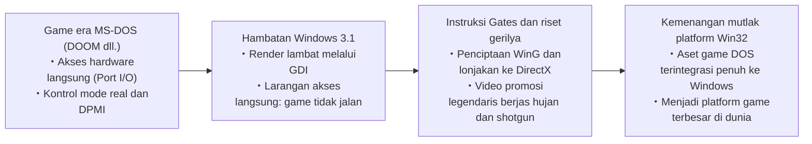

Gates mengumpulkan insinyur-insinyur terbaik untuk mengembangkan library grafis yang mampu mengemulasikan dan mengakselerasi akses hardware langsung DOS di dalam lingkungan aman Windows: inilah awal mula lahirnya library perantara "WinG" dan kemudian "DirectX" (dengan nama sandi proyek *Manhattan Project*).

Bill Gates bahkan membintangi video promosi legendaris mengenakan jas hujan hitam panjang dan memegang shotgun di dalam arena virtual game DOOM, menegaskan kepada dunia bahwa Windows 95 adalah platform gaming terhebat. Kelihaian dalam menjinakkan akses hardware liar di bawah perlindungan memori Windows menjadi batu penjuru bagi kedigdayaan grafis dan multimedia Windows hingga hari ini.

---

## Bab 4: Benteng Raksasa Penopang Windows Modern: "AppCompat (Application Compatibility)"

Pada masa Windows 95 dan 98, tambalan kompatibilitas disematkan secara ad-hoc sebagai perkecualian langsung di dalam kode inti sistem operasi. Namun, memasuki era ledakan perangkat lunak di Windows 2000 dan Windows XP, pendekatan manual tersebut mencapai titik jenuh: kernel sistem terancam menjadi tumpukan percabangan kondisi yang tak terkendali demi menyelamatkan program individual.

Untuk mengatasi hal tersebut, arsitek perangkat lunak Microsoft membangun infrastruktur formal yang bertugas hingga era Windows 11 saat ini: **subsistem kompatibilitas aplikasi yang dikenal sebagai "Application Compatibility (AppCompat)"**.

### 4.1 Struktur Menyeluruh Subsistem AppCompat

Subsistem AppCompat secara sederhana dapat didefinisikan sebagai **sistem pencegat cerdas yang, begitu sebuah file biner dimuat ke dalam memori proses, langsung mengenali profilnya secara real-time dan menyisipkan lapisan penyamaran transparan yang disebut "Shim" di antara aplikasi dan kernel sistem operasi**.

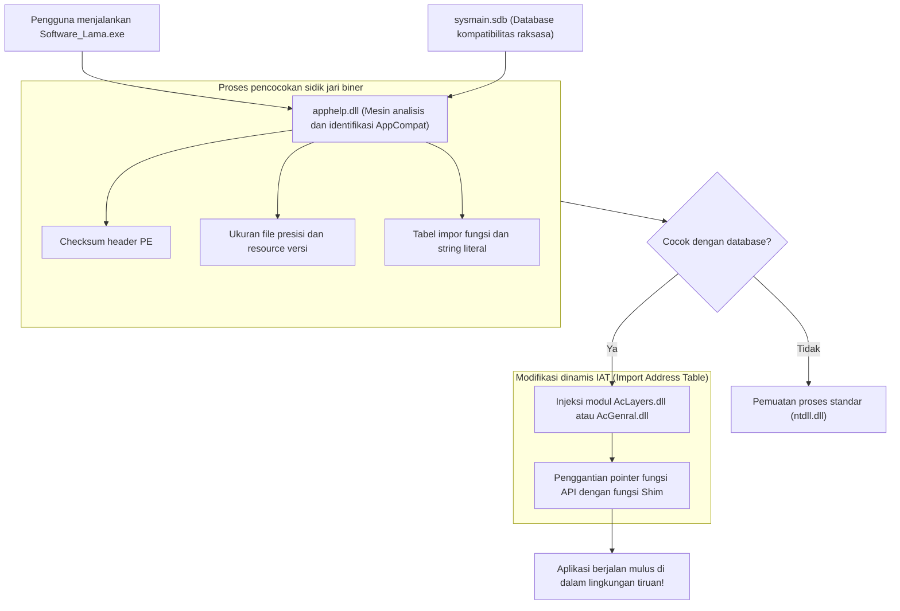

Ketika pengguna mengeklik dua kali sebuah file eksekutabel (`.exe`), rutin pembuatan proses Windows (yang dikendalikan oleh `ntdll.dll`) menunda inisialisasi normal dan terlebih dahulu memanggil **`apphelp.dll`**.

`apphelp.dll` menelusuri database kompatibilitas raksasa **`sysmain.sdb`** untuk memeriksa apakah biner tersebut terdaftar sebagai aplikasi yang memerlukan perlakuan khusus. Jika cocok, loader sistem operasi akan menyuntikkan modul Shim — terutama **`AcLayers.dll`** dan **`AcGenral.dll`** — ke dalam ruang memori virtual proses sebelum DLL resmi sistem (`kernel32.dll`, `user32.dll`, dll.) menyelesaikan penautan fungsinya.

### 4.2 Mesin Shim: Mekanisme Penggantian API Menggunakan IAT Hooking

Bagaimana mesin Shim menipu aplikasi tanpa mengubah satu byte pun file asli yang ada di piringan hard disk? Teknik utama yang digunakan adalah **IAT Hooking (pembajakan Import Address Table)** pada struktur Portable Executable (PE).

Ketika sebuah aplikasi Windows memanggil fungsi dari DLL eksternal (misalnya `GetVersionEx` atau `GetDiskFreeSpace`), kode mesin hasil kompilasi tidak menyimpan alamat memori absolut. Sebagai gantinya, saat proses dimuat, loader Windows mengisi susunan pointer fungsi yang berada di dalam memori program: tabel IAT. Aplikasi selalu memanggil API sistem secara tidak langsung melalui tabel ini.

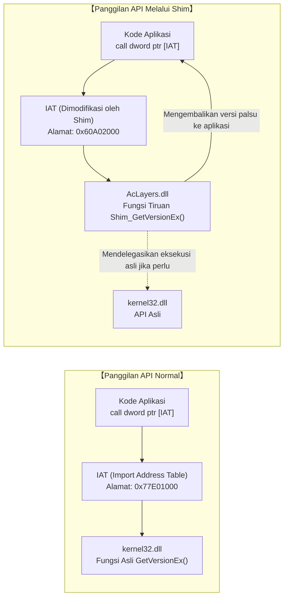

Mesin Shim memanfaatkan kebiasaan ini secara brilian. Begitu disuntikkan ke dalam proses, ia memindai IAT aplikasi target, mengubah proteksi memori sementara menjadi dapat ditulis (`PAGE_READWRITE`) melalui `VirtualProtect`, dan **menimpa pointer API Windows resmi dengan alamat fungsi tiruan yang disediakan oleh pustaka Shim**.

Kode konseptual dalam C/C++ berikut menggambarkan mekanisme ini:

```c
// Kode pembuktian konsep injeksi Shim melalui IAT Hooking
#include <windows.h>
#include <imagehlp.h>

// Fungsi tiruan GetVersionEx (wujud dari Shim itu sendiri)
BOOL WINAPI Shim_GetVersionExA(LPOSVERSIONINFOA lpVersionInformation)
{
    // Memanggil API asli di kernel32.dll untuk mendapatkan data dasar
    typedef BOOL (WINAPI *PFN_GETVER)(LPOSVERSIONINFOA);
    HMODULE hKernel = GetModuleHandleA("kernel32.dll");
    PFN_GETVER pfnRealGetVer = (PFN_GETVER)GetProcAddress(hKernel, "GetVersionExA");
    
    BOOL bResult = pfnRealGetVer(lpVersionInformation);
    
    // 【AKSI PENIPUAN】
    // Berbohong terang-terangan kepada aplikasi bahwa OS saat ini adalah Windows 95 (Major: 4, Minor: 0)
    lpVersionInformation->dwMajorVersion = 4;
    lpVersionInformation->dwMinorVersion = 0;
    lpVersionInformation->dwBuildNumber = 950;
    lpVersionInformation->dwPlatformId = VER_PLATFORM_WIN32_WINDOWS;
    strcpy(lpVersionInformation->szCSDVersion, "");

    return TRUE; // Aplikasi sepenuhnya percaya bahwa ia berjalan di Windows 95
}

// Prosedur pemindaian IAT dan pembajakan pointer fungsi
void InstallShimHook(HMODULE hAppModule, LPCSTR targetDll, LPCSTR targetFunc, PVOID newFuncAddress)
{
    ULONG size;
    // Mendapatkan direktori impor dari header PE
    PIMAGE_IMPORT_DESCRIPTOR pImportDesc = (PIMAGE_IMPORT_DESCRIPTOR)
        ImageDirectoryEntryToData(hAppModule, TRUE, IMAGE_DIRECTORY_ENTRY_IMPORT, &size);

    while (pImportDesc->Name) {
        LPCSTR dllName = (LPCSTR)((PBYTE)hAppModule + pImportDesc->Name);
        if (_stricmp(dllName, targetDll) == 0) {
            // Mencari tabel Thunk yang sesuai dengan target DLL
            PIMAGE_THUNK_DATA pThunk = (PIMAGE_THUNK_DATA)((PBYTE)hAppModule + pImportDesc->FirstThunk);
            while (pThunk->u1.Function) {
                PROC* ppfn = (PROC*)&pThunk->u1.Function;
                // Jika menemukan fungsi yang dicari, timpa alamatnya di memori
                DWORD oldProtect;
                VirtualProtect(ppfn, sizeof(PROC), PAGE_READWRITE, &oldProtect);
                *ppfn = (PROC)newFuncAddress; // Mengganti dengan alamat fungsi Shim!
                VirtualProtect(ppfn, sizeof(PROC), oldProtect, &oldProtect);
                break;
            }
        }
        pImportDesc++;
    }
}
```

Melalui teknik bedah memori yang presisi ini, file biner di hard disk tidak mengalami modifikasi sama sekali, kode inti sistem operasi tidak tercemar perkecualian khusus, dan aplikasi lama terkungkung di dalam dunia simulasi yang memenuhi seluruh asumsi teknis masa lalunya.

### 4.3 File Biner Raksasa Penuh Misteri: `sysmain.sdb` (Shim Database)

Pusat kendali dari seluruh infrastruktur AppCompat ini adalah file biner **`sysmain.sdb`**, yang bersemayam di direktori sistem `C:\Windows\AppPatch\`.

Disusun dalam format biner tertutup buatan Microsoft (format SDB), file ini menyimpan **ratusan ribu resep penyelamatan khusus bagi hampir setiap software komersial, aplikasi perkantoran, dan game populer yang beredar selama empat puluh tahun terakhir**.

Agar tidak salah sasaran menerapkan Shim pada aplikasi modern yang kebetulan memiliki nama generik (seperti `setup.exe` atau `install.exe`), mesin `apphelp.dll` melakukan pencocokan sidik jari multidimensional yang sangat ketat:

1. **Nama file dan path instalasi lengkap**
2. **Ukuran file presisi hingga ke satuan byte**
3. **Stempel waktu linker pada header PE (Linker Timestamp)**
4. **Checksum biner (PE CheckSum)**
5. **Resource informasi versi (CompanyName, ProductName, FileVersion, LegalCopyright, dll.)**
6. **Hash dari bagian kode tertentu dan struktur tabel ekspor**

Jika seorang pengguna memasukkan CD-ROM ensiklopedia interaktif terbitan tahun 2001 ke PC Windows 11 modern, `apphelp.dll` akan memindai sidik jarinya dalam hitungan milidetik, mencocokkannya dengan database `sysmain.sdb`, dan menyimpulkan:  
*"Software ini dirancang untuk Windows 2000; membutuhkan perataan heap yang longgar dan mencoba menulis langsung ke registry sistem"*.  
Secara otomatis, Windows mengaktifkan puluhan Shim yang relevan di balik layar, membuat ensiklopedia lawas tersebut berjalan mulus tanpa membutuhkan konfigurasi manual dari pengguna.


---

## Bab 5: Katalog Shim Representatif (Seni Membohongi Demi Menyelamatkan)

Persenjataan Shim yang tertanam di kedalaman sistem Windows mencakup ratusan mekanisme khusus. Seluruhnya membentuk katalog kecerdikan rekayasa yang dirancang secara sistematis untuk mengatasi berbagai kekeliruan yang pernah dilakukan pengembang selama puluhan tahun.

### 5.1 `VersionLie`: "Anda Berada di Windows 95 yang Anda Inginkan", Bisik Sistem Operasi

Salah satu Shim paling tua sekaligus paling banyak diterapkan adalah **`VersionLie`** (pemalsuan versi OS).

Secara historis, saat aplikasi dimulai, pengembang memanggil API `GetVersion` atau `GetVersionEx` untuk memastikan bahwa sistem operasi memenuhi syarat minimum. Sayangnya, banyak sekali program yang ditulis dengan logika pengecekan yang sangat naif:

```c
// Contoh klasik logika pengecekan versi yang berujung fatal
OSVERSIONINFO vi;
GetVersionEx(&vi);

// Program berasumsi secara kaku bahwa ia hanya boleh berjalan di Windows 95
if (vi.dwMajorVersion == 4 && vi.dwMinorVersion == 0) {
    // Inisialisasi normal
} else {
    MessageBox(NULL, "Program ini dirancang khusus untuk Windows 95. Tidak dapat dijalankan di OS yang lebih baru.", "Error", MB_OK);
    ExitProcess(1); // Aplikasi memilih untuk bunuh diri!
}
```

Ketika dijalankan di sistem operasi generasi berikutnya seperti Windows XP (Major: 5), Windows 7 (Major: 6), atau Windows 10/11 (Major: 10), aplikasi tersebut mendapati bahwa `dwMajorVersion` bukan 4, lalu langsung memunculkan pesan error dan mematikan dirinya sendiri — padahal sistem operasi baru tersebut memiliki kapabilitas penuh untuk menjalankannya.

Di sinilah peran `VersionLie`. Ketika proses yang bersangkutan memanggil `GetVersionEx`, kernel Windows 11 dengan tenang mengembalikan data palsu: **"Anda sedang berjalan di Windows 95 (Major: 4, Minor: 0, Build: 950)"**. Program tersebut langsung merasa puas dan dapat beroperasi normal di atas prosesor multi-core mutakhir dan SSD NVMe supercepat.

### 5.2 `EmulateGetDiskFreeSpace`: Menyelamatkan Aplikasi dari Overflow pada Kapasitas Hard Disk di Atas 2 GB

Pada pertengahan tahun 1990-an, kapasitas hard disk komputer konsumen umumnya berkisar antara ratusan megabyte hingga paling banyak satu gigabyte. API standar Win32 untuk memeriksa sisa ruang disk saat itu, `GetDiskFreeSpace`, mengembalikan parameter seperti sektor per cluster, byte per sektor, dan jumlah cluster bebas dalam format bilangan bulat bertanda 32-bit (`signed 32-bit integer`).

Para pengembang menghitung total sisa ruang disk dalam satuan byte menggunakan perkalian:

$$\text{FreeBytes} = \text{SectorsPerCluster} \times \text{BytesPerSector} \times \text{NumberOfFreeClusters}$$

Namun, begitu kapasitas bebas media penyimpanan melampaui **2 gigabyte ($2^{31} - 1$ byte)**, hasil perkalian integer bertanda 32-bit tersebut mengalami **luapan aritmetika (integer overflow)**, sehingga nilainya berbalik menjadi **angka negatif (misalnya -500 megabyte)**.

Akibatnya, ketika pengguna mencoba menginstal game klasik atau paket Microsoft Office versi lama ke PC modern berkapasitas besar, installer akan panik dan membatalkan proses sambil berteriak: *"Ruang disk tidak mencukupi: hanya tersisa -500 MB"*.

Penyelamat dari keanehan ini adalah Shim **`EmulateGetDiskFreeSpace`**. Ketika aplikasi target menanyakan sisa ruang disk, Shim mencegat jawabannya dan — tidak peduli apakah hard disk memiliki sisa ruang puluhan terabyte — melaporkan data fiktif: **"Sisa ruang disk saat ini tepat 2.147.151.872 byte (sekitar 1,99 GB)"** — batas maksimum absolut sebelum terjadi overflow pada bilangan bertanda 32-bit. Installer menganggap ruang tersebut cukup lapang dan menyelesaikan instalasi dengan sempurna.

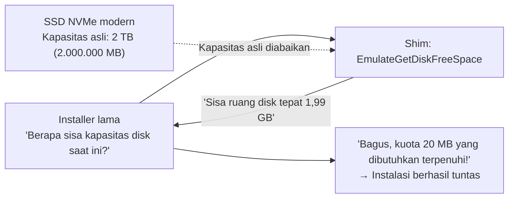

### 5.3 `VirtualRegistry` dan `VirtualStore`: Pengalihan Paksa Akibat Kelahiran UAC

Peluncuran Windows Vista pada tahun 2006 membawa revolusi mendasar dalam arsitektur keamanan: lahirnya **User Account Control (UAC)**.

Di era Windows 95, 98, dan XP, pengguna hampir selalu masuk sebagai Administrator lokal. Berbagai aplikasi leluasa menulis file konfigurasi, database, atau data save game langsung ke folder terproteksi `C:\Program Files` dan branch registry sistem `HKEY_LOCAL_MACHINE\Software`.

Di bawah paradigma keamanan Vista dan versi setelahnya, segala upaya penulisan ke area sistem oleh proses standar tanpa hak akses Administrator langsung diblokir secara tegas (`ACCESS_DENIED`). Jika aturan ini diterapkan secara kaku tanpa toleransi, jutaan aplikasi korporat di seluruh dunia akan langsung tumbang karena gagal menyimpan pengaturannya.

Solusi penyelamatnya adalah fitur virtualisasi transparan **`VirtualStore`**.

Saat sebuah program lama mencoba menulis data ke `C:\Program Files\App\config.ini` tanpa hak Administrator, manajer I/O Windows tidak mengembalikan error; alih-alih, ia secara diam-diam mengalihkan proses penulisan ke folder aman khusus per pengguna: `C:\Users\<NamaPengguna>\AppData\Local\VirtualStore\Program Files\App\config.ini`. Hal yang sama berlaku untuk penulisan ke `HKLM\Software`, yang dialihkan ke `HKCU\Software\Classes\VirtualStore`.

Ketika aplikasi membaca file tersebut di kemudian hari, sistem mengambil data dari VirtualStore. Program meyakini sepenuhnya bahwa ia sedang memodifikasi Program Files milik sistem, padahal kenyataannya ia beroperasi secara aman di dalam sandbox yang terisolasi.

### 5.4 `DXPrimaryBltPunt`: Kerusakan Palet 256 Warna dan Sinkronisasi Frame Rate pada DirectDraw Klasik

Game 2D yang lahir antara tahun 1995 hingga awal era Windows XP (seperti *Age of Empires* dan berbagai game RPG klasik) sangat bergantung pada komponen "DirectDraw" dari DirectX. Dirancang untuk resolusi 256 warna berpalet indeks (8-bit color), game-game tersebut memanipulasi palet warna langsung pada VRAM permukaan primer (*primary surface*) kartu grafis untuk menciptakan efek visual dan transisi layar.

Namun, GPU modern dan manajer komposisi jendela Windows (Desktop Window Manager: DWM) menyusun tampilan desktop secara penuh dalam TrueColor 32-bit melalui pipeline render 3D. Dukungan perangkat keras untuk pengubahan langsung palet 8-bit pada permukaan layar utama telah dihapuskan sejak puluhan tahun silam.

Jika game lawas tersebut dijalankan di PC modern tanpa perlakuan khusus, kegagalan sinkronisasi palet akan mengubah tampilan menjadi mozaik warna-warni psikedelik yang rusak, atau ketiadaan sinkronisasi vertikal membuat game berlari hingga ribuan frame per detik sehingga mustahil dimainkan.

Shim grafis seperti **`DXPrimaryBltPunt`** dan **`ForceDirectDrawEmulation`** mengatasi masalah ini dengan mencegat perintah kuno DirectDraw, mengubahnya secara real-time menjadi tekstur poligon modern Direct3D, lalu meneruskannya secara mulus ke dalam pipeline komposisi DWM. Fakta bahwa game piksel 30 tahun lalu masih dapat menampilkan warna aslinya di layar monitor 4K modern adalah buah manis dari rekayasa penyamaran grafis ini.

---

## Bab 6: Pelayaran Akbar Menuju 64-bit dan ARM — WOW64 dan Keajaiban Emulasi

Ketika perubahan teknologi merambah hingga ke arsitektur fisik set instruksi prosesor, menjaga kompatibilitas mundur tidak bisa lagi hanya mengandalkan penyadapan fungsi API di memori. Dalam menghadapi lompatan generasi ini, Windows mengambil langkah spektakuler: **memasukkan salinan sistem operasi utuh ke dalam sistem operasi lainnya**.

### 6.1 Dari NTVDM ke WOW64: Percabangan Semesta Paralel Sistem File dan Registry

Pada masa peralihan dari 16-bit ke 32-bit, Windows NT menyediakan **NTVDM (NT Virtual DOS Machine)** yang memanfaatkan mode virtual 8086 prosesor Intel untuk mengeksekusi aplikasi DOS dan Win16 secara terisolasi.

Lalu pada pertengahan tahun 2000-an, hadirnya arsitektur AMD64 (x64) menandai pergeseran besar menuju komputasi 64-bit. Demi menyelamatkan warisan jutaan aplikasi 32-bit yang sudah ada, Microsoft merancang subsistem **"WOW64 (Windows 32-bit On Windows 64-bit)"**.

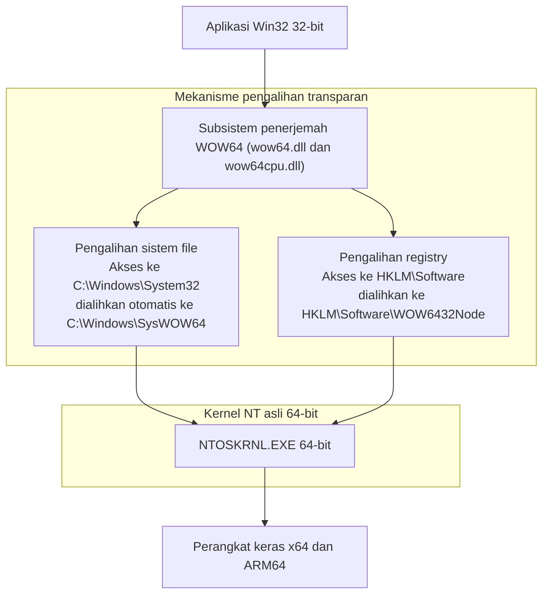

Keajaiban terbesar WOW64 adalah kemampuannya menyajikan **ilusi semesta paralel yang sempurna** pada sistem file dan registry bagi aplikasi 32-bit:

- **Pengalih Sistem File (File System Redirector)**:  
  Di Windows 64-bit, file DLL asli 64-bit secara unik ditempatkan di `C:\Windows\System32`. Saat proses 32-bit meminta akses ke folder tersebut, WOW64 mencegatnya dan mengarahkannya ke `C:\Windows\SysWOW64` (folder yang, berlawanan dengan namanya, justru berisi DLL 32-bit).
- **Pengalih Registry (Registry Redirection)**:  
  Demikian pula, saat aplikasi 32-bit berupaya menulis ke `HKEY_LOCAL_MACHINE\Software`, subsistem secara otomatis mengisolasi operasi tersebut ke dalam `HKEY_LOCAL_MACHINE\Software\WOW6432Node`.

Melalui rekayasa ruang paralel ini, software yang dikompilasi pada tahun 1998 tidak menyadari sama sekali bahwa ia sedang berjalan di atas sistem 64-bit, dan tetap menemukan file-file yang dibutuhkannya persis di lokasi yang ia kenal.

### 6.2 Transisi ke ARM64 dan Mesin Penerjemah Prism

Tantangan paling sengit di era sekarang adalah migrasi dari arsitektur x86/x64 ke **ARM64** (seperti prosesor Qualcomm Snapdragon X Elite).

Pada tahun 2012, Microsoft pernah meluncurkan "Windows RT" dengan mencoba pendekatan ala Apple: melarang eksekusi aplikasi Win32 konvensional di prosesor ARM. Pasar merespons Windows RT dengan penolakan keras yang berujung pada kerugian pembukuan hampir satu miliar dolar. Kegagalan telak itu menanamkan pelajaran berharga: **Windows yang tidak bisa menjalankan warisan aplikasi Win32 bukanlah Windows di mata konsumen**.

Kini, Windows 11 on ARM dipersenjatai dengan mesin penerjemah biner generasi terbaru bernama **"Prism"**. Prism menganalisis instruksi mesin x86 dan x64 secara real-time, menerjemahkannya melalui JIT (Just-In-Time) ke set instruksi ARM64 asli. Pada saat yang sama, blok kode yang telah diterjemahkan disimpan di cache eksekusi berkecepatan tinggi, sehingga software lawas mampu berjalan dengan performa yang mendekati kode native.

Betapapun berbedanya rancangan arsitektur silikon perangkat keras, pengalaman pengguna harus tetap abadi: klik dua kali ikon file biner, dan aplikasi tersebut langsung berfungsi seketika.

---

## Bab 7: Tiga Dunia, Tiga Filosofi Arsitektur — Windows vs Apple (macOS) vs Linux

Dalam menjawab pertanyaan tentang bagaimana memperlakukan aplikasi masa lalu, tiga ekosistem sistem operasi terkemuka di dunia mengambil jalan yang saling bertolak belakang. Membandingkan ketiga filosofi ini akan mempertegas betapa uniknya posisi yang diambil oleh Windows.

### 7.1 Apple (Pemisahan Bedah): Bumi Hangus Masa Lalu Demi Melangkah Maju

Dari visi Steve Jobs hingga era kepemimpinan Tim Cook, filosofi Apple selalu berpegang pada **kebijakan bumi hangus (Scorched Earth Policy)**: memangkas masa lalu tanpa ragu demi memuluskan pengalaman masa depan.

Perjalanan Apple dipenuhi oleh serangkaian patahan arsitektur yang tajam:
- **Peninggalan Total Classic Mac OS**: Perpindahan wajib dari Mac OS 9 ke Mac OS X (berbasis NeXT dan Unix). Lapisan transisi kompatibilitas ("Carbon") disediakan sementara waktu, untuk kemudian dicabut hingga ke akar-akarnya.
- **Pergantian Hardware Berulang**: Dari Motorola 680x0 ke PowerPC, dari PowerPC ke Intel x86, dan dari Intel ke Apple Silicon (seri M). Di setiap masa transisi, Apple menyediakan emulator hebat (emulator 68K, Rosetta awal, Rosetta 2), namun selalu mencabut emulator tersebut dari sistem operasi beberapa tahun kemudian, mematikan seluruh biner masa lalu.
- **Kematian Biner 32-bit di macOS Catalina (2019)**: Apple menghapus seluruh dukungan eksekusi 32-bit. Ribuan plugin audio profesional, software sains lama, dan game klasik langsung berhenti berfungsi secara permanen.

Tuntutan Apple kepada komunitas pengembang sangat tegas: *"Gunakan Xcode terbaru, tulis ulang kode Anda dalam bahasa Swift modern, dan lakukan kompilasi ulang untuk versi macOS terbaru. Software yang tidak diperbarui harus tersingkir dari ekosistem"*. Pendekatan ini membuat macOS selalu ramping, bersih, dan berkinerja tinggi, namun membebankan biaya peremajaan kode yang tiada henti kepada para pengembang dan pengguna.

### 7.2 Linux (Perintah Linus): "Never break userspace!" — Terang dan Gelap

Di dunia open-source, sang arsitek kernel Linux, Linus Torvalds, menetapkan aturan mutlak yang memiliki kemiripan luar biasa dengan aturan besi Microsoft: **"Never break userspace!" (Jangan pernah merusak ruang pengguna!)**.

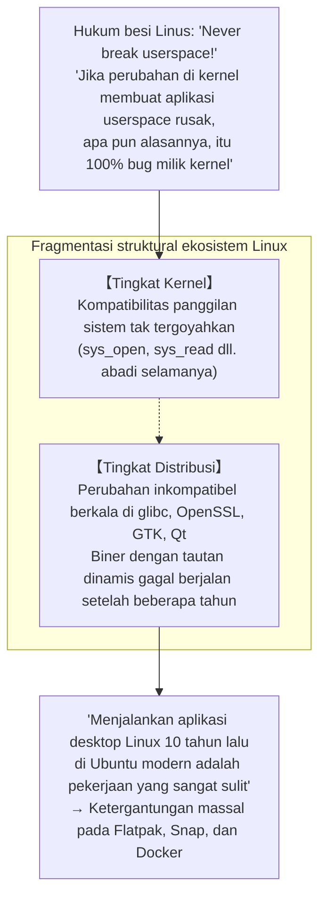

Jika sebuah patch kernel Linux, betapapun indah dan elegannya, menyebabkan regresi yang membuat program userspace yang sudah ada berhenti berfungsi, Linus Torvalds akan meluapkan kemarahannya di milis pengembang dan menuntut agar patch tersebut segera di-revert. Dalam hal ini, filosofi kernel Linux sejalan dengan Windows.

Akan tetapi, lingkungan desktop Linux tidak memiliki satu otoritas pengendali tunggal. Meskipun *syscall* kernel dijamin abadi, shared library di tingkat distribusi (`glibc`, `libssl`, pustaka GUI GTK atau Qt) kerap memutus kompatibilitas biner. Akibatnya, **menjalankan biner desktop bertautan dinamis yang dikompilasi 10 tahun lalu di atas Ubuntu modern adalah perkara yang sangat rumit**. Linux berhasil melindungi kompatibilitas di tingkat kernel, tetapi fragmentasi ekosistem userspace menghalanginya mencapai tingkat kompatibilitas menyeluruh seperti yang disajikan Windows.

### 7.3 Windows (Inklusi Kumulatif): Penumpukan Lapisan yang Luar Biasa

Berseberangan dengan pemotongan bedah Apple dan fragmentasi Linux, jalan yang ditempuh Windows adalah **"Inklusi Kumulatif" (Cumulative Inclusion)**.

Sistem tidak pernah membuang fondasi lama; sebaliknya, ia terus menumpuk lapisan abstraksi baru di atas fondasi sebelumnya layaknya lapisan batuan bumi. Di atas Win16 dibangunlah Win32; di atas Win32 dibangunlah .NET Framework; di atasnya lagi dirancang WinRT dan UWP; dan ketika UWP gagal mendominasi, Microsoft kembali membangun Windows App SDK (WinUI 3) langsung di atas batu karang Win32.

Akumulasi tiada henti ini membuat Windows menjadi salah satu artefak rekayasa perangkat lunak terbesar dan paling rumit dalam sejarah umat manusia. Namun, sebagai imbalan dari kompleksitas raksasa tersebut, dunia disuguhi sebuah keajaiban unik: **lingkungan komputasi di mana software yang ditulis 40 tahun lalu dapat hidup berdampingan secara damai dengan aplikasi kecerdasan buatan paling mutakhir di komputer yang sama**.

| Kriteria Komparasi | Microsoft (Windows) | Apple (macOS) | Linux (Desktop) |
| :--- | :--- | :--- | :--- |
| **Filosofi Mendasar** | **Inklusi Kumulatif**<br/>Merangkul dan memikul seluruh masa lalu | **Pemisahan Bedah**<br/>Pembersihan berkala software warisan | **Perlindungan kernel dan kebebasan di atasnya**<br/>Kernel abadi, lapisan aplikasi terfragmentasi |
| **Aturan Mutlak** | "Don't break old apps" | "Embrace the modern platform" | "Never break userspace" (Khusus di kernel) |
| **Rentang Kompatibilitas** | **Lebih dari 30 hingga 40 tahun** (Win32 dan DOS) | **3 hingga 5 tahun** (Dihapus setelah masa transisi) | Kernel abadi, aplikasi GUI berumur pendek |
| **Status Biner 32-bit** | **Dukungan penuh di Windows 11** (WOW64) | **Dihapus total** di Catalina (2019) | Perlu instalasi pustaka multilib manual |
| **Tuntutan ke Pengembang** | Nyaris nihil: aplikasi tetap berjalan | Sangat tinggi: penulisan ulang berkala | Pengemasan ulang berulang untuk tiap distro |
| **Kemurnian Arsitektur** | Ratusan juta baris bertumpuk-tumpuk | Sangat ramping, bersih, dan modern | Modular di kernel, terpecah di ruang aplikasi |


---

## Bab 8: Ekonomi Platform — Mengapa Kompatibilitas Menjadi "Benteng Pertahanan (Moat)" Terkuat

Mengapa Bill Gates dan para pemimpin eksekutif Microsoft dari generasi ke generasi bersikeras memaksakan disiplin kerja yang sedemikian melelahkan kepada tim pengembangnya? Jawaban pamungkasnya tidak berada di ranah estetika desain kode, melainkan di ranah **ekonomi platform perangkat lunak dan dinamika pasar yang dingin**.

### 8.1 Model Bisnis Bill Gates: Nilai OS adalah "Jumlah Total Software yang Bisa Berjalan"

Sejak hari-hari awal berdirinya Microsoft, Bill Gates telah memahami hakikat sejati bisnis platform dengan kejernihan luar biasa:

> **Teorema Nilai Platform**:  
> Nilai hakiki sebuah sistem operasi tidak ditentukan oleh fitur-fitur yang dimilikinya secara terisolasi.  
> Nilai tersebut ditentukan oleh **"jumlah total seluruh aset perangkat lunak di dunia yang mampu berjalan di atas platform tersebut"**.

Betapapun canggihnya, hemat memorinya, atau indahnya antarmuka sebuah sistem operasi generasi baru, jika software yang dibutuhkan pengguna untuk bekerja sehari-hari tidak bisa berjalan di atasnya, nilai pasarnya adalah nol. Konsumen tidak membeli kotak bertuliskan "OS"; mereka membeli aplikasi yang berjalan di dalamnya beserta produktivitas nyata yang dihasilkan oleh aplikasi tersebut.

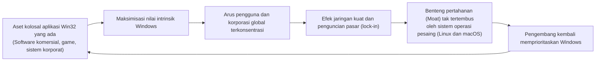

Dengan menjamin kompatibilitas mundur 100%, seluruh ratusan juta baris kode yang ditulis oleh para pemrogram di seluruh penjuru bumi selama lebih dari tiga dekade **secara otomatis diakumulasikan sebagai nilai tambah cuma-cuma bagi Windows generasi berikutnya**.

Betapapun meyakinkannya argumen keunggulan teknologi yang diajukan oleh para pendukung macOS atau Linux saat mendekati sektor korporasi, setiap negosiasi bisnis akan langsung terkunci oleh satu keberatan praktis: *"Sistem logistik dan inventaris yang kami bangun dua puluh tahun lalu tidak bisa berjalan di sistem operasi Anda"*. Kompatibilitas mundur menjelma menjadi benteng pertahanan persaingan bisnis paling kokoh yang pernah ada dalam sejarah industri teknologi.

### 8.2 Penguncian Mutlak Pasar Korporat (Enterprise Lock-in)

Pada segmen korporasi multinasional, industri manufaktur, dan lembaga pemerintahan, strategi ini menunjukkan kedigdayaan yang luar biasa.

Perusahaan-perusahaan Fortune 500, jaringan rumah sakit, institusi perbankan, dan pabrik-pabrik mengoperasikan ribuan sistem kritis yang dibangun puluhan tahun lalu dengan investasi jutaan dolar dalam bahasa Visual Basic 6 atau komponen C++ ActiveX. Sering kali, vendor pengembang aslinya sudah lama bangkrut, dokumen spesifikasinya hilang, dan kodenya telah menjadi "artefak hidup" yang tidak berani disentuh oleh siapa pun.

Seandainya Windows edisi baru memutuskan kompatibilitas dan menuntut perusahaan-perusahaan tersebut merombak total sistem internal mereka menggunakan teknologi web modern, para Chief Information Officer (CIO) akan langsung membekukan pembaruan komputer atau beralih mencari alternatif lain.

Namun, Windows datang mengayunkan tongkat ajaib AppCompat sambil berbisik: *"Anda tidak perlu mengubah apa pun; silakan beli PC baru, aplikasi lama Anda akan tetap berjalan dengan sempurna"*. Bagi para pengambil keputusan korporat, tidak ada tawaran yang lebih aman, masuk akal, dan menguntungkan daripada ini. Dengan cara inilah korporasi global terikat secara permanen di dalam ekosistem Windows.

### 8.3 "Jebakan Kesuksesan": Penghambat Inovasi Disruptif

Namun, kesuksesan yang sangat masif ini menyimpan ironi tersendiri: di kemudian hari, ia bertransformasi menjadi **"Jebakan Kesuksesan" (Success Trap)** yang membelenggu Microsoft dari dalam ketika hendak melakukan lompatan inovasi radikal.

Pada awal dekade 2010-an, seiring meledaknya popularitas sistem operasi mobile seperti iOS dan Android, Microsoft berupaya memodernisasi arsitektur Windows dengan memperkenalkan Universal Windows Platform (UWP). Konsep UWP mengusung lingkungan eksekusi yang terisolasi ketat dalam sandbox, aman, dan hemat daya, dengan niat terselubung untuk memensiunkan model klasik Win32 secara bertahap.

Namun, para pengembang dan kalangan korporat mengabaikan UWP secara massal: *"Mengapa kami harus membuang sumber daya besar untuk menulis ulang software kami ke dalam framework yang terikat batasan izin, jika aplikasi Win32 kami yang lama tetap berjalan kencang dan leluasa di Windows 10 maupun Windows 11?"*.

Kestabilan dan ketangguhan Win32 sudah terlanjur begitu mendarah daging di pasar global hingga **Microsoft sendiri pun tidak berdaya untuk mematikannya**. Pada akhirnya, Microsoft terpaksa melunakkan strateginya: membuka Microsoft Store untuk menampung aplikasi Win32 tradisional dan membangun kembali framework antarmuka modernnya, WinUI 3 (Windows App SDK), di atas fondasi abadi Win32. Tembok pertahanan terkuat yang mereka bangun dengan tangan sendiri berbalik menjadi rintangan terbesar bagi ambisi pembaruan mereka.

---

## Bab 9: Harga dari Kejayaan — Beban Utang Teknis Raksasa dan Labirin Keamanan

Menanggung beban kesalahan kode buatan pihak ketiga dan melindungi seluruh aset masa lalu bukanlah anugerah yang gratis. Sebagai gantinya, para insinyur Windows dihukum untuk terus berperang melawan tumpukan "utang teknis" (technical debt) paling dahsyat dalam sejarah rekayasa perangkat lunak.

### 9.1 Ratusan Juta Baris Kode dan Matriks Pengujian Astronomis

Saat ini, total volume kode sumber Windows diyakini telah menembus angka **ratusan juta baris**. Namun, tantangan yang paling mengerikan bagi tim pengembang adalah matriks kombinatorial pengujian yang harus dijalankan pada setiap kali sistem operasi selesai di-build.

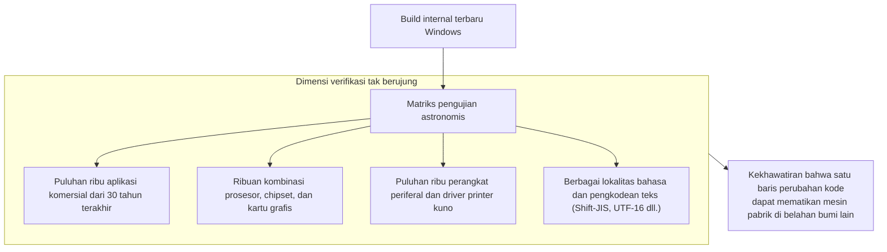

Satu pemeriksaan pointer tambahan atau pergeseran kecil dalam urutan penguncian thread di tingkat kernel menyimpan risiko laten: hal itu bisa memicu deadlock pada program pengendali mesin pabrik berusia 30 tahun di belahan dunia lain. Demi menangkal mimpi buruk ini, Microsoft mengoperasikan fasilitas pengujian raksasa yang berisi puluhan ribu komputer fisik dan mesin virtual, di mana skrip otomatis tanpa henti menjalankan software dari berbagai era untuk memeriksa apakah jendela utamanya tetap terbuka secara normal.

### 9.2 Celah Keamanan yang Dipicu oleh API Warisan

Sisi paling berbahaya dari warisan teknis ini berada di ranah **keamanan siber**.

Banyak API Win32 klasik dirancang pada era 1990-an sebelum kehadiran internet publik secara massal, di mana fokus utamanya adalah kecepatan eksekusi lokal dan belum mengenal konsep ketat pencegahan *buffer overflow* atau pembagian hak akses granular. Namun, mandat kompatibilitas melarang keras penghapusan fungsi-fungsi berisiko tersebut dari sistem operasi.

Para peretas dan peneliti keamanan memanfaatkan celah di sudut-sudut historis ini: antarmuka lama dan sambungan antarlapisan Shim menjadi jalur favorit untuk melancarkan eskalasi hak istimewa (privilege escalation) dan meloloskan diri dari sandbox. Keramahan sistem operasi terhadap kode masa lalu secara langsung memperluas bidang sasaran serangan (attack surface) sistem secara keseluruhan.

### 9.3 Runtuhnya Proyek Longhorn dan Refactoring Menuju "MinWin"

Akumulasi beban antara penambahan fitur modern dan pelestarian lapisan kompatibilitas mencapai titik puncaknya pada pertengahan tahun 2000-an: **kehancuran bersejarah proyek "Longhorn"**.

Dirancang sebagai penerus revolusioner Windows XP, proyek Longhorn tenggelam dalam jeratan ketergantungan yang kusut antara fitur-fitur baru yang ambisius dan kode-kode warisan. Kode sumbernya menjadi benang kusut yang tak terurai: build sistem gagal setiap hari, kecepatan kerja tim anjlok ke titik nol, dan proyek tersebut mengalami kelumpuhan total.

Pada musim panas tahun 2004, dewan direksi Microsoft mengambil keputusan drastis dengan melakukan "Longhorn Reset": membuang hasil kerja beberapa tahun ke tempat sampah dan memulai kembali pengembangan dari basis kode Windows Server 2003 SP1 yang terbukti kokoh dan stabil (yang kelak melahirkan Windows Vista).

Dari krisis berat tersebut, tim pengembang Windows melakukan restrukturisasi arsitektur secara mendalam dengan memisahkan lapisan kernel terbawah yang esensial menjadi modul mandiri yang ramping bernama **"MinWin"**. Berkat pemisahan tegas antara fungsi vital kernel dan subsistem kompatibilitas di atasnya, arsitektur Windows berhasil bertahan dan tetap lincah tanpa runtuh di bawah beban bobotnya sendiri.

---

## Kesimpulan: Pujian untuk Para Insinyur Pragmatis — Peradaban Modern yang Berdiri di Atas Keajaiban "Program yang Berjalan"

Komputer di ruang administrasi rumah sakit, mesin ATM jaringan perbankan dunia, sistem persinyalan kereta api, mesin bubut otomatis di pabrik perakitan, dan monitor para pengambil keputusan ekonomi global memiliki satu kesamaan tak kasat mata: di dasar terdalam sistemnya, Windows bekerja tanpa lelah.

Jika Microsoft bersikap kaku sebagai penganut setia estetika akademis ilmu komputer dan, seperti Apple, memilih untuk membuang software lama setiap beberapa tahun sekali, bagaimana jadinya wajah dunia modern kita hari ini?

Pabrik-pabrik di seluruh dunia akan terhenti, perusahaan menengah akan bangkrut karena biaya penulisan ulang software yang tak berujung, dan infrastruktur layanan publik akan dilanda kekacauan. Apabila roda perekonomian digital dan masyarakat informasi global dapat bergerak maju secara mulus tanpa terputus selama empat dekade terakhir, hal itu semata-mata karena Windows **dengan tabah memikul di pundaknya seluruh kecerobohan, kesalahpahaman, bug, dan peninggalan masa lalu dari generasi pemrogram di seluruh dunia**.

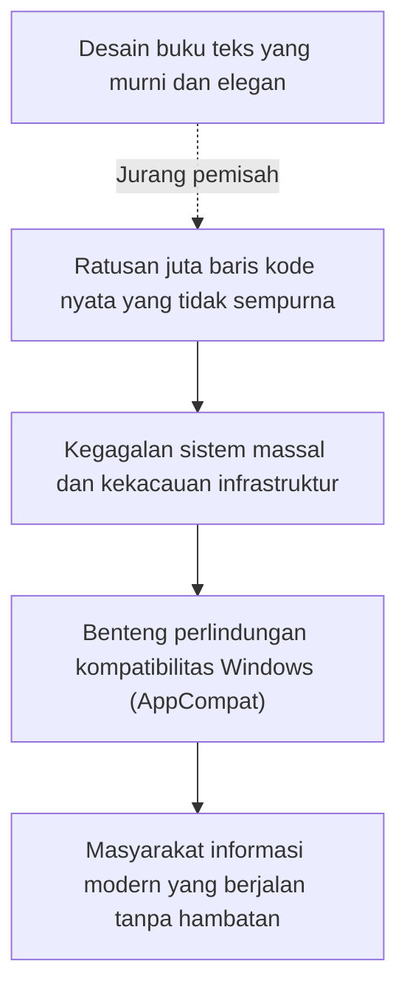

Bagi Raymond Chen dan generasi insinyur anonim yang merawat jantung sistem operasi Windows, menghabiskan malam tanpa tidur demi meneliti kode assembler dan merakit Shim penyelamat bagi bug memori perusahaan lain bukanlah pekerjaan yang glamor. Di sana tidak ada tepuk tangan untuk teori akademis baru ataupun panggung megah startup Silicon Valley.

Namun, pengorbanan itulah yang menjadi wujud tertinggi dari **kehebatan rekayasa profesional sejati**.

Rekayasa sejati bukanlah duduk manis di ruangan steril mengagumi formula matematika murni yang runtuh saat pertama kali menyentuh realitas. Rekayasa sejati adalah keberanian untuk terjun ke dalam lumpur kenyataan, menyatukan ketidaksempurnaan dunia yang dibuat oleh manusia-manusia yang tidak sempurna, dan dengan setia memastikan bahwa **apa yang berjalan kemarin akan tetap terus berjalan hari ini, esok, dan hingga puluhan tahun mendatang**.

"Jangan pernah rusak aplikasi lama" — di atas aturan mutlak yang nyaris gila ini dan dedikasi gigih para pemrogram tanpa nama yang mewujudkannya, peradaban digital yang kita cintai hari ini tetap berjalan dengan damai, seolah-olah tidak pernah ada masalah apa pun yang terjadi.
