## 서론: OS의 본질이란 무엇인가 —— “아름다운 설계”인가 “진흙탕 같은 동작”인가

컴퓨터 과학의 권위 있는 강의나 우아한 소프트웨어 공학 교과서를 펼치면, 그곳에는 늘 “세련된 추상화”, “관심사의 분리”, “직교성을 갖춘 API 설계”와 같은 감미로운 이상이 가득하다. 운영체제(Operating System)란 하드웨어의 복잡성을 은폐하고, 애플리케이션을 향해 직관적이고 통일된 클린 인터페이스를 제공하는 신성한 중재자여야 한다는 믿음 말이다.

하지만 대학의 상아탑을 벗어나 상용 데스크톱 OS의 냉혹한 전쟁터에 발을 디디는 순간, 그 순수무구한 이상은 산산이 부서진다. 개인용 컴퓨터의 역사에서 가장 눈부신 상업적 성공을 거두고 전 세계 수십억 대의 PC를 지배해 온 거인 Windows가 체현해 온 철학은 교과서적인 아름다움의 대척점에 있는 **“광기 어린 수준의 진흙투성이 현실주의(프래그머티즘)”**였기 때문이다.

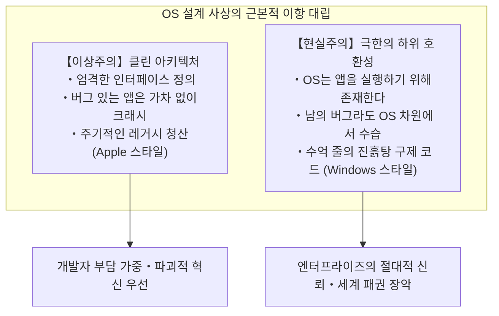

지구상에 현존하는 모든 운영체제 중에서 Windows만큼 ‘과거의 유산’에 대해 비정상적일 정도의 집념을 불태워 온 OS는 단 하나도 없다. 1995년에 발매된 게임 CD-ROM, 1990년대 초반 Visual Basic 3.0이나 C++로 작성된 기업용 회계 소프트웨어, DOS 시절의 유물, 문서화되지 않은 내부 동작을 불법 해킹해 돌아가던 오래된 유틸리티에 이르기까지——그 수많은 프로그램이 2020년대 중반의 최첨단 OS인 ‘Windows 11’ 위에서 아무 일도 없었다는 듯 더블클릭 한 번으로 완벽하게 실행된다.

대다수 사람들은 이를 “소프트웨어가 그저 당연히 돌아가는 것”으로 여기며 일상의 풍경으로 소비한다. 그러나 OS 내부의 소스코드를 리버스 엔지니어링하고 그 심연을 들여다본 시스템 프로그래머들은 누구나 숨을 들이켜며 전율한다. 그 화려한 UI 이면에는, 셀 수 없이 많은 서드파티 애플리케이션의 버그, 규격 위반, 메모리 파괴, 정의되지 않은 동작을 구제하기 위해 Microsoft 엔지니어들이 30년 넘게 쌓아 올린 **“수만 줄에 달하는 특례 예외 코드, 동적 API 위장, 그리고 운영체제 스스로가 거짓말을 하는 메커니즘(Shim)”**이 지층처럼 겹겹이 퇴적되어 있기 때문이다.

왜 Microsoft는 그토록 집요하게 ‘남이 작성한 불완전한 코드’를 OS 차원에서 짊어지고 뒤처리를 감당해야만 했을까?
왜 Apple처럼 ‘과거를 단호하게 잘라내는’ 길을 선택하지 않았을까?
그리고 그 광기 어린 엔지니어링은 어떻게 Windows를 그 누구도 무너뜨릴 수 없는 ‘세계 최강의 플랫폼’으로 끌어올렸을까?

본 글은 전직 Microsoft의 전설적인 프로그래머들의 증언, Windows 내부에 숨겨진 리버스 엔지니어링 데이터, PE 바이너리와 NT 커널의 심층 구조, 그리고 IT 플랫폼 전략사를 종횡무진 넘나들며, Windows를 지배하는 절대적 철칙——**“과거의 앱을 절대 망가뜨리지 마라(Don't break old apps)”**의 전모를 낱낱이 밝히는 결정판 문서다.

---

## 제1장: 양대 거두가 증언하는 ‘절대적 제1명령(프라임 디렉티브)’

Windows 내부 개발팀이 공유해 온 호환성에 대한 집념은 외부 사람들이 상상한 뜬소문이 아니라, 실제로 최전선에서 코드를 작성하고 아키텍처를 결정해 온 두 명의 전설적 프로그래머에 의해 전 세계에 생생하게 폭로되었다.

### 1.1 레이먼드 첸(Raymond Chen)과 『The Old New Thing』

Microsoft Windows 개발팀에는 30년 넘게 ‘살아있는 전설’로 군림하고 있는 인물이 있다. 1992년 Microsoft에 입사한 이래 Windows 95의 셸, User32, Win32 서브시스템의 가장 깊은 심장부를 보수·개발해 오고 있는 수석 소프트웨어 엔지니어, **레이먼드 첸(Raymond Chen)**이다.

첸이 사내 블로그로 시작하여 현재까지도 Microsoft 공식 기술 포털에서 연재를 이어가고 있는 블로그 **『The Old New Thing』**(후에 단행본으로 출간되어 시스템 프로그래머들의 바이블이 되었다)은, Windows가 얼마나 진흙탕 같은 호환성 문제를 헤쳐 왔는지를 기록한 경이로운 보고서다.

첸이 끊임없이 강조하는 Windows 개발팀의 기본 공리는 냉철할 정도로 단순하다:

> “Windows라는 운영체제는 프로그램을 실행하기 위해 존재한다. 사용자는 OS의 자태를 감상하기 위해 PC를 사는 것이 아니다. 그 위에서 돌아가는 특정 애플리케이션을 사용하고 싶기 때문에 PC를 사는 것이다.
> 
> 그리고 그 무엇보다 잔혹한 현실은 바로 이것이다——**사용자가 새로운 Windows로 업그레이드했을 때 애용하던 애플리케이션이 작동하지 않으면, 사용자는 절대 그 앱의 개발사를 탓하지 않는다. 100% ‘Windows가 고장 났다’, ‘새 Windows는 불량품이다’라며 Microsoft를 맹비난한다.**”

프로그래머의 자존심으로 따지자면 “애플리케이션 코드에 버그가 있어서 크래시가 난 것이니 당연한 결과이며, 앱 개발사가 수정 패치를 배포해야 마땅하다”고 주장하고 싶을 것이다. 그러나 상용 OS 시장에서 그러한 논리는 전혀 통하지 않는다. 사용자에게 와닿는 현실은 “어제까지 멀쩡히 돌아가던 프로그램이 Windows를 업데이트하는 순간 먹통이 되었다”는 단 하나의 사실뿐이기 때문이다.

만약 Microsoft가 “그것은 소프트웨어 회사의 버그입니다”라고 정론을 들이대며 매몰차게 거절한다면, 사용자는 업그레이드를 거부하고 구버전 OS에 주저앉거나 경쟁 플랫폼으로의 이탈을 검토할 것이다. 따라서 비즈니스적 필연으로서 Windows 개발팀에는 다음과 같은 가혹한 명제가 주어지게 되었다.

**“설령 애플리케이션 쪽이 아무리 엉망진창이고, 규격을 위반하고, 결함투성이 코드를 작성해 놓았더라도, OS 측에서 이를 감지하여 무대 뒤에서 수습하고, 아무 일도 없었던 것처럼 매끄럽게 동작시켜야만 한다.”**

첸의 블로그에는 이 신념을 지키기 위해 그와 그의 동료들이 강요받아야 했던, 눈물겹고도 광기 어린 수많은 해킹의 기록이 적나라하게 담겨 있다.

### 1.2 조엘 스폴스키(Joel Spolsky)의 폭로: 『Microsoft는 어떻게 API 전쟁에서 패배했는가』

이 철학의 무시무시함을 전 세계 웹 개발자와 IT 비즈니스계에 결정적인 형태로 각인시킨 인물이 바로 **조엘 스폴스키(Joel Spolsky)**다. 그는 1990년대 초 Microsoft에서 Excel 개발팀의 프로그램 매니저로 근무했으며, 이후 개발자 Q&A 사이트 ‘Stack Overflow’와 프로젝트 관리 툴 ‘Trello’를 창업한 세계 굴지의 소프트웨어 에세이스트다.

2004년, 스폴스키는 자신의 웹사이트에 『How Microsoft Lost the API War(마이크로소프트는 어떻게 API 전쟁에서 졌는가)』라는 제목의 역사적인 명 에세이를 기고했다. 그 글에서 그는 당시 Windows 팀의 수장이었던 존 드반(Jon DeVaan) 등의 강력한 리더십을 회고하며 다음과 같이 적었다:

> "In the Windows team, the prime directive was: **don't break old apps.**"
> (Windows 팀에서 절대 어겨서는 안 되는 지고의 제1명령(프라임 디렉티브)은 ‘과거의 앱을 절대 망가뜨리지 마라’였다.)

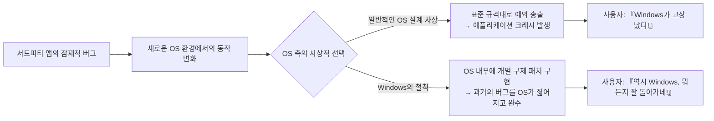

스폴스키는 이를 알기 쉽게 비유했다. SF 드라마 『스타트렉(Star Trek)』에서 우주함대 장교들이 결코 어겨서는 안 되는 최고 규율이 ‘행성연방의 제1명령(Prime Directive: 미개 문명의 발전에 간섭해서는 안 된다)’이듯, Windows 팀 프로그래머들에게 프라임 디렉티브란 바로 ‘기존 애플리케이션의 동작을 단 하나도 깨뜨리지 않는 것’이었다.

만약 어떤 Windows 커널 개발자가 커널이나 API 코드를 우아하게 리팩터링하여 실행 속도를 2배 끌어올렸다 하더라도, 그 변경으로 인해 시중에 유통되던 무명의 업무용 소프트웨어 단 하나라도 크래시가 난다면, 그 리팩터링은 가차 없이 반려(Reject)되었다. Windows 팀에서 코드의 우아함이나 아키텍처의 순결성은 뒷전이었으며, **“기존 바이너리가 100% 돌아갈 것”이야말로 절대선**이었던 것이다.

### 1.3 “버그조차 규격이 된다”: 하이럼의 법칙(Hyrum's Law)과 API의 비가역성

소프트웨어 공학에는 Google의 엔지니어 하이럼 라이트(Hyrum Wright)가 주창한 **‘하이럼의 법칙(Hyrum's Law)’**이라는 유명한 경험칙이 존재한다.

> **하이럼의 법칙(Hyrum's Law)**:
> “API의 사용자 수가 충분히 많아지면, API 설계자가 문서 규격에서 무엇을 약속했는지는 더 이상 중요하지 않다. 시스템의 모든 관찰 가능한 동작(버그나 정의되지 않은 부작용을 포함하여)은 결국 누군가의 코드에 의해 의존된다.”

Windows는 이 ‘하이럼의 법칙’을 전 세계에서 가장 대규모로, 그리고 가장 가혹한 형태로 끊임없이 실증해 온 플랫폼이다.

예를 들어 어떤 Windows API 공식 문서에 “세 번째 인자에는 유효한 윈도우 핸들(HWND)을 전달해야 한다. 유효하지 않은 값을 전달했을 때의 동작은 정의되지 않는다”라고 명시되어 있었다고 하자. 그런데 세상의 부주의한 프로그래머가 실수로 그 자리에 `NULL`이나 깨진 포인터를 넘겨버렸고, 우연히도 당시 Windows 3.1 구현에서는 운 좋게 아무 에러도 뿜지 않고 그냥 통과되었다고 치자.

이 애플리케이션이 전 세계에 수십만 카피 판매된 후, 차세대 Windows 95나 Windows NT 개발팀이 “인자 유효성 검사를 엄격히 하여 유효하지 않은 포인터가 들어오면 정석대로 `ERROR_INVALID_PARAMETER`를 반환하도록 고치자”라며 구현을 올바르게 수정하는 순간 어떤 일이 벌어질까?

수만 군데의 기업 사무실에서 그 오래된 소프트웨어가 일제히 에러 창을 띄우며 강제 종료된다. 그리고 분노한 사용자들은 Microsoft 고객지원센터로 전화를 걸어 고함을 지른다. “Windows를 새것으로 바꿨더니 회사 업무가 마비됐다!”

결국 Microsoft 엔지니어들은 자신이 작성한 ‘올바른 코드’를 굴욕적으로 철회하고, 다음과 같은 기상천외한 타협 코드를 작성해야만 했다:

```c
// 개념적인 Windows 내부 API 재현 예시
BOOL WINAPI DoSomething(HWND hWnd, UINT uMsg, WPARAM wParam, LPARAM lParam)
{
    // 교과서적으로 올바른 유효성 검증
    if (!IsWindow(hWnd)) {
        // 원칙대로라면 여기서 즉시 에러를 반환해야 마땅하다
        // SetLastError(ERROR_INVALID_WINDOW_HANDLE);
        // return FALSE;

        // 【호환성을 위한 해킹】
        // 과거의 모 유명 앱 X는 초기화 시 NULL 핸들을 넘겨온다.
        // 여기서 에러를 반환하면 앱 X가 즉사하므로,
        // 데스크톱 윈도우의 핸들로 은밀하게 바꿔치기하여 무마한다.
        if (IsTargetBadApplication("AppX.exe")) {
            hWnd = GetDesktopWindow();
        } else {
            SetLastError(ERROR_INVALID_WINDOW_HANDLE);
            return FALSE;
        }
    }

    // 본래의 로직을 계속 진행...
    return InternalDoSomething(hWnd, uMsg, wParam, lParam);
}
```

운영체제가 세상에 나와 시장의 사실상 표준(Defacto Standard)이 된 순간, API의 규격이란 ‘문서에 적힌 텍스트’가 아니라 **‘기존 구현이 우연히 보여주었던, 온갖 버그를 포함한 모든 동작의 총체’**로 탈바꿈한다. Windows 팀은 이 피할 수 없는 굴레를 정면으로 응시하며, 전 세계 애플리케이션의 버그를 OS의 영구적인 규격으로 떠안겠다는 비장한 각오를 다진 것이다.

---

## 제2장: 전설의 서막 —— ‘심시티(SimCity) 사건’의 기술적 진상

Windows 개발팀의 하위 호환성을 향한 집념을 상징하는 에피소드로서 컴퓨터 역사에 영원히 이름을 남기게 된 사건이 있다. 바로 1995년 Windows 95 개발 클라이맥스에 터진 **‘심시티(SimCity) 사건’**이다.

### 2.1 해제 후 사용(Use-After-Free)의 물리적 메커니즘

1989년 윌 라이트(Will Wright)가 이끄는 맥시스(Maxis) 사에서 탄생시킨 도시 경영 시뮬레이션 게임 『심시티(SimCity)』는 PC 게임 역사상 불후의 금자탑이었으며, 당시 전 세계적으로 폭발적인 인기를 구가하고 있었다. 일반 가정의 사용자는 물론, 업무 틈틈이 머리를 식히려는 직장인들에게도 PC에서 심시티가 쾌적하게 돌아가는지 여부는 제품 구매를 좌우하는 사활이 걸린 문제였다.

당시 DOS 및 Windows 3.1용으로 판매되던 PC판 『SimCity』 바이너리에는, 현대의 보안 감사 기준이라면 단번에 치명적 취약점으로 분류되었을 흉악한 버그가 숨어 있었다. 바로 **‘해제 후 사용(Use-After-Free, UAF)’**이다.

심시티의 코드는 도시의 그래픽을 렌더링하고 시뮬레이션 연산을 수행하는 과정에서 OS의 힙 할당자로부터 메모리 블록을 할당받고, 사용 후 이를 해제(`free` 또는 `GlobalFree`)했다. 그러나 프로그램 내부의 포인터가 해제된 후에도 정리되지 않고 그대로 남아 있었으며, **‘OS에 이미 반납한 메모리 영역에 대해 직후에 아무렇지 않게 계속해서 읽기 및 쓰기 접근을 시도하는’** 치명적인 결함 로직이 존재했던 것이다.

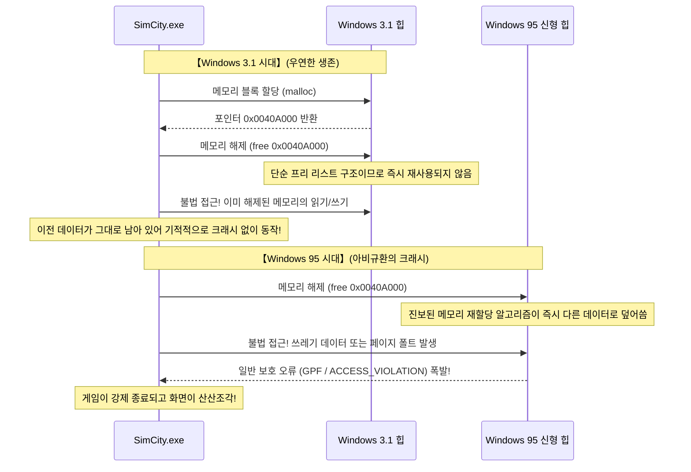

16비트 OS인 Windows 3.1에서는 메모리 관리 시스템이 대단히 원시적이었다. 애플리케이션이 메모리를 해제하더라도 단순한 프리 리스트(Free List) 구조 때문에 그 영역의 내용이 즉시 다른 용도로 재할당되거나 덮어씌워지는 일이 드물었다. 즉, 심시티는 명백히 ‘완전히 망가진 코드’였음에도 불구하고, **‘Windows 3.1의 메모리 관리가 너무나 둔탁하고 단순했던 덕분에 우연히 크래시 없이 살아남아 돌아갔을 뿐’**이었던 것이다.

### 2.2 보통의 소프트웨어 공학 vs Windows 팀의 광기

그런데 1995년, PC 업계의 판도를 뿌리째 뒤흔든 차세대 32비트 OS ‘Windows 95’가 등장한다.

Windows 95는 진정한 선점형 멀티태스킹, 세련된 가상 메모리 관리자, 그리고 단편화를 방지하고 캐시 효율을 극대화하는 고속의 첨단 힙 할당자를 탑재하고 있었다. 이 현대적인 메모리 관리자는 애플리케이션이 메모리를 반납하면 메모리 효율을 극대화하기 위해 **즉시 해당 영역을 다른 용도로 재배치하고 내부 데이터를 초기화하거나 덮어쓰도록** 정밀하게 설계되어 있었다.

이 최신 할당자 위에서 심시티를 구동한 순간 어떤 참극이 벌어졌을까?
심시티는 방금 해제한 메모리를 태연하게 다시 읽으러 갔고, 그곳에 있어야 할 데이터 대신 엉뚱한 프로세스의 데이터나 제로 클리어된 허공과 충돌했다. 다음 순간, 악명 높은 **‘일반 보호 오류(General Protection Fault: GPF)’** 경고창이 터져 나오며 플레이어가 수십 시간 동안 공들여 키워온 거대 도시는 순식간에 전자 먼지로 화해 허공으로 사라졌다.

이 비상사태 앞에서 통상적인 소프트웨어 공학 상식이나 타 OS 벤더였다면 과연 어떤 결정을 내렸을까?

답은 너무나 자명하다. “이것은 100% 맥시스 사의 프로그래밍 과실이다. OS의 메모리 관리는 규격에 완벽히 부합하게 정직하게 동작하고 있다. 맥시스 측에 버그를 통보하고, 그들이 수정 패치(SimCity 1.01)를 플로피디스크에 담아 사용자에게 배포하기를 기다려야 한다”——이것이 만인이 납득할 수 있는 정론이다.

그러나 Microsoft 수뇌부와 Windows 95의 출시 성공에 목숨을 걸고 있던 개발팀이 내린 결정은 가히 광기 그 자체였다.

**“심시티가 크래시 나게 두어서는 안 된다. 게임 회사가 고칠 때까지 기다릴 여유 따위는 없다. Windows 95의 커널 메모리 관리자 자체에 특례 패치를 심어서 심시티가 돌아가도록 OS를 뜯어고쳐라.”**

### 2.3 메모리 할당자에 구현된 심시티 전용 해킹의 전말

조엘 스폴스키는 앞서 언급한 에세이에서 이 역사적인 결단의 순간을 다음과 같이 증언했다:

> “Windows 95 베타 테스트 도중, 그들은 심시티가 제대로 작동하지 않는다는 사실을 발견했다. Microsoft는 어떻게 대처했을까?
> 그들은 심시티 개발자를 쫓아가서 고치라고 다그치지 않았다. Windows 95 메모리 관리자 담당 엔지니어가 직접 특별한 전용 코드를 덧붙여 넣었다. **‘만약 지금 실행 중인 프로그램이 심시티라면, 해제된 메모리를 즉시 재할당하지 말고 한동안 그대로 보존해 둘 것’**이라는 코드를.”

현대 보안 관점에서 이 해킹의 기술적 본질은 바로 오늘날 말하는 ‘격리 힙(Quarantine Heap)’ 또는 ‘지연 해제(Delayed Free)’ 메커니즘의 원형에 해당한다.

Windows 95의 힙 할당자는 프로세스가 기동할 때 실행 파일 이름(`SIMCITY.EXE`)과 헤더 정보를 대조하여, 대상이 심시티라고 판정되면 메모리 할당 동작 모드를 일반 모드에서 ‘심시티 구제 모드’로 즉각 전환했다. 평소 같으면 해제 요청된 메모리 블록을 즉시 병합(Coalescing)하여 재사용 풀로 돌렸겠지만, 심시티 실행 시에 한해서는 해제 요청이 들어온 포인터를 임시 원형 큐(Ring Buffer)에 격리 대피시켜, 일정 기간 이전 메모리 블록이 파괴되지 않도록 강력하게 보호한 것이다.

교과서를 찢어 발기고 OS 스스로가 모든 오명을 뒤집어쓴 이 처절한 희생 덕분에, Windows 95 출시 당일 전 세계 수많은 유저들은 아끼는 심시티 플로피디스크를 드라이브에 넣고 아무런 에러 없이 완벽하게 시장으로서의 집무를 계속할 수 있었다.

유저들은 입을 모아 찬사를 보냈다. “Windows 95는 정말 대단해! 옛날 소프트웨어가 죄다 그대로 돌아가잖아!”
그 뒤편에서, 자신들이 심혈을 기울여 만든 최첨단 커널에 남의 버그를 수습하기 위한 누더기 패치를 끌어안아야 했던 Microsoft 엔지니어들의 씁쓸한 쓴웃음을 알아차린 사람은 세상에 단 한 명도 없었다.

---

## 제3장: 역사를 수놓은 ‘눈물겨운 호환성 해킹’의 계보

심시티 사건은 빙산의 일각에 불과하다. Windows가 오늘날에 이르기까지 걸어온 30여 년의 세월은, 전 세계에서 만들어진 규격 외의 엉터리 소프트웨어들을 어떻게든 연명시키기 위해 감행된 상상을 초월하는 호환성 해킹의 연속이었다.

### 3.1 Lotus 1-2-3와 Excel의 ‘1900년 윤년 버그’

컴퓨터의 역법 계산 분야에서 전 세계에서 가장 유명하며, 지금 이 순간에도 지구상의 모든 PC에서 수정되지 않은 채 살아 숨 쉬고 있는 버그가 있다. 바로 **‘1900년을 윤년(Leap Year)으로 오인하는 버그’**다.

그레고리력의 엄격한 정의에 따르면 윤년의 판별 규칙은 다음과 같이 명확하다:
1. 연도가 4로 나누어떨어지는 해는 윤년으로 한다.
2. 단, 연도가 100으로 나누어떨어지는 해는 평년으로 한다.
3. 단, 연도가 400으로 나누어떨어지는 해는 윤년으로 한다.

따라서 서기 1900년은 ‘100으로 나누어떨어지지만 400으로는 나누어떨어지지 않는 해’이므로 **평년이며, 1900년 2월 29일이라는 날짜는 아예 존재하지 않는다**.

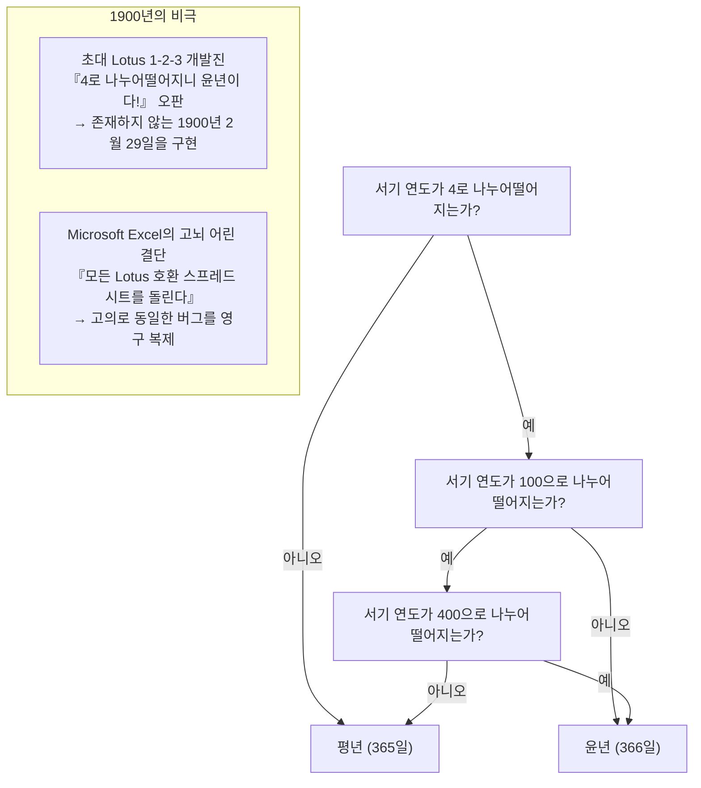

그런데 1980년대 전반 DOS 시장을 완전히 지배하고 있던 스프레드시트의 제왕 『Lotus 1-2-3』의 개발진은 이 ‘100의 예외 규칙’을 누락하여 1900년을 윤년으로 계산하는 코드를 작성하고 말았다. 그 결과 Lotus 1-2-3의 세계에서는 가상의 날짜인 ‘1900년 2월 29일’이 엄연히 존재했고, 내부 날짜 일련번호(Serial Number)가 하루씩 밀려나는 오차가 발생했다.

후발 주자로서 스프레드시트 시장에 진입한 Microsoft의 『Excel』 개발팀은 중대한 기로에 섰다. 수학적·역법적으로 올바른 달력을 구현할 것인가, 아니면 당시 이미 전 세계 기업들의 재무제표로 수천만 장씩 생성되어 있던 Lotus 1-2-3 스프레드시트와의 계산 결과 일치를 우선할 것인가?

빌 게이츠가 이끄는 Microsoft의 선택은 주저 없이 후자였다. Excel은 Lotus 1-2-3로부터의 데이터 마이그레이션을 완벽하게 보장하기 위해, **“자신들도 의도적으로 1900년 2월 29일이 존재한다는 치명적 버그를 그대로 똑같이 구현한다”**는 경악스러운 길을 택했다.

지금 여러분의 PC에서 최신 Microsoft 365 Excel을 실행하여 아무 셀에나 `=DATE(1900, 2, 29)`라고 입력해 보라. 놀랍게도 21세기의 최신 AI 기능을 탑재한 최첨단 Excel조차 아무런 에러 없이 ‘1900-02-29’라는 존재하지 않는 날짜를 태연하게 출력한다. 경쟁사의 버그를 끌어안겠다는 결정은, 한 번 내려지면 수십 년은 물론 세기를 넘어서도 영원히 되돌릴 수 없는 것이다.

### 3.2 왜 ‘Windows 9’는 건너뛰었는가

2014년, Microsoft는 Windows 8.1의 후속 운영체제를 발표했다. 온 세상이 ‘당연히 다음은 Windows 9겠지’라고 예상하고 있었으나, 무대에 오른 경영진이 발표한 공식 명칭은 전 세계를 경악하게 만든 **‘Windows 10’**이었다.

왜 숫자 ‘9’는 결번으로 처리되어 허공으로 사라졌을까? 마케팅 차원의 혁신성을 강조하기 위해서라는 공식적인 수사 이면에서, 개발자 커뮤니티의 리버스 엔지니어들과 전직 직원들에 의해 대단히 생생하고 설득력 넘치는 ‘호환성 지뢰’의 실체가 폭로되었다.

전 세계에 널려 있는 무수한 오래된 서드파티 애플리케이션, Java 라이브러리, 각종 소프트웨어 인스톨러 내부에는, 현재 실행 중인 OS 버전을 판별하기 위해 다음과 같은 날림 코드가 산더미처럼 작성되어 있었던 것이다:

```java
// 전 세계 무수한 오래된 소프트웨어에 만연했던 코드 패턴
String osName = System.getProperty("os.name");

if (osName.startsWith("Windows 9")) {
    // Windows 95 또는 Windows 98을 위한 구형 로직을 실행!
    // 16비트 호환 모드를 켜거나 구형 레지스트리 경로를 참조한다
    enableLegacyWin9xMode();
} else {
    // NT 기반의 현대적 OS (Windows NT, 2000, XP, 7, 8 등)를 위한 정상 처리
    enableModernNTMode();
}
```

이 코드를 작성한 개발자들은 ‘Windows 95’와 ‘Windows 98’을 한 번에 손쉽게 체크하기 위한 편법 단축키로 `startsWith("Windows 9")`를 사용했던 것이다.

만약 Microsoft가 정직하게 ‘Windows 9’라는 이름으로 OS를 출시했다면 어떤 대참사가 벌어졌을까?
최신 최고 사양 PC에 Windows 9를 설치하는 순간, 전 세계 수만 개의 기업용 소프트웨어와 레거시 도구들이 “이 PC는 1995년에 나온 Windows 95다”라고 착각하여, 현대적인 NT 커널 API는 거들떠보지도 않고 DOS 시절의 Win9x 전용 코드를 실행하려다 그 자리에서 즉사했을 것이다.

“단 하나의 이름 때문에 전 세계 소프트웨어가 박살 나는 위험을 감수할 수는 없다.” 호환성 파괴에 대한 Microsoft의 본능적인 공포심이 ‘Windows 9’라는 이름을 역사의 어둠 속으로 영구 매장한 것이다.

### 3.3 문서화되지 않은 API(Undocumented APIs)와 노턴 유틸리티

1990년대 시맨텍(Symantec) 사가 판매하던 시스템 진단·복구 툴 『노턴 유틸리티(Norton Utilities)』는 전 세계 PC 사용자들에게 없어서는 안 될 필수 도구였다. 그러나 Windows 개발팀에게 노턴 유틸리티는 늘 극심한 두통을 안겨주는 가장 공포스러운 ‘문제아 소프트웨어’의 대명사였다.

노턴과 같은 로우 레벨 시스템 유틸리티들은 Microsoft가 공식적으로 공개한 Win32 API에 만족하지 못하고, **“Windows 내부의 비공개 데이터 구조체, 문서화되지 않은 함수, 심지어 시스템 DLL 내부의 특정 메모리 오프셋에 직접 손을 찔러 넣는”** 극도로 위험천만한 해킹 수법을 밥 먹듯이 사용했기 때문이다.

레이먼드 첸은 Windows 95 개발 당시 노턴 유틸리티와의 사이에서 벌어졌던 처절한 암투를 회고한 바 있다. Windows 95의 내부 아키텍처가 개선되어 메모리 보호나 태스크 관리 내부 구조체의 크기가 단 1바이트라도 어긋나면, 노턴 유틸리티는 여지없이 블루스크린(BSoD)을 뿜어내며 시스템 전체를 다운시켰다.

이때도 Microsoft의 대응은 “미공개 구조체를 건드린 노턴의 잘못”이라며 개발사를 규탄하는 것이 아니었다. 그들은 노턴 유틸리티의 바이너리를 철저히 디스어셈블하여 완벽히 리버스 엔지니어링했고, 노턴이 도대체 어느 오프셋을 읽으러 들어오는지 정확히 파악해 낸 후, **“노턴이 기대하고 있는 더미(가짜) 미공개 데이터 구조체를 예전과 정확히 똑같은 메모리 주소에 고스란히 배치해 두는”** 믿기 힘든 호환성 계층을 OS 안에 심어 넣었다.

### 3.4 빌 게이츠가 산탄총을 든 날: DOOM과 DirectX/WinG 창세기

Windows 95가 발매되기 직전, PC 게임 시장에서 Windows의 위상은 참담하기 이를 데 없었다. 게임 개발자들은 Windows를 두고 “GUI 오버헤드가 너무 무거워 액션 게임 따위는 도저히 만들 수 없는 한심한 사무용 OS”라고 멸시했고, 모든 본격적인 게임은 MS-DOS 상에서 그래픽 칩셋과 사운드 카드(Sound Blaster)의 I/O 포트를 직접 때려가며 제작되었다.

그 시대를 상징하는 절대적인 존재가 바로 id Software가 개발한 전설적인 FPS 『DOOM(둠)』이었다. 당시 둠은 미국 전역의 직장 PC에 몰래 설치되어 전미 기업의 생산성을 떨어뜨리고 있다는 사회적 이슈를 불러일으킬 정도의 괴물 같은 소프트웨어였다.

빌 게이츠는 깊은 위기감을 느꼈다. “PC 사용자들이 게임을 하기 위해 DOS로 재부팅을 해야 한다면, Windows 95의 완전한 승리란 없다. 둠을 Windows 95 위에서 DOS 버전보다 훨씬 빠르고 강력하게 구동시켜야 한다.”

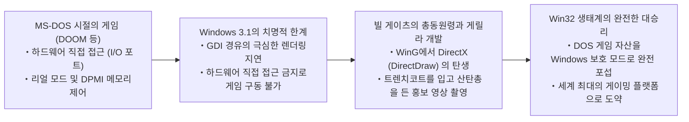

게이츠는 사내의 실력파 해커 엔지니어들을 총동원하여, 하드웨어를 직접 두드리는 DOS 게임의 동작을 Windows 보호 모드 하에서 고속으로 에뮬레이션하고 가속하기 위한 전용 그래픽 라이브러리 ‘WinG’, 그리고 훗날 ‘맨해튼 프로젝트(Manhattan Project)’라는 코드명으로 불린 **DirectX**의 개발을 진두지휘했다.

게이츠 본인 역시 트렌치코트를 걸쳐 입고 둠 게임 화면 속으로 합성되어 들어가 직접 산탄총을 쏘는 전설적인 프로모션 영상에 출연하며 “Windows 95야말로 궁극의 게임 플랫폼”이라고 전 세계에 포효했다. 이때 DOS 게임의 거친 하드웨어 직타 동작을 Windows의 보호 모드 아래에서 길들여 완벽히 동작시킨 엔지니어링 노하우가, 훗날 Windows를 세계 최강의 멀티미디어 호환성 제국으로 도약시키는 단단한 주춧돌이 되었다.

---

## 제4장: 현대 Windows를 지탱하는 거대 요새 ‘AppCompat(Application Compatibility)’

Windows 95 시절 호환성 해킹은 OS의 각 모듈 내부 여기저기에 흩뿌려진 임시방편(Ad-hoc) 특례 코드의 형태를 띠고 있었다. 그러나 소프트웨어의 수가 기하급수적으로 폭발한 Windows 2000 및 Windows XP 시대에 이르러 이 방식은 물리적 한계에 부딪혔다. OS 본체의 소스코드가 서드파티 구제를 위한 조건 분기문으로 누더기가 되어 더 이상 유지보수가 불가능한 지경에 이르렀기 때문이다.

이에 Microsoft의 천재적인 시스템 아키텍트들이 구축해 낸 것이 바로 현재의 Windows 11에 이르기까지 면면히 이어져 내려오고 있는 인류 최고봉의 호환성 엔진——**‘Application Compatibility(AppCompat, 애플리케이션 호환성)’ 서브시스템**이다.

### 4.1 AppCompat 서브시스템의 전체 구조

AppCompat 서브시스템이란 한마디로 **“구제 대상이 되는 애플리케이션 바이너리가 메모리에 로드되는 순간, OS가 그 정체를 실시간으로 식별하여 애플리케이션과 OS 커널 사이에 투명한 ‘위장 계층(Shim)’을 동적으로 끼워 넣는 지능형 요격 시스템”**이다.

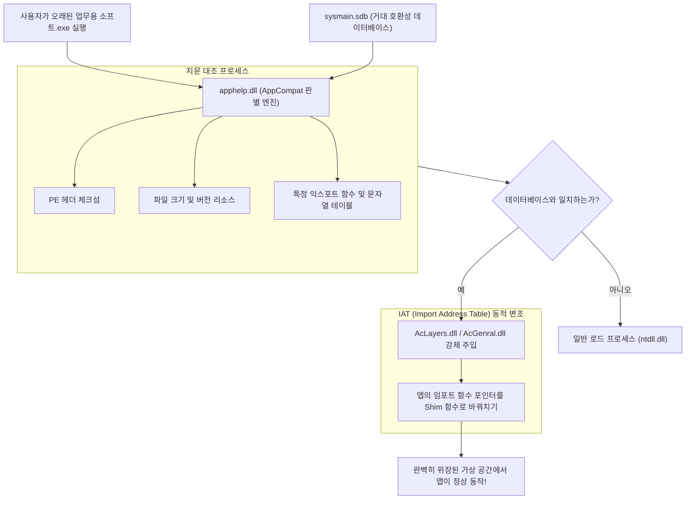

사용자가 어떤 애플리케이션의 실행 파일(EXE)을 더블클릭하면, Windows의 프로세스 생성 루틴(`ntdll.dll` 내부 루틴)은 곧바로 코드를 실행하는 대신 먼저 **`apphelp.dll`**을 호출한다.

`apphelp.dll`은 Windows 내부에 내장된 거대한 호환성 데이터베이스 **`sysmain.sdb`**를 초고속으로 탐색하여, “지금 실행하려는 이 바이너리가 과거에 특별한 구제가 필요한 것으로 등록된 앱인가?”를 엄밀하게 대조한다. 만약 해당한다면, OS 로더는 정규 시스템 DLL(`kernel32.dll`이나 `user32.dll` 등)을 로드하기 전에 호환성 레이어 전용 모듈인 **`AcLayers.dll`**이나 **`AcGenral.dll`**을 해당 프로세스의 가상 주소 공간에 강제로 주입한다.

### 4.2 Shim 엔진: IAT 후킹을 통한 API 가로채기 메커니즘

그렇다면 강제 주입된 Shim 엔진은 구체적으로 어떤 기술을 사용하여 애플리케이션을 감쪽같이 속이는 것일까? 그 핵심 기술이 바로 Windows 표준 실행 파일 형식인 PE(Portable Executable)의 **‘IAT(Import Address Table, 임포트 주소 테이블) 후킹’**이다.

Windows 프로그램이 외부 DLL의 함수(예: `GetVersionEx`나 `GetDiskFreeSpace`)를 호출할 때, 컴파일된 기계어 코드 내부에 외부 DLL 함수의 실제 물리적 메모리 주소가 하드코딩되어 있는 것이 아니다. 프로그램이 실행될 때 OS 로더가 각 DLL의 실제 배치 주소를 파악하여, 실행 파일의 메모리 영역에 위치한 ‘IAT(함수 포인터 배열 테이블)’에 실제 함수 주소를 채워 넣는다. 프로그램은 실행 내내 항상 이 IAT를 참조하여 간접적으로 API를 호출한다.

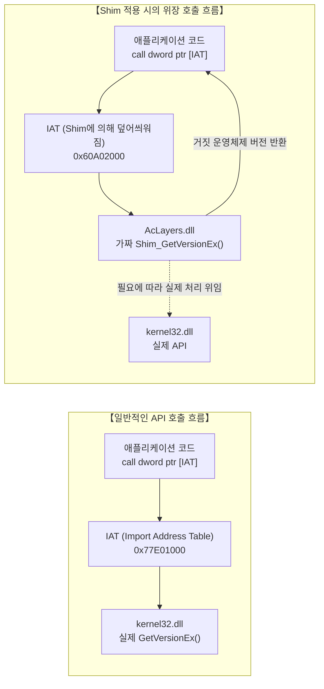

Shim 엔진은 바로 이 구조를 절묘하게 역이용한다. 프로그램 코드가 본격적으로 실행되기 직전 프로세스 공간에 끼어든 Shim 엔진은, `VirtualProtect`를 통해 IAT 메모리 페이지의 보호 속성을 `PAGE_READWRITE`로 잠시 변경한 후, **“IAT 테이블에 적혀 있는 정규 시스템 API 주소를 Shim 엔진 내부에 마련된 가짜 위장 함수(Shim 함수)의 주소로 덮어써 버리는”** 것이다.

이를 개념적인 C/C++ 의사코드로 나타내면 다음과 같다:

```c
// IAT 후킹을 통한 Shim 주입의 개념 증명 코드
#include <windows.h>
#include <imagehlp.h>

// 가짜 GetVersionEx 함수 (Shim의 실체)
BOOL WINAPI Shim_GetVersionExA(LPOSVERSIONINFOA lpVersionInformation)
{
    // 원래의 진짜 시스템 API를 호출하여 베이스 정보를 획득
    typedef BOOL (WINAPI *PFN_GETVER)(LPOSVERSIONINFOA);
    HMODULE hKernel = GetModuleHandleA("kernel32.dll");
    PFN_GETVER pfnRealGetVer = (PFN_GETVER)GetProcAddress(hKernel, "GetVersionExA");
    
    BOOL bResult = pfnRealGetVer(lpVersionInformation);
    
    // 【기만 공작】
    // 앱을 향해 "현재 OS는 틀림없는 Windows 95(Major: 4, Minor: 0)입니다"라고 새빨간 거짓말을 한다
    lpVersionInformation->dwMajorVersion = 4;
    lpVersionInformation->dwMinorVersion = 0;
    lpVersionInformation->dwBuildNumber = 950;
    lpVersionInformation->dwPlatformId = VER_PLATFORM_WIN32_WINDOWS;
    strcpy(lpVersionInformation->szCSDVersion, "");

    return TRUE; // 앱은 아무런 의심 없이 자신이 Windows 95에서 돌고 있다고 믿고 동작한다
}

// PE 바이너리의 IAT를 탐색하여 후킹을 거는 루틴
void InstallShimHook(HMODULE hAppModule, LPCSTR targetDll, LPCSTR targetFunc, PVOID newFuncAddress)
{
    ULONG size;
    // PE 헤더의 임포트 디렉터리를 획득
    PIMAGE_IMPORT_DESCRIPTOR pImportDesc = (PIMAGE_IMPORT_DESCRIPTOR)
        ImageDirectoryEntryToData(hAppModule, TRUE, IMAGE_DIRECTORY_ENTRY_IMPORT, &size);

    while (pImportDesc->Name) {
        LPCSTR dllName = (LPCSTR)((PBYTE)hAppModule + pImportDesc->Name);
        if (_stricmp(dllName, targetDll) == 0) {
            // 대상 DLL(kernel32.dll 등)의 성크 테이블 탐색
            PIMAGE_THUNK_DATA pThunk = (PIMAGE_THUNK_DATA)((PBYTE)hAppModule + pImportDesc->FirstThunk);
            while (pThunk->u1.Function) {
                PROC* ppfn = (PROC*)&pThunk->u1.Function;
                // 여기서 목적하는 함수 포인터를 발견하면 주소를 바꿔치기한다
                DWORD oldProtect;
                VirtualProtect(ppfn, sizeof(PROC), PAGE_READWRITE, &oldProtect);
                *ppfn = (PROC)newFuncAddress; // 위장 함수의 주소로 덮어쓰기!
                VirtualProtect(ppfn, sizeof(PROC), oldProtect, &oldProtect);
                break;
            }
        }
        pImportDesc++;
    }
}
```

이 경이로운 인터셉트 메커니즘을 통해, 애플리케이션 바이너리 자체는 단 1바이트도 수정하지 않고, 동시에 OS 커널의 핵심 로직을 전혀 오염시키지 않으면서, 구제 대상 프로그램만을 ‘완벽하게 조율된 가상의 과거 Windows 시공간’ 속에 가두어 둘 수 있게 되었다.

### 4.3 의문의 거대 바이너리 `sysmain.sdb` (Shim Database)

이 AppCompat 시스템의 사령탑 역할을 담당하고 있는 파일이 바로 모든 Windows의 `C:\Windows\AppPatch\` 폴더 안에 조용히 자리 잡고 있는 **`sysmain.sdb`**라는 바이너리 파일이다.

이 파일은 Microsoft 독자 규격의 바이너리 데이터베이스(SDB 포맷)로 작성되어 있으며, 내부에는 전 세계의 상용 소프트웨어, 셰어웨어, 고전 게임, 기업 인하우스 도구 등 **수만에서 수십만 종에 달하는 애플리케이션의 ‘구제 레시피’**가 고밀도로 압축되어 있다.

단순히 실행 파일 이름이 `setup.exe`라는 이유만으로 Shim을 무차별 적용했다가는 엉뚱한 최신 인스톨러 프로그램까지 오작동을 일으킬 위험이 있다. 따라서 `sysmain.sdb`의 매칭 엔진은 다음과 같은 다차원 ‘디지털 지문(Fingerprint)’을 조합하여 개별 바이너리를 대단히 엄격하게 특정한다:

1. **파일 이름 및 전체 경로**
2. **정확한 파일 크기(바이트 단위)**
3. **PE 헤더의 링커 타임스탬프(Linker Timestamp)**
4. **PE 체크섬(CheckSum)**
5. **버전 리소스 정보(CompanyName, ProductName, FileVersion, LegalCopyright 등)**
6. **특정 섹션의 해시값 및 익스포트 함수 테이블 구성**

예를 들어 어떤 사용자가 2001년에 발매된 백과사전 CD-ROM을 최신 Windows 11 PC 드라이브에 넣었다고 가정해 보자. `apphelp.dll`은 수 밀리초 만에 해당 EXE 파일의 디지털 지문을 스캔하여 `sysmain.sdb`에 등록된 과거 진료 기록을 찾아낸다:
“이 소프트웨어는 Windows 2000을 타깃으로 작성되었으며, 고정된 힙 주소 정렬에 의존하고, 관리자 권한 레지스트리에 직접 쓰기를 시도함.”
그리고 즉시 필요한 수십 종의 Shim을 해당 프로세스에 일괄 장착하여 안전한 가상 온실을 만들어 주는 것이다.

---

## 제5장: 대표적인 Shim(기만의 기술) 카탈로그

현대 Windows 내부에 구현되어 있는 Shim의 종류는 실로 수백 가지에 달한다. 그것들은 과거의 수많은 프로그래머들이 저지른 온갖 황당무계한 오류들을 구제하기 위해 고안된 기만과 구제의 백과사전이다.

### 5.1 `VersionLie`: “원하시는 대로, 저는 Windows 95입니다”

가장 고전적이면서도 가장 빈번하게 사용되는 Shim이 바로 **`VersionLie`**(버전 위장)다.

많은 프로그래머들은 프로그램이 기동할 때 “이 운영체제가 자사 소프트웨어가 지원하는 환경인가?”를 검사하기 위해 `GetVersion`이나 `GetVersionEx` API를 호출한다. 그러나 안타깝게도 수많은 오래된 코드는 다음과 같이 자살골을 넣는 형태로 작성되어 있었다:

```c
// 비극적인 버전 체크 코드의 전형
OSVERSIONINFO vi;
GetVersionEx(&vi);

// ‘Windows 95 전용’이라고만 꽉 막히게 작성된 코드
if (vi.dwMajorVersion == 4 && vi.dwMinorVersion == 0) {
    // 정상 실행
} else {
    MessageBox(NULL, "이 프로그램은 Windows 95 전용입니다. 최신 OS에서는 실행할 수 없습니다.", "에러", MB_OK);
    ExitProcess(1); // 스스로 목숨을 끊는다!
}
```

이 소프트웨어는 훗날 성능이 열 배는 뛰어난 ‘Windows XP(Major: 5)’, ‘Windows 7(Major: 6)’, ‘Windows 10(Major: 10)’과 같은 걸출한 후속 OS가 나오더라도, 단지 주 버전 번호가 ‘4가 아니다’라는 이유만으로 에러를 뿜으며 자결해 버린다.

이를 구제하기 위해 투입되는 것이 바로 `VersionLie`다. 이 Shim이 장착된 프로세스가 `GetVersionEx`를 호출하면, Windows 11 커널은 정색을 하고 **“현재 운영체제는 정통 Windows 95(Major: 4, Minor: 0)입니다”**라는 거짓 구조체를 건넨다. 소프트웨어는 일말의 의심도 없이 흡족해하며, 최신 멀티코어 CPU와 초고속 NVMe SSD 위에서 자신이 Windows 95에 살고 있다는 단꿈에 젖어 힘차게 구동을 시작한다.

### 5.2 `EmulateGetDiskFreeSpace`: 2GB 이상 용량에서 오버플로되는 앱을 구출하다

1990년대 중반, 하드디스크의 용량은 수백 메가바이트에서 1~2기가바이트(GB) 남짓이 주류였다. 당시의 Win32 API인 `GetDiskFreeSpace`는 클러스터당 섹터 수, 섹터당 바이트 수, 여유 클러스터 수 등을 32비트 부호 있는 정수(Signed 32-bit Integer)로 반환했다.

이 API의 반환값을 가지고 남은 디스크 용량을 계산하려던 프로그래머들은 대개 다음과 같은 수식을 짰다:

$$\text{FreeBytes} = \text{SectorsPerCluster} \times \text{BytesPerSector} \times \text{NumberOfFreeClusters}$$

그러나 물리 하드디스크의 여유 공간이 **2기가바이트($2^{31} - 1$ 바이트)**를 돌파하는 순간, 32비트 정수 곱셈의 결과는 가차 없이 **산술 부호 오버플로**를 일으키며 **음수(마이너스 수백 MB)**로 뒤집혀 버렸다.

그 결과, 대용량 스토리지를 장착한 최신 PC에서 고전 게임이나 구버전 오피스를 설치하려고 하면, 인스톨러는 “디스크 여유 공간이 -500MB밖에 없습니다. 디스크 공간이 부족하여 설치를 중단합니다”라며 비명을 지르고 종료되었다.

이 참극을 수습하기 위해 탄생한 Shim이 바로 **`EmulateGetDiskFreeSpace`**다. 이 Shim은 대상 프로그램이 남은 디스크 용량을 물어왔을 때, 실제 드라이브에 수 테라바이트의 여유가 있든 말든 상관없이, **“현재 여유 공간은 오버플로가 발생하지 않는 아슬아슬한 임계값인 2,147,151,872바이트(약 1.99GB)입니다”**라고 완벽한 거짓말을 돌려준다. 인스톨러는 “충분한 공간이 있군!” 하고 안도하며 설치를 무사히 마친다.

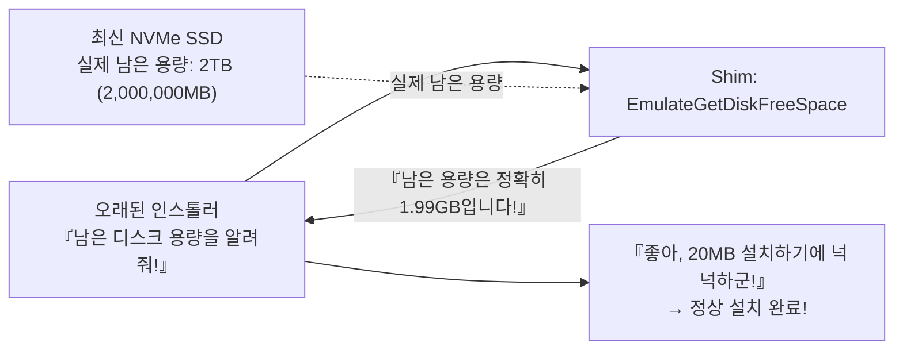

### 5.3 `VirtualRegistry`와 `VirtualStore`: UAC 장벽을 뚫는 은밀한 리디렉션

2006년 Windows Vista가 출시되면서 Windows의 보안 체계에는 역사적인 대전환이 일어났다. 바로 **‘사용자 계정 컨트롤(User Account Control, UAC)’**의 도입이다.

그 이전의 Windows 95/98이나 XP 시절 사용자들은 사실상 항상 최고 관리자 권한(Administrator)으로 로그인하여 생활했고, 수많은 소프트웨어들 역시 시스템의 성역인 `C:\Program Files` 폴더나 레지스트리의 `HKEY_LOCAL_MACHINE\Software` 키에 아무런 죄책감 없이 자유롭게 설정 파일과 세이브 데이터를 저장했다.

그러나 Vista 이후의 엄격한 보안 모델에서는 일반 표준 권한으로 시스템 성역에 쓰기를 시도하면 무조건 차단(`ACCESS_DENIED`)된다. 이를 법대로 그대로 집행했다면, 전 세계 수백만 개의 레거시 애플리케이션이 설정 저장에 실패하여 동시다발적으로 크래시를 냈을 것은 불을 보듯 뻔했다.

그래서 Windows Vista 커널과 I/O 관리자에 장착된 것이 바로 **‘VirtualStore(파일 및 레지스트리 가상화 Shim)’**였다.

오래된 애플리케이션이 관리자 권한 없이 `C:\Program Files\Game\save.dat`에 쓰기를 시도하는 순간, OS의 I/O 매니저는 에러를 뱉는 대신 그 요청을 사용자 개인의 안전한 격리 폴더인 `C:\Users\<사용자명>\AppData\Local\VirtualStore\Program Files\Game\save.dat`로 은밀하게 가로채어 리디렉션한다.

앱이 다음에 그 파일을 읽으려 하면 OS는 VirtualStore에서 읽어 돌려준다. 애플리케이션 자신은 자신이 시스템의 신성한 Program Files에 직접 접근하고 있다고 철석같이 믿은 채, 실제로는 안전한 샌드박스 속에 완벽히 격리되어 행복하게 살아가는 것이다.

### 5.4 `DXPrimaryBltPunt`: 고전 DirectDraw 팔레트 붕괴와 주사율 보정

Windows 95부터 XP 초기에 걸쳐 제작된 수많은 2D 명작 게임들(초대 『에이지 오브 엠파이어』나 수많은 명작 PC RPG)은 DirectX의 초기 컴포넌트인 ‘DirectDraw’를 이용해 화면을 그렸다. 이 게임들은 대개 256색(8비트 인덱스 컬러 팔레트) 환경을 전제로 설계되어 그래픽 카드의 프라이머리 서피스(VRAM) 팔레트 레지스터를 직접 덮어쓰며 페이드인 효과나 화면 연출을 구현했다.

그러나 현대 GPU와 Windows 그래픽 합성 파이프라인(DWM: Desktop Window Manager)은 전체 화면을 32비트 트루컬러의 고해상도 텍스처로 취급하여 3D 파이프라인에서 통합 래스터화하고 합성한다. 256색 하드웨어 팔레트를 직접 건드리는 동작은 아키텍처상 수십 년 전에 도태된 유물이었다.

아무런 조치 없이 최신 PC에서 구형 DirectDraw 게임을 실행하면, 팔레트 동기화가 완전히 깨져 화면 전체가 번쩍거리는 사이키델릭 형광 노이즈로 뒤덮이거나, 주사율 비호환으로 인해 초당 수천 프레임으로 폭주하여 게임을 도저히 플레이할 수 없게 된다.

이 문제를 해결하는 것이 바로 **`DXPrimaryBltPunt`**나 **`ForceDirectDrawEmulation`**과 같은 그래픽 전용 Shim들이다. 이 Shim들은 DirectDraw의 구식 서피스 그리기 명령을 인터셉트하여, 백그라운드에서 실시간으로 현대적인 Direct3D 텍스처 스트림으로 변환한 뒤 DWM의 합성 파이프라인으로 안전하게 연결한다. 30년 전의 도트 그래픽 예술이 최신 4K 디스플레이 위에서 당시의 색감 그대로 선명하게 재현되는 기적은, 바로 이 고도화된 그래픽 위장술 덕분이다.

---

## 제6장: 64비트 및 ARM으로의 대항해 —— WOW64와 에뮬레이션의 신기

CPU 아키텍처 자체가 밑바닥부터 뒤바뀌는 대격변의 순간에는, 더 이상 API 계층의 자잘한 후킹만으로는 호환성을 지탱할 수 없다. Windows는 이 거대한 단절 앞에서 운영체제 내부에 ‘또 다른 운영체제를 통째로 품는’ 대담한 괴력으로 응수했다.

### 6.1 NTVDM에서 WOW64로: 이중화된 파일 시스템과 레지스트리의 평행세계

16비트에서 32비트로 넘어가던 격동기, Windows NT는 **NTVDM(NT Virtual DOS Machine)**을 제공하여 8086 프로세서의 가상 86 모드를 이용해 DOS 및 Win16 프로그램을 현대적인 NT 보호 모드 안에서 안정적으로 구동시켰다.

그리고 2000년대 중반, AMD64(x64)의 등장과 함께 32비트에서 64비트로의 지각변동이 일어났을 때 Microsoft가 투입한 비장의 무기가 바로 **‘WOW64(Windows 32-bit On Windows 64-bit)’** 서브시스템이다.

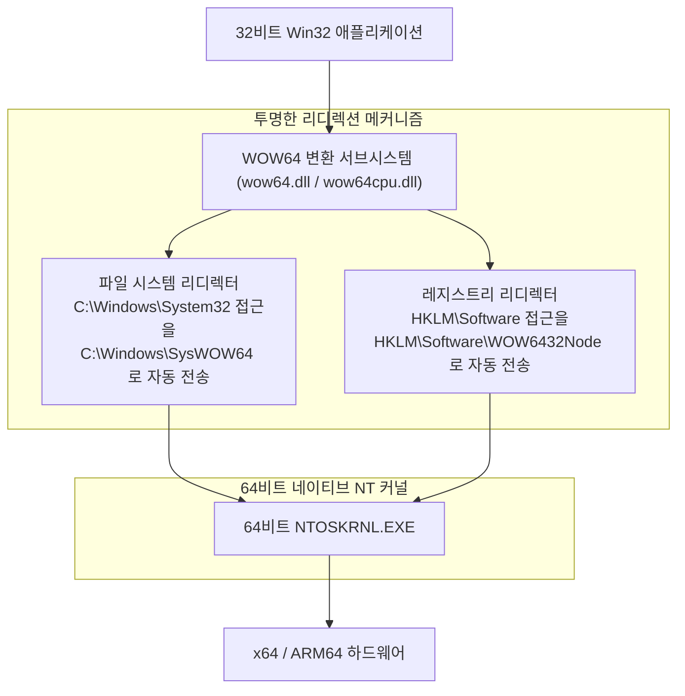

WOW64의 가장 경이로운 특징은 32비트 애플리케이션을 향해 **‘파일 시스템과 레지스트리의 완벽한 이중 평행세계’**를 펼쳐 보여준다는 점이다:

- **파일 시스템 리디렉터(File System Redirection)**:
  순수한 64비트 Windows에서 네이티브 64비트 시스템 DLL이 보관되는 장소는 여전히 유서 깊은 `C:\Windows\System32` 폴더다. 그런데 구형 32비트 앱이 이 폴더에 접근하려 하면, OS는 배후에서 아무 소리 없이 접근 대상을 `C:\Windows\SysWOW64`(직관과 달리 32비트용 DLL이 보관된 장소)로 슬쩍 바꿔치기한다.
- **레지스트리 리플렉션 및 리디렉션(Registry Reflection)**:
  마찬가지로 32비트 프로그램이 `HKEY_LOCAL_MACHINE\Software`에 접근하면, WOW64는 이를 자동으로 `HKEY_LOCAL_MACHINE\Software\WOW6432Node` 서브트리로 격리 리디렉션한다.

이 정교한 평행세계 덕분에 1998년에 개발된 32비트 프로그램은 자신이 64비트 최신 OS 위에서 구동되고 있다는 사실조차 눈치채지 못한 채, 익숙한 System32 폴더와 레지스트리를 읽고 쓰며 아무 탈 없이 생명을 이어갈 수 있다.

### 6.2 ARM64 시대로의 전환과 Prism 에뮬레이터

오늘날 컴퓨팅 환경에서 가장 치열한 전선은 기존 x86/x64에서 **ARM64(Qualcomm Snapdragon X Elite 등)**로의 거대한 전환이다.

과거 Microsoft는 2012년에 ‘Windows RT’를 출시하며 ARM 상에서 기존 Win32 앱 구동을 일절 허용하지 않는 ‘Apple식 레거시 단절’을 시도한 적이 있었다. 결과는 어떠했을까? 시장은 Windows RT를 차갑게 외면했고, Microsoft는 십억 달러에 가까운 천문학적 자산 상각 손실을 기록하며 참패했다. 이 뼈아픈 교훈을 통해 Windows 팀은 **“설령 ARM 환경이라 할지라도, 기존 x86/x64 소프트웨어를 돌리지 못하는 Windows는 Windows가 아니다”**라는 대명제를 뼛속 깊이 되새겼다.

그리하여 최신 Windows 11 on ARM에는 최첨단 바이너리 변환 엔진인 **‘Prism(프리즘)’**이 탑재되었다. Prism은 x86/x64의 복잡한 기계어 명령을 실시간으로 분석하여 고효율의 ARM64 명령어로 JIT(Just-In-Time) 변환할 뿐만 아니라, 변환된 코드 블록을 심층 최적화 캐시에 축적함으로써 네이티브에 필적하는 폭발적인 실행 성능을 달성했다.

밑바닥 하드웨어의 CPU 명령어 세트가 아무리 달라진다 한들, “더블클릭하면 과거의 소프트웨어가 무조건 실행된다”는 사용자 경험만큼은 사수한다. 수많은 시행착오 끝에 연마된 이 고집이야말로 Microsoft의 불퇴전의 결의다.

---

## 제7장: 삼자삼색의 설계 사상 —— Windows vs Apple (macOS) vs Linux

“과거의 애플리케이션을 어떻게 다룰 것인가”라는 근원적인 물음에 대해, 세계 3대 운영체제 진영은 완전히 상이한 해답을 내놓았다. 이 철학적 차이를 조망해 봄으로써 Windows의 독특함과 독보적인 위상이 비로소 선명하게 드러난다.

### 7.1 Apple(외과수술적 단절): 미래를 위해서라면 과거를 불태운다

Apple의 창업자 스티브 잡스부터 현재의 팀 쿡 체제에 이르기까지, Apple의 일관된 영혼의 철학은 **“미래의 궁극적 사용자 경험을 위해서라면, 과거의 유산은 가차 없이 불태워 버린다(Scorched Earth Policy, 초토화 정책)”**는 과격한 진보주의다.

Apple의 역사는 극적인 아키텍처 ‘단절’의 서사시였다:
- **Classic Mac OS의 완전한 포기**: Mac OS 9에서 NeXT/Unix 기반의 Mac OS X로의 강제 전환. 과도기적 완충재로 제공되었던 옛 API ‘Carbon’은 소임을 다하자마자 냉혹하게 폐기처분되었다.
- **하드웨어 명령어 세트의 과감한 4단 도약**: 680x0 → PowerPC → Intel x86 → Apple Silicon(M 시리즈). 매 전환기마다 에뮬레이션 레이어(Mac 68K 에뮬레이터, 초대 Rosetta, Rosetta 2)를 내놓았지만, 불과 수년 안에 OS에서 에뮬레이터 자체를 영구 삭제하여 구형 바이너리의 숨통을 끊어버렸다.
- **macOS Catalina에서의 32비트 앱 완전 숙청**: 2019년 macOS Catalina에서 Apple은 32비트 바이너리 실행 환경을 통째로 들어냈다. 어제까지 스튜디오에서 애용하던 고가의 오디오 플러그인과 클래식 게임들이 하루아침에 영구적으로 고철이 되었다.

Apple의 입장은 단호하고 냉정하다. “개발자는 언제나 최신 Xcode를 사용하고, 최신 Swift로 코드를 다시 짜고, 최신 macOS를 위해 다시 컴파일하라. 그것조차 하지 않는 게으른 과거의 유산은 생태계에서 퇴출당해 마땅하다.” 이 방침 덕분에 macOS의 코드베이스는 언제나 놀라울 정도로 정갈하며 가볍고 아름답게 유지되지만, 그 대가로 전 세계 사용자와 개발자들은 주기적인 ‘재개발 노동’의 무거운 세금을 강요받는다.

### 7.2 Linux(Linus의 계율): “Never break userspace!”의 빛과 그림자

오픈소스 세계의 절대적 군주인 리누스 토르발스(Linus Torvalds)는 Linux 커널 개발에 있어 Windows 팀과 완벽히 궤를 같이하는 절대적 계율을 천명해 왔다. 바로 **“Never break userspace!(유저스페이스를 절대 깨뜨리지 마라!)”**다.

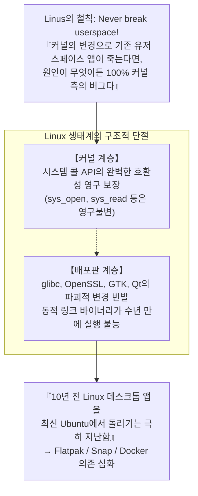

아무리 수학적으로 우아하고 성능을 극적으로 끌어올리는 커널 패치라 할지라도, 기존 사용자 영역 프로그램의 구동을 멈추게 하는 회귀 버그(Regression)를 유발한다면 리누스는 메일링 리스트에서 격노를 터뜨리며 그 패치를 즉각 리버트(Revert)시킨다. 이 점에 있어서 Linux 커널의 수호 철학은 Windows와 완전히 일치한다.

그러나 Linux 데스크톱 생태계의 아킬레스건은, Microsoft와 같이 생태계 전체를 조율하는 강력한 단일 통제 기관이 없다는 점이다. 커널의 시스템 콜은 영구불변하더라도, 배포판 레벨의 사용자 공유 라이브러리(`glibc`, `libssl`, 온갖 GUI 툴킷)들이 수시로 하위 호환성을 깨뜨리기 때문에, **“10년 전에 빌드한 동적 링크 바이너리를 최신 Ubuntu에서 구동하는 것”은 경악스러울 정도로 어렵다**. Linux는 커널 레벨에서 호환성을 사수했음에도 불구하고 생태계 전반의 극심한 파편화로 인해 “30년 전 소프트웨어가 그냥 더블클릭으로 돌아간다”는 차원에는 도달할 수 없었다.

### 7.3 Windows(누적적 포섭): 광기 어린 레이어의 지층 누적

이 둘과 완벽히 차별화되는 Windows의 독자적인 길은 바로 **‘누적적 포섭(Cumulative Inclusion)’**이다.

과거의 API와 서브시스템을 결코 내버리지 않고, 지층처럼 새로운 레이어를 그 위에 끊임없이 쌓아 올린다. Win16이라는 주춧돌 위에 Win32를 얹고, Win32의 뼈대 위에 .NET 프레임워크를 올리고, 그 위에 WinRT/UWP를 얹었다가, UWP가 시장에서 고전하자 다시금 Win32의 단단한 지반 위에 Windows App SDK(WinUI 3)를 재구축한다.

그 결과 Windows는 지구상에서 가장 거대하고 복잡하며 소스코드가 누더기처럼 얽힌 괴물이 되었지만, 그 대가로 **“인류 역사상 존재했던 모든 시대의 소프트웨어가 한자리에서 평화롭게 공존하며 돌아가는” 유일무이한 기적의 플랫폼**을 완성해 냈다.

| 비교 항목 | Microsoft (Windows) | Apple (macOS) | Linux (데스크톱) |
| :--- | :--- | :--- | :--- |
| **기본 호환성 철학** | **누적적 포섭 (Accumulation)**<br/>과거의 모든 유산을 끌어안음 | **외과수술적 단절 (Disruption)**<br/>주기적으로 과거 유산을 불태움 | **커널 사수와 자유방임**<br/>커널만 고수, 상류층은 파편화 |
| **최고 지령 (Prime Directive)** | "Don't break old apps" (구형 앱 보호) | "Embrace the modern platform" (현대화) | "Never break userspace" (커널에 한함) |
| **호환성 유지 주기** | **30년 이상** (Win32/DOS 상시 동작) | **약 3〜5년** (전환기 종료 시 폐기) | 커널은 영구적, 데스크톱 앱은 단명 |
| **32비트 바이너리 현황** | **최신 Win11에서도 완벽 구동** (WOW64) | **Catalina (2019) 에서 완전 숙청** | 멀티아키텍처 라이브러리 설정 시 일부 가능 |
| **개발자에게 요구되는 것** | 아무것도 안 해도 코드가 계속 돌아감 | 주기적인 코드 재작성 및 재컴파일 | 배포판 환경 변화에 맞춘 지속적 재패키징 |
| **아키텍처의 순수성** | 거대하고 누더기 같음, 수억 줄의 지층 | 극도로 순수하고 모던하며 가벼움 | 커널은 모듈화되었으나 응용계층 파편화 |

---

## 제8장: 플랫폼 이코노믹스 —— 왜 하위 호환성이 ‘최강의 해자(Moat)’인가

도대체 무엇이 빌 게이츠와 역대 Microsoft 경영진으로 하여금, 그토록 개발팀을 쥐어짜며 흙탕물에 구르는 엔지니어링을 강요하게 만들었을까? 그 해답은 기술적 이상주의가 아닌, 냉혹한 **‘비즈니스 모델과 플랫폼 경제학’**의 본질에 있다.

### 8.1 빌 게이츠의 비즈니스 모델: 운영체제의 가치는 ‘돌아가는 소프트웨어의 총합’

빌 게이츠는 창업 초기부터 플랫폼 비즈니스의 작동 원리를 완벽하게 꿰뚫어 보고 있었다.

> **플랫폼 가치의 기본 정리**:
> 운영체제라는 소프트웨어의 가치는 OS 본체가 지닌 기능의 화려함으로 결정되지 않는다.
> **“그 플랫폼 위에서 작동 가능한, 전 세계 애플리케이션 자산의 총합”**에 의해 결정된다.

아무리 컴퓨터 과학적으로 진보적이고 메모리 효율이 뛰어나며 UI가 화려한 차세대 OS를 개발한다 한들, 사용자가 일상 업무에 사용하는 소프트웨어가 돌아가지 않는다면 그 시장 가치는 정확히 ‘0’이다. 소비자가 지갑을 열어 구매하는 것은 OS라는 빈 껍데기 상자가 아니라, 그 안에서 구동되는 소프트웨어와 그 소프트웨어가 창출하는 생산성이기 때문이다.

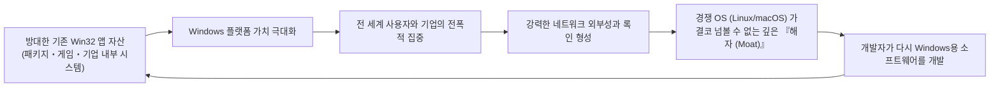

하위 호환성을 100% 사수하는 한, 지난 30년간 전 세계 수천만 명의 프로그래머들이 Windows를 위해 피땀 흘려 작성한 수백억 줄의 코드, 수조 달러 규모의 소프트웨어 자산은 **모두 ‘차세대 Windows의 가치’로 단 1원의 추가 비용 없이 자동 합산**된다.

경쟁자인 macOS나 Linux가 아무리 아키텍처적 우월성을 소리 높여 외친다 한들, 대기업 고객의 “우리 회사에서 20년째 쓰고 있는 주문 관리 시스템이 거기서 돌아갑니까?”라는 단 한마디 질문 앞에 모든 영업전은 3초 만에 종료된다. 하위 호환성이야말로 그 어떤 경쟁사도 결코 메울 수 없는 Microsoft의 가장 깊고 넓은 ‘경제적 해자(Moat)’였다.

### 8.2 엔터프라이즈 시장의 절대적 록인

특히 막대한 수익이 걸려 있는 기업(B2B) 시장에서 이 전략은 가공할 위력을 발휘했다.

글로벌 대기업, 정부 기관, 제조업 공장 라인, 금융 기관의 전산실 깊은 곳에는, 과거 수십 년간 수백억 원의 자본을 투입해 자체 구축한 무수한 인하우스 시스템(VB6 기반의 업무 코어나 C++ 기반의 특수 ActiveX 컴포넌트 등)이 지금도 묵묵히 돌고 있다. 그 코드를 짰던 개발 업체는 이미 오래전에 파산했거나 초기 설계 문서조차 남아 있지 않아, 아무도 건드릴 엄두를 내지 못하는 ‘살아있는 화석’들이다.

만약 새로운 Windows가 호환성을 깨뜨리고 “이 구형 업무 프로그램은 더 이상 지원하지 않으니, 최신 웹 기술로 수십억 원을 들여 새로 개발하십시오”라고 요구했다면, 기업의 CIO(최고정보책임자)들은 격노하여 Windows 업그레이드를 무기한 동결하거나 다른 대안을 찾아 탈출했을 것이다.

그러나 Windows는 AppCompat이라는 요술봉을 휘두르며 CIO의 귓가에 속삭였다. “아무것도 고치실 필요 없습니다. 최신형 PC로 싹 바꾸셔도 예전 프로그램은 그냥 그대로 돌아갑니다.” 기업 경영진에게 이보다 더 안심되고 합리적인 제안은 세상에 존재하지 않는다. 이렇게 전 세계 기업들은 Windows가 쳐놓은 거대한 생태계의 그물에서 영원히 빠져나갈 수 없게 되었다.

### 8.3 파괴적 혁신을 가로막는 ‘성공의 덫’

하지만 이 눈부신 상업적 승리는, 역설적으로 Microsoft 스스로의 발목을 옥죄는 **‘성공의 덫(Success Trap)’**으로 변모했다.

2010년대 스마트폰의 대폭발로 iOS와 Android가 주도권을 잡자, Microsoft는 Windows를 현대화하고 보안성을 끌어올리기 위해 샌드박스 기반의 현대적 애플리케이션 플랫폼인 UWP(Universal Windows Platform)를 야심 차게 런칭하고, 전통적인 Win32의 단계적 폐지를 꾀했다.

그러나 전 세계 개발자들과 기업들은 UWP로의 이전을 차갑게 외면했다. “도대체 왜 기능도 잔뜩 제한되어 있고 기존 자산도 돌릴 수 없는 새 플랫폼으로 고생해서 코드를 다시 짜야 하는가? 기존 Win32 그대로 최신 Windows 10과 11에서 날아다니는데!”라는 반응이었다.

이것이야말로 역사상 가장 지독한 아이러니였다——**“Win32가 너무나 튼튼하고, 어디서나 완벽하게 돌아가 버리는 바람에, 정작 Microsoft 스스로조차 Win32를 죽일 수 없는 상황에 빠진 것이다.”** 자가중독에 빠진 Microsoft는 결국 UWP 단독 노선을 사실상 백기 투항하고, 기존 Win32 앱을 그대로 스토어에 패키징할 수 있도록 길을 열었으며, 최신 UI 툴킷인 WinUI 3조차 Win32라는 거대한 옛 기반 위에 다시 세워야만 했다. 스스로 쌓아 올린 최강의 하위 호환성이, 스스로의 혁신을 가로막는 가장 높고 견고한 벽이 되어버린 것이다.

---

## 제9장: 영광의 대가 —— 비대해지는 기술 부채와 보안의 험로

남들이 대충 짜 놓은 엉터리 코드의 짐을 대신 짊어지고, 역사의 모든 디지털 유산을 끝까지 지켜낸다는 길은 결코 공짜 점심이 아니었다. 이 장대한 집념의 대가로 Windows 엔지니어링 팀은 현대의 그 어떤 소프트웨어 프로젝트보다 가혹한 ‘기술 부채’와의 사투를 끝없이 벌여야만 한다.

### 9.1 수억 줄의 코드베이스와 천문학적 테스트 매트릭스

오늘날 Windows의 전체 소스코드는 **수억 줄** 규모에 달하는 것으로 알려져 있다. 그리고 전 공정을 통틀어 가장 숨 막히는 공포는, 새로운 Windows 빌드를 생성할 때마다 치러내야 하는 우주적 규모의 테스트 검증 매트릭스(Test Matrix)다.

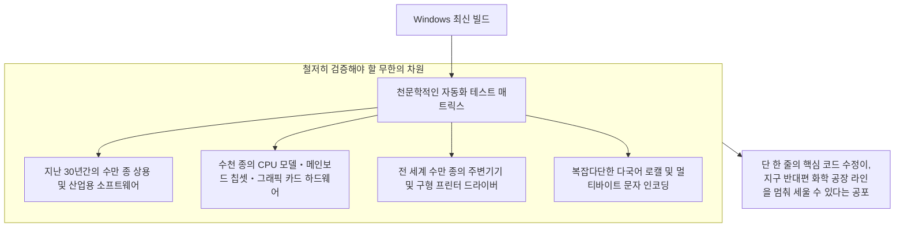

Windows의 핵심 커널이나 스케줄러 계층에서 보안을 강화하겠답시고 사소한 포인터 널 체크를 하나 추가하거나 락(Lock)을 획득하는 순서를 살짝 바꾸기만 해도, 지구 반대편 어느 화학 공장의 30년 된 제어 프로그램이 예상치 못한 데드락에 빠져 가동이 중단될 수 있다.

이 거대한 공포를 정면으로 돌파하기 위해, Microsoft는 레드먼드 본사 깊숙한 곳에 수만 대의 실물 하드웨어와 수천 대의 가상화 머신 클러스터를 구축하고, 수십 년 치의 고전 소프트웨어들을 스크립트로 하나하나 자동 기동하여 윈도우 창이 정상적으로 뜨는지를 검증하는 가히 광기 어린 자동화 테스트 인프라를 상시 가동하고 있다.

### 9.2 레거시 API가 야기하는 보안 취약점

기술 부채의 수많은 단면 중에서도 가장 치명적이고 뼈아픈 영역은 바로 **정보 보안**이다.

1990년대 초반에 설계된 수많은 레거시 Win32 API들은 인터넷이 본격 보급되기 전의 ‘목가적인 시대’에 태어났다. 당시의 설계 사상에는 악의적인 네트워크 해킹 공격이나 버퍼 오버플로에 대한 방어 개념이 극히 희박했고, 프로세스 간 특권 분리도 느슨했다. 그러나 하위 호환성의 절대적 약속 때문에 Microsoft는 결함투성이의 구형 API들을 단칼에 삭제할 수 없다.

전 세계의 화이트해커와 국가 단위 APT 해킹 조직들이 가장 집요하게 파고드는 지점이 바로 이 ‘호환성을 위해 남겨진 낡은 API’와 ‘호환성 Shim 변환 계층의 틈새 로직’이다. 30년 전의 소프트웨어를 살려주겠다는 따뜻한 배려가, 역설적으로 현대 운영체제 전체의 공격 표면(Attack Surface)을 무한히 넓히는 보안의 고질병으로 작용하고 있는 것이다.

### 9.3 Longhorn 프로젝트의 공중분해와 ‘MinWin’으로의 리팩터링

호환성과 기능 추가를 끝없이 퇴적시키던 이 위험한 줄타기가 마침내 물리적 한계에 봉착하여 전대미문의 파국을 맞이했던 순간이 바로 2000년대 중반의 **‘롱혼(Longhorn) 프로젝트 대참사’**였다.

당시 Windows XP의 후속작으로 야심 차게 개발되던 롱혼은, 지나치게 방대한 신기능들과 수십 년간 묵혀 온 레거시 코드들이 기괴하게 얽히고설키며 인류 역사상 최악의 스파게티 코드 덩어리로 변질되었다. 매일같이 빌드가 깨졌고, 프로젝트의 진척 속도는 제로에 수렴했으며, 수천 명의 엔지니어들이 늪에 빠져 허우적대다 결국 프로젝트 전체가 공중분해되었다.

2004년, Microsoft 수뇌부는 뼈를 깎는 고통 속에 ‘롱혼 리셋(Longhorn Reset)’을 단행한다. 수천 명의 최고급 인재들이 수년간 작성한 코드를 가차 없이 쓰레기통에 처박고, 상대적으로 견고하고 정갈했던 ‘Windows Server 2003 SP1’ 코드베이스로 회군하여 처음부터 다시 시작했다(이것이 훗날의 Windows Vista가 된다).

이 끔찍한 파멸의 위기를 겪은 뒤 Windows 팀은 OS의 가장 깊은 코어 커널을 **‘MinWin’**이라는 독립적인 최소 단위 모듈로 완전히 분리해 내고, 상위 호환성 계층과의 결합도를 대폭 낮추는 역사적인 대수술을 단행했다. Windows가 오늘날까지도 붕괴하지 않고 안정적으로 숨 쉬고 있는 것은, 이 지옥 같은 파국을 딛고 아키텍처의 경계선을 냉정하게 다시 그었기 때문이다.

---

## 결론: 진흙탕 속 엔지니어들을 향한 찬가 —— ‘돌아간다’는 기적 위에 구축된 현대 사회

우리가 매일같이 무심하게 마주하는 사무실의 업무용 PC, 대학병원의 전자 의무기록(EMR) 단말기, 은행의 현금자동입출금기(ATM), 지하철과 고속철도의 관제 시스템, 첨단 스마트 팩토리의 정밀 공작기계에 이르기까지——현대 문명을 지탱하는 모든 인프라의 가장 깊은 혈관 속에는 어김없이 Windows의 심장이 뛰고 있다.

만약 Microsoft가 컴퓨터 과학 교과서에만 얽매인 ‘우아한 설계의 순혈주의자’였고, Apple처럼 3~5년 주기로 과거의 유산을 단칼에 베어 넘기는 기업이었다면 오늘날의 세상은 어떻게 되었을까?

전 세계 수백만 개의 제조 공장이 멈춰 서고, 중소기업들은 주기적인 소프트웨어 재개발 비용을 감당하지 못해 줄도산했을 것이며, 의료 현장과 사회 기간시설은 걷잡을 수 없는 혼란에 빠졌을 것이다. 현대의 글로벌 경제와 정보화 사회가 이토록 매끄럽고 굳건하게 전진할 수 있었던 근본적인 원동력은, 다름 아닌 Windows가 **“전 세계 프로그래머들이 지난 30년간 저질러 온 모든 실수, 게으름, 오해, 버그, 그리고 과거의 무거운 유산 일체를 자신의 거대한 등 위에 묵묵히 짊어져 왔기 때문”**이다.

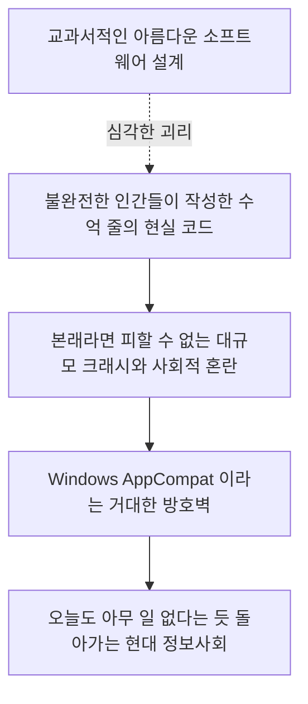

레이먼드 첸을 비롯한 역대 Windows 개발팀의 무명 엔지니어들에게 있어, 자신들의 정갈한 코드를 더럽혀가며 이름 모를 타인이 수십 년 전에 저지른 쓰레기 버그를 수습하기 위해 밤을 새워 Shim을 작성하는 일은 결코 화려한 스포트라이트를 받는 작업이 아니었을 것이다. 학술 논문에서 기립박수를 받을 만한 혁신적인 알고리즘도 아니요, 실리콘밸리 스타트업들이 요란하게 떠들어대는 세련된 혁신과도 거리가 멀다.

하지만 그것이야말로 **‘프로페셔널 엔지니어링(Professional Engineering)’**의 가장 숭고하고 위대한 본질이 아니겠는가.

진정한 엔지니어링이란 무균실 안에서 우아한 수식을 감상하는 취미가 아니다. 진흙투성이가 되고 기름때를 뒤집어쓰며, 불완전한 인간들이 만들어낸 불완전한 세상의 틈바구니를 맞추고, **“어제 돌아가던 모든 것은 오늘도, 내일도, 10년 뒤에도 기필코 계속 돌아가게 만든다”**는 기적을 흙먼지 나는 현실 속에서 묵묵히 보증해 내는 일이다.

“과거의 앱을 절대 망가뜨리지 마라”——이 광기 어린 절대적 제1명령과, 이를 완수해 낸 수많은 엔지니어들의 피와 땀 위에서, 우리가 사랑하는 현대 디지털 문명은 오늘도 아무 일도 없었다는 듯 평화롭게 돌아가고 있다.
