## 序論：OSの本質とは何か ——「美しき設計」か「泥臭き動作」か

コンピュータ・サイエンスの講義や美しいソフトウェア工学の教科書を開けば、そこには常に「洗練された抽象化」「関心の分離」「直交性のあるAPI設計」といった甘美な理想が並んでいる。OS（オペレーティングシステム）とは、ハードウェアの複雑さを隠蔽し、アプリケーションに対して直感的で統一されたクリーンなインターフェースを提供する神聖な調停者であるべきだ――と。

しかし、ひとたび大学の象牙の塔を出て、現実の商業用デスクトップOSの戦場に足を踏み入れるならば、その純粋無垢な理想は粉々に打ち砕かれる。なぜなら、パーソナル・コンピュータの歴史において、最も商業的成功を収め、世界中の何十億台ものPCを支配してきた巨星・Windowsが体現してきた哲学は、教科書的な美しさの対極にある **「狂気的なまでの泥臭い現実主義（プラグマティズム）」** だったからである。

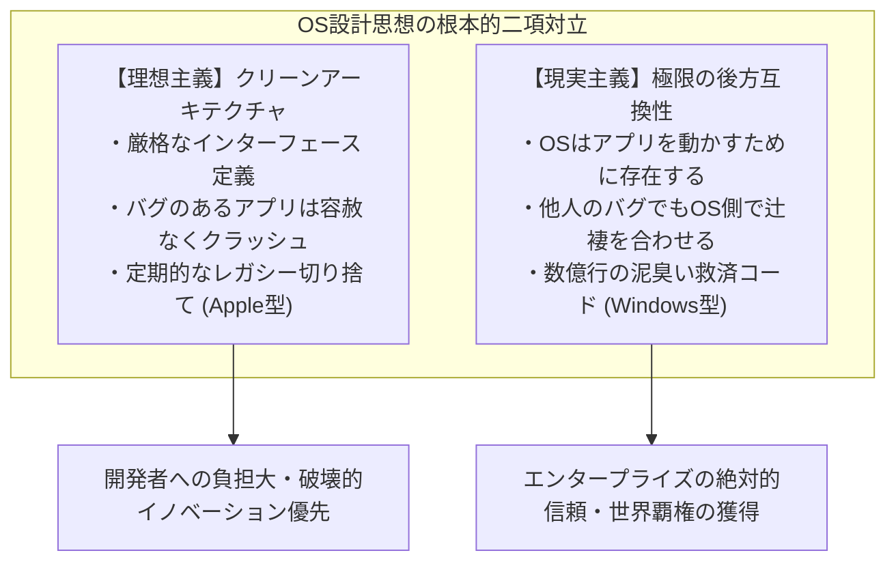

世界中に存在するあらゆるOSの中で、Windowsほど「過去の遺産」に対して異常なまでの執念を燃やし続けてきたOSは他に存在しない。1995年に発売されたゲームのCD-ROM、1990年代初頭のVisual Basic 3.0やC++で書かれた企業の会計ソフト、DOS時代の遺産、未公開の内部挙動を不正にハックして動いていた古いユーティリティ――それらの多くが、2020年代半ばの最新鋭OSである「Windows 11」の上で、何食わぬ顔で起動し、完全に動作する。

多くの人々は、これを「ソフトウェアが単に動いているだけ」だと捉え、当たり前の風景として消費している。だが、OS内部のソースコードをリバースエンジニアリングし、その深淵を覗き込んだシステムプログラマーたちは皆、息を呑み、戦慄する。そこには、数え切れないほどのサードパーティ製アプリケーションのバグ、仕様違反、メモリ破壊、未定義動作を救済するために、Microsoftのエンジニアたちが30年以上にわたって積み重ねてきた **「数万行に及ぶ特例措置、APIの動的偽装、そしてOS自らが嘘をつく機構（Shim）」** が地層のように幾重にも堆積しているからである。

なぜMicrosoftは、そこまでして「他人が書いた不完全なコード」をOS側で背負い込み、辻褄を合わせ続けなければならなかったのか？
なぜAppleのように「過去を潔く切り捨てる」道を選ばなかったのか？
そして、その狂気じみたエンジニアリングは、いかにしてWindowsを崩すことのできない「世界最強のプラットフォーム」へと押し上げたのか？

本稿は、元Microsoftの伝説的プログラマーたちの証言、Windows内部に隠されたリバースエンジニアリングデータ、PEバイナリとNTカーネルの深層構造、そしてITプラットフォーム戦略史を縦横無尽に横断しながら、Windowsを規定する絶対の鉄の掟――**「過去のアプリを決して壊すな（Don't break old apps）」** の全貌を白日の下に晒す、渾身の決定版ドキュメントである。

---

## 第1章：二大発信源が語る「鉄の掟（プライム・ディレクティブ）」

Windowsの内部開発チームが共有してきた互換性への執念は、社外の人間が外から想像した妄想ではなく、実際にその最前線でコードを書き、アーキテクチャを決定してきた二人の伝説的プログラマーによって生々しく世界に告発されてきた。

### 1.1 レイモンド・チェン（Raymond Chen）と『The Old New Thing』

MicrosoftのWindows開発チームにおいて、30年以上にわたり「生きる伝説」として君臨している男がいる。1992年にMicrosoftに入社して以来、Windows 95のシェル、User32、Win32サブシステムの深奥部を保守・開発し続けているプリンシパル・ソフトウェア・エンジニア、**レイモンド・チェン（Raymond Chen）** 氏である。

チェン氏が社内ブログから始め、現在もMicrosoft公式の技術ポータルで連載を続けているブログ **『The Old New Thing』** （後に書籍化され、システムプログラマーのバイブルとなった）は、Windowsがいかにして泥臭い互換性問題を解決してきたかを綴った驚異の記録庫である。

チェン氏が繰り返し語るWindows開発チームの基本公理は、冷徹なまでにシンプルである：

> 「WindowsというOSは、プログラムを実行するために存在する。ユーザーはOSを鑑賞するためにPCを買うのではない。その上で動く特定のアプリケーションを使いたいからこそPCを買うのだ。
> 
> そして何よりも残酷な現実はこれだ――**ユーザーが新しいWindowsにアップグレードした時、愛用のアプリケーションが動かなくなれば、ユーザーは絶対にアプリケーションの作者を責めない。100%『Windowsが壊れた』『新しいWindowsは欠陥品だ』とMicrosoftを非難する。**」

プログラマーのプライドからすれば、「アプリケーション側のコードにバグがあるのだから、クラッシュするのは当然であり、アプリ開発会社が修正パッチを出すべきだ」と主張したくなる。しかし、商業OSのマーケットにおいてその論理は一切通用しない。ユーザーにとっての現実は、「昨日まで動いていたソフトが、Windowsを更新した瞬間に動かなくなった」という事実だけだからである。

もしMicrosoftが「あれはソフト会社のバグです」と正論を吐いて突っぱねれば、ユーザーはアップグレードを拒否し、旧バージョンのOSに居座るか、あるいは競合プラットフォームへの流出を検討するだろう。したがって、ビジネス上の必然として、Windows開発チームには以下の過酷な命題が課されることとなった。

**「たとえアプリ側がどれほど無茶苦茶で、規格違反で、壊れたコードを書いていようとも、OS側がそれを検知し、裏で辻褄を合わせ、何事もなかったかのように動かさなければならない。」**

チェン氏のブログには、この信条のために彼と彼の同僚たちが強いられた、涙ぐましくも狂気じみたハックの数々が克明に記録されている。

### 1.2 ジョエル・スポルスキー（Joel Spolsky）の告発：『How Microsoft Lost the API War』

この哲学の凄まじさを、世界中のWebエンジニアやITビジネス界に決定的な形で知らしめたのが、**ジョエル・スポルスキー（Joel Spolsky）** 氏である。彼は1990年代初頭にMicrosoftでExcel開発チームのプログラムマネージャーを務め、後にプログラマー向けQ&Aサイト「Stack Overflow」やプロジェクト管理ツール「Trello」を創業した世界屈指のソフトウェアエッセイストである。

2004年、スポルスキー氏は自身のWebサイトに『How Microsoft Lost the API War（マイクロソフトはどうやってAPI戦争に負けたのか）』と題する歴史的名エッセイを寄稿した。その中で、当時のWindowsチームのトップであったジョン・デヴァーン（Jon DeVaan）氏らの強固なリーダーシップを振り返り、次のように記した：

> "In the Windows team, the prime directive was: **don't break old apps.**"
> （Windowsチームにおける絶対の至上命題（プライム・ディレクティブ）は、「過去のアプリを絶対に壊すな」であった。）

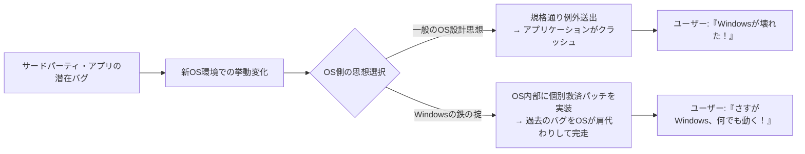

スポルスキー氏は解説する。SFドラマ『スタートレック』において宇宙艦隊の士官が決して破ってはならない最高規律が「惑星連邦のプライム・ディレクティブ（未開文明の発展に干渉してはならない）」であるように、Windowsチームのプログラマーにとってのプライム・ディレクティブこそが「既存のアプリケーションの動作を一切破壊しないこと」であった。

もしあるWindows開発者が、カーネルやAPIのコードをエレガントにリファクタリングして速度を2倍にしたとしても、その変更によって世界で流通している無名の業務ソフトが1本でもクラッシュするようになったなら、そのリファクタリングは即座にリジェクト（差し戻し）された。Windowsチームにおいて、コードの美しさやアーキテクチャの純潔性は二の次であり、**「既存のバイナリが100%動くこと」こそが絶対善** だったのである。

### 1.3 「バグすらも仕様になる」：Hyrumの法則とAPIの不可逆性

ソフトウェア工学には、Googleのソフトウェアエンジニアであるハイラム・ライト（Hyrum Wright）氏が提唱した **「Hyrumの法則（Hyrum's Law）」** と呼ばれる有名な経験則が存在する。

> **Hyrumの法則**:
> 「APIに十分な数のユーザーがいる場合、APIの作成者が契約（ドキュメント）で何を約束しているかは問題ではない。システムのあらゆる観察可能な挙動（バグや未定義の副次作用を含む）は、いずれ誰かのコードによって依存されるようになる。」

Windowsはこの「Hyrumの法則」を世界で最も大規模に、かつ最も過酷な形で実証し続けてきたプラットフォームである。

例えば、あるWindows APIのドキュメントに「第3引数には有効なウィンドウハンドルを渡さなければならない。無効な値を渡した場合の動作は未定義である」と明記されていたとする。しかし、世の中のずさんなプログラマーが誤ってそこに `NULL` や壊れたポインタを渡してしまい、偶然にも当時のWindows 3.1の実装では運良く何のエラーも出さずにスルーされていたとしよう。

このアプリが数万本出荷されてしまった後、次世代のWindows 95やWindows NTの開発チームが「引数チェックを厳密にして、無効なポインタが渡されたら正しく `ERROR_INVALID_PARAMETER` を返すようにしよう」と実装を正しく修正した瞬間、何が起きるか？

何万ものオフィスで、その古いソフトが一斉にエラーダイアログを吐いて強制終了するのである。そしてユーザーは怒り狂い、Microsoftのサポート窓口に電話を叩きつける。「Windowsを新しくしたら仕事ができなくなった！」と。

結果として、Microsoftのエンジニアたちは、自らの書いた「正しいコード」を取り下げ、以下のような屈辱的なコードを書くことを余儀なくされる：

```c
// 概念的なWindows内部APIの再現例
BOOL WINAPI DoSomething(HWND hWnd, UINT uMsg, WPARAM wParam, LPARAM lParam)
{
    // 教科書的に正しいバリデーション
    if (!IsWindow(hWnd)) {
        // 本来ならここで即座にエラーを返すべきである
        // SetLastError(ERROR_INVALID_WINDOW_HANDLE);
        // return FALSE;

        // 【互換性のためのハック】
        // 過去の某有名アプリXは、初期化時にNULLハンドルを渡してくる。
        // ここでエラーを返すとアプリXがクラッシュするため、
        // デスクトップウィンドウのハンドルに暗黙的に差し替えて握りつぶす。
        if (IsTargetBadApplication("AppX.exe")) {
            hWnd = GetDesktopWindow();
        } else {
            SetLastError(ERROR_INVALID_WINDOW_HANDLE);
            return FALSE;
        }
    }

    // 本来の処理を続行...
    return InternalDoSomething(hWnd, uMsg, wParam, lParam);
}
```

一度OSが世に放たれ、市場のデファクトスタンダードとなった瞬間、APIの仕様とは「ドキュメントに書かれた文字」ではなく、**「既存の実装がたまたま見せていた、バグを含むあらゆる挙動の総体」** へと変貌する。Windowsチームは、この逃れられない呪縛と正面から向き合い、世界中のアプリケーションのバグをOSの仕様として永久に引き受ける覚悟を決めたのである。

---

## 第2章：伝説の幕開け ——「シムシティ（SimCity）事件」の技術的真相

Windows開発チームの後方互換性への執念を象徴するエピソードとして、コンピュータ史上に永遠に名を残すことになった事件がある。それが、1995年のWindows 95開発クライマックスに起きた **「シムシティ（SimCity）事件」** である。

### 2.1 Use-After-Free（解放後メモリへのアクセス）の物理

1989年にウィル・ライト（Will Wright）氏率いるマクシス（Maxis）社によって生み出された都市経営シミュレーションゲーム『SimCity』は、PCゲーム史における不朽の金字塔であり、当時世界中で爆発的なヒットを記録していた。当然ながら、一般ユーザーにとっても、ビジネスの合間に息抜きをする企業戦士にとっても、PCでSimCityが快適に動くかどうかは死活問題であった。

当時、DOSおよびWindows 3.1向けに販売されていたPC版『SimCity』のバイナリには、現代のセキュリティ監査基準であれば一発で致命的脆弱性として検知される、極めて悪質なバグが潜んでいた。それが **「Use-After-Free（解放後メモリへのアクセス）」** である。

SimCityのコードは、都市のグラフィック描画やシミュレーション計算を行う過程で、OSのヒープアロケータからメモリブロックを確保し、使用後にそれを解放（`free` または `GlobalFree`）していた。しかし、あろうことかプログラム内部のポインタが解放後もクリアされず、**「OSに返却したはずのメモリ領域に対して、直後に平然と読み書きアクセスを継続する」** という不正なロジックが存在していたのである。

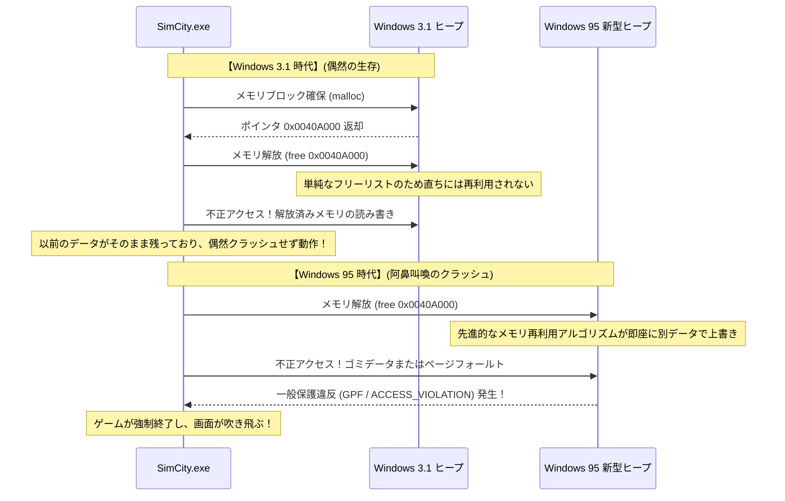

16ビットOSであるWindows 3.1においては、メモリ管理システムが極めて原始的であった。アプリケーションがメモリを解放しても、フリーリスト構造の単純さゆえに、そのメモリ領域の内容が直ちに別の用途に再割り当てされたり、上書きされたりすることは稀だった。つまり、SimCityは「完全に壊れたコード」であったにもかかわらず、**「Windows 3.1のメモリ管理が愚直だったおかげで、偶然にもクラッシュせずに動いていただけ」** だったのである。

### 2.2 普通のソフトウェア工学 vs Windowsチームの狂気

ところが、1995年、PC業界を根底から覆す次世代32ビットOS「Windows 95」が登場する。

Windows 95は、真のプリエンプティブ・マルチタスク、洗練された仮想メモリマネージャ、そして断片化を防ぎキャッシュ効率を高める高速な進歩的ヒープアロケータを搭載していた。この最新のメモリマネージャは、アプリケーションからメモリが返却されると、メモリ効率を最大化するために **即座にその領域を別の用途に再利用し、内部データをクリア・再構成する** よう設計されていた。

この近代的なアロケータ上でSimCityを実行した瞬間、何が起きたか。
SimCityは解放した直後のメモリを読みに行き、そこにあるはずのない別プロセスのデータやゼロクリアされた虚無に衝突した。次の瞬間、悪名高き **「一般保護違反（General Protection Fault: GPF）」** のダイアログが炸裂し、プレイヤーが何十時間もかけて育て上げた大都市は一瞬にして電子の藻屑へと消え去ったのである。

この事態に直面した時、一般的なソフトウェア工学の常識、あるいは他のOSベンダーであれば、どのような決断を下していただろうか？

答えは自明である。「これは100%マクシス社のプログラミングのミスである。OSのメモリ管理は完全に仕様通り、正しく動作している。マクシス社にバグの存在を通知し、彼らがユーザー向けに修正パッチ（SimCity 1.01）をフロッピーディスクで配布するのを待つべきだ」――これが、誰もが納得する正論である。

だが、Microsoftの首脳陣、そしてWindows 95のローンチを絶対に失敗させられない開発チームの下した決断は、狂気の沙汰であった。

**「SimCityをクラッシュさせてはならない。ゲーム会社が修正するのを待つ暇はない。Windows 95のカーネルメモリマネージャ自体に特例パッチを埋め込み、SimCityが動くようにOSを改造せよ。」**

### 2.3 メモリアロケータに施されたシムシティ専用のハックの詳細

ジョエル・スポルスキー氏は、前述のエッセイの中でこの歴史的決断の瞬間を次のように証言している：

> 「Windows 95のベータテスト中、彼らはSimCityが正しく動かないことを発見した。Microsoftはどうしたか？
> 彼らはSimCityの作者を追い詰めて直させようとはしなかった。Windows 95のメモリマネージャの担当者が、専用の特別なコードを書き加えたのだ。**『もし現在実行されているプログラムがSimCityであれば、解放されたメモリを直ちには再割り当てせず、しばらくの間そのまま温存しておく』** というコードを。」

このハックの技術的本質は、まさに現代で言うところの「隔離ヒープ（Quarantine Heap）」や「遅延解放（Delayed Free）」の原型である。

Windows 95のヒープアロケータは、プロセスの起動時に実行ファイル名（`SIMCITY.EXE`）やヘッダー情報を照合し、対象がSimCityであると判定すると、メモリアロケーションの挙動を通常モードから「SimCity救済モード」へと切り替えた。通常であれば解放されたメモリーブロックは即座に空きリストへと結合（Coalescing）されて再利用プールに回されるが、SimCity実行時に限っては、解放要求のあったポインタを一時的なリングバッファに退避させ、一定期間、以前のメモリブロックが破壊されないよう保護したのである。

この泥臭く、教科書を破り捨てるようなOS側の自己犠牲によって、Windows 95の発売日、世界中のユーザーは愛するSimCityのフロッピーディスクをPCに挿入し、何のエラーも出ることなく、完璧に市長としての執務を続行することができた。

ユーザーたちは口々に称賛した。「Windows 95は素晴らしい！ 昔のソフトが何でもそのまま動く！」と。その裏で、自分たちの誇り高い最新カーネルの中に他人のバグを救うためのパッチを抱え込んだMicrosoftのエンジニアたちの苦笑いを知る者は、誰一人としていなかった。


## 第3章：歴史を彩る「泥臭い互換性ハック」の系譜

シムシティ事件は氷山の一角に過ぎない。Windowsが今日に至るまでの30余年の歴史は、世界中で作られた数多の行儀の悪いソフトウェアを延命させるために敢行された、常軌を逸した互換性ハックの連続であった。

### 3.1 Lotus 1-2-3とExcelの「1900年閏年バグ」

コンピュータの暦法計算において、世界で最も有名であり、かつ今なお全世界のPCで修正されることなく生き残り続けているバグがある。それが、**「1900年を閏年（うるうどし）と誤認するバグ」** である。

グレゴリオ暦の定義において、閏年の規則は以下の通り極めて厳格に定められている：
1. 西暦年が4で割り切れる年は閏年とする。
2. ただし、西暦年が100で割り切れる年は平年とする。
3. ただし、西暦年が400で割り切れる年は閏年とする。

したがって、西暦1900年は「100で割り切れるが400では割り切れない年」であるため、**平年であり、1900年2月29日は存在しない**。

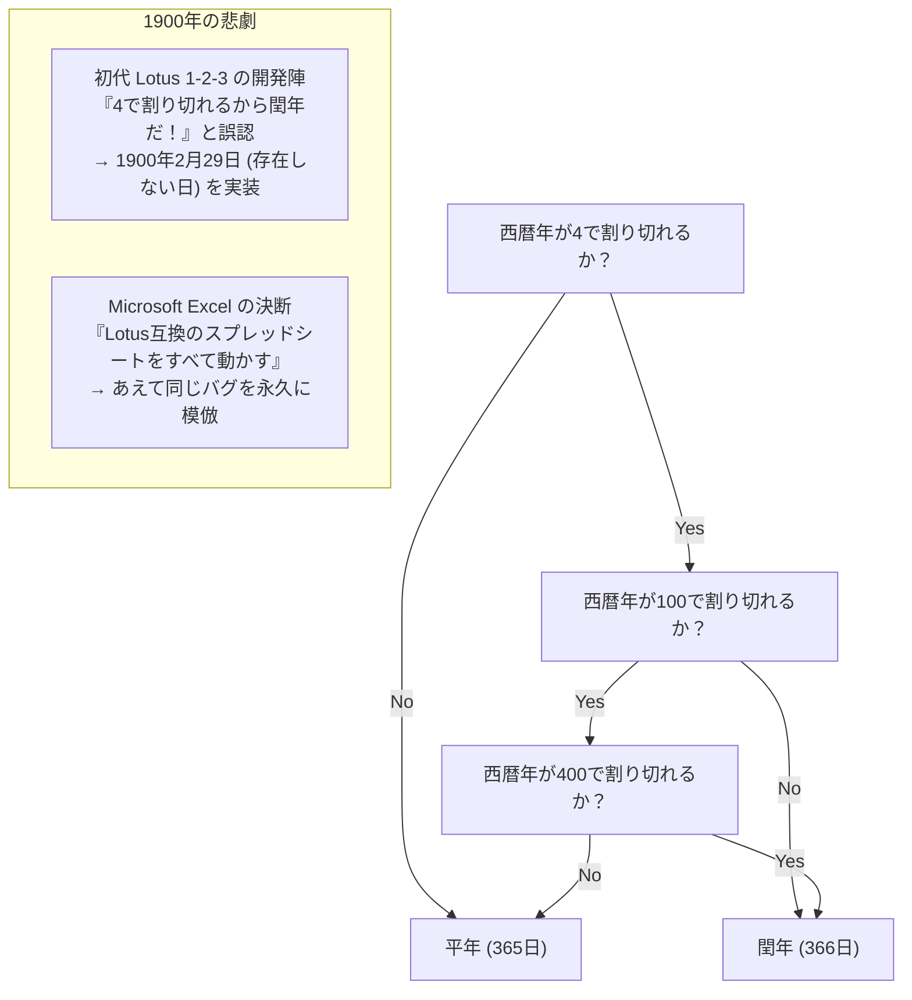

ところが、1980年代前半にDOS市場を完全に席巻していた表計算ソフトの帝王『Lotus 1-2-3』の開発陣は、この「100の例外則」の考慮を怠り、1900年を閏年としてコードを書いてしまった。そのため、Lotus 1-2-3の中では架空の日付である「1900年2月29日」が存在し、シリアル値（日付の通し番号）が1日分ズレていた。

後発として表計算市場に参入したMicrosoftの『Excel』開発チームは、この問題に直面した。数学的・暦法的に正しいカレンダーを実装するか、それとも当時すでに企業の財務諸表として何千万枚も作られていたLotus 1-2-3のスプレッドシートとの計算結果の一致を優先するか？

ビル・ゲイツ率いるMicrosoftの下した判断は、やはり後者であった。Excelは、Lotus 1-2-3からのデータ移行を完璧に行わせるため、**「自分たちも意図的に1900年2月29日が存在するというバグをそのまま実装する」** という途方もない道を選択した。

現在、あなたの手元にある最新のMicrosoft 365のExcelを起動し、セルに `=DATE(1900, 2, 29)` と入力してみてほしい。驚くべきことに、21世紀の最新AIを搭載したExcelであっても、エラーを返すことなく「1900/2/29」という実在しない日付を淡々と表示する。他社のバグを抱え込むという決断は、一度下されれば数十年、あるいは世紀を超えて永久に撤回できないのである。

### 3.2 なぜ「Windows 9」はスキップされたのか

2014年、Microsoftは「Windows 8.1」の後継OSを発表した。誰もが「次はWindows 9だろう」と予想していたが、壇上に現れた同社幹部が発表した名称は、世界中の度肝を抜く **「Windows 10」** であった。

なぜ「9」は欠番としてスキップされたのか？ マーケティング上の刷新感を演出するためという公式発表の陰で、開発者コミュニティのリバースエンジニアや元社員たちから、極めて生々しく、かつ説得力に満ちた「互換性の地雷」が暴露された。

世界中に散らばる無数の古いサードパーティ製アプリケーション、Javaライブラリ、各種ソフトウェアのインストーラの中には、現在実行されているOSのバージョンを判定するために、以下のような手抜きのコードが山のように書かれていたのである：

```java
// 世界中の無数の古いソフトウェアに蔓延していたコードパターン
String osName = System.getProperty("os.name");

if (osName.startsWith("Windows 9")) {
    // Windows 95 または Windows 98 向けの古い処理を実行！
    // 16ビット互換モードや古いレジストリパスを参照する
    enableLegacyWin9xMode();
} else {
    // NTベースの近代的なOS（Windows NT, 2000, XP, 7, 8など）向けの処理
    enableModernNTMode();
}
```

このコードを書いたプログラマーたちは、「Windows 95」と「Windows 98」の両方を一度に手軽に判定するショートカットとして、`startsWith("Windows 9")` を使っていた。

もしMicrosoftが正当に「Windows 9」という名前のOSをリリースしていたら、何が起きていただろうか？
最新のハイスペックPCにWindows 9をインストールした瞬間、世界中の何万という企業向けソフトウェアやレガシーアプリが「このPCは1995年発売のWindows 95である」と誤認し、近代的なNTカーネルAPIを一切使わずにDOS時代のWin9x向けコードを実行しようとして即死したはずである。

「たった1つの名前のために、世界中のソフトが壊れるリスクを冒すことはできない」。Microsoftの互換性に対する本能的な恐怖が、「Windows 9」という名称を歴史の闇へと葬り去らせたのである。

### 3.3 未公開API（Undocumented APIs）とNorton Utilities

1990年代、Symantec社が販売していたシステム診断・修復ツール『Norton Utilities』は、世界中のPCユーザーにとって必携のユーティリティであった。しかし、Windowsの開発チームにとって、Norton Utilitiesは常に頭痛の種であり、最も恐るべき「行儀の悪いソフトウェア」の代表格であった。

なぜなら、Nortonのような低レイヤーのユーティリティは、Microsoftが公式に公開しているWin32 APIだけでは満足せず、**「Windows内部の未公開データ構造体、未公開関数、さらにはDLLの特定のメモリオフセットに直接手を突っ込む」** という危険極まりない手法を多用していたからである。

レイモンド・チェン氏は、Windows 95の開発において、Norton Utilitiesとの間で繰り広げられた壮絶な戦いを回想している。Windows 95の内部アーキテクチャが更新され、メモリ保護やタスク管理の内部構造体が1バイトでもズレると、Norton Utilitiesはブルースクリーン（BSoD）を引き起こしてPCをクラッシュさせた。

Microsoftの選択は、ここでも「未公開構造体を弄るNortonを糾弾する」ことではなかった。彼らはNorton Utilitiesのバイナリを逆アセンブルして徹底的にリバースエンジニアリングし、「Nortonがどのオフセットを読みに行っているか」を完全に特定した上で、**「Nortonが期待しているダミーの未公開データ構造体を、以前と全く同じメモリアドレスにそのまま配置し続ける」** という信じがたい互換レイヤーをOS内に組み込んだのである。

### 3.4 ビル・ゲイツが散弾銃を持った日：DOOMとDirectX/WinG創世記

Windows 95が発売される直前、PCゲーム市場におけるWindowsの地位は惨憺たるものであった。ゲーム開発者たちは皆、Windowsを「GUIのオーバーヘッドが重すぎて、アクションゲームなど到底作れない役立たずのビジネス用OS」と見下し、すべての本格的なゲームはMS-DOS向けに直接グラフィックチップやサウンドカード（Sound Blaster）のI/Oポートを叩いて作られていた。

その象徴が、id Software社が開発した伝説のFPS『DOOM』である。当時、DOOMは世界中の職場のPCに無断でインストールされ、アメリカ中の企業の生産性を落としているとまで言われた社会現象であった。

ビル・ゲイツは危機感を募らせた。「PCユーザーがゲームをするためにDOSに再起動するようでは、Windows 95の完全勝利はない。DOOMをWindows 95の上で、DOS版よりも高速に動かさなければならない」。

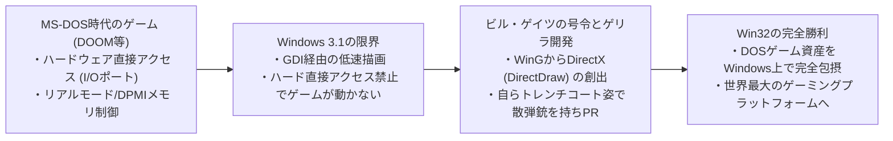

ゲイツは社内の腕利きエンジニアたちに号令をかけ、ハードウェアを直接叩くDOSゲームの挙動をWindows上でエミュレート・高速化するためのゲーム用グラフィックライブラリ「WinG」、そして後の「DirectX（開発コードネーム: Manhattan Project）」の開発を急がせた。

ゲイツ自身もまた、トレンチコートを身にまとい、DOOMのゲーム画面の中に散弾銃を持って合成で登場するという伝説的なプロモーションビデオに出演し、「Windows 95こそが究極のゲームプラットフォームである」と世界にアピールした。この時、DOSゲームの過激なハードウェア直叩きをWindowsの保護モード下で手なずけ、何事もなく動かしたノウハウが、後のWindowsの強力無比なマルチメディア互換性の礎となったのである。

---

## 第4章：現代のWindowsを支える巨大要塞「AppCompat（Application Compatibility）」

Windows 95の時代、互換性ハックはOSの各モジュールの中にアドホック（場当たり的）な特例コードとして散りばめられていた。しかし、ソフトウェアの数が爆発的に増加したWindows 2000およびWindows XPの時代に至り、この方式は限界を迎える。OS本体のコードがサードパーティ救済のための条件分岐だらけになり、メンテナンスが不可能になりつつあったからである。

そこでMicrosoftの天才アーキテクトたちが構築したのが、現代のWindows 11にまで受け継がれている世界最高峰の互換性エンジン――**「Application Compatibility（AppCompat）」サブシステム** である。

### 4.1 AppCompatサブシステムの全体構造

AppCompatサブシステムとは、簡単に言えば **「ターゲットとなるアプリケーションのバイナリがメモリ上にロードされた瞬間、OSがその挙動をリアルタイムで検知し、アプリケーションとOSカーネルの間に透明な『偽装レイヤー（Shim）』を動的に挟み込むインテリジェントな迎撃システム」** である。

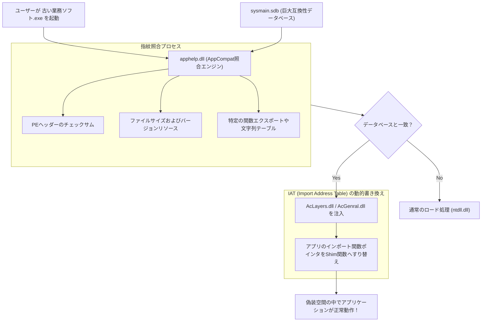

アプリケーションの実行ファイル（EXE）がダブルクリックされると、Windowsのプロセス生成ルーチン（`ntdll.dll` の内部処理）は、直ちにプロセスを実行するのではなく、まず **`apphelp.dll`** を呼び出す。

`apphelp.dll` は、Windows内部に格納されている巨大な互換性データベース **`sysmain.sdb`** を走査し、「いま起動されようとしているバイナリが、過去に救済が必要と認定されたアプリかどうか」を厳格に照合する。もし該当する場合、OSローダーは正規のシステムDLL（`kernel32.dll` や `user32.dll` 等）をロードする前に、互換性レイヤーDLLである **`AcLayers.dll`** や **`AcGenral.dll`** をプロセスのアドレス空間に強制注入するのである。

### 4.2 Shimエンジン：IATフックによるAPI差し替えのメカニズム

では、注入されたShimエンジンは、具体的にどのようにしてアプリケーションを騙すのか？ その中心的な技術が、Windowsの実行ファイル形式であるPE（Portable Executable）ヘッダーの **「IAT（Import Address Table: インポート・アドレス・テーブル）フック」** である。

Windowsプログラムが外部DLLの関数（例えば `GetVersionEx` や `GetDiskFreeSpace`）を呼び出す際、コンパイルされた機械語はDLLのアドレスを直接ハードコードしているわけではない。プログラムが起動された時、OSのローダーが各DLLの実際のメモリ配置アドレスを調べ、実行ファイルのメモリ領域内にある「IAT（関数ポインタの配列テーブル）」に関数アドレスを書き込む。プログラムは、常にこのIATを経由して間接的にAPIを呼び出している。

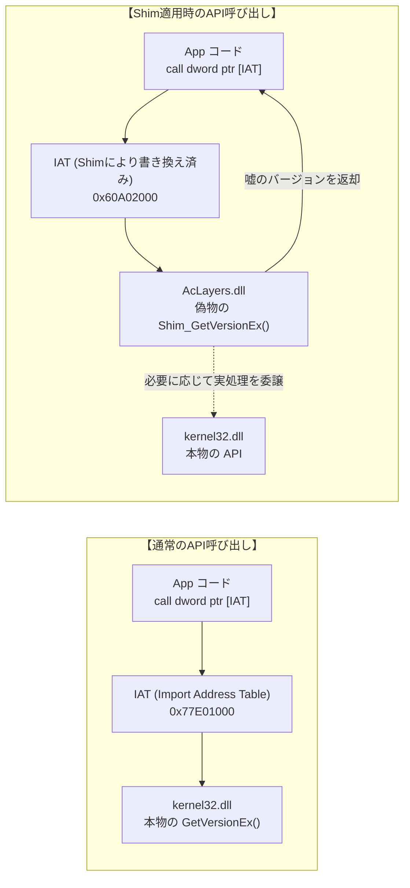

Shimエンジンはこの仕組みを逆手に取る。プログラムが実行を開始する直前、プロセス空間に割り込んだShimエンジンは、メモリ保護属性を `PAGE_READWRITE` に一時的に変更し、**「IATに格納されている正規のAPI関数のポインタを、Shimエンジン内の偽装関数（Shim関数）のアドレスへと上書きしてしまう」** のである。

これをC/C++風の概念的擬似コードで示すと以下のようになる：

```c
// IATフックによるShim注入の概念実証コード
#include <windows.h>
#include <imagehlp.h>

// 偽のGetVersionEx関数（Shimの実体）
BOOL WINAPI Shim_GetVersionExA(LPOSVERSIONINFOA lpVersionInformation)
{
    // 本来のAPIを呼んでベースの情報を取得
    typedef BOOL (WINAPI *PFN_GETVER)(LPOSVERSIONINFOA);
    HMODULE hKernel = GetModuleHandleA("kernel32.dll");
    PFN_GETVER pfnRealGetVer = (PFN_GETVER)GetProcAddress(hKernel, "GetVersionExA");
    
    BOOL bResult = pfnRealGetVer(lpVersionInformation);
    
    // 【欺瞞工作】
    // アプリに対して「現在のOSはWindows 95 (Major: 4, Minor: 0) である」と大嘘をつく
    lpVersionInformation->dwMajorVersion = 4;
    lpVersionInformation->dwMinorVersion = 0;
    lpVersionInformation->dwBuildNumber = 950;
    lpVersionInformation->dwPlatformId = VER_PLATFORM_WIN32_WINDOWS;
    strcpy(lpVersionInformation->szCSDVersion, "");

    return TRUE; // アプリは何の疑いもなくWindows 95だと信じ込んで動作する
}

// PEバイナリのIATを走査してフックを仕掛けるルーチン
void InstallShimHook(HMODULE hAppModule, LPCSTR targetDll, LPCSTR targetFunc, PVOID newFuncAddress)
{
    ULONG size;
    // PEヘッダーのインポート・ディレクトリを取得
    PIMAGE_IMPORT_DESCRIPTOR pImportDesc = (PIMAGE_IMPORT_DESCRIPTOR)
        ImageDirectoryEntryToData(hAppModule, TRUE, IMAGE_DIRECTORY_ENTRY_IMPORT, &size);

    while (pImportDesc->Name) {
        LPCSTR dllName = (LPCSTR)((PBYTE)hAppModule + pImportDesc->Name);
        if (_stricmp(dllName, targetDll) == 0) {
            // 対象DLL（kernel32.dllなど）のサンクテーブルを探索
            PIMAGE_THUNK_DATA pThunk = (PIMAGE_THUNK_DATA)((PBYTE)hAppModule + pImportDesc->FirstThunk);
            while (pThunk->u1.Function) {
                PROC* ppfn = (PROC*)&pThunk->u1.Function;
                // ここで目的の関数ポインタを発見した場合、アドレスを書き換える
                DWORD oldProtect;
                VirtualProtect(ppfn, sizeof(PROC), PAGE_READWRITE, &oldProtect);
                *ppfn = (PROC)newFuncAddress; // 偽装関数のアドレスへ差し替え！
                VirtualProtect(ppfn, sizeof(PROC), oldProtect, &oldProtect);
                break;
            }
        }
        pImportDesc++;
    }
}
```

この驚異的なフック機構により、アプリケーション側のバイナリには1バイトの改変も加えることなく、またOSカーネル本体を汚染することもなく、ターゲットのアプリだけを「完璧に調律された仮想的な過去のWindows空間」の中に閉じ込めることが可能となった。

### 4.3 謎の巨大バイナリ `sysmain.sdb`（Shim Database）

このAppCompatシステムの中枢を担っているのが、すべてのWindowsの `C:\Windows\AppPatch\` フォルダの中にひっそりと鎮座している **`sysmain.sdb`** というバイナリファイルである。

このファイルはMicrosoft独自仕様のバイナリデータベース（SDBフォーマット）で書かれており、内部には世界中の商用ソフトウェア、シェアウェア、ゲーム、企業内製ツールなど、**数万本から数十万本に及ぶアプリケーションの「救済レシピ」** が凝縮されている。

単にファイル名が `setup.exe` であるというだけでShimを適用してしまっては、無関係な最新のセットアッププログラムまで誤作動してしまう。そのため、`sysmain.sdb` のマッチングエンジンは、以下のような多次元の「指紋（フィンガープリント）」を用いて厳密に個別のバイナリを同定する：

1. **ファイル名と完全パス**
2. **ファイルサイズ（バイト単位）**
3. **PEヘッダーのタイムスタンプ（Linker Timestamp）**
4. **PEチェックサム（CheckSum）**
5. **バージョンリソース情報（CompanyName, ProductName, FileVersion, LegalCopyright等）**
6. **特定セクションのハッシュ値、エクスポート関数テーブルの構成**

もしユーザーが、2001年に発売された古い百科事典ソフトのCD-ROMをWindows 11のドライブに放り込んだとしよう。`apphelp.dll` は瞬時にそのEXEの指紋をスキャンし、`sysmain.sdb` の中に登録されたエントリーと照合する。そして、
「このソフトはWindows 2000向けに書かれており、ヒープのアドレスアライメントに依存し、さらに管理者権限のレジストリ直書きを試みる」
という過去のカルテを引き当て、即座に必要な数十種類のShimを一括で適用するのである。

---

## 第5章：代表的なShim（欺きの技術）カタログ

Windows内部に実装されているShimの種類は、実に数百種類にも及ぶ。それらは、過去のプログラマーたちが犯したあらゆるパターンの過ちを救うために編み出された、欺罔と救済のカタログである。

### 5.1 `VersionLie`: 「あなたはお望みのWindows 95ですよ」とOSが嘘をつく

最も古典的でありながら、最も多用されているShimが **`VersionLie`** （バージョン偽装）である。

多くのプログラマーは、アプリケーションの起動時に「このOSは自社ソフトが対応している環境か？」をテストするために、`GetVersion` または `GetVersionEx` APIを呼び出す。しかし、愚かなことに多くのコードは以下のように書かれていた：

```c
// 悲劇的なバージョンチェックの例
OSVERSIONINFO vi;
GetVersionEx(&vi);

// 「Windows 95専用」と思い込んだコード
if (vi.dwMajorVersion == 4 && vi.dwMinorVersion == 0) {
    // 正常起動
} else {
    MessageBox(NULL, "このソフトはWindows 95専用です。新しいOSでは動作しません。", "エラー", MB_OK);
    ExitProcess(1); // 自ら死を選ぶ！
}
```

このソフトは、将来「Windows XP（Major: 5）」や「Windows 7（Major: 6）」、「Windows 10（Major: 10）」といった優れた後継OSが出たとしても、「MajorVersionが4ではない」という理由だけで自らエラーを吐いて起動を拒否する。

そこで適用されるのが `VersionLie` である。このShimが適用されたプロセスが `GetVersionEx` を呼ぶと、Windows 11のカーネルは真顔で **「現在のOSはWindows 95です（Major: 4, Minor: 0）」** という偽の構造体を返す。ソフトは何の疑いもなく満足し、最新のマルチコアCPUとNVMe SSDの上で、Windows 95の気分に浸りながら快調に動作を開始するのである。

### 5.2 `EmulateGetDiskFreeSpace`: 2GB以上のHDD容量でオーバーフローするアプリを救う

1990年代半ば、ハードディスクの容量は数百メガバイトから1ギガバイト前後が主流であった。当時のWin32 APIである `GetDiskFreeSpace` は、クラスタあたりのセクタ数、セクタあたりのバイト数、空きクラスタ数などを32ビット符号付き整数で返していた。

このAPIの戻り値を使って空きディスク容量を計算しようとしたプログラマーたちは、以下のような計算式を書いた：

$$	ext{FreeBytes} = 	ext{SectorsPerCluster} 	imes 	ext{BytesPerSector} 	imes 	ext{NumberOfFreeClusters}$$

しかし、ハードディスクの空き容量が **2ギガバイト（$2^{31} - 1$ バイト）** を超えた瞬間、32ビット整数の計算結果は無残にもオーバーフローし、**負の数値（マイナス数百MB）** へと反転した。

その結果、大容量HDDを搭載した最新PCで古いゲームやOfficeをインストールしようとすると、インストーラは「空き容量がマイナス500MBしかありません。ディスクの空き容量が不足しています」と叫んでインストールを強制中断したのである。

この悲劇を救うために開発されたShimが **`EmulateGetDiskFreeSpace`** である。このShimは、対象アプリが空き容量を問い合わせてきた時、実際のドライブにどれほどテラバイト級の空き容量があろうとも、**「現在の空き容量は、オーバーフローを起こさない限界ギリギリの数値である2,147,151,872バイト（約1.99GB）です」** と大嘘をつく。アプリは「十分な空き容量がある」と納得し、無事にインストールを完了させることができる。

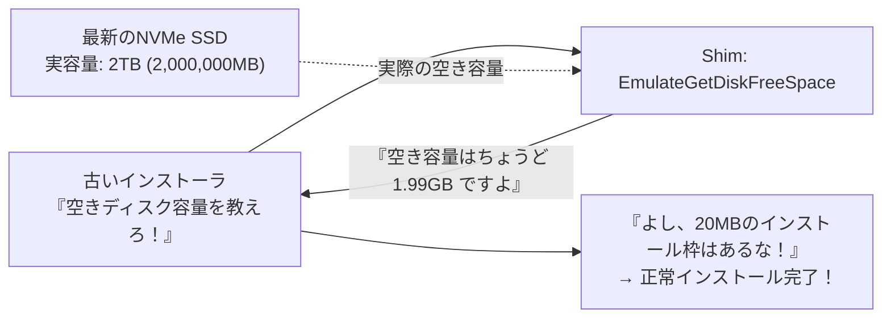

### 5.3 `VirtualRegistry` と `VirtualStore`: UAC導入によるリダイレクト

2006年のWindows Vistaにおいて、Windowsのセキュリティモデルは劇的な大転換を遂げた。**「UAC（User Account Control: ユーザーアカウント制御）」** の導入である。

それまでのWindows 95/98やXPにおいて、ユーザーは実質的に常に管理者権限（Administrator）でログインしており、アプリケーションはシステムの中枢である `C:\Program Files` ディレクトリや、レジストリの `HKEY_LOCAL_MACHINE\Software` キーに対して、何の後ろめたさもなく自由に設定ファイルやスコアデータを書き込んでいた。

だが、Vista以降のセキュリティ規律では、一般ユーザー権限でのシステム領域への書き込みは厳格にブロック（`ACCESS_DENIED`）されるようになった。もしこれをそのまま適用すれば、世界中に存在する数百万本のレガシーアプリケーションが、設定の保存に失敗して一斉にクラッシュすることは火を見るより明らかであった。

そこでWindows Vistaに組み込まれたのが、**「VirtualStore（ファイルおよびレジストリの仮想化Shim）」** である。

古いアプリケーションが管理者権限なしで `C:\Program Files\Game\save.dat` に書き込みを行おうとした瞬間、OSのI/Oマネージャはエラーを返す代わりに、その書き込み要求をユーザー固有の安全な隔離ディレクトリである `C:\Users\<ユーザー名>\AppData\Local\VirtualStore\Program Files\Game\save.dat` へと密かにリダイレクト（転送）する。

アプリが次にそのファイルを読み込もうとすると、OSはVirtualStoreから読み込んで返す。アプリケーション自身は、自分がシステムの神聖なProgram Filesに直接書き込んでいると信じ込んだまま、実際には安全なサンドボックス領域の中で隔離されて動き続けるのである。

### 5.4 `DXPrimaryBltPunt`: 旧世代DirectDrawのパレット崩壊とリフレッシュレート調整

Windows 95からXP初期にかけて作られた2Dゲーム（『エイジ オブ エンパイア』や無数のクラシックRPGなど）は、DirectXの初期コンポーネントである「DirectDraw」を駆使して画面を描画していた。これらは主に256色（8ビットカラーパレット）を前提として設計されており、ビデオカードのプライマリサーフェス（VRAM）のカラーパレットを直接書き換えることでフェードインや画面効果を実現していた。

しかし、現代のGPUとWindowsのグラフィックスタック（DWM: Desktop Window Manager）は、画面全体を32ビットTrueColorのテクスチャとして3Dパイプラインで合成処理している。256色パレットの直接書き換えなど、ハードウェア的にもアーキテクチャ的にも完全に時代遅れの遺物であった。

何の対策もなしに最新PCで古いDirectDrawゲームを起動すると、カラーパレットの同期が崩壊して画面全体が蛍光色の狂ったサイケデリックなモザイクと化すか、リフレッシュレートの非互換性によって秒間数百フレームで爆走してプレイ不可能になる。

この問題を解決するのが **`DXPrimaryBltPunt`** や **`ForceDirectDrawEmulation`** といったグラフィック系Shimである。これらのShimは、DirectDrawの古いサーフェス描画コマンドをインターセプトし、裏で近代的なDirect3Dのテクスチャへとリアルタイム変換した上で、DWMの合成パイプラインへと安全にブリッジする。30年前のドット絵ゲームが、最新の4Kディスプレイ上で当時の色合いのまま忠実に再現される奇跡は、この高度なグラフィック偽装によって担保されているのである。


## 第6章：64bit・ARMへの大航海 —— WOW64とエミュレーションの神技

CPUアーキテクチャそのものが根本から交代する時、互換性の維持はもはやAPIの小手先のフックだけでは立ち行かなくなる。Windowsはこの歴史的断絶に対して、OSの中に「別のOSを丸ごと内包する」という力技で応えてきた。

### 6.1 NTVDMからWOW64へ：二重化されたファイルシステムとレジストリ

16ビットから32ビットへの移行期、Windows NTは **NTVDM（NT Virtual DOS Machine）** を提供し、8086プロセッサの仮想86モードを駆使してDOSおよびWin16アプリを実行した。

そして2000年代中盤、AMD64（x64）の登場に伴い32ビットから64ビットへの地殻変動が起きた時、Microsoftが投入したのが **「WOW64（Windows 32-bit On Windows 64-bit）」** サブシステムである。

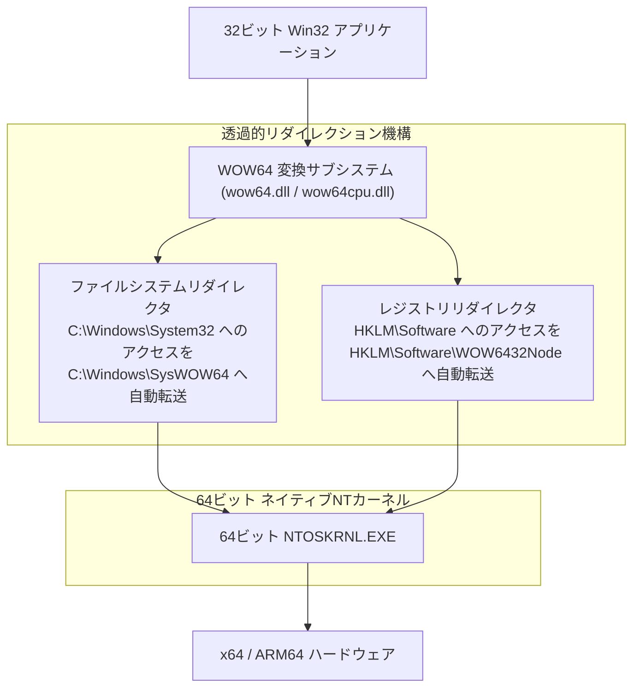

WOW64の最大の特徴は、32ビットアプリケーションに対して **「ファイルシステムとレジストリの完全な二重並行世界」** を見せる点にある。

- **ファイルシステム・リダイレクタ**:
  64ビットOSにおいて、純粋な64ビットシステムDLLは `C:\Windows\System32` に置かれている。一方、古い32ビットアプリがこのフォルダにアクセスしようとすると、OSは背後で透過的にアクセス先を `C:\Windows\SysWOW64`（名前の直感に反して、32ビット用DLLが格納されている場所）へとすり替える。
- **レジストリ・リフレクション**:
  同様に、32ビットアプリが `HKEY_LOCAL_MACHINE\Software` に書き込もうとすると、WOW64はそれを自動的に `HKEY_LOCAL_MACHINE\Software\WOW6432Node` へと隔離・リダイレクトする。

この精巧な並行世界のおかげで、1998年に作られた32ビットアプリケーションは、自分が64ビットの最新OS上で動いていることすら気づかずに、慣れ親しんだSystem32やレジストリを読み書きし続けることができる。

### 6.2 ARM64への移行とPrismエミュレータ

現代における最もホットな戦場が、x86/x64から **ARM64（Qualcomm Snapdragon X Elite等）** へのシフトである。

かつてMicrosoftは、2012年に「Windows RT」をリリースし、ARM上で既存のWin32アプリの動作を一切認めないという「Apple的なレガシー切り捨て」を試みたことがあった。結果はどうだったか？ 市場はWindows RTを猛烈に拒絶し、数十億ドルの巨額損失を計上して惨敗した。この手痛い教訓が、Windowsチームに「ARMであっても既存のx86/x64アプリを動かせないWindowsはWindowsではない」という原点を再認識させた。

最新のWindows 11 on ARMには、最新鋭のバイナリ・トランスレーション・エンジン **「Prism」** が組み込まれている。Prismは、実行されるx86/x64の機械語命令をリアルタイムで解析し、ARM64の命令セットへとJIT（Just-In-Time）コンパイルして実行するだけでなく、一度変換したコードブロックを最適化キャッシュに蓄積することで、ネイティブコードに迫る超高速動作を実現する。

どれほどCPUの命令セットが異質であろうとも、「ダブルクリックすれば過去のソフトが動く」というユーザーの体験だけは死守する。これが、幾多の失敗を経て研ぎ澄まされたMicrosoftの不退転の決意である。

---

## 第7章：三者三様の設計思想 —— Windows vs Apple (macOS) vs Linux

「過去のアプリケーションをどう扱うか」という問いに対して、世界の三大OSは全く異なる答えを出してきた。この思想の違いを比較することによって、Windowsの異様性と唯一無二の立ち位置が浮き彫りになる。

### 7.1 Apple（外科手術的断絶）：前進のためなら過去を焼き払う

Appleの創業者スティーブ・ジョブズ、そして現在のティム・クック体制に至るまで、Appleの哲学は **「未来のユーザー体験のためなら、過去の遺産は容赦なく焼き払う（Scorched Earth Policy）」** という外科手術的な進歩主義である。

Appleの歴史は、劇的なアーキテクチャの「断絶」の連続であった：
- **Classic Mac OSの完全放棄**: Mac OS 9からMac OS X（NeXTベースのUnix）への強制的移行。古いAPIである「Carbon」は過渡期として用意されたが、最終的に完全に葬り去られた。
- **ハードウェアの激変**: 680x0 → PowerPC → Intel x86 → Apple Silicon (Mシリーズ)。移行のたびにエミュレータ（Mac 68Kエミュレータ、初代Rosetta、Rosetta 2）を投入するが、数年でOSからエミュレータそのものを完全に削除し、過去のバイナリの息の根を止める。
- **macOS Catalinaにおける32ビットアプリの完全抹殺**: 2019年のmacOS Catalinaにおいて、Appleは32ビットバイナリの実行環境を完全に削除した。昨日まで愛用していた古い音楽制作プラグインやゲームは、二度と動かなくなった。

Appleの立場は極めて明確である。「開発者は常に最新のXcodeを使い、最新のSwiftでコードを書き直し、最新のmacOS向けに再コンパイルせよ。それができない怠惰な過去の遺産は、エコシステムから退場すべきである」。この方針により、macOSのコードベースは常にクリーンで、OSは軽量かつ高速に保たれるが、ユーザーと開発者には定期的な「焼き直し」の重労働が課される。

### 7.2 Linux（Linusの戒律）：「Never break userspace!」の光と影

オープンソースの世界を統べるリーナス・トーバルズ（Linus Torvalds）氏は、Linuxカーネルの開発において、Windowsチームと非常によく似た絶対規律を掲げている。それが **「Never break userspace!（ユーザーランドを決して壊すな！）」** である。

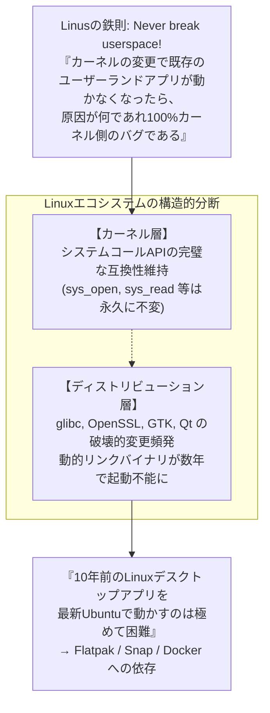

あるカーネルパッチがどれほど美しくエレガントであっても、既存のユーザー空間のプログラムが動作しなくなるリグレッションを引き起こした場合、リーナス氏はメーリングリストで猛烈な怒りを露わにし、そのパッチを即刻リバート（差し戻し）することで知られている。この点において、Linuxカーネルの哲学はWindowsと完全に軌を一にしている。

しかし、LinuxデスクトップにはWindowsのような単一の強力な調停者が存在しない。カーネルのシステムコールは不変であっても、ディストリビューション層の共有ライブラリ（`glibc` や `libssl`、GUIツールキット）が頻繁に後方互換性を壊すため、**「10年前にビルドした動的リンクのバイナリを、最新のUbuntuで動かす」ことは驚くほど困難** である。Linuxはカーネルレベルで互換性を守りながらも、エコシステム全体の断片化によって「30年前のソフトが動く」という次元には到達できなかった。

### 7.3 Windows（累積的包摂）：狂気のレイヤリング

これら二者に対し、Windowsの選んだ道は **「累積的包摂（Cumulative Inclusion）」** である。

過去のAPIやサブシステムを決して捨てず、地層のように新しいレイヤーを上に積み重ねていく。Win16の上にWin32を重ね、Win32の上に.NETを重ね、さらにその上にWinRT/UWPを重ね、最終的にUWPが不発に終わると、再びWin32の上にWindows App SDK（WinUI 3）を重ねる。

その結果、Windowsは地球上で最も複雑で、最も巨大なコードベースを持つ怪物となったが、その引き換えに **「あらゆる時代のソフトウェアが同時に共存し、平和に動く」という人類史上唯一無二の環境** を実現したのである。

| 比較項目 | Microsoft (Windows) | Apple (macOS) | Linux (デスクトップ) |
| :--- | :--- | :--- | :--- |
| **基本的互換性哲学** | **累積的包摂 (Accumulation)**<br/>過去をすべて抱え込む | **外科手術的断絶 (Disruption)**<br/>定期的に過去を焼き払う | **カーネル保護と自由放任**<br/>カーネルのみ固守、上流は分断 |
| **プライム・ディレクティブ** | "Don't break old apps" | "Embrace the modern platform" | "Never break userspace" (Kernel) |
| **互換性維持スパン** | **30年以上** (Win32/DOS) | **3〜5年程度** (移行期終了で破棄) | カーネルは長大、GUIアプリは短命 |
| **32ビットバイナリの現状** | **最新Win11でも完全動作** (WOW64) | **Catalina (2019) で完全抹殺** | マルチアーキライブラリ導入で一部可 |
| **開発者への要求** | 何もせずとも動き続ける | 定期的な再コンパイル・書き直し | ディストリビューションごとの再パッケージング |
| **アーキテクチャの純度** | 泥臭く巨大、数億行の地層 | 極めてクリーンでモダン | モジュール化されているが断片化 |

---

## 第8章：プラットフォーム・エコノミクス —— なぜ互換性が「最強の堀（Moat）」なのか

なぜビル・ゲイツと歴代のMicrosoft経営陣は、これほど過酷で泥臭いエンジニアリングを開発チームに強要し続けたのか？ その答えは、エンジニアリングの美学ではなく、冷徹な **「ビジネスモデルとプラットフォームの経済学」** の中にある。

### 8.1 ビル・ゲイツのビジネスモデル：OSの価値は「動くソフトウェアの総和」

ビル・ゲイツは創業当初から、プラットフォーム・ビジネスの本質を完璧に見抜いていた。

> **プラットフォームの価値定理**:
> OSというソフトウェアの価値は、そのOS単体の機能によって決まるのではない。
> **「そのプラットフォーム上で動作可能な、世界中のアプリケーション資産の総和」** によって決まる。

どれほど先進的で、メモリ効率が良く、UIが美しい新世代のOSを作ったとしても、その上でユーザーが日常業務に使うソフトウェアが動かなければ、市場価値はゼロである。ユーザーが買っているのはOSという箱ではなく、その中で動くソフトウェアと、そのソフトウェアが生み出す生産性だからである。

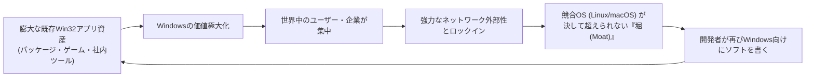

後方互換性を100%維持し続ける限り、過去30年間に世界中のプログラマーたちがWindows向けに書いてきた数億行、数兆ドル規模のソフトウェア資産は、**すべて「次世代のWindowsの付加価値」としてそのまま自動加算される**。

ライバルであるmacOSやLinuxがどれほど技術的な優位性を訴えようとも、「うちの会社で使っている20年前の受発注管理システムが動かない」という一言で商談は終わる。後方互換性こそが、競合他社が逆立ちしても奪うことのできない、Microsoftの最強の「堀（Moat）」だったのだ。

### 8.2 エンタープライズ市場の絶対的ロックイン

特に企業（エンタープライズ）市場において、この戦略は悪魔的な威力を発揮した。

大企業や官公庁、製造業の工場現場、金融機関には、過去数十年間に数億円から数十億円の巨額のIT投資を行ってスクラッチ開発された無数の社内業務システム（ミッションクリティカルなVB6製アプリやC++のActiveXコントロールなど）が稼働している。それらのコードを書いたベンダーは既に倒産しているか、仕様書すら残っておらず、誰も触ることのできない「動く遺産（レガシー）」と化している。

もし新しいWindowsが互換性を破り、「この業務ソフトはもう動きません。最新のWeb技術で数億円かけてゼロから作り直してください」と企業に要求したなら、企業のCIO（最高情報責任者）は激怒し、Windowsのアップグレードを無期限に凍結するか、あるいは別の選択肢を模索し始めただろう。

しかし、WindowsはAppCompatという魔法の杖を振るい、「何も直さなくて結構です。新しいPCに買い替えても、そのまま動きます」と囁き続けた。企業経営者にとって、これほど安心で合理的な提案はない。こうして世界中の大企業は、Windowsのエコシステムから永久に抜け出せなくなったのである。

### 8.3 破壊的イノベーションを阻む「勝利の罠」

しかし、この圧倒的な成功は、皮肉にもMicrosoft自身を内側から縛り上げる **「勝利の罠（Success Trap）」** となった。

2010年代、スマートフォンの爆発的普及によってiOSとAndroidが台頭した時、MicrosoftはWindowsを近代化するため、サンドボックス化されセキュリティの高い新世代アプリケーション規格「UWP（Universal Windows Platform）」を立ち上げ、従来のWin32アプリを段階的に廃止しようと試みた。

しかし、開発者たちも企業も、UWPへの移行をことごとく無視した。「なぜわざわざ機能が制限され、過去の資産が動かない新しいフレームワークに書き直さなければならないのか？ 既存のWin32のままで、最新のWindows 10でも11でも快適に動いているではないか」と。

皮肉なことに、**「Win32があまりにも頑丈で、どこでも完璧に動いてしまうがゆえに、Microsoft自身ですらWin32を殺すことができない」** という自家中毒に陥ったのである。結局、MicrosoftはUWPを事実上諦め、Win32アプリをそのままパッケージングしてストアで配布できるようにし、最新のUIツールキットであるWinUI 3もWin32の土台の上に再構築せざるを得なくなった。自らが築いた最強の後方互換性が、自らのイノベーションを阻む最も強固な壁となったのである。

---

## 第9章：栄光の代償 —— 肥大化する技術的負債とセキュリティの隘路

他人のバグを背負い、過去の遺産をすべて守り抜くという道は、決して無償の果実ではなかった。その代償として、Windows開発チームは現代のあらゆるソフトウェアプロジェクトの中で最も過酷な「技術的負債」と戦い続けることを余儀なくされている。

### 9.1 数億行のコードベースと天文学的テストマトリックス

Windowsのソースコードは、今日では **数億行** の規模に達していると言われる。そして何よりも恐ろしいのが、新しいWindowsのビルドを作成するたびに実行しなければならないテストの天文学的な組み合わせ（テストマトリックス）である。

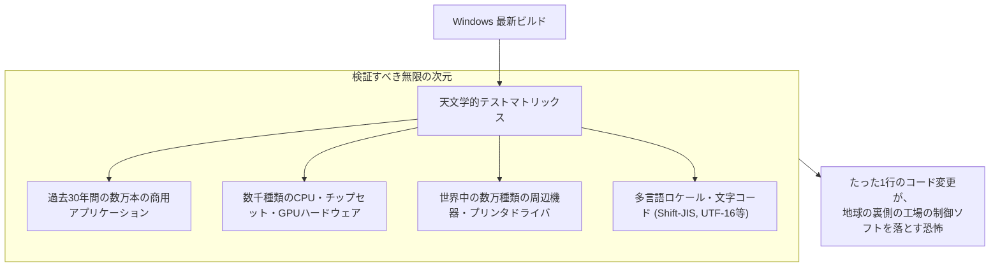

Windowsのコア部分でたった1つのポインタチェックを追加したり、ロックの順序を変更したりするだけで、世界中のどこかの工場ラインを制御している30年前のソフトがデッドロックして止まる可能性がある。この恐怖と戦うため、Microsoftは広大なラボに数万台の実機と数千台の仮想マシンを並べ、過去数十年分のソフトウェアを自動起動してウィンドウが表示されるかを検証する、狂気的なテスト自動化パイプラインを運用し続けている。

### 9.2 レガシーAPIが引き起こすセキュリティホール

技術的負債の最も深刻な側面は、**セキュリティ** である。

1990年代に設計されたレガシーなWin32 APIの多くは、インターネットが普及する以前の「牧歌的な時代」に作られており、バッファオーバーフロー対策やアクセス権限の概念が極めて甘い。しかし、互換性を維持するためには、それらの危険なAPIを削除することは許されない。

攻撃者たちは、まさにこの「互換性のために残された古いAPI」や「互換性レイヤーの隙間」を突いて特権昇格やサンドボックス脱出を試みる。過去のアプリを救うための親切心が、そのままOS全体の攻撃対象領域（Attack Surface）を押し広げる結果となっているのである。

### 9.3 Longhornプロジェクトの空中分解と「MinWin」へのリファクタリング

この互換性と機能追加の果てしない積み重ねが極限に達し、歴史的な破綻を迎えたのが、2000年代前半の **「Longhornプロジェクト」** であった。

当時、Windows XPの次世代OSとして開発されていたLonghornは、野心的な新機能と肥大化したコードの相互依存関係が複雑怪奇に絡み合い、もはや誰の手にも負えないスパゲッティコードと化していた。ビルドは毎日破損し、開発速度はゼロに落ち込み、プロジェクトは完全に空中分解した。

2004年、Microsoftはついに「Longhornのリセット」を決断する。何千人ものエンジニアがそれまで書いた数年分のコードを破棄し、比較的堅牢であった「Windows Server 2003 SP1」のコードベースに立ち戻って再スタートを切った（これが後のWindows Vistaとなる）。

この痛烈な挫折を経て、WindowsチームはOSの核となる最下層のカーネルを「MinWin」と呼ばれる小さな独立モジュールへと分離し、上位の互換性レイヤーとの結合度を下げる大規模なリファクタリングを断行した。Windowsが今なお破綻せずに動き続けているのは、この地獄のような崩壊の危機を乗り越えてアーキテクチャの境界線を引き直したからに他ならない。

---

## 結論：泥臭きエンジニアたちへの賛歌 ——「動く」という奇跡の上に築かれた現代社会

私たちが普段、何気なく使っているオフィスPC、病院の電子カルテ端末、銀行のATM、鉄道の運行管理システム、そして工場の工作機械。それらの足元を支えている現代文明のインフラの深部には、ほぼ例外なくWindowsが息づいている。

もしMicrosoftが、コンピュータ・サイエンスの教科書に忠実な「美しき設計の信奉者」であり、Appleのように数年ごとに過去の資産を切り捨てる企業であったなら、世界はどうなっていただろうか？

世界中の無数の工場が稼働を停止し、中小企業は数年おきのシステム改修費用で倒産し、医療現場や社会インフラは大混乱に陥っていたはずである。現代のグローバル経済とIT社会がこれほどまでに円滑に、そして止まることなく前進し続けてこられたのは、他ならぬWindowsが **「世界中のあらゆるプログラマーたちの手抜き、誤解、バグ、そして過去の遺産のすべてを、自らの背中に背負い込み続けてきたから」** である。

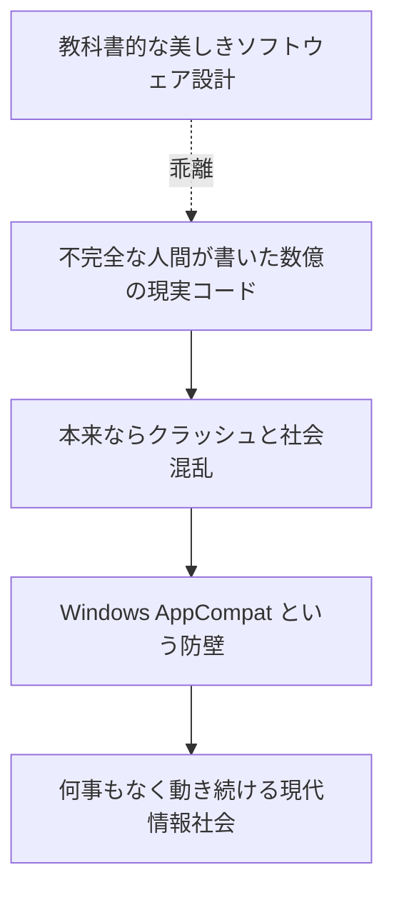

レイモンド・チェン氏をはじめとする歴代のWindows開発チームのエンジニアたちにとって、自らの誇り高いコードを汚し、他人のバグのために徹夜でShimを書き続ける作業は、決して華々しいものではなかっただろう。学術論文で称賛されるような革新的なアルゴリズムでもなければ、シリコンバレーのスタートアップが喧伝するようなスマートなイノベーションでもない。

しかし、それこそが **「プロフェッショナルのエンジニアリング」** の究極の姿ではなかったか。

真のエンジニアリングとは、無菌室の中で美しき数式を愛でることではない。泥にまみれ、埃に塗れながら、不完全な人間たちが作った不完全な世界の辻褄を合わせ、**「昨日動いていたものが、今日も明日も、10年後も絶対に動き続ける」** という奇跡を、泥臭い現実の中で泥臭く担保し続けることである。

「過去のアプリを決して壊すな」——この狂気的なまでの鉄の掟と、それを完遂した名もなきプログラマーたちの血の滲むような執念の上に、私たちの愛するデジタル社会は今日も、何事もなかったかのように動いている。
