## Introdução: Qual é a verdadeira essência de um sistema operacional? — «Design elegante» ou «pragmatismo visceral»?

Ao folhear os livros clássicos de ciência da computação ou os manuais canônicos de engenharia de software, deparamo-nos invariavelmente com ideais sedutores: «abstrações elegantes», «separação estrita de responsabilidades», «APIs ortogonais e simétricas». Somos ensinados de que um sistema operacional (SO) deve atuar como um árbitro sagrado e imaculado, cuja função primordial é mascarar a complexidade do hardware e oferecer às aplicações uma interface limpa, intuitiva e conceitualmente pura.

Contudo, no exato instante em que abandonamos a torre de marfim acadêmica e ingressamos no campo de batalha dos sistemas operacionais comerciais para computadores de mesa, esse ideal virginal se estilhaça por completo. Ao longo da história da computação pessoal, o colosso que alcançou o maior êxito comercial e dominou bilhões de computadores ao redor do globo — o Windows — encarnou uma filosofia situada nos antípodas da estética acadêmica: **um pragmatismo visceral levado às raias da obsessão**.

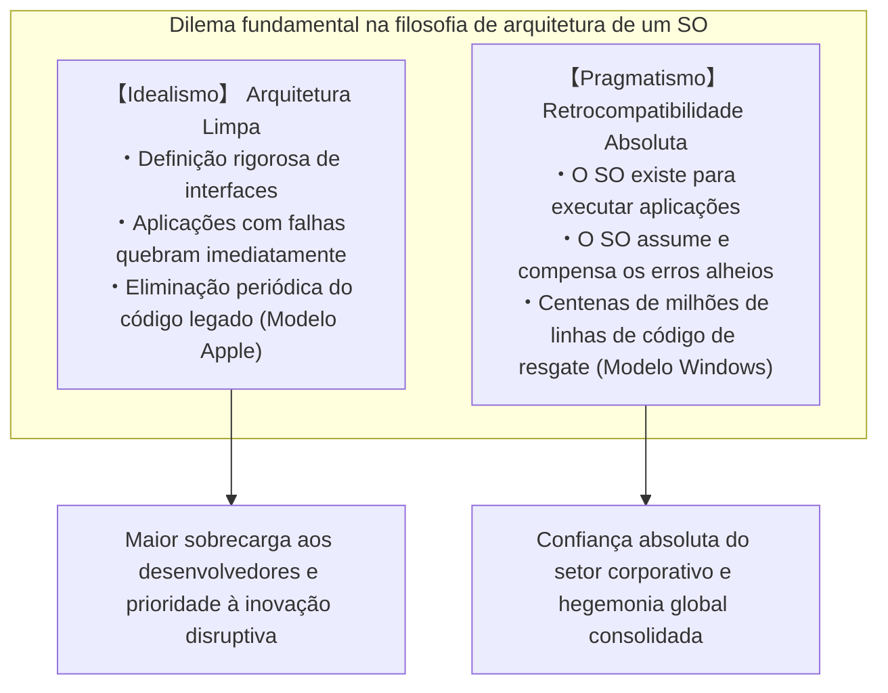

Entre todos os sistemas operacionais existentes no planeta, nenhum jamais demonstrou uma devoção tão visceral e implacável pelo patrimônio do passado quanto o Windows. Discos de jogos em CD-ROM lançados em 1995, programas contábeis corporativos desenvolvidos no início dos anos 90 em Visual Basic 3.0 ou C++, utilitários herdados da era MS-DOS que exploravam comportamentos internos não documentados... uma impressionante miríade desses softwares continua sendo inicializada e executada com absoluta naturalidade em pleno ano de 2026, sobre o moderníssimo Windows 11.

Para a maioria dos usuários, esse fenômeno é encarado como algo corriqueiro: «o software simplesmente funciona». Porém, os programadores de sistemas que realizam engenharia reversa no código do Windows e contemplam suas entranhas recuam maravilhados e estarrecidos. O que ali jaz não é um passe de mágica, mas **estratos geológicos acumulados ao longo de mais de 30 anos: centenas de milhares de linhas de exceções ad-hoc, simulações dinâmicas de APIs e mecanismos pelos quais o próprio sistema operacional mente descaradamente para os aplicativos (os chamados Shims)** — tudo meticulosamente arquitetado pelos engenheiros da Microsoft para remediar bugs de terceiros, violações de especificações, corrupções de memória e comportamentos indefinidos cometidos por outros desenvolvedores.

Por que razão a Microsoft se sujeitou a carregar sobre os ombros do sistema operacional o código defeituoso escrito por terceiros, garantindo seu funcionamento a qualquer custo?  
Por que ela não adotou a postura da Apple, extirpando sumariamente o passado em nome da modernidade arquitetural?  
E como essa engenharia aparentemente insana transformou o Windows em uma fortaleza inabalável — na plataforma mais dominante da história da tecnologia?

Este ensaio é uma análise técnica minuciosa e definitiva que cruza os depoimentos de programadores lendários da Microsoft, dados de engenharia reversa das entranhas do Windows, a mecânica profunda dos binários PE (Portable Executable) e do kernel NT, e a história estratégica das plataformas de software, para expor em detalhes a diretiva máxima que rege o Windows: **«Nunca quebre aplicativos legados (Don't break old apps)»**.

---

## Capítulo 1: A «Diretiva Primordial» contada por duas fontes lendárias

A obsessão por compatibilidade que forjou o ecossistema do Windows não é uma suposição concebida por analistas externos. Ela foi relatada cruamente por dois programadores emblemáticos que atuaram na linha de frente do desenvolvimento e ditaram os rumos arquiteturais do sistema.

### 1.1 Raymond Chen e *The Old New Thing*

No time de engenharia do Windows na Microsoft, há um profissional reverenciado há mais de três décadas como uma verdadeira lenda viva: **Raymond Chen**, Engenheiro Principal de Software que ingressou na Microsoft em 1992 e, desde então, atua na manutenção e evolução do shell do Windows 95, do User32 e das camadas mais profundas do subsistema Win32.

Chen iniciou um blog interno que posteriormente se transformou na consagrada coluna pública oficial **«The Old New Thing»** (mais tarde compilada em livro, tornando-se leitura obrigatória para programadores de sistemas). Essa obra constitui um dos maiores inventários mundiais sobre como problemas reais e bizarros de compatibilidade foram solucionados nos bastidores do sistema operacional.

O axioma fundamental da equipe do Windows, reiterado à exaustão por Chen, é assustadoramente simples e implacável:

> «O Windows é um sistema operacional que existe com o propósito único de executar programas. Os usuários não compram computadores para contemplar a estética do sistema operacional; compram para utilizar aplicações específicas que rodam sobre ele.
> 
> E a realidade mais brutal é a seguinte: **quando um usuário atualiza para uma nova versão do Windows e seu aplicativo preferido para de funcionar, ele jamais culpa os desenvolvedores daquele aplicativo. Ele culpa a Microsoft em 100% dos casos, bradando: "O Windows quebrou!" ou "O novo Windows é defeituoso!"**»

Pelo prisma do orgulho técnico de um engenheiro de software, a inclinação natural seria rebater: «Se o aplicativo contém um bug em seu código-fonte, é perfeitamente natural que ele falhe; cabe à empresa criadora do aplicativo lançar um patch corretivo». No entanto, no mercado massivo de sistemas operacionais de consumo, essa justificativa é nula. Para o usuário final, a única realidade tangível é o fato inequívoco de que o programa funcionava ontem e deixou de funcionar no segundo em que o sistema foi atualizado.

Se a Microsoft respondesse com purismos acadêmicos afirmando que «o bug é do fornecedor do software», os consumidores simplesmente recusariam as atualizações, permaneceriam estagnados na versão anterior ou migrariam para plataformas concorrentes. Consequentemente, como um imperativo inegociável de sobrevivência de negócios, a equipe do Windows teve que assumir uma meta monumental:

**«Não importa quão absurdo, violador de padrões ou quebrado seja o código de um aplicativo: o sistema operacional deve ser capaz de identificá-lo, compensar as falhas internamente e fazê-lo rodar como se nada tivesse acontecido.»**

O blog de Chen documenta com detalhes impressionantes as inúmeras gambiarras heróicas e desconcertantes que ele e seus colegas foram obrigados a conceber para honrar esse juramento.

### 1.2 A denúncia de Joel Spolsky: *How Microsoft Lost the API War*

A magnitude dessa mentalidade foi revelada à comunidade global de desenvolvedores web e empresários de tecnologia por **Joel Spolsky**. No início dos anos 90, Spolsky atuou como gerente de programas da equipe do Microsoft Excel e, anos depois, fundou o Stack Overflow e o Trello, tornando-se um dos ensaístas técnicos mais célebres do mundo.

Em 2004, Spolsky publicou um ensaio clássico intitulado *How Microsoft Lost the API War* («Como a Microsoft perdeu a guerra das APIs»). Ao recordar a liderança intransigente de Jon DeVaan e outros diretores da equipe do Windows, ele escreveu:

> "In the Windows team, the prime directive was: **don't break old apps.**"  
> (Na equipe do Windows, a diretiva suprema — a diretiva primordial — era: **nunca quebre aplicativos antigos**).

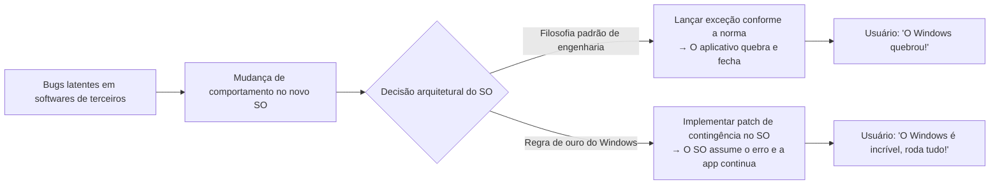

Spolsky elucida que, assim como na série de ficção científica *Star Trek* a regra inviolável da Frota Estelar é a «Primeira Diretiva» (não interferir no desenvolvimento natural de civilizações alienígenas), para os engenheiros do Windows a regra sagrada e inegociável era nunca comprometer a integridade operacional dos softwares legados existentes.

Se um desenvolvedor do Windows refatorasse elegantemente uma rotina do kernel ou uma API, duplicando sua velocidade, mas essa alteração provocasse a quebra de um único e desconhecido software de contabilidade corporativa em alguma empresa remota, a alteração era sumariamente vetada. No time do Windows, a elegância estética e a pureza de código eram considerações de segunda ordem; **assegurar que 100% dos binários existentes continuassem operacionais constituía o bem supremo e inquestionável**.

### 1.3 «Até os bugs se tornam especificações»: A Lei de Hyrum e a irreversibilidade das APIs

Na engenharia de software existe um princípio observacional formulado por Hyrum Wright, engenheiro do Google, amplamente conhecido como a **Lei de Hyrum**:

> **Lei de Hyrum**:  
> «Quando uma API possui um número suficiente de usuários, não importa o que o seu criador estabeleceu formalmente na documentação. Qualquer comportamento observável do sistema — incluindo bugs e efeitos colaterais acidentais — será inevitavelmente transformado em dependência pelo código de alguém.»

O Windows é, indiscutivelmente, o maior e mais dramático laboratório empírico da Lei de Hyrum na história da computação.

Suponhamos, por exemplo, que a documentação formal de uma API do Windows declare explicitamente: *«O terceiro parâmetro deve ser um identificador de janela (HWND) válido. O comportamento ao passar um valor inválido é indefinido»*. Todavia, um programador negligente passa inadvertidamente um ponteiro nulo (`NULL`) ou um valor corrompido, e, por mero acaso, a implementação concreta do Windows 3.1 ignorava a anomalia sem emitir qualquer falha perceptível.

Anos mais tarde, com dezenas de milhares de cópias daquele software em operação em empresas, a equipe do Windows 95 ou Windows NT resolve higienizar o código: «Vamos implementar uma validação rigorosa de parâmetros e retornar formalmente `ERROR_INVALID_WINDOW_HANDLE` se o identificador for inválido». O que acontece no mundo real?

Em milhares de escritórios corporativos, o software antigo trava imediatamente, exibindo caixas de erro fatais. Os usuários ligam enfurecidos para o suporte da Microsoft: «Atualizamos o Windows e agora não conseguimos trabalhar!».

Diante dessa catástrofe comercial, os engenheiros da Microsoft eram forçados a recuar, engolir o orgulho técnico e escrever trechos de código desconcertantes como este:

```c
// Exemplo conceitual de implementação interna de uma API do Windows
BOOL WINAPI DoSomething(HWND hWnd, UINT uMsg, WPARAM wParam, LPARAM lParam)
{
    // Validação canônica recomendada pelos livros de texto
    if (!IsWindow(hWnd)) {
        // Em circunstâncias normais, um erro deveria ser retornado aqui:
        // SetLastError(ERROR_INVALID_WINDOW_HANDLE);
        // return FALSE;

        // 【HACK DE COMPATIBILIDADE】
        // O famoso aplicativo comercial 'AppX' repassa um identificador NULL na inicialização.
        // Se retornarmos erro, o AppX quebra fatalmente.
        // Por conseguinte, detectamos o executável e substituímos o valor silenciosamente
        // pelo handle da janela da Área de Trabalho (Desktop Window).
        if (IsTargetBadApplication("AppX.exe")) {
            hWnd = GetDesktopWindow();
        } else {
            SetLastError(ERROR_INVALID_WINDOW_HANDLE);
            return FALSE;
        }
    }

    // Prosseguir com o processamento real da API...
    return InternalDoSomething(hWnd, uMsg, wParam, lParam);
}
```

A partir do momento em que um sistema operacional atinge a escala de padrão mundial, a especificação real de uma API deixa de ser aquilo que se encontra redigido nos manuais técnicos; ela passa a ser **o conjunto integral de comportamentos observáveis exibidos pela implementação original, incluindo cada uma de suas imperfeições, falhas e comportamentos acidentais**. A equipe do Windows compreendeu essa realidade inescapável e assumiu o encargo perpétuo de incorporar os defeitos alheios como parte de suas próprias especificações operacionais.

---

## Capítulo 2: O início da lenda — A verdade técnica por trás do «Incidente do SimCity»

Dentre todas as narrativas que ilustram a dedicação implacável da Microsoft à compatibilidade retroativa, nenhuma se tornou tão célebre quanto o **«Incidente do SimCity»**, ocorrido em 1995 durante os estágios finais do desenvolvimento do Windows 95.

### 2.1 A física do Use-After-Free (acesso à memória após a liberação)

Criado em 1989 pela Maxis sob a liderança do lendário designer Will Wright, *SimCity* foi um marco revolucionário na história dos jogos eletrônicos, desfrutando de um estrondoso sucesso mundial. Para milhões de consumidores domésticos e profissionais que gerenciavam suas cidades nos intervalos do trabalho, a possibilidade de rodar o SimCity sem falhas era uma prioridade absoluta.

No entanto, o código compilado da versão de *SimCity* para DOS e Windows 3.1 continha uma falha de gerenciamento de memória gravíssima, que nos padrões contemporâneos de segurança ofensiva seria prontamente catalogada como vulnerabilidade crítica: um **Use-After-Free (UAF)**, isto é, o acesso indevido à memória após a sua liberação formal.

Durante o ciclo de simulação e desenho gráfico, o SimCity alocava blocos de memória dinâmica através do heap do sistema e, após utilizá-los, executava rotinas de liberação como `free` ou `GlobalFree`. Porém, os ponteiros internos da aplicação não eram limpos, e o código continuava **lendo e escrevendo sem qualquer pudor em áreas de memória que já haviam sido devolvidas formalmente ao sistema operacional**.

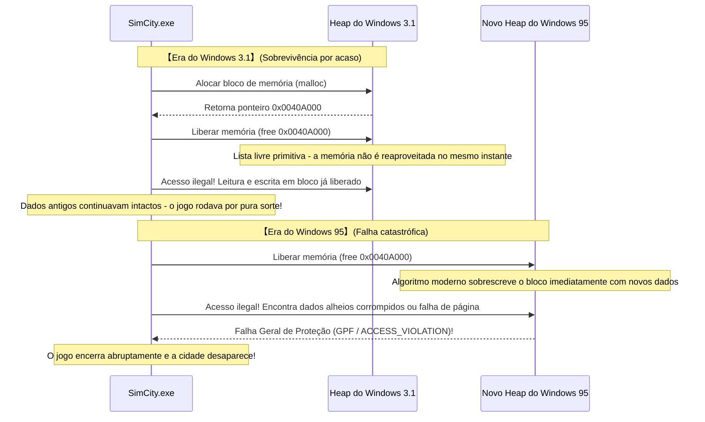

No ecossistema de 16 bits do Windows 3.1, o gerenciamento de memória era rudimentar. Quando uma aplicação liberava um trecho de memória, a estrutura elementar da lista de blocos livres (free list) raramente realocava ou sobrescrevia aquele endereço de imediato para outro propósito. Em termos práticos: embora o código do SimCity estivesse fundamentalmente corrompido, **ele funcionava por pura casualidade devido à simplicidade despretensiosa do alocador do Windows 3.1**.

### 2.2 Engenharia de software convencional vs a loucura da equipe do Windows

Em 1995, a Microsoft preparava a estreia de sua obra magna de 32 bits: o Windows 95.

O novo sistema trazia multitarefa preemptiva real, memória virtual robusta e um avançado alocador de heap projetado para minimizar a fragmentação e acelerar o uso do cache do processador. Esse novo alocador operava com uma lógica agressiva: no momento exato em que um bloco de memória era devolvido pela aplicação, ele era **imediatamente reciclado, recombinado ou sobrescrito com novas estruturas de controle para atender a outros processos**.

Quando os engenheiros executaram o SimCity sobre o Windows 95, o desastre foi instantâneo:  
O SimCity tentava ler a memória recém-liberada e colidia contra dados de outros processos ou páginas desativadas. No mesmo instante, explodia na tela a temível caixa de diálogo de **«Falha Geral de Proteção (General Protection Fault: GPF)»**, exterminando sem aviso a metrópole que o jogador levara dezenas de horas para construir.

Diante de um impasse dessa natureza, qual teria sido a postura de uma equipe tradicional de engenharia ou de qualquer outro fabricante de software de sistemas?

A resposta é inequívoca: «A falha decorre 100% de uma programação incorreta da Maxis. O gerenciamento de memória do novo sistema operacional está estritamente conforme os padrões. Devemos notificar a Maxis para que ela fabrique disquetes com uma atualização corretiva (SimCity 1.01) e os distribua aos usuários». Esse seria o posicionamento ortodoxo e tecnicamente irrefutável.

Contudo, para a diretoria executiva da Microsoft e para os líderes do lançamento do Windows 95, a conclusão foi diametralmente oposta:

**«O SimCity não pode quebrar em hipótese alguma. Não podemos esperar que terceiros corrijam seus programas. Modifiquem o alocador de memória do kernel do Windows 95 para que ele reconheça o SimCity e garanta seu funcionamento.»**

### 2.3 Detalhes do hack dedicado ao SimCity no alocador de memória

No artigo histórico anteriormente citado, Joel Spolsky narrou os detalhes dessa intervenção técnica:

> «Durante os testes beta do Windows 95, eles constataram que o SimCity apresentava falhas de execução. O que a Microsoft fez?  
> Eles não procuraram os desenvolvedores do SimCity para exigir correções. O engenheiro responsável pelo gerenciador de memória do Windows 95 escreveu uma rotina específica no kernel: **"Se o programa em execução for o SimCity, não realoque a memória recém-liberada imediatamente; preserve-a intacta por algum tempo"**».

Sob a ótica da ciência da computação contemporânea, essa intervenção foi uma precursora empírica dos conceitos modernos de «Heap de Quarentena (Quarantine Heap)» e «Liberação Retardada (Delayed Free)».

Durante a inicialização dos processos, o alocador do Windows 95 inspecionava o nome do executável (`SIMCITY.EXE`) e as informações de cabeçalho. Ao identificar o jogo, o kernel chaveava o algoritmo de desalocação para o modo de contingência do SimCity: em vez de mesclar imediatamente o bloco liberado e disponibilizá-lo para reuso, os ponteiros eram desviados para um buffer circular temporário, assegurando que o conteúdo original permanecesse inalterado na memória pelo tempo necessário para que as rotinas defeituosas do jogo concluíssem suas leituras ilegítimas.

Graças a esse pragmatismo radical e heterodoxo por parte do sistema operacional, milhões de pessoas puderam inserir seus disquetes de *SimCity* no dia do lançamento do Windows 95 e continuar governando suas cidades sem o menor vestígio de erro.

Os consumidores comemoravam entusiasmados: «O Windows 95 é fantástico! Roda todos os meus programas antigos perfeitamente!». E nenhum deles jamais imaginou que, dentro daquele moderno kernel de 32 bits, residia um remendo heroico arquitetado pelos engenheiros da Microsoft para remediar um bug cometido seis anos antes por programadores que sequer trabalhavam na empresa.


---

## Capítulo 3: A genealogia dos «hacks viscerais de compatibilidade» que marcaram a história

O resgate do SimCity foi apenas a ponta do iceberg. A trajetória de mais de três décadas do Windows é uma sucessão contínua de intervenções técnicas audaciosas, concebidas especificamente para manter em operação uma infinidade de programas indisciplinados e mal programados ao redor do mundo.

### 3.1 Lotus 1-2-3 e o «bug do ano bissexto de 1900» no Excel

No universo dos cálculos de calendário por computador, existe uma falha universalmente famosa que, ainda hoje, permanece ativa e sem correção em bilhões de dispositivos: **o reconhecimento incorreto de 1900 como um ano bissexto**.

No calendário gregoriano, as diretrizes astronômicas e matemáticas para os anos bissextos são absolutamente inequívocas:
1. Todo ano divisível por 4 é bissexto.
2. Contudo, anos divisíveis por 100 são anos comuns (não bissextos).
3. Exceto se o ano for também divisível por 400, quando torna a ser bissexto.

Portanto, como o ano de 1900 é divisível por 100 mas não por 400, **trata-se inquestionavelmente de um ano comum; o dia 29 de fevereiro de 1900 jamais existiu**.

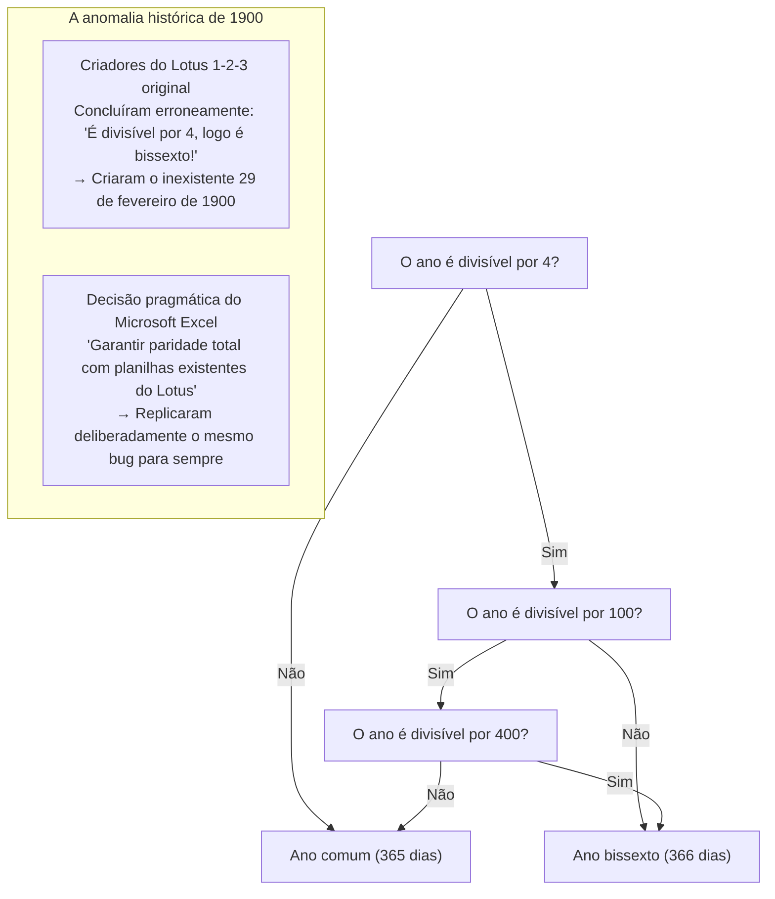

Todavia, no início dos anos 80, os desenvolvedores do *Lotus 1-2-3* — a planilha eletrônica que dominava de forma hegemônica o mercado de computadores MS-DOS — esqueceram a exceção do século e programaram o ano de 1900 como bissexto. Dessa forma, o Lotus 1-2-3 gerava a data fictícia de 29 de fevereiro de 1900, deslocando em um dia toda a contagem numérica sequencial de datas posteriores.

Quando a equipe da Microsoft projetou o *Excel* para concorrer nesse mercado bilionário, deparou-se com um dilema crucial: deveriam implementar a contagem cronológica matematicamente exata, ou priorizar a compatibilidade numérica com as dezenas de milhões de planilhas financeiras corporativas já criadas no Lotus 1-2-3?

A determinação de Bill Gates foi categórica: para assegurar uma transição imediata e indolor aos clientes corporativos do concorrente, **o Excel incorporou intencionalmente o mesmo bug, passando a aceitar formalmente o inexistente 29 de fevereiro de 1900**.

Se você abrir hoje o Microsoft 365 Excel e digitar na célula a fórmula `=DATA(1900; 2; 29)`, constatará que o aplicativo exibe calmamente a data fictícia «29/02/1900». Uma vez tomada a decisão de herdar os erros alheios em favor da soberania mercadológica, essa hipoteca se torna irrevogável ao longo dos séculos.

### 3.2 Por que o «Windows 9» foi pulado?

No segundo semestre de 2014, a Microsoft realizou um evento de gala para anunciar o sucessor do Windows 8.1. Analistas e usuários aguardavam ansiosamente o «Windows 9». No entanto, a revelação no palco causou espanto mundial: o novo produto seria batizado de **«Windows 10»**.

Por que a numeração saltou o dígito 9? Embora as notas oficiais de marketing enfatizassem a necessidade de transmitir uma ruptura tecnológica monumental, engenheiros que atuavam nos bastidores revelaram na internet um motivo técnico muito mais direto e concreto: a proliferação de atalhos descuidados em softwares legados.

Em incontáveis aplicações corporativas, módulos de bibliotecas Java e rotinas de instaladores antigos, a verificação da versão do sistema operacional em execução era frequentemente realizada através de trechos de código como este:

```java
// Padrão de verificação extremamente comum em softwares corporativos antigos
String osName = System.getProperty("os.name");

if (osName.startsWith("Windows 9")) {
    // Suposição errônea de que o sistema é Windows 95 ou Windows 98!
    // Ativa caminhos de código de 16 bits e registros obsoletos da família Win9x
    enableLegacyWin9xMode();
} else {
    // Comportamento moderno para sistemas NT (Windows NT, 2000, XP, 7, 8, etc.)
    enableModernNTMode();
}
```

Muitos programadores preguiçosos utilizavam `startsWith("Windows 9")` como um atalho cômodo para englobar conjuntamente o Windows 95 e o Windows 98.

Se a Microsoft tivesse lançado o sistema com o nome de «Windows 9», milhares de softwares corporativos e componentes de infraestrutura teriam concluído incorretamente que estavam rodando no Windows 95 de 1995. Em decorrência disso, teriam desativado as APIs contemporâneas do NT para invocar chamadas inexistentes do DOS/Win9x, quebrando em cadeia.

O medo instintivo de que um simples nome comercial desencadeasse um apagão em softwares legados fez com que o número 9 fosse apagado da cronologia oficial do Windows.

### 3.3 APIs não documentadas (Undocumented APIs) e o Norton Utilities

Durante os anos 90, o pacote de utilitários de manutenção de disco e sistema *Norton Utilities*, da Symantec, era indispensável nos computadores pessoais. Mas para a equipe de desenvolvimento do Windows, o Norton era o mais assustador e rebelde dos aplicativos.

Ferramentas de baixo nível como o Norton não se contentavam com as APIs públicas do Win32; elas **acessavam rotineiramente estruturas de memória internas e não documentadas, chamavam funções privadas do sistema e manipulavam diretamente endereços absolutos de DLLs do Windows**.

Raymond Chen narrou as guerras monumentais travadas durante a criação do Windows 95 para não quebrar o Norton Utilities. Sempre que os engenheiros do Windows alteravam estruturas internas de gerenciamento de processos ou proteção de memória e um ponteiro não documentado se deslocava por míseros bytes, o Norton causava instantaneamente uma Tela Azul da Morte (BSoD), derrubando a máquina do usuário.

A atitude da Microsoft nunca foi culpar a Symantec perante a imprensa. Os engenheiros descompilaram os binários do Norton via engenharia reversa, mapearam minuciosamente quais posições de memória o utilitário lia e **inseriram estruturas de dados falsas (dummies) exatamente nas mesmas posições de memória originais**, garantindo que o Norton encontrasse exatamente o que esperava e o sistema permanecesse estável.

### 3.4 O dia em que Bill Gates empuñou uma espingarda: DOOM e o nascimento do DirectX / WinG

Nas vésperas do lançamento do Windows 95, o status do Windows no mercado de jogos para PC era catastrófico. Desenvolvedores de jogos tratavam o Windows com absoluto desdém, rotulando-o como um sistema corporativo pesado, incapaz de renderizar gráficos dinâmicos sem engasgar devido à sobrecarga de sua interface gráfica padrão (GDI). Todos os grandes jogos eram desenvolvidos exclusivamente para MS-DOS, onde tinham liberdade para manipular diretamente as portas de entrada e saída (I/O) das placas de vídeo e placas de som como a Sound Blaster.

O ápice dessa era foi o lendário jogo de tiro *DOOM*, desenvolvido pela id Software. O fenômeno DOOM era de tal ordem que computadores corporativos de todo o mundo rodavam o jogo clandestinamente, a ponto de ser apontado como causador de perdas palpáveis na produtividade dos escritórios norte-americanos.

Bill Gates anteviu o perigo iminente: «Se os usuários precisarem reiniciar seus PCs em modo MS-DOS sempre que quiserem jogar, o Windows 95 jamais conquistará a hegemonia definitiva. O DOOM precisa rodar dentro do Windows 95, e precisa ser mais rápido do que no DOS».

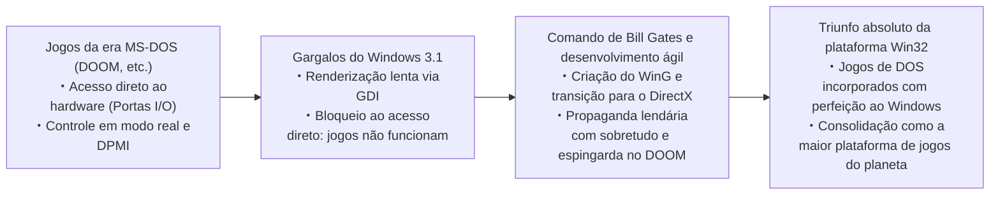

Gates incumbiu engenheiros talentosos de desenvolver às pressas bibliotecas gráficas capazes de intermediar com alto desempenho os acessos selvagens ao hardware dentro do ambiente protegido do Windows: assim nasceram a biblioteca intermediária «WinG» e, em seguida, o «DirectX» (cujo codinome de projeto era *Manhattan Project*).

O próprio Bill Gates gravou um vídeo promocional inesquecível em que aparecia com um sobretudo preto, segurando uma espingarda dentro do cenário virtual de DOOM, demonstrando ao mercado que o Windows 95 seria a plataforma gamer definitiva. A competência em acomodar o acesso violento ao hardware debaixo do modelo de proteção de memória do Windows estabeleceu os alicerces da soberania gráfica e multimídia que a plataforma desfruta até hoje.

---

## Capítulo 4: O colosso moderno do Windows: «AppCompat (Application Compatibility)»

No Windows 95 e 98, os desvios de compatibilidade eram inseridos como rotinas pontuais espalhadas de forma quase artesanal pelo código do sistema. Entretanto, com a proliferação vertiginosa de softwares comerciais na transição para o Windows 2000 e XP, esse arranjo tornou-se insustentável. O código central corria o risco de virar um emaranhado ingovernável de condicionais dedicadas a salvar aplicativos individuais.

Diante disso, os arquitetos de software da Microsoft criaram o mecanismo que opera até os dias de hoje no Windows 11: **o subsistema formal de compatibilidade de aplicativos, conhecido como «AppCompat»**.

### 4.1 Arquitetura global do subsistema AppCompat

O subsistema AppCompat é, em síntese, **um sistema inteligente de interceptação que, no exato milissegundo em que um executável é carregado na memória, analisa suas credenciais e injeta dinamicamente entre a aplicação e o kernel uma camada transparente de simulação e engano denominada «Shim»**.

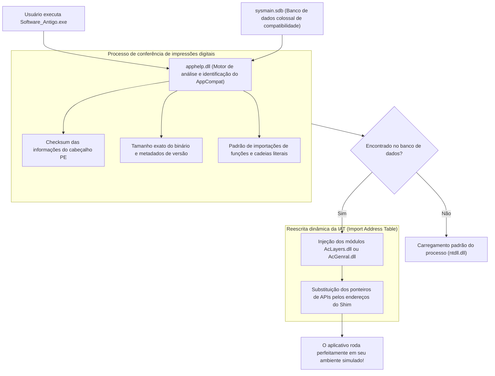

Quando um executável (`.exe`) é acionado pelo usuário, a rotina de criação de processos do Windows (controlada pela `ntdll.dll`) interrompe o fluxo normal e invoca a biblioteca de compatibilidade **`apphelp.dll`**.

A `apphelp.dll` pesquisa a gigantesca base de dados de compatibilidade **`sysmain.sdb`** para verificar se o binário possui um prontuário cadastrado. Em caso positivo, o carregador do sistema operacional força a injeção dos módulos de Shim — primordialmente **`AcLayers.dll`** e **`AcGenral.dll`** — no espaço de endereçamento do processo antes que as DLLs oficiais do sistema (`kernel32.dll`, `user32.dll`, etc.) concluam suas ligações.

### 4.2 O motor de Shims: Mecanismo de substituição de APIs via IAT Hooking

Como esse motor consegue enganar o aplicativo sem alterar um único byte do arquivo original no disco? O método principal utilizado é o **IAT Hooking (interceptação da Tabela de Endereços de Importação)** nas estruturas PE (Portable Executable) do executável.

Quando um aplicativo para Windows chama uma função externa (como `GetVersionEx` ou `GetDiskFreeSpace`), as instruções de máquina geradas pelo compilador não contêm endereços fixos de memória. Em vez disso, durante o carregamento, o sistema operacional preenche uma tabela de ponteiros de funções situada no próprio cabeçalho do executável em memória: a IAT (Import Address Table). O aplicativo sempre faz suas chamadas a APIs de forma indireta, consultando os ponteiros dessa tabela.

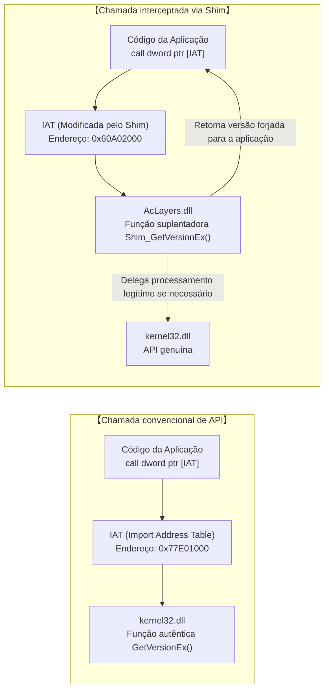

O motor de Shims manipula essa arquitetura com maestria. Imediatamente após ser injetado no processo, ele varre a IAT, altera temporariamente os privilégios da região de memória para gravação (`PAGE_READWRITE`) por meio de `VirtualProtect`, e **substitui os ponteiros para as APIs genuínas do Windows pelos endereços das funções simuladoras contidas nas bibliotecas de Shim**.

O código conceitual em C/C++ abaixo demonstra esse princípio de funcionamento:

```c
// Prova de conceito simplificada de injeção de Shim via IAT Hooking
#include <windows.h>
#include <imagehlp.h>

// Função simuladora de GetVersionEx (o Shim propriamente dito)
BOOL WINAPI Shim_GetVersionExA(LPOSVERSIONINFOA lpVersionInformation)
{
    // Localizar a função autêntica na kernel32.dll para obter dados base
    typedef BOOL (WINAPI *PFN_GETVER)(LPOSVERSIONINFOA);
    HMODULE hKernel = GetModuleHandleA("kernel32.dll");
    PFN_GETVER pfnRealGetVer = (PFN_GETVER)GetProcAddress(hKernel, "GetVersionExA");
    
    BOOL bResult = pfnRealGetVer(lpVersionInformation);
    
    // 【AÇÃO DE ENGANO】
    // Mentir deliberadamente, informando que o sistema operacional é o Windows 95 (Major: 4, Minor: 0)
    lpVersionInformation->dwMajorVersion = 4;
    lpVersionInformation->dwMinorVersion = 0;
    lpVersionInformation->dwBuildNumber = 950;
    lpVersionInformation->dwPlatformId = VER_PLATFORM_WIN32_WINDOWS;
    strcpy(lpVersionInformation->szCSDVersion, "");

    return TRUE; // O aplicativo acredita plenamente que está no Windows 95 e funciona normalmente
}

// Rotina que varre o cabeçalho PE e substitui o endereço na IAT
void InstallShimHook(HMODULE hAppModule, LPCSTR targetDll, LPCSTR targetFunc, PVOID newFuncAddress)
{
    ULONG size;
    // Localizar o diretório de importações na estrutura PE
    PIMAGE_IMPORT_DESCRIPTOR pImportDesc = (PIMAGE_IMPORT_DESCRIPTOR)
        ImageDirectoryEntryToData(hAppModule, TRUE, IMAGE_DIRECTORY_ENTRY_IMPORT, &size);

    while (pImportDesc->Name) {
        LPCSTR dllName = (LPCSTR)((PBYTE)hAppModule + pImportDesc->Name);
        if (_stricmp(dllName, targetDll) == 0) {
            // Localizar a tabela de ponteiros correspondente à DLL desejada
            PIMAGE_THUNK_DATA pThunk = (PIMAGE_THUNK_DATA)((PBYTE)hAppModule + pImportDesc->FirstThunk);
            while (pThunk->u1.Function) {
                PROC* ppfn = (PROC*)&pThunk->u1.Function;
                // Ao encontrar a função visada, sobrescrever o endereço em memória
                DWORD oldProtect;
                VirtualProtect(ppfn, sizeof(PROC), PAGE_READWRITE, &oldProtect);
                *ppfn = (PROC)newFuncAddress; // Substituição pelo ponteiro da função Shim!
                VirtualProtect(ppfn, sizeof(PROC), oldProtect, &oldProtect);
                break;
            }
        }
        pImportDesc++;
    }
}
```

Por meio dessa abordagem cirúrgica em memória, o arquivo binário gravado no disco não sofre a mínima alteração, o núcleo do sistema permanece blindado contra exceções casuais e o aplicativo legado é acolhido em uma redoma virtual onde todas as suas suposições do passado são perfeitamente atendidas.

### 4.3 O misterioso e gigantesco binário `sysmain.sdb` (Shim Database)

O núcleo do subsistema AppCompat é o arquivo de banco de dados **`sysmain.sdb`**, localizado na pasta de sistema `C:\Windows\AppPatch\`.

Codificado em um formato binário proprietário da Microsoft (formato SDB), esse arquivo guarda **centenas de milhares de fórmulas de compatibilidade para os softwares comerciais, utilitários, pacotes de produtividade e jogos mais populares desenvolvidos nas últimas décadas**.

Para evitar a aplicação acidental de Shims a programas modernos que compartilhem nomes comuns (como `setup.exe` ou `install.exe`), o mecanismo da `apphelp.dll` faz uma varredura rigorosa através de múltiplas «impressões digitais»:

1. **Nome do arquivo e caminho completo de instalação**
2. **Tamanho exato do arquivo binário em bytes**
3. **Marca temporal do ligador no cabeçalho PE (Linker Timestamp)**
4. **Soma de verificação do binário (PE CheckSum)**
5. **Recursos de versão (CompanyName, ProductName, FileVersion, LegalCopyright, etc.)**
6. **Assinaturas hash de seções internas e estrutura da tabela de exportações**

Se um usuário insere em seu computador com Windows 11 o CD-ROM de uma enciclopédia interativa lançada em 2001, a `apphelp.dll` lê sua assinatura em frações de segundo, encontra seu perfil em `sysmain.sdb` e conclui:  
*«Este software foi desenvolvido para o Windows 2000; requer alinhamento permissivo de heap e tenta gravar diretamente em áreas restritas do registro»*.  
Instantaneamente, o Windows ativa sem qualquer aviso um conjunto sob medida de dezenas de Shims, viabilizando a execução perfeita da enciclopédia como se estivéssemos em 2001.


---

## Capítulo 5: Catálogo de Shims representativos (A arte de enganar para salvar)

O inventário de Shims implementados nas profundezas do Windows alcança centenas de mecanismos especializados. Eles compõem um catálogo impressionante de truques de engenharia, projetados sistematicamente para remediar cada modalidade de falha cometida por desenvolvedores ao longo das últimas décadas.

### 5.1 `VersionLie`: «Você está exatamente no Windows 95 que desejava», afirma o sistema operacional

Um dos Shims mais antigos e recorrentes é o **`VersionLie`** (suplantação de versão).

Historicamente, durante a inicialização de um programa, os desenvolvedores costumavam consultar a versão do ambiente executando as APIs `GetVersion` ou `GetVersionEx` para certificar-se de que o sistema atendia aos requisitos básicos. Todavia, incontáveis códigos foram escritos com uma ingenuidade autodestrutiva:

```c
// Exemplo arquetípico de verificação catastrófica de versão
OSVERSIONINFO vi;
GetVersionEx(&vi);

// O código assume cegamente que só deve rodar no Windows 95
if (vi.dwMajorVersion == 4 && vi.dwMinorVersion == 0) {
    // Inicialização normal
} else {
    MessageBox(NULL, "Este software foi projetado exclusivamente para o Windows 95. Não é possível executá-lo em versões posteriores.", "Erro", MB_OK);
    ExitProcess(1); // ¡O próprio aplicativo opta pelo suicídio!
}
```

Ao ser executado em versões sucessoras como o Windows XP (Major: 5), Windows 7 (Major: 6) ou Windows 10/11 (Major: 10), o programa identificava que `dwMajorVersion` não era 4 e simplesmente abortava a execução, recusando-se a abrir mesmo quando o ambiente subjacente oferecia suporte técnico pleno.

Para neutralizar essa autodestruição, aplica-se o `VersionLie`. Quando o processo interceptado invoca `GetVersionEx`, o kernel do Windows 11 devolve calmamente uma estrutura adulterada: **«Você está rodando no Windows 95 (Major: 4, Minor: 0, Build: 950)»**. O software aceita a resposta com total tranquilidade e prossegue em sua execução sobre processadores multinúcleo de última geração e discos SSD NVMe ultrarrápidos.

### 5.2 `EmulateGetDiskFreeSpace`: Salvando aplicativos que transbordam com discos rígidos acima de 2 GB

Em meados da década de 1990, os discos rígidos de consumo padrão variavam entre poucas centenas de megabytes e aproximadamente 1 gigabyte. A API clássica de Win32 para consulta de espaço em disco, `GetDiskFreeSpace`, retornava dados como setores por cluster, bytes por setor e clusters livres através de inteiros com sinal de 32 bits (`signed 32-bit integer`).

Os desenvolvedores calculavam o espaço total livre em bytes por meio da multiplicação:

$$\text{FreeBytes} = \text{SectorsPerCluster} \times \text{BytesPerSector} \times \text{NumberOfFreeClusters}$$

Contudo, no momento em que a capacidade disponível de armazenamento ultrapassou os **2 gigabytes ($2^{31} - 1$ bytes)**, o cálculo matemático em inteiros com sinal sofreu um **estouro de capacidade (integer overflow)**, revertendo o resultado em **um número negativo (por exemplo, -500 megabytes)**.

Consequentemente, ao tentar instalar um jogo clássico ou uma edição antiga do Microsoft Office em um computador moderno com armazenamento espaçoso, o instalador interrompia bruscamente a rotina, alertando: *«Espaço em disco insuficiente: você possui apenas -500 MB livres»*.

O remédio arquitetado pela Microsoft foi o Shim **`EmulateGetDiskFreeSpace`**. Quando o programa catalogado faz a consulta, o Shim intercepta a chamada e, independentemente de haver múltiplos terabytes disponíveis no drive, informa formalmente: **«O espaço disponível em disco é de exatamente 2.147.151.872 bytes (cerca de 1,99 GB)»** — o teto matemático máximo que não causa estouro de 32 bits com sinal. A aplicação conclui que o espaço é abundante e finaliza a instalação com pleno êxito.

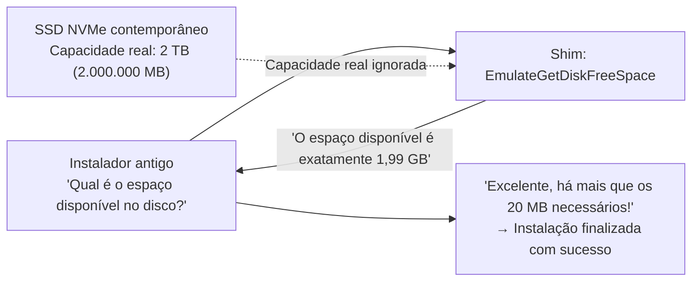

### 5.3 `VirtualRegistry` e `VirtualStore`: Redirecionamento forçado pela introdução do UAC

O lançamento do Windows Vista em 2006 promoveu uma das maiores revoluções na postura de segurança do sistema: o advento do **Controle de Conta de Usuário (User Account Control: UAC)**.

Nas versões anteriores como Windows 95, 98 e XP, os usuários operavam quase invariavelmente como Administradores locais. As aplicações corporativas e jogos costumavam gravar arquivos de configuração, dados de progresso e registros temporários diretamente na pasta `C:\Program Files` e na raiz do registro `HKEY_LOCAL_MACHINE\Software`.

Com o UAC, as permissões de escrita de usuários padrão nessas áreas críticas do sistema foram sumariamente bloqueadas (`ACCESS_DENIED`). Se essa regra de segurança tivesse sido aplicada de forma rígida, milhões de softwares legados em empresas ao redor do mundo teriam entrado em colapso imediatamente.

A resposta foi o mecanismo de virtualização transparente **`VirtualStore`**.

Quando um software antigo tenta gravar dados em `C:\Program Files\App\config.ini` sem privilégios administrativos, o subsistema de E/S do Windows não acusa erro de acesso; em vez disso, intercepta a escrita e a redireciona de maneira imperceptível para uma pasta segura isolada por usuário: `C:\Users\<Usuário>\AppData\Local\VirtualStore\Program Files\App\config.ini`. De modo equivalente, gravações direcionadas a `HKLM\Software` são transferidas para `HKCU\Software\Classes\VirtualStore`.

Em leituras subsequentes, o sistema atende o aplicativo fornecendo os dados presentes no VirtualStore. O software permanece convicto de que está modificando a pasta nobre de Program Files, operando de forma perfeitamente funcional dentro de uma caixa de areia segura e higienizada.

### 5.4 `DXPrimaryBltPunt`: Corrupção de paletas de 256 cores e taxas de quadros no DirectDraw clássico

Jogos desenvolvidos entre meados dos anos 90 e a era de ouro do Windows XP (como *Age of Empires* e incontáveis RPGs clássicos) dependiam intensamente do componente «DirectDraw» do DirectX. Projetados para renderização gráfica em 256 cores indexadas (paleta de 8 bits), esses títulos manipulavam efeitos visuais e transições alterando os registros de cor diretamente na superfície primária da memória de vídeo (VRAM).

Entretanto, as placas de vídeo contemporâneas e o compositor de janelas do Windows (Desktop Window Manager: DWM) operam nativamente em TrueColor de 32 bits sobre pipelines tridimensionais acelerados. O suporte de hardware para alteração direta de paletas de 8 bits na tela principal deixou de existir há décadas.

Se um jogo dessa geração for executado sem mediação em um hardware recente, a dessincronização da paleta transforma a interface em um mosaico caótico de cores berrantes e psicodélicas, ou a falta de sincronização vertical faz o motor rodar a milhares de quadros por segundo, impossibilitando qualquer jogabilidade.

Shims gráficos como **`DXPrimaryBltPunt`** e **`ForceDirectDrawEmulation`** contornam essa barreira capturando os comandos arcaicos do DirectDraw, traduzindo-os em tempo real para texturas poligonais modernas do Direct3D e injetando-os harmoniosamente na esteira de composição do DWM. O fato de jogos em pixel art de 30 anos atrás exibirem suas cores fiéis em monitores 4K atuais deve-se integralmente a essa brilhante engenharia de disfarce gráfico.

---

## Capítulo 6: A grande travessia rumo aos 64 bits e ARM — WOW64 e o primor da emulação

Quando a transformação tecnológica ultrapassa as camadas de software e atinge a arquitetura física do conjunto de instruções do processador, a manutenção da retrocompatibilidade exige mais do que intercepções funcionais na memória. Diante desses abismos geracionais, o Windows adotou uma estratégia monumental: **hospedar um sistema operacional completo dentro de outro**.

### 6.1 De NTVDM a WOW64: O desdobramento em universo paralelo do sistema de arquivos e do registro

Na transição de 16 para 32 bits, o Windows NT implementou a **NTVDM (NT Virtual DOS Machine)**, valendo-se do modo virtual 8086 dos processadores Intel para executar programas DOS e Win16 de forma segura.

Em meados dos anos 2000, com a introdução da arquitetura AMD64 (x64), deu-se o salto épico para os 64 bits. Para garantir a sobrevida de milhões de programas existentes de 32 bits, a Microsoft concebeu o subsistema **«WOW64 (Windows 32-bit On Windows 64-bit)»**.

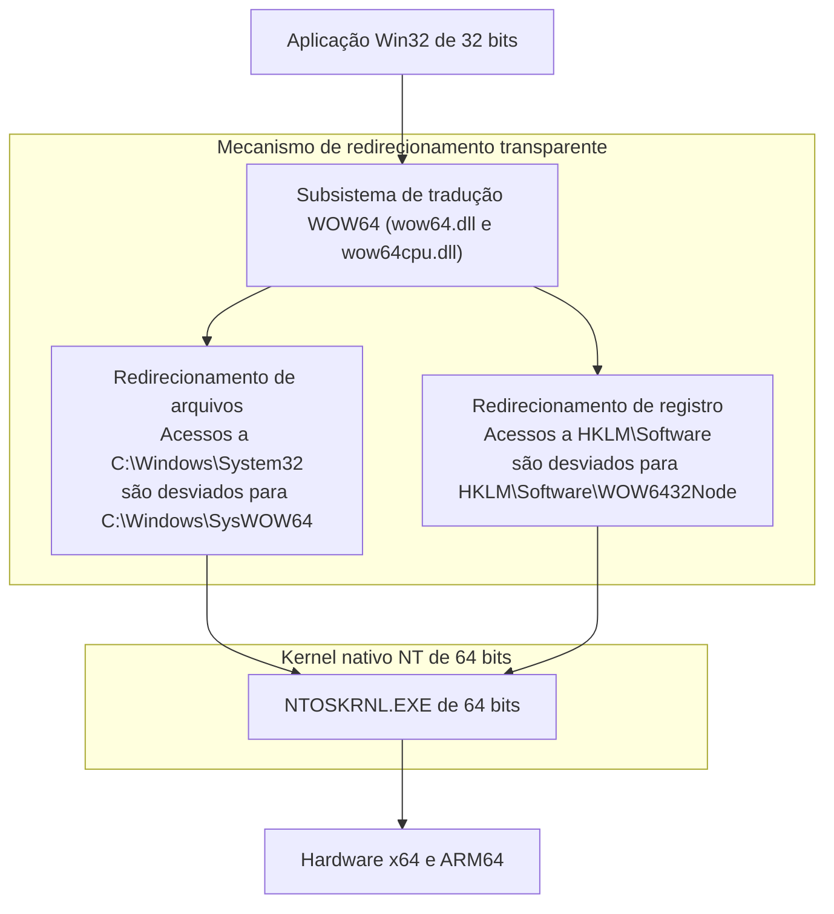

O feito mais impressionante do WOW64 é materializar para as aplicações legadas de 32 bits uma **perfeita ilusão de universo paralelo**:

- **Redirecionador do sistema de arquivos**:  
  No Windows de 64 bits, as DLLs genuínas de 64 bits ficam curiosamente alojadas em `C:\Windows\System32`. Quando um processo de 32 bits tenta ler esse diretório, o WOW64 desvia a solicitação silenciosamente para `C:\Windows\SysWOW64` (pasta que, ao contrário do que o nome sugere, abriga as bibliotecas de 32 bits).
- **Redirecionamento do registro do Windows**:  
  Similarmente, quando o aplicativo tenta gravar em `HKEY_LOCAL_MACHINE\Software`, o WOW64 desvia a chamada para a ramificação `HKEY_LOCAL_MACHINE\Software\WOW6432Node`.

Dessa forma, uma aplicação concebida em 1998 continua lendo e gravando nas pastas usuais do sistema operacional sem suspeitar que está operando sobre uma plataforma de 64 bits.

### 6.2 A transição para ARM64 e o motor de emulação Prism

O desafio contemporâneo mais relevante reside na migração do ecossistema tradicional x86/x64 para a arquitetura **ARM64** (como nos chips Qualcomm Snapdragon X Elite).

Em 2012, a Microsoft lançou o «Windows RT», tentando adotar uma ruptura radical semelhante à da Apple: vetar a execução de aplicativos Win32 tradicionais em processadores ARM. A resposta do público corporativo e dos consumidores foi de completa rejeição, culminando em prejuízos contábeis de cerca de um bilhão de dólares. Esse fracasso categórico consolidou na mentalidade da empresa uma premissa irrefutável: **um Windows incapaz de executar o catálogo histórico do ecossistema Win32 não é reconhecido como Windows pelo mercado**.

Com o moderno Windows 11 on ARM, a Microsoft introduziu seu sofisticado motor de tradução binária denominado **«Prism»**. O Prism analisa o código de máquina x86/x64 em tempo real, compilando-o via JIT (Just-In-Time) para conjuntos de instruções ARM64 nativos. Ao mesmo tempo, preserva blocos de código já convertidos em caches de alto desempenho, permitindo que softwares de décadas atrás rodem com velocidade comparável ao código nativo.

Mesmo quando a física do silício muda radicalmente, o compromisso inegociável do sistema é mantido: o usuário clica duas vezes no arquivo executável e ele entra em funcionamento imediatamente.

---

## Capítulo 7: Três universos, três filosofias de arquitetura — Windows vs Apple (macOS) vs Linux

Ao responder à pergunta sobre como tratar o software legado, os três principais ecossistemas operacionais da atualidade adotaram doutrinas inconciliáveis. O exame dessas diferentes posturas ressalta a singularidade quase obsessiva do Windows.

### 7.1 Apple (Ruptura cirúrgica): Destruir o passado para avançar no futuro

Da liderança visionária de Steve Jobs à atual gestão de Tim Cook, a filosofia da Apple sempre foi a da **«terra arrasada cirúrgica»**: sacrificar implacavelmente o passado em prol de otimizar a experiência futura.

A trajetória da Apple é caracterizada por rupturas arquiteturais marcantes:
- **Abandono do Classic Mac OS**: A substituição drástica do Mac OS 9 pelo Mac OS X (baseado em NeXT e Unix). A biblioteca transitória de compatibilidade («Carbon») foi oferecida temporariamente e extinta logo em seguida.
- **Mudanças sucessivas de hardware**: Do Motorola 680x0 para PowerPC, de PowerPC para Intel x86, e de Intel para o Apple Silicon (série M). Em cada transição a Apple forneceu emuladores de excelência (emulador 68K, Rosetta original e Rosetta 2), mas os removeu formalmente do sistema poucos anos depois, liquidando a execução dos binários da fase anterior.
- **Morte aos 32 bits no macOS Catalina (2019)**: A Apple encerrou definitivamente o suporte a binários de 32 bits. Softwares científicos legados, plugins de áudio musical e inúmeros jogos deixaram de funcionar instantaneamente.

A exigência da Apple para a sua comunidade de desenvolvedores é direta: *«Adotem a versão mais recente do Xcode, refatorem o código no Swift contemporâneo e recompilem para a versão mais recente do macOS. Aplicações que não acompanharem o ritmo devem sair do ecossistema»*. Essa postura propicia um sistema operacional extremamente enxuto e moderno, às custas de exigir dos clientes e desenvolvedores um esforço contínuo de reescrita.

### 7.2 Linux (O mandamento de Linus): «Never break userspace!» — Luzes e sombras

No mundo do software livre, Linus Torvalds estabeleceu para o desenvolvimento do kernel Linux uma regra de ouro muito próxima da filosofia de ferro da Microsoft: **«Never break userspace!» (Nunca quebre o espaço de usuário!)**.

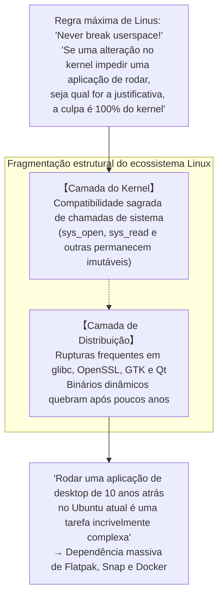

Se um patch do kernel Linux, por mais elegante e bem construído que seja, provocar uma regressão que impeça o funcionamento de qualquer programa existente no espaço de usuário, Linus Torvalds exige a sua revogação imediata no repositório. Sob esse ponto de vista, o kernel Linux é tão inflexível quanto o Windows.

Entretanto, o desktop Linux carece de uma autoridade unificada para coordenar as camadas superiores. Embora as chamadas de sistema (syscalls) sejam perenes, as bibliotecas compartilhadas das distribuições (`glibc`, `libssl`, frameworks de interface gráfica como GTK ou Qt) alteram frequentemente suas compatibilidades binárias. Como resultado prático, **executar um binário compilado dinamicamente há dez anos em uma distribuição Linux atual é uma tarefa extremamente árdua**. O Linux manteve a compatibilidade a nível de kernel, mas a fragmentação do seu ecossistema o impediu de atingir a retrocompatibilidade integral desfrutada pelo Windows.

### 7.3 Windows (Inclusão cumulativa): A estratificação monumental

Em oposição à política de demolição da Apple e à fragmentação do Linux, o Windows trilhou o caminho da **«Inclusão cumulativa»**.

O sistema nunca descarta os alicerces construídos: ele empilha indefinidamente novas camadas como estratos de rocha geológica. Sobre o Win16 construiu-se o Win32; sobre o Win32 ergueu-se o .NET Framework; sobre este adicionou-se o WinRT e o UWP, e quando o UWP não vingou, a Microsoft voltou a erguer o Windows App SDK (WinUI 3) diretamente sobre a base inabalável do Win32.

Essa acumulação secular fez do Windows um dos códigos mais complexos e monumentais já concebidos. Em contrapartida, legou à humanidade um ecossistema sem equivalente na história: **um ambiente operacional onde programas criados há 35 anos convivem em perfeita harmonia com ferramentas contemporâneas dotadas de inteligência artificial**.

| Critério de Comparação | Microsoft (Windows) | Apple (macOS) | Linux (Desktop) |
| :--- | :--- | :--- | :--- |
| **Filosofia Fundamental** | **Inclusão cumulativa**<br/>Preservar e carregar todo o passado | **Ruptura cirúrgica**<br/>Demolição periódica do legado | **Blindagem do kernel e liberdade acima**<br/>Kernel imutável, camadas superiores fluidas |
| **Diretiva Suprema** | "Don't break old apps" | "Embrace the modern platform" | "Never break userspace" (Apenas no kernel) |
| **Janela de Compatibilidade** | **Mais de 30 a 40 anos** (Win32 e DOS) | **3 a 5 anos** (Fim após ciclo de migração) | Kernel perene, apps gráficos efêmeros |
| **Situação de Binários de 32 bits** | **Pleno suporte no Windows 11** (WOW64) | **Extinção completa** no Catalina (2019) | Suporte parcial via pacotes multilib |
| **Exigência aos Desenvolvedores** | Praticamente nula: o app continua rodando | Alta: reescrita periódica obrigatória | Empacotamento recorrente por distribuição |
| **Pureza da Arquitetura** | Centenas de milhões de linhas em estratos | Excepcionalmente limpa e coesa | Modular no núcleo, fragmentada na interface |


---

## Capítulo 8: Economia de plataformas — Por que a retrocompatibilidade é o «fosso inexpugnável (Moat)» definitivo

Por qual razão Bill Gates e as sucessivas gerações de líderes executivos da Microsoft impuseram essa disciplina exaustiva aos seus times de engenharia? A motivação definitiva não reside em preferências estéticas de design de código, mas sim na fria **economia das plataformas de software e na dinâmica de mercado**.

### 8.1 O modelo de negócios de Bill Gates: O valor de um SO é a «soma de todos os softwares executáveis»

Desde os primeiros passos da Microsoft, Bill Gates compreendeu com clareza cristalina a essência do negócio de plataformas:

> **Teorema do valor de uma plataforma**:  
> O valor intrínseco de um sistema operacional não é determinado pelas funcionalidades isoladas que ele oferece.  
> Ele é definido pela **«soma de todos os softwares desenvolvidos no mundo que são capazes de ser executados sobre ele»**.

Pouco importa quão veloz, conceitualmente puro ou elegante seja um novo sistema operacional: se ele for incapaz de executar os softwares utilitários com os quais os usuários trabalham no dia a dia, seu valor de mercado é nulo. Os clientes não compram a embalagem de um sistema operacional; compram as aplicações que rodam sobre ele e a produtividade real que elas proporcionam.

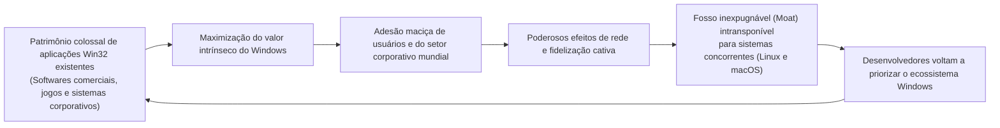

Ao consagrar uma retrocompatibilidade de 100%, todas as centenas de milhões de linhas de código produzidas ao longo de trinta anos por programadores de todo o mundo **são automaticamente absorvidas como valor agregado direto da próxima versão do Windows**.

Por mais contundentes que fossem os argumentos técnicos apresentados por defensores do macOS ou do Linux ao disputar o mercado empresarial, qualquer tentativa de migração era fulminada por uma objeção prática irrespondível: *«O sistema de gestão que nossa empresa desenvolveu há vinte anos não roda na sua plataforma»*. A retrocompatibilidade tornou-se o fosso estratégico mais profundo e intransponível já construído na indústria da tecnologia.

### 8.2 O aprisionamento absoluto do mercado corporativo (Enterprise Lock-in)

No segmento das grandes corporações, serviços essenciais e órgãos públicos, essa lógica desfrutou de um poder incomparável.

Instituições bancárias, redes hospitalares, companhias aéreas e complexos industriais operam inúmeros sistemas de missão crítica desenvolvidos há décadas mediante investimentos vultosos, em linguagens como Visual Basic 6 ou componentes C++ ActiveX. Em incontáveis casos, as empresas fornecedoras originais faliram, os programadores se aposentaram e a documentação técnica foi perdida: são sistemas em produção contínua que ninguém ousa tocar.

Se uma nova edição do Windows rompesse a compatibilidade e impusesse a essas corporações o custo proibitivo de reconstruir suas aplicações essenciais em tecnologias modernas, os diretores de tecnologia (CIOs) teriam congelado imediatamente as atualizações ou considerado migrar para alternativas livres.

Entretanto, o Windows apresentou-se munido da varinha de condão do AppCompat: *«Não precisam refazer absolutamente nada; adquiram novos computadores e seus sistemas legados continuarão operando com total fidelidade»*. Para os gestores corporativos, essa garantia representava a decisão mais sensata, previsível e lucrativa. Como resultado, o mercado empresarial mundial permaneceu solidamente ancorado ao Windows.

### 8.3 A «armadilha do sucesso»: O freio à inovação disruptiva

No entanto, essa vitória esmagadora ocultava um efeito colateral paradoxal: com o passar do tempo, transformou-se na **«armadilha do sucesso (Success Trap)»**, tolhendo a capacidade da própria Microsoft de empreender transformações arquiteturais radicais.

No início da década de 2010, em meio à ascensão meteórica dos ecossistemas móveis representados pelo iOS e Android, a Microsoft tentou modernizar o Windows introduzindo a Plataforma Universal do Windows (UWP). A proposta da UWP era estabelecer um ambiente estritamente isolado em caixas de areia (sandboxed), seguro e eficiente, com a intenção implícita de aposentar progressivamente o modelo clássico do Win32.

No entanto, desenvolvedores e empresas ignoraram a UWP quase por completo: *«Por qual razão deveríamos assumir o custo gigantesco de reescrever nossas ferramentas em um modelo restrito, se os nossos aplicativos Win32 clássicos continuam rodando com total desenvoltura e liberdade no Windows 10 e no Windows 11?»*.

A estabilidade formidável do Win32 tornou-se tão entranhada no mercado que **nem mesmo a própria Microsoft conseguiu desbancá-lo**. A empresa foi obrigada a recuar: liberou a Microsoft Store para hospedar aplicativos Win32 tradicionais em contêineres e reconstruiu suas ferramentas contemporâneas de interface, como o WinUI 3 (Windows App SDK), sobre o alicerce perpétuo do Win32. A maior muralha defensiva erguida pela companhia converteu-se na barreira mais resistente contra as suas próprias pretensões de reinvenção.

---

## Capítulo 9: O preço da glória — Dívida técnica monumental e os labirintos da segurança

Carregar o fardo das imperfeições alheias e proteger irrestritamente o passado nunca foi um privilégio isento de custos. Em contrapartida a esse sucesso, os engenheiros do Windows foram condenados a combater a mais formidável dívida técnica já acumulada em um projeto de engenharia de software na história.

### 9.1 Centenas de milhões de linhas de código e uma matriz astronômica de testes

Estima-se que a base total de código-fonte do Windows alcance atualmente **centenas de milhões de linhas**. Contudo, o aspecto mais assombroso para a equipe de desenvolvimento reside na matriz combinatória astronômica de validações que deve ser executada a cada nova compilação do sistema.

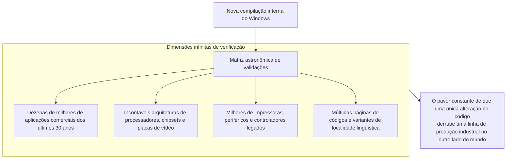

Um ajuste aparentemente irrelevante em uma rotina basal do kernel — como uma verificação preventiva adicional em um ponteiro ou uma ligeira modificação na ordem de travamento de threads — pode paralisar um software industrial de 30 anos atrás que controla maquinário pesado no outro hemisfério. Para mitigar esse perigo constante, a Microsoft mantém centros de testes gigantescos, compostos por dezenas de milhares de máquinas reais e servidores de virtualização, onde rotinas automatizadas inicializam ininterruptamente softwares de todas as épocas para checar se suas janelas principais são renderizadas sem falhas.

### 9.2 Brechas de segurança provocadas por APIs legadas

O custo mais crítico dessa herança histórica reside no domínio da **segurança da informação**.

Inúmeras APIs primitivas do Win32 foram concebidas em uma época pré-internet, na qual a prioridade recaía sobre a velocidade e inexistiam conceitos estritos sobre contenção de estouro de memória (buffer overflow) ou controle granular de privilégios. Entretanto, o compromisso irrevogável com a compatibilidade proíbe sumariamente a sua exclusão do sistema.

Agentes maliciosos e pesquisadores de vulnerabilidades voltam seus esforços justamente para esses pontos cegos: interfaces arcaicas e as costuras operacionais entre as camadas de Shims constituem rotas privilegiadas para burlar defesas modernas, obter escalonamento de privilégios e escapar de caixas de areia. A prodigiosa hospitalidade do Windows com o código do passado traduz-se inevitavelmente em uma superfície de ataque (attack surface) significativamente ampliada.

### 9.3 O colapso do projeto Longhorn e a refatoração para «MinWin»

A tensão decorrente do acúmulo contínuo de novas funcionalidades sobre camadas históricas atingiu um ponto de ruptura dramático em meados dos anos 2000, durante o fatídico **projeto «Longhorn»**.

Idealizado como a evolução definitiva do Windows XP, o Longhorn sucumbiu ao emaranhado caótico de dependências mútuas entre inovações ambiciosas e subsistemas legados. O código-fonte tornou-se um labirinto incontrolável: compilações quebravam diariamente, a velocidade de desenvolvimento despencou para zero e o projeto entrou em colapso institucional.

Em 2004, a diretoria da Microsoft tomou a corajosa decisão de executar o chamado «Reinicio do Longhorn» (*Longhorn Reset*): descartou anos de desenvolvimento caótico e reiniciou o projeto a partir da base sólida e enxuta do Windows Server 2003 SP1 (trabalho que viria a originar o Windows Vista).

A partir desse episódio traumático, a equipe do Windows empreendeu uma profunda reestruturação arquitetural, isolando o núcleo essencial do sistema em uma camada elementar e independente batizada de **«MinWin»**. Graças a esse desacoplamento rigoroso entre as funções vitais do kernel e as camadas superiores de compatibilidade, o Windows pôde preservar sua integridade funcional e prosseguir em sua marcha sem sucumbir ao seu próprio gigantismo.

---

## Conclusão: Elogio aos engenheiros pragmáticos — A sociedade contemporânea erguida sobre o milagre do «que funciona»

Os terminais de prontuário eletrônico em hospitais, os caixas eletrônicos da rede bancária mundial, os sistemas de despacho ferroviário, as linhas robotizadas de produção industrial e os computadores que processam as operações financeiras globais compartilham um alicerce invisível: em suas profundezas, o Windows continua operando incansavelmente.

Se a Microsoft tivesse adotado a postura dogmática dos compêndios teóricos de ciência da computação e, à semelhança da Apple, optasse por incinerar seu legado a cada poucos anos, qual teria sido o destino do ecossistema tecnológico global?

Complexos fabris inteiros teriam parado, incontáveis empresas teriam ido à falência devido aos custos astronômicos de reescrever repetidamente seus softwares operacionais, e serviços vitais da sociedade teriam entrado em desordem. Se a civilização da informação pôde avançar de maneira contínua, sem interrupções paralisantes ao longo das últimas décadas, foi porque o Windows **carregou estoicamente sobre as próprias costas as imperfeições, as falhas de projeto e as negligências de gerações sucessivas de programadores**.

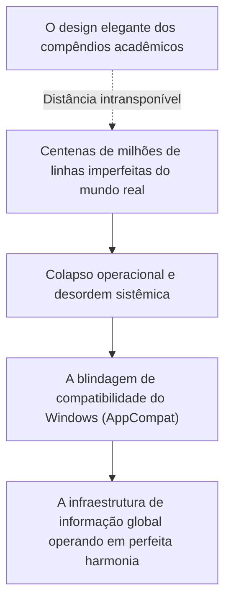

Para Raymond Chen e as gerações de engenheiros anônimos que dedicaram suas carreiras à sustentação do Windows, passar madrugadas inspecionando desensambladores para programar um Shim que contornasse o bug de uma aplicação de terceiros certamente não era uma ocupação glamourosa. Não havia ali teses acadêmicas laureadas nem conferências badaladas do Vale do Silício.

No entanto, essa dedicação discreta e resiliente constitui a expressão suprema da **verdadeira engenharia profissional**.

A autêntica engenharia não consiste em se refugiar em um ambiente estéril para contemplar fórmulas puras que se desfazem ao primeiro contato com a aspereza do mundo real. Ela consiste em descer à lama da realidade, harmonizar as contradições produzidas por mãos humanas imperfeitas e garantir, com obstinação inabalável, que **aquilo que funcionava ontem continue funcionando hoje, amanhã e através das próximas décadas**.

«Nunca quebre aplicativos legados»: foi sobre os alicerces desse mandamento implacável e do empenho silencioso dos engenheiros que o cumpriram que o mundo digital contemporâneo foi edificado — e continua funcionando todos os dias com perfeita naturalidade.
