## Введение: В чем истинная сущность операционной системы? — «Изящный дизайн» или «бескомпромиссный практицизм»?

Если открыть академический университетский учебник по computer science или образцовый трактат по программной инженерии, перед нами предстанут пленительные идеалы: «чистые абстракции», «разделение ответственности», «ортогональное проектирование API». Нас учат, что операционная система (ОС) должна быть безупречным, священным арбитром, чья миссия состоит в сокрытии сложности аппаратного обеспечения и предоставлении приложениям интуитивно понятного, единообразного и концептуально чистого интерфейса.

Однако стоит лишь покинуть башню из слоновой кости академического мира и ступить на беспощадное поле битвы коммерческих настольных ОС, как этот невинный идеал разлетается вдребезги. В истории персональных компьютеров колосс, добившийся самого оглушительного коммерческого триумфа и подчинивший себе миллиарды ПК по всему миру — Windows, — воплотил в себе философию, находящуюся на диаметрально противоположном полюсе от академической эстетики: **радикальный, доходящий до безумия практицизм (прагматизм)**.

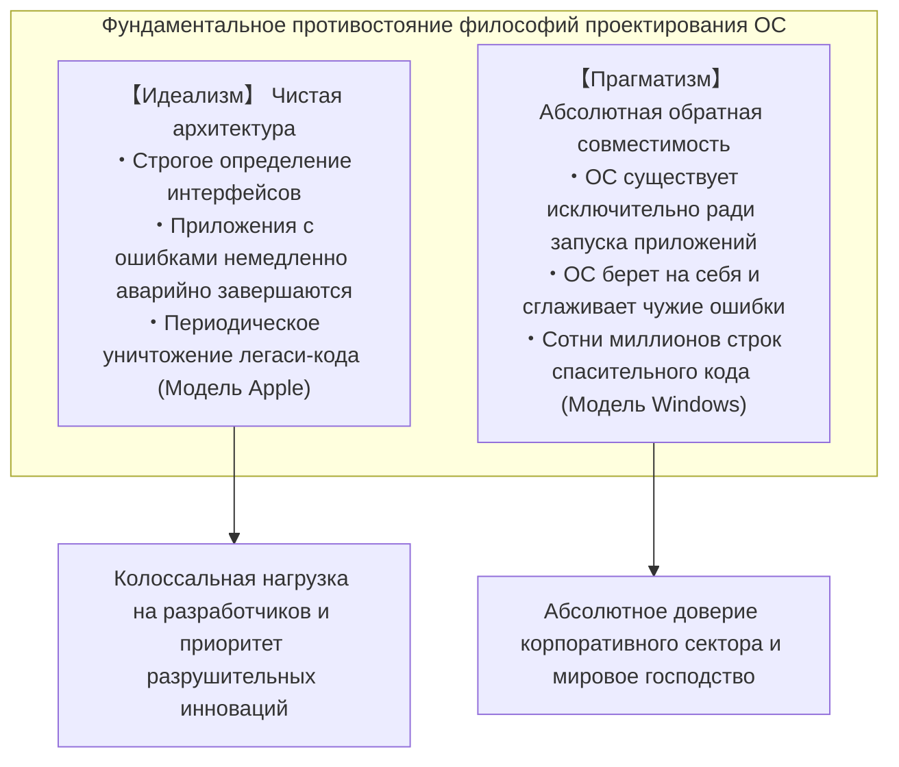

Среди всех существующих операционных систем в мире ни одна не проявляла столь фанатичной и непоколебимой преданности унаследованному багажу прошлого, как Windows. Игры на компакт-дисках, выпущенные в 1995 году; корпоративный бухгалтерский софт, написанный в начале 1990-х годов на Visual Basic 3.0 или C++; утилиты эпохи DOS, работавшие за счет прямого взлома недокументированных системных вызовов... поразительное множество этих программ сегодня, в середине 2020-х годов, совершенно спокойно, без малейших нареканий запускается и безупречно функционирует на ультрасовременной Windows 11.

Обыватели воспринимают это как само собой разумеющееся: «программа просто работает». Но системные программисты, проводившие обратную разработку (reverse engineering) исходных кодов Windows и заглядывавшие в эти бездонные бездны, замирают в благоговейном ужасе. То, что скрыто внутри — это не магия, а **многослойные геологические пласты, накапливавшиеся инженерами Microsoft более 30 лет: сотни тысяч строк исключений, динамическая подмена API и сложнейшие механизмы, посредством которых операционная система намеренно лжет приложениям (так называемые шимы, Shims)**, созданные лишь для того, чтобы спасать баги, нарушения спецификаций, повреждения памяти и неопределенное поведение стороннего программного обеспечения.

Почему Microsoft пошла на столь крайние меры, взвалив на плечи операционной системы бремя чужого некачественного кода и бесконечно обеспечивая его работоспособность?  
Почему она не пошла по пути Apple, решительно и безжалостно отсекающей прошлое?  
И как эта почти безумная инженерия превратила Windows в несокрушимую крепость — в самую доминирующую платформу в истории человечества?

Данная статья представляет собой исчерпывающее фундаментальное техническое исследование, объединяющее свидетельства легендарных разработчиков Microsoft, данные обратной разработки низкоуровневых структур PE-бинарников и ядра NT, а также историю платформенных стратегий, чтобы раскрыть перед вами абсолютный закон Windows: **«Никогда не ломайте старые приложения (Don't break old apps)»**.

---

## Глава 1: «Главная директива» глазами двух легендарных инженеров

Одержимость обратной совместимостью, разделяемая командой разработчиков Windows, вовсе не является домыслом сторонних наблюдателей. О ней открыто и во всех подробностях поведали два легендарных программиста, которые лично писали код на передовой и определяли архитектуру системы.

### 1.1 Рэймонд Чен (Raymond Chen) и блог «The Old New Thing»

В команде разработки Windows корпорации Microsoft есть человек, которого более трех десятилетий почитают как живую легенду. Это **Рэймонд Чен (Raymond Chen)** — главный инженер-программист (Principal Software Engineer), пришедший в Microsoft в 1992 году и с тех пор непрерывно развивающий и поддерживающий оболочку Windows 95, User32 и сокровенные глубины подсистемы Win32.

Блог Чена, начавшийся как внутренние заметки и переросший в официальную колонку на техническом портале Microsoft под названием **«The Old New Thing»** (позже изданный в виде фундаментальной книги, ставшей библией системных программистов), представляет собой потрясающую летопись невероятных инженерных ухищрений, с помощью которых Windows решала практические проблемы совместимости.

Базовая аксиома команды Windows, которую Чен неустанно повторяет, пугающе проста и беспощадна:

> «Операционная система Windows существует лишь для одной цели — запускать программы. Пользователи покупают компьютеры вовсе не для того, чтобы любоваться красотой операционной системы. Они покупают ПК потому, что хотят пользоваться конкретными приложениями, работающими в этой среде.
> 
> И самая жестокая правда заключается в следующем: **когда пользователь обновляет Windows до новой версии и его любимое приложение перестает работать, он никогда не станет винить автора этого приложения. В 100% случаев он заявит: "Windows сломалась!" или "Новая Windows бракованная!", обрушив весь гнев на Microsoft.**»

С точки зрения профессиональной гордости разработчика естественной реакцией было бы возразить: «В коде приложения содержится ошибка, поэтому его сбой закономерен; компания-разработчик обязана выпустить исправление». Однако на коммерческом рынке операционных систем подобная аргументация не имеет никакой силы. Для пользователя реальность исчерпывается одним фактом: программа, которая работала вчера, отказала в тот момент, когда обновилась Windows.

Если бы Microsoft встала в позу пуриста и заявила «это баг создателей софта», пользователи отвергли бы обновления, остались бы на старых версиях ОС или начали бы присматриваться к конкурирующим платформам. В силу непреложных законов бизнеса на команду Windows было возложено колоссальное обязательство:

**«Каким бы абсурдным, нарушающим стандарты и сломанным ни был код стороннего приложения, операционная система обязана распознать это, незаметно компенсировать ошибку внутри себя и заставить программу работать так, словно ничего не произошло.»**

Блог Чена буквально переполнен подробнейшими рассказами о тех трогательных и одновременно безумных хаках, которые ему и его коллегам приходилось писать во имя этого кредо.

### 1.2 Свидетельство Джоэла Спольски (Joel Spolsky): «How Microsoft Lost the API War»

Глубину и значение этой философии до мирового сообщества веб-разработчиков и лидеров IT-индустрии блестяще донес **Джоэл Спольски (Joel Spolsky)**. В начале 1990-х годов он работал программным менеджером в команде Excel в Microsoft, а позже основал всемирно известный портал вопросов и ответов Stack Overflow и систему управления проектами Trello, став одним из ведущих мировых мыслителей в области разработки ПО.

В 2004 году Спольски опубликовал в сети историческое эссе *«How Microsoft Lost the API War»* («Как Microsoft проиграла войну API»). В нем, вспоминая бескомпромиссное руководство Джона ДеВаана (Jon DeVaan), возглавлявшего тогда разработку Windows, он написал:

> "In the Windows team, the prime directive was: **don't break old apps.**"  
> (В команде Windows главной директивой — абсолютным высшим законом — было: **никогда не ломайте старые приложения**.)

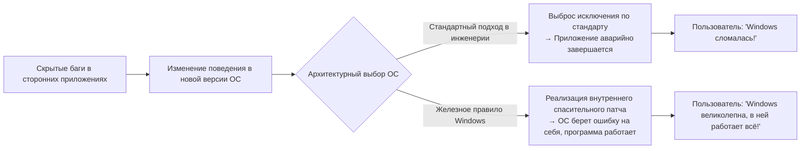

Спольски проводит аналогию с научно-фантастическим сериалом «Звездный путь» (Star Trek), где высшим законом Звездного Флота является «Главная директива» (невмешательство в естественное развитие иных цивилизаций). Для инженеров Windows такой нерушимой Главной директивой было требование никогда не нарушать функционирование существующих программ.

Если разработчик Windows элегантно переписывал код ядра или API, добиваясь двукратного прироста скорости, но из-за этого изменения где-то в мире начинала аварийно падать хотя бы одна безвестная корпоративная программа, этот рефакторинг немедленно отклонялся. В команде Windows эстетическая чистота кода стояла на втором плане; **гарантия того, что существующие бинарники будут работать на 100%, являлась абсолютным и непререкаемым благом**.

### 1.3 «Даже баг становится спецификацией»: Закон Хайрама и необратимость API

В программной инженерии существует фундаментальный эмпирический принцип, сформулированный инженером Google Хайрамом Райтом (Hyrum Wright) и получивший название **«Закон Хайрама» (Hyrum's Law)**:

> **Закон Хайрама**:  
> «При наличии достаточного количества пользователей у API уже не имеет значения, что именно создатель API обещал в формальном контракте (документации). Каждое наблюдаемое поведение системы — включая баги и недокументированные побочные эффекты — неизбежно станет зависимостью для чьего-то чужого кода.»

Windows стала самым грандиозным и суровым полигоном подтверждения Закона Хайрама в истории IT.

Представим ситуацию: в официальной документации к определенному Windows API четко зафиксировано: *«Третий аргумент обязан быть валидным дескриптором окна (HWND). Поведение при передаче невалидного значения не определено»*. Однако невнимательный сторонний программист по ошибке передал туда нулевой указатель (`NULL`) или мусорное значение, и по чистой случайности в конкретной реализации Windows 3.1 это сошло ему с рук — система не сгенерировала видимой ошибки.

Когда это приложение разошлось по рынку тиражом в сотни тысяч копий, команда Windows 95 или Windows NT решила навести порядок: «Давайте сделаем строгую проверку аргументов и будем корректно возвращать код `ERROR_INVALID_WINDOW_HANDLE` при получении некорректного дескриптора». Что произойдет в тот же миг?

В десятках тысяч офисов старая программа вызовет критическую ошибку и рухнет. А разъяренные пользователи оборвут телефоны службы поддержки Microsoft с криками: «Мы обновили Windows, и теперь вся работа встала!».

В итоге инженеры Microsoft были вынуждены отзывать свой «чистый код» и писать решения, подобные следующему:

```c
// Концептуальная реконструкция внутренней логики Windows API
BOOL WINAPI DoSomething(HWND hWnd, UINT uMsg, WPARAM wParam, LPARAM lParam)
{
    // Академически правильная валидация параметров
    if (!IsWindow(hWnd)) {
        // В идеальном мире здесь следовало бы немедленно вернуть ошибку:
        // SetLastError(ERROR_INVALID_WINDOW_HANDLE);
        // return FALSE;

        // 【ХАК СОВМЕСТИМОСТИ】
        // Известное коммерческое приложение 'AppX' передает дескриптор NULL при инициализации.
        // Если вернуть ошибку здесь, AppX немедленно упадет.
        // Поэтому мы перехватываем запуск AppX и незаметно подменяем невалидный дескриптор
        // на дескриптор окна рабочего стола (Desktop Window).
        if (IsTargetBadApplication("AppX.exe")) {
            hWnd = GetDesktopWindow();
        } else {
            SetLastError(ERROR_INVALID_WINDOW_HANDLE);
            return FALSE;
        }
    }

    // Продолжение стандартной обработки API...
    return InternalDoSomething(hWnd, uMsg, wParam, lParam);
}
```

Как только операционная система становится общемировым де-факто стандартом, спецификация API перестает быть текстом из документации; она превращается в **совокупность всех мыслимых поведений, которые демонстрировала исходная реализация, включая каждый ее баг и побочный эффект**. Команда Windows приняла это бремя как свою судьбу, навсегда согласившись считать ошибки сторонних разработчиков частью собственной системной спецификации.

---

## Глава 2: Зарождение легенды — Техническая правда об «инциденте с SimCity»

Среди всех историй, иллюстрирующих одержимость Microsoft обратной совместимостью, ни одна не снискала столь легендарной славы, как **«инцидент с SimCity»**, произошедший в 1995 году на финальной стадии создания Windows 95.

### 2.1 Физика Use-After-Free (обращение к памяти после освобождения)

Созданный в 1989 году студией Maxis под руководством выдающегося геймдизайнера Уилла Райта (Will Wright) градостроительный симулятор *SimCity* стал монументальной вехой в истории видеоигр и пользовался бешеной популярностью во всем мире. Естественно, как для домашних пользователей, так и для офисных служащих возможность без проблем играть в SimCity на своем персональном компьютере была вопросом первостепенной важности.

Однако в бинарном коде *SimCity*, продававшемся для DOS и Windows 3.1, таилась грубейшая ошибка управления памятью, которая по современным меркам безопасности мгновенно классифицировалась бы как критическая уязвимость: **Use-After-Free (UAF)** — обращение к области памяти после ее освобождения.

В процессе симуляции и отрисовки городской среды *SimCity* выделяла блоки памяти из системной кучи (heap), а по завершении использования освобождала их вызовами функций `free` или `GlobalFree`. Однако внутренние указатели программы после освобождения памяти не обнулялись, и игра **продолжала совершенно невозмутимо читать и записывать данные в ту область памяти, которую только что официально вернула операционной системе**.

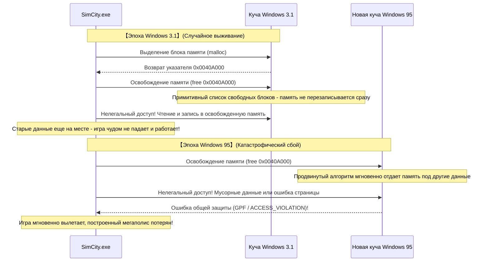

В 16-битной Windows 3.1 архитектура диспетчера памяти была крайне примитивной. Когда приложение освобождало блок памяти, из-за простоты связного списка свободных блоков содержимое этой памяти редко когда мгновенно перезаписывалось или перераспределялось под другие нужды. Иными словами: хотя код SimCity был фундаментально поломан, **он продолжал работать исключительно благодаря примитивности диспетчера памяти Windows 3.1**.

### 2.2 Стандартная программная инженерия против безумия команды Windows

И вот в 1995 году на технологическую арену выходит Windows 95 — эпохальная 32-битная операционная система.

Windows 95 принесла с собой настоящую вытесняющую многозадачность, развитый менеджер виртуальной памяти и высокопроизводительный распределитель кучи, созданный для минимизации фрагментации и оптимизации кэша процессора. Этот современный распределитель функционировал агрессивно: как только память возвращалась программе, он **немедленно объединял свободные блоки и перераспределял их для других задач, затирая старые данные**.

Когда тестировщики запустили SimCity на новой системе, разразилась катастрофа:  
Игра пыталась прочитать только что освобожденную память, натыкалась на чужие структуры данных или недоступную страницу, и на экране вспыхивало зловещее окно **«Ошибки общей защиты (General Protection Fault: GPF)»**. Огромный мегаполис, который игрок возводил десятками часов, в долю секунды превращался в прах.

Какое решение в такой ситуации предписывала классическая теория программной инженерии или приняла бы любая другая компания-производитель ОС?

Ответ очевиден: «Это на 100% ошибка программистов студии Maxis. Подсистема управления памятью новой ОС функционирует строго по стандарту. Необходимо уведомить Maxis об ошибке и дождаться, пока они выпустят патч на дискетах (SimCity 1.01)». Это была бы логически безупречная позиция.

Однако руководство Microsoft и команда запуска Windows 95 приняли решение, граничащее с безумием:

**«SimCity не должна падать ни при каких обстоятельствах. У нас нет времени ждать исправлений от создателей игры. Внесите специальный патч прямо в диспетчер памяти ядра Windows 95, чтобы заставить SimCity работать.»**

### 2.3 Детали специального хака для SimCity в диспетчере памяти

Джоэл Спольски в своем историческом эссе зафиксировал этот драматический момент следующими словами:

> «Во время бета-тестирования Windows 95 они обнаружили, что SimCity работает некорректно. Что сделала Microsoft?  
> Они не стали преследовать авторов SimCity с требованием исправить ошибку. Инженер, отвечавший за менеджер памяти Windows 95, написал специальный фрагмент кода: **"Если запущенной программой является SimCity, не перераспределяй освобожденную память немедленно; сохраняй ее нетронутой в течение некоторого времени"**».

С точки зрения современной компьютерной науки суть этого хака представляет собой прообраз так называемой «карантинной кучи» (Quarantine Heap) или «отложенного освобождения» (Delayed Free).

Диспетчер памяти Windows 95 при старте процесса проверял имя исполняемого файла (`SIMCITY.EXE`) и поля его заголовка. Распознав SimCity, распределитель кучи переключался в специальный режим спасения: вместо немедленного слияния и повторного использования освобожденного блока указатель временно помещался в кольцевой буфер ожидания. Благодаря этому старое содержимое блока памяти гарантированно сохранялось в целости на протяжении достаточного времени, чтобы некорректные процедуры SimCity успели безопасно завершить свое чтение.

Благодаря этому самопожертвованию со стороны операционной системы в день релиза Windows 95 миллионы игроков по всей планете вставили дискеты с любимой игрой в свои ПК и продолжили строить города без единого намека на сбой.

Пользователи восторженно восклицали: «Windows 95 великолепна! Все старые программы работают идеально!». И никто из них даже не подозревал, что ради их спокойствия инженеры Microsoft внедрили в сверкающее новое 32-битное ядро хак, спасающий грубый баг сторонней программы шестилетней давности.


---

## Глава 3: Историческая летопись «бескомпромиссных хаков совместимости»

Спасение SimCity было лишь вершиной айсберга. Более чем тридцатилетняя летопись развития Windows представляет собой непрерывную череду дерзких и виртуозных инженерных вмешательств, предпринятых ради продления жизни бесчисленного множества некорректных программ.

### 3.1 Lotus 1-2-3 и «ошибка високосного 1900 года» в Excel

В области календарных вычислений на ЭВМ существует всемирно известная ошибка, которая по сей день благополучно живет в неизменном виде на миллиардах компьютеров: **ошибочное признание 1900 года високосным**.

В григорианском календаре астрономические и математические правила определения високосных лет сформулированы предельно жестко:
1. Год, делящийся на 4, является високосным.
2. Однако год, делящийся на 100, является обычным (невисокосным).
3. При этом год, делящийся на 400, вновь становится високосным.

Следовательно, поскольку 1900 год делится на 100, но не делится на 400, **он безусловно является обычным годом; дня 29 февраля 1900 года в реальности никогда не существовало**.

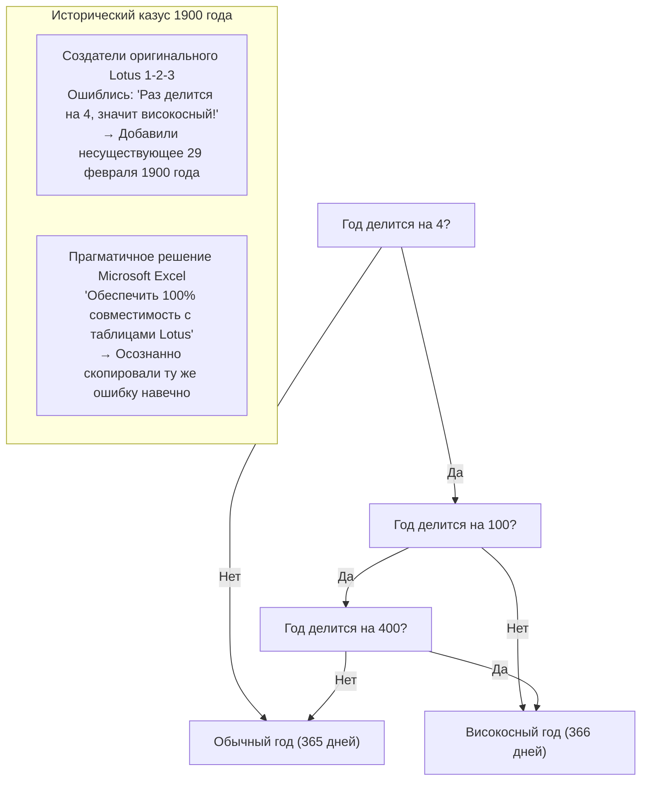

Однако в начале 1980-х годов разработчики электронных таблиц *Lotus 1-2-3* — безоговорочного лидера рынка программного обеспечения для MS-DOS — упустили из виду вековое исключение и запрограммировали 1900 год как високосный. В результате в Lotus 1-2-3 появилась фиктивная дата «29 февраля 1900 года», сдвинувшая порядковые номера всех последующих календарных дней на единицу.

Когда команда Microsoft взялась за создание *Excel* для завоевания корпоративного рынка, перед ней встала мучительная дилемма: следовать ли математически безупречному календарю или обеспечить абсолютное совпадение расчетов с десятками миллионов финансовых таблиц Lotus 1-2-3, на которых держалась бухгалтерия крупнейших корпораций?

Решение Билла Гейтса было категоричным: ради беспрепятственной и безболезненной миграции пользователей с Lotus 1-2-3 **Excel намеренно и в точности воспроизвел этот баг, официально признав существование несуществующего 29 февраля 1900 года**.

Если вы прямо сейчас откроете Microsoft 365 Excel и введете в ячейку формулу `=ДАТА(1900; 2; 29)`, программа не выдаст ошибки, а невозмутимо отобразит дату «29.02.1900». Однажды принятое решение унаследовать чужой баг ради завоевания рынка становится вечным архитектурным обязательством, которое невозможно отменить спустя десятилетия и даже столетия.

### 3.2 Почему пропустили «Windows 9»?

Осенью 2014 года Microsoft организовала презентацию, чтобы представить миру преемника Windows 8.1. Эксперты и публика были уверены, что новой ОС станет «Windows 9». Однако со сцены неожиданно прозвучало ошеломляющее название: **«Windows 10»**.

Почему девятка была вычеркнута из истории? За официальными маркетинговыми заявлениями о «гигантском шаге вперед» скрывалась предельно приземленная, но пугающая техническая причина, раскрытая инженерами и исследователями обратной разработки: минные поля легаси-кода.

В бесчисленном множестве сторонних приложений, библиотеках Java и устаревших инсталляторах по всему миру разработчики проверяли версию текущей операционной системы с помощью чудовищно небрежных конструкций вроде этой:

```java
// Распространеннейший шаблон проверки в старом корпоративном софте
String osName = System.getProperty("os.name");

if (osName.startsWith("Windows 9")) {
    // Программа ошибочно решает, что запущена на Windows 95 или Windows 98!
    // Активируются устаревшие 16-битные ветки кода и реестра семейства Win9x
    enableLegacyWin9xMode();
} else {
    // Современный режим для систем линейки NT (Windows NT, 2000, XP, 7, 8 и т.д.)
    enableModernNTMode();
}
```

Авторы этого кода использовали `startsWith("Windows 9")` как ленивый шорткат, чтобы одним махом отловить и Windows 95, и Windows 98.

Если бы Microsoft честно назвала свою операционную систему «Windows 9», тысячи корпоративных программ и системных утилит по всему миру сочли бы, что их запустили на древней Windows 95 двадцатилетней давности. Они отключили бы современные механизмы ядра NT и попытались выполнить системные вызовы эпохи DOS, мгновенно вызвав массовый коллапс.

Панический страх нарушить совместимость с колоссальным парком старых программ заставил руководство компании навсегда стереть цифру 9 из хронологии Windows.

### 3.3 Недокументированные API (Undocumented APIs) и Norton Utilities

В 1990-е годы пакет системной диагностики и восстановления *Norton Utilities* от компании Symantec был обязательным инструментом на компьютерах миллионов пользователей. Но для разработчиков Windows он оставался постоянным источником головной боли и воплощением самого опасного и недисциплинированного софта.

Низкоуровневые утилиты вроде Norton пренебрегали официальным каталогом документированных Win32 API и **напрямую лезли во внутренние недокументированные структуры ядра, вызывали закрытые функции и считывали фиксированные смещения в системных библиотеках DLL**.

Рэймонд Чен неоднократно вспоминал титаническую войну, которую команда Windows 95 вела за выживание Norton Utilities. Стоило инженерам обновить механизмы диспетчеризации задач или защиты памяти так, что недокументированная структура смещалась хотя бы на один байт, как Norton Utilities вызывала синий экран смерти (BSoD) и намертво вешала систему.

Реакция Microsoft и здесь не свелась к обвинениям в адрес Symantec. Разработчики Windows дизассемблировали исполняемые файлы Norton Utilities, досконально изучили их поведение, выяснили, к каким именно смещениям обращаются утилиты, и **встроили прямо в ядро фиктивные копии старых структур данных строго по тем адресам, где их ожидал Norton**, предотвратив крах системы.

### 3.4 День, когда Билл Гейтс взял в руки дробовик: DOOM и рождение DirectX / WinG

Перед самым релизом Windows 95 позиции Windows в игровой индустрии были катастрофическими. Разработчики видеоигр относились к Windows с неприкрытым презрением, считая ее тяжелой офисной ОС, чья графическая подсистема (GDI) создавала слишком высокие накладные расходы для динамичных игр. Все серьезные хиты создавались исключительно под MS-DOS, где программы могли напрямую обращаться к портам ввода-вывода видеочипов и звуковых карт Sound Blaster.

Главным символом той эпохи был легендарный шутер от первого лица *DOOM* студии id Software. DOOM распространялся с невиданной скоростью, его тайно устанавливали на рабочие компьютеры по всему миру, и американская пресса всерьез обсуждала падение производительности труда в корпорациях из-за увлечения игрой.

Билл Гейтс осознал угрозу: «Если пользователям придется перезагружать компьютеры в чистый DOS ради игр, Windows 95 никогда не одержит окончательную победу. DOOM должен работать под Windows 95, причем быстрее, чем под DOS».

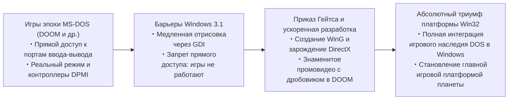

Гейтс мобилизовал лучших инженеров для экстренной разработки библиотек, способных эмулировать и аппаратно ускорять прямой доступ к «железу» в защищенном режиме Windows: так появились переходный пакет «WinG», а затем и «DirectX» (внутреннее кодовое имя: *Manhattan Project*).

Сам Билл Гейтс снялся в легендарном рекламном ролике, где в черном плаще и с дробовиком в руках был смонтирован прямо внутри игрового уровня DOOM, доказывая индустрии, что Windows 95 — ультимативная игровая платформа. Опыт, полученный при укрощении агрессивного софта эпохи DOS под защищенным режимом Windows, заложил фундамент графической и мультимедийной монополии Windows на десятилетия вперед.

---

## Глава 4: Цитадель современной Windows: подсистема «AppCompat (Application Compatibility)»

Во времена Windows 95 и 98 заплатки совместимости внедрялись в код ядра точечно и стихийно. Однако взрывной рост разнообразия коммерческого софта на рубеже Windows 2000 и Windows XP сделал такой подход тупиковым: системный код грозил утонуть в бесконечных условных операторах, написанных ради спасения отдельных приложений.

Тогда архитекторы Microsoft создали фундамент, который продолжает нести службу вплоть до современной Windows 11: **официальную подсистему совместимости приложений — «Application Compatibility (AppCompat)»**.

### 4.1 Общая архитектура подсистемы AppCompat

Подсистема AppCompat представляет собой **высокоинтеллектуальный механизм перехвата, который в миллисекунду загрузки исполняемого файла в память идентифицирует его цифровой профиль и динамически встраивает между приложением и ядром прозрачный слой маскировки — так называемые шимы (Shims)**.

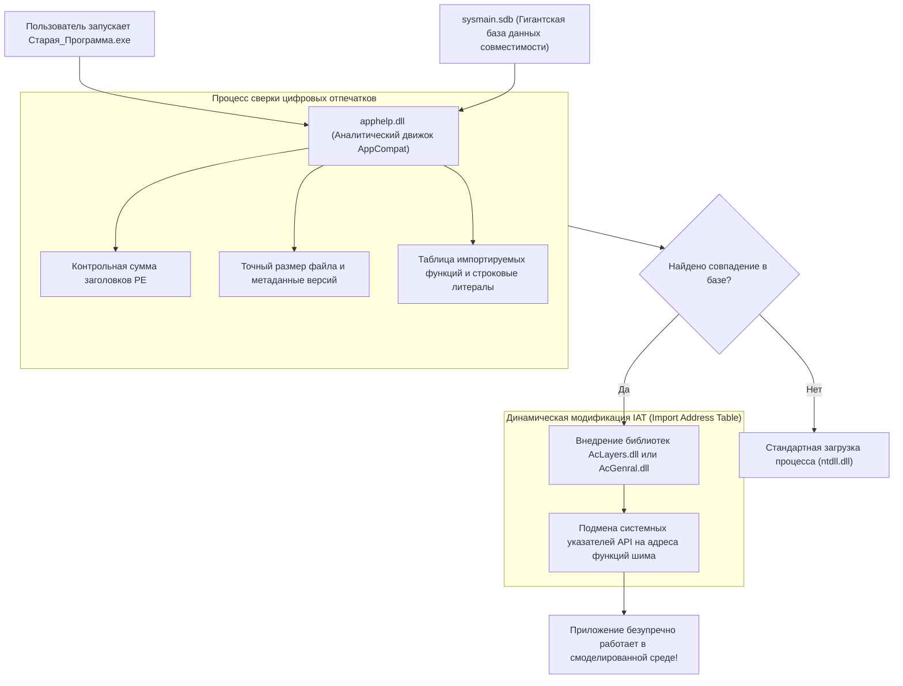

Когда пользователь запускает файл (`.exe`), системная процедура создания процессов (управляемая `ntdll.dll`) приостанавливает штатную инициализацию и обращается к библиотеке **`apphelp.dll`**.

`apphelp.dll` сканирует колоссальную системную базу данных **`sysmain.sdb`**, выясняя, числится ли данный исполняемый файл в реестре программ, нуждающихся в помощи. Если соответствие найдено, загрузчик ОС принудительно внедряет в адресное пространство процесса модули слоя совместимости — прежде всего **`AcLayers.dll`** и **`AcGenral.dll`** — еще до того, как официальные библиотеки системы (`kernel32.dll`, `user32.dll` и др.) завершат связывание.

### 4.2 Движок шимов: Механизм подмены API через перехват таблицы импорта (IAT Hooking)

Каким образом внедренный движок шимов обманывает программу, не изменяя ни единого байта в оригинальном файле на диске? Главным рабочим инструментом здесь выступает **перехват Таблицы адресов импорта (Import Address Table Hooking, IAT Hooking)** в заголовке исполняемого файла формата PE (Portable Executable).

Когда программа вызывает внешнюю функцию (например, `GetVersionEx` или `GetDiskFreeSpace`), машинный код не содержит жестко зашитых абсолютных адресов системных библиотек. При загрузке процесса загрузчик Windows заполняет массив указателей на функции в области памяти исполняемого файла — таблицу IAT. Приложение всегда обращается к системным API косвенно через эту таблицу.

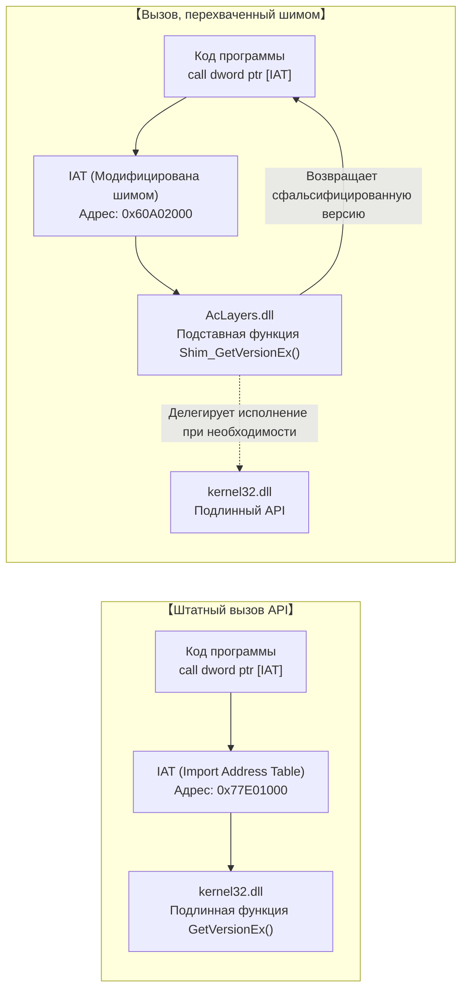

Движок шимов элегантно использует эту архитектурную особенность. Внедрившись в процесс, он сканирует IAT целевой программы, временно снимает защиту памяти вызовом `VirtualProtect` (устанавливая флаг `PAGE_READWRITE`) и **перезаписывает указатели на подлинные функции Windows адресами функций-имитаторов из состава шима**.

Концептуальный псевдокод на C/C++ демонстрирует этот принцип:

```c
// Упрощенная демонстрация внедрения шима через IAT Hooking
#include <windows.h>
#include <imagehlp.h>

// Подставная функция GetVersionEx (тело шима)
BOOL WINAPI Shim_GetVersionExA(LPOSVERSIONINFOA lpVersionInformation)
{
    // Получение адреса оригинальной функции из kernel32.dll
    typedef BOOL (WINAPI *PFN_GETVER)(LPOSVERSIONINFOA);
    HMODULE hKernel = GetModuleHandleA("kernel32.dll");
    PFN_GETVER pfnRealGetVer = (PFN_GETVER)GetProcAddress(hKernel, "GetVersionExA");
    
    BOOL bResult = pfnRealGetVer(lpVersionInformation);
    
    // 【ОПЕРАЦИЯ ОБМАНА】
    // Нагло лжем программе, утверждая, что она запущена в Windows 95 (Major: 4, Minor: 0)
    lpVersionInformation->dwMajorVersion = 4;
    lpVersionInformation->dwMinorVersion = 0;
    lpVersionInformation->dwBuildNumber = 950;
    lpVersionInformation->dwPlatformId = VER_PLATFORM_WIN32_WINDOWS;
    strcpy(lpVersionInformation->szCSDVersion, "");

    return TRUE; // Программа безоговорочно верит и продолжает стабильную работу
}

// Процедура обхода IAT и подмены указателей
void InstallShimHook(HMODULE hAppModule, LPCSTR targetDll, LPCSTR targetFunc, PVOID newFuncAddress)
{
    ULONG size;
    // Поиск дескриптора директории импорта в PE-заголовке
    PIMAGE_IMPORT_DESCRIPTOR pImportDesc = (PIMAGE_IMPORT_DESCRIPTOR)
        ImageDirectoryEntryToData(hAppModule, TRUE, IMAGE_DIRECTORY_ENTRY_IMPORT, &size);

    while (pImportDesc->Name) {
        LPCSTR dllName = (LPCSTR)((PBYTE)hAppModule + pImportDesc->Name);
        if (_stricmp(dllName, targetDll) == 0) {
            // Поиск таблицы указателей (Thunk Table) нужной DLL
            PIMAGE_THUNK_DATA pThunk = (PIMAGE_THUNK_DATA)((PBYTE)hAppModule + pImportDesc->FirstThunk);
            while (pThunk->u1.Function) {
                PROC* ppfn = (PROC*)&pThunk->u1.Function;
                // При совпадении с целевой функцией перезаписываем адрес в памяти
                DWORD oldProtect;
                VirtualProtect(ppfn, sizeof(PROC), PAGE_READWRITE, &oldProtect);
                *ppfn = (PROC)newFuncAddress; // Подмена на адрес функции шима!
                VirtualProtect(ppfn, sizeof(PROC), oldProtect, &oldProtect);
                break;
            }
        }
        pImportDesc++;
    }
}
```

Благодаря этому микроскопическому вмешательству в оперативную память дисковый файл программы остается нетронутым, ядро системы не засоряется бесконечными частными заплатками, а устаревшее приложение оказывается в уютном виртуальном заповеднике, где воссозданы все иллюзии прошлых эпох.

### 4.3 Загадочный гигантский бинарник `sysmain.sdb` (Shim Database)

Сердцем инфраструктуры AppCompat является скрытый системный файл **`sysmain.sdb`**, расположенный в каталоге `C:\Windows\AppPatch\`.

Этот файл записан в закрытом бинарном формате Microsoft (формат SDB) и хранит в себе **сотни тысяч индивидуальных рецептов совместимости практически для любого значимого коммерческого ПО, утилит, офисных пакетов и компьютерных игр, выпущенных за последние четыре десятилетия**.

Чтобы исключить ошибочное применение шимов к современным программам с распространенными именами (такими как `setup.exe` или `install.exe`), аналитический механизм `apphelp.dll` производит комплексную многофакторную идентификацию по набору «цифровых отпечатков»:

1. **Имя файла и канонический путь установки**
2. **Точный размер бинарного файла с точностью до байта**
3. **Метка времени линковщика в PE-заголовке (Linker Timestamp)**
4. **Контрольная сумма исполняемого файла (PE CheckSum)**
5. **Таблица строковых ресурсов версии (CompanyName, ProductName, FileVersion, LegalCopyright и т.д.)**
6. **Контрольные хэши отдельных кодовых секций и конфигурация таблицы экспорта**

Если пользователь вставит в дисковод современного ПК с Windows 11 компакт-диск с интерактивной энциклопедией 2001 года выпуска, `apphelp.dll` мгновенно распознает отпечаток, сверится с базой данных `sysmain.sdb` и вынесет вердикт:  
*«Этот софт создавался под Windows 2000; он жестко завязан на устаревшее выравнивание памяти кучи и пытается писать напрямую в системные ветки реестра»*.  
Система тут же активирует необходимый набор из пары десятков специализированных шимов, и энциклопедия запустится идеально гладко, словно на дворе вновь начало двухтысячных.


---

## Глава 5: Каталог показательных шимов (Искусство лжи во имя спасения)

Арсенал шимов, внедренных в системные глубины Windows, насчитывает сотни специализированных механизмов. Они представляют собой подлинную энциклопедию инженерной изобретательности, созданную для систематического исправления любых ошибок, допущенных программистами за минувшие десятилетия.

### 5.1 `VersionLie`: «Вы именно в той Windows 95, о которой мечтали», — шепчет ОС

Один из самых старых и массово применяемых шимов — **`VersionLie`** (фальсификация версии ОС).

Исторически разработчики при запуске своих программ вызывали системные API `GetVersion` или `GetVersionEx`, чтобы убедиться, что окружение соответствует минимальным требованиям. Однако огромное количество кода содержало проверки поразительной близорукости:

```c
// Классический пример катастрофической проверки версии
OSVERSIONINFO vi;
GetVersionEx(&vi);

// Программа слепо убеждена, что имеет право работать только в Windows 95
if (vi.dwMajorVersion == 4 && vi.dwMinorVersion == 0) {
    // Штатная инициализация
} else {
    MessageBox(NULL, "Эта программа разработана исключительно для Windows 95. Запуск в более новых ОС невозможен.", "Ошибка", MB_OK);
    ExitProcess(1); // Приложение добровольно совершает суицид!
}
```

При запуске в последующих версиях ОС — таких как Windows XP (Major: 5), Windows 7 (Major: 6) или Windows 10/11 (Major: 10) — программа видела, что `dwMajorVersion` не равен 4, и немедленно вылетала с ошибкой, несмотря на то, что современная среда полностью поддерживала все нужные функции.

Для нейтрализации этого суицидального поведения и был создан `VersionLie`. Когда процесс вызывает `GetVersionEx`, ядро Windows 11 с невозмутимым видом возвращает поддельную структуру: **«Вы запущены в Windows 95 (Major: 4, Minor: 0, Build: 950)»**. Программа, полностью удовлетворенная полученным ответом, безмятежно продолжает работу на многоядерных процессорах и сверхбыстрых накопителях NVMe SSD.

### 5.2 `EmulateGetDiskFreeSpace`: Спасение программ от переполнения при емкости диска свыше 2 ГБ

В середине 1990-х годов типичная емкость жестких дисков колебалась в пределах от сотен мегабайт до одного гигабайта. Классический Win32 API для проверки дискового пространства, `GetDiskFreeSpace`, возвращал такие параметры, как число секторов в кластере, размер сектора и количество свободных кластеров, в виде 32-битных знаковых целых чисел (`signed 32-bit integer`).

Разработчики вычисляли свободный объем диска по элементарной формуле:

$$\text{FreeBytes} = \text{SectorsPerCluster} \times \text{BytesPerSector} \times \text{NumberOfFreeClusters}$$

Однако как только емкость накопителей превысила **2 гигабайта ($2^{31} - 1$ байт)**, 32-битное умножение со знаком приводило к **арифметическому переполнению (integer overflow)**, и итоговое число внезапно становилось **отрицательным (например, -500 мегабайт)**.

В результате при попытке установить старую игру или офисный пакет на современный ПК с емким накопителем инсталлятор паниковал и прерывал работу с сообщением: *«Недостаточно места на диске: свободно всего -500 МБ»*.

Спасением от этого абсурда стал шим **`EmulateGetDiskFreeSpace`**. Когда приложение опрашивает систему, шим перехватывает ответ и, сколько бы терабайт свободного пространства ни было на диске, хладнокровно сообщает: **«Свободно ровно 2 147 151 872 байта (около 1,99 ГБ)»** — предельное пороговое значение, исключающее переполнение 32-битного знакового целого. Инсталлятор видит, что места достаточно, и безупречно завершает установку.

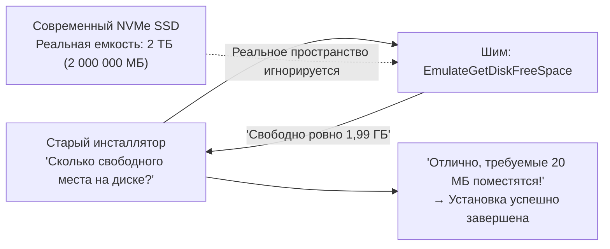

### 5.3 `VirtualRegistry` и `VirtualStore`: Вынужденная переадресация после появления UAC

Релиз Windows Vista в 2006 году ознаменовал фундаментальную революцию в системе безопасности: появление **Контроля учетных записей (User Account Control: UAC)**.

В Windows 95, 98 и XP пользователи почти всегда работали с правами локального администратора. Программы привыкли без малейших колебаний записывать конфигурационные файлы и базы данных прямо в защищенный каталог `C:\Program Files` и системный куст реестра `HKEY_LOCAL_MACHINE\Software`.

В парадигме безопасности Vista и ее преемников любые попытки записи обычного непривилегированного процесса в системные области жестко пресекаются (`ACCESS_DENIED`). Если бы это правило применили в лоб, миллионы корпоративных приложений по всему миру мгновенно вышли бы из строя из-за невозможности сохранить настройки.

Ответом стала архитектура прозрачной виртуализации **`VirtualStore`**.

Когда старая программа пытается записать данные в `C:\Program Files\App\config.ini` без повышенных привилегий, диспетчер ввода-вывода Windows не возвращает ошибку доступа; вместо этого он незаметно перенаправляет операцию в изолированный пользовательский каталог: `C:\Users\<Пользователь>\AppData\Local\VirtualStore\Program Files\App\config.ini`. Точно так же запись в `HKLM\Software` прозрачно переадресуется в `HKCU\Software\Classes\VirtualStore`.

При последующих попытках чтения система подставляет файлы из VirtualStore. Приложение абсолютно убеждено, что работает с системной папкой Program Files, оставаясь при этом в безопасной изолированной песочнице.

### 5.4 `DXPrimaryBltPunt`: Распад 256-цветной палитры и рассинхронизация частоты кадров в классическом DirectDraw

Компьютерные игры второй половины 1990-х и начала 2000-х годов (такие как *Age of Empires* и культовые RPG) создавались на базе компонента «DirectDraw» библиотеки DirectX. Рассчитанные на 256-цветную графику (8-битная индексированная палитра), они формировали визуальные эффекты и переходы путем прямой перезаписи регистров палитры в первичной видеопамяти (VRAM).

Однако современные видеочипы и оконный менеджер Windows (Desktop Window Manager: DWM) формируют рабочий стол исключительно в 32-битном TrueColor-режиме через трехмерные конвейеры рендеринга. Аппаратная поддержка прямого манипулирования 8-битными палитрами на основном экране была упразднена десятилетия назад.

При запуске такой игры на современном ПК без адаптации рассинхронизация палитры превращала экран в психоделическую кашу из кислотных мерцающих цветов, а отключенная вертикальная синхронизация заставляла игровой цикл крутиться со скоростью тысяч кадров в секунду, делая игровой процесс невозможным.

Графические шимы, такие как **`DXPrimaryBltPunt`** и **`ForceDirectDrawEmulation`**, устраняют этот конфликт: они перехватывают архаичные инструкции DirectDraw, на лету конвертируют их в современные полигональные текстуры Direct3D и корректно направляют в конвейер композитинга DWM. Тот факт, что пиксельная классика 30-летней давности сегодня сохраняет идеальную цветопередачу на экранах 4K, является прямой заслугой этих графических механизмов маскировки.

---

## Глава 6: Великий поход в мир 64 бит и архитектуры ARM — WOW64 и магия эмуляции

Когда технологический прогресс затрагивает не только интерфейсы программирования (API), но и саму архитектуру набора команд центрального процессора, удержать совместимость простыми перехватами в оперативной памяти уже невозможно. Перед лицом этих исторических сломов Windows пошла на дерзкий шаг: **встроила полноценную копию одной ОС внутрь другой**.

### 6.1 От NTVDM к WOW64: Расщепление файловой системы и реестра на параллельные миры

При переходе от 16 к 32 битам Windows NT предоставила подсистему **NTVDM (NT Virtual DOS Machine)**, использовавшую виртуальный режим 8086 процессоров Intel для запуска софта DOS и Win16.

А в середине 2000-х годов с приходом архитектуры AMD64 (x64) произошел тектонический сдвиг в сторону 64 бит. Чтобы сохранить колоссальное наследие 32-битного ПО, инженеры Microsoft разработали подсистему **«WOW64 (Windows 32-bit On Windows 64-bit)»**.

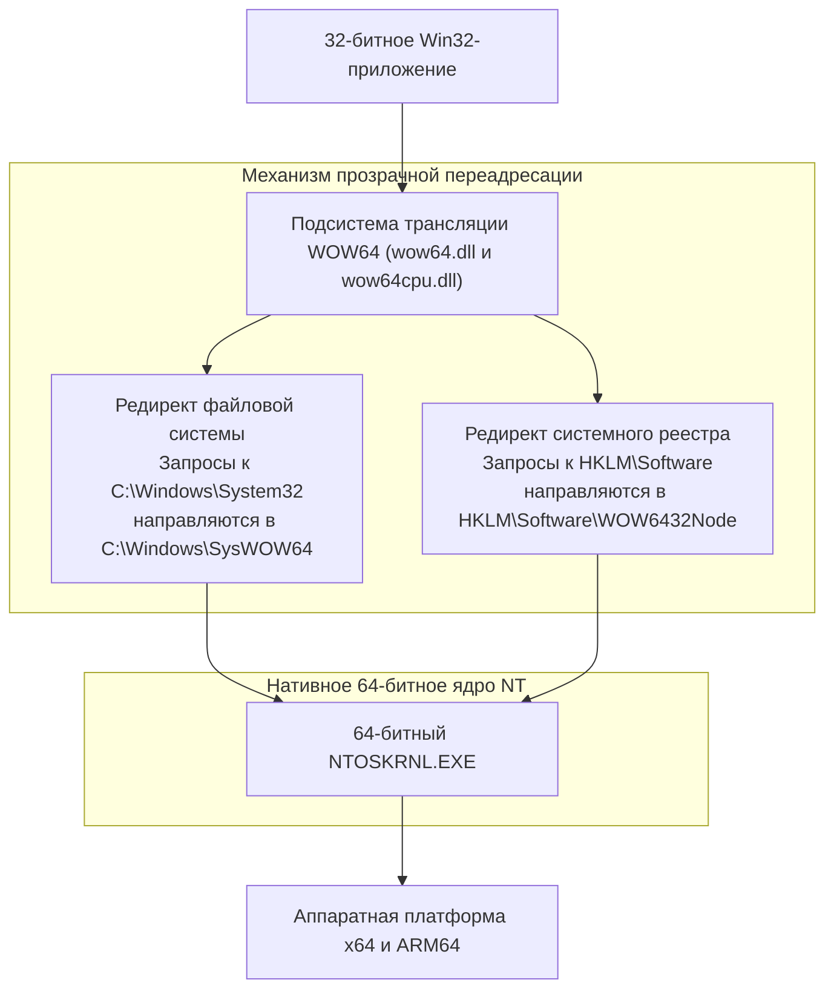

Главное технологическое чудо WOW64 заключается в создании **иллюзии параллельного мира** в файловой системе и реестре для 32-битных процессов:

- **Редиректор файловой системы**:  
  В 64-битной Windows нативные 64-битные системные библиотеки парадоксальным образом располагаются в каталоге `C:\Windows\System32`. Когда 32-битное приложение пытается обратиться к этой папке, WOW64 незаметно перенаправляет запрос в `C:\Windows\SysWOW64` (где, вопреки названию, хранятся настоящие 32-битные библиотеки).
- **Редиректор и отражение реестра**:  
  Аналогично, когда 32-битная программа пытается выполнить запись в ветку `HKEY_LOCAL_MACHINE\Software`, подсистема автоматически изолирует операцию внутри `HKEY_LOCAL_MACHINE\Software\WOW6432Node`.

Благодаря этой тонкой имитации приложение, скомпилированное в 1998 году, даже не догадывается, что работает на 64-битной платформе, продолжая находить привычные файлы и ветки реестра точно там, где ожидает.

### 6.2 Переход на ARM64 и транслятор Prism

Самым напряженным технологическим рубежом наших дней стал переход с классической микроархитектуры x86/x64 на **ARM64** (процессоры Qualcomm Snapdragon X Elite и их аналоги).

В 2012 году Microsoft уже пробовала выпустить «Windows RT», попытавшись применить подход в стиле Apple: полностью запретить запуск классических приложений Win32 на процессорах ARM. Рынок встретил Windows RT сокрушительным бойкотом, принесшим корпорации около миллиарда долларов убытков. Этот жесткий урок навсегда впечатал в сознание руководства Microsoft простую истину: **Windows, не способная запускать исторический каталог Win32-приложений, не воспринимается миром как Windows**.

В современной Windows 11 on ARM дебютировал передовой механизм динамической бинарной трансляции под кодовым названием **«Prism»**. Prism в реальном времени анализирует машинные инструкции x86 и x64 исполняемых файлов, выполняя JIT-компиляцию в нативные инструкции ARM64. Одновременно с этим транслированные кодовые блоки кэшируются, что позволяет старому софту работать со скоростью, сопоставимой с нативным исполнением.

Каким бы радикальным ни был скачок в архитектуре кремниевых чипов, пользовательский опыт остается неприкосновенным: двойной клик по исполняемому файлу — и программа мгновенно начинает работать.

---

## Глава 7: Три мира, три философии архитектуры — Windows vs Apple (macOS) vs Linux

Отвечая на вопрос о том, как поступать с программным наследием прошлого, три ведущие операционные системы мира выбрали принципиально разные пути. Сопоставление этих подходов делает феномен Windows особенно ярким и наглядным.

### 7.1 Apple (Хирургическое отсечение): Сжечь прошлое ради движения вперед

От эпохи Стива Джобса до руководства Тима Кука философия Apple неизменно основывалась на концепции **«хирургического выжигания легаси» (Scorched Earth Policy)**: безжалостно уничтожать багаж прошлого ради чистоты и совершенства будущего пользовательского опыта.

История Apple представляет собой непрерывную цепочку бескомпромиссных разрывов:
- **Полный отказ от Classic Mac OS**: Принудительный переход с Mac OS 9 на Mac OS X (на базе NeXT и Unix). Промежуточный слой совместимости («Carbon») был временно поддержан, а затем полностью выкорчеван.
- **Постоянная смена процессорных архитектур**: С Motorola 680x0 на PowerPC, с PowerPC на Intel x86, и с Intel на Apple Silicon (чипы серии M). В каждый переходный период Apple создавала первоклассные эмуляторы (эмулятор 68K, оригинальная Rosetta, Rosetta 2), но спустя несколько лет безжалостно удаляла их из состава ОС, окончательно ставя крест на старых бинарниках.
- **Ликвидация 32-битного кода в macOS Catalina (2019)**: Apple единым махом полностью удалила поддержку 32-битных программ. Тысячи профессиональных аудиоплагинов, научных пакетов и игр навсегда превратились в цифровой мусор.

Позиция Apple предельно прямолинейна: *«Разработчики обязаны использовать последнюю версию Xcode, переписывать код на современном Swift и компилировать его под свежие версии ОС. Те, кто не поспевает за прогрессом, должны покинуть экосистему»*. Этот подход гарантирует легкость, чистоту и высокую производительность macOS, но перекладывает всю тяжесть бесконечного переписывания софта на плечи авторов и пользователей.

### 7.2 Linux (Заповедь Линуса): «Never break userspace!» — Свет и тени

В мире открытого исходного кода создатель ядра Linux Линус Торвальдс (Linus Torvalds) установил непреложный закон, который поразительно близок железному правилу Microsoft: **«Never break userspace!» (Никогда не ломайте пространство пользователя!)**.

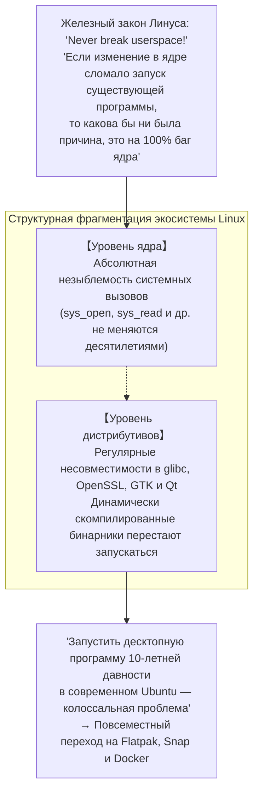

Если какой-либо патч для ядра Linux, сколь бы красивым и концептуальным он ни был, приводит к регрессии и ломает хотя бы одну существующую пользовательскую утилиту, Торвальдс устраивает разнос в почтовой рассылке и требует немедленного отката изменений. В этом фундаментальном аспекте ядро Linux абсолютно солидарно с Windows.

Однако в пространстве настольного Linux нет единого координирующего центра. Хотя системные вызовы ядра неприкосновенны, разделяемые библиотеки прикладного уровня (`glibc`, `libssl`, оконные фреймворки GTK и Qt) в дистрибутивах постоянно ломают обратную совместимость. Как следствие, **запустить динамически скомпилированный бинарник десятилетней давности на современной версии Ubuntu часто бывает невыполнимой задачей**. Защитив ядро, Linux из-за фрагментации пользовательского пространства не сумел достичь того уровня тотальной преемственности поколений ПО, который обеспечивает Windows.

### 7.3 Windows (Кумулятивное включение): Монументальная стратификация

В противовес хирургическим зачисткам Apple и дистрибутивной фрагментации Linux путь Windows получил название **«Кумулятивного включения» (Cumulative Inclusion)**.

Система никогда не выбрасывает старые фундаменты: она бесконечно наслаивает новые абстракции поверх прежних, словно геологические породы. Поверх Win16 надстроили Win32; поверх Win32 возвели платформу .NET; поверх нее развернули WinRT и UWP; а когда UWP не оправдал ожиданий, Microsoft вновь надстроила современный Windows App SDK (WinUI 3) прямо на вечном граните Win32.

Эта непрерывная аккумуляция превратила Windows в одного из самых циклопических и сложных программных монстров в истории человечества. Но в обмен на эту сложность миру было подарено уникальное чудо: **среда, в которой программы сорокалетней давности мирно и безупречно уживаются на одной машине с современнейшими приложениями искусственного интеллекта**.

| Критерий сравнения | Microsoft (Windows) | Apple (macOS) | Linux (Настольный) |
| :--- | :--- | :--- | :--- |
| **Базовая философия** | **Кумулятивное включение**<br/>Бережное сохранение всего прошлого | **Хирургический разрыв**<br/>Периодическое выжигание легаси | **Защита ядра при свободе уровней выше**<br/>Ядро вечно, прикладные слои текучи |
| **Главная директива** | "Don't break old apps" | "Embrace the modern platform" | "Never break userspace" (Только ядро) |
| **Горизонт совместимости** | **Более 30–40 лет** (Win32 и DOS) | **3–5 лет** (Удаление после периода миграции) | Системные вызовы вечны, GUI-софт недолговечен |
| **Статус 32-битных программ** | **Полная поддержка в Windows 11** (WOW64) | **Полное уничтожение** в Catalina (2019) | Поддержка требует установки multilib-библиотек |
| **Требования к авторам ПО** | Минимальные: всё продолжает работать | Высокие: регулярная перепись кода | Постоянная переупаковка под разные дистрибутивы |
| **Чистота архитектуры** | Сотни миллионов строк наслоений | Исключительно чистая и цельная | Модульное ядро, фрагментированная среда |


---

## Глава 8: Экономика платформ — Почему совместимость стала несокрушимым «защитным рвом (Moat)»

Почему Билл Гейтс и сменявшие друг друга поколения руководителей Microsoft столь непреклонно требовали от своих инженеров соблюдения этой изнурительной дисциплины? Окончательный ответ лежит не в плоскости эстетики программирования, а в плоскости **холодной экономики софтверных платформ и рыночной стратегии**.

### 8.1 Бизнес-модель Билла Гейтса: Ценность ОС — это «сумма всего работающего софта»

С момента основания Microsoft Билл Гейтс кристально ясно осознавал главную аксиому платформенного бизнеса:

> **Теорема о ценности платформы**:  
> Внутренняя ценность операционной системы определяется вовсе не теми функциями, которыми она обладает сама по себе.  
> Она определяется **«совокупной стоимостью всех созданных в мире программных продуктов, способных выполняться в ее среде»**.

Каким бы революционным, концептуально выверенным и визуально привлекательным ни был новый программный продукт, если на нем невозможно запустить тот софт, на котором держится ежедневная работа людей и предприятий, его рыночная стоимость равна нулю. Пользователи платят не за саму коробку с надписью «ОС», они платят за прикладные программы и ту реальную производительность труда, которую они обеспечивают.

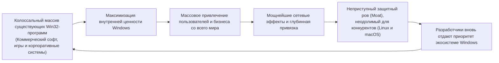

Обеспечивая стопроцентную обратную совместимость, софтверный гигант добился того, что сотни миллионов строк кода, написанные миллионами разработчиков планеты за три десятилетия, **автоматически и бесплатно превращаются в добавленную стоимость следующей версии Windows**.

Какими бы убедительными аргументами о техническом превосходстве ни оперировали представители macOS или Linux в попытках переманить корпоративных клиентов, любые переговоры мгновенно заходили в тупик после одной-единственной фразы заказчика: *«На вашей платформе не работает система управления складом, которую мы написали двадцать лет назад»*. Обратная совместимость стала самым глубоким и непреодолимым конкурентным рвом в истории мировой IT-индустрии.

### 8.2 Абсолютный захват корпоративного рынка (Enterprise Lock-in)

В сегменте крупного бизнеса, промышленных гигантов и государственных структур эта стратегия продемонстрировала несокрушимую мощь.

Корпорации из списка Fortune 500, банковские сети, клиники и сборочные заводы эксплуатируют несметное количество узкоспециализированных систем, разработанных в прошлые десятилетия за миллионы долларов на Visual Basic 6 или C++ с компонентами ActiveX. Зачастую компании-разработчики этих решений давно обанкротились, исходные тексты утеряны, документации не существует: это работающие монолиты, к которым страшно прикоснуться.

Если бы очередная версия Windows разорвала совместимость и потребовала от предприятий заново переписать весь этот софт с нуля на базе современных веб-технологий, директора по IT (CIO) немедленно заморозили бы любые закупки новых компьютеров или начали бы искать спасение в альтернативных решениях.

Но Windows взмахнула волшебной палочкой подсистемы AppCompat, успокоив руководителей: *«Вам не нужно менять ни строчки кода. Спокойно покупайте новые компьютеры — всё запустится точно так же, как работало вчера»*. Для любого финансового директора это было самое надежное, безопасное и выгодное предложение. Так мировой корпоративный сектор оказался навечно привязан к экосистеме Windows.

### 8.3 «Ловушка успеха»: Барьер на пути прорывных инноваций

Однако этот колоссальный триумф таил в себе коварный побочный эффект: со временем он превратился в **«ловушку успеха» (Success Trap)**, сковавшую саму Microsoft в ее попытках совершить радикальные технологические прорывы.

В начале 2010-х годов на фоне стремительного взлета мобильных экосистем iOS и Android корпорация Microsoft попыталась радикально модернизировать Windows, разработав «Универсальную платформу Windows» (Universal Windows Platform, UWP). Концепция UWP предполагала запуск приложений в строго изолированных, безопасных и энергоэффективных контейнерах-песочницах с прицелом на постепенный вывод из эксплуатации классической Win32.

Однако разработчики и корпоративный сектор практически проигнорировали UWP: *«Зачем нам тратить гигантские ресурсы на переписывание программ под урезанную среду с ограниченными правами, если наши привычные Win32-приложения без всяких ограничений и с максимальным быстродействием летают как на Windows 10, так и на Windows 11?»*.

Монументальная стабильность Win32 оказалась настолько всеобъемлющей, что **даже сама Microsoft была не в силах победить свое собственное творение**. В итоге компании пришлось отступить: открыть официальный магазин Microsoft Store для классических Win32-бинарников и заново воссоздать современный графический интерфейс WinUI 3 (Windows App SDK) на незыблемом фундаменте Win32. Величайшая защитная стена, возведенная компанией, стала главным препятствием на пути ее собственных попыток эволюции.

---

## Глава 9: Цена величия — Циклопический технический долг и лабиринты безопасности

Решение взять на себя бремя чужих архитектурных ошибок и защищать прошлое любой ценой не было бесплатным подарком судьбы. В расплату за этот триумф инженеры Windows оказались обречены вести бесконечную войну с самым грандиозным объемом технического долга в истории софтверной индустрии.

### 9.1 Сотни миллионов строк кода и астрономическая матрица тестирования

По общедоступным экспертным оценкам, суммарный объем кодовой базы Windows сегодня измеряется **сотнями миллионов строк**. Но самым устрашающим испытанием для разработчиков остается астрономическая комбинаторная матрица валидации, которую приходится прогонять при создании каждой новой сборки операционной системы.

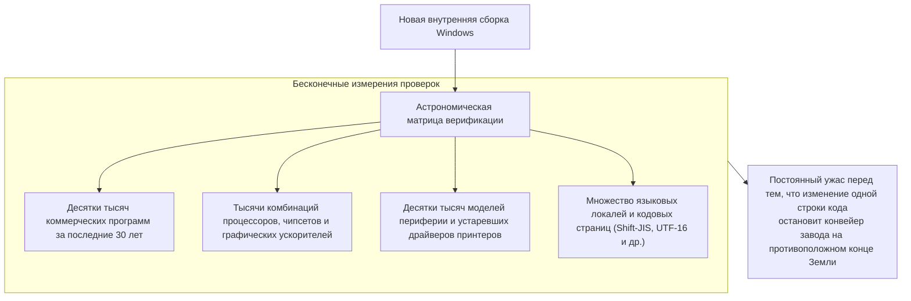

Единственная дополнительная проверка указателя или микроскопический сдвиг в порядке захвата мьютексов в ядре несут в себе скрытую опасность: они могут вызвать взаимную блокировку (deadlock) в тридцатилетней управляющей программе промышленного станка на другом полушарии. Чтобы противостоять этому кошмару, Microsoft круглосуточно эксплуатирует гигантские дата-центры, где десятки тысяч физических серверов и виртуальных машин непрерывно в автоматическом режиме запускают софт всех эпох, проверяя корректность отрисовки их диалоговых окон.

### 9.2 Бреши в безопасности, порожденные устаревшими API

Наиболее критической стороной этой технической задолженности является **информационная безопасность**.

Множество ранних Win32 API создавались в наивную эпоху до появления глобального интернета, когда во главу угла ставилась максимальная производительность, а концепций защиты от переполнения буфера или гранулярного разграничения привилегий практически не существовало. Однако жесткое обязательство обеспечивать совместимость категорически запрещает удалять эти уязвимые функции из состава системы.

Специалисты по кибербезопасности и злоумышленники целенаправленно ищут бреши именно в этих исторических закоулках: архаичные интерфейсы и микроскопические стыки между слоями шимов служат излюбленными векторами для обхода современных защитных механизмов, повышения привилегий и побега из песочниц. Гостеприимство Windows к программному коду прошлого неизбежно оборачивается расширением площади потенциальной атаки (attack surface).

### 9.3 Крах проекта Longhorn и рефакторинг с выделением «MinWin»

Накопление скрытых противоречий между безудержным внедрением новшеств и поддержкой легаси-слоев привело в середине 2000-х годов к драматическому кризису управления разработкой — **полному краху амбициозного проекта «Longhorn»**.

Создававшаяся как революционная замена Windows XP, Longhorn запуталась в клубе взаимных неразрешимых зависимостей между экспериментальными функциями и устаревшим кодом. Исходный код превратился в непроходимый лабиринт: ежедневные сборки не компилировались, скорость разработки упала до нуля, и проект оказался в состоянии полного паралича.

Летом 2004 года совет директоров Microsoft пошел на беспрецедентный шаг, объявив «Перезагрузку Longhorn» (*Longhorn Reset*): тысячи инженеров отправили в корзину многолетний труд и начали разработку с чистого листа, взяв за основу проверенное и компактное ядро Windows Server 2003 SP1 (на базе которого в итоге и появилась Windows Vista).

После этой тяжелейшей встряски команда Windows осуществила масштабную архитектурную реорганизацию, вычленив минимальное, самодостаточное и строго изолированное системное ядро под названием **«MinWin»**. Благодаря этому четкому отделению базовых функций ядра от вышележащих подсистем совместимости архитектура Windows смогла устоять и продолжить развитие, не рухнув под грузом собственной циклопической массы.

---

## Заключение: Ода инженерам-прагматикам — Современная цивилизация, стоящая на чуде «того, что просто работает»

Больничные терминалы с электронными картами пациентов, банкоматы всемирной финансовой системы, диспетчерские центры железнодорожных сетей, программируемые контроллеры заводских конвейеров и мониторы офисных сотрудников, управляющих экономикой, объединяет одна общая скрытая деталь: в их фундаментальных основах практически непрерывно трудится Windows.

Если бы Microsoft вела себя как догматичный апологет академической чистоты computer science и, подобно Apple, сжигала мосты прошлого каждые несколько лет, как выглядела бы сегодня наша технологическая реальность?

Тысячи фабрик остановили бы свои производственные линии, предприятия малого и среднего бизнеса разорились бы под неподъемным бременем постоянного переписывания софта, а критическая инфраструктура погрузилась бы в хаос. Если мировая цифровая экономика и общество смогли непрерывно и поступательно развиваться на протяжении последних четырех десятилетий, то лишь потому, что Windows **взвалила на свои плечи и стоически несет все огрехи, небрежности и ошибки поколений программистов всей планеты**.

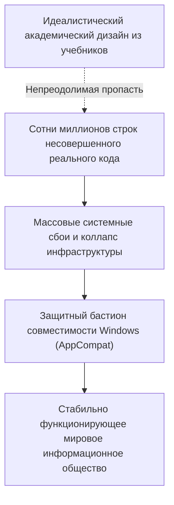

Для Рэймонда Чена и многих поколений безвестных программистов Windows проведение бессонных ночей за дизассемблером ради написания шима, исправляющего чужую ошибку в памяти, никогда не было овеяно ореолом романтики. В этой работе не было академических лавров или пафосных презентаций Кремниевой долины.

Но именно в этом заключается высшее проявление **подлинной профессиональной инженерии**.

Настоящая инженерия состоит не в том, чтобы любоваться идеальными формулами в стерильной лаборатории, закрывая глаза на несовершенство мира. Она состоит в том, чтобы смело погрузиться в пыль и грязь реальности, связать воедино противоречия несовершенного мира несовершенных людей и гарантировать несокрушимую уверенность в том, что **то, что безупречно работало вчера, продолжит работать сегодня, завтра и через много десятилетий**.

«Никогда не ломайте старые приложения» — на этой почти безумной железной заповеди и на титаническом труде инженеров, воплотивших ее в жизнь, держится наше цифровое настоящее, продолжая спокойно и надежно функционировать каждый новый день.
