## 序论：操作系统的本质是什么 ——“优雅的设计”还是“硬核的运行”

翻开计算机科学的经典讲义或优雅的软件工程教科书，字里行间总是充斥着“精炼的抽象”、“关注点分离”、“正交的API设计”等令人心驰神往的理想信条。操作系统（Operating System）理应扮演神圣的调停者角色：屏蔽底层硬件的复杂性，为应用程序提供直观、统一且纯净的接口。

然而，一旦走出大学的象牙塔，踏入真实商业桌面操作系统的残酷战场，这种纯粹无瑕的理想便会瞬间被粉碎得无影无踪。因为在个人计算机的发展历史上，取得最辉煌商业成功、统治全球数十亿台PC的巨擘——Windows所奉行的核心哲学，恰恰是教科书式优雅美学的完全对立面：**“近乎疯狂的硬核现实主义（Pragmatism）”**。

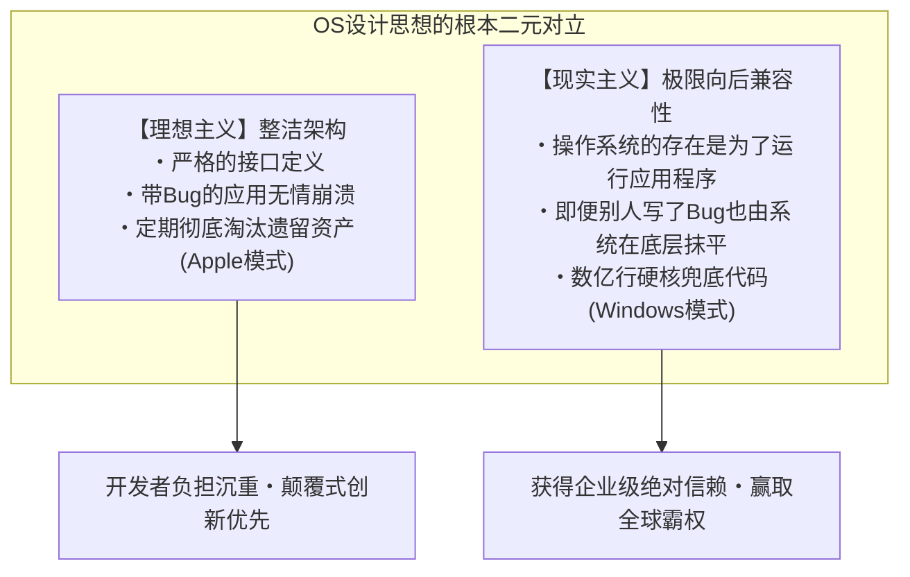

在世界上现存的所有操作系统中，没有哪一个能像Windows那样，对“过去的遗留资产”抱有如此超乎寻常的狂热执念。1995年发售的游戏CD-ROM、1990年代初用Visual Basic 3.0或C++编写的企业财务软件、DOS时代的陈旧遗产、靠非法Hook未公开内部行为运行的老旧实用工具——其中绝大多数在2020年代中期的最新一代操作系统“Windows 11”上，依然能够若无其事地双击启动，并且运行得丝丝入扣、毫无破绽。

大众往往将这种现象视作理所当然，轻描淡写地以为“软件本来就该能跑”。然而，凡是曾逆向工程过Windows内部源代码、窥探过这片技术深渊的系统级程序员，无不倒吸一口凉气、心生战栗。因为在那光鲜的图形界面之下，为了拯救不计其数的第三方应用程序的Bug、规范违规、内存破坏与未定义行为，微软工程师们在过去30年间层层堆叠了**“数万行特例规避代码、动态伪装API，以及由操作系统主动说谎的欺瞒机制（Shim）”**，如地质断层般深不可测。

为什么微软非要如此大费周章，在操作系统内部替“别人写的垃圾代码”背黑锅、硬生生把逻辑圆回来？
为什么微软没有像苹果那样选择“潇洒斩断过去”的道路？
这种看似走火入魔的工程实践，究竟是如何一步步将Windows塑造成无可撼动的“全球最强平台”的？

本文将横跨前微软传奇程序员的亲历证言、Windows内部隐匿的逆向工程数据、PE二进制与NT内核的底层机理，以及IT平台战略演进史，全面揭示统治Windows王国至高无上的绝对铁律——**“绝不破坏旧应用（Don't break old apps）”** 的完整真相。

---

## 第1章：两大信息源讲述的“最高指令（Prime Directive）”

Windows内部开发团队对兼容性的偏执执念，绝非外界凭空臆想的传闻，而是由真正在最前线编写核心代码、决定底层架构的两位传奇程序员生动揭露于世人面前的。

### 1.1 雷蒙德·陈（Raymond Chen）与《The Old New Thing》

在微软Windows开发团队中，有一位统御三十余载的“活化石”与在世传奇。自1992年加入微软以来，他长期负责维护与开发Windows 95 Shell、User32以及Win32子系统的最核心深处，他就是首席软件工程师**雷蒙德·陈（Raymond Chen）**。

陈先生最初在微软内部技术博客撰写心得，后在微软官方技术门户持续连载的专栏博客**《The Old New Thing》**（后结集成书，成为全球系统级程序员的必读圣经），是一座记录Windows如何用尽浑身解数解决各种棘手兼容性难题的惊人宝库。

陈先生反复阐述的Windows团队基础公理，冷酷而直接：

> “Windows操作系统的存在，唯一的目的就是执行程序。用户买电脑不是为了欣赏操作系统的界面，而是为了使用运行在它上面的特定软件。
> 
> 最残酷的现实莫过于此——**当用户升级到新版Windows后，如果他心爱的应用程序跑不起来了，用户绝对不会去责怪软件的原作者。他们会100%指责微软：‘Windows坏了’、‘新版Windows就是个残次品’。**”

站在程序员的技术傲慢角度来看，大家总会理直气壮地认为：“明明是应用程序自己代码写出了Bug，崩了理所当然，应该由软件开发商发布修补补丁。”但在商业操作系统的市场法则面前，这套说辞苍白无力。在用户眼中，客观事实只有一个：“这软件昨天还能用，一升级Windows就崩了。”

如果微软摆出一副正义凛然的姿态回应“那是软件公司的Bug”，用户只会断然拒绝升级，死守旧版操作系统，甚至转投竞争对手的怀抱。因此，作为商业上的绝对必然，Windows开发团队背负了如下残酷而崇高的命题：

**“哪怕应用程序的代码写得再荒唐无稽、再违背规范、再漏洞百出，操作系统也必须在底层精准识别它，在幕后兜底把逻辑圆回来，让它宛如一切正常般跑完全程。”**

在陈先生的博客中，巨细靡遗地记录了他和同事们为了捍卫这一信条，不得不实施的无数令人啼笑皆非却又叹为观止的硬核Hack。

### 1.2 乔尔·斯波尔斯基（Joel Spolsky）的揭秘：《微软如何输掉API之战》

向全球Web开发者与IT商业界深刻传达这一哲学震撼力的人，是**乔尔·斯波尔斯基（Joel Spolsky）**。他曾在1990年代初担任微软Excel开发团队的程序经理，后来创办了全球著名程序员问答社区“Stack Overflow”与项目管理工具“Trello”，被誉为全球最具影响力的技术散文家之一。

2004年，斯波尔斯基在个人网站发表了题为《How Microsoft Lost the API War（微软如何输掉API之战）》的划时代名篇。在文章中，他回忆了当时Windows团队最高掌舵人乔恩·德瓦恩（Jon DeVaan）展现出的铁腕领导力，并写下了这样一段话：

> "In the Windows team, the prime directive was: **don't break old apps.**"
> （在Windows团队内部，绝对不可违背的至高法则（最高指令）就是：“绝不破坏旧应用”。）

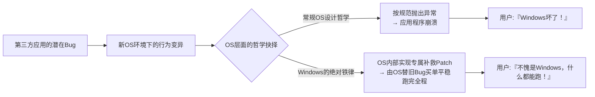

斯波尔斯基打了个形象的比方。在经典科幻剧《星际迷航》（Star Trek）中，星际舰队军官绝对不能违背的最高规条是“星际联邦的最高指令（Prime Directive，严禁干预前曲速文明的正常演进）”；而对于Windows团队的程序员而言，他们的最高指令就是“绝不破坏任何现有应用程序的正常运转”。

如果某个Windows内核开发者将API底层重构成极其优雅的代码，甚至将执行效率提升了整整一倍，但只要改动导致全球市场上流通的某款不知名企业管理软件发生崩溃，这项重构就会被毫不留情地立即打回（Reject）。在Windows团队内部，代码的优雅与架构的纯洁必须无条件退居次席，**“现有二进制代码能够100%平稳运行”才是至高无上的绝对正义**。

### 1.3 “连Bug也会变成规范”：海勒姆法则（Hyrum's Law）与API的不可逆性

软件工程界有一条著名的经验法则，由Google软件工程师海勒姆·赖特（Hyrum Wright）提出，被称为 **“海勒姆法则（Hyrum's Law）”**：

> **海勒姆法则（Hyrum's Law）**:
> “当一个API拥有足够多的用户时，API设计者在文档规格中承诺了什么已经无关紧要。系统的所有可观察行为（包括Bug以及未定义的副作用），迟早都会被某人的代码所依赖。”

Windows是全世界将“海勒姆法则”体现得最淋漓尽致、也承受其最沉重代价的典型平台。

举例来说，某个Windows API的官方文档白纸黑字地写着：“第三个参数必须传入有效的窗口句柄（HWND）。传入无效值时的行为未定义。”然而，世上某些粗心的程序员不慎将 `NULL` 或野指针作为参数传入，而恰巧在当年的Windows 3.1实现中，这段代码阴差阳错地没有报错，直接放行了。

当这款软件在全球卖出几十万份之后，下一代Windows 95或Windows NT的开发团队着手将参数检查严密化：“如果传入无效指针，我们应当严格返回 `ERROR_INVALID_PARAMETER` 错误码。”

在这项“合情合理且完全正确”的修复合入代码的瞬间，灾难降临了：
全球成千上万家企业办公室里，那款老旧软件几乎在同一时间弹错闪退。愤怒的用户瞬间打爆微软客户支持热线：“我们一更新系统，整个公司的业务全瘫痪了！”

最终，微软工程师不得不屈辱地撤回他们写出的“正确代码”，换成如下令人啼笑皆非的妥协实现：

```c
// Windows内部API的概念性还原示例
BOOL WINAPI DoSomething(HWND hWnd, UINT uMsg, WPARAM wParam, LPARAM lParam)
{
    // 教科书式规范的合法性校验
    if (!IsWindow(hWnd)) {
        // 本来理应在此处立即返回错误
        // SetLastError(ERROR_INVALID_WINDOW_HANDLE);
        // return FALSE;

        // 【为了向后兼容的Hack】
        // 历史上某款知名应用X在初始化时会传入NULL句柄。
        // 若在此处返回错误，应用X就会直接崩溃。
        // 因此，默默将其替换为桌面窗口句柄，把错误悄悄抹平。
        if (IsTargetBadApplication("AppX.exe")) {
            hWnd = GetDesktopWindow();
        } else {
            SetLastError(ERROR_INVALID_WINDOW_HANDLE);
            return FALSE;
        }
    }

    // 继续执行原本的业务处理...
    return InternalDoSomething(hWnd, uMsg, wParam, lParam);
}
```

一旦一款操作系统走向大众并成为事实上的行业标准，API的本质便不再是“文档上印着的字符”，而是演化为**“既有实现中偶然表现出来的、包含所有Bug在内的全部行为总和”**。Windows团队正视了这份无法逃脱的宿命，并做好了将全世界第三方应用程序的Bug永久作为操作系统规范背负下去的觉悟。

---

## 第2章：传奇拉开序幕 ——“模拟城市（SimCity）事件”的技术真相

在能够象征Windows开发团队对向后兼容性偏执执念的所有传奇轶事中，有一桩事件在计算机历史上留下了不可磨灭的浓墨重彩。那就是在1995年Windows 95开发冲刺白热化阶段发生的 **“模拟城市（SimCity）事件”**。

### 2.1 释放后使用（Use-After-Free）的物理机理

1989年由威尔·莱特（Will Wright）领导的Maxis公司打造的城市模拟经营游戏《模拟城市》（SimCity），是PC游戏史上永恒的里程碑，在当时引发了全球范围的狂热风潮。毫无疑问，无论是对普通家庭用户，还是对在办公间隙偷闲摸鱼的白领骨干而言，PC上能否流畅稳定地运行SimCity，是决定他们对电脑评价的生死攸关之大事。

当时面向DOS和Windows 3.1发售的PC版《SimCity》二进制文件中，潜藏着一个如果放到现代安全审计体系下会被立即判定为致命安全漏洞的极恶性Bug。那就是 **“释放后使用（Use-After-Free，简称UAF）”**。

SimCity的代码在渲染城市画面或进行模拟推演时，会从操作系统的堆内存管理器申请内存块，用完后再将其归还（调用 `free` 或 `GlobalFree`）。然而不可思议的是，程序内部的指针在内存释放后并未置空，依然堂而皇之地保留着旧地址，并且存在**“明明已经归还给操作系统的内存空间，紧接着又若无其事地继续对其进行读写操作”**的严重违规逻辑。

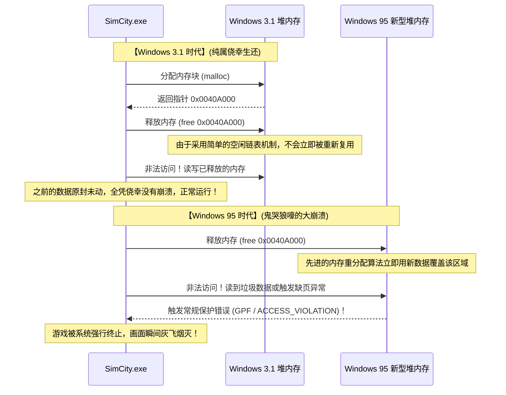

在16位操作系统Windows 3.1时代，内存管理系统极其简陋原始。应用程序释放内存后，由于空闲链表（Free List）结构非常简单，这块内存几乎不会被立刻拿去挪作他用或立即清零覆写。换言之，SimCity内部的代码虽然错得一塌糊涂，但**纯粹是因为Windows 3.1的内存管理太过粗糙迟钝，才侥幸逃脱崩溃、奇迹般地平稳运行**。

### 2.2 普通软件工程思维 vs Windows团队的疯狂

然而到了1995年，彻底颠覆PC产业格局的新一代32位操作系统“Windows 95”横空出世。

Windows 95配备了真正的抢占式多任务内核、精致的虚拟内存管理器，以及旨在防止碎片化、提升缓存命中率的先进高速堆内存分配器。这个现代化的内存管理器被设计为：一旦应用程序归还内存，为了最大化利用内存效率，会**立即将该内存区域回收并分配给其他用途，甚至对内部结构进行重新整理与覆写**。

当SimCity运行在这个现代化的内存分配器上时，灾难如期而至。
SimCity在释放内存后转头就去读取那片区域，然而那里原本的内容早已被清零，或者变成了其他进程写入的杂乱数据。下一瞬间，恶名昭彰的 **“常规保护错误（General Protection Fault: GPF）”** 弹窗在屏幕中央炸开，玩家呕心沥血建设了几十个小时的繁华大都市瞬间化为电子尘埃。

面对这起事故，站在寻常软件工程常识或任何其他操作系统厂商的角度，会做出怎样的决策？

答案不言自明：“这100%是Maxis公司程序员犯下的低级错误。操作系统的内存管理完全按照规范精密运转。应当通知Maxis公司存在此Bug，并等待他们制作一张装有修复补丁（SimCity 1.01）的软盘分发给用户”——这是任何人都能理解的正论。

但是，微软管理高层以及背负着Windows 95发售绝对不容有失使命的开发团队，做出了一个在常人看来堪称疯魔的决策：

**“绝不能让SimCity崩溃。我们等不起游戏公司慢条斯理地发补丁。在Windows 95的内核内存管理器里直接植入专属特例代码，改造操作系统来迎合SimCity！”**

### 2.3 深入内存分配器中的SimCity专属Hack机理

乔尔·斯波尔斯基在名篇中生动记录了这一历史性抉择的关键时刻：

> “在Windows 95的测试过程中，他们发现SimCity无法正常运行。微软是怎么做的？
> 他们并没有去逼迫SimCity的作者修改代码。负责Windows 95内存管理器的工程师，亲自在系统核心中写下了专门的特殊逻辑：**‘如果当前运行的程序检测到是SimCity，那么释放掉的内存不要立即重新分配，而是把它原样保留温存一段时间。’**”

从现代系统安全的视角来看，这一Hack的底层技术本质，正是当今所谓“隔离堆（Quarantine Heap）”或“延迟释放（Delayed Free）”机制的原始雏形。

Windows 95的堆分配器在进程启动时会比对可执行文件名（`SIMCITY.EXE`）及PE头特征信息。一旦判定目标正是SimCity，内存分配器的运行逻辑便会瞬间从常规模式切换为“SimCity拯救模式”。正常情况下，被释放的内存块会立即合并（Coalescing）并投入空闲复用池；但在运行SimCity时，系统会将接收到释放请求的内存指针先暂存到一个环形缓冲队列中，在相当长的一段时间内强行阻止该内存块被系统覆写，为SimCity非法的后续读写提供一层绝对安全的防护罩。

正是依靠这种不惜撕毁教科书、由操作系统全盘背负苦难的自我牺牲，在Windows 95正式发售之日，全球无数玩家将心爱的SimCity软盘插入光驱或软驱，没有遇到任何弹窗报错，顺滑无阻地继续履行他们的市长职责。

用户们交口称赞：“Windows 95太伟大了！以前的老软件全部无缝兼容！”
而在光环背后，微软工程师们看着自己引以为傲的全新内核中硬塞进替别人擦屁股的补救代码所流露出的苦笑，当时全世界没有一个人知晓。

---

## 第3章：载入史册的“硬核兼容性Hack”演进谱系

模拟城市事件仅仅是冰山一角。回顾Windows走过的三十余年波澜壮阔的历史，实际上就是一部为了让全世界无数写得千奇百怪、离经叛道的软件得以延年益寿，而不断上演超常规兼容性Hack的传奇史诗。

### 3.1 Lotus 1-2-3与Excel的“1900年闰年Bug”

在计算机公历日期计算领域，存在一个全球最著名、且至今仍在全世界所有PC上不加修复地运转的Bug。那便是**“将1900年误判为闰年的Bug”**。

在格里高利历（公历）的严格定义中，闰年的规则具有极高的数学确定性：
1. 年份能被4整除的通常为闰年；
2. 但年份能被100整除的为平年；
3. 但年份能被400整除的仍为闰年。

因此，公元1900年属于“能被100整除但不能被400整除”的年份，**它是标准的平年，1900年2月29日根本不存在**。

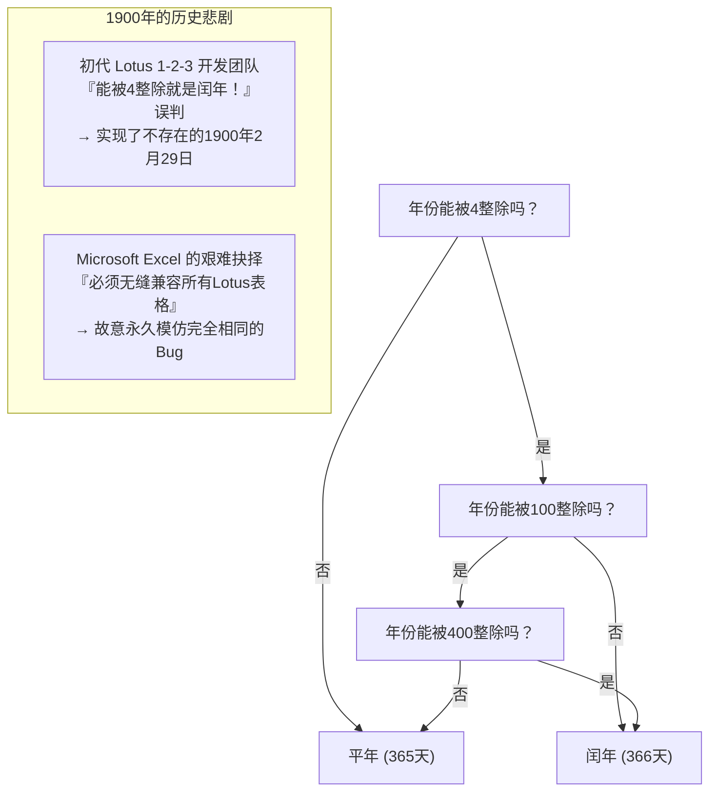

然而，在1980年代前半叶完全统治DOS电子表格市场的绝对霸主《Lotus 1-2-3》的开发团队，在编写代码时遗漏了“整除100的平年例外规则”，误把1900年当成了闰年。因此在Lotus 1-2-3的世界里，凭空诞生了一个虚构的日期——“1900年2月29日”，导致其内部日期序列号（Serial Number）产生了一整天的位移。

作为后来者杀入电子表格市场的微软《Excel》开发团队，随即面临了一道严酷的抉择：究竟是实现一个在数学和历法上完美无瑕的日历系统，还是确保与当时企业界已经生成了数千万份的Lotus 1-2-3财务报表的计算结果保持绝对一致？

比尔·盖茨领导下的微软再次选择了后者。Excel为了让来自Lotus 1-2-3的数据迁移万无一失，毅然决然地选择了**“在自己的代码中也故意完整实现‘1900年2月29日存在’这一严重Bug”**这一不可思议的道路。

读者不妨在手边最新版Microsoft 365的Excel中新建一个单元格，输入公式 `=DATE(1900, 2, 29)` 并回车。令人惊叹的是，即便是搭载了21世纪最新AI能力的现代Excel，也不会返回任何错误，而是面不改色地输出“1900/2/29”这个虚构日期。主动揽下竞品Bug的决定一旦做出，便跨越数十年、甚至跨越世纪而永远无法撤回。

### 3.2 为什么微软直接跳过了“Windows 9”

2014年，微软举办了Windows 8.1继任者的发布会。当时全行业与媒体一致认定新系统将命名为“Windows 9”。然而当微软高管走上舞台时，公布的正式名称却令全世界大跌眼镜——**“Windows 10”**。

为什么版本号“9”被直接凭空跳过了？在官方所宣称的“展现跨时代革新与统一步伐”的营销辞令背后，来自全球开发者社区的逆向工程专家与前微软员工，揭露出了一个极其真实、具有极强说服力的“兼容性地雷”。

原来，在全球流传的无量老旧第三方软件、各类Java类库以及形形色色的软件安装程序中，为了判断当前运行的操作系统版本，充斥着如下大量偷懒省事的祖传代码：

```java
// 全球无数古老软件中泛滥成灾的代码模式
String osName = System.getProperty("os.name");

if (osName.startsWith("Windows 9")) {
    // 命中 Windows 95 或 Windows 98 的陈旧处理逻辑！
    // 强制调用16位兼容模式或读取陈旧的注册表路径
    enableLegacyWin9xMode();
} else {
    // 针对基于NT的现代化操作系统（Windows NT, 2000, XP, 7, 8等）的正常处理
    enableModernNTMode();
}
```

当年写下这段逻辑的程序员，自作聪明地用 `startsWith("Windows 9")` 作为同时快速判定“Windows 95”与“Windows 98”的简写捷径。

设想一下，如果微软循规蹈矩地将新系统命名为“Windows 9”，全球将会发生什么？
当用户把最新顶级配置的电脑买回家装上Windows 9时，全球成千上万款企业关键业务软件与老旧工具会在启动瞬间认定“当前电脑运行的是1995年发布的Windows 95”，从而彻底绕过现代NT内核API，盲目调用DOS时代的Win9x专属逻辑，最终暴毙当场。

“仅仅为了一个名字，绝不能冒让全世界软件大面积瘫痪的风险。”微软对破坏兼容性刻入骨髓的敬畏与恐惧，将“Windows 9”这个名字永远埋葬在了历史的暗面。

### 3.3 未公开API（Undocumented APIs）与诺顿工具箱（Norton Utilities）

1990年代，由赛门铁克（Symantec）出品的系统维护与修复利器《诺顿工具箱》（Norton Utilities），是全球PC用户的装机必备神器。然而对于Windows系统开发团队而言，Norton Utilities却是一个挥之不去的巨大梦魇，堪称当时“最不受规矩的顽劣软件”之典范。

因为像Norton这样深度涉及系统底层的实用工具，根本不满足于微软官方公开发布的Win32 API，而是大量采用了**“直接把手伸进Windows内部未公开数据结构体、调用未导出函数、甚至直接硬编码读取系统DLL内部特定内存偏移量”**的极度危险黑客手法。

雷蒙德·陈在回忆Windows 95的开发历程时，曾生动讲述了团队与Norton Utilities之间展开的惊心动魄的暗中角力。随着Windows 95内部架构的重构升级，内存保护机制与任务管理的内部结构体哪怕发生仅仅1个字节的位移，Norton Utilities就会立刻引发蓝屏死机（BSoD），让整台电脑陷入瘫痪。

微软在此时的抉择，依然不是去声讨“滥用未公开结构的Norton咎由自取”。他们将Norton Utilities的二进制文件全面反汇编，进行了彻头彻尾的逆向工程，精准摸清了Norton到底在读取哪个内存偏移量。随后，微软工程师做出了一个匪夷所思的举动：**在操作系统内部凭空伪造出Norton所期望的未公开虚拟数据结构，并将其分毫不差地摆放在以前完全相同的内存地址上**，以欺骗Norton正常运转。

### 3.4 比尔·盖茨手持霰弹枪的那一天：DOOM与DirectX/WinG创世纪

在Windows 95问世之前，Windows在PC游戏市场的地位堪称惨不忍睹。游戏开发者们无一不把Windows讥讽为“GUI开销极其臃肿、根本不可能用来写动作游戏的废柴办公系统”。当时所有高水准的PC游戏，全都是基于MS-DOS、直接向显卡芯片与声卡（Sound Blaster）的I/O端口硬发指令打造出来的。

这种技术生态的终极象征，便是id Software公司开发的传奇FPS神作《DOOM》（毁灭战士）。在那个年代，DOOM被私下安装在全美乃至全球各大企业的办公电脑中，甚至引发了全美企业生产效率出现可观测波动的社会现象。

比尔·盖茨嗅到了前所未有的危机感：“如果全世界PC用户玩游戏依然需要重启退回到DOS环境，那么Windows 95就绝不可能取得彻底的胜利。我们必须让DOOM在Windows 95上跑起来，而且要跑得比DOS版更加狂暴迅捷！”

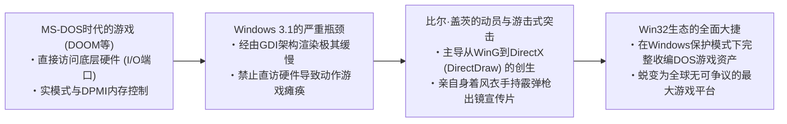

盖茨紧急抽调公司内部的顶尖黑客工程师，下达死命令开发能将直接操作硬件的DOS游戏指令在Windows保护模式下进行高速仿真并加速的专用图形库“WinG”，进而催生了代号为“曼哈顿工程（Manhattan Project）”的后继者——**DirectX**。

盖茨甚至亲自披上一袭风衣，手持双管霰弹枪，合成嵌入到DOOM的游戏画面中拍摄了一段载入史册的传奇宣传片，向全世界咆哮：“Windows 95才是终极游戏平台！”当年为了在Windows的受控保护环境下驯服DOS游戏狂野的硬件直控行为而积累下的硬核工程血统，奠定了日后Windows坚不可摧的超强多媒体向后兼容基石。

---

## 第4章：支撑现代Windows的庞大要塞“AppCompat（Application Compatibility）”

在Windows 95时代，各类兼容性Hack还只是作为点状的特例代码散落在操作系统的各个模块中。但到了软件数量呈现爆炸式增长的Windows 2000与Windows XP时代，这种随手打补丁的粗放模式走到了死胡同。操作系统核心源码中充斥着为第三方应用擦屁股的条件分支，系统维护性濒临崩溃。

面对这一空前危机，微软的天才架构师们破釜沉舟，设计出了一套一直沿用至当今Windows 11的全球最高水平兼容性中枢引擎——**“Application Compatibility（AppCompat，应用程序兼容性）”子系统**。

### 4.1 AppCompat子系统的宏观架构

AppCompat子系统的本质，简而言之就是**“当目标应用程序的二进制代码被载入内存的瞬间，操作系统实时拦截检测其身份特征，并在应用程序与操作系统内核之间动态插拔透明的‘伪装层（Shim）’的智能拦截系统”**。

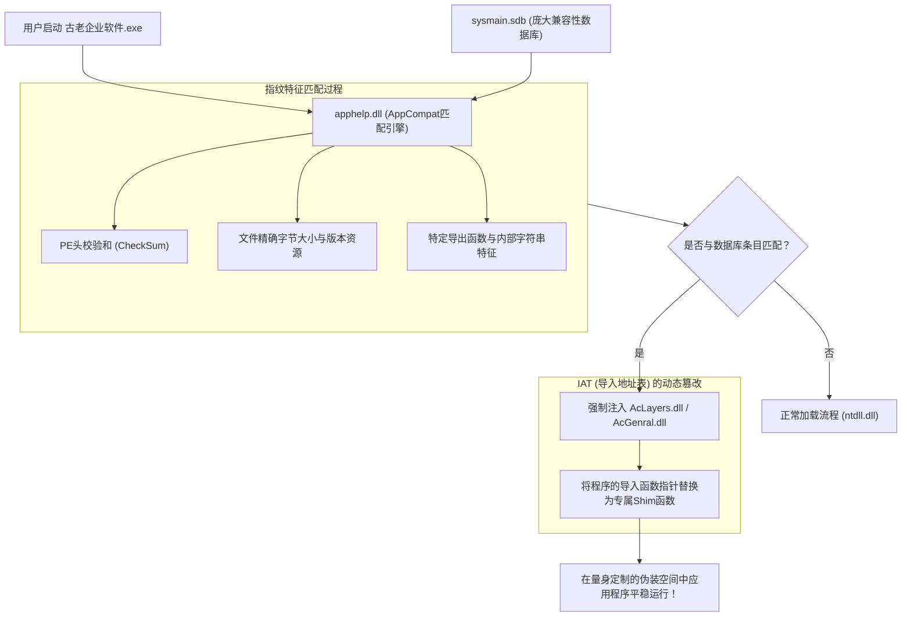

当用户双击一个应用程序的EXE文件时，Windows的进程创建机制（`ntdll.dll` 内部的核心例程）并不会直接将控制权移交给程序，而是率先调用 **`apphelp.dll`**。

`apphelp.dll` 随即高速扫描操作系统内部内置的超大型二进制兼容性数据库 **`sysmain.sdb`**，严格比对“当前准备启动的这个程序，是否是历史档案中被记录需要实施特殊救济的老旧软件”。一旦比对命中，操作系统加载器（OS Loader）在加载常规系统动态链接库（如 `kernel32.dll` 或 `user32.dll`）之前，会强行将兼容层专用模块 **`AcLayers.dll`** 或 **`AcGenral.dll`** 注入到该进程的虚拟内存地址空间中。

### 4.2 Shim引擎：基于IAT Hook的API动态替换机制

那么，被强行注入的Shim引擎究竟使用了什么黑魔法来瞒天过海？其核心技术，正是基于Windows标准可执行文件格式PE（Portable Executable）的 **“IAT（Import Address Table，导入地址表）Hook”**。

当一个Windows程序需要调用外部DLL中的函数（例如 `GetVersionEx` 或 `GetDiskFreeSpace`）时，编译生成的机器指令中并不会硬编码写死外部DLL函数在内存中的物理绝对地址。当程序被操作系统启动时，系统加载器会读取各依赖DLL的实际装载地址，并将这些真实的函数物理指针填入该EXE内存镜像中的“IAT表（函数指针数组）”。程序在运行中始终是通过查询这张IAT表来完成对系统API的间接跳转。

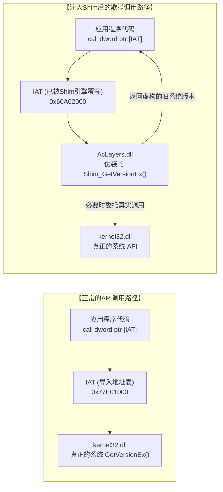

Shim引擎巧妙地利用了这一调用中介机制。在程序代码正式执行之前，切入进程地址空间的Shim引擎会临时将目标IAT内存页的内存保护属性通过 `VirtualProtect` 改为 `PAGE_READWRITE`，**“将IAT表中原本指向系统官方API的真实指针，粗暴地改写为Shim引擎内部精心编写的欺瞒函数（Shim函数）的入口地址”**。

我们可以用一段现代C/C++概念性伪代码来再现这一过程：

```c
// 基于IAT Hook进行Shim注入的概念验证代码
#include <windows.h>
#include <imagehlp.h>

// 伪造的GetVersionEx函数（Shim的核心实体）
BOOL WINAPI Shim_GetVersionExA(LPOSVERSIONINFOA lpVersionInformation)
{
    // 调用真实底层API获取真实的基准系统参数
    typedef BOOL (WINAPI *PFN_GETVER)(LPOSVERSIONINFOA);
    HMODULE hKernel = GetModuleHandleA("kernel32.dll");
    PFN_GETVER pfnRealGetVer = (PFN_GETVER)GetProcAddress(hKernel, "GetVersionExA");
    
    BOOL bResult = pfnRealGetVer(lpVersionInformation);
    
    // 【实施战略欺诈】
    // 面不改色地欺骗应用程序：“当前系统是标准的 Windows 95 (Major: 4, Minor: 0)”
    lpVersionInformation->dwMajorVersion = 4;
    lpVersionInformation->dwMinorVersion = 0;
    lpVersionInformation->dwBuildNumber = 950;
    lpVersionInformation->dwPlatformId = VER_PLATFORM_WIN32_WINDOWS;
    strcpy(lpVersionInformation->szCSDVersion, "");

    return TRUE; // 应用程序毫不怀疑地坚信自己正跑在Windows 95上，欣然继续工作
}

// 遍历PE文件IAT表并植入Hook的底层例程
void InstallShimHook(HMODULE hAppModule, LPCSTR targetDll, LPCSTR targetFunc, PVOID newFuncAddress)
{
    ULONG size;
    // 获取PE头中的导入目录表 (Import Directory)
    PIMAGE_IMPORT_DESCRIPTOR pImportDesc = (PIMAGE_IMPORT_DESCRIPTOR)
        ImageDirectoryEntryToData(hAppModule, TRUE, IMAGE_DIRECTORY_ENTRY_IMPORT, &size);

    while (pImportDesc->Name) {
        LPCSTR dllName = (LPCSTR)((PBYTE)hAppModule + pImportDesc->Name);
        if (_stricmp(dllName, targetDll) == 0) {
            // 查找到目标DLL（如kernel32.dll）对应的Thunk链表
            PIMAGE_THUNK_DATA pThunk = (PIMAGE_THUNK_DATA)((PBYTE)hAppModule + pImportDesc->FirstThunk);
            while (pThunk->u1.Function) {
                PROC* ppfn = (PROC*)&pThunk->u1.Function;
                // 一旦命中目标API函数指针，立即实施内存覆写
                DWORD oldProtect;
                VirtualProtect(ppfn, sizeof(PROC), PAGE_READWRITE, &oldProtect);
                *ppfn = (PROC)newFuncAddress; // 狸猫换太子，替换为伪装函数地址！
                VirtualProtect(ppfn, sizeof(PROC), oldProtect, &oldProtect);
                break;
            }
        }
        pImportDesc++;
    }
}
```

正是依赖这种登峰造极的Hook拦截机制，无需对老旧程序的二进制本体修改哪怕1个字节，也无需让操作系统NT内核的主干逻辑受到丝毫污染，Windows就能够精准把特定的目标程序关进一个“量身定制、完美调校的虚拟历史时空”中。

### 4.3 神秘的庞大二进制文件 `sysmain.sdb`（Shim Database）

在这套精密运转的AppCompat子系统背后充当大脑中枢的，正是静静躺在每一台现代Windows系统的 `C:\Windows\AppPatch\` 目录下的核心二进制文件——**`sysmain.sdb`**。

该文件采用了微软专有的结构化二进制数据库格式（SDB），其内部浓缩收录了全球范围内上至知名跨国企业的商用生产力套装、行业专用套件，下至个人共享软件、古董光盘游戏乃至各类企业内部管理工具，**总计涵盖数万至数十万款历史应用程序的“专属拯救药方”**。

在海量应用的世界里，仅仅根据文件名叫 `setup.exe` 就盲目施加Shim显然会铸成大错，导致现代最新的安装程序出现误判崩溃。因此，`sysmain.sdb` 的匹配引擎引入了一套极其精密严苛的“多维数字指纹（Fingerprinting）”鉴别体系：

1. **文件名与其所在的绝对/相对路径特征**
2. **精确到单字节的文件体积大小（File Size）**
3. **PE头部的链接器时间戳（Linker Timestamp）**
4. **PE校验和（CheckSum）**
5. **内嵌版本资源字符串（CompanyName, ProductName, FileVersion, LegalCopyright 等）**
6. **特定代码段（Section）的哈希校验值与函数导出表结构特征**

设想一下，某位用户将一张2001年出版的古董多媒体百科全书光盘塞进Windows 11电脑的光驱。`apphelp.dll` 会在毫秒级时间内提取该安装程序的综合数字指纹，并在 `sysmain.sdb` 庞大的历史病历库中完成检索，瞬间诊断出：
“该软件针对Windows 2000编写，内部依赖固定的堆地址对齐方式，且在运行时试图直接向注册表系统核心区写入数据。”
随后，系统加载器会毫不迟疑地为此进程同时挂接挂载数十种专属Shim，为其构筑起一套坚不可摧的兼容虚拟庇护所。

---

## 第5章：经典Shim（欺骗的艺术）全景图谱

在现代Windows内部内置的Shim种类多达数百种。它们是微软工程师为了替历史上程序员所犯下的形形色色匪夷所思的低级错误买单，而总结沉淀出的一整套欺诈与救赎的大全。

### 5.1 `VersionLie`: “如您所愿，我就是Windows 95”

在所有Shim中，最为古老传统、同时也是被使用得最为频繁的，当属 **`VersionLie`** （版本欺瞒）。

许多程序员在编写软件启动逻辑时，为了检验“当前操作系统是否属于自家软件支持的环境”，通常会调用 `GetVersion` 或 `GetVersionEx` API。然而令人扼腕的是，大量老旧代码都写成了如下自掘坟墓的死板形式：

```c
// 典型的自杀式版本检测代码
OSVERSIONINFO vi;
GetVersionEx(&vi);

// 认死理、认定“只能运行在Windows 95”上的死板判断
if (vi.dwMajorVersion == 4 && vi.dwMinorVersion == 0) {
    // 正常启动
} else {
    MessageBox(NULL, "本软件专为Windows 95设计，无法在较新的操作系统上运行。", "错误", MB_OK);
    ExitProcess(1); // 毅然决然自绝生路！
}
```

这类软件的悲剧在于，未来即便微软推出了性能强悍十倍的“Windows XP（Major: 5）”、“Windows 7（Major: 6）”甚至“Windows 10（Major: 10）”，它仅仅因为判定到主版本号“不等于4”，就会立刻弹窗报错并强行自我了断。

为解救这类自绝于世的软件，`VersionLie` 应运而生。当挂载了该Shim的进程调用 `GetVersionEx` 时，Windows 11的系统底层会面带微笑、面不改色地向其返回**“当前系统确系正统Windows 95（Major: 4, Minor: 0）”**的伪造结构体。应用程序得到心满意足的答复，在最新的多核CPU与高速NVMe SSD之上，沉浸在自以为身处Windows 95的粉红幻想中欢快地运转起来。

### 5.2 `EmulateGetDiskFreeSpace`: 拯救因硬盘超过2GB而溢出的程序

在1990年代中叶，主流计算机硬盘的容量普遍在几百兆字节到一两吉字节（GB）之间。当时Win32标准API `GetDiskFreeSpace` 会返回每个簇的扇区数、每个扇区的字节数以及空闲簇总数等信息，这些数值在底层均采用32位有符号整数（Signed 32-bit Integer）表示。

当年许多程序员在用该API的返回值计算磁盘剩余字节容量时，写出了如下看似理所当然的公式：

$$\text{FreeBytes} = \text{SectorsPerCluster} \times \text{BytesPerSector} \times \text{NumberOfFreeClusters}$$

然而，当物理硬盘的剩余空间突破了 **2GB（$2^{31} - 1$ 字节）** 的物理大关时，32位有符号整型乘法的结果瞬间发生了**严重的算术符号位溢出**，原本庞大的正数瞬间翻转为**负数（负数百兆字节）**。

其直接后果是：当用户在装有一块大容量硬盘的崭新电脑上尝试安装老旧游戏或老版Office时，安装程序会尖叫着弹窗：“当前磁盘可用空间仅为 -500MB，磁盘空间严重不足，无法继续安装”，随后直接强退。

为了平息这场灾难，微软打造了专属Shim——**`EmulateGetDiskFreeSpace`**。无论底层物理磁盘实际上是几个TB容量的超大固态硬盘，当命中该Shim的目标程序向系统询问剩余空间时，系统都会极其贴心地撒一个弥天大谎：**“报告主人，当前磁盘剩余空间刚好是绝不会引发整型溢出的极限临界值——2,147,151,872字节（约合1.99GB）。”** 安装程序一看“空间很充足嘛”，便欢天喜地地继续完成了安装。

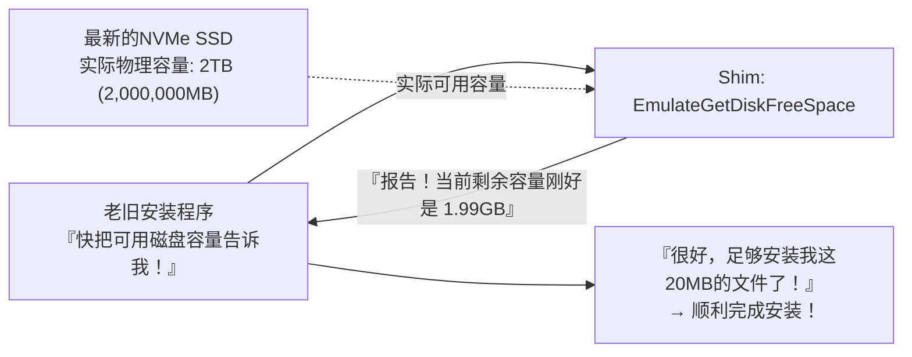

### 5.3 `VirtualRegistry` 与 `VirtualStore`: 破解UAC特权壁垒的隐形桥梁

2006年微软发布Windows Vista，引入了划时代的安全体系变革——**“用户账户控制（User Account Control，简称UAC）”**。

在早期的Windows 95/98和XP时代，所有用户日常几乎全都是在无拘无束的系统管理员（Administrator）权限下登录运行。当时浩如烟海的各类软件也毫无顾忌，心安理得地把自己的配置文件、用户存档、游戏高分榜随手直接写进系统的神圣核心目录 `C:\Program Files` 或是注册表的全局机密节点 `HKEY_LOCAL_MACHINE\Software`。

但在Vista及后续时代严格的安全红线之下，普通标准用户权限若试图向这些受保护的核心系统目录写入数据，会遭到系统无情的拒绝（返回 `ACCESS_DENIED`）。如果直接按章办事，全世界数以百万计的历史存量软件在尝试保存设置时便会集体暴毙，屏幕上将是一片哀鸿遍野。

为了避免历史重演，Windows Vista在内核与I/O管理器底层无缝嵌入了**“VirtualStore（文件与注册表虚拟化Shim体系）”**。

当老旧程序在没有管理员权限的情况下试图向 `C:\Program Files\Game\save.dat` 写入存档的瞬间，操作系统的I/O子系统不仅不会报错，反而会在暗中将这次写操作悄悄劫持并重定向至当前用户专属的安全沙盒路径：
`C:\Users\<用户名>\AppData\Local\VirtualStore\Program Files\Game\save.dat`。

当该程序下一次尝试读取这个文件时，系统又会不动声色地从VirtualStore沙盒目录中取出数据返回给它。老旧应用程序至死都坚信自己正直接君临在神圣的Program Files目录之上呼风唤雨，殊不知自己早已在系统精心编织的独立沙盒中被妥善隔离、安然入梦。

### 5.4 `DXPrimaryBltPunt`: 旧时代DirectDraw调色板崩塌与高刷重整

在从Windows 95到XP初期的黄金年代，绝大多数经典2D电脑游戏（如初代《帝国时代》以及数不胜数的经典PC RPG）都是深度依仗DirectX早期的“DirectDraw”组件进行画面渲染的。当时这些游戏是建立在256色（8位彩色调色板模式）的基础假设之上，游戏逻辑往往直接粗暴地改写显卡物理主表面（Primary Surface / VRAM）的硬件调色板寄存器，来实现画面淡入淡出或特定的全屏特效。

然而，在当代高精尖GPU与现代Windows图形合成栈（DWM: Desktop Window Manager）的架构中，整个桌面早已经被当作32位TrueColor的高清纹理送入三维图形渲染管线中统一光栅化与合成。硬件层面对256色物理调色板的直接篡改，早已是被时代淘汰数十年的远古恐龙。

如果不施加任何保护手段而在现代PC上直接启动老旧DirectDraw游戏，调色板同步将彻底崩塌，整张屏幕会瞬间沦为充斥着狂乱荧光噪点的抽象派赛博迷幻废墟；又或是由于垂直同步与刷新率的彻底脱节，游戏帧率飙升到每秒几千帧导致游戏像快进十倍一样根本无法操控。

化解这种尴尬局面的，正是以 **`DXPrimaryBltPunt`** 和 **`ForceDirectDrawEmulation`** 为代表的图形专属Shim矩阵。这些Shim在底层直接截获DirectDraw发出的过时硬件绘制指令，在显存深处实时将其转换为现代Direct3D能够理解的标准纹理流，进而平稳接入DWM的现代化三维合成管线。三十年前细腻的手绘像素风艺术，如今能够在最新的4K乃至8K超清显示器上分毫不差地原味重现，全凭这套极其精妙的高维图形欺瞒机制在幕后负重前行。

---

## 第6章：跨越64位与ARM架构的时代远航 —— WOW64与终极指令级仿真

当底层的物理CPU硬件架构本身发生翻天覆地的历史性世代更迭时，单纯依靠在API层面的小打小闹和函数拦截显然已经无法抵御巨浪。对此，Windows祭出的对策展现出了更为惊人的蛮力与魄力：**“既然环境变了，那就在新操作系统内部，完完整整地再塞进一个旧操作系统。”**

### 6.1 从NTVDM到WOW64：彻底重构的镜像平行宇宙

在从16位向32位过渡的激荡岁月里，Windows NT通过提供 **NTVDM（NT Virtual DOS Machine）**，深度调用8086微处理器的虚拟86模式（V86 Mode），实现了在现代NT保护内核下稳定运行远古DOS和Win16应用的神迹。

而在2000年代中叶，随着AMD64（x64）架构横空出世，整个计算世界面临从32位向64位的历史性大迁徙。面对这道鸿沟，微软重磅祭出了 **“WOW64（Windows 32-bit On Windows 64-bit）”** 子系统。

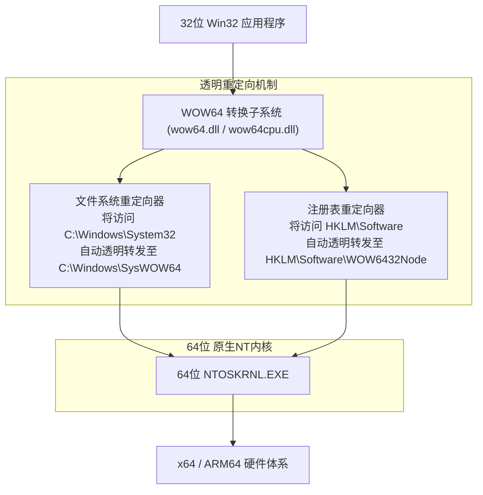

WOW64最令人叹为观止的核心特质，在于它为所有32位应用程序打造了一个**“在文件系统与注册表维度完全镜像隔离的平行宇宙”**：

- **文件系统重定向器（File System Redirection）**:
  在纯正的64位Windows中，存放原生64位系统核心DLL的目录依然是具有历史包袱名字的 `C:\Windows\System32`。然而，当一个旧的32位应用程序尝试寻址这个目录时，操作系统在背后悄无声息地将寻址目标重定向到了 `C:\Windows\SysWOW64`（反直觉的是，这个目录名字里虽然带着64，装的反而是专门为兼容32位程序准备的32位系统库）。
- **注册表反射与重定向（Registry Reflection）**:
  同理，当32位程序尝试读写 `HKEY_LOCAL_MACHINE\Software` 时，WOW64会自动将请求拦截并隔离转送至 `HKEY_LOCAL_MACHINE\Software\WOW6432Node` 子树之下。

正是凭借这套如同《盗梦空间》般精密咬合的多层平行世界，诞生于1998年的32位应用程序甚至根本察觉不到自己正运行在纯64位的当代超强内核之上，继续泰然自若地读取着它心爱的System32与注册表。

### 6.2 挺进ARM64时代与Prism终极仿真引擎

在当下的计算舞台上，战火最炽烈的前沿阵地无疑是底层硬件由传统的x86/x64向 **ARM64（如高通骁龙X Elite等）** 的历史性迁跃。

回顾过往，微软并非没有走过弯路。2012年，微软曾推出过试水性质的“Windows RT”，在ARM架构上完全禁止了既有Win32桌面老应用的运行，企图效仿苹果实行“快刀斩乱麻的激进断代”。然而市场的反击犹如雷霆万钧：全行业极其冷酷地唾弃了Windows RT，最终以微软直接计提近十亿美元的巨额资产减记惨淡收场。这记响亮的耳光让微软高层痛定思痛，彻底刻骨铭心地重温了一条不可逾越的铁律：**“哪怕是在ARM之上，只要跑不了既有的x86/x64老软件，那就根本不配叫Windows！”**

于是在最新一代基于ARM的Windows 11中，微软倾注全力打造了尖端动态二进制翻译引擎——**“Prism”**。Prism不仅能够实时解析x86/x64复杂的变长机器指令集，将其即时编译（JIT）转换为高能效的ARM64等价指令流，更通过内置深度进化的指令块优化缓存体系，将翻译开销降到了极致，赋予了老旧程序近乎原生般的澎湃运行性能。

无论底层的硬件芯片架构发生何等颠覆性的裂变，“只要轻轻双击图标，三十年前的老软件就必须照常弹窗运行”——这份被烙印在骨髓深处的承诺，是微软在跨越无数血泪试错后铸就的绝对意志。

---

## 第7章：各成一派的架构哲学 —— Windows vs Apple (macOS) vs Linux

面对“如何对待历史遗留应用”这一终极命题，当今世界三大操作系统阵营交出了截然不同的答卷。通过透视这种哲学取向的根本分歧，Windows在人类软件史上的独特异质性与不可替代性才得以真正凸显。

### 7.1 Apple（外科手术式断代）：为了明天，敢于烧毁昨天的一切

从苹果传奇创始人史蒂夫·乔布斯，到如今的蒂姆·库克时代，苹果一脉相承的灵魂哲学是纯正的**“为了追求极致的未来用户体验，过去的遗留资产必须坚决无情地焚毁（Scorched Earth Policy，焦土政策）”**。

翻开苹果的发展史，就是一部由一次次充满戏剧性且冷酷的“断绝”谱写的篇章：
- **彻底抛弃Classic Mac OS**: 从Mac OS 9到基于NeXT/Unix体系的Mac OS X完成血腥大换血。曾经作为过渡缓冲垫的旧API“Carbon”，在完成使命后被彻底送入火葬场。
- **底层硬件指令集的激进四连跳**: 从680x0到PowerPC，再到Intel x86，直至如今傲视群雄的Apple Silicon (M系列芯片)。每一次平台迁跃，苹果都会推出过渡仿真层（如Mac 68K模拟器、第一代Rosetta、Rosetta 2），但无一例外都会在短短几年内直接从操作系统中彻底抹除该仿真引擎，亲手掐死老旧二进制程序的生命线。
- **macOS Catalina对32位应用的无情绞杀**: 2019年发布的macOS Catalina中，苹果断然将32位二进制执行环境整体拔除。昨天还在正常使用的老旧音频生产力插件与经典游戏，一夜之间永远化为废铁。

苹果的立场清晰而傲慢：“开发者必须使用最新的Xcode，用最新版的Swift语言重写业务逻辑，针对最新的macOS系统重新编译。做不到这点的懒惰历史垃圾，理应从苹果神圣的生态系统中光荣出局。”这种铁血手腕换来的是macOS代码库始终能够维持极高的纯洁度，系统轻巧敏捷、优雅非凡；但与此相对，全球用户与开发者必须被迫承担周期性“推倒重来”的沉重赋税。

### 7.2 Linux（Linus的戒律）：“Never break userspace!”的光芒与阴影

作为整个开源世界的精神图腾，林纳斯·托瓦兹（Linus Torvalds）在主导Linux内核开发时，立下了一条与Windows团队异曲同工的绝对军规——**“Never break userspace!（绝不破坏用户空间！）”**。

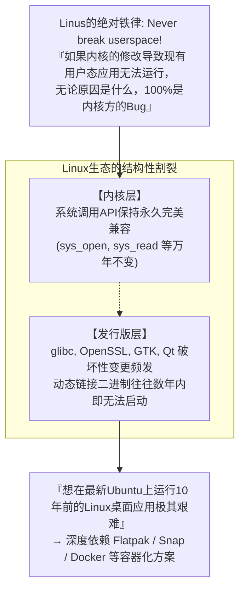

无论某个提交给内核的Patch在数学逻辑上多么优雅、在性能上多么惊艳，只要它在合并后导致现存的某款普通用户态程序无法运行，林纳斯就会在公开邮件列表里掀起狂风暴雨般的雷霆之怒，毫不犹豫地将该提交瞬间回滚（Revert）。在这一维度上，Linux内核的处世哲学与Windows完全达成了共识。

然而，Linux桌面生态的阿喀琉斯之踵在于：它缺乏一个如同微软那样拥有绝对统治力与调解权的中心化仲裁者。虽然底层的内核系统调用（Syscalls）坚如磐石、万年不破，但发行版层面的用户态基础动态库（如 `glibc`、`libssl`、各类GTK/Qt图形库）却极为频繁地破坏向后兼容性。其残酷的现实结果是：**想在最新的Ubuntu系统上直接运行一个10年前编译的带动态链接的Linux桌面软件，难度高如登天**。Linux在内核层级恪守了兼容承诺，却在宏观生态的极度碎片化中败下阵来，始终无法企及“30年前编译的应用即开即用”的奇迹境地。

### 7.3 Windows（累积式包容）：疯狂的层层地质沉淀

与前两者截然不同，Windows走出了一条独步天下的道路——**“累积式包容（Cumulative Inclusion）”**。

微软绝不轻言放弃任何一个过去的API和子系统，而是像地质断层一样，把崭新的技术层层堆叠在历史的基岩之上。在Win16的基石上浇筑Win32，在Win32的骨架上嫁接.NET框架，在其上再强行铺设WinRT/UWP；当发现UWP生态遇冷无法撼动既有格局时，又掉头在Win32的牢固地基上重新构筑全新的Windows App SDK（WinUI 3）。

其终极结果是：Windows蜕变成了当今地球上代码体系最繁重复杂、体积最庞大无朋的软件怪兽。但作为这笔疯狂投入的报偿，它达成了**人类计算史上前所未有的伟大奇迹——让跨越数十个时代的不同历史软件，在同一个桌面上并肩欢畅起舞**。

| 比较维度 | Microsoft (Windows) | Apple (macOS) | Linux (桌面版) |
| :--- | :--- | :--- | :--- |
| **基本兼容性哲学** | **累积式包容 (Accumulation)**<br/>将过去的一切彻底揽入怀中 | **外科手术式断代 (Disruption)**<br/>定期对过去的遗留资产实施焦土政策 | **内核坚守与自由放任**<br/>仅死守内核边界，上层碎片化分崩离析 |
| **最高指令 (Prime Directive)** | "Don't break old apps"（绝不破坏旧应用） | "Embrace the modern platform"（全面拥抱现代化平台） | "Never break userspace"（绝不破坏用户空间，仅限内核） |
| **兼容性维持跨度** | **30年以上** (Win32/DOS持续可用) | **约3〜5年** (过渡期结束即刻废弃) | 内核长治久安，GUI桌面应用命途多舛 |
| **32位二进制现状** | **最新Win11依然完美运行** (WOW64) | **Catalina (2019) 起彻底格杀勿论** | 需手动安装配置多架构类库，部分可用 |
| **对开发者的诉求** | 开发者什么都不用做，代码自然继续跑 | 开发者必须定期重写代码、重编译适配 | 必须针对不同发行版与新环境持续重新打包 |
| **架构纯洁度** | 极其硬核臃肿，数亿行代码如地质层层累积 | 极度纯净现代，轻装上阵无包袱 | 内核高度模块化，但应用层面极度碎片化 |

---

## 第8章：平台经济学 —— 为什么向后兼容性是“最宽广的护城河（Moat）”

究竟是什么促使比尔·盖茨以及历任微软掌门人，几十年来不惜代价逼迫开发团队吞下所有恶心与苦楚，坚持推行这种硬核到自虐的工程路线？答案绝不在于工程审美的个人偏好，而深植于冷酷的**“商业模式与平台经济学逻辑”**之中。

### 8.1 比尔·盖茨的商业信条：操作系统的价值等于“可运行软件的总和”

比尔·盖茨在创立微软之初，就以超越时代的前瞻洞察力参透了平台型商业的本质底层逻辑：

> **平台价值基本公理**:
> 操作系统本身的软件价值，并不取决于系统单独自带了多么华丽的功能。
> 操作系统的真正价值，**取决于“在这个平台上能够稳定运行的全人类软件资产的总和”**。

无论你开发出的下一代操作系统在计算机科学理论上多么先进、内存利用率多么卓绝、交互界面多么精美绝伦，只要用户赖以维系日常生计的关键工作软件跑不起来，它在市场上的实际商业价值就瞬间归零。用户掏出真金白银购买的从来都不是一个名叫“操作系统”的空盒子，而是盒子里面装载的各种各样能为他们创造生产力的实用软件。


只要能够维持100%的向后兼容性，在过去30年间全球数千万程序员为Windows平台呕心沥血编写出的数百亿行代码、价值数万亿美元的软件资产，**就会一分不差地被自动继承、直接加计为“下一代Windows操作系统的核心增量价值”**。

任凭竞争对手macOS或Linux在技术布道时如何声嘶力竭地鼓吹架构优势，只要大客户一句“我们公司用了20年的定制进销存管理系统能在你们系统上跑吗？”就能让整场商务竞标在三秒钟之内尘埃落定。向后兼容性，正是任何竞争对手穷尽一切资源与智慧都绝不可能正面攻克的终极商业护城河（Moat）。

### 8.2 企业级市场的绝对统治与深度锁定

特别是在利润最为丰厚的企业（B端）市场中，这一战略展现出了摧枯拉朽的支配力量。

在世界500强企业、政府核心机关、现代制造业车间以及跨国金融机构的机房深处，长年稳定运转着过去数十年间投入数千万乃至数十亿美元定制开发的庞大企业内部系统（例如基于VB6编写的生产调度核心、基于C++编写的特殊ActiveX控制组件等）。当年编写这些核心代码的软件外包公司可能早已倒闭注销，系统连最初的架构设计文档都不复存在，成了没人敢动哪怕一个字符却维系着整条产线运转的“活化石”。

如果新版Windows打破了兼容性，冷酷地通知客户：“抱歉，这套老系统不能在新电脑上跑了，请贵公司准备几千万预算，找人基于最新的Web框架重构吧。”企业CIO（首席信息官）必定勃然大怒，不仅会无限期冻结全公司的Windows升级计划，甚至会立刻启动评估逃离微软生态的替代方案。

然而，Windows挥舞着AppCompat的魔法权杖，温和地在CIO耳边细语：“您什么都不需要改动。哪怕买下最新款的PC，老系统插上电源依然完好如初地跑给您看。”在企业高管眼中，这是世界上最安心、最理性、性价比最高的天籁之音。就这样，全球庞大的企业界被彻底、永久地绑定在了Windows构建的深厚生态底座之上，再也无法自拔。

### 8.3 阻碍颠覆性创新的“胜利者的绞索”

然而，这场在商业上取得无可撼动统治地位的辉煌胜利，最终也在不知不觉间化作了一副反噬微软自身的**“胜利者的绞索（Success Trap）”**。

2010年代，随着智能手机引发移动互联网浪潮，iOS与Android迅速崛起。微软为了推动Windows走向现代化、轻量化与高安全性，斥巨资全力打造了彻底沙盒化、现代化权限隔离的新一代应用体系——UWP（Universal Windows Platform），并雄心勃勃地计划分阶段彻底淘汰传统的Win32架构。

然而，无论是全球广大独立软件开发者还是企业客户，对UWP的号召均表现出了惊人一致的冷漠与无视。大家发出了灵魂拷问：“既然原汁原味的传统Win32程序在最新的Windows 10和11上跑得既飞快又稳健，没有任何功能限制，那我凭什么要耗费海量人力物力去移植到一个功能处处受限、过去的资产全部作废的新框框里？”

这是技术史上最讽刺的自相矛盾——**“正因为Win32被微软打磨得太过坚不可摧、太具兼容生命力，最终导致连微软自己都根本杀不死Win32！”** 陷入自家中毒泥潭的微软最终不得不黯然收场，在事实上放弃了激进推进纯UWP路线，转而允许开发者将传统Win32应用原封不动地打包上传至微软应用商店，并将最新的现代UI框架WinUI 3重新移植回Win32这片古老的地基之上。微软亲手筑起的举世无双的兼容性长城，最终也成为了横亘在自身革新之路上最难逾越的叹息之墙。

---

## 第9章：荣耀背后的代价 —— 极度膨胀的技术债务与安全险隘

替全世界所有写得一塌糊涂的代码背负宿命、守护历史上全部的数字遗存，绝不是一件免费的盛宴。作为这一宏伟执念的对价，Windows工程团队不得不日复一日地与整个软件工程界最沉重、最残酷的“技术债务”进行永无止境的殊死搏斗。

### 9.1 数亿行代码库与天文数字级的测试验证矩阵

据信，当今Windows操作系统的源代码总量已经突破了惊人的 **数亿行** 之巨。而在整个工程体系中，最令人窒息的梦魇，莫过于每一次为Windows编译生成崭新构建（Build）时，所必须履行的那个堪比宇宙星辰般庞大繁复的测试验证矩阵（Test Matrix）。

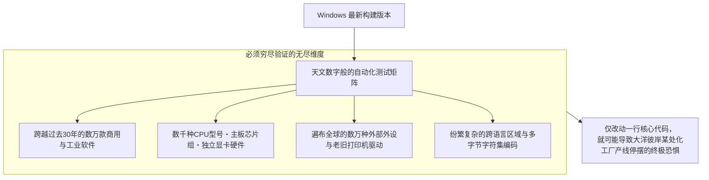

在Windows最核心的内核或底层调度层中，哪怕仅仅是出于安全防范的目的增加了一处看似微不足道的指针判空校验，或是微调了某把锁的获取顺序，都有可能引发连锁反应，导致世界某个偏远角落的现代化无人工厂中一套使用了30年的流水线控制程序发生不可预期的死锁并瞬间趴窝。

为了直面并驱散这份深重的恐惧，微软在雷德蒙德园区深处打造了由数万台真实物理硬件与数千台虚拟化集群组成的极其壮观的自动化测试实验室。每当新的系统变更合入，海量的历史老旧软件会被自动化脚本逐个唤醒、校验其窗口能否正常绘制弹出，这套工程吞吐量堪称人类软件测试工业的奇观。

### 9.2 遗留老旧API滋生的系统安全火山口

然而，在所有技术债务中，最为致命、代价最为惨痛的维度当属 **信息安全**。

在1990年代早期设计的大量Win32老旧API，诞生于互联网全面普及前夕的“田园牧歌时代”。在那个时代的设计思想中，几乎不存在应对恶意网络攻击的缓冲区溢出防御概念，进程间的特权边界也极其模糊松散。但出于对向后兼容性的绝对承诺，微软绝无可能将这些千疮百孔的陈旧接口一刀切地直接物理删除。

全球顶尖的黑客与APT攻击组织，最热衷于钻营挖掘的，正是这套“为了向后兼容而永久苟活的古老API”以及“各层兼容性Shim转换过程中的边缘逻辑盲区”。为了拯救30年前的旧软件而保留的温情善意，在客观上不断持续撕裂着整个现代操作系统的受攻击面（Attack Surface），成为了现代防御体系中难以愈合的慢性伤口。

### 9.3 Longhorn项目的悲壮解体与“MinWin”凤凰涅槃

这种对兼容性与庞杂新特性的无节制堆叠与沉淀，在2000年代中叶终于迎来了震撼整个IT工业界的毁灭性崩塌——那便是臭名昭著的 **“Longhorn项目大溃败”**。

在当年作为Windows XP继任者被寄予厚望的Longhorn操作系统开发进程中，无数野心勃勃的宏大新架构与数十年沉淀下来的臃肿遗留代码错综复杂地死死绞杀在一起，彻底沦为了全人类历史上最混乱的意大利面条式巨型代码堆。每日代码构建无休止地损坏，整个项目的推进速度跌至冰点，数千名工程师陷入泥潭，整个项目最终在全世界的众目睽睽之下彻底空中解体。

2004年，微软管理层痛定思痛，做出了痛苦万分的断腕决定：“彻底重置Longhorn项目（Longhorn Reset）”。数千名顶尖工程师过去数年写下的海量全新代码被直接扔进垃圾桶，整个团队重新退守至当时相对坚固干净的“Windows Server 2003 SP1”代码基底之上重新出发（这套重构后的成果最终演变成了后来的Windows Vista）。

经历过这次刻骨铭心的毁灭性灾难洗礼后，Windows团队痛定思痛，启动了代号为 **“MinWin”** 的史诗级架构解耦工程。他们成功将操作系统最核心、最精纯的微型内核彻底独立抽离出来，强力斩断了其与上层繁杂业务兼容层之间的黏连依赖。Windows在今天之所以能够历经三十年狂风骤雨依然巍然挺立，正是因为其在经历过这场地狱般的自我重构淬炼后，重新画清了底层架构的生死红线。

---

## 结论：献给硬核工程师们的崇高赞歌 —— 在“能跑”这一奇迹上挺立的现代文明

在我们的日常生活中，早已习惯了这一切的理所当然：写字楼里的办公PC、大型三甲医院的HIS挂号诊断终端、各大银行网点默默吞吐纸币的ATM机、地铁与铁路的精密调度大屏，乃至现代化智能制造流水线上的数控机床——在支撑着现代人类文明运转的每一根神经末梢深处，几乎毫无例外地跳动着一颗Windows的心脏。

试想一下：如果微软当年也是一所言必称教科书规范、对“代码洁癖”奉若神明的象牙塔信徒，如果微软也像苹果那样每隔三五年就雷厉风行地对过往资产实施无情斩首，我们今天所处的现代商业社会将会陷入何等恐怖的深渊？

全球将有数以百万计的实体工厂瞬间停摆断供，无数中小企业会被迫在一次次毫无产出的软件推倒重写中耗尽资金链走向倒闭破产，医疗系统与公共基础设施将陷入无休止的剧烈动荡。现代全球化商业文明与信息化社会之所以能够如此平稳、坚韧且不知疲倦地持续向前飞驰，其深层动力正是由于Windows **“以一己之躯，将全世界程序员三十年来所犯下的全部偷懒、误解、Bug以及所有历史的沉重遗产，毫无怨言地全盘背负在自己血肉之躯的脊梁之上”**。

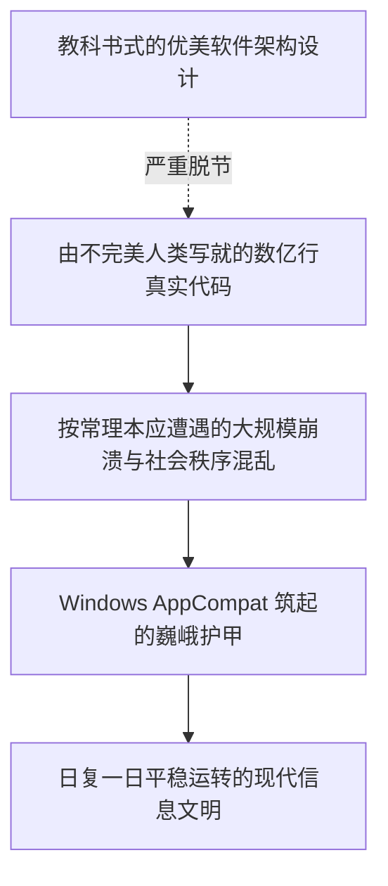

对于以雷蒙德·陈为代表的历代Windows开发团队的无名英雄们而言，亲手玷污自己精雕细琢的代码库、为了给陌生人多年前写下的粗制滥造Bug擦屁股而在通宵达旦中编写Shim，绝不是一份能在镁光灯下享受鲜花与掌声的光鲜工作。它既没有学术论文上被同行称颂的先锋算法光环，也缺乏硅谷初创公司时常拿来吹嘘的华丽概念。

然而，这难道不恰恰是 **“真正职业级工程学（Professional Engineering）”** 最崇高、最硬核的终极模样吗？

工程学的终极真谛，从来不是身披无菌服在无尘实验室里孤芳自赏优美精巧的数学公式；而是纵身跃入滚滚泥潭之中，顶着漫天尘埃与机油，用双手把由并不完美的人类所创造出的并不完美的世界缝合在一起，并以无比坚毅的意志向全人类保证：**“昨天能够运转的一切，在今天、在明天，乃至在遥远的十年后，依然能够毫无悬念地继续运转下去！”**

“绝不破坏旧应用”——正是在这一近乎偏执狂热的钢铁戒律之下，在数代无名程序员默默淌下的心血与汗水之上，我们所深爱的现代数字文明，今天依然如同水流汇入大海一般，自然而然、安宁祥和地前行运转着。
