## 序論：作業系統的本質究竟是什麼 ——「優雅的設計」還是「硬派的運作」

翻開電腦科學的經典講義或優雅的軟體工程教科書，字裡行間總是充斥著「精煉的抽象化」、「關注點分離」、「正交的API設計」等令人嚮往的理想教條。作業系統（Operating System）理應扮演神聖的調停者角色：隱藏底層硬體的複雜性，為應用程式提供直覺、統一且純淨的介面。

然而，一旦走出大學的象牙塔，踏入真實商業桌面作業系統的殘酷戰場，這種純粹無瑕的理想便會瞬間被粉碎殆盡。因為在個人電腦的發展歷史上，取得最輝煌商業成功、統治全球數十億台PC的巨擘——Windows所奉行的核心哲學，恰恰是教科書式優雅美學的完全對立面：**「近乎瘋狂的硬核現實主義（Pragmatism）」**。

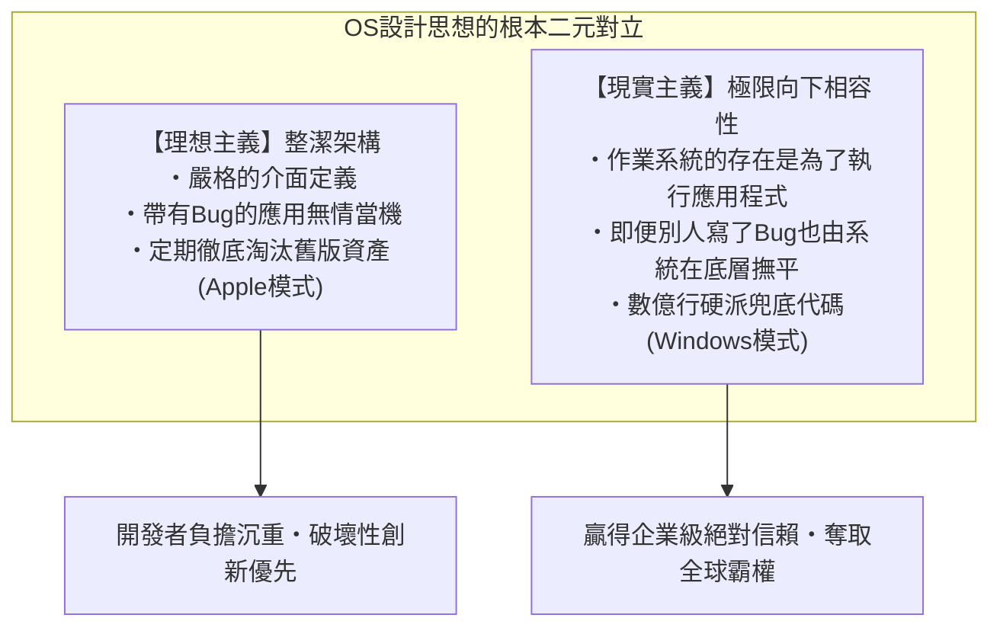

在世界上現存的所有作業系統中，沒有哪一個能像Windows那樣，對「過去的歷史遺產」抱有如此超乎尋常的狂熱執念。1995年發售的遊戲CD-ROM、1990年代初用Visual Basic 3.0或C++編寫的企業會計軟體、DOS時代的老舊資產、靠非法Hook未公開內部行為運作的老舊工具——其中絕大多數在2020年代中期的最新一代作業系統「Windows 11」上，依然能夠若無其事地雙擊啟動，並且運行得絲絲入扣、毫無破綻。

大眾往往將這種現象視為理所當然，輕描淡寫地以為「軟體本來就該能跑」。然而，凡是曾逆向工程過Windows內部原始碼、窺探過這片技術深淵的系統級程式設計師，無不倒抽一口涼氣、心生戰慄。因為在那光鮮的圖形介面之下，為了拯救不計其數的第三方應用程式的Bug、規範違規、記憶體破壞與未定義行為，微軟工程師們在過去30年間層層堆疊了**「數萬行特例規避代碼、動態偽裝API，以及由作業系統主動說謊的欺瞞機制（Shim）」**，宛如地質斷層般深不可測。

為什麼微軟非要如此大費周章，在作業系統內部替「別人寫的垃圾代碼」背黑鍋、硬生生把邏輯圓回來？
為什麼微軟沒有像蘋果那樣選擇「瀟灑斬斷過去」的道路？
這種看似走火入魔的工程實踐，究竟是如何一步步將Windows塑造成無可撼動的「全球最強平台」的？

本篇長文將橫跨前微軟傳奇程式設計師的親歷證言、Windows內部隱匿的逆向工程數據、PE二進位檔與NT核心的底層機理，以及IT平台策略演進史，全面揭示統治Windows王國至高無上的絕對鐵律——**「絕不破壞舊應用（Don't break old apps）」** 的完整真相。

---

## 第1章：兩大核心源頭講述的「最高指令（Prime Directive）」

Windows內部開發團隊對相容性的偏執執念，絕非外界憑空臆想的傳聞，而是由真正在最前線編寫核心代碼、決定底層架構的兩位傳奇工程師生動揭露於世人面前的。

### 1.1 雷蒙·陳（Raymond Chen）與《The Old New Thing》

在微軟Windows開發團隊中，有一位統御三十餘載的「活傳奇」。自1992年加入微軟以來，他長期負責維護與開發Windows 95 Shell、User32以及Win32子系統的最核心深處，他就是首席軟體工程師**雷蒙·陳（Raymond Chen）**。

陳先生最初在微軟內部技術部落格撰寫心得，後在微軟官方技術入口網站持續連載的專欄部落格**《The Old New Thing》**（後結集成書，成為全球系統級程式設計師的必讀聖經），是一座記錄Windows如何用盡渾身解數解決各種棘手相容性難題的驚人寶庫。

陳先生反覆闡述的Windows團隊基礎公理，冷酷而直接：

> 「Windows這款作業系統，存在的唯一目的就是執行程式。使用者買電腦不是為了欣賞作業系統的介面，而是為了使用運行在它上面的特定軟體。
> 
> 最殘酷的現實莫過於此——**當使用者升級到新版Windows後，如果他心愛的應用程式跑不起來了，使用者絕對不會去責怪軟體的原作者。他們會100%指責微軟：『Windows壞掉了』、『新版Windows根本是個瑕疵品』。**」

站在程式設計師的專業傲慢角度來看，大家總會理直氣壯地認為：「明明是應用程式自己代碼寫出了Bug，當機理所當然，應該由軟體開發商釋出修補更新。」但在商業作業系統的市場法則面前，這套說辭完全行不通。在使用者眼中，客觀事實只有一個：「這軟體昨天還好好的，一升級Windows就掛了。」

如果微軟擺出一副正義凜然的姿態回應「那是軟體公司的Bug」，使用者只會斷然拒絕升級，死守舊版作業系統，甚至轉投競爭對手的懷抱。因此，作為商業上的絕對必然，Windows開發團隊背負了如下殘酷而崇高的命題：

**「哪怕應用程式的代碼寫得再荒唐無稽、再違背規範、再漏洞百出，作業系統也必須在底層精準識別它，在幕後兜底把邏輯圓回來，讓它宛如一切正常般順利跑完全程。」**

在陳先生的部落格中，巨細靡遺地記錄了他和同事們為了捍衛這一信條，不得不實施的無數令人啼笑皆非卻又嘆為觀止的硬派Hack。

### 1.2 喬爾·斯波爾斯基（Joel Spolsky）的揭密：《微軟如何輸掉API之戰》

向全球Web開發者與IT商業社群深刻傳達這一哲學震撼力的人，是**喬爾·斯波爾斯基（Joel Spolsky）**。他曾在1990年代初擔任微軟Excel開發團隊的專案經理，後來創辦了全球著名工程師問答社群「Stack Overflow」與專案管理工具「Trello」，被譽為全球最具影響力的技術散文家之一。

2004年，斯波爾斯基在個人網站發表了題為《How Microsoft Lost the API War（微軟如何輸掉API之戰）》的劃時代名篇。在文章中，他回憶了當時Windows團隊最高掌舵人喬恩·德瓦恩（Jon DeVaan）展現出的鐵腕領導力，並寫下了這樣一段話：

> "In the Windows team, the prime directive was: **don't break old apps.**"
> （在Windows團隊內部，絕對不可違背的至高準則（最高指令）就是：「絕不破壞舊應用」。）

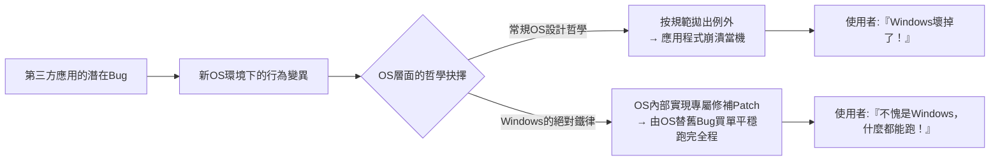

斯波爾斯基打了個生動的比方。在經典科幻影集《星艦奇航記》（Star Trek）中，星際艦隊軍官絕對不能違背的最高規條是「星際聯邦的最高指令（Prime Directive，嚴禁干涉前曲速文明的正常演進）」；而對於Windows團隊的程式設計師而言，他們的最高指令就是「絕不破壞任何既有應用程式的正常運作」。

如果某個Windows核心開發者將API底層重構成極其優雅的代碼，甚至將執行效率提升了整整一倍，但只要改動導致全球市場上流通的某款不知名企業管理軟體發生當機，這項重構就會被毫不留情地立即退件（Reject）。在Windows團隊內部，代碼的優雅與架構的純潔必須無條件退居次席，**「既有二進位檔案能夠100%平穩運行」才是至高無上的絕對正義**。

### 1.3 「連Bug也會變成規格」：海勒姆法則（Hyrum's Law）與API的不可逆性

軟體工程界有一條著名的經驗法則，由Google軟體工程師海勒姆·賴特（Hyrum Wright）提出，被稱為 **「海勒姆法則（Hyrum's Law）」**：

> **海勒姆法則（Hyrum's Law）**:
> 「當一個API擁有足夠多的使用者時，API設計者在文件規格中承諾了什麼已經無關緊要。系統的所有可觀察行為（包括Bug以及未定義的副作用），遲早都會被某人的代碼所依賴。」

Windows是全世界將「海勒姆法則」體現得最淋漓盡致、也承受其最沉重代價的典型平台。

舉例來說，某個Windows API的官方文件白紙黑字地寫著：「第三個參數必須傳入有效的視窗控制代碼（HWND）。傳入無效值時的行為未定義。」然而，世上某些粗心的程式設計師不慎將 `NULL` 或無效指標作為參數傳入，而恰巧在當年的Windows 3.1實作中，這段代碼陰錯陽差地沒有報錯，直接放行了。

當這款軟體在全球賣出幾十萬份之後，下一代Windows 95或Windows NT的開發團隊著手將參數檢查嚴密化：「如果傳入無效指標，我們應當嚴格回傳 `ERROR_INVALID_PARAMETER` 錯誤碼。」

在這項「合情合理且完全正確」的修復合入系統的瞬間，災難降臨了：
全球成千上萬家企業辦公室裡，那款老舊軟體幾乎在同一時間跳出錯誤訊息並強制關閉。憤怒的使用者瞬間打爆微軟客戶支援專線：「我們一更新系統，整個公司的業務全部癱瘓了！」

最終，微軟工程師不得不屈辱地撤回他們寫出的「正確代碼」，換成如下令人哭笑不得的妥協實作：

```c
// Windows內部API的概念性重現範例
BOOL WINAPI DoSomething(HWND hWnd, UINT uMsg, WPARAM wParam, LPARAM lParam)
{
    // 教科書式規範的合法性驗證
    if (!IsWindow(hWnd)) {
        // 本來理應在此處立即回傳錯誤
        // SetLastError(ERROR_INVALID_WINDOW_HANDLE);
        // return FALSE;

        // 【為了向下相容的Hack】
        // 歷史上某款知名應用X在初始化時會傳入NULL控制代碼。
        // 若在此處回傳錯誤，應用X就會直接當機。
        // 因此，暗中將其替換為桌面視窗控制代碼，把錯誤悄悄撫平。
        if (IsTargetBadApplication("AppX.exe")) {
            hWnd = GetDesktopWindow();
        } else {
            SetLastError(ERROR_INVALID_WINDOW_HANDLE);
            return FALSE;
        }
    }

    // 繼續執行原本的業務邏輯...
    return InternalDoSomething(hWnd, uMsg, wParam, lParam);
}
```

一旦一款作業系統走向大眾並成為事實上的業界標準，API的本質便不再是「文件上印著的文字」，而是演化為**「既有實作中偶然表現出來的、包含所有Bug在內的全部行為總和」**。Windows團隊正視了這份無法逃脫的宿命，並做好了將全世界第三方應用程式的Bug永久作為作業系統規格背負下去的覺悟。

---

## 第2章：傳奇拉開序幕 ——「模擬城市（SimCity）事件」的技術真相

在能夠象徵Windows開發團隊對向下相容性偏執執念的所有傳奇軼事中，有一樁事件在電腦歷史上留下了不可磨滅的濃墨重彩。那就是在1995年Windows 95開發衝刺白熱化階段發生的 **「模擬城市（SimCity）事件」**。

### 2.1 釋放後使用（Use-After-Free）的物理機理

1989年由威爾·萊特（Will Wright）帶領的Maxis公司打造的城市模擬經營遊戲《模擬城市》（SimCity），是PC遊戲史上永恆的里程碑，在當時引發了全球範圍的狂熱風潮。毫無疑問，無論是對一般家庭使用者，還是在辦公間隙偷閒放鬆的上班族而言，PC上能否順暢穩定地運行SimCity，是決定他們對電腦評價的生死攸關之大事。

當時針對DOS和Windows 3.1發售的PC版《SimCity》二進位檔中，潛藏著一個如果放到現代資安稽核體系下會被立刻判定為致命安全漏洞的極惡性Bug。那就是 **「釋放後使用（Use-After-Free，簡稱UAF）」**。

SimCity的代碼在繪製城市畫面或進行模擬運算時，會從作業系統的堆積記憶體管理器配置記憶體區塊，用完後再將其釋放（呼叫 `free` 或 `GlobalFree`）。然而不可思議的是，程式內部的指標在記憶體釋放後並未清空，依然堂而皇之地保留著舊位址，並且存在**「明明已經歸還給作業系統的記憶體空間，緊接著又若無其事地繼續對其進行讀寫存取」**的嚴重違規邏輯。

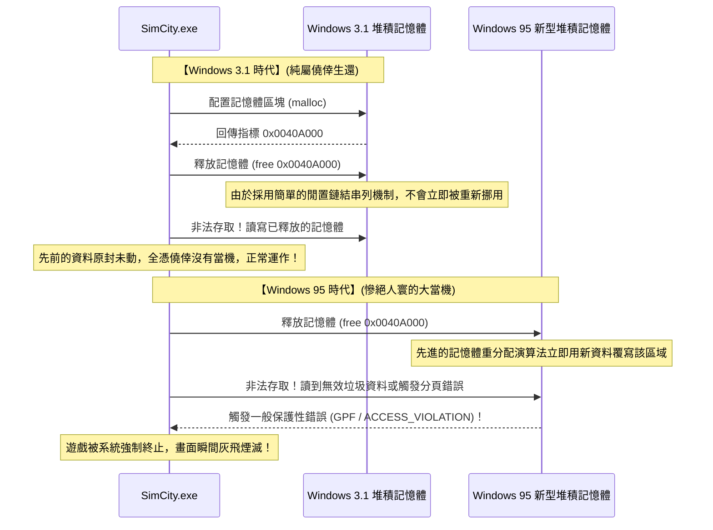

在16位元作業系統Windows 3.1時代，記憶體管理系統極其簡陋原始。應用程式釋放記憶體後，由於閒置鏈結串列（Free List）結構非常簡單，這塊記憶體幾乎不會被立刻拿去挪作他用或立即清零覆寫。換言之，SimCity內部的代碼雖然錯得一塌糊塗，但**純粹是因為Windows 3.1的記憶體管理太過粗糙遲鈍，才僥倖逃脫當機、奇蹟般地平穩運作**。

### 2.2 普通軟體工程思維 vs Windows團隊的瘋狂

然而到了1995年，徹底顛覆PC產業格局的新一代32位元作業系統「Windows 95」橫空出世。

Windows 95配備了真正的先佔式多工核心、精緻的虛擬記憶體管理器，以及旨在防止破碎化、提升快取命中率的先進高速堆積配置器。這個現代化的記憶體管理器被設計為：一旦應用程式歸還記憶體，為了最大化利用記憶體效率，會**立即將該記憶體區域回收並配置給其他用途，甚至對內部結構進行重新整理與覆寫**。

當SimCity運行在這個現代化的記憶體配置器上時，災難如期而至。
SimCity在釋放記憶體後轉頭就去讀取那片區域，然而那裡原本的內容早已被清空，或者變成了其他行程寫入的雜亂資料。下一瞬間，惡名昭彰的 **「一般保護性錯誤（General Protection Fault: GPF）」** 對話方塊在螢幕中央炸開，玩家嘔心瀝血建設了幾十個小時的繁華大都會瞬間化為電子塵埃。

面對這起事故，站在尋常軟體工程常識或任何其他作業系統廠商的角度，會做出怎樣的決策？

答案不言自明：「這100%是Maxis公司程式設計師犯下的低級錯誤。作業系統的記憶體管理完全按照規範精密運轉。應當通知Maxis公司存在此Bug，並等待他們製作一張裝有修復更新檔（SimCity 1.01）的磁碟片分發給使用者」——這是任何人都能理解的正論。

但是，微軟管理高層以及背負著Windows 95上市絕對不容有失使命的開發團隊，做出了一個在常人看來堪稱發瘋的決策：

**「絕不能讓SimCity當機。我們等不及遊戲公司慢條斯理地發修補程式。在Windows 95的核心記憶體管理器裡直接植入專屬特例代碼，改造作業系統來迎合SimCity！」**

### 2.3 深入記憶體配置器中的SimCity專屬Hack機理

喬爾·斯波爾斯基在名篇中生動記錄了這一歷史性抉擇的關鍵時刻：

> 「在Windows 95的測試過程中，他們發現SimCity無法正常運作。微軟是怎麼做的？
> 他們並沒有去逼迫SimCity的作者修改代碼。負責Windows 95記憶體管理器的工程師，親自在系統核心中寫下了專門的特殊邏輯：**『如果當前執行的程式偵測到是SimCity，那麼釋放掉的記憶體不要立即重新配置，而是把它原樣保留溫存一段時間。』**」

從現代系統安全的視角來看，這一Hack的底層技術本質，正是當今所謂「隔離堆積（Quarantine Heap）」或「延遲釋放（Delayed Free）」機制的原始雛形。

Windows 95的堆積配置器在行程啟動時會比對可執行檔名（`SIMCITY.EXE`）及PE標頭特徵資訊。一旦判定目標正是SimCity，記憶體配置器的運作邏輯便會瞬間從常規模式切換為「SimCity拯救模式」。正常情況下，被釋放的記憶體區塊會立即合併（Coalescing）並投入閒置復用池；但在執行SimCity時，系統會將接收到釋放請求的記憶體指標先暫存到一個環形緩衝佇列中，在相當長的一段時間內強行阻止該記憶體區塊被系統覆寫，為SimCity非法的後續讀寫提供一層絕對安全的防護罩。

正是依靠這種不惜撕毀教科書、由作業系統全盤背負苦難的自我犧牲，在Windows 95正式發售之日，全球無數玩家將心愛的SimCity磁碟片插入磁碟機，沒有遇到任何彈窗報錯，順滑無阻地繼續履行他們的市長職責。

使用者們交口稱讚：「Windows 95太偉大了！以前的老軟體全部無縫相容！」
而在光環背後，微軟工程師們看著自己引以為傲的全新核心中硬塞進替別人擦屁股的補救代碼所流露出的苦笑，當時全世界沒有一個人知曉。

---

## 第3章：名留青史的「硬核相容性Hack」演進譜系

模擬城市事件僅僅是冰山一角。回顧Windows走過的三十餘年波瀾壯闊的歷史，實際上就是一部為了讓全世界無數寫得千奇百怪、離經叛道的軟體得以延年益壽，而不斷上演超常規相容性Hack的傳奇史詩。

### 3.1 Lotus 1-2-3與Excel的「1900年閏年Bug」

在電腦公曆日期計算領域，存在一個全球最著名、且至今仍在全世界所有PC上不加修復地運轉的Bug。那便是**「將1900年誤判為閏年的Bug」**。

在格里高利曆（公曆）的嚴格定義中，閏年的規則具有極高的數學確定性：
1. 年份能被4整除的通常為閏年；
2. 但年份能被100整除的為平年；
3. 但年份能被400整除的仍為閏年。

因此，西元1900年屬於「能被100整除但不能被400整除」的年份，**它是標準的平年，1900年2月29日根本不存在**。

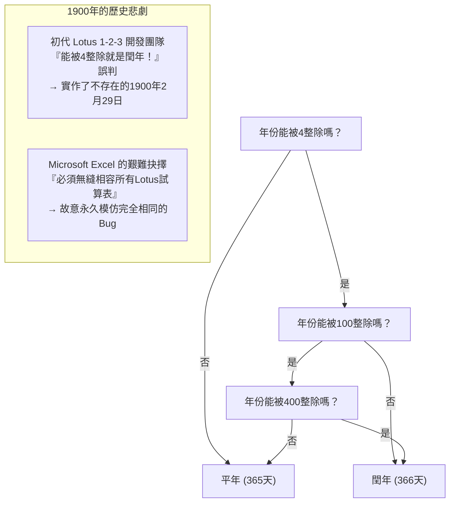

然而，在1980年代前半葉完全統治DOS試算表市場的絕對霸主《Lotus 1-2-3》的開發團隊，在編寫代碼時遺漏了「整除100的平年例外規則」，誤把1900年當成了閏年。因此在Lotus 1-2-3的世界裡，憑空誕生了一個虛構的日期——「1900年2月29日」，導致其內部日期序列號（Serial Number）產生了一整天的位移。

作為後發者殺入試算表市場的微軟《Excel》開發團隊，隨即面臨了一道嚴酷的抉擇：究竟是實作一個在數學和曆法上完美無瑕的日曆系統，還是確保與當時企業界已經產出了數千萬份的Lotus 1-2-3財務試算表的計算結果保持絕對一致？

比爾·蓋茲領導下的微軟再次選擇了後者。Excel為了讓來自Lotus 1-2-3的資料移轉萬無一失，毅然決然地選擇了**「在自己的代碼中也故意完整實作『1900年2月29日存在』這一嚴重Bug」**這條不可思議的道路。

讀者不妨在手邊最新版Microsoft 365的Excel中新建一個儲存格，輸入公式 `=DATE(1900, 2, 29)` 並按下Enter。令人驚嘆的是，即便是搭載了21世紀最新AI能力的現代Excel，也不會回傳任何錯誤，而是面不改色地顯示「1900/2/29」這個虛構日期。主動攬下競品Bug的決定一旦做出，便跨越數十年、甚至跨越世紀而永遠無法撤回。

### 3.2 為什麼微軟直接跳過了「Windows 9」

2014年，微軟舉辦了Windows 8.1繼任者的發表會。當時全業界與媒體一致認定新系統將命名為「Windows 9」。然而當微軟高階主管走上舞台時，公布的正式名稱卻令全世界大跌眼鏡——**「Windows 10」**。

為什麼版本號「9」被直接憑空跳過了？在官方所宣稱的「展現跨世代革新與統一步伐」的行銷辭令背後，來自全球開發者社群的逆向工程專家與前微軟員工，揭露出了極其真實、具有極強說服力的「相容性地雷」。

原來，在全球流傳的無數老舊第三方軟體、各類Java類別庫以及形形色色的軟體安裝程式中，為了判斷當前運行的作業系統版本，充斥著如下大量偷懶省事的祖傳代碼：

```java
// 全球無數古老軟體中氾濫成災的代碼模式
String osName = System.getProperty("os.name");

if (osName.startsWith("Windows 9")) {
    // 命中 Windows 95 或 Windows 98 的陳舊處理邏輯！
    // 強制啟用16位元相容模式或讀取陳舊的登錄檔路徑
    enableLegacyWin9xMode();
} else {
    // 針對基於NT的現代化作業系統（Windows NT, 2000, XP, 7, 8等）的正常處理
    enableModernNTMode();
}
```

當年寫下這段邏輯的程式設計師，自作聰明地用 `startsWith("Windows 9")` 作為同時快速判定「Windows 95」與「Windows 98」的捷徑。

設想一下，如果微軟循規蹈矩地將新系統命名為「Windows 9」，全球將會發生什麼事？
當使用者把最新頂級規格的電腦買回家裝上Windows 9時，全球成千上萬款企業關鍵業務軟體與老舊工具會在啟動瞬間認定「當前電腦運行的是1995年發布的Windows 95」，從而徹底繞過現代NT核心API，盲目呼叫DOS時代的Win9x專屬邏輯，最終暴斃當場。

「僅僅為了一個名字，絕不能冒讓全世界軟體大面積癱瘓的風險。」微軟對破壞相容性刻入骨髓的敬畏與恐懼，將「Windows 9」這個名字永遠埋葬在了歷史的暗處。

### 3.3 未公開API（Undocumented APIs）與諾頓工具箱（Norton Utilities）

1990年代，由賽門鐵克（Symantec）出品的系統維護與修復利器《諾頓工具箱》（Norton Utilities），是全球PC使用者的必備裝機神品。然而對於Windows系統開發團隊而言，Norton Utilities卻是一個揮之不去的巨大夢魘，堪稱當時「最不守規矩的頑劣軟體」之代表。

因為像Norton這樣深度涉及系統底層的工具程式，根本不滿足於微軟官方公佈的Win32 API，而是大量採用了**「直接把手伸進Windows內部未公開資料結構體、呼叫未導出函數、甚至直接硬編碼讀取系統DLL內部特定記憶體偏移量」**的極度危險駭客手法。

雷蒙·陳在回憶Windows 95的開發歷程時，曾生動講述了團隊與Norton Utilities之間展開的驚心動魄的暗中角力。隨著Windows 95內部架構的重構升級，記憶體保護機制與工作管理的內部結構體哪怕發生僅僅1個位元組的位移，Norton Utilities就會立刻引發藍白當機畫面（BSoD），讓整台電腦陷入癱瘓。

微軟在當時的抉擇，依然不是去聲討「濫用未公開結構的Norton咎由自取」。他們將Norton Utilities的二進位檔全面反組譯，進行了徹頭徹尾的逆向工程，精準摸清了Norton到底在讀取哪個記憶體偏移量。隨後，微軟工程師做出了一個匪夷所思的舉動：**在作業系統內部憑空偽造出Norton所期望的未公開虛擬資料結構，並將其分毫不差地擺放在以前完全相同的記憶體位址上**，以欺騙Norton正常運作。

### 3.4 比爾·蓋茲手持散彈槍的那一天：DOOM與DirectX/WinG創世紀

在Windows 95問世之前，Windows在PC遊戲市場的地位堪稱慘不忍睹。遊戲開發者們無一不把Windows譏諷為「GUI額外負擔極其臃腫、根本不可能用來寫動作遊戲的廢柴辦公系統」。當時所有高水準的PC遊戲，全都是基於MS-DOS、直接向顯示卡晶片與音效卡（Sound Blaster）的I/O連接埠硬發指令打造出來的。

這種技術生態的終極象徵，便是id Software公司開發的傳奇FPS神作《DOOM》（毀滅戰士）。在那個年代，DOOM被私下安裝在全美乃至全球各大企業的辦公電腦中，甚至引發了全美企業生產力出現可觀測波動的社會現象。

比爾·蓋茲嗅到了前所未有的危機感：「如果全世界PC使用者玩遊戲依然需要重啟退回到DOS環境，那麼Windows 95就絕不可能取得徹底的勝利。我們必須讓DOOM在Windows 95上跑起來，而且要跑得比DOS版更加狂暴迅捷！」

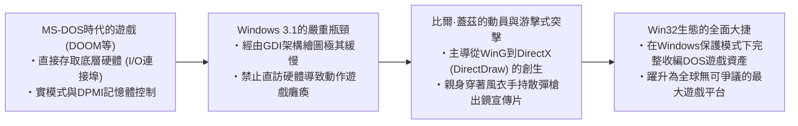

蓋茲緊急抽調公司內部的頂尖駭客工程師，下達死命令開發能將直接操作硬體的DOS遊戲指令在Windows保護模式下進行高速模擬並加速的專用圖形庫「WinG」，進而催生了代號為「曼哈頓計畫（Manhattan Project）」的後繼者——**DirectX**。

蓋茲甚至親自披上一襲風衣，手持雙管散彈槍，合成嵌入到DOOM的遊戲畫面中拍攝了一段名留青史的傳奇宣傳影片，向全世界宣示：「Windows 95才是終極遊戲平台！」當年為了在Windows的受控保護環境下馴服DOS遊戲狂野的硬體直控行為而累積下來的硬核工程血統，奠定了日後Windows堅不可摧的超強多媒體向下相容基石。

---

## 第4章：支撐現代Windows的龐大要塞「AppCompat（Application Compatibility）」

在Windows 95時代，各類相容性Hack還只是作為零散的特例代碼散落在作業系統的各個模組中。但到了軟體數量呈現爆炸式增長的Windows 2000與Windows XP時代，這種隨手打補丁的粗放模式走到了死胡同。作業系統核心源碼中充斥著為第三方應用擦屁股的條件分支，系統維護性瀕臨崩潰。

面對這一空前危機，微軟的天才架構師們破釜沉舟，設計出了一套一直沿用至當今Windows 11的全球最高水準相容性中樞引擎——**「Application Compatibility（AppCompat，應用程式相容性）」子系統**。

### 4.1 AppCompat子系統的整體架構

AppCompat子系統的本質，簡而言之就是**「當目標應用程式的二進位代碼被載入記憶體的瞬間，作業系統即時攔截偵測其身分特徵，並在應用程式與作業系統核心之間動態插拔透明的『偽裝層（Shim）』的智慧攔截系統」**。

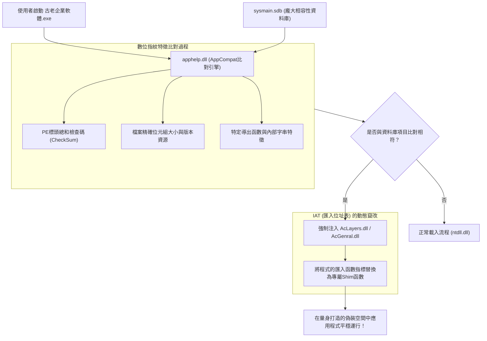

當使用者按兩下開啟一個應用程式的EXE檔案時，Windows的行程建立機制（`ntdll.dll` 內部的核心例程）並不會直接將控制權移交給程式，而是率先呼叫 **`apphelp.dll`**。

`apphelp.dll` 隨即高速掃描作業系統內部內建的超大型二進位相容性資料庫 **`sysmain.sdb`**，嚴格比對「當前準備啟動的這個程式，是否是歷史檔案中被記錄需要實施特殊救濟的老舊軟體」。一旦比對吻合，作業系統載入器（OS Loader）在載入常規系統動態連結庫（如 `kernel32.dll` 或 `user32.dll`）之前，會強行將相容層專用模組 **`AcLayers.dll`** 或 **`AcGenral.dll`** 注入到該行程的虛擬記憶體位址空間中。

### 4.2 Shim引擎：基於IAT Hook的API動態替換機制

那麼，被強行注入的Shim引擎究竟使用了什麼黑魔法來瞞天過海？其核心技術，正是基於Windows標準可執行檔格式PE（Portable Executable）的 **「IAT（Import Address Table，匯入位址表）Hook」**。

當一個Windows程式需要呼叫外部DLL中的函數（例如 `GetVersionEx` 或 `GetDiskFreeSpace`）時，編譯產生的機器指令中並不會寫死外部DLL函數在記憶體中的物理絕對位址。當程式被作業系統啟動時，系統載入器會讀取各相依DLL的實際裝載位址，並將這些真實的函數指標填入該EXE記憶體映像中的「IAT表（函數指標陣列）」。程式在運行中始終是透過查詢這張IAT表來完成對系統API的間接跳躍。

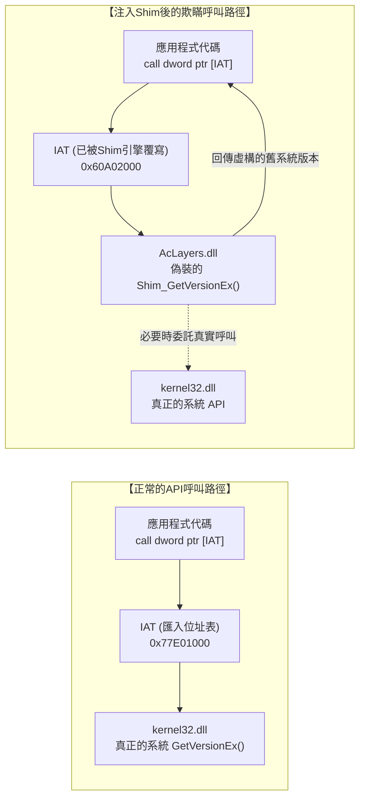

Shim引擎巧妙地利用了這一呼叫中介機制。在程式代碼正式執行之前，切入行程位址空間的Shim引擎會暫時將目標IAT記憶體分頁的保護屬性透過 `VirtualProtect` 改為 `PAGE_READWRITE`，**「將IAT表中原本指向系統官方API的真實指標，粗暴地改寫為Shim引擎內部精心編寫的欺瞞函數（Shim函數）的進入點位址」**。

我們可以用一段現代C/C++概念性虛擬代碼來重現這一過程：

```c
// 基於IAT Hook進行Shim注入的概念驗證代碼
#include <windows.h>
#include <imagehlp.h>

// 偽造的GetVersionEx函數（Shim的核心實體）
BOOL WINAPI Shim_GetVersionExA(LPOSVERSIONINFOA lpVersionInformation)
{
    // 呼叫真實底層API獲取真實的基準系統參數
    typedef BOOL (WINAPI *PFN_GETVER)(LPOSVERSIONINFOA);
    HMODULE hKernel = GetModuleHandleA("kernel32.dll");
    PFN_GETVER pfnRealGetVer = (PFN_GETVER)GetProcAddress(hKernel, "GetVersionExA");
    
    BOOL bResult = pfnRealGetVer(lpVersionInformation);
    
    // 【實施戰略欺詐】
    // 面不改色地欺騙應用程式：「當前系統是標準的 Windows 95 (Major: 4, Minor: 0)」
    lpVersionInformation->dwMajorVersion = 4;
    lpVersionInformation->dwMinorVersion = 0;
    lpVersionInformation->dwBuildNumber = 950;
    lpVersionInformation->dwPlatformId = VER_PLATFORM_WIN32_WINDOWS;
    strcpy(lpVersionInformation->szCSDVersion, "");

    return TRUE; // 應用程式毫無懷疑地堅信自己正跑在Windows 95上，欣然繼續工作
}

// 走訪PE檔案IAT表並植入Hook的底層常式
void InstallShimHook(HMODULE hAppModule, LPCSTR targetDll, LPCSTR targetFunc, PVOID newFuncAddress)
{
    ULONG size;
    // 取得PE標頭中的匯入目錄表 (Import Directory)
    PIMAGE_IMPORT_DESCRIPTOR pImportDesc = (PIMAGE_IMPORT_DESCRIPTOR)
        ImageDirectoryEntryToData(hAppModule, TRUE, IMAGE_DIRECTORY_ENTRY_IMPORT, &size);

    while (pImportDesc->Name) {
        LPCSTR dllName = (LPCSTR)((PBYTE)hAppModule + pImportDesc->Name);
        if (_stricmp(dllName, targetDll) == 0) {
            // 查找到目標DLL（如kernel32.dll）對應的Thunk鏈結串列
            PIMAGE_THUNK_DATA pThunk = (PIMAGE_THUNK_DATA)((PBYTE)hAppModule + pImportDesc->FirstThunk);
            while (pThunk->u1.Function) {
                PROC* ppfn = (PROC*)&pThunk->u1.Function;
                // 一旦命中目標API函數指標，立即實施記憶體覆寫
                DWORD oldProtect;
                VirtualProtect(ppfn, sizeof(PROC), PAGE_READWRITE, &oldProtect);
                *ppfn = (PROC)newFuncAddress; // 狸貓換太子，替換為偽裝函數位址！
                VirtualProtect(ppfn, sizeof(PROC), oldProtect, &oldProtect);
                break;
            }
        }
        pImportDesc++;
    }
}
```

正是依賴這種登峰造極的Hook攔截機制，無需對老舊程式的二進位本體修改哪怕1個位元組，也無需讓作業系統NT核心的主幹邏輯受到絲毫污染，Windows就能夠精準把特定的目標程式關進一個「量身打造、完美調校的虛擬歷史時空」中。

### 4.3 神秘的龐大二進位檔案 `sysmain.sdb`（Shim Database）

在這套精密運轉的AppCompat子系統背後充當大腦中樞的，正是靜靜躺在每一台現代Windows系統的 `C:\Windows\AppPatch\` 目錄下的核心二進位檔——**`sysmain.sdb`**。

該檔案採用了微軟專有的結構化二進位資料庫格式（SDB），其內部濃縮收錄了全球範圍內上至知名跨國企業的商用生產力套裝軟體、產業專用套件，下至個人共享軟體、古董光碟遊戲乃至各類企業內部管理工具，**總計涵蓋數萬至數十萬款歷史應用程式的「專屬拯救處方」**。

在海量應用的世界裡，僅僅根據檔案名稱叫 `setup.exe` 就盲目施加Shim顯然會鑄成大錯，導致現代最新的安裝程式出現誤判當機。因此，`sysmain.sdb` 的比對引擎引入了一套極其精密嚴苛的「多維數位指紋（Fingerprinting）」鑑別體系：

1. **檔案名稱與其所在的絕對/相對路徑特徵**
2. **精確到單一位元組的檔案大小（File Size）**
3. **PE標頭部的連結器時間戳記（Linker Timestamp）**
4. **PE總和檢查碼（CheckSum）**
5. **內嵌版本資源字串（CompanyName, ProductName, FileVersion, LegalCopyright 等）**
6. **特定代碼區段（Section）的雜湊校驗值與函數導出表結構特徵**

設想一下，某位使用者將一張2001年出版的古董多媒體百科全書光碟塞進Windows 11電腦的光碟機。`apphelp.dll` 會在毫秒級時間內擷取該安裝程式的綜合數位指紋，並在 `sysmain.sdb` 龐大的歷史病歷庫中完成檢索，瞬間診斷出：
「該軟體針對Windows 2000編寫，內部依賴固定的堆積位址對齊方式，且在運行時試圖直接向登錄檔系統核心區寫入資料。」
隨後，系統載入器會毫不遲疑地為此行程同時掛接載入數十種專屬Shim，為其構築起一套堅不可摧的相容虛擬庇護所。

---

## 第5章：經典Shim（欺騙的藝術）全景圖譜

在現代Windows內部內建的Shim種類多達數百種。它們是微軟工程師為了替歷史上程式設計師所犯下的形形色色匪夷所思的低級錯誤買單，而總結沉澱出的一整套欺詐與救贖的百科全書。

### 5.1 `VersionLie`: 「如您所願，我就是Windows 95」

在所有Shim中，最為古老傳統、同時也是被使用得最為頻繁的，當屬 **`VersionLie`** （版本欺瞞）。

許多程式設計師在編寫軟體啟動邏輯時，為了檢驗「當前作業系統是否屬於自家軟體支援的環境」，通常會呼叫 `GetVersion` 或 `GetVersionEx` API。然而令人扼腕的是，大量老舊代碼都寫成了如下自掘墳墓的死板形式：

```c
// 典型的自殺式版本檢查代碼
OSVERSIONINFO vi;
GetVersionEx(&vi);

// 死腦筋認定「只能運行在Windows 95」上的死板判斷
if (vi.dwMajorVersion == 4 && vi.dwMinorVersion == 0) {
    // 正常啟動
} else {
    MessageBox(NULL, "本軟體專為Windows 95設計，無法在較新的作業系統上運行。", "錯誤", MB_OK);
    ExitProcess(1); // 毅然決然自斷生路！
}
```

這類軟體的悲劇在於，未來即便微軟推出了效能強悍十倍的「Windows XP（Major: 5）」、「Windows 7（Major: 6）」甚至「Windows 10（Major: 10）」，它僅僅因為判定到主版本號「不等於4」，就會立刻彈出錯誤對話方塊並強行自我了斷。

為解救這類自絕於世的軟體，`VersionLie` 應運而生。當掛載了該Shim的行程呼叫 `GetVersionEx` 時，Windows 11的系統底層會面帶微笑、面不改色地向其回傳**「當前系統確係正統Windows 95（Major: 4, Minor: 0）」**的偽造結構體。應用程式得到心滿意足的答覆，在最新的多核心CPU與高速NVMe SSD之上，沉浸在自以為身處Windows 95的粉紅泡泡中歡快地運轉起來。

### 5.2 `EmulateGetDiskFreeSpace`: 拯救因硬碟超過2GB而溢位的程式

在1990年代中葉，主流電腦硬碟的容量普遍在幾百MB到一兩GB之間。當時Win32標準API `GetDiskFreeSpace` 會回傳每個叢集的磁區數、每個磁區的位元組數以及可用叢集總數等資訊，這些數值在底層均採用32位元帶正負號整數（Signed 32-bit Integer）表示。

當年許多程式設計師在用該API的回傳值計算磁碟可用位元組容量時，寫出了如下看似理所當然的公式：

$$\text{FreeBytes} = \text{SectorsPerCluster} \times \text{BytesPerSector} \times \text{NumberOfFreeClusters}$$

然而，當實體硬碟的可用空間突破了 **2GB（$2^{31} - 1$ 位元組）** 的物理大關時，32位元帶正負號整數乘法的結果瞬間發生了**嚴重的算術正負號溢位（Integer Overflow）**，原本龐大的正數瞬間翻轉為**負數（負數百MB）**。

其直接後果是：當使用者在裝有一顆大容量硬碟的全新電腦上嘗試安裝老舊遊戲或老版Office時，安裝程式會尖叫著彈窗：「當前磁碟可用空間僅為 -500MB，磁碟空間嚴重不足，無法繼續安裝」，隨後直接強制結束。

為了平息這場災難，微軟打造了專屬Shim——**`EmulateGetDiskFreeSpace`**。無論底層實體磁碟實際上是幾個TB容量的超大固態硬碟，當命中該Shim的目標程式向系統詢問剩餘空間時，系統都會極其貼心地撒一個漫天大謊：**「報告主人，當前磁碟剩餘空間剛好是絕不會引發整數溢位的極限臨界值——2,147,151,872位元組（約合1.99GB）。」** 安裝程式一看「空間很充足嘛」，便歡天喜地地繼續完成了安裝。

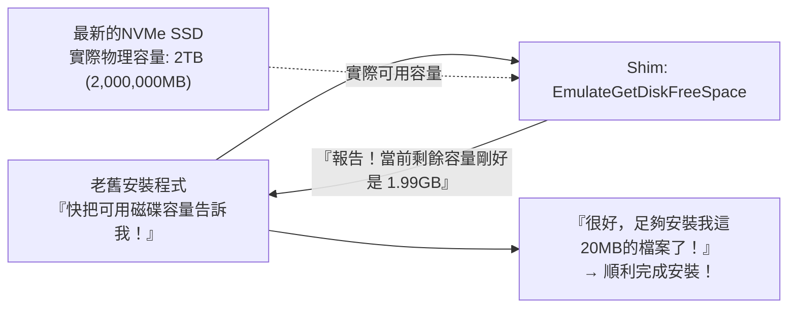

### 5.3 `VirtualRegistry` 與 `VirtualStore`: 破解UAC特權壁壘的無形橋樑

2006年微軟發布Windows Vista，引入了劃時代的安全性體系變革——**「使用者帳戶控制（User Account Control，簡稱UAC）」**。

在早期的Windows 95/98和XP時代，所有使用者日常幾乎全都是在無拘無束的系統管理員（Administrator）權限下登入運行。當時浩如煙海的各類軟體也毫無顧忌，心安理得地把自己的設定檔、使用者存檔、遊戲高分榜隨手直接寫進系統的神聖核心目錄 `C:\Program Files` 或是登錄檔的全域節點 `HKEY_LOCAL_MACHINE\Software`。

但在Vista及後續時代嚴格的安全紅線之下，一般標準使用者權限若試圖向這些受保護的核心系統目錄寫入資料，會遭到系統無情的拒絕（回傳 `ACCESS_DENIED`）。如果直接按章辦事，全世界數以百萬計的歷史存量軟體在嘗試儲存設定時便會集體暴斃，畫面上將是一片哀鴻遍野。

為了避免歷史重演，Windows Vista在核心與I/O管理員底層無縫嵌入了**「VirtualStore（檔案與登錄檔虛擬化Shim體系）」**。

當老舊程式在沒有管理員權限的情況下試圖向 `C:\Program Files\Game\save.dat` 寫入存檔的瞬間，作業系統的I/O子系統不僅不會報錯，反而會在暗中將這次寫入操作悄悄攔截並重新導向至當前使用者專屬的安全沙盒路徑：
`C:\Users\<使用者名稱>\AppData\Local\VirtualStore\Program Files\Game\save.dat`。

當該程式下一次嘗試讀取這個檔案時，系統又會不動聲色地從VirtualStore沙盒目錄中取出資料回傳給它。老舊應用程式至死都堅信自己正直接君臨在神聖的Program Files目錄之上呼風喚雨，殊不知自己早已在系統精心編織的獨立沙盒中被妥善隔離、安然入夢。

### 5.4 `DXPrimaryBltPunt`: 舊時代DirectDraw調色盤崩塌與更新率重整

在從Windows 95到XP初期的黃金年代，絕大多數經典2D電腦遊戲（如初代《世紀帝國》以及數不勝數的經典PC RPG）都是深度依仗DirectX早期的「DirectDraw」元件進行畫面繪製的。當時這些遊戲是建立在256色（8位元彩色調色盤模式）的基礎假設之上，遊戲邏輯往往直接粗暴地改寫顯示卡主表面（Primary Surface / VRAM）的硬體調色盤暫存器，來實現畫面淡入淡出或特定的全螢幕特效。

然而，在當代高階GPU與現代Windows圖形合成堆疊（DWM: Desktop Window Manager）的架構中，整個桌面早已經被當作32位元TrueColor的高畫質紋理送入3D圖形渲染管線中統一光柵化與合成。硬體層面對256色實體調色盤的直接篡改，早已是被時代淘汰數十年的遠古遺跡。

如果不施加任何保護手段而在現代PC上直接啟動老舊DirectDraw遊戲，調色盤同步將徹底崩塌，整張螢幕會瞬間淪為充斥著狂亂螢光雜訊的抽象派電子迷幻廢墟；又或是由於垂直同步與螢幕更新率的徹底脫節，遊戲幀率飆升到每秒幾千幀導致遊戲像快轉十倍一樣根本無法操控。

化解這種尷尬局面的，正是以 **`DXPrimaryBltPunt`** 和 **`ForceDirectDrawEmulation`** 為代表的圖形專屬Shim矩陣。這些Shim在底層直接攔截DirectDraw發出的過時硬體繪圖指令，在視訊記憶體深處即時將其轉換為現代Direct3D能夠理解的標準紋理串流，進而平穩接入DWM的現代化3D合成管線。三十年前細膩的手繪像素風藝術，如今能夠在最新的4K乃至8K超高畫質螢幕上分毫不差地原味重現，全憑這套極其精妙的高維圖形欺瞞機制在幕後負重前行。

---

## 第6章：跨越64位元與ARM架構的時代遠航 —— WOW64與終極指令級模擬

當底層的實體CPU硬體架構本身發生翻天覆地的歷史性世代更迭時，單純依靠在API層面的小打小鬧和函數攔截顯然已經無法抵禦巨浪。對此，Windows祭出的對策展現出了更為驚人的蠻力與魄力：**「既然環境變了，那就在新作業系統內部，完完整整地再塞進一個舊作業系統。」**

### 6.1 從NTVDM到WOW64：徹底重構的鏡像平行宇宙

在從16位元向32位元過渡的激盪歲月裡，Windows NT透過提供 **NTVDM（NT Virtual DOS Machine）**，深度調用8086微處理器的虛擬86模式（V86 Mode），實現了在現代NT保護核心下穩定執行遠古DOS和Win16應用的神蹟。

而在2000年代中葉，隨著AMD64（x64）架構橫空出世，整個運算世界面臨從32位元向64位的歷史性大遷徙。面對這道鴻溝，微軟重磅祭出了 **「WOW64（Windows 32-bit On Windows 64-bit）」** 子系統。

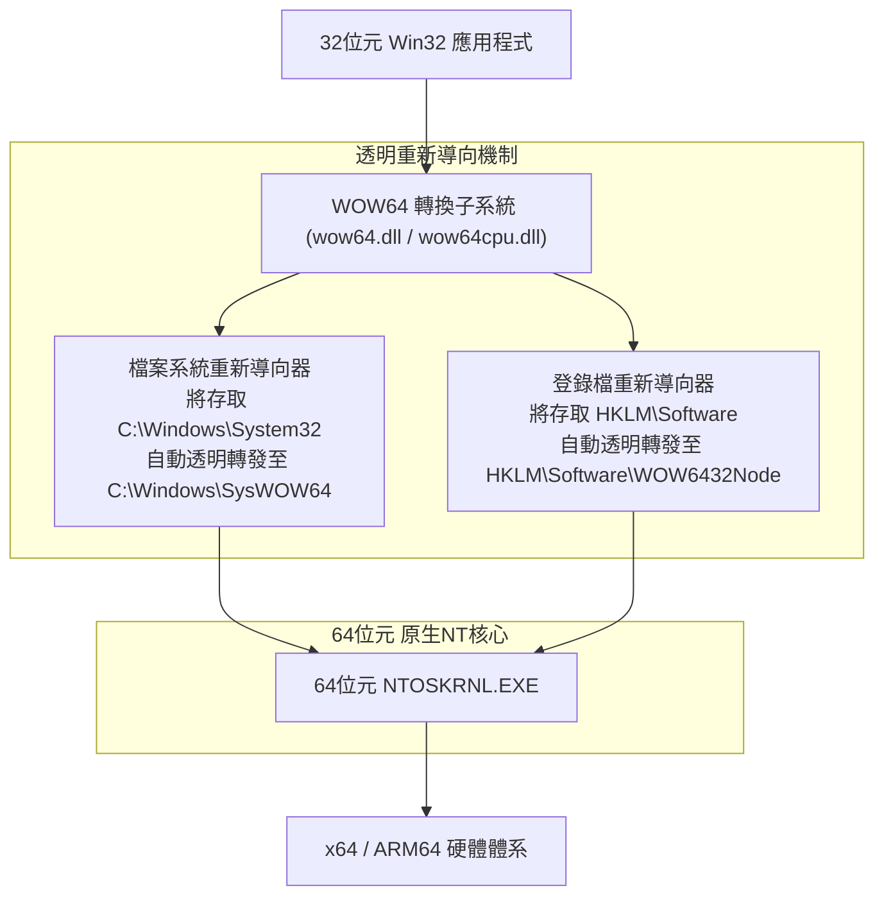

WOW64最令人嘆為觀止的核心特質，在於它為所有32位元應用程式打造了一個**「在檔案系統與登錄檔維度完全鏡像隔離的平行宇宙」**：

- **檔案系統重新導向器（File System Redirection）**:
  在純正的64位元Windows中，存放原生64位元系統核心DLL的目錄依然是具有歷史包袱名稱的 `C:\Windows\System32`。然而，當一個舊的32位元應用程式嘗試存取這個資料夾時，作業系統在背後悄無聲息地將存取目標重新導向到了 `C:\Windows\SysWOW64`（反直覺的是，這個目錄名字裡雖然帶著64，裝的反而是專門為相容32位元程式準備的32位元系統程式庫）。
- **登錄檔反映與重新導向（Registry Reflection）**:
  同理，當32位元程式嘗試讀寫 `HKEY_LOCAL_MACHINE\Software` 時，WOW64會自動將請求攔截並隔離轉送至 `HKEY_LOCAL_MACHINE\Software\WOW6432Node` 子樹之下。

正是憑藉這套如同《全面啟動》（Inception）般精密咬合的多層平行世界，誕生於1998年的32位元應用程式甚至根本察覺不到自己正運行在純64位的當代超強核心之上，繼續泰然自若地讀寫著它心愛的System32與登錄檔。

### 6.2 挺進ARM64時代與Prism終極模擬引擎

在當下的運算舞台上，戰火最熾烈的前沿陣地無疑是底層硬體由傳統的x86/x64向 **ARM64（如高通驍龍X Elite等）** 的歷史性躍遷。

回顧過往，微軟並非沒有走過彎路。2012年，微軟曾推出過試水溫性質的「Windows RT」，在ARM架構上完全禁止了既有Win32桌面老應用的運行，企圖效仿蘋果實行「快刀斬亂麻的激進斷代」。然而市場的反擊猶如晴天霹靂：全業界極其冷酷地唾棄了Windows RT，最終以微軟直接認列近十億美元的巨額資產減損慘淡收場。這記響亮的耳光讓微軟高層痛定思痛，徹底刻骨銘心地重溫了一條不可逾越的鐵律：**「哪怕是在ARM之上，只要跑不了既有的x86/x64老軟體，那就根本不配叫Windows！」**

於是在最新一代基於ARM的Windows 11中，微軟傾注全力打造了尖端動態二進位翻譯引擎——**「Prism」**。Prism不僅能夠即時解析x86/x64複雜的變長機器指令集，將其即時編譯（JIT）轉換為高能效的ARM64等價指令串流，更透過內建深度進化的指令區塊最佳化快取體系，將翻譯開銷降到了極致，賦予了老舊程式近乎原生般的澎湃運行效能。

無論底層的硬體晶片架構發生何等顛覆性的裂變，「只要輕按兩下滑鼠圖示，三十年前的老軟體就必須照常彈窗運行」——這份被烙印在骨髓深處的承諾，是微軟在跨越無數血淚試錯後鑄就的絕對意志。

---

## 第7章：各成一派的架構哲學 —— Windows vs Apple (macOS) vs Linux

面對「如何對待歷史遺留應用」這一終極命題，當今世界三大作業系統陣營交出了截然不同的答卷。透過透視這種哲學取向的根本分歧，Windows在人類軟體史上的獨特異質性與不可替代性才得以真正凸顯。

### 7.1 Apple（外科手術式斷代）：為了明天，敢於燒毀昨天的一切

從蘋果傳奇創辦人史蒂夫·賈伯斯，到如今的提姆·庫克時代，蘋果一脈相承的靈魂哲學是純正的**「為了追求極致的未來使用者體驗，過去的歷史資產必須堅決無情地焚毀（Scorched Earth Policy，焦土政策）」**。

翻開蘋果的發展史，就是一部由一次次充滿戲劇性且冷酷的「斷絕」譜寫的篇章：
- **徹底拋棄Classic Mac OS**: 從Mac OS 9到基於NeXT/Unix體系的Mac OS X完成血腥大換血。曾經作為過渡緩衝墊的舊API「Carbon」，在完成歷史任務後被徹底送入火葬場。
- **底層硬體指令集的激進四連跳**: 從680x0到PowerPC，再到Intel x86，直至如今傲視群雄的Apple Silicon (M系列晶片)。每一次平台躍遷，蘋果都會推出過渡模擬層（如Mac 68K模擬器、第一代Rosetta、Rosetta 2），但無一例外都會在短短幾年內直接從作業系統中徹底抹除該模擬引擎，親手掐死老舊二進位程式的生命線。
- **macOS Catalina對32位元應用的無情絞殺**: 2019年發布的macOS Catalina中，蘋果斷然將32位元二進位執行環境整體拔除。昨天還在正常使用的老舊專業音訊外掛程式與經典遊戲，一夜之間永遠化為廢鐵。

蘋果的立場清晰而傲慢：「開發者必須使用最新的Xcode，用最新版的Swift語言重寫業務邏輯，針對最新的macOS系統重新編譯。做不到這點的懶惰歷史垃圾，理應從蘋果神聖的生態系統中光榮出局。」這種鐵血手腕換來的是macOS代碼庫始終能夠維持極高的純潔度，系統輕巧敏捷、優雅非凡；但與此相對，全球使用者與開發者必須被迫承擔週期性「推倒重來」的沉重負擔。

### 7.2 Linux（Linus的戒律）：「Never break userspace!」的光芒與陰影

作為整個開源世界的精神圖騰，林納斯·托瓦茲（Linus Torvalds）在主導Linux核心開發時，立下了一條與Windows團隊異曲同工的絕對軍規——**「Never break userspace!（絕不破壞使用者空間！）」**。

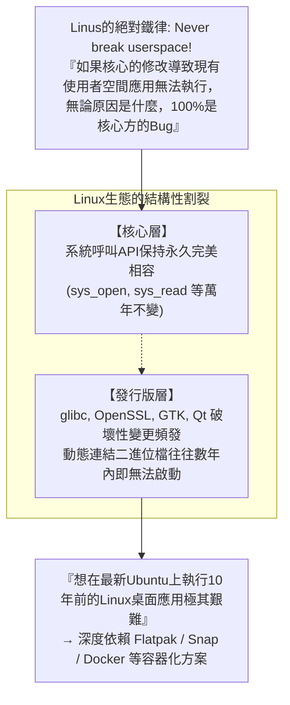

無論某個提交給核心的Patch在數學邏輯上多麼優雅、在效能上多麼驚艷，只要它在合併後導致現存的某款普通使用者空間程式無法執行，林納斯就會在公開郵件論壇裡掀起狂風暴雨般的雷霆之怒，毫不猶豫地將該提交瞬間復原（Revert）。在這一維度上，Linux核心的處世哲學與Windows完全達成了共識。

然而，Linux桌面生態的阿基里斯之腱在於：它缺乏一個如同微軟那樣擁有絕對統治力與調解權的中心化仲裁者。雖然底層的核心系統呼叫（Syscalls）堅如磐石、萬年不破，但發行版層面的使用者空間基礎共用程式庫（如 `glibc`、`libssl`、各類GTK/Qt圖形程式庫）卻極為頻繁地破壞向下相容性。其殘酷的現實結果是：**想在最新的Ubuntu系統上直接運行一個10年前編譯的帶動態連結的Linux桌面軟體，難度高如登天**。Linux在核心層級恪守了相容承諾，卻在宏觀生態的極度破碎化中敗下陣來，始終無法企及「30年前編譯的應用即開即用」的奇蹟境界。

### 7.3 Windows（累積式包容）：瘋狂的層層地質沉澱

與前兩者截然不同，Windows走出了一條獨步天下的道路——**「累積式包容（Cumulative Inclusion）」**。

微軟絕不輕言放棄任何一個過去的API和子系統，而是像地質斷層一樣，把嶄新的技術層層堆疊在歷史的基岩之上。在Win16的基石上澆築Win32，在Win32的骨架上嫁接.NET架構，在其上再強行鋪設WinRT/UWP；當發現UWP生態遇冷無法撼動既有格局時，又掉頭在Win32的牢固地基上重新構築全新的Windows App SDK（WinUI 3）。

其終極結果是：Windows蛻變成了當今地球上代碼體系最繁重複雜、體積最龐大無朋的軟體怪獸。但作為這筆瘋狂投入的報償，它達成了**人類運算史上前所未有的偉大奇蹟——讓跨越數十個時代的不同歷史軟體，在同一個桌面上並肩歡暢起舞**。

| 比較維度 | Microsoft (Windows) | Apple (macOS) | Linux (桌面版) |
| :--- | :--- | :--- | :--- |
| **基本相容性哲學** | **累積式包容 (Accumulation)**<br/>將過去的一切徹底攬入懷中 | **外科手術式斷代 (Disruption)**<br/>定期對過去的遺留資產實施焦土政策 | **核心堅守與自由放任**<br/>僅死守核心邊界，上層碎片化分崩離析 |
| **最高指令 (Prime Directive)** | "Don't break old apps"（絕不破壞舊應用） | "Embrace the modern platform"（全面擁抱現代化平台） | "Never break userspace"（絕不破壞使用者空間，僅限核心） |
| **相容性維持跨度** | **30年以上** (Win32/DOS持續可用) | **約3〜5年** (過渡期結束即刻廢棄) | 核心長治久安，GUI桌面應用命途多舛 |
| **32位元二進位現況** | **最新Win11依然完美運行** (WOW64) | **Catalina (2019) 起徹底格殺勿論** | 需手動安裝配置多架構程式庫，部分可用 |
| **對開發者的訴求** | 開發者什麼都不用做，代碼自然繼續跑 | 開發者必須定期重寫代碼、重新編譯適配 | 必須針對不同發行版與新環境持續重新打包 |
| **架構純潔度** | 極其硬派臃腫，數億行代碼如地質層層累積 | 極度純淨現代，輕裝上陣無包袱 | 核心高度模組化，但應用層面極度碎片化 |

---

## 第8章：平台經濟學 —— 為什麼向下相容性是「最寬廣的護城河（Moat）」

究竟是什麼促使比爾·蓋茲以及歷任微軟掌門人，幾十年來不惜代價逼迫開發團隊吞下所有委屈與苦楚，堅持推行這種硬核到自虐的工程路線？答案絕不在於工程審美的個人偏好，而深植於冷酷的**「商業模式與平台經濟學邏輯」**之中。

### 8.1 比爾·蓋茲的商業信條：作業系統的價值等於「可運行軟體的總和」

比爾·蓋茲在創立微軟之初，就以超越時代的前瞻洞察力參透了平台型商業的本質底層邏輯：

> **平台價值基本公理**:
> 作業系統本身的軟體價值，並不取決於系統單獨立帶了多麼華麗的功能。
> 作業系統的真正價值，**取決於「在這個平台上能夠穩定運行的全人類軟體資產的總和」**。

無論你開發出的下一代作業系統在電腦科學理論上多麼先進、記憶體利用率多麼卓絕、互動介面多麼精美絕倫，只要使用者賴以維繫日常生計的關鍵工作軟體跑不起來，它在市場上的實際商業價值就瞬間歸零。使用者掏出真金白銀購買的從來都不是一個名叫「作業系統」的空盒子，而是盒子裡面裝載的各種各樣能為他們創造生產力的實用軟體。

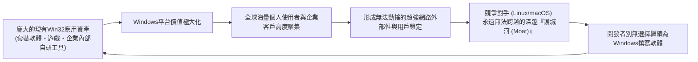

只要能夠維持100%的向下相容性，在過去30年間全球數千萬工程師為Windows平台嘔心瀝血編寫出的數百億行代碼、價值數兆美元的軟體資產，**就會一分不差地被自動繼承、直接加計為「下一代Windows作業系統的核心增量價值」**。

任憑競爭對手macOS或Linux在技術佈道時如何聲嘶力竭地鼓吹架構優勢，只要大客戶一句「我們公司用了20年的客製化進銷存管理系統能在你們系統上跑嗎？」就能讓整場商業競標在三秒鐘之內塵埃落定。向下相容性，正是任何競爭對手窮盡一切資源與智慧都絕不可能正面攻克的終極商業護城河（Moat）。

### 8.2 企業級市場的絕對統治與深度鎖定

特別是在利潤最為豐厚的企業（B端）市場中，這一策略展現出了摧枯拉朽的支配力量。

在世界500大企業、政府核心機關、現代製造業工廠以及跨國金融機構的機房深處，長年穩定運轉著過去數十年間投入數千萬乃至數十億美元客製化開發的龐大企業內部系統（例如基於VB6編寫的生產調度核心、基於C++編寫的特殊ActiveX控制元件等）。當年編寫這些核心代碼的軟體外包公司可能早已倒閉解散，系統連最初的架構設計文件都不復存在，成了沒人敢動哪怕一個字元卻維繫著整條產線運轉的「活動化石」。

如果新版Windows打破了相容性，冷酷地通知客戶：「抱歉，這套老系統不能在新電腦上跑了，請貴公司準備幾億預算，找人基於最新的Web架構重寫吧。」企業CIO（資訊長）必定勃然大怒，不僅會無限期凍結全公司的Windows升級計畫，甚至會立刻啟動評估逃離微軟生態的替代方案。

然而，Windows揮舞著AppCompat的魔法權杖，溫和地在CIO耳邊細語：「您什麼都不需要改動。哪怕買下最新款的PC，老系統接上電源依然完好如初地跑給您看。」在企業高層眼中，這是世界上最安心、最理性、投資報酬率最高的天籟之音。就這樣，全球龐大的企業界被徹底、永久地綁定在了Windows構建的深厚生態底座之上，再也無法自拔。

### 8.3 阻礙顛覆性創新的「勝利者的絞索」

然而，這場在商業上取得無可撼動統治地位的輝煌勝利，最終也在不知不覺間化作了一副反噬微軟自身的**「勝利者的絞索（Success Trap，成功陷阱）」**。

2010年代，隨著智慧型手機引發行動網路浪潮，iOS與Android迅速崛起。微軟為了推動Windows走向現代化、輕量化與高安全性，斥巨資全力打造了徹底沙盒化、現代化權限隔離的新一代應用體系——UWP（Universal Windows Platform），並雄心勃勃地計畫分階段徹底淘汰傳統的Win32架構。

然而，無論是全球廣大獨立軟體開發者還是企業客戶，對UWP的號召均表現出了驚人一致的冷漠與忽視。大家發出了靈魂拷問：「既然原汁原味的傳統Win32程式在最新的Windows 10和11上跑得既飛快又穩健，沒有任何功能限制，那我憑什麼要耗費海量人力物力去移植到一個功能處處受限、過去的資產全部作廢的新框架裡？」

這是技術史上最諷刺的自相矛盾——**「正因為Win32被微軟打磨得太過堅不可摧、太具相容生命力，最終導致連微軟自己都根本殺不死Win32！」** 陷入自身中毒泥淖的微軟最終不得不黯然收場，在事實上放棄了激進推進純UWP路線，轉而允許開發者將傳統Win32應用原封不動地打包上傳至微軟應用市集，並將最新的現代UI架構WinUI 3重新移植回Win32這片古老的地基之上。微軟親手築起的舉世無雙的相容性長城，最終也成為了橫亙在自身革新之路上最難跨越的嘆息之牆。

---

## 第9章：榮耀背後的代價 —— 極度膨脹的技術債務與資安險隘

替全世界所有寫得一塌糊塗的代碼背負宿命、守護歷史上全部的數位遺存，絕不是一場免費的盛宴。作為這一宏偉執念的代價，Windows工程團隊不得不日復一日地與整個軟體工程界最沉重、最殘酷的「技術債務」進行永無止境的殊死搏鬥。

### 9.1 數億行代碼庫與天文數字級的測試驗證矩陣

據信，當今Windows作業系統的原始碼總量已經突破了驚人的 **數億行** 之巨。而在整個工程體系中，最令人窒息的夢魘，莫過於每一次為Windows編譯產生全新組建（Build）時，所必須履行的那個堪比宇宙星辰般龐大繁複的測試驗證矩陣（Test Matrix）。

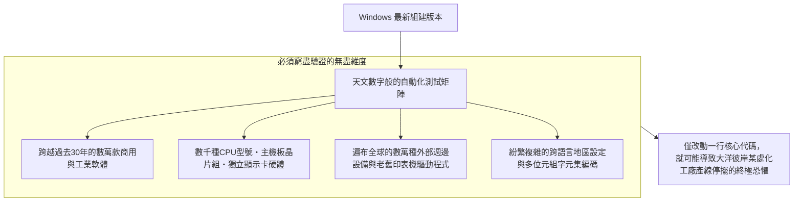

在Windows最核心的核心或底層排程層中，哪怕僅僅是出於資安防範的目的增加了一處看似微不足道的指標空值檢查，或是微調了某把鎖的取得順序，都有可能引發連鎖反應，導致世界某個偏遠角落的現代化自動化工廠中一套使用了30年的產線控制程式發生不可預期的死結並瞬間停擺。

為了直面並驅散這份深沉的恐懼，微軟在雷德蒙德園區深處打造了由數萬台真實實體硬體與數千台虛擬化叢集組成的極其壯觀的自動化測試實驗室。每當新的系統變更合入，海量的歷史老舊軟體會被自動化腳本逐一喚醒、驗證其視窗能否正常繪製顯示，這套工程吞吐量堪稱人類軟體測試工業的奇蹟。

### 9.2 遺留老舊API滋生的系統資安火山口

然而，在所有技術債務中，最為致命、代價最為慘痛的維度當屬 **資訊安全**。

在1990年代早期設計的大量Win32老舊API，誕生於網際網路全面普及前夕的「田園牧歌時代」。在那個時代的設計思維中，幾乎不存在應對惡意網路攻擊的緩衝區溢位防禦概念，行程間的特權邊界也極其模糊鬆散。但出於對向下相容性的絕對承諾，微軟絕無可能將這些千瘡百孔的陳舊介面一刀切地直接物理刪除。

全球頂尖的駭客與APT攻擊組織，最熱衷於鑽營挖掘的，正是這套「為了向下相容而永久苟活的古老API」以及「各層相容性Shim轉換過程中的邊緣邏輯盲區」。為了拯救30年前的舊軟體而保留的溫情善意，在客觀上不斷持續撕裂著整個現代作業系統的受攻擊面（Attack Surface），成為了現代防禦體系中難以癒合的慢性傷口。

### 9.3 Longhorn專案的悲壯解體與「MinWin」鳳凰涅槃

這種對相容性與龐雜新特性的無節制堆疊與沉澱，在2000年代中葉終於迎來了震撼整個IT工業界的毀滅性崩塌——那便是臭名昭彰的 **「Longhorn專案大潰敗」**。

在當年作為Windows XP繼任者被寄予厚望的Longhorn作業系統開發進程中，無數野心勃勃的宏大新架構與數十年沉澱下來的臃腫遺留代碼錯綜複雜地死死交織在一起，徹底淪為了全人類歷史上最混亂的義大利麵式巨型代碼堆。每日代碼組建無休止地損壞，整個專案的推進速度跌至冰點，數千名工程師陷入泥淖，整個專案最終在全世界的眾目睽睽之下徹底空中解體。

2004年，微軟管理層痛定思痛，做出了痛苦萬分的斷腕決定：「徹底重置Longhorn專案（Longhorn Reset）」。數千名頂尖工程師過去數年寫下的海量全新代碼被直接扔進垃圾桶，整個團隊重新退守至當時相對堅固乾淨的「Windows Server 2003 SP1」代碼基底之上重新出發（這套重構後的成果最終演變成了後來的Windows Vista）。

經歷過這次刻骨銘心的毀滅性災難洗禮後，Windows團隊痛定思痛，啟動了代號為 **「MinWin」** 的史詩級架構解耦工程。他們成功將作業系統最核心、最精純的微型核心徹底獨立抽離出來，強力斬斷了其與上層繁雜業務相容層之間的黏連依賴。Windows在今天之所以能夠歷經三十年狂風驟雨依然巍然挺立，正是因為其在經歷過這場地獄般的自我重構淬煉後，重新劃清了底層架構的生死紅線。

---

## 結論：獻給硬派工程師們的崇高讚歌 —— 在「能跑」這一奇蹟上挺立的現代文明

在我們的日常生活中，早已習慣了這一切的理所當然：辦公室裡的辦公PC、大型醫院的掛號診斷終端機、各大銀行分行默默吐鈔的ATM機、捷運與鐵路的精密調度大螢幕，乃至現代化智慧製造產線上的數值控制工具機——在支撐著現代人類文明運轉的每一根神經末梢深處，幾乎毫無例外地跳動著一顆Windows的心臟。

試想一下：如果微軟當年也是一所言必稱教科書規範、對「代碼潔癖」奉若神明的象牙塔信徒，如果微軟也像蘋果那樣每隔三五年就雷厲風行地對過往資產實施無情斬首，我們今天所處的現代商業社會將會陷入何等恐怖的深淵？

全球將有數以百萬計的實體工廠瞬間停擺斷供，無數中小企業會被迫在一次次毫無產出的軟體推倒重寫中耗盡資金鏈走向倒閉破產，醫療系統與公共基礎設施將陷入無休止的劇烈動盪。現代全球化商業文明與資訊化社會之所以能夠如此平穩、堅韌且不知疲倦地持續向前飛馳，其深層動力正是由於Windows **「以一己之軀，將全世界工程師三十年來所犯下的全部偷懶、誤解、Bug以及所有歷史的沉重遺產，毫無怨言地全盤背負在自己血肉之軀的脊樑之上」**。

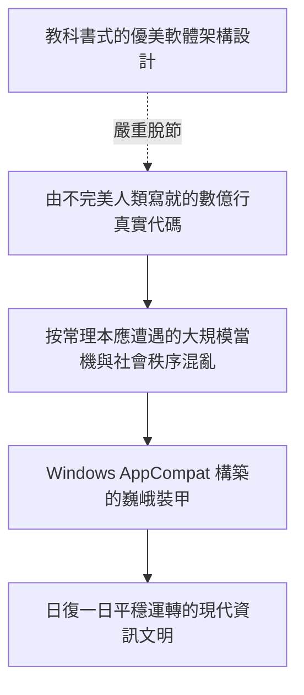

對於以雷蒙·陳為代表的歷代Windows開發團隊的無名英雄們而言，親手玷污自己精雕細琢的代碼庫、為了給陌生人多年前寫下的粗製濫造Bug擦屁股而在通宵達旦中編寫Shim，絕不是一份能在鎂光燈下享受鮮花與掌聲的光鮮工作。它既沒有學術論文上被同行稱頌的先鋒演算法光環，也缺乏矽谷新創公司時常拿來吹噓的華麗概念。

然而，這難道不恰恰是 **「真正專業級工程學（Professional Engineering）」** 最崇高、最硬派的終極模樣嗎？

工程學的終極真諦，從來不是身穿無菌衣在無塵實驗室裡孤芳自賞優美精巧的數學公式；而是縱身躍入滾滾泥淖之中，頂著滿天塵埃與機油，用雙手把由並不完美的人類所創造出的並不完美的世界縫合在一起，並以無比堅毅的意志向全人類保證：**「昨天能夠運轉的一切，在今天、在明天，乃至在遙遠的十年後，依然能夠毫無懸念地繼續運轉下去！」**

「絕不破壞舊應用」——正是在這一近乎偏執狂熱的鋼鐵戒律之下，在數代無名工程師默默淌下的心血與汗水之上，我們所深愛的現代數位文明，今天依然如同水流匯入大海一般，自然而然、安寧祥和地前行運轉著。
