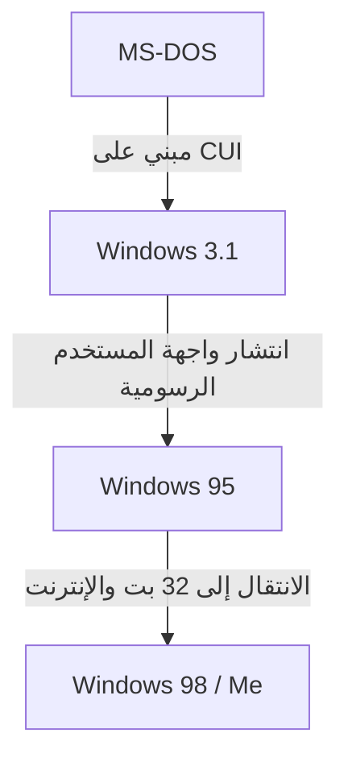

# مقدمة: مسار نظام التشغيل الذي سيطر على سوق أجهزة الكمبيوتر الشخصية

عند الحديث عن تاريخ أجهزة الكمبيوتر الشخصية، لا يمكن تجنب تطور Microsoft Windows. بدءًا من واجهة سطر الأوامر (CUI) ذات الشاشة السوداء والنصوص البيضاء فقط في الثمانينيات، وصولاً إلى واجهة المستخدم الرسومية (GUI) الغنية والبديهية في العصر الحديث، لم تكن الرحلة مجرد تغيير في المظهر، بل رافقها تحول جذري في بنية الكمبيوتر.

في هذه المقالة، سنتعمق في التطور التقني بدءًا من نظام التشغيل أحادي المهام MS-DOS، مرورًا بعصر الانتشار الهائل لـ Windows 3.1 و Windows 95، وصولاً إلى التكامل مع "نواة Windows NT" التي تشكل الأساس لجميع أنظمة Windows الحديثة.

## عصر MS-DOS: الانطلاق من الشاشة السوداء

في عام 1981، أصبح MS-DOS، الذي تم اعتماده مع ظهور أجهزة كمبيوتر IBM PC، المعيار الفعلي لسوق أجهزة الكمبيوتر الشخصية بعد ذلك. كانت الأجهزة في ذلك الوقت ضعيفة للغاية، وكانت الذاكرة تُقاس بالكيلوبايت، وكانت الأقراص المرنة هي وسائط التخزين السائدة. لذلك، اقتصر الدور المطلوب من نظام التشغيل على الحد الأدنى: "قراءة وكتابة الأقراص" و"تنفيذ البرامج".

كان المستخدم يقوم بإدخال الأوامر من لوحة المفاتيح لإعطاء التعليمات للكمبيوتر.

```text
C:\> DIR
C:\> COPY FILE.TXT A:
```

ومع ذلك، كان MS-DOS يفتقر إلى الميزات التي تعتبر من المسلمات في أنظمة التشغيل الحديثة:
* **الافتقار إلى تعدد المهام:** لا يمكن تنفيذ سوى برنامج واحد في كل مرة.
* **الافتقار إلى حماية الذاكرة:** يمكن للتطبيقات الوصول بحرية إلى الذاكرة بأكملها، مما يعني أن خطأ برمجيًا (bug) واحدًا يمكن أن يتسبب في تعطل النظام بالكامل.
* **التحكم المباشر في الأجهزة:** نظرًا لأن البرامج كانت تتفاعل مباشرة مع بطاقات الفيديو وبطاقات الصوت، كانت مشاكل التوافق بين الأجهزة تحدث بشكل متكرر.

## من Windows 3.1 إلى Windows 95: ثورة واجهة المستخدم الرسومية

بالمعنى الدقيق للكلمة، لم يكن Windows 3.1 الذي ظهر في عام 1992 نظام تشغيل، بل "بيئة واجهة مستخدم رسومية (بيئة تشغيل) تعمل فوق MS-DOS". ومع ذلك، فإن تجربة تشغيل النوافذ باستخدام الماوس وتشغيل تطبيقات متعددة بالتوازي (تعدد المهام غير الوقائي - Non-preemptive multitasking) كانت ثورية بالنسبة للمستخدمين العاديين.

ثم في عام 1995، تم إصدار **Windows 95**. لقد أسس واجهة المستخدم الحالية لنظام Windows، مزودًا بزر ابدأ وشريط المهام. داخليًا، تقدم التحول إلى نظام 32 بت، ودعم تعدد المهام الوقائي (Preemptive multitasking) والتوصيل والتشغيل (Plug and Play). وبذلك فتح الباب أمام عصر الإنترنت.



## حدود أنظمة سلسلة 9x وكابوس شاشة الموت الزرقاء

حققت أنظمة Windows 95 و 98 و Me، والتي سُميت بـ "سلسلة 9x"، نجاحًا كبيرًا للمستهلكين. ومع ذلك، فقد كانت تعاني من نقطة ضعف قاتلة تتمثل في أنها **كانت لا تزال مبنية على إرث MS-DOS**.

ونتيجة للتركيز على التوافقية السابقة لتشغيل برامج DOS القديمة وبرامج Windows 3.1 ذات 16 بت، أصبح النظام عبارة عن شفرة برمجية متشابكة (Spaghetti code) مليئة بالترقيعات. كانت اصطدامات مساحة الذاكرة بين التطبيقات تحدث بسهولة، ولم يكن من الممكن منع الوصول غير المصرح به إلى مساحة النواة (قلب نظام التشغيل) بشكل كامل.

وكانت النتيجة هي **شاشة الموت الزرقاء (BSOD)** الشهيرة. كان الرعب المتمثل في اختفاء البيانات التي يتم العمل عليها في لحظة مع شاشة زرقاء تجربة مشتركة لمستخدمي أجهزة الكمبيوتر في ذلك الوقت.

## نواة Windows NT: "تكنولوجيا جديدة" موجهة نحو المستقبل

بينما كانت سلسلة 9x الموجهة للمستهلكين تعاني من الشاشة الزرقاء، كانت Microsoft تقوم بتطوير نظام تشغيل جديد تمامًا خلف الكواليس. ألا وهو **Windows NT (New Technology)**.

تم تصميم Windows NT 3.1، الذي ظهر في عام 1993، من الصفر للشركات والمحترفين، مثل الخوادم ومحطات العمل (Workstations). وكانت "الاستقرار" و"الأمان" و"قابلية النقل" هي جوهر فلسفة تصميمه.

### الميزات الرئيسية لنواة NT

1. **حماية كاملة للذاكرة:** يتم تخصيص مساحة ذاكرة افتراضية مستقلة لكل تطبيق، مما يمنعها من تدمير البرامج الأخرى أو الجزء الأساسي من نظام التشغيل (مساحة النواة).
2. **تعدد المهام الوقائي:** نظرًا لأن مجدول نظام التشغيل (Scheduler) يخصص وقت وحدة المعالجة المركزية (CPU) بصرامة لكل عملية، فإن تجميد تطبيق واحد لن يؤدي إلى انهيار النظام بأكمله.
3. **تجريد الأجهزة (HAL):** تفصل طبقة تجريد الأجهزة (Hardware Abstraction Layer) بين نظام التشغيل نفسه والأجهزة، مما يسهل نقله إلى بنيات وحدات المعالجة المركزية المختلفة (x86، MIPS، Alpha، PowerPC، ولاحقًا ARM).

## Windows XP: دمج عالمين

كان Windows NT ممتازًا للغاية، ولكن نظرًا لأن متطلبات مواصفاته كانت عالية وكان ضعيفًا في الألعاب وميزات الوسائط المتعددة، فقد استغرق الأمر وقتًا للانتشار في المنازل العادية. لفترة طويلة، استمر نظام الخطين: "سلسلة 9x للاستخدام المنزلي" و"سلسلة NT للاستخدام التجاري"، لكن تطور الأجهزة بدأ يلحق بمتطلبات نواة NT.

في عام 2001، تم أخيرًا دمج هذين العالمين. وهو **Windows XP**.
على الرغم من مظهره المألوف والموجه للمستهلكين، إلا أنه كان مزودًا داخليًا بنواة NT القوية (NT 5.1) المبنية على Windows 2000 (NT 5.0). وبفضل ذلك، حصل المستخدمون العاديون أيضًا على بيئة كمبيوتر مستقرة حيث "نادرًا ما تظهر الشاشة الزرقاء".

## عمق البنية: Win32 API وسجل النظام (Registry)

هناك عنصران لا غنى عنهما لفهم نظام Windows الحديث وهما "Win32 API" و"سجل النظام (Registry)".

### Win32 API: الحوار بين التطبيقات ونظام التشغيل
واجهة برمجة تطبيقات Win32 (Application Programming Interface) هي مجموعة من الوظائف القياسية للبرامج التي تعمل على نظام Windows لاستخدام ميزات نظام التشغيل (مثل رسم النوافذ، قراءة وكتابة الملفات، اتصالات الشبكة، وما إلى ذلك).
تكمن قوة واجهة برمجة التطبيقات هذه في **توافقيتها السابقة المذهلة**. ليس من غير المألوف أن تعمل تطبيقات Win32 المكتوبة قبل 20 عامًا كما هي على أحدث إصدار من Windows 11. هذه ميزة كبيرة للمطورين وأحد الأسباب التي تجعل Windows يحتفظ بحصة سوقية ساحقة في سوق المؤسسات.

### سجل النظام (Windows Registry): قاعدة بيانات النظام الضخمة
في أنظمة Windows المبكرة (قبل 3.1)، تم حفظ إعدادات النظام والتطبيقات وتوزيعها في عدد لا يحصى من ملفات `.ini` بتنسيق نصي. كان هذا سببًا في تعقيد الإدارة.
مع صعود سلسلة NT، أصبح **سجل النظام (Registry)** هو الذي يلعب الدور المركزي. هذه قاعدة بيانات هرمية تدير كل شيء بشكل مركزي، بدءًا من الإعدادات الأساسية لنظام التشغيل، مرورًا بمعلومات البرامج المثبتة، وصولاً إلى إعدادات المستخدم.

في حين أنه يوفر وصولاً سريعًا، إلا أنه خلق أيضًا تحديًا جديدًا يتمثل في "إذا أصبح السجل متضخمًا أو تالفًا، فسيصبح النظام غير مستقر".

## خاتمة: Windows 11 وما بعده

منذ Windows XP، استمرت أنظمة التشغيل في التطور مع Vista و 7 و 8 و 10، ثم Windows 11. يتم إضافة الميزات يوميًا، مثل تعزيز ميزات الأمان (UAC، التمهيد الآمن (Secure Boot))، إكمال الانتقال إلى 64 بت، التكامل مع السحابة، ودمج الذكاء الاصطناعي (Copilot).

ومع ذلك، لا تزال "نواة NT" القوية التي تم تصميمها في التسعينيات تنبض بقوة في جوهره. يمكن القول إن هذه البنية، التي كسرت قشرة DOS وتم إعادة بنائها من الصفر، هي نقطة القوة الحقيقية لشركة Microsoft التي استمرت في دعم عالم أجهزة الكمبيوتر الشخصية لأكثر من 30 عامًا.
