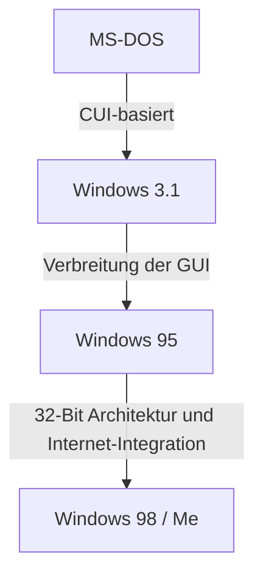

# Einleitung: Der Weg des Betriebssystems, das den PC-Markt dominierte

Wenn man über die Geschichte des Personal Computers spricht, kommt man an der Entwicklung von Microsoft Windows nicht vorbei. Der Weg von einer Command Line Interface (CUI) aus den 1980er Jahren mit lediglich weißem Text auf schwarzem Bildschirm hin zur modernen, intuitiven und visuellen Graphical User Interface (GUI) bedeutete nicht nur eine optische Veränderung, sondern brachte eine fundamentale Transformation der Computerarchitektur mit sich.

Dieser Artikel taucht tief in die technischen Veränderungen ein, beginnend mit dem Single-Tasking-Betriebssystem MS-DOS über die Zeit der explosiven Verbreitung von Windows 3.1 und Windows 95 bis hin zur Konsolidierung auf den "Windows NT-Kernel", der das Fundament aller modernen Windows-Versionen bildet.

## Die MS-DOS Ära: Der Anfang auf einem schwarzen Bildschirm

MS-DOS, das 1981 zusammen mit dem IBM PC eingeführt wurde, wurde zum De-facto-Standard des damaligen PC-Marktes. Die Hardware jener Zeit war extrem leistungsschwach; der Arbeitsspeicher wurde in Kilobytes gemessen und Disketten waren das primäre Speichermedium. Daher beschränkte sich die Rolle des Betriebssystems auf minimale Funktionen wie das Lesen/Schreiben auf Datenträger und die Ausführung von Programmen.

Benutzer gaben über die Tastatur Befehle ein, um dem Computer Anweisungen zu erteilen.

```text
C:\> DIR
C:\> COPY FILE.TXT A:
```

Allerdings fehlten MS-DOS wesentliche Funktionen, die bei modernen Betriebssystemen als selbstverständlich gelten:
* **Fehlendes Multitasking:** Es konnte immer nur ein Programm zur gleichen Zeit ausgeführt werden.
* **Fehlender Speicherschutz:** Da Anwendungen frei auf den gesamten Speicher zugreifen konnten, konnte ein einziger Fehler zum Absturz des gesamten Systems führen.
* **Direkte Hardwaresteuerung:** Programme sprachen Grafikkarten und Soundkarten direkt an, was häufig zu Kompatibilitätsproblemen zwischen unterschiedlicher Hardware führte.

## Von Windows 3.1 zu Windows 95: Die GUI-Revolution

Windows 3.1, das 1992 erschien, war im engeren Sinne kein Betriebssystem, sondern eine „GUI-Umgebung, die auf MS-DOS aufbaute“. Jedoch war die Möglichkeit, Fenster mit einer Maus zu bedienen und mehrere Anwendungen parallel auszuführen (kooperatives Multitasking), für den normalen Anwender revolutionär.

Dann, im Jahr 1995, wurde **Windows 95** veröffentlicht. Ausgestattet mit einem Start-Button und einer Taskleiste legte es den Grundstein für die Windows-Benutzeroberfläche von heute. Intern wurde die 32-Bit-Architektur vorangetrieben, präemptives Multitasking und Plug-and-Play wurden unterstützt, was die Türen in das Internetzeitalter öffnete.



## Die Grenzen der 9x-Serie und der Albtraum des Blue Screens

Windows 95, 98 und Me wurden als „9x-Serie“ bezeichnet und feierten auf dem Verbrauchermarkt große Erfolge. Sie litten jedoch unter einer fatalen Schwäche: Sie **basierten immer noch auf dem Erbe von MS-DOS**.

Das Festhalten an der Abwärtskompatibilität, um ältere DOS-Software und 16-Bit-Anwendungen für Windows 3.1 weiterhin ausführen zu können, führte zu einem geflickten Spaghetti-Code-System. Speicherkonflikte zwischen Anwendungen traten häufig auf, und unautorisierter Zugriff auf den Kernel-Bereich (das Herz des Betriebssystems) konnte nicht vollständig verhindert werden.

Das Ergebnis war der berüchtigte **Blue Screen of Death (BSOD)**. Die Angst davor, dass nicht gespeicherte Arbeitsdaten zusammen mit einem blauen Bildschirm in einem Augenblick verschwinden, war eine gemeinsame Erfahrung der damaligen PC-Nutzer.

## Der Windows NT-Kernel: "New Technology" für die Zukunft

Während die auf Verbraucher ausgerichtete 9x-Serie mit dem Blue Screen kämpfte, entwickelte Microsoft ein völlig neues Betriebssystem. Das war **Windows NT (New Technology)**.

Das 1993 erschienene Windows NT 3.1 wurde von Grund auf für Business-Profis, Server und Workstations entwickelt. Im Mittelpunkt der Designphilosophie standen "Stabilität", "Sicherheit" und "Portabilität".

### Hauptmerkmale des NT-Kernels

1. **Vollständiger Speicherschutz:** Jeder Anwendung wird ein isolierter, virtueller Speicherbereich zugewiesen, der verhindert, dass andere Programme oder der OS-Kern (Kernel-Bereich) beschädigt werden.
2. **Präemptives Multitasking:** Der Scheduler des Betriebssystems teilt jedem Prozess strikt CPU-Zeit zu, sodass das Einfrieren einer Applikation nicht das gesamte System in den Abgrund reißt.
3. **Hardware-Abstraktion (HAL):** Durch den Hardware Abstraction Layer wurden das eigentliche Betriebssystem und die Hardware getrennt, was die Portierung auf verschiedene CPU-Architekturen (x86, MIPS, Alpha, PowerPC, später ARM) vereinfachte.

## Windows XP: Die Vereinigung zweier Welten

Obwohl Windows NT technisch hervorragend war, verlangte es nach hohen Systemspezifikationen und war bei Gaming- und Multimedia-Funktionen schwach, was die Verbreitung in Privathaushalten verlangsamte. Lange Zeit existierten zwei parallel laufende Produktlinien: die "9x-Serie für Heimanwender" und die "NT-Serie für Geschäftskunden". Doch die Weiterentwicklung der Hardware holte schließlich die Anforderungen des NT-Kernels ein.

Im Jahr 2001 wurden diese beiden Welten endlich vereint – das Resultat war **Windows XP**.
Äußerlich bot es eine ansprechende und benutzerfreundliche GUI, während es im Inneren von einem robusten NT-Kernel (NT 5.1) angetrieben wurde, der auf Windows 2000 (NT 5.0) basierte. Dadurch kamen auch normale Endnutzer in den Genuss einer stabilen PC-Umgebung, bei der „der Blue Screen nur noch selten auftrat“.

## Die Tiefen der Architektur: Win32 API und die Registry

Zwei wesentliche Elemente zum Verständnis des modernen Windows sind die „Win32 API“ und die „Registry“.

### Win32 API: Die Kommunikation zwischen Anwendung und Betriebssystem
Die Win32 API (Application Programming Interface) ist eine standardisierte Sammlung von Funktionen für Programme, die auf Windows laufen, um Betriebssystemfunktionen (wie das Zeichnen von Fenstern, das Lesen und Schreiben von Dateien, Netzwerkkommunikation usw.) nutzen zu können.
Die Stärke dieser API liegt in ihrer **erstaunlichen Abwärtskompatibilität**. Es ist nicht ungewöhnlich, dass eine vor 20 Jahren geschriebene Win32-Anwendung problemlos auf dem neuesten Windows 11 läuft. Dies ist ein enormer Vorteil für Entwickler und einer der Gründe, warum Windows seinen überwältigenden Marktanteil im Enterprise-Segment beibehält.

### Die Windows Registry: Die riesige Datenbank des Systems
In frühen Windows-Versionen (vor 3.1) wurden System- und Anwendungseinstellungen dezentral im Textformat in unzähligen `.ini`-Dateien gespeichert. Dies führte zu einer komplizierten Verwaltung.
Mit dem Aufstieg der NT-Serie übernahm die **Registry** eine zentrale Rolle. Sie ist eine hierarchische Datenbank, die alles zentral verwaltet – von den Grundeinstellungen des Betriebssystems über Informationen zur installierten Software bis hin zu den Benutzereinstellungen.

Während sie einen schnellen Zugriff ermöglichte, schuf sie auch neue Herausforderungen: „Wenn die Registry zu groß wird oder beschädigt ist, wird das System instabil.“

## Fazit: Windows 11 und darüber hinaus

Seit Windows XP hat sich das Betriebssystem über Vista, 7, 8, 10 und bis hin zu Windows 11 kontinuierlich weiterentwickelt. Funktionen wie verbesserte Sicherheitsfeatures (UAC, Secure Boot), der Übergang zu 64-Bit, die Cloud-Integration und die Einbindung von KI (Copilot) werden laufend hinzugefügt.

Doch im Kern lebt noch immer der robuste „NT-Kernel“, der in den 1990er Jahren entworfen wurde. Diese Architektur, die die Hülle von DOS durchbrach und von Grund auf neu entwickelt wurde, kann als die wahre Stärke von Microsoft bezeichnet werden, die die PC-Welt seit mehr als 30 Jahren trägt.
