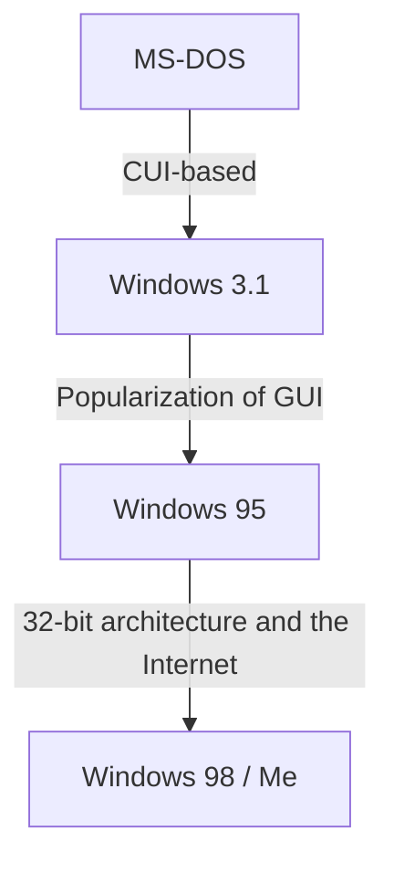

# Introduction: The Trajectory of the Operating System that Dominated the PC Market

When discussing the history of personal computers, the evolution of Microsoft Windows is unavoidable. The journey from the black screens and white text of the CUI (Character User Interface) in the 1980s to the rich, intuitive GUIs (Graphical User Interfaces) of today involved more than just visual changes; it was accompanied by a fundamental transformation in computer architecture.

This article delves deep into the technical evolution, starting from MS-DOS, a single-task OS, through the explosive popularity of Windows 3.1 and Windows 95, and culminating in the integration into the "Windows NT kernel," which forms the foundation of all modern Windows systems.

## The MS-DOS Era: Starting from a Black Screen

Introduced alongside the IBM PC in 1981, MS-DOS became the de facto standard of the subsequent PC market. Hardware at the time was extremely limited: memory was measured in kilobytes, and storage primarily relied on floppy disks. Consequently, the roles expected of the OS were limited to the bare minimum of "reading/writing disks" and "executing programs."

Users provided instructions to the computer by typing commands on a keyboard.

```text
C:\> DIR
C:\> COPY FILE.TXT A:
```

However, MS-DOS lacked features that are taken for granted in modern operating systems.
* **Lack of Multitasking:** Only one program could be executed at a time.
* **Lack of Memory Protection:** Because applications had unrestricted access to the entire memory, a single bug could crash the entire system.
* **Direct Hardware Control:** Programs interacted directly with video and sound cards, frequently causing compatibility issues with different hardware.

## From Windows 3.1 to Windows 95: The GUI Revolution

Windows 3.1, released in 1992, was strictly speaking not an OS but a "GUI environment (operating environment) running on top of MS-DOS." However, the experience of manipulating windows with a mouse and running multiple applications concurrently (non-preemptive multitasking) was revolutionary for general users.

Then, in 1995, **Windows 95** was launched. Featuring the Start button and taskbar, it established the foundation for today's Windows UI. Internally, it transitioned toward a 32-bit architecture, supporting preemptive multitasking and plug-and-play, opening the door to the Internet era.



## The Limits of the 9x Series and the Nightmare of the Blue Screen

Windows 95, 98, and Me, collectively known as the "9x series," achieved massive success in the consumer market. However, they harbored a fatal weakness: they were **still built on the legacy of MS-DOS**.

By prioritizing backward compatibility to run older DOS software and 16-bit Windows 3.1 applications, the system had turned into a patchwork of spaghetti code. Applications frequently clashed over memory spaces, and unauthorized access to the kernel space (the heart of the OS) could not be entirely prevented.

The result was the infamous **Blue Screen of Death (BSOD)**. The terror of unsaved data disappearing instantly with a blue screen was a common experience for PC users at the time.

## The Windows NT Kernel: A "New Technology" for the Future

While the consumer-oriented 9x series struggled with blue screens, Microsoft was developing an entirely new OS behind the scenes: **Windows NT (New Technology)**.

Introduced in 1993, Windows NT 3.1 was designed from scratch for business professionals, targeting servers and workstations. At the core of its design philosophy were "stability," "security," and "portability."

### Key Features of the NT Kernel

1. **Complete Memory Protection:** Each application is assigned an independent virtual memory space, preventing it from corrupting other programs or the core part of the OS (kernel space).
2. **Preemptive Multitasking:** The OS scheduler strictly allocates CPU time to each process, ensuring that if one app freezes, the entire system is not taken down with it.
3. **Hardware Abstraction Layer (HAL):** By separating the main OS from the hardware, HAL made it easier to port the OS to various CPU architectures (x86, MIPS, Alpha, PowerPC, and later ARM).

## Windows XP: The Integration of Two Worlds

Although Windows NT was excellent, it had high hardware requirements and was weak in gaming and multimedia features, so it took time to penetrate general households. For a long time, Microsoft maintained a two-line system: the "9x series for homes" and the "NT series for businesses." However, hardware evolution eventually caught up with the demands of the NT kernel.

In 2001, these two worlds were finally integrated with the release of **Windows XP**.
It featured an approachable, consumer-friendly UI on the outside, while internally it was powered by a robust NT kernel (NT 5.1) based on Windows 2000 (NT 5.0). Consequently, general users finally gained access to a stable PC environment where "blue screens rarely occur."

## The Depths of Architecture: The Win32 API and the Registry

Two essential elements for understanding modern Windows are the "Win32 API" and the "Registry."

### The Win32 API: Communication Between Applications and the OS
The Win32 API (Application Programming Interface) is a collection of standard functions that programs running on Windows use to access OS features (such as drawing windows, reading/writing files, and network communication).
The strength of this API lies in its **astonishing backward compatibility**. It is not uncommon for a Win32 application written 20 years ago to run flawlessly on the latest Windows 11. This is a massive advantage for developers and one of the reasons Windows maintains a dominant share in the enterprise market.

### The Windows Registry: The Massive Database of the System
In early versions of Windows (3.1 and earlier), system and application settings were scattered across countless `.ini` files in text format. This made management cumbersome.
As the NT series rose to prominence, the **Registry** took on a central role. It is a hierarchical database that centrally manages everything from core OS settings to installed software information and user preferences.

While it enabled fast access, it also introduced a new challenge: "if the registry becomes bloated or corrupted, the system becomes unstable."

## Conclusion: Windows 11 and Beyond

From Windows XP onwards, through Vista, 7, 8, 10, and now Windows 11, the OS has continued to evolve. Features such as enhanced security (UAC, Secure Boot), the completion of the 64-bit transition, cloud integration, and the incorporation of AI (Copilot) are being added every day.

However, the robust "NT kernel," designed in the 1990s, still pulses at its foundation. Breaking the DOS shell and being rebuilt from scratch, this very architecture is Microsoft's true strength, continuing to support the PC world for over 30 years.
