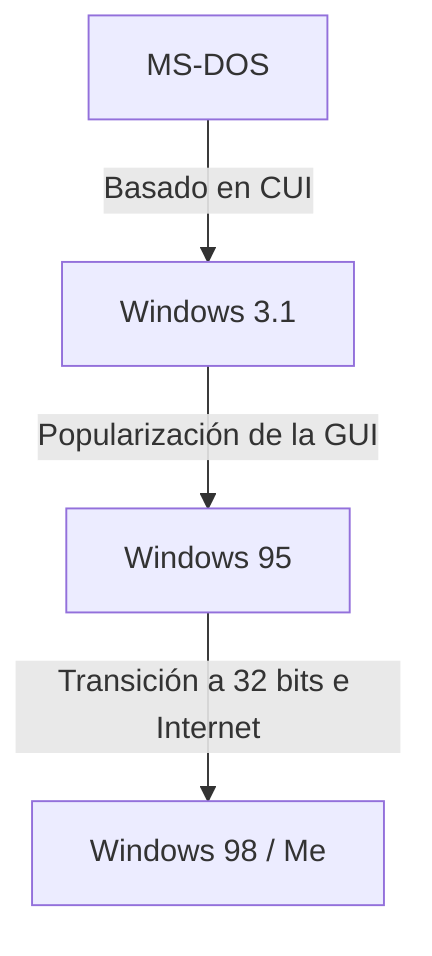

# Introducción: La trayectoria del sistema operativo que conquistó el mercado de las PC

Al hablar de la historia de las computadoras personales, la evolución de Microsoft Windows es inevitable. El camino desde la CUI (interfaz de usuario de caracteres) de los años 80, con solo una pantalla negra y texto blanco, hasta la GUI (interfaz gráfica de usuario) rica e intuitiva de hoy en día, no fue solo un cambio visual, sino que implicó una transformación fundamental en la arquitectura de las computadoras.

En este artículo, profundizaremos en la evolución técnica, comenzando con el sistema operativo monotarea MS-DOS, pasando por la era de adopción explosiva de Windows 3.1 y Windows 95, hasta llegar a la integración en el "kernel de Windows NT", la base de todos los Windows modernos.

## La era de MS-DOS: Partiendo de una pantalla negra

Lanzado en 1981 junto con la IBM PC, MS-DOS se convirtió en el estándar de facto del mercado de PC. El hardware de la época era sumamente limitado; la memoria se medía en kilobytes y el almacenamiento principal eran los disquetes. Por lo tanto, el papel que se le exigía al sistema operativo se limitaba a funciones mínimas: "leer y escribir en el disco" y "ejecutar programas".

El usuario introducía comandos a través del teclado para dar instrucciones a la computadora.

```text
C:\> DIR
C:\> COPY FILE.TXT A:
```

Sin embargo, a este MS-DOS le faltaban características que hoy se dan por sentadas en un sistema operativo moderno.
* **Falta de multitarea:** Solo podía ejecutarse un programa a la vez.
* **Falta de protección de memoria:** Las aplicaciones tenían acceso libre a toda la memoria, por lo que un solo error (bug) podía colapsar todo el sistema.
* **Control directo del hardware:** Los programas interactuaban directamente con las tarjetas de video y sonido, lo que causaba frecuentes problemas de compatibilidad entre diferentes componentes de hardware.

## De Windows 3.1 a Windows 95: La revolución de la GUI

Windows 3.1, lanzado en 1992, no era estrictamente un sistema operativo, sino un "entorno de funcionamiento (GUI) que corría sobre MS-DOS". Sin embargo, la experiencia de manejar ventanas con el mouse y ejecutar múltiples aplicaciones en paralelo (multitarea no preventiva) fue revolucionaria para el usuario general.

Luego, en 1995, se lanzó **Windows 95**. Equipado con un botón de Inicio y una barra de tareas, estableció las bases de la interfaz de usuario del Windows actual. Internamente también avanzó hacia los 32 bits, soportando multitarea preventiva y *Plug and Play*. Esto abriría las puertas a la era de Internet.



## Los límites de la serie 9x y la pesadilla de la pantalla azul

Windows 95, 98 y Me, conocidos como la "familia 9x", tuvieron un éxito masivo entre los consumidores. Sin embargo, seguían teniendo una debilidad fatal: **estaban construidos sobre el legado de MS-DOS**.

Como resultado de priorizar la compatibilidad con versiones anteriores para ejecutar el antiguo software de DOS y las aplicaciones de 16 bits de Windows 3.1, el sistema se había convertido en un código espagueti lleno de parches. Los conflictos de espacio de memoria entre aplicaciones eran frecuentes, y el acceso no autorizado al espacio del kernel (el corazón del sistema operativo) no podía evitarse por completo.

El resultado de esto fue la famosa **Blue Screen of Death (BSOD)** o Pantalla Azul de la Muerte. El terror de que los datos de trabajo desaparecieran instantáneamente junto con una pantalla azul era una experiencia común para los usuarios de PC de la época.

## El kernel de Windows NT: Una "Nueva Tecnología" hacia el futuro

Mientras la serie 9x orientada al consumidor sufría con la pantalla azul, Microsoft estaba desarrollando un sistema operativo completamente nuevo. Se trataba de **Windows NT (New Technology)**.

Lanzado en 1993, Windows NT 3.1 fue diseñado desde cero pensando en servidores y estaciones de trabajo para profesionales de negocios. En el centro de su filosofía de diseño se encontraban "la estabilidad", "la seguridad" y "la portabilidad".

### Características principales del kernel NT

1. **Protección completa de la memoria:** A cada aplicación se le asigna un espacio de memoria virtual independiente, evitando que pueda corromper otros programas o las partes centrales del sistema operativo (el espacio del kernel).
2. **Multitarea preventiva:** El programador del sistema operativo (scheduler) asigna estrictamente el tiempo de CPU a cada proceso, de modo que si una aplicación se congela, no arrastra consigo a todo el sistema.
3. **Capa de Abstracción de Hardware (HAL):** Separaba el núcleo del sistema operativo del hardware, facilitando su adaptación a diversas arquitecturas de CPU (x86, MIPS, Alpha, PowerPC, y posteriormente ARM).

## Windows XP: La unificación de dos mundos

Aunque Windows NT era excelente, sus requisitos de sistema eran altos y su rendimiento en juegos y funciones multimedia era deficiente, por lo que tardó en llegar a los hogares de los usuarios comunes. Durante mucho tiempo se mantuvo una estructura de dos líneas: "la familia 9x para el hogar" y "la familia NT para las empresas", pero la evolución del hardware comenzó a alcanzar las exigencias del kernel NT.

En 2001, finalmente se unificaron estos dos mundos con la llegada de **Windows XP**.
Tenía la apariencia amigable de una interfaz de usuario para el consumidor, pero en su interior alojaba un kernel NT (NT 5.1) basado en el robusto Windows 2000 (NT 5.0). Gracias a esto, los usuarios generales también pudieron acceder a un entorno de PC estable, donde "la pantalla azul rara vez aparecía".

## Las profundidades de la arquitectura: La API Win32 y el Registro

Hay dos elementos esenciales para comprender el Windows moderno: la "API Win32" y el "Registro".

### API Win32: El diálogo entre la aplicación y el sistema operativo
La API Win32 (Interfaz de Programación de Aplicaciones) es un conjunto de funciones estándar que los programas que se ejecutan en Windows utilizan para acceder a las funciones del sistema operativo (dibujar ventanas, leer y escribir archivos, comunicación de red, etc.).
El punto fuerte de esta API radica en su **increíble compatibilidad con versiones anteriores**. No es raro que una aplicación Win32 escrita hace 20 años funcione sin problemas en el Windows 11 más reciente. Esta es una gran ventaja para los desarrolladores y una de las razones por las que Windows mantiene una cuota de mercado abrumadora en el sector empresarial.

### El Registro de Windows: La inmensa base de datos del sistema
En las primeras versiones de Windows (anteriores a 3.1), las configuraciones del sistema y las aplicaciones se almacenaban distribuidas en numerosos archivos `.ini` en formato de texto. Esto causaba una gestión complicada.
Con el auge de la familia NT, el **Registro** asumió un papel central. Es una base de datos jerárquica que gestiona de manera centralizada todo, desde las configuraciones centrales del sistema operativo hasta la información del software instalado y las preferencias del usuario.

Si bien permite un acceso rápido a la información, también introdujo un nuevo problema: "si el registro se vuelve excesivamente grande o se corrompe, el sistema se vuelve inestable".

## Conclusión: Windows 11 y el futuro

Desde Windows XP, pasando por Vista, 7, 8, 10 y ahora Windows 11, el sistema operativo ha seguido evolucionando. Cada día se añaden nuevas funciones, como la mejora de la seguridad (UAC, Secure Boot), la finalización de la transición a los 64 bits, la integración con la nube y la incorporación de IA (Copilot).

Sin embargo, en su núcleo sigue latiendo el robusto "kernel NT" diseñado en la década de 1990. Se podría decir que esta arquitectura, que rompió el caparazón de DOS y se reconstruyó desde cero, es la verdadera fortaleza de Microsoft, que ha sustentado el mundo de las PC durante más de 30 años.
