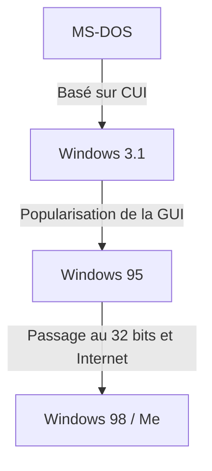

# Introduction : La trajectoire du système d'exploitation qui a conquis le marché des PC

Lorsque l'on parle de l'histoire des ordinateurs personnels, l'évolution de Microsoft Windows est incontournable. Le chemin parcouru depuis l'interface utilisateur en mode caractère (CUI) des années 1980, avec ses écrans noirs et ses textes blancs, jusqu'à l'interface utilisateur graphique (GUI) riche et intuitive d'aujourd'hui, n'a pas été qu'un simple changement d'apparence, mais s'est accompagné d'une transformation fondamentale de l'architecture informatique.

Dans cet article, nous plongerons dans l'évolution technique qui a commencé avec le système d'exploitation monotâche MS-DOS, a traversé l'ère de l'adoption massive de Windows 3.1 et Windows 95, pour finalement aboutir à l'unification sous le « noyau Windows NT », qui constitue la base de tous les systèmes Windows modernes.

## L'ère de MS-DOS : Un départ depuis un écran noir

Introduit en 1981 avec l'apparition de l'IBM PC, MS-DOS est devenu le standard de facto du marché des PC par la suite. Le matériel de l'époque était extrêmement limité, la mémoire se mesurait en kilo-octets et les disquettes étaient le principal moyen de stockage. Par conséquent, le rôle attendu du système d'exploitation se limitait au strict minimum : « lire et écrire sur des disques » et « exécuter des programmes ».

Les utilisateurs saisissaient des commandes à partir du clavier pour donner des instructions à l'ordinateur.

```text
C:\> DIR
C:\> COPY FILE.TXT A:
```

Cependant, des fonctionnalités qui nous semblent aujourd'hui évidentes dans les systèmes d'exploitation modernes manquaient à MS-DOS.
* **Absence de multitâche :** Un seul programme pouvait être exécuté à la fois.
* **Absence de protection de la mémoire :** Les applications pouvaient accéder librement à l'ensemble de la mémoire, de sorte qu'un seul bogue pouvait faire planter tout le système.
* **Contrôle direct du matériel :** Les programmes accédaient directement aux cartes vidéo et aux cartes son, ce qui entraînait de fréquents problèmes de compatibilité selon le matériel.

## De Windows 3.1 à Windows 95 : La révolution de l'interface graphique

Apparu en 1992, Windows 3.1 n'était pas strictement un système d'exploitation, mais un « environnement GUI (environnement d'exploitation) fonctionnant sur MS-DOS ». Cependant, l'expérience de pouvoir manipuler des fenêtres avec une souris et d'exécuter plusieurs applications en parallèle (multitâche coopératif) a été révolutionnaire pour le grand public.

Puis, en 1995, **Windows 95** a été lancé. Doté d'un bouton Démarrer et d'une barre des tâches, il a établi les fondements de l'interface utilisateur de Windows telle que nous la connaissons aujourd'hui. En interne, le passage au 32 bits a progressé, prenant en charge le multitâche préemptif et le Plug and Play. Cela a ouvert la porte à l'ère d'Internet.



## Les limites du système d'exploitation de la série 9x et le cauchemar de l'écran bleu

Windows 95, 98 et Me, appelés la « série 9x », ont connu un énorme succès auprès du grand public. Cependant, ils présentaient une faiblesse fatale : ils étaient toujours **construits sur l'héritage de MS-DOS**.

En privilégiant la rétrocompatibilité pour exécuter les anciens logiciels DOS et les logiciels Windows 3.1 en 16 bits, le système s'était transformé en un code spaghetti rempli de correctifs. Les conflits d'espace mémoire entre les applications étaient fréquents, et il n'était pas possible d'empêcher complètement les accès non autorisés à l'espace noyau (le cœur du système d'exploitation).

Le résultat en a été le tristement célèbre **Écran bleu de la mort (BSOD)**. La terreur de voir toutes les données en cours de travail disparaître instantanément avec un écran bleu était une expérience commune pour les utilisateurs de PC de l'époque.

## Le noyau Windows NT : La « Nouvelle Technologie » tournée vers l'avenir

Pendant que la série 9x destinée aux consommateurs souffrait des écrans bleus, Microsoft développait un système d'exploitation entièrement nouveau en coulisses : **Windows NT (New Technology)**.

Windows NT 3.1, lancé en 1993, a été conçu à partir de zéro, principalement pour les professionnels des entreprises, tels que les serveurs et les postes de travail. La philosophie de conception était centrée sur la « stabilité », la « sécurité » et la « portabilité ».

### Principales caractéristiques du noyau NT

1. **Protection complète de la mémoire :** Chaque application se voit attribuer un espace de mémoire virtuelle indépendant, ce qui l'empêche de détruire d'autres programmes ou les parties centrales du système d'exploitation (espace noyau).
2. **Multitâche préemptif :** Le planificateur du système d'exploitation alloue strictement le temps du processeur à chaque processus, de sorte que si une application se bloque, elle n'entraîne pas tout le système avec elle.
3. **Abstraction matérielle (HAL) :** La couche d'abstraction matérielle (Hardware Abstraction Layer) sépare le système d'exploitation lui-même du matériel, ce qui facilite son portage vers diverses architectures de processeur (x86, MIPS, Alpha, PowerPC, et plus tard ARM).

## Windows XP : L'unification de deux mondes

Bien que Windows NT fût excellent, il nécessitait des spécifications élevées et était faible dans les jeux et les fonctions multimédias, il a donc fallu du temps pour qu'il se propage dans les foyers ordinaires. Pendant longtemps, le système à deux lignes « série 9x pour la maison » et « série NT pour les entreprises » s'est maintenu, mais l'évolution du matériel a commencé à rattraper les exigences du noyau NT.

En 2001, ces deux mondes ont finalement été unifiés. Ce fut **Windows XP**.
Tout en ayant l'apparence familière d'une interface utilisateur pour les consommateurs, il intégrait en interne le noyau NT (NT 5.1) basé sur le robuste Windows 2000 (NT 5.0). Cela a permis aux utilisateurs ordinaires d'obtenir un environnement PC stable où « l'écran bleu n'apparaît que très rarement ».

## Les profondeurs de l'architecture : l'API Win32 et le Registre

Deux éléments sont essentiels pour comprendre le Windows moderne : l'« API Win32 » et le « Registre ».

### L'API Win32 : Le dialogue entre l'application et le système d'exploitation
L'API Win32 (Application Programming Interface) est un ensemble de fonctions standard permettant aux programmes fonctionnant sous Windows d'utiliser les fonctionnalités du système d'exploitation (dessiner des fenêtres, lire et écrire des fichiers, communiquer sur le réseau, etc.).
Le point fort de cette API réside dans son **incroyable rétrocompatibilité**. Il n'est pas rare qu'une application Win32 écrite il y a 20 ans fonctionne encore parfaitement sur le dernier Windows 11. C'est un avantage majeur pour les développeurs et l'une des raisons pour lesquelles Windows maintient une part de marché écrasante dans le secteur des entreprises.

### Le Registre Windows : La gigantesque base de données du système
Dans les premières versions de Windows (avant la 3.1), les paramètres du système et des applications étaient dispersés et enregistrés au format texte dans d'innombrables fichiers `.ini`. Cela rendait la gestion très complexe.
Avec l'essor de la série NT, c'est le **Registre** qui a pris un rôle central. Il s'agit d'une base de données hiérarchique qui gère tout de manière centralisée, des paramètres fondamentaux du système d'exploitation aux informations sur les logiciels installés, en passant par les paramètres de l'utilisateur.

Bien que cela permette un accès très rapide, cela a également créé un nouveau défi : « si le Registre devient trop volumineux ou corrompu, le système devient instable ».

## Conclusion : Windows 11 et au-delà

Depuis Windows XP, le système d'exploitation a continué d'évoluer avec Vista, 7, 8, 10 et Windows 11. Des fonctionnalités sont ajoutées quotidiennement, telles que le renforcement de la sécurité (UAC, Secure Boot), l'achèvement de la transition vers le 64 bits, l'intégration avec le cloud et l'intégration de l'IA (Copilot).

Cependant, à sa base, le robuste « noyau NT » conçu dans les années 1990 bat toujours son plein. Cette architecture, qui s'est affranchie de la coquille de DOS et a été reconstruite à partir de zéro, peut véritablement être considérée comme la véritable force de Microsoft, soutenant le monde des PC depuis plus de 30 ans.
