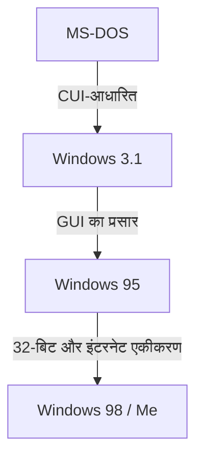

# परिचय: पीसी बाज़ार पर कब्ज़ा करने वाले ऑपरेटिंग सिस्टम की यात्रा

पर्सनल कंप्यूटर के इतिहास के बारे में बात करते समय, Microsoft Windows के विकास को नज़रअंदाज़ नहीं किया जा सकता। 1980 के दशक के CUI (कैरेक्टर यूज़र इंटरफ़ेस) से शुरू होकर, जिसमें केवल काली स्क्रीन और सफेद टेक्स्ट था, आधुनिक रिच और सहज GUI (ग्राफिकल यूज़र इंटरफ़ेस) तक की यात्रा महज़ दिखावट में बदलाव नहीं थी। इसके साथ कंप्यूटर आर्किटेक्चर में एक बुनियादी बदलाव भी शामिल था।

इस लेख में, हम MS-DOS नामक सिंगल-टास्किंग OS से शुरू होकर, Windows 3.1 और Windows 95 के अभूतपूर्व प्रसार के युग से होते हुए, "Windows NT कर्नेल" तक तकनीकी विकास पर गहराई से नज़र डालेंगे, जो आज के सभी Windows का आधार है।

## MS-DOS का युग: काली स्क्रीन से शुरुआत

1981 में IBM PC की शुरुआत के साथ पेश किया गया MS-DOS, बाद में PC बाज़ार का वास्तविक मानक (de facto standard) बन गया। उस समय हार्डवेयर बहुत ही सीमित था, मेमोरी किलोबाइट में मापी जाती थी, और स्टोरेज के लिए मुख्य रूप से फ्लॉपी डिस्क का उपयोग किया जाता था। इसलिए, OS से भी कम से कम काम, यानी "डिस्क को पढ़ना/लिखना" और "प्रोग्राम चलाना" ही अपेक्षित था।

यूज़र कीबोर्ड से कमांड दर्ज करके कंप्यूटर को निर्देश देते थे।

```text
C:\> DIR
C:\> COPY FILE.TXT A:
```

हालाँकि, इस MS-DOS में उन सुविधाओं का अभाव था जो आधुनिक OS में आम मानी जाती हैं।
* **मल्टीटास्किंग का अभाव:** एक समय में केवल एक ही प्रोग्राम चलाया जा सकता था।
* **मेमोरी सुरक्षा का अभाव:** एप्लीकेशन पूरे मेमोरी स्पेस में आज़ादी से एक्सेस कर सकते थे, इसलिए एक बग पूरे सिस्टम को क्रैश कर सकता था।
* **हार्डवेयर का सीधा नियंत्रण:** प्रोग्राम सीधे वीडियो कार्ड और साउंड कार्ड को नियंत्रित करते थे, जिससे हार्डवेयर के बीच संगतता (compatibility) की समस्याएँ अक्सर होती थीं।

## Windows 3.1 से Windows 95 तक: GUI क्रांति

1992 में रिलीज़ हुआ Windows 3.1 तकनीकी रूप से कोई OS नहीं था, बल्कि यह "MS-DOS पर चलने वाला GUI वातावरण" था। हालाँकि, माउस से विंडो को नियंत्रित करना और एक साथ कई एप्लिकेशन चलाना (नॉन-प्रिम्प्टिव मल्टीटास्किंग) आम यूज़र्स के लिए एक क्रांतिकारी अनुभव था।

और फिर 1995 में, **Windows 95** रिलीज़ हुआ। स्टार्ट बटन और टास्कबार जैसी सुविधाओं के साथ, इसने आज के Windows UI की नींव रखी। आंतरिक रूप से भी यह 32-बिट आर्किटेक्चर की ओर बढ़ा, जिसमें प्रिम्प्टिव मल्टीटास्किंग और प्लग-एंड-प्ले का समर्थन था। इसने इंटरनेट युग के दरवाज़े खोल दिए।



## 9x सीरीज़ OS की सीमाएँ और ब्लू स्क्रीन का दुःस्वप्न

Windows 95, 98 और Me को "9x सीरीज़" कहा जाता था और ये उपभोक्ताओं (consumers) के बीच बेहद सफल रहे। लेकिन इनमें एक बहुत बड़ी कमज़ोरी थी: **ये अभी भी MS-DOS की बुनियाद पर बने थे**।

पुराने DOS और 16-बिट Windows 3.1 सॉफ़्टवेयर को चलाने के लिए बैकवर्ड कम्पैटिबिलिटी (backward compatibility) को प्राथमिकता देने के कारण, सिस्टम का कोड एक उलझे हुए स्पैगेटी कोड (spaghetti code) में बदल गया। एप्लिकेशंस के बीच मेमोरी टकराव बहुत आम बात थी, और कर्नेल स्पेस (OS का मुख्य हिस्सा) में अनाधिकृत एक्सेस को पूरी तरह से रोकना संभव नहीं था।

नतीजतन, मशहूर **Blue Screen of Death (BSOD)** की समस्या सामने आई। काम करते समय अचानक डेटा का नीली स्क्रीन के साथ उड़ जाना उस समय के PC यूज़र्स का एक आम अनुभव था।

## Windows NT कर्नेल: भविष्य की 'नई तकनीक' (New Technology)

जब उपभोक्ता-उन्मुख 9x सीरीज़ ब्लू स्क्रीन से जूझ रही थी, तब Microsoft गुप्त रूप से एक बिल्कुल नया OS विकसित कर रहा था। वह **Windows NT (New Technology)** था।

1993 में पेश किए गए Windows NT 3.1 को शुरुआत से ही सर्वर और वर्कस्टेशन जैसे व्यावसायिक (business/professional) उपयोग के लिए डिज़ाइन किया गया था। इसके डिज़ाइन के मूल सिद्धांत "स्थिरता", "सुरक्षा" और "पोर्टेबिलिटी" थे।

### NT कर्नेल की मुख्य विशेषताएँ

1. **संपूर्ण मेमोरी सुरक्षा:** प्रत्येक एप्लिकेशन को एक अलग वर्चुअल मेमोरी स्पेस दिया जाता है ताकि वह अन्य प्रोग्रामों या OS के मुख्य हिस्से (कर्नेल स्पेस) को नुकसान न पहुँचा सके।
2. **प्रिम्प्टिव मल्टीटास्किंग:** OS का शेड्यूलर हर प्रोसेस को सख्ती से CPU का समय बांटता है, जिससे एक ऐप के फ्रीज़ होने पर पूरा सिस्टम क्रैश नहीं होता।
3. **हार्डवेयर एब्स्ट्रेक्शन (HAL):** Hardware Abstraction Layer की वजह से OS और हार्डवेयर अलग हो जाते हैं, जिससे इसे विभिन्न CPU आर्किटेक्चर (x86, MIPS, Alpha, PowerPC, और बाद में ARM) पर पोर्ट करना आसान हो गया।

## Windows XP: दो दुनियाओं का मिलन

यद्यपि Windows NT बहुत शक्तिशाली था, लेकिन इसके लिए उच्च हार्डवेयर स्पेसिफिकेशन्स की आवश्यकता थी। इसके अलावा, यह गेम और मल्टीमीडिया के मामले में भी कमज़ोर था, इसलिए इसे आम घरों तक पहुँचने में समय लगा। काफी समय तक, "घरेलू उपयोग के लिए 9x सीरीज़" और "व्यावसायिक उपयोग के लिए NT सीरीज़" की दो अलग-अलग लाइनें चलती रहीं। लेकिन जैसे-जैसे हार्डवेयर विकसित हुआ, यह NT कर्नेल की आवश्यकताओं को पूरा करने लगा।

2001 में, आखिरकार इन दोनों दुनियाओं का एकीकरण हो गया। और वह था **Windows XP**।
बाहर से इसका UI आम यूज़र्स के लिए अनुकूल (consumer-friendly) था, जबकि अंदर यह मज़बूत Windows 2000 (NT 5.0) पर आधारित NT कर्नेल (NT 5.1) से संचालित था। इससे आम यूज़र्स को एक स्थिर PC वातावरण मिला, जहाँ "ब्लू स्क्रीन बहुत कम दिखाई देती थी"।

## आर्किटेक्चर की गहराई: Win32 API और रजिस्ट्री

आधुनिक Windows को समझने के लिए "Win32 API" और "रजिस्ट्री" दो महत्वपूर्ण तत्व हैं।

### Win32 API: एप्लिकेशन और OS के बीच संवाद
Win32 API (Application Programming Interface) स्टैंडर्ड फंक्शन्स का एक समूह है, जिसके माध्यम से Windows पर चलने वाले प्रोग्राम OS की सुविधाओं (जैसे विंडो बनाना, फाइल पढ़ना/लिखना, नेटवर्क संचार आदि) का उपयोग करते हैं।
इस API की सबसे बड़ी ताकत इसकी **अविश्वसनीय बैकवर्ड कम्पैटिबिलिटी** है। यह कोई आश्चर्य की बात नहीं है कि 20 साल पहले बना Win32 एप्लिकेशन आज के लेटेस्ट Windows 11 पर भी बिना किसी बदलाव के चल जाए। यह डेवलपर्स के लिए बहुत फायदेमंद है और यही वजह है कि एंटरप्राइज़ बाज़ार में Windows का इतना बड़ा कब्ज़ा है।

### Windows रजिस्ट्री: सिस्टम का विशाल डेटाबेस
शुरुआती Windows (3.1 और उससे पहले) में, सिस्टम और एप्लिकेशन की सेटिंग्स टेक्स्ट फॉर्मेट में अनगिनत `.ini` फाइलों में बिखरी होती थीं। इससे उनका प्रबंधन करना बहुत मुश्किल होता था।
NT सीरीज़ के उदय के साथ, **रजिस्ट्री** ने यह मुख्य भूमिका निभानी शुरू की। यह एक पदानुक्रमित (hierarchical) डेटाबेस है जो OS की मुख्य सेटिंग्स से लेकर, इंस्टॉल किए गए सॉफ़्टवेयर की जानकारी और यूज़र की सेटिंग्स तक सब कुछ एक ही जगह पर मैनेज करता है।

हालाँकि इससे डेटा तक तेज़ी से पहुँचना संभव हुआ, लेकिन इसने एक नई समस्या भी पैदा की: "यदि रजिस्ट्री बहुत बड़ी हो जाए या खराब (corrupted) हो जाए, तो सिस्टम अस्थिर हो जाता है।"

## निष्कर्ष: Windows 11 और उसके आगे

Windows XP के बाद से, OS लगातार विकसित हो रहा है—Vista, 7, 8, 10, और अब Windows 11। सुरक्षा सुविधाओं में सुधार (UAC, सुरक्षित बूट), 64-बिट आर्किटेक्चर का पूरा होना, क्लाउड एकीकरण, और AI (Copilot) का समावेश जैसी नई सुविधाएँ हर दिन जुड़ रही हैं।

लेकिन इसके मूल में आज भी वही मज़बूत "NT कर्नेल" मौजूद है जिसे 1990 के दशक में डिज़ाइन किया गया था। DOS की सीमाएँ पार करके, शून्य से फिर से बनाया गया यह आर्किटेक्चर ही Microsoft की असली ताकत है, जिसने 30 से अधिक वर्षों से PC की दुनिया को संभाले रखा है।
