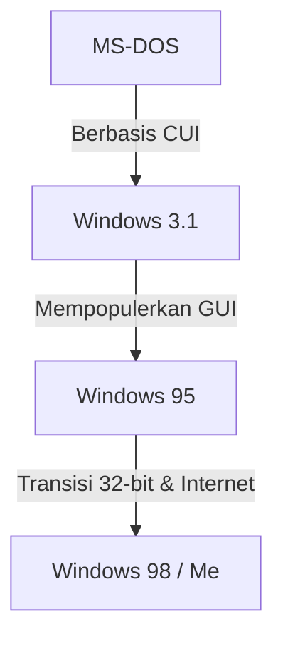

# Pendahuluan: Jejak Sistem Operasi yang Mendominasi Pasar PC

Saat berbicara tentang sejarah komputer pribadi (PC), evolusi Microsoft Windows tidak dapat diabaikan. Dimulai dengan CUI (Character User Interface) yang hanya berupa layar hitam dan teks putih pada tahun 1980-an, hingga mencapai GUI (Graphical User Interface) yang kaya dan intuitif di era modern, perjalanan ini bukan sekadar perubahan tampilan, melainkan melibatkan transformasi mendasar dalam arsitektur komputer.

Artikel ini akan menggali lebih dalam transformasi teknis yang dimulai dari OS tugas tunggal (single-task) bernama MS-DOS, melewati era ledakan popularitas Windows 3.1 dan Windows 95, hingga integrasi ke dalam "Kernel Windows NT" yang menjadi fondasi bagi semua sistem operasi Windows modern.

## Era MS-DOS: Berangkat dari Layar Hitam

Diluncurkan pada tahun 1981 bersamaan dengan kehadiran IBM PC, MS-DOS menjadi standar de facto pasar PC pada saat itu. Perangkat keras di era tersebut sangatlah terbatas; memori diukur dalam hitungan kilobyte, dan penyimpanan utama menggunakan floppy disk. Oleh karena itu, peran yang diharapkan dari OS hanya sebatas fungsi minimal seperti "membaca dan menulis disk" serta "menjalankan program".

Pengguna memasukkan perintah dari keyboard untuk memberikan instruksi kepada komputer.

```text
C:\> DIR
C:\> COPY FILE.TXT A:
```

Namun, MS-DOS kehilangan banyak fitur yang dianggap biasa di OS modern:
* **Kurangnya Multitasking:** Hanya satu program yang dapat dijalankan pada satu waktu.
* **Kurangnya Perlindungan Memori:** Aplikasi memiliki akses bebas ke seluruh memori, sehingga satu bug saja bisa membuat seluruh sistem crash.
* **Kontrol Perangkat Keras Langsung:** Program langsung berinteraksi dengan kartu video atau kartu suara, menyebabkan sering terjadinya masalah kompatibilitas antar perangkat keras.

## Dari Windows 3.1 ke Windows 95: Revolusi GUI

Windows 3.1 yang dirilis pada tahun 1992, secara teknis bukanlah sebuah OS melainkan "Lingkungan GUI (lingkungan operasional) yang berjalan di atas MS-DOS". Namun, pengalaman mengoperasikan jendela dengan mouse dan menjalankan beberapa aplikasi secara bersamaan (non-preemptive multitasking) adalah sebuah revolusi bagi pengguna umum.

Kemudian pada tahun 1995, **Windows 95** diluncurkan. Dengan tombol Start dan taskbar, Windows 95 meletakkan dasar bagi antarmuka pengguna (UI) Windows yang kita kenal saat ini. Secara internal, sistem mulai beralih ke 32-bit, mendukung preemptive multitasking dan Plug and Play. Ini membuka pintu menuju era internet.



## Keterbatasan OS Seri 9x dan Mimpi Buruk Blue Screen

Windows 95, 98, dan Me, yang disebut sebagai "seri 9x", meraih kesuksesan besar di pasar konsumen. Namun, sistem-sistem ini memiliki kelemahan fatal karena **masih dibangun di atas warisan MS-DOS**.

Akibat memprioritaskan kompatibilitas mundur (backward compatibility) untuk menjalankan perangkat lunak MS-DOS dan Windows 3.1 16-bit, sistem tersebut berubah menjadi kode spageti yang tambal sulam. Aplikasi sering kali saling bertabrakan di ruang memori, dan akses tidak sah ke ruang kernel (jantung sistem operasi) tidak dapat dicegah sepenuhnya.

Hasilnya adalah **Blue Screen of Death (BSOD)** yang sangat terkenal. Ketakutan akan data pekerjaan yang hilang dalam sekejap bersamaan dengan layar biru merupakan pengalaman umum pengguna PC pada masa itu.

## Kernel Windows NT: "New Technology" untuk Masa Depan

Di balik layar ketika seri 9x untuk konsumen berjuang melawan Blue Screen, Microsoft sedang mengembangkan sebuah sistem operasi yang sama sekali baru, yaitu **Windows NT (New Technology)**.

Windows NT 3.1 yang dirilis pada tahun 1993 dirancang dari nol dengan menargetkan kalangan profesional bisnis, server, dan workstation. Pusat dari filosofi desainnya adalah "stabilitas", "keamanan", dan "portabilitas".

### Fitur Utama Kernel NT

1. **Perlindungan Memori Penuh:** Setiap aplikasi dialokasikan ruang memori virtual independen, sehingga mereka tidak dapat merusak program lain atau bagian inti dari OS (ruang kernel).
2. **Preemptive Multitasking:** Penjadwal OS secara ketat mengalokasikan waktu CPU ke setiap proses, sehingga ketika satu aplikasi hang, sistem secara keseluruhan tidak akan ikut mati.
3. **Abstraksi Perangkat Keras (HAL):** Melalui Hardware Abstraction Layer, sistem operasi dipisahkan dari perangkat keras, membuatnya lebih mudah untuk di-porting ke berbagai arsitektur CPU (x86, MIPS, Alpha, PowerPC, dan kemudian ARM).

## Windows XP: Integrasi Dua Dunia

Meskipun Windows NT sangat unggul, persyaratan spesifikasinya tinggi dan kemampuannya dalam permainan serta fungsi multimedia cukup lemah, sehingga butuh waktu lama untuk bisa diadopsi oleh pengguna rumahan. Selama beberapa waktu, sistem 2 jalur ("seri 9x untuk rumahan" dan "seri NT untuk bisnis") berlanjut. Namun, seiring dengan berkembangnya perangkat keras, spesifikasi mulai mengejar tuntutan kernel NT.

Pada tahun 2001, kedua dunia ini akhirnya disatukan lewat **Windows XP**.
Di luarnya, ia memiliki antarmuka yang ramah bagi konsumen, namun di dalamnya tertanam kernel NT (NT 5.1) yang tangguh berbasis Windows 2000 (NT 5.0). Dengan ini, pengguna umum akhirnya bisa menikmati lingkungan PC yang stabil di mana "Blue Screen jarang muncul".

## Kedalaman Arsitektur: Win32 API dan Registry

Dua elemen yang sangat penting untuk memahami Windows modern adalah "Win32 API" dan "Registry".

### Win32 API: Komunikasi antara Aplikasi dan OS
Win32 API (Application Programming Interface) adalah kumpulan fungsi standar bagi program yang berjalan di Windows untuk menggunakan fitur sistem operasi (seperti menggambar jendela, membaca/menulis file, komunikasi jaringan, dll.).
Kekuatan utama dari API ini terletak pada **kompatibilitas mundurnya yang luar biasa**. Tidak jarang aplikasi Win32 yang ditulis 20 tahun lalu masih bisa berjalan dengan sempurna di Windows 11 terbaru. Ini adalah keuntungan besar bagi para pengembang perangkat lunak, dan merupakan salah satu alasan mengapa Windows mempertahankan pangsa pasarnya yang besar di pasar enterprise.

### Windows Registry: Basis Data Raksasa Sistem
Pada Windows versi awal (sebelum 3.1), pengaturan sistem dan aplikasi disimpan secara terpisah dalam file teks dengan format `.ini` dalam jumlah yang sangat banyak. Hal ini membuat manajemen menjadi sangat rumit.
Dengan bangkitnya seri NT, **Registry** mulai memainkan peran sentral. Registry adalah basis data hierarkis yang mengelola semuanya secara terpusat, mulai dari pengaturan inti OS, informasi perangkat lunak yang terinstal, hingga pengaturan pengguna.

Meskipun memungkinkan akses dengan kecepatan tinggi, hal ini juga menciptakan masalah baru: "sistem bisa menjadi tidak stabil jika registry membengkak atau rusak".

## Penutup: Windows 11 dan Masa Depan

Sejak Windows XP, sistem operasi ini terus berevolusi melalui Vista, 7, 8, 10, dan sekarang Windows 11. Berbagai fitur terus ditambahkan setiap harinya, mulai dari peningkatan fungsi keamanan (UAC, Secure Boot), penyelesaian transisi ke 64-bit, integrasi komputasi awan (cloud), hingga penerapan kecerdasan buatan (Copilot).

Namun, pada intinya, "kernel NT" yang kokoh yang dirancang pada tahun 1990-an masih terus hidup dan bernapas. Menghancurkan cangkang DOS dan membangun kembali dari nol, arsitektur inilah yang bisa disebut sebagai kekuatan sesungguhnya dari Microsoft, yang terus menopang dunia PC selama lebih dari 30 tahun.
