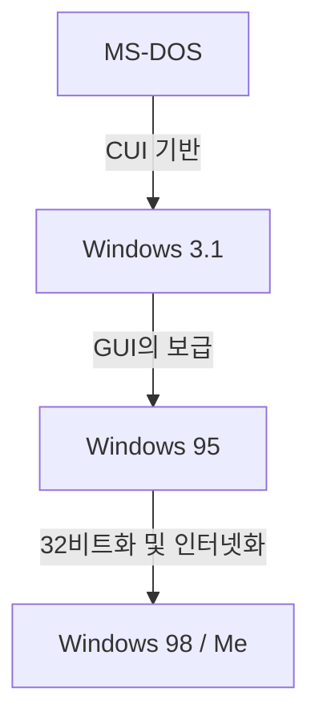

# 시작하며: PC 시장을 제패한 운영체제의 궤적

퍼스널 컴퓨터의 역사를 이야기할 때, Microsoft Windows의 진화는 빼놓을 수 없습니다. 1980년대 검은 화면에 흰 글씨만 있던 CUI(캐릭터 유저 인터페이스)로 시작해 오늘날의 풍부하고 직관적인 GUI(그래픽 유저 인터페이스)에 이르기까지의 과정은 단순한 외관의 변화가 아닌, 컴퓨터 아키텍처의 근본적인 변혁을 동반한 것이었습니다.

이 글에서는 단일 작업 OS인 MS-DOS에서 시작하여 Windows 3.1과 Windows 95라는 폭발적인 보급 시대를 거쳐, 현대 모든 Windows의 기반이 된 'Windows NT 커널'로 통합되기까지의 기술적 변천 과정을 깊이 있게 살펴봅니다.

## MS-DOS의 시대: 검은 화면에서의 출발

1981년 IBM PC의 등장과 함께 채택된 MS-DOS는 이후 PC 시장의 사실상 표준이 되었습니다. 당시 하드웨어는 매우 빈약하여 메모리는 킬로바이트 단위였고, 저장 장치도 플로피 디스크가 주류였습니다. 따라서 OS에 요구되는 역할도 '디스크 읽기 및 쓰기'와 '프로그램 실행'이라는 최소한의 기능으로 제한되었습니다.

사용자는 키보드로 명령어를 입력하여 컴퓨터에 지시를 내립니다.

```text
C:\> DIR
C:\> COPY FILE.TXT A:
```

하지만 이 MS-DOS에는 현대 OS에서는 당연한 기능들이 빠져 있었습니다.
* **멀티태스킹의 부재:** 한 번에 하나의 프로그램만 실행할 수 있습니다.
* **메모리 보호의 부재:** 애플리케이션이 메모리 전체에 자유롭게 접근할 수 있어, 버그 하나가 시스템 전체를 다운시킬 수 있습니다.
* **하드웨어 직접 제어:** 프로그램이 비디오 카드나 사운드 카드를 직접 제어하기 때문에, 하드웨어별 호환성 문제가 빈번하게 발생했습니다.

## Windows 3.1에서 Windows 95로: GUI 혁명

1992년에 등장한 Windows 3.1은 엄밀히 말해 OS가 아니라 'MS-DOS 위에서 동작하는 GUI 환경(운영 환경)'이었습니다. 하지만 마우스로 창을 조작하고 여러 애플리케이션을 병렬로 실행할 수 있다는 점(비선점형 멀티태스킹)은 일반 사용자에게 혁명적인 경험이었습니다.

그리고 1995년, **Windows 95**가 출시됩니다. 시작 버튼과 작업 표시줄을 갖추어 오늘날 Windows UI의 기초를 확립했습니다. 내부적으로도 32비트화가 진행되어 선점형 멀티태스킹과 플러그 앤 플레이를 지원하며, 인터넷 시대로 가는 문을 열게 됩니다.



## 9x 계열 OS의 한계와 블루스크린의 악몽

Windows 95, 98, Me는 '9x 계열'로 불리며 소비자 시장에서 큰 성공을 거두었습니다. 하지만 이들은 여전히 **MS-DOS의 유산 위에 구축되어 있다**는 치명적인 약점을 안고 있었습니다.

과거 DOS용 소프트웨어나 16비트 Windows 3.1용 소프트웨어를 실행하기 위한 하위 호환성을 중시한 결과, 시스템은 누더기 같은 스파게티 코드가 되었습니다. 애플리케이션 간 메모리 영역 충돌이 일어나기 쉬웠고, 커널 공간(OS의 심장부)에 대한 잘못된 접근도 완벽하게 막을 수 없었습니다.

그 결과가 바로 그 유명한 **블루스크린(Blue Screen of Death, BSOD)**입니다. 작업 중이던 데이터가 순식간에 파란 화면과 함께 사라지는 공포는 당시 PC 사용자들의 공통된 경험이었습니다.

## Windows NT 커널: 미래를 향한 '신기술(New Technology)'

소비자용 9x 계열이 블루스크린으로 고통받고 있던 이면에, Microsoft는 완전히 새로운 OS를 개발하고 있었습니다. 그것이 바로 **Windows NT(New Technology)**입니다.

1993년에 등장한 Windows NT 3.1은 처음부터 서버나 워크스테이션 같은 비즈니스 전문가용으로 처음부터 새롭게 설계되었습니다. 설계 사상의 중심에는 '안정성', '보안', '이식성'이 있었습니다.

### NT 커널의 주요 특징

1. **완벽한 메모리 보호:** 애플리케이션마다 독립된 가상 메모리 공간이 할당되어, 다른 프로그램이나 OS의 핵심 부분(커널 공간)을 파괴할 수 없게 되어 있습니다.
2. **선점형 멀티태스킹:** OS의 스케줄러가 각 프로세스에 CPU 시간을 엄격하게 할당하기 때문에, 하나의 앱이 멈춰도 시스템 전체가 영향을 받지 않습니다.
3. **하드웨어 추상화(HAL):** 하드웨어 추상화 계층(Hardware Abstraction Layer)을 통해 OS 본체와 하드웨어가 분리되어, 다양한 CPU 아키텍처(x86, MIPS, Alpha, PowerPC, 훗날 ARM)로 쉽게 이식할 수 있게 되었습니다.

## Windows XP: 두 세계의 통합

Windows NT는 매우 우수했지만 요구 사양이 높고, 게임이나 멀티미디어 기능에 취약하여 일반 가정에 보급되기까지는 시간이 걸렸습니다. 오랫동안 '가정용 9x 계열'과 '업무용 NT 계열'이라는 이원화 체제가 이어졌으나, 하드웨어의 발전이 NT 커널의 요구 사항을 따라잡기 시작했습니다.

2001년, 마침내 이 두 세계가 통합되었습니다. 바로 **Windows XP**입니다.
외관은 친숙한 소비자용 UI이면서도, 내부에는 견고한 Windows 2000(NT 5.0)을 기반으로 한 NT 커널(NT 5.1)이 탑재되었습니다. 이로써 일반 사용자들도 '블루스크린이 거의 뜨지 않는' 안정적인 PC 환경을 갖게 된 것입니다.

## 아키텍처의 심연: Win32 API와 레지스트리

현대 Windows를 이해하는 데 빼놓을 수 없는 두 가지 요소가 바로 'Win32 API'와 '레지스트리'입니다.

### Win32 API: 애플리케이션과 OS의 대화
Win32 API(Application Programming Interface)는 Windows에서 동작하는 프로그램이 OS의 기능(창 그리기, 파일 읽고 쓰기, 네트워크 통신 등)을 사용하기 위한 표준 함수들의 모음입니다.
이 API의 강력한 점은 그 **경이로운 하위 호환성**에 있습니다. 20년 전에 작성된 Win32 애플리케이션이 최신 Windows 11에서도 그대로 실행되는 경우는 드물지 않습니다. 이는 개발자에게 큰 장점이며, Windows가 엔터프라이즈 시장에서 압도적인 점유율을 유지하는 이유 중 하나입니다.

### Windows 레지스트리: 시스템의 거대한 데이터베이스
초기 Windows(3.1 이전)에서는 시스템이나 애플리케이션 설정이 수많은 `.ini` 파일에 텍스트 형태로 분산 저장되어 있었습니다. 이는 관리가 번거로워지는 원인이었습니다.
NT 계열의 대두와 함께 중심적인 역할을 맡게 된 것이 **레지스트리**입니다. 이는 OS의 핵심 설정부터 설치된 소프트웨어 정보, 사용자 설정까지 모든 것을 일원화하여 관리하는 계층형 데이터베이스입니다.

빠른 접근이 가능해진 반면, '레지스트리가 비대해지거나 손상되면 시스템이 불안정해진다'는 새로운 과제도 낳았습니다.

## 마치며: Windows 11과 그 너머로

Windows XP 이후 Vista, 7, 8, 10, 그리고 Windows 11에 이르기까지 OS는 끊임없이 진화해 왔습니다. 보안 기능 강화(UAC, 보안 부팅), 64비트화의 완료, 클라우드와의 통합, AI 도입(Copilot) 등 다양한 기능이 매일 추가되고 있습니다.

하지만 그 밑바탕에는 여전히 1990년대에 설계된 견고한 'NT 커널'이 맥맥이 숨 쉬고 있습니다. DOS의 껍질을 깨고 백지상태에서 재구축된 이 아키텍처야말로 30년 넘게 PC 세계를 지탱해 온 Microsoft의 진정한 강점이라고 할 수 있을 것입니다.
