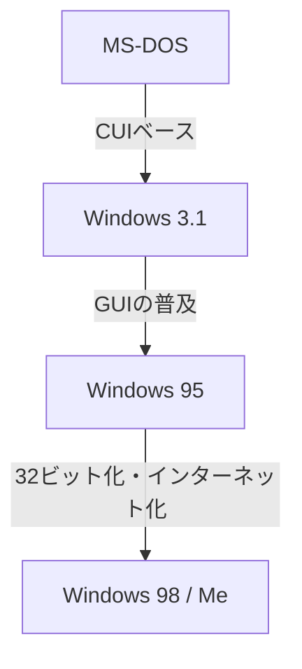

# はじめに：PC市場を制覇したオペレーティングシステムの軌跡

パーソナルコンピュータの歴史を語る上で、Microsoft Windowsの進化は避けて通れません。1980年代の黒い画面と白い文字だけのCUI（キャラクター・ユーザー・インターフェース）から始まり、現代のリッチで直感的なGUI（グラフィカル・ユーザー・インターフェース）へと至る道程は、単なる見た目の変化ではなく、コンピュータ・アーキテクチャの根本的な変革を伴うものでした。

本記事では、MS-DOSという単一タスクのOSから始まり、Windows 3.1、Windows 95という爆発的普及の時代を経て、現代のすべてのWindowsの基盤となっている「Windows NTカーネル」への統合へと至る、技術的な変遷を深く掘り下げます。

## MS-DOSの時代：黒い画面からの出発

1981年、IBM PCの登場とともに採用されたMS-DOSは、その後のPC市場のデファクトスタンダードとなりました。当時のハードウェアは極めて貧弱であり、メモリはキロバイト単位、ストレージもフロッピーディスクが主流でした。そのため、OSに求められる役割も「ディスクの読み書き」と「プログラムの実行」という最小限のものに限られていました。

ユーザーはキーボードからコマンドを入力し、コンピュータに指示を与えます。

```text
C:\> DIR
C:\> COPY FILE.TXT A:
```

しかし、このMS-DOSには現代のOSでは当たり前の機能が欠落していました。
* **マルチタスクの欠如:** 一度に一つのプログラムしか実行できません。
* **メモリ保護の欠如:** アプリケーションが自由にメモリ全体にアクセスできるため、一つのバグがシステム全体をクラッシュさせます。
* **ハードウェアの直接制御:** プログラムが直接ビデオカードやサウンドカードを叩くため、ハードウェアごとの互換性問題が頻発しました。

## Windows 3.1からWindows 95へ：GUI革命

1992年に登場したWindows 3.1は、厳密にはOSではなく「MS-DOS上で動くGUI環境（オペレーティング環境）」でした。しかし、マウスでウィンドウを操作し、複数のアプリケーションを並行して動かせる（ノンプリエンプティブ・マルチタスク）という体験は、一般ユーザーにとって革命的でした。

そして1995年、**Windows 95**が発売されます。スタートボタンとタスクバーを備え、今日のWindowsのUIの基礎を確立しました。内部的にも32ビット化が進み、プリエンプティブ・マルチタスクやプラグアンドプレイをサポート。インターネット時代への扉を開くことになります。



## 9x系OSの限界とブルースクリーンの悪夢

Windows 95、98、Meは「9x系」と呼ばれ、消費者向けに大成功を収めました。しかし、これらは依然として**MS-DOSの遺産の上に構築されていた**という致命的な弱点を抱えていました。

過去のDOS用ソフトや16ビットのWindows 3.1用ソフトを動かすための後方互換性を重視した結果、システムは継ぎ接ぎだらけのスパゲティコードと化していました。アプリケーション同士でメモリ領域の衝突が起きやすく、カーネル空間（OSの心臓部）への不正なアクセスも完全に防ぐことはできませんでした。

その結果が、かの有名な**Blue Screen of Death (BSOD)**です。作業中のデータが一瞬にして青い画面と共に消え去る恐怖は、当時のPCユーザーの共通体験でした。

## Windows NTカーネル：未来に向けた「ニューテクノロジー」

コンシューマー向けの9x系がブルースクリーンに悩まされている裏で、Microsoftは全く新しいOSを開発していました。それが**Windows NT (New Technology)**です。

1993年に登場したWindows NT 3.1は、当初からサーバーやワークステーションといったビジネス・プロフェッショナル向けにゼロから設計されました。設計思想の中心にあったのは「安定性」「セキュリティ」「移植性」です。

### NTカーネルの主な特徴

1. **完全なメモリ保護:** アプリケーションごとに独立した仮想メモリ空間が割り当てられ、他のプログラムやOSのコア部分（カーネル空間）を破壊できないようになっています。
2. **プリエンプティブ・マルチタスク:** OSのスケジューラが各プロセスにCPU時間を厳格に割り当てるため、一つのアプリがフリーズしてもシステム全体が道連れになることはありません。
3. **ハードウェアの抽象化 (HAL):** Hardware Abstraction Layerにより、OS本体とハードウェアが分離され、様々なCPUアーキテクチャ（x86, MIPS, Alpha, PowerPC, 後にARM）へ移植しやすくなりました。

## Windows XP：2つの世界の統合

Windows NTは非常に優秀でしたが、要求スペックが高く、またゲームやマルチメディア機能に弱かったため、一般家庭に普及するには時間がかかりました。長らく「家庭用の9x系」と「業務用のNT系」という2ライン体制が続きましたが、ハードウェアの進化がNTカーネルの要求に追いつき始めます。

2001年、ついにこの2つの世界が統合されました。それが**Windows XP**です。
外見は親しみやすいコンシューマー向けのUIでありながら、内部には堅牢なWindows 2000（NT 5.0）をベースとしたNTカーネル（NT 5.1）が搭載されていました。これにより、一般ユーザーも「ブルースクリーンがめったに出ない」安定したPC環境を手に入れることになったのです。

## アーキテクチャの深淵：Win32 APIとレジストリ

現代のWindowsを理解する上で欠かせない2つの要素が「Win32 API」と「レジストリ」です。

### Win32 API：アプリケーションとOSの対話
Win32 API（Application Programming Interface）は、Windows上で動作するプログラムが、OSの機能（ウィンドウの描画、ファイルの読み書き、ネットワーク通信など）を利用するための標準的な関数の集まりです。
このAPIの強力な点は、その**驚異的な後方互換性**にあります。20年前に書かれたWin32アプリケーションが、最新のWindows 11でもそのまま動くケースは珍しくありません。これは開発者にとって大きなメリットであり、Windowsがエンタープライズ市場で圧倒的なシェアを維持する理由の一つです。

### Windows レジストリ：システムの巨大なデータベース
初期のWindows（3.1以前）では、システムやアプリケーションの設定は無数の `.ini` ファイルにテキスト形式で分散して保存されていました。これは管理が煩雑になる原因でした。
NT系の台頭とともに中心的な役割を担うようになったのが**レジストリ**です。これはOSのコアな設定から、インストールされているソフトウェアの情報、ユーザーの設定まで、すべてを一元管理する階層型のデータベースです。

高速なアクセスが可能になる一方で、「レジストリが肥大化したり破損したりするとシステムが不安定になる」という新たな課題も生み出しました。

## おわりに：Windows 11とその先へ

Windows XP以降、Vista、7、8、10、そしてWindows 11と、OSは進化を続けてきました。セキュリティ機能の強化（UAC、セキュアブート）、64ビット化の完了、クラウドとの統合、AIの組み込み（Copilot）など、機能は日々追加されています。

しかし、その根底には今でも1990年代に設計された堅牢な「NTカーネル」が脈々と息づいています。DOSの殻を破り、ゼロから再構築されたこのアーキテクチャこそが、30年以上にわたってPCの世界を支え続けるMicrosoftの真の強みと言えるでしょう。
