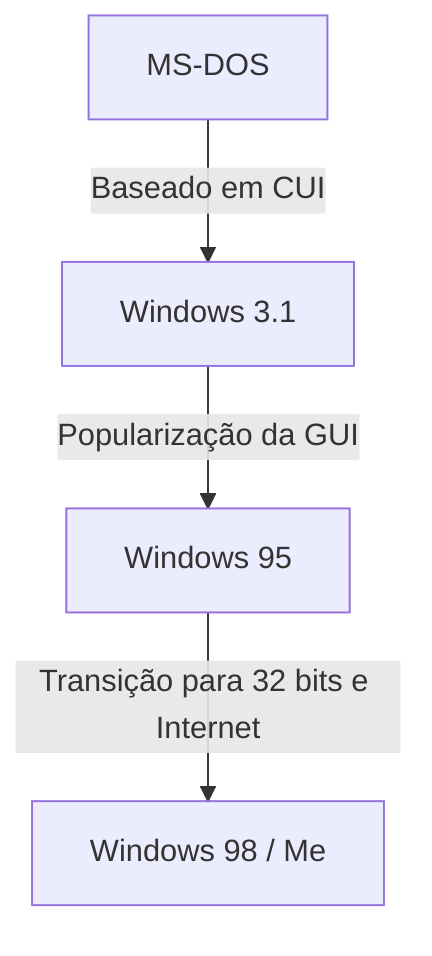

# Introdução: A Trajetória do Sistema Operacional que Conquistou o Mercado de PCs

Ao falar sobre a história dos computadores pessoais, a evolução do Microsoft Windows é inevitável. Começando com apenas uma tela preta e texto branco em uma CUI (Interface de Usuário Baseada em Caracteres) nos anos 1980, até chegar às GUIs (Interfaces Gráficas de Usuário) ricas e intuitivas de hoje, esse caminho não foi apenas uma mudança visual, mas envolveu uma transformação fundamental na arquitetura dos computadores.

Neste artigo, exploraremos a fundo a evolução técnica, desde as origens do MS-DOS como um sistema operacional de tarefa única, passando pela era de popularização explosiva com o Windows 3.1 e Windows 95, até a consolidação em torno do "Kernel do Windows NT", que serve de base para todos os sistemas Windows modernos.

## A Era do MS-DOS: Partindo da Tela Preta

Lançado em 1981 junto com o IBM PC, o MS-DOS tornou-se o padrão de fato do mercado de PCs que se seguiu. O hardware da época era extremamente limitado, a memória era medida em kilobytes e os disquetes eram a principal forma de armazenamento. Portanto, as funções exigidas do sistema operacional limitavam-se ao mínimo: "leitura e escrita em disco" e "execução de programas".

Os usuários digitavam comandos pelo teclado para dar instruções ao computador.

```text
C:\> DIR
C:\> COPY FILE.TXT A:
```

No entanto, este MS-DOS não possuía recursos que consideramos básicos em sistemas operacionais modernos.
* **Falta de multitarefa:** Apenas um programa podia ser executado por vez.
* **Falta de proteção de memória:** Como os aplicativos tinham acesso livre a toda a memória, um único bug podia fazer todo o sistema travar.
* **Controle direto de hardware:** Os programas interagiam diretamente com placas de vídeo e som, causando problemas frequentes de compatibilidade entre diferentes hardwares.

## Do Windows 3.1 ao Windows 95: A Revolução da GUI

O Windows 3.1, lançado em 1992, não era estritamente um sistema operacional, mas sim um "ambiente GUI (ambiente operacional) executado sobre o MS-DOS". No entanto, a experiência de usar um mouse para operar janelas e executar vários aplicativos simultaneamente (multitarefa cooperativa) foi revolucionária para os usuários comuns.

Então, em 1995, foi lançado o **Windows 95**. Equipado com um botão Iniciar e uma barra de tarefas, estabeleceu a base para a interface de usuário do Windows atual. Internamente, o sistema avançou para 32 bits, com suporte a multitarefa preemptiva e Plug and Play. Abriu-se assim a porta para a era da Internet.



## Os Limites dos Sistemas Operacionais da Série 9x e o Pesadelo da Tela Azul

O Windows 95, 98 e Me eram conhecidos como a "série 9x" e alcançaram grande sucesso entre os consumidores. Contudo, eles tinham uma falha fatal: ainda eram **construídos sobre o legado do MS-DOS**.

Como resultado da priorização da compatibilidade com versões anteriores para executar software antigo de DOS e de 16 bits do Windows 3.1, o sistema havia se tornado um emaranhado de código espaguete. Conflitos de espaço de memória entre aplicativos eram comuns, e não havia como evitar completamente o acesso não autorizado ao espaço do kernel (o coração do SO).

O resultado disso foi a infame **Blue Screen of Death (BSOD)** (Tela Azul da Morte). O terror de perder dados de trabalho em um instante com uma tela azul era uma experiência comum para os usuários de PC daquela época.

## O Kernel do Windows NT: A "Nova Tecnologia" para o Futuro

Enquanto a série 9x para consumidores sofria com a tela azul, a Microsoft estava desenvolvendo um sistema operacional completamente novo nos bastidores. Tratava-se do **Windows NT (New Technology)**.

Lançado em 1993, o Windows NT 3.1 foi projetado do zero para profissionais de negócios, visando servidores e estações de trabalho. Os pilares de sua filosofia de design eram "estabilidade", "segurança" e "portabilidade".

### Principais Características do Kernel NT

1. **Proteção de Memória Completa:** A cada aplicativo é alocado um espaço de memória virtual independente, garantindo que ele não possa corromper outros programas ou o núcleo do sistema operacional (espaço do kernel).
2. **Multitarefa Preemptiva:** O agendador do SO aloca estritamente o tempo de CPU para cada processo, garantindo que, se um aplicativo travar, ele não leve o sistema inteiro junto.
3. **Abstração de Hardware (HAL):** A Camada de Abstração de Hardware (Hardware Abstraction Layer) separa o SO do hardware, facilitando sua portabilidade para diversas arquiteturas de CPU (x86, MIPS, Alpha, PowerPC e, mais tarde, ARM).

## Windows XP: A Integração de Dois Mundos

O Windows NT era excelente, mas suas altas exigências de sistema e a falta de recursos para jogos e multimídia atrasaram sua adoção em ambientes domésticos. Por muito tempo, persistiu uma estrutura de duas linhas: a "série 9x para uso doméstico" e a "série NT para uso comercial". No entanto, a evolução do hardware começou a alcançar as demandas do kernel NT.

Em 2001, esses dois mundos foram finalmente integrados. O resultado foi o **Windows XP**.
Com uma interface de usuário voltada para o consumidor e de aparência amigável, ele incorporava internamente o kernel NT (NT 5.1) baseado no robusto Windows 2000 (NT 5.0). Com isso, os usuários em geral também ganharam um ambiente de PC estável onde "a tela azul raramente aparecia".

## A Profundeza da Arquitetura: Win32 API e o Registro

Dois elementos essenciais para entender o Windows moderno são a "Win32 API" e o "Registro".

### Win32 API: Diálogo Entre Aplicativo e SO
A Win32 API (Interface de Programação de Aplicativos) é um conjunto de funções padronizadas que os programas executados no Windows usam para acessar recursos do sistema operacional (como desenho de janelas, leitura e gravação de arquivos e comunicação de rede).
A força dessa API reside em sua **incrível compatibilidade com versões anteriores**. Não é incomum que aplicativos Win32 escritos há 20 anos funcionem perfeitamente no Windows 11 mais recente. Isso é um grande benefício para os desenvolvedores e uma das razões pelas quais o Windows mantém uma participação de mercado esmagadora no setor corporativo.

### O Registro do Windows: O Banco de Dados Gigante do Sistema
Nos primórdios do Windows (antes do 3.1), as configurações de sistema e dos aplicativos eram armazenadas de forma dispersa em formatos de texto dentro de incontáveis arquivos `.ini`. Isso tornava o gerenciamento algo complexo.
Com a ascensão da série NT, o **Registro** assumiu um papel central. É um banco de dados hierárquico que centraliza tudo, desde configurações essenciais do SO, informações de software instalado, até preferências do usuário.

Enquanto permitia um acesso rápido, também gerou um novo desafio: "se o registro se tornar inflado ou corrompido, o sistema ficará instável".

## Conclusão: O Windows 11 e Além

Desde o Windows XP, passando pelo Vista, 7, 8, 10 e agora o Windows 11, o sistema operacional continuou evoluindo. Melhorias na segurança (UAC, Secure Boot), a conclusão da transição para 64 bits, integração com a nuvem e incorporação de IA (Copilot) são exemplos de recursos que são adicionados diariamente.

Contudo, na sua essência, o robusto "Kernel NT" projetado na década de 1990 continua vivo. Pode-se dizer que essa arquitetura, que rompeu a casca do DOS e foi reconstruída do zero, é a verdadeira força da Microsoft, sustentando o mundo dos PCs por mais de 30 anos.
