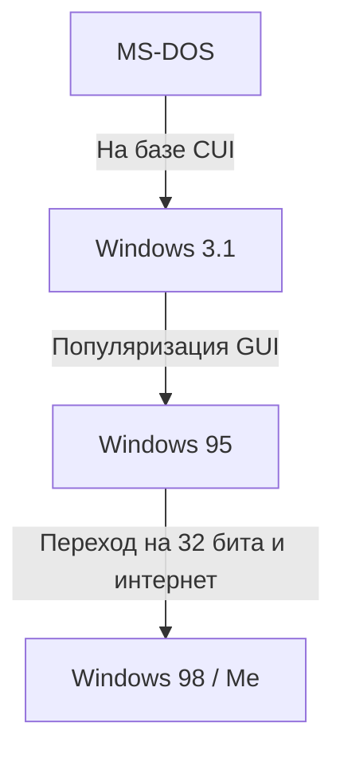

# Введение: Путь операционной системы, покорившей рынок ПК

Говоря об истории персональных компьютеров, невозможно обойти стороной эволюцию Microsoft Windows. Путь, начавшийся в 1980-х годах с черного экрана и белых букв CUI (символьного интерфейса пользователя), и приведший к современному, богатому и интуитивно понятному GUI (графическому интерфейсу пользователя) — это не просто изменение внешнего вида, но и фундаментальная трансформация компьютерной архитектуры.

В этой статье мы подробно рассмотрим техническую эволюцию: от однозадачной ОС MS-DOS, через эпоху взрывного роста Windows 3.1 и Windows 95, к интеграции на базе «ядра Windows NT», которое является основой всех современных версий Windows.

## Эпоха MS-DOS: Начиная с черного экрана

MS-DOS, появившаяся в 1981 году вместе с IBM PC, стала де-факто стандартом на рынке ПК того времени. Аппаратное обеспечение было крайне слабым: память измерялась в килобайтах, а основным накопителем были дискеты. Поэтому функции ОС ограничивались минимумом: «чтение и запись на диск» и «выполнение программ».

Пользователи вводили команды с клавиатуры, чтобы дать указания компьютеру.

```text
C:\> DIR
C:\> COPY FILE.TXT A:
```

Однако в MS-DOS отсутствовали функции, которые считаются стандартными для современных ОС:
* **Отсутствие многозадачности:** Одновременно могла выполняться только одна программа.
* **Отсутствие защиты памяти:** Приложения имели свободный доступ ко всей памяти, поэтому одна ошибка могла привести к сбою всей системы.
* **Прямое управление оборудованием:** Программы напрямую обращались к видео- и звуковым картам, что часто приводило к проблемам совместимости оборудования.

## От Windows 3.1 к Windows 95: Революция GUI

Windows 3.1, выпущенная в 1992 году, технически была не ОС, а «средой GUI, работающей поверх MS-DOS (операционной средой)». Тем не менее, возможность управлять окнами с помощью мыши и параллельно запускать несколько приложений (невытесняющая многозадачность) стала революционной для обычных пользователей.

Затем, в 1995 году, вышла **Windows 95**. Она представила кнопку «Пуск» и панель задач, заложив основы современного пользовательского интерфейса Windows. Внутренне система стала более 32-битной, получила поддержку вытесняющей многозадачности и Plug and Play. Это открыло двери в эпоху интернета.



## Пределы ОС серии 9x и кошмар синего экрана

Windows 95, 98 и Me, известные как «серия 9x», имели огромный успех на потребительском рынке. Однако у них была фатальная слабость: они все еще **строились на наследии MS-DOS**.

Из-за приоритета обратной совместимости для запуска старых программ DOS и 16-битных приложений для Windows 3.1 система превратилась в запутанный клубок спагетти-кода. Возникали частые конфликты в памяти между приложениями, и было невозможно полностью предотвратить несанкционированный доступ к пространству ядра (сердцу ОС).

Результатом стал печально известный **Синий экран смерти (BSOD)**. Страх потерять несохраненные данные в одно мгновение вместе с синим экраном был общим опытом пользователей ПК того времени.

## Ядро Windows NT: «Новые технологии» для будущего

Пока потребительская серия 9x страдала от синих экранов, Microsoft разрабатывала совершенно новую ОС. Ей стала **Windows NT (New Technology)**.

Windows NT 3.1, появившаяся в 1993 году, с самого начала разрабатывалась с нуля для бизнес-профессионалов, серверов и рабочих станций. В основе её философии лежали «стабильность», «безопасность» и «переносимость».

### Основные особенности ядра NT

1. **Полная защита памяти:** Каждому приложению выделяется независимое виртуальное адресное пространство, что не позволяет ему разрушать другие программы или ядро ОС.
2. **Вытесняющая многозадачность:** Планировщик ОС строго распределяет процессорное время между процессами, поэтому зависание одного приложения не приводит к сбою всей системы.
3. **Абстрагирование оборудования (HAL):** Уровень абстракции оборудования (Hardware Abstraction Layer) отделил саму ОС от железа, упростив её перенос на различные архитектуры процессоров (x86, MIPS, Alpha, PowerPC, а позже и ARM).

## Windows XP: Интеграция двух миров

Хотя Windows NT была превосходна, она требовала высоких аппаратных характеристик и была слаба в играх и мультимедиа, поэтому её внедрение в обычные дома заняло время. Долгое время существовали две линейки: «серия 9x для дома» и «серия NT для бизнеса», но развитие оборудования начало догонять требования ядра NT.

Наконец, в 2001 году эти два мира объединились. Это была **Windows XP**.
Внешне она имела дружелюбный потребительский интерфейс, но внутри работало надежное ядро NT (NT 5.1) на базе Windows 2000 (NT 5.0). Благодаря этому обычные пользователи получили стабильную среду ПК, где «синий экран появляется крайне редко».

## Глубины архитектуры: Win32 API и Реестр

Два элемента, без которых невозможно понять современную Windows, — это «Win32 API» и «Реестр».

### Win32 API: Диалог между приложениями и ОС
Win32 API (Application Programming Interface) — это стандартный набор функций, с помощью которых программы, работающие в Windows, могут использовать возможности ОС (отрисовка окон, чтение/запись файлов, сетевое взаимодействие и т. д.).
Сила этого API заключается в его **поразительной обратной совместимости**. Нередко приложения Win32, написанные 20 лет назад, работают без изменений даже в последней версии Windows 11. Это огромное преимущество для разработчиков и одна из причин, почему Windows сохраняет подавляющую долю на корпоративном рынке.

### Реестр Windows: Гигантская база данных системы
В ранних версиях Windows (до 3.1) настройки системы и приложений хранились в текстовом виде в бесчисленных файлах `.ini`. Это сильно усложняло управление.
С развитием серии NT центральную роль стал играть **Реестр**. Это иерархическая база данных, которая централизованно управляет всем: от основных настроек ОС до информации об установленном программном обеспечении и пользовательских конфигураций.

Обеспечивая быстрый доступ, это также создало новую проблему: «система становится нестабильной при разрастании или повреждении реестра».

## Заключение: Windows 11 и дальше

ОС продолжала развиваться с выходом Windows XP, Vista, 7, 8, 10 и, наконец, Windows 11. Постоянно добавляются новые функции: усиление безопасности (UAC, Secure Boot), полный переход на 64-бита, интеграция с облаком, внедрение ИИ (Copilot).

Тем не менее, в её основе по-прежнему бьётся надежное «ядро NT», спроектированное в 1990-х годах. Можно сказать, что именно эта архитектура, разбившая оболочку DOS и созданная с нуля, является истинной силой Microsoft, поддерживающей мир ПК уже более 30 лет.
