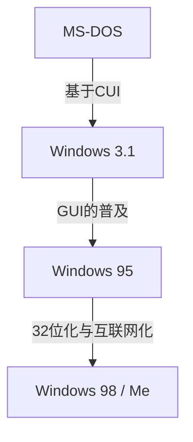

# 前言：称霸PC市场的操作系统发展轨迹

在讲述个人电脑的历史时，Microsoft Windows的进化是无法避开的话题。从20世纪80年代只有黑底白字的CUI（字符用户界面）开始，到现代丰富直观的GUI（图形用户界面），这一历程不仅仅是外观上的变化，更伴随着计算机架构的根本性变革。

本文将深入探讨这一技术变迁：从名为MS-DOS的单任务操作系统开始，经历了Windows 3.1、Windows 95的爆发式普及时代，最终走向了整合为作为现代所有Windows基础的“Windows NT内核”的轨迹。

## MS-DOS时代：从黑屏起步

1981年，随着IBM PC的问世而采用的MS-DOS，成为了后来PC市场的事实标准（De facto standard）。当时的硬件极其孱弱，内存以千字节（KB）计算，存储也以软盘为主流。因此，人们对操作系统的要求也仅限于“读写磁盘”和“运行程序”这种最低限度的功能。

用户通过键盘输入命令，向计算机下达指令。

```text
C:\> DIR
C:\> COPY FILE.TXT A:
```

然而，这款MS-DOS缺失了现代操作系统中理所当然的功能。
* **缺乏多任务处理:** 一次只能运行一个程序。
* **缺乏内存保护:** 应用程序可以自由访问整个内存，因此一个Bug就可能导致整个系统崩溃。
* **直接控制硬件:** 程序直接调用显卡和声卡，因此频繁发生各硬件之间的兼容性问题。

## 从Windows 3.1到Windows 95：GUI革命

1992年推出的Windows 3.1，严格来说并非操作系统，而是“在MS-DOS上运行的GUI环境（操作环境）”。但是，用鼠标操作窗口、可并行运行多个应用程序（非抢占式多任务处理）的体验，对普通用户来说是革命性的。

随后在1995年，**Windows 95**正式发售。它配备了“开始”按钮和任务栏，奠定了当今Windows UI的基础。在内部，它进一步实现了32位化，支持抢占式多任务处理和即插即用（Plug and Play）。这也开启了通向互联网时代的大门。



## 9x系OS的局限与蓝屏噩梦

Windows 95、98、Me被称为“9x系列”，在面向消费者的市场中取得了巨大成功。然而，它们依然抱有一个致命的弱点：**构建在MS-DOS的遗产之上**。

由于过度重视向后兼容性（为了运行过去的DOS软件和16位的Windows 3.1软件），系统变成了东拼西凑的“意大利面条式代码”。应用程序之间容易发生内存区域冲突，也无法完全阻止对内核空间（操作系统的核心部分）的非法访问。

其结果，便是大名鼎鼎的**蓝屏死机 (Blue Screen of Death, BSOD)**。工作中未保存的数据伴随着蓝色屏幕瞬间消失的恐惧，是当时PC用户的共同体验。

## Windows NT内核：面向未来的“新技术”

在面向消费者的9x系列深受蓝屏困扰的同时，Microsoft正在开发一款全新的操作系统。那就是**Windows NT (New Technology)**。

1993年登场的Windows NT 3.1，从一开始就是为服务器和工作站等专业商业用户从零开始设计的。其设计理念的核心是“稳定性”、“安全性”和“可移植性”。

### NT内核的主要特征

1. **完整的内存保护:** 为每个应用程序分配独立的虚拟内存空间，防止其破坏其他程序或操作系统的核心部分（内核空间）。
2. **抢占式多任务处理:** 操作系统的调度程序会严格地为每个进程分配CPU时间，因此即使一个应用程序无响应（冻结），也不会导致整个系统崩溃。
3. **硬件抽象层 (HAL):** 通过硬件抽象层 (Hardware Abstraction Layer)，操作系统主体与硬件分离开来，使得其更容易移植到各种CPU架构（x86、MIPS、Alpha、PowerPC，以及后来的ARM）上。

## Windows XP：两个世界的融合

Windows NT虽然非常优秀，但由于其要求配置高，且在游戏和多媒体功能方面较弱，因此在普通家庭中普及花费了较长时间。长期以来，维持着“家庭用的9x系列”和“业务用的NT系列”这两条产品线，但硬件的进化开始逐渐赶上NT内核的需求。

2001年，这两个世界终于迎来了融合。那就是**Windows XP**。
尽管外观是平易近人、面向消费者的UI，其内部却搭载了基于坚固的Windows 2000（NT 5.0）的NT内核（NT 5.1）。由此，普通用户也获得了“极少出现蓝屏”的稳定PC环境。

## 架构的深渊：Win32 API与注册表

在理解现代Windows时，不可或缺的两个元素是“Win32 API”和“注册表”。

### Win32 API：应用程序与OS的对话
Win32 API (Application Programming Interface) 是一组标准函数，供在Windows上运行的程序调用操作系统的功能（如绘制窗口、读写文件、网络通信等）。
这个API的强大之处在于其**惊人的向后兼容性**。20年前编写的Win32应用程序，在最新的Windows 11上依然能直接运行的情况并不罕见。这对开发者来说是巨大的优势，也是Windows在企业市场中保持压倒性份额的原因之一。

### Windows注册表：系统的巨大数据库
在早期的Windows（3.1及以前版本）中，系统和应用程序的设置以文本格式分散保存在无数的 `.ini` 文件中。这是导致管理变得繁琐的原因。
随着NT系列的崛起，开始发挥核心作用的是**注册表**。它是一个层级化数据库，集中管理了从操作系统的核心设置、已安装软件的信息，到用户设置的所有内容。

虽然这实现了高速访问，但也带来了新的课题：“如果注册表变得臃肿或损坏，系统就会变得不稳定”。

## 结语：Windows 11及未来

从Windows XP以后，经历了Vista、7、8、10，再到Windows 11，操作系统一直在持续进化。强化安全功能（UAC、安全启动）、完成64位化、与云端整合、内置AI（Copilot）等，功能与日俱增。

然而，其根基依然是20世纪90年代设计的那坚如磐石的“NT内核”。打破DOS的外壳、从零开始重构的这一架构，可以说是支撑PC世界30多年、微软真正的优势所在。
