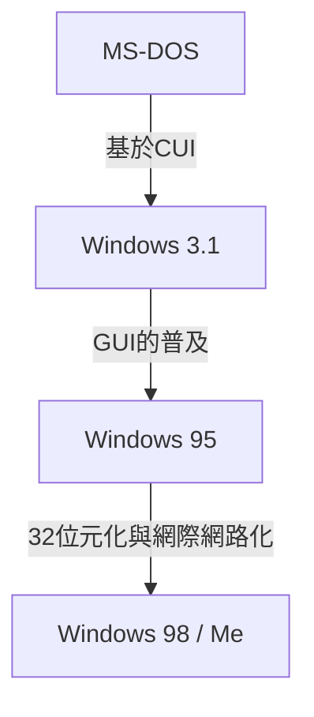

# 前言：稱霸PC市場的作業系統發展軌跡

在探討個人電腦的歷史時，Microsoft Windows的進化是不可忽視的一環。從1980年代只有黑底白字的CUI（字元使用者介面）開始，發展到現代豐富且直觀的GUI（圖形使用者介面），這段歷程不僅僅是外觀上的改變，更伴隨著電腦架構根本性的變革。

本文將深入探討技術的演進，從MS-DOS這個單一工序的作業系統開始，經歷Windows 3.1與Windows 95的爆發性普及時代，最終整合為成為現代所有Windows基礎的「Windows NT核心」。

## MS-DOS時代：從黑色畫面出發

1981年，隨著IBM PC的問世而採用的MS-DOS，成為了後來PC市場的業界標準（De facto standard）。當時的硬體效能極為薄弱，記憶體以千位元組（KB）為單位，儲存裝置也以磁片為主流。因此，對作業系統所要求的角色也被限制在「磁碟讀寫」與「執行程式」等最低限度的功能。

使用者透過鍵盤輸入指令，向電腦下達指示。

```text
C:\> DIR
C:\> COPY FILE.TXT A:
```

然而，這個MS-DOS卻缺乏了現代作業系統理所當然具備的功能。
* **缺乏多工處理（Multitasking）：** 一次只能執行一個程式。
* **缺乏記憶體保護：** 應用程式可以自由存取整個記憶體，因此一個錯誤（Bug）就可能導致整個系統崩潰。
* **直接控制硬體：** 程式會直接操作顯示卡或音效卡，導致各硬體間的相容性問題頻繁發生。

## 從Windows 3.1到Windows 95：GUI革命

1992年登場的Windows 3.1，嚴格來說並非作業系統，而是「在MS-DOS上運行的GUI環境（作業環境）」。然而，能夠透過滑鼠操作視窗，並平行執行多個應用程式（協同式多工，Non-preemptive multitasking）的體驗，對一般使用者而言是革命性的。

接著在1995年，**Windows 95**正式發售。它具備了開始按鈕與工作列，確立了今日Windows UI的基礎。在內部架構上也朝著32位元化邁進，支援了搶佔式多工（Preemptive multitasking）與隨插即用（Plug and Play）。這同時也開啟了通往網際網路時代的大門。



## 9x系列OS的極限與藍白畫面的惡夢

Windows 95、98、Me被稱為「9x系列」，在消費市場上取得了巨大的成功。然而，它們卻抱持著一個致命的弱點，那就是**依然建立在MS-DOS的遺產之上**。

為了重視向下相容性，以執行過去的DOS軟體或16位元的Windows 3.1軟體，結果導致系統變成了充滿拼湊痕跡的義大利麵程式碼（Spaghetti code）。應用程式之間容易發生記憶體區塊的衝突，也無法完全防止對核心空間（作業系統的心臟部位）的非法存取。

其結果就是著名的**藍白當機畫面 (Blue Screen of Death, BSOD)**。作業中的資料在一瞬間伴隨著藍色畫面消失無蹤的恐懼，是當時PC使用者的共同體驗。

## Windows NT核心：邁向未來的「新科技」

在針對消費者的9x系列備受藍白畫面困擾的背後，Microsoft正在開發一套全新的作業系統，那就是**Windows NT (New Technology)**。

1993年登場的Windows NT 3.1，從一開始就是為了伺服器與工作站等商業專業用途而從零開始設計的。其設計理念的核心在於「穩定性」、「安全性」以及「可移植性」。

### NT核心的主要特徵

1. **完全的記憶體保護：** 為每個應用程式分配獨立的虛擬記憶體空間，使其無法破壞其他程式或OS的核心部分（核心空間）。
2. **搶佔式多工（Preemptive multitasking）：** OS的排程器會嚴格地將CPU時間分配給各個處理程序，因此就算一個應用程式當機，也不會連累整個系統。
3. **硬體抽象化 (HAL)：** 透過硬體抽象層 (Hardware Abstraction Layer)，將OS本體與硬體分離，使其更容易移植到各種CPU架構（x86、MIPS、Alpha、PowerPC，以及後來的ARM）。

## Windows XP：兩個世界的整合

Windows NT雖然非常優秀，但由於對硬體規格的要求較高，且在遊戲與多媒體功能方面較弱，因此花了不少時間才普及到一般家庭。很長一段時間裡，維持著「家庭用9x系列」與「業務用的NT系列」兩條產品線並存的體制，但隨著硬體的進化，開始逐漸追上NT核心的需求。

2001年，這兩個世界終於迎來了整合，那就是**Windows XP**。
外觀雖然是親民的消費者導向UI，但內部卻搭載了以堅固的Windows 2000（NT 5.0）為基礎的NT核心（NT 5.1）。這使得一般使用者也能獲得「幾乎不會出現藍白畫面」的穩定PC環境。

## 架構的深淵：Win32 API與登錄檔

在理解現代Windows時，不可或缺的兩個要素是「Win32 API」與「登錄檔（Registry）」。

### Win32 API：應用程式與OS的對話
Win32 API (Application Programming Interface) 是讓在Windows上運行的程式，能夠利用OS功能（視窗繪製、檔案讀寫、網路通訊等）的標準函式集合。
這個API強大之處在於其**驚人的向下相容性**。20年前編寫的Win32應用程式，在最新的Windows 11上依然能夠直接執行的情況屢見不鮮。這對開發者來說是巨大的優勢，也是Windows能在企業市場維持壓倒性市佔率的原因之一。

### Windows登錄檔：系統的巨大資料庫
在早期的Windows（3.1以前），系統與應用程式的設定是以文字格式分散儲存在無數的 `.ini` 檔案中。這成為了管理繁雜的原因。
隨著NT系列的崛起，開始扮演核心角色的是**登錄檔（Registry）**。這是一個階層式的資料庫，能夠集中管理從OS的核心設定、已安裝軟體的資訊，到使用者的設定等所有內容。

雖然能夠實現高速存取，但也衍生出了「當登錄檔肥大化或損毀時，會導致系統不穩定」的新課題。

## 結語：Windows 11與未來

從Windows XP之後，經歷了Vista、7、8、10，一直到Windows 11，作業系統持續在進化。功能的增加日新月異，包括安全性功能的強化（UAC、安全開機）、64位元化的完成、雲端的整合，以及AI的導入（Copilot）等。

然而，在其根基深處，依然脈動著1990年代所設計的堅固「NT核心」。突破了DOS的外殼，從零開始重新建構的這個架構，可以說是支撐了PC世界超過30年的Microsoft真正的優勢所在。
