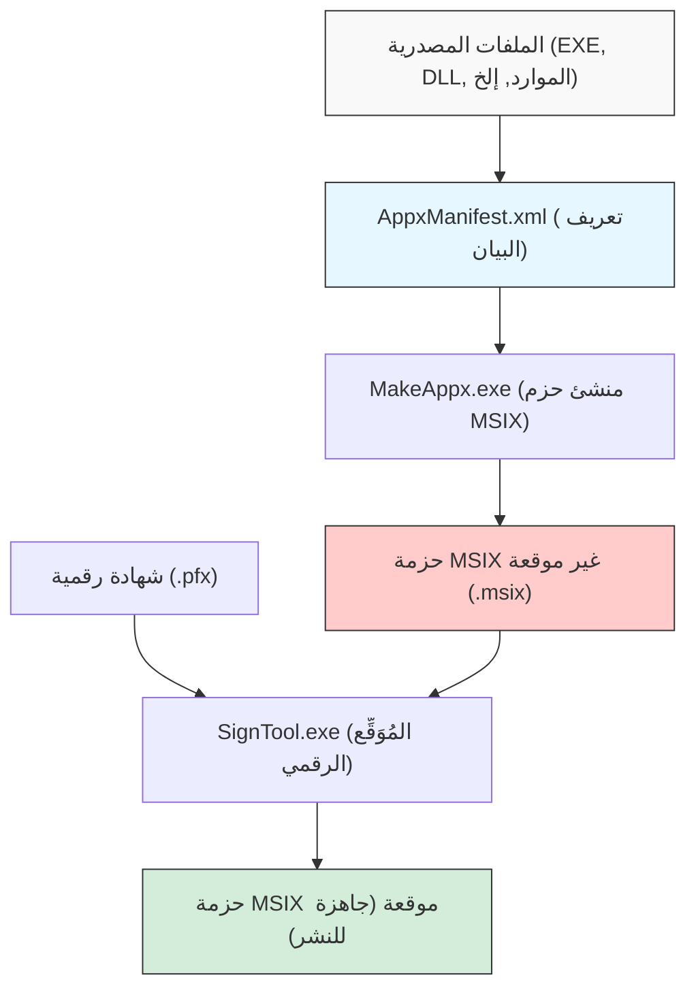
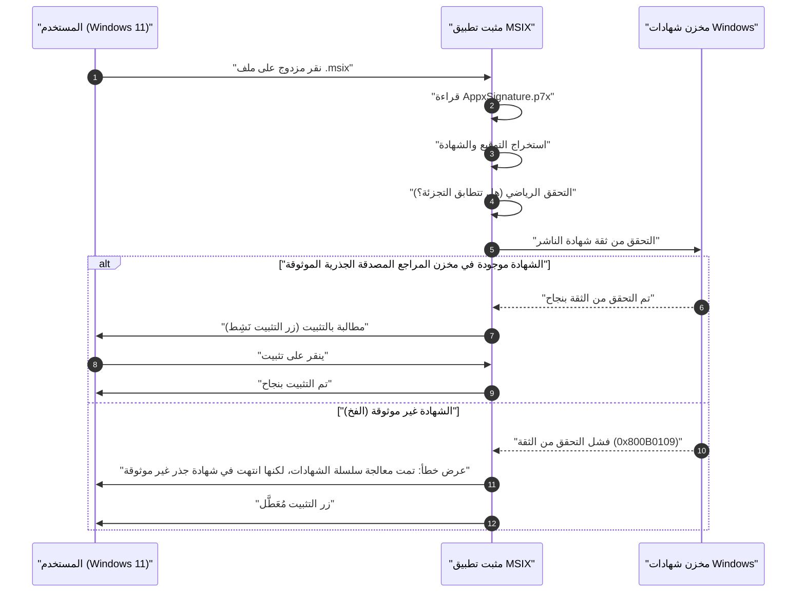

في عصر Windows 11، أصبح "MSIX" هو الخيار القياسي لتنسيق توزيع التطبيقات. على الرغم من أن المثبتات التقليدية مثل MSI و EXE كانت تعاني من العديد من المشاكل، إلا أنه من المتوقع أن يحل MSIX هذه المشاكل كتقنية حزم من الجيل التالي. ومع ذلك، عندما يحاول المطورون إنشاء حزمة MSIX وإجراء التحميل الجانبي (Sideloading) في بيئة تنظيمية أو اختبارية، غالباً ما يقعون في "فخ شهادة التوقيع الذاتي".

في هذه المقالة، سنشرح بالتفصيل التفاصيل الفنية لـ MSIX، وكيفية إنشاء الحزم باستخدام Visual Studio وأدوات سطر الأوامر، بالإضافة إلى أسباب وحلول الأخطاء المتعلقة بشهادة التوقيع الذاتي التي يواجهها العديد من المطورين. نأمل أن يكون هذا دليلاً لا غنى عنه لمطوري تطبيقات Windows، ومسؤولي البنية التحتية، والمسؤولين عن الحزم.

## 1. ما هو MSIX؟ مقارنة مع MSI/EXE التقليدية

MSIX هو أحدث تنسيق لحزم التطبيقات لنظام Windows تقدمه Microsoft. يجمع بين جميع الميزات والمفاهيم الممتازة من MSI (Microsoft Installer) التقليدي، والمثبتات المخصصة المستندة إلى .exe، و App-V (Application Virtualization)، و AppX (حزم تطبيقات Universal Windows Platform) التي تم تقديمها منذ Windows 8، بالإضافة إلى تطوره ليتناسب مع متطلبات الأمان والنشر الحديثة.

### مشاكل المثبتات التقليدية (MSI/EXE)
كانت لـ MSI و EXE، اللتين استخدمتا كصيغ تثبيت قياسية في Windows لسنوات عديدة، مشاكل جذرية كما يلي:

1. **ظاهرة Win Rot (تدهور Windows)**: أثناء تكرار تثبيت وإلغاء تثبيت التطبيقات، تبقى مفاتيح غير ضرورية في السجل، وتُترك ملفات DLL في مجلدات النظام (مثل `C:\Windows\System32`). يؤدي هذا إلى إبطاء نظام التشغيل نفسه تدريجياً وحدوث ظاهرة عدم الاستقرار.
2. **جحيم DLL (DLL Hell)**: عندما تحاول تطبيقات متعددة تثبيت ملف DLL يحمل نفس الاسم (ولكن بإصدارات مختلفة) في دليل النظام المشترك، فإن التطبيق المثبت لاحقاً يستبدل ملف DLL الموجود، مما يؤدي إلى توقف التطبيق المثبت مسبقاً عن العمل بشكل صحيح.
3. **عدم الاستقرار بسبب الإجراءات المخصصة**: في حزم MSI، يمكن تنفيذ نصوص أو تعليمات برمجية تعسفية تسمى "الإجراءات المخصصة" بصلاحيات النظام أثناء التثبيت أو إلغاء التثبيت. تسبب هذا في خطر انهيار المثبت في منتصف العملية أو التسبب في تغييرات غير متوقعة في إعدادات النظام.

### الحل من خلال بنية الحاويات في MSIX
يحل MSIX هذه المشكلات عن طريق تشغيل التطبيق داخل "حاوية" خفيفة الوزن. يحتوي نهج الحاويات هذا على المزايا الهائلة التالية:

- **إلغاء التثبيت النظيف**: التطبيقات المثبتة عبر MSIX تقوم بالكتابة على نظام الملفات والسجل بشكل افتراضي (VFS: Virtual File System، VReg: Virtual Registry). لذلك، عند إلغاء التثبيت، يتم حذف هذه الحاوية الافتراضية بأكملها، مما لا يترك أي بقايا (قمامة) في النظام. هذا يمنع ظاهرة Win Rot تماماً.
- **العزل والأمان (Isolation)**: يعمل كل تطبيق داخل بيئته الخاصة ولا يدمر مباشرة ملفات DLL أو الموارد الخاصة بالتطبيقات الأخرى. هذا يحررك من جحيم DLL.
- **تحسين النطاق الترددي للشبكة**: آلية التحديث في MSIX ممتازة جداً، حيث تدعم التحديثات التفاضلية على مستوى الكتلة (Differential Update). نظراً لأنه يتم تنزيل الكتل القليلة المعدلة فقط من البيانات الثنائية، فإنه يقلل الحمل على الشبكة إلى الحد الأدنى حتى عند تحديث التطبيقات الكبيرة.
- **حالة تثبيت موثوقة**: تحتوي الحزمة على ملف بيان (`AppxManifest.xml`)، وتتم إدارة معاملات التثبيت بدقة على مستوى نظام التشغيل. في حالة الفشل، يتم التراجع تماماً إلى الحالة الأصلية.

## 2. النظرة العامة على إنشاء حزمة MSIX وسلسلة الأدوات

هناك طريقتان رئيسيتان لإنشاء حزمة MSIX. الأولى هي استخدام بيئة التطوير المتكاملة (IDE) لـ Visual Studio، والثانية هي الاستفادة من أدوات سطر الأوامر (مثل `MakeAppx.exe` و `SignTool.exe`) المرفقة مع Windows SDK.

يوضح مخطط Mermaid التالي العملية منذ ملفات المصدر وحتى إنشاء حزمة MSIX النهائية الموقعة.



كما يتضح من هذه العملية، لا يكفي مجرد جمع الملفات وحزمها، بل يجب المرور بخطوة "التوقيع الرقمي". لأسباب أمنية، لا يسمح Windows 11 بتثبيت حزم MSIX غير الموقعة على الإطلاق.

## 3. النهج أ: إنشاء MSIX باستخدام Visual Studio

الطريقة الأسهل والأكثر شيوعاً هي استخدام "مشروع حزم تطبيقات Windows (Windows Application Packaging Project - WAP)" في Visual Studio. باستخدام قالب المشروع هذا، يمكنك بسهولة تحزيم تطبيقات WPF، Windows Forms، WinUI 3، وحتى تطبيقات Win32 القديمة المكتوبة بـ C++ إلى MSIX.

### دليل خطوة بخطوة
1. **إضافة مشروع WAP**: انقر بزر الماوس الأيمن على حل (Solution) Visual Studio الحالي، واختر "إضافة مشروع جديد"، ثم حدد "مشروع حزم تطبيقات Windows".
2. **اختيار النظام الأساسي المستهدف**: حدد الإصدار الأدنى والإصدار المستهدف لنظام التشغيل Windows 10/11 الذي يدعمه التطبيق.
3. **الإشارة إلى التطبيق**: انقر بزر الماوس الأيمن على عقدة "التطبيقات" في مشروع الحزمة، واختر "إضافة مرجع"، ثم حدد المشروع الرئيسي الذي تريد حزمه (مثل مشروع WPF).
4. **إعداد البيان (Manifest)**: انقر نقراً مزدوجاً فوق ملف `Package.appxmanifest` لفتح المصمم المرئي. هنا، قم بتعيين اسم عرض التطبيق، الوصف، صورة الشعار، والأهم من ذلك "اسم الحزمة (Identity Name)" و"الناشر (Publisher)".
5. **إنشاء الحزمة**: انقر بزر الماوس الأيمن على المشروع، واختر "نشر" -> "إنشاء حزم التطبيقات". اختر "للتحميل الجانبي (Sideloading)" وحدد البنية (مثل x64، ARM64)، وسيقوم Visual Studio تلقائياً بالترجمة، الحزم باستخدام `MakeAppx`، وحتى إنشاء شهادة توقيع ذاتي والتوقيع عليها.

هذا سلس للغاية، ولكن إذا استخدمت شهادة التوقيع الذاتي (Test Certificate) التي تم إنشاؤها تلقائياً بواسطة Visual Studio، فستقع في "الفخ" الموصوف لاحقاً.

## 4. النهج ب: الإنشاء باستخدام سطر الأوامر (MakeAppx.exe)

لأتمتة العملية في مسار CI/CD، أو لإعادة حزم مجموعة من الملفات يدوياً من مثبت موجود، ستحتاج إلى أدوات سطر الأوامر. إذا كانت بيئة Windows SDK مثبتة، يمكنك الوصول إلى الأدوات التالية من موجه أوامر المطور.

### 1. إعداد ملف البيان
قم بإنشاء ملف `AppxManifest.xml` يحتوي على الحد الأدنى من المعلومات في الدليل الجذر للحزمة.

```xml
<?xml version="1.0" encoding="utf-8"?>
<Package xmlns="http://schemas.microsoft.com/appx/manifest/foundation/windows10"
         xmlns:uap="http://schemas.microsoft.com/appx/manifest/uap/windows10"
         xmlns:rescap="http://schemas.microsoft.com/appx/manifest/foundation/windows10/restrictedcapabilities">
  
  <Identity Name="MyCompany.AwesomeApp"
            Publisher="CN=MyCompany Self-Signed, O=MyCompany"
            Version="1.0.0.0"
            ProcessorArchitecture="x64" />
  
  <Properties>
    <DisplayName>Awesome App</DisplayName>
    <PublisherDisplayName>My Company</PublisherDisplayName>
    <Logo>Assets\StoreLogo.png</Logo>
  </Properties>
  
  <Resources>
    <Resource Language="en-us" />
    <Resource Language="ja-jp" />
  </Resources>
  
  <Dependencies>
    <TargetDeviceFamily Name="Windows.Desktop" MinVersion="10.0.17763.0" MaxVersionTested="10.0.22000.0" />
  </Dependencies>
  
  <Capabilities>
    <rescap:Capability Name="runFullTrust" />
  </Capabilities>
  
  <Applications>
    <Application Id="AwesomeApp" Executable="AwesomeApp.exe" EntryPoint="Windows.FullTrustApplication">
      <uap:VisualElements DisplayName="Awesome App"
                          Description="The best app ever."
                          BackgroundColor="transparent"
                          Square150x150Logo="Assets\Square150x150Logo.png"
                          Square44x44Logo="Assets\Square44x44Logo.png">
      </uap:VisualElements>
    </Application>
  </Applications>
</Package>
```
الشيء المهم هنا هو أن قيمة `<Identity Publisher="..." />` يجب أن تتطابق تماماً مع اسم الكيان (Subject) في الشهادة التي ستُستخدم للتوقيع لاحقاً.

### 2. الحزم باستخدام MakeAppx
في موجه الأوامر، قم بتشغيل الأمر التالي لضغط الدليل إلى ملف MSIX.

```cmd
MakeAppx.exe pack /d "C:\Path\To\AppFolder" /p "C:\Path\To\Output\AwesomeApp_1.0.0.0_x64.msix"
```
هذا يكمل ملف MSIX غير الموقّع، ولكن في هذه الحالة، لا يمكن تثبيته على نظام Windows.

## 5. التوقيع الرقمي والخلفية الرياضية لتكنولوجيا التشفير

لفهم سبب الحاجة إلى التوقيع على حزم MSIX بعمق، من الضروري فهم الآليات التشفيرية وراء التوقيعات الرقمية. يضمن التوقيع الرقمي أن الحزمة "تم إنشاؤها بالتأكيد بواسطة الناشر المحدد (المصادقة)" وأنها "لم يتم العبث بها من قبل طرف ثالث من وقت الإنشاء وحتى الآن (النزاهة)".

يستخدم التوقيع لـ MSIX عادةً مزيجاً من تشفير RSA و SHA-256 (خوارزمية التجزئة الآمنة 256 بت).

### تطبيق دالة التجزئة
أولاً، لنجعل البيانات الثنائية (المحتويات) لحزمة MSIX بأكملها هي الرسالة $M$. تقوم أداة التوقيع (SignTool.exe) بتطبيق دالة التجزئة التشفيرية SHA-256 على هذه الرسالة $M$ لحساب قيمة تجزئة بطول ثابت (256 بت) $H(M)$.

### إنشاء التوقيع (الناشر)
بعد ذلك، يستخدم الناشر "مفتاحه الخاص (Private Key)" $d$ لتشفير قيمة التجزئة، ويولد توقيعاً رقمياً $\sigma$. في سياق خوارزمية RSA، يتم التعبير عن هذا كعملية أسية نموذجية على النحو التالي:

$$ \sigma \equiv (H(M))^d \pmod n $$

حيث $n$ هو معامل RSA (حاصل ضرب عددين أوليين ضخمين). يتم تضمين هذه الشهادة (بصيغة X.509) التي تحتوي على التوقيع $\sigma$ و "المفتاح العام (Public Key)" $e$ الخاص بالناشر كجزء من حزمة MSIX (في `AppxSignature.p7x`).

### التحقق من التوقيع (نظام تشغيل Windows)
عندما يحاول المستخدم تثبيت MSIX، يستخرج نظام التشغيل Windows المفتاح العام $e$ من الشهادة الموجودة داخل الحزمة، ويقوم بالحساب التالي لاستعادة قيمة التجزئة $H'(M)$.

$$ H'(M) \equiv \sigma^e \pmod n $$

في نفس الوقت، يقوم نظام التشغيل نفسه بإعادة حساب قيمة التجزئة $H(M)$ لحزمة MSIX بأكملها التي تم تنزيلها $M$.
في النهاية، يتحقق مما إذا كانت قيمة التجزئة المستردة وقيمة التجزئة المعاد حسابها متساويتين ($H(M) = H'(M)$). إذا صحت هذه المعادلة، فقد تم إثبات رياضياً أن "الملف لم يتم العبث به ولو بت واحدة بعد التوقيع".

## 6. العائق الأكبر: "فخ شهادة التوقيع الذاتي"

حتى لو كان الإثبات الرياضي أعلاه مثالياً، فإن Windows 11 لا يسمح بالتثبيت بمجرد ذلك. لأن هناك حاجة للتحقق من "سلسلة الثقة (Chain of Trust)" لمعرفة: "هل صاحب ذلك المفتاح العام (الشهادة) هو حقاً المنظمة أو الشخص الآمن الذي يدعي أنه هو؟"

إذا كانت الشهادة صادرة عن مرجع مصدق جذري عام (Root CA) موثوق به مسبقاً من قبل نظام التشغيل، مثل VeriSign أو DigiCert، فيمكن تثبيته دون مشاكل (التطبيقات الموزعة عبر Microsoft Store موثوق بها بالمثل بواسطة شهادة جذر Microsoft).

ومع ذلك، إذا لم تتمكن من تحمل تكلفة شراء شهادة عامة، مثل أثناء التطوير أو للأدوات الداخلية للشركة، يقوم المطور بإصدار الشهادة بنفسه. هذه هي "شهادة التوقيع الذاتي (Self-Signed Certificate)".

يوضح مخطط التسلسل التالي سلوك نظام التشغيل عند محاولة تثبيت حزمة MSIX موقعة بشهادة توقيع ذاتي.



هذا هو بالضبط "الفخ". على الرغم من أن المطور قد أنشأها ووقّعها بشكل صحيح، إلا أن نظام Windows 11 في حالته الافتراضية لا يعرف (لا يثق بـ) شهادة التوقيع الذاتي تلك، وبالتالي يتم حظر التثبيت برمز الخطأ `0x800B0109`. يتحول زر "تثبيت" في المثبت إلى اللون الرمادي ولا يمكن الضغط عليه.

يواجه العديد من المطورين هذا الخطأ، ويقعون في متاهة إعادة كتابة ملف البيان مراراً وتكراراً معتقدين أن "MSIX مليء بالأخطاء" أو "يجب أن يكون الإعداد خاطئاً"، ولكن المشكلة لا تكمن في هيكل الحزمة، بل في وجود أو عدم وجود تسجيل في مخزن الشهادات (Certificate Store) لنظام التشغيل.

## 7. الحل: إنشاء ونشر شهادة توقيع ذاتي باستخدام PowerShell

لحل هذه المشكلة، من الضروري تنفيذ الخطوتين التاليتين بشكل موثوق.
1. إنشاء شهادة توقيع ذاتي صالحة، وتصدير ملف PFX الذي يحتوي على المفتاح الخاص.
2. تثبيت جزء المفتاح العام (ملف CER) للشهادة التي تم إنشاؤها في مخزن **"المراجع المصدقة الجذرية الموثوقة (Trusted Root Certification Authorities)" لجميع أجهزة الكمبيوتر المستهدفة**.

باستخدام PowerShell، يمكن معالجة ذلك بشكل موثوق وتلقائي.

### الخطوة 1: إنشاء وتصدير شهادة التوقيع الذاتي

أولاً، قم بتشغيل PowerShell بصلاحيات المسؤول (Administrator)، وقم بتنفيذ البرنامج النصي التالي لإنشاء الشهادة. هنا، سنقوم بإنشاء شهادة مخصصة لأغراض توقيع التعليمات البرمجية (Code Signing).

```powershell
# 1. تعريف المعلمات
$SubjectName = "CN=MyCompany Self-Signed, O=MyCompany"
$CertStoreLocation = "Cert:\CurrentUser\My"

# 2. إنشاء شهادة توقيع ذاتي (لغرض توقيع التعليمات البرمجية: 1.3.6.1.5.5.7.3.3)
$Cert = New-SelfSignedCertificate -Type Custom `
    -Subject $SubjectName `
    -KeyUsage DigitalSignature `
    -FriendlyName "MyCompany MSIX Signing Cert" `
    -CertStoreLocation $CertStoreLocation `
    -TextExtension @("2.5.29.37={text}1.3.6.1.5.5.7.3.3", "2.5.29.19={text}")

Write-Host "تم إنشاء الشهادة. البصمة (Thumbprint): $($Cert.Thumbprint)"

# 3. إنشاء كلمة مرور لتصدير ملف PFX (متضمن المفتاح الخاص)
$Password = ConvertTo-SecureString -String "YourSecurePassword123!" -Force -AsPlainText

# 4. تصدير ملف PFX (للتوقيع باستخدام SignTool)
$PfxPath = "C:\Path\To\Output\MyCompanyCert.pfx"
Export-PfxCertificate -Cert $Cert -FilePath $PfxPath -Password $Password

# 5. تصدير CER (المفتاح العام فقط) (للتثبيت على أجهزة العملاء)
$CerPath = "C:\Path\To\Output\MyCompanyCert.cer"
Export-Certificate -Cert $Cert -FilePath $CerPath
```

باستخدام ملف `$PfxPath` الذي تم إنشاؤه هنا، قم بالتوقيع على حزمة MSIX.

```cmd
SignTool.exe sign /fd SHA256 /a /f "C:\Path\To\Output\MyCompanyCert.pfx" /p "YourSecurePassword123!" "C:\Path\To\Output\AwesomeApp_1.0.0.0_x64.msix"
```

### الخطوة 2: تثبيت الشهادة على جهاز الكمبيوتر العميل (إزالة الفخ)

إذا أخذت حزمة MSIX الموقعة إلى جهاز كمبيوتر آخر (أو بيئة افتراضية)، ونقرت عليها نقراً مزدوجاً كما هي، فلن تتمكن من تثبيتها كما هو موضح أعلاه. مقدماً (أو في نفس الوقت)، ستحتاج إلى تثبيت ملف `$CerPath` الذي تم تصديره للتو في "المراجع المصدقة الجذرية الموثوقة" لـ "الكمبيوتر المحلي (Local Computer)".

للقيام بذلك، افتح PowerShell **بصلاحيات المسؤول** على جهاز الكمبيوتر المستهدف للنشر، وقم بتنفيذ الأمر التالي.

```powershell
# مسار ملف CER
$CerPath = "C:\Path\To\Output\MyCompanyCert.cer"

# استيراد إلى "المراجع المصدقة الجذرية الموثوقة" للكمبيوتر المحلي
Import-Certificate -FilePath $CerPath -CertStoreLocation "Cert:\LocalMachine\Root"

Write-Host "تم تثبيت الشهادة في المراجع المصدقة الجذرية الموثوقة."
```

> [!CAUTION]
> تعد امتيازات المسؤول مطلوبة لإضافة الشهادة إلى مخزن المراجع المصدقة الجذرية لـ "الكمبيوتر المحلي (`LocalMachine`)". يجب الحذر لأنه حتى إذا تم إدراجها في المخزن الشخصي للمستخدم (`CurrentUser`)، فقد لا يتم التعرف عليها بسبب سياق امتيازات App Installer.

مباشرة بعد نجاح هذا البرنامج النصي، حاول النقر نقراً مزدوجاً فوق ملف MSIX الذي كان يعطي خطأ في وقت سابق مرة أخرى. وكأنه سحر، يجب أن تختفي رسالة الخطأ ويظهر زر "تثبيت" نشط بلون أزرق ساطع. بهذا تكون قد تخطيت "فخ شهادة التوقيع الذاتي" بالكامل.

## 8. التشغيل في بيئة المؤسسات وأفضل الممارسات

إذا كان ذلك لاختبار محلي للمطور، فإن الخطوات المذكورة أعلاه كافية. ولكن عند نشر تطبيقات محملة جانبياً على عشرات أو مئات من أجهزة الكمبيوتر داخل الشركة، فمن غير العملي ويشكل خطراً أمنياً أن تطلب من كل مستخدم تشغيل برنامج تثبيت الشهادة النصي.

أفضل الممارسات في بيئة المؤسسات هي كما يلي.

### 1. الاستفادة من نهج مجموعة Active Directory (GPO)
إذا تم تقديم Active Directory داخل الشركة، يمكنك استخدام "نهج المفتاح العام" لـ GPO لتوزيع شهادة التوقيع الذاتي (ملف CER) تلقائياً على "المراجع المصدقة الجذرية الموثوقة" لجميع أجهزة الكمبيوتر المنضمة إلى المجال. هذا يسمح للموظفين بتثبيت التطبيق بمجرد النقر المزدوج على ملف MSIX في مجلد مشترك دون أي وعي بالشهادة.

### 2. النشر عبر Microsoft Intune (MDM)
تستخدم البيئات الحديثة Microsoft Intune لإدارة الأجهزة. في Intune، يمكنك دفع شهادة موثوقة (.cer) إلى نقاط النهاية باستخدام ميزة "ملف تعريف التكوين (Configuration Profile)". بعد ذلك، يمكنك نشر حزمة MSIX نفسها كتثبيت صامت كتطبيق LOB (Line of Business).

### 3. التحديث التلقائي من خلال ملف App Installer (.appinstaller)
يحتوي MSIX على ميزة قوية لأتمتة تحديثات التطبيقات. عن طريق إنشاء ملف `.appinstaller` يستند إلى XML ووضعه على خادم ويب أو مجلد SMB مشترك، يمكنك جعل التطبيق يتحقق في الخلفية من وجود إصدارات جديدة من MSIX عند تشغيل التطبيق وتطبيق التحديثات تلقائياً.

```xml
<?xml version="1.0" encoding="utf-8"?>
<AppInstaller
    Uri="https://internal.mycompany.com/apps/AwesomeApp.appinstaller"
    Version="1.0.0.0"
    xmlns="http://schemas.microsoft.com/appx/appinstaller/2018">
    <MainPackage
        Name="MyCompany.AwesomeApp"
        Publisher="CN=MyCompany Self-Signed, O=MyCompany"
        Version="1.0.0.0"
        ProcessorArchitecture="x64"
        Uri="https://internal.mycompany.com/apps/AwesomeApp_1.0.0.0_x64.msix" />
    <UpdateSettings>
        <OnLaunch HoursBetweenUpdateChecks="0" />
    </UpdateSettings>
</AppInstaller>
```
عن طريق توزيع هذا الملف للمستخدمين لتثبيته، من الآن فصاعداً، بمجرد استبدال ملف MSIX على الخادم وتحديث رقم الإصدار في `.appinstaller`، سيتم تحديث تطبيق جميع المستخدمين تلقائياً.

## 9. استكشاف الأخطاء وإصلاحها: الأخطاء الشائعة المتعلقة بالشهادات

أخيراً، سألخص الأخطاء الشائعة الأخرى التي يمكن أن تحدث فيما يتعلق بالشهادات والتوقيعات وحلولها.

- **0x800B0101**: انتهت صلاحية الشهادة المستخدمة للتوقيع. يرجى إصدار شهادة جديدة، أو استخدم خادم طابع زمني عند التوقيع (مثل `http://timestamp.digicert.com`) لإثبات أن التوقيع تم ضمن فترة صلاحية الشهادة (بإضافة طابع زمني، سيتم اعتبار التوقيع صالحاً حتى لو انتهت صلاحية الشهادة نفسها).
- **0x80080204**: قيمة `Publisher` المذكورة في `AppxManifest.xml` لا تتطابق تماماً مع قيمة `Subject` للشهادة. يرجى التحقق بدقة مما إذا كانت تتطابق تماماً كسلسلة نصية، بما في ذلك وجود أو عدم وجود مسافة بعد الفاصلة.
- **التحقق من عارض الأحداث (Event Viewer)**: للبحث في سبب أكثر تفصيلاً للخطأ، من المهم جداً فتح عارض أحداث Windows والتحقق من السجلات ضمن "سجلات التطبيقات والخدمات (Applications and Services Logs)" -> "Microsoft" -> "Windows" -> "AppxPackagingOM" أو "AppXDeployment-Server".

## 10. الخلاصة

تعد حزم MSIX لنظام التشغيل Windows 11 تقنية قوية تحسن إدارة دورة حياة التطبيقات بشكل كبير. يمكنك التحرر من Win Rot وجحيم DLL، وتوفير بيئة نظيفة وآمنة للمستخدمين.

من ناحية أخرى، نظراً لأن نموذج الأمان أصبح أكثر صرامة، فإن الفهم العميق لـ "سلسلة الثقة" الخاصة بالتوقيعات الرقمية والشهادات أمر بالغ الأهمية. "فخ شهادة التوقيع الذاتي" هو بوابة مرور يواجهها تقريباً كل مطور يلمس تقنية MSIX لأول مرة. من خلال فهم آلية إنشاء الشهادات، وتصديرها، واستيرادها إلى المخزن المناسب الموضحة في هذه المقالة، والاستفادة من البرامج النصية و GPO للأتمتة، ستتمكن من تحقيق نشر سلس يستخرج أقصى إمكانات MSIX.

يُرجى الاستفادة من هذه المعرفة لبناء بيئة توزيع تطبيقات Windows نظيفة من الجيل التالي.
