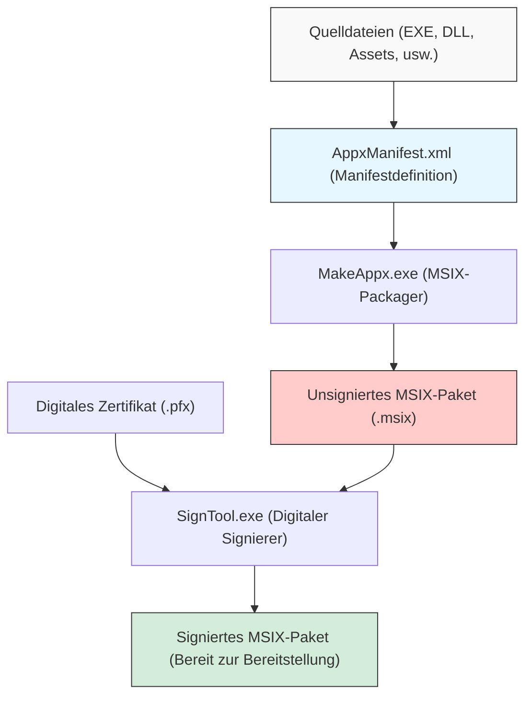
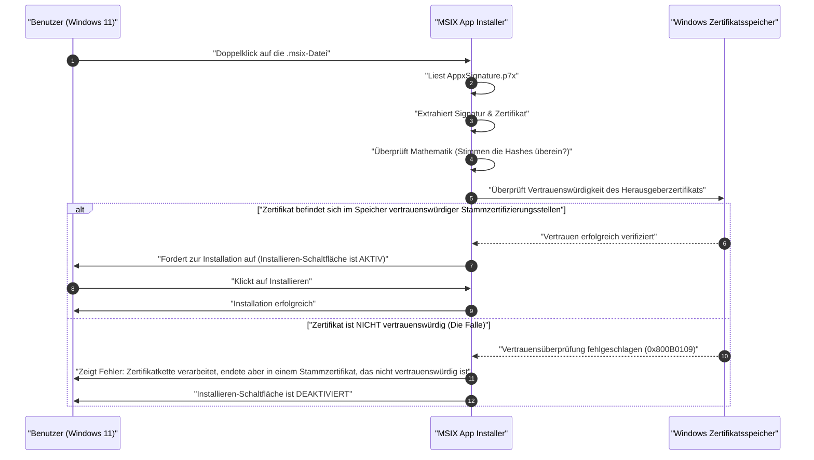

Im Zeitalter von Windows 11 wird "MSIX" zunehmend zur Standardwahl als Verteilungsformat für Anwendungen. Herkömmliche Installer wie MSI oder EXE wiesen viele Herausforderungen auf, aber von MSIX wird erwartet, dass es als Paketierungstechnologie der nächsten Generation diese löst. Wenn Entwickler jedoch versuchen, ein MSIX-Paket zu erstellen und Sideloading (Querladen) in einer Organisation oder Testumgebung durchzuführen, tappen sie oft in die „Falle des selbstsignierten Zertifikats“.

In diesem Artikel werden wir von den technischen Details von MSIX über die Methoden zur Paketerstellung mit Visual Studio und Kommandozeilenwerkzeugen bis hin zu den Ursachen und Lösungen für Fehler im Zusammenhang mit selbstsignierten Zertifikaten, mit denen viele Entwickler konfrontiert werden, alles sehr detailliert erläutern. Wir streben an, dass dies ein unverzichtbarer Leitfaden für Windows-App-Entwickler, Infrastrukturadministratoren und Paketierungsverantwortliche wird.

## 1. Was ist MSIX? Ein Vergleich mit herkömmlichen MSI/EXE

MSIX ist das neueste von Microsoft bereitgestellte Anwendungspaketformat für Windows. Es integriert alle hervorragenden Funktionen und Konzepte von MSI (Microsoft Installer), benutzerdefinierten .exe-basierten Installern, App-V (Application Virtualization) und AppX (Universal Windows Platform App Package), die seit Windows 8 eingeführt wurden, und entwickelt sie weiter, um den modernen Anforderungen an Sicherheit und Bereitstellung gerecht zu werden.

### Herausforderungen bei herkömmlichen Installern (MSI/EXE)
MSI und EXE, die seit vielen Jahren als Standardinstallationsformate unter Windows verwendet werden, wiesen folgende grundlegende Probleme auf:

1. **Win Rot (Windows-Degradation)**: Wenn Anwendungen wiederholt installiert und deinstalliert werden, bleiben unnötige Schlüssel in der Registrierung zurück und DLLs verbleiben im Systemordner (z.B. `C:\Windows\System32`). Dies führt dazu, dass das Betriebssystem selbst allmählich langsamer und instabiler wird.
2. **DLL-Höllen (DLL Hell)**: Wenn mehrere Anwendungen versuchen, DLLs mit demselben Namen (aber unterschiedlichen Versionen) im gemeinsamen Systemverzeichnis zu installieren, überschreibt die später installierte App die vorhandene DLL, wodurch die zuvor installierte App nicht mehr richtig funktioniert.
3. **Instabilität durch benutzerdefinierte Aktionen**: In MSI-Paketen können beliebige Skripte und Codes, die als „benutzerdefinierte Aktionen“ bezeichnet werden, während der Installation und Deinstallation mit Systemrechten ausgeführt werden. Dies barg das Risiko, dass der Installer auf halbem Weg abstürzt oder unerwartete Einstellungsänderungen am System verursacht.

### Lösungen durch die Containerisierungsarchitektur von MSIX
MSIX löst diese Probleme, indem Anwendungen in leichtgewichtigen „Containern“ ausgeführt werden. Dieser Containerisierungsansatz bietet folgende enorme Vorteile:

- **Saubere Deinstallation**: Mit MSIX installierte Apps schreiben in das Dateisystem und die Registrierung auf virtualisierte Weise (VFS: Virtual File System, VReg: Virtual Registry). Daher wird bei der Deinstallation dieser gesamte virtualisierte Container gelöscht, sodass keine Überreste (Müll) im System verbleiben. Es verhindert Win Rot vollständig.
- **Isolierung und Sicherheit (Isolation)**: Jede App läuft in ihrer eigenen Umgebung und kann die DLLs oder Ressourcen anderer Apps nicht direkt zerstören. Das befreit uns von der DLL-Hölle.
- **Optimierung der Netzwerkbandbreite**: Der Update-Mechanismus von MSIX ist hervorragend und unterstützt differenzielle Updates auf Blockebene (Differential Update). Da nur die wenigen geänderten Blöcke der Binärdaten heruntergeladen werden, wird die Netzwerklast auch bei der Aktualisierung großer Anwendungen auf ein Minimum reduziert.
- **Zuverlässiger Installationsstatus**: Das Paket enthält eine Manifestdatei (`AppxManifest.xml`), und die Installationstransaktionen werden auf Betriebssystemebene streng verwaltet. Im Falle eines Fehlers wird der ursprüngliche Zustand vollständig wiederhergestellt (Rollback).

## 2. Überblick über die MSIX-Paketerstellung und Toolchain

Es gibt zwei Hauptansätze zur Erstellung eines MSIX-Pakets. Der eine besteht darin, die integrierte Entwicklungsumgebung (IDE) von Visual Studio zu verwenden, und der andere darin, die im Windows SDK enthaltenen Befehlszeilentools (`MakeAppx.exe` und `SignTool.exe`) zu nutzen.

Das folgende Mermaid-Diagramm zeigt den Prozess von den Quelldateien bis zur Generierung des endgültigen signierten MSIX-Pakets.



Wie aus diesem Prozess ersichtlich ist, reicht es nicht aus, einfach Dateien zu sammeln und zu bündeln (Paketierung); der Schritt der "digitalen Signatur" ist zwingend erforderlich. Windows 11 erlaubt aus Sicherheitsgründen die Installation von unsignierten MSIX-Paketen überhaupt nicht.

## 3. Ansatz A: Erstellung von MSIX mit Visual Studio

Die einfachste und gängigste Methode besteht darin, das "Windows Application Packaging Project (WAP)" in Visual Studio zu verwenden. Mithilfe dieser Projektvorlage können WPF-, Windows Forms-, WinUI 3- und sogar ältere C++-Win32-Apps problemlos in MSIX konvertiert werden.

### Schritt-für-Schritt-Anleitung
1. **Hinzufügen eines WAP-Projekts**: Klicken Sie mit der rechten Maustaste auf eine vorhandene Visual Studio-Projektmappe, wählen Sie "Neues Projekt hinzufügen" und dann "Windows Application Packaging Project".
2. **Auswahl der Zielplattform**: Geben Sie die minimale und die Zielversion von Windows 10/11 an, die von der App unterstützt werden.
3. **Anwendungsreferenz**: Klicken Sie mit der rechten Maustaste auf den Knoten "Anwendungen" im Paketierungsprojekt, wählen Sie "Verweis hinzufügen" und wählen Sie das Hauptprojekt (z. B. ein WPF-Projekt), das Sie verpacken möchten.
4. **Manifest-Einstellungen**: Doppelklicken Sie auf die Datei `Package.appxmanifest`, um den visuellen Designer zu öffnen. Hier legen Sie den Anzeigenamen der App, die Beschreibung, das Logobild und vor allem den "Paketnamen (Identity Name)" und den "Herausgeber (Publisher)" fest.
5. **Paketerstellung**: Klicken Sie mit der rechten Maustaste auf das Projekt und wählen Sie "Veröffentlichen" -> "App-Pakete erstellen". Wenn Sie "Zum Querladen (Sideloading)" auswählen und die Architektur (x64, ARM64 usw.) angeben, übernimmt Visual Studio automatisch die Kompilierung, die Paketierung mit `MakeAppx` sowie die Generierung und Signierung des selbstsignierten Zertifikats.

Das ist sehr nahtlos, aber wenn Sie das von Visual Studio automatisch generierte selbstsignierte Zertifikat (Test Certificate) verwenden, geraten Sie in die später beschriebene "Falle".

## 4. Ansatz B: Erstellung über die Kommandozeile (MakeAppx.exe)

Für die Automatisierung in CI/CD-Pipelines oder für die manuelle Neuverpackung von Dateien aus vorhandenen Installern sind Kommandozeilenwerkzeuge erforderlich. Wenn das Windows SDK installiert ist, können Sie über die Eingabeaufforderung für Entwickler auf die folgenden Tools zugreifen.

### 1. Vorbereitung der Manifestdatei
Erstellen Sie im Stammverzeichnis des Pakets eine `AppxManifest.xml`, die die grundlegenden Informationen enthält.

```xml
<?xml version="1.0" encoding="utf-8"?>
<Package xmlns="http://schemas.microsoft.com/appx/manifest/foundation/windows10"
         xmlns:uap="http://schemas.microsoft.com/appx/manifest/uap/windows10"
         xmlns:rescap="http://schemas.microsoft.com/appx/manifest/foundation/windows10/restrictedcapabilities">
  
  <Identity Name="MyCompany.AwesomeApp"
            Publisher="CN=MyCompany Self-Signed, O=MyCompany"
            Version="1.0.0.0"
            ProcessorArchitecture="x64" />
  
  <Properties>
    <DisplayName>Awesome App</DisplayName>
    <PublisherDisplayName>My Company</PublisherDisplayName>
    <Logo>Assets\StoreLogo.png</Logo>
  </Properties>
  
  <Resources>
    <Resource Language="en-us" />
    <Resource Language="ja-jp" />
  </Resources>
  
  <Dependencies>
    <TargetDeviceFamily Name="Windows.Desktop" MinVersion="10.0.17763.0" MaxVersionTested="10.0.22000.0" />
  </Dependencies>
  
  <Capabilities>
    <rescap:Capability Name="runFullTrust" />
  </Capabilities>
  
  <Applications>
    <Application Id="AwesomeApp" Executable="AwesomeApp.exe" EntryPoint="Windows.FullTrustApplication">
      <uap:VisualElements DisplayName="Awesome App"
                          Description="The best app ever."
                          BackgroundColor="transparent"
                          Square150x150Logo="Assets\Square150x150Logo.png"
                          Square44x44Logo="Assets\Square44x44Logo.png">
      </uap:VisualElements>
    </Application>
  </Applications>
</Package>
```
Hierbei ist es wichtig, dass der Wert von `<Identity Publisher="..." />` exakt mit dem Subject des Zertifikats übereinstimmt, das später für die Signatur verwendet wird.

### 2. Paketierung mit MakeAppx
Führen Sie den folgenden Befehl in der Eingabeaufforderung aus, um das Verzeichnis in eine MSIX-Datei zu packen.

```cmd
MakeAppx.exe pack /d "C:\Path\To\AppFolder" /p "C:\Path\To\Output\AwesomeApp_1.0.0.0_x64.msix"
```
Damit ist die unsignierte MSIX-Datei fertig, aber in diesem Zustand kann sie nicht unter Windows installiert werden.

## 5. Mathematischer Hintergrund der digitalen Signatur und Kryptographie

Um zu verstehen, warum MSIX-Pakete eine Signatur benötigen, ist es notwendig, die kryptographischen Mechanismen hinter digitalen Signaturen zu verstehen. Eine digitale Signatur garantiert, dass das Paket "mit Sicherheit von dem angegebenen Herausgeber erstellt wurde (Authentifizierung)" und dass es "seit der Erstellung bis heute nicht von Dritten manipuliert wurde (Integrität)".

Für MSIX-Signaturen wird normalerweise eine Kombination aus RSA-Verschlüsselung und SHA-256 (Secure Hash Algorithm 256-bit) verwendet.

### Anwendung der Hash-Funktion
Zunächst betrachten wir die gesamte Binärdatei (den Inhalt) des MSIX-Pakets als Nachricht $M$. Das Signatur-Tool (SignTool.exe) wendet die kryptographische Hash-Funktion SHA-256 auf diese Nachricht $M$ an, um einen Hash-Wert $H(M)$ fester Länge (256 Bit) zu berechnen.

### Generierung der Signatur (Herausgeber)
Anschließend verwendet der Herausgeber seinen "privaten Schlüssel (Private Key)" $d$, um den Hash-Wert zu verschlüsseln und die digitale Signatur $\sigma$ zu generieren. Im Kontext des RSA-Algorithmus wird dies als modulare Potenzierung wie folgt ausgedrückt:

$$ \sigma \equiv (H(M))^d \pmod n $$

Hierbei ist $n$ der RSA-Modul (das Produkt zweier sehr großer Primzahlen). Ein Zertifikat (im X.509-Format), das diese Signatur $\sigma$ und den "öffentlichen Schlüssel (Public Key)" $e$ des Herausgebers enthält, wird als Teil des MSIX-Pakets (`AppxSignature.p7x`) eingebettet.

### Validierung der Signatur (Windows OS)
Wenn ein Benutzer versucht, das MSIX-Paket zu installieren, extrahiert das Windows-Betriebssystem den öffentlichen Schlüssel $e$ aus dem Zertifikat im Paket und führt die folgende Berechnung durch, um den Hash-Wert $H'(M)$ wiederherzustellen:

$$ H'(M) \equiv \sigma^e \pmod n $$

Gleichzeitig berechnet das Betriebssystem den Hash-Wert $H(M)$ der gesamten heruntergeladenen MSIX-Paketnachricht $M$ selbst neu.
Schließlich wird überprüft, ob der wiederhergestellte Hash-Wert und der neu berechnete Hash-Wert gleich sind ($H(M) = H'(M)$). Wenn diese Gleichung erfüllt ist, ist mathematisch bewiesen, dass "die Datei seit der Signierung um kein einziges Bit verändert wurde".

## 6. Das größte Hindernis: Die "Falle des selbstsignierten Zertifikats"

Selbst wenn der oben genannte mathematische Beweis perfekt ist, erlaubt Windows 11 die Installation allein deshalb noch nicht. Das liegt daran, dass es die Vertrauenskette (Chain of Trust) überprüfen muss: „Ist der Besitzer dieses öffentlichen Schlüssels (Zertifikats) wirklich die sichere Organisation/Person, für die er sich ausgibt?“

Wenn das Zertifikat von einer offiziellen Stammzertifizierungsstelle (Root CA) ausgestellt wurde, der das Betriebssystem von vornherein vertraut (wie VeriSign oder DigiCert), kann es ohne Probleme installiert werden (Apps, die über den Microsoft Store verteilt werden, werden ebenfalls durch Microsoft-Stammzertifikate vertraut).

Wenn Entwickler jedoch die Kosten für den Kauf eines offiziellen Zertifikats scheuen (z. B. während der Entwicklung oder für firmeninterne Tools), stellen sie das Zertifikat selbst aus. Dies ist ein "selbstsigniertes Zertifikat (Self-Signed Certificate)".

Das folgende Sequenzdiagramm zeigt das Verhalten des Betriebssystems, wenn man versucht, ein mit einem selbstsignierten Zertifikat signiertes MSIX-Paket zu installieren.



Genau das ist die "Falle". Obwohl der Entwickler es selbst erstellt und korrekt signiert hat, kennt (vertraut) Windows 11 dieses selbstsignierte Zertifikat in seinem Standardzustand nicht, weshalb die Installation mit dem Fehlercode `0x800B0109` blockiert wird. Die "Installieren"-Schaltfläche des Installers ist ausgegraut und kann nicht angeklickt werden.

Viele Entwickler stoßen auf diesen Fehler und verheddern sich in dem Irrglauben, "MSIX sei voller Bugs" oder "die Einstellungen müssten falsch sein", und schreiben Manifestdateien immer wieder neu. Das Problem liegt jedoch nicht an der Struktur des Pakets, sondern daran, ob es im Zertifikatsspeicher (Certificate Store) des Betriebssystems registriert ist oder nicht.

## 7. Lösung: Erstellen und Bereitstellen eines selbstsignierten Zertifikats mit PowerShell

Um dieses Problem zu lösen, müssen Sie die folgenden zwei Schritte zuverlässig ausführen:
1. Erstellen Sie ein gültiges selbstsigniertes Zertifikat und exportieren Sie eine PFX-Datei, die den privaten Schlüssel enthält.
2. Installieren Sie den öffentlichen Schlüsselteil (CER-Datei) des erstellten Zertifikats im Speicher der **"Vertrauenswürdigen Stammzertifizierungsstellen (Trusted Root Certification Authorities)" aller Ziel-PCs**.

Diese können mit PowerShell zuverlässig und automatisch verarbeitet werden.

### Schritt 1: Erstellung und Export des selbstsignierten Zertifikats

Starten Sie zunächst PowerShell mit Administratorrechten und führen Sie das folgende Skript aus, um das Zertifikat zu erstellen. Hier generieren wir ein Zertifikat, das speziell für das Code-Signing (Code Signing) vorgesehen ist.

```powershell
# 1. Parameterdefinition
$SubjectName = "CN=MyCompany Self-Signed, O=MyCompany"
$CertStoreLocation = "Cert:\CurrentUser\My"

# 2. Generierung eines selbstsignierten Zertifikats (Für Code Signing: 1.3.6.1.5.5.7.3.3)
$Cert = New-SelfSignedCertificate -Type Custom `
    -Subject $SubjectName `
    -KeyUsage DigitalSignature `
    -FriendlyName "MyCompany MSIX Signing Cert" `
    -CertStoreLocation $CertStoreLocation `
    -TextExtension @("2.5.29.37={text}1.3.6.1.5.5.7.3.3", "2.5.29.19={text}")

Write-Host "Zertifikat wurde generiert. Thumbprint: $($Cert.Thumbprint)"

# 3. Erstellen eines Passworts für den Export von PFX (einschließlich privatem Schlüssel)
$Password = ConvertTo-SecureString -String "YourSecurePassword123!" -Force -AsPlainText

# 4. Exportieren der PFX-Datei (Zum Signieren mit SignTool)
$PfxPath = "C:\Path\To\Output\MyCompanyCert.pfx"
Export-PfxCertificate -Cert $Cert -FilePath $PfxPath -Password $Password

# 5. Exportieren der CER-Datei (Nur öffentlicher Schlüssel, für die Installation auf Client-PCs)
$CerPath = "C:\Path\To\Output\MyCompanyCert.cer"
Export-Certificate -Cert $Cert -FilePath $CerPath
```

Verwenden Sie die hier erstellte Datei `$PfxPath`, um das MSIX-Paket zu signieren.

```cmd
SignTool.exe sign /fd SHA256 /a /f "C:\Path\To\Output\MyCompanyCert.pfx" /p "YourSecurePassword123!" "C:\Path\To\Output\AwesomeApp_1.0.0.0_x64.msix"
```

### Schritt 2: Installation des Zertifikats auf dem Client-PC (Entschärfung der Falle)

Selbst wenn Sie das signierte MSIX auf einen anderen PC (oder in eine virtuelle Umgebung) übertragen und doppelklicken, kann es wie oben erwähnt nicht installiert werden. Vorab (oder gleichzeitig) müssen Sie die soeben exportierte Datei `$CerPath` im Speicher "Vertrauenswürdige Stammzertifizierungsstellen" des "Lokalen Computers" installieren.

Öffnen Sie dazu PowerShell mit **Administratorrechten** auf dem Ziel-PC und führen Sie den folgenden Befehl aus.

```powershell
# Pfad der CER-Datei
$CerPath = "C:\Path\To\Output\MyCompanyCert.cer"

# In "Vertrauenswürdige Stammzertifizierungsstellen" des lokalen Rechners importieren
Import-Certificate -FilePath $CerPath -CertStoreLocation "Cert:\LocalMachine\Root"

Write-Host "Zertifikat erfolgreich in den vertrauenswürdigen Stammzertifizierungsstellen installiert."
```

> [!CAUTION]
> Das Hinzufügen zum Stammzertifizierungsstellen-Speicher des "Lokalen Computers" (`LocalMachine`) erfordert Administratorrechte. Beachten Sie, dass es möglicherweise aufgrund des Berechtigungskontexts des App Installers nicht erkannt wird, wenn es nur im Speicher des einzelnen Benutzers (`CurrentUser`) abgelegt wird.

Direkt nach erfolgreicher Ausführung dieses Skripts versuchen Sie erneut, auf die MSIX-Datei doppelt zu klicken, die zuvor einen Fehler verursacht hat. Wie durch Magie sollte die Fehlermeldung verschwinden und eine leuchtend blaue, aktive "Installieren"-Schaltfläche angezeigt werden. Damit haben Sie die "Falle des selbstsignierten Zertifikats" vollständig überwunden.

## 8. Betrieb und Best Practices in Unternehmensumgebungen

Für lokale Tests durch Entwickler ist das obige Verfahren ausreichend. Wenn Sie jedoch Sideloading-Apps auf Dutzenden oder Hunderten von PCs im Unternehmen bereitstellen, ist es unrealistisch und mit Sicherheitsrisiken verbunden, jeden Benutzer das Skript zur Zertifikatsinstallation ausführen zu lassen.

Best Practices in Unternehmensumgebungen sind wie folgt:

### 1. Nutzung von Active Directory Gruppenrichtlinien (GPO)
Wenn in Ihrem Unternehmen Active Directory bereitgestellt ist, können Sie die „Richtlinien für öffentliche Schlüssel“ der GPO verwenden, um selbstsignierte Zertifikate (CER-Dateien) automatisch an die „Vertrauenswürdigen Stammzertifizierungsstellen“ aller in die Domäne eingebundenen PCs zu verteilen. Dadurch können Mitarbeiter das MSIX-Paket in einem freigegebenen Ordner einfach doppelklicken und installieren, ohne sich um Zertifikate kümmern zu müssen.

### 2. Bereitstellung über Microsoft Intune (MDM)
In modernen Umgebungen wird Microsoft Intune für die Geräteverwaltung verwendet. Mit Intune können Sie die Funktion „Konfigurationsprofile“ verwenden, um vertrauenswürdige Zertifikate (.cer) an Endpunkte zu pushen. Anschließend ist es möglich, das MSIX-Paket selbst als LOB-Anwendung (Line of Business) für eine stille Installation (Silent Install) bereitzustellen.

### 3. Automatische Updates über App Installer-Dateien (.appinstaller)
MSIX verfügt über eine leistungsstarke Funktion zur Automatisierung von App-Updates. Indem Sie eine XML-basierte `.appinstaller`-Datei erstellen und auf einem Webserver oder einer SMB-Freigabe platzieren, kann die App beim Start im Hintergrund prüfen, ob eine neue Version von MSIX verfügbar ist, und das Update automatisch anwenden.

```xml
<?xml version="1.0" encoding="utf-8"?>
<AppInstaller
    Uri="https://internal.mycompany.com/apps/AwesomeApp.appinstaller"
    Version="1.0.0.0"
    xmlns="http://schemas.microsoft.com/appx/appinstaller/2018">
    <MainPackage
        Name="MyCompany.AwesomeApp"
        Publisher="CN=MyCompany Self-Signed, O=MyCompany"
        Version="1.0.0.0"
        ProcessorArchitecture="x64"
        Uri="https://internal.mycompany.com/apps/AwesomeApp_1.0.0.0_x64.msix" />
    <UpdateSettings>
        <OnLaunch HoursBetweenUpdateChecks="0" />
    </UpdateSettings>
</AppInstaller>
```
Indem Sie diese Datei an Benutzer verteilen und installieren lassen, werden die Apps aller Benutzer fortan automatisch aktualisiert, indem Sie einfach die MSIX-Datei auf dem Server austauschen und die Versionsnummer in `.appinstaller` aktualisieren.

## 9. Fehlerbehebung: Häufige Zertifikatsfehler

Abschließend fassen wir andere häufige Fehler und Lösungen im Zusammenhang mit Zertifikaten und Signaturen zusammen.

- **0x800B0101**: Das zur Signatur verwendete Zertifikat ist abgelaufen. Stellen Sie das Zertifikat neu aus oder verwenden Sie beim Signieren einen Zeitstempelserver (z. B. `http://timestamp.digicert.com`), um zu beweisen, dass die Signatur während der Gültigkeitsdauer des Zertifikats vorgenommen wurde (wenn ein Zeitstempel angehängt wird, gilt die Signatur als gültig, auch wenn das Zertifikat selbst abläuft).
- **0x80080204**: Der in der `AppxManifest.xml` angegebene `Publisher`-Wert und der `Subject`-Wert des Zertifikats stimmen nicht exakt überein. Überprüfen Sie genau auf eine vollständige Übereinstimmung der Zeichenfolge, einschließlich des Vorhandenseins von Leerzeichen nach Kommas usw.
- **Überprüfen der Ereignisanzeige**: Um detailliertere Fehlerursachen zu untersuchen, ist es sehr wichtig, die Windows-Ereignisanzeige zu öffnen und die Protokolle unter "Anwendungs- und Dienstprotokolle" -> "Microsoft" -> "Windows" -> "AppxPackagingOM" oder "AppXDeployment-Server" zu überprüfen.

## 10. Zusammenfassung

Die MSIX-Paketierung für Windows 11 ist eine leistungsstarke Technologie, die das Lebenszyklusmanagement von Anwendungen drastisch verbessert. Sie befreit uns von Win Rot und DLL-Höllen und bietet Benutzern eine saubere und sichere Umgebung.

Andererseits ist aufgrund des verschärften Sicherheitsmodells ein tiefes Verständnis von digitalen Signaturen und der "Vertrauenskette" von Zertifikaten unerlässlich. Die "Falle des selbstsignierten Zertifikats" ist eine Hürde, auf die Entwickler, die sich zum ersten Mal mit der MSIX-Technologie befassen, fast unweigerlich stoßen. Indem Sie die Mechanismen der Zertifikatsgenerierung, des Exports und des ordnungsgemäßen Imports in den Speicher verstehen und Skripte oder GPOs zur Automatisierung nutzen, wie in diesem Artikel erläutert, können Sie eine reibungslose Bereitstellung erreichen, die das Potenzial von MSIX voll ausschöpft.

Nutzen Sie dieses Wissen unbedingt, um eine saubere Windows-Anwendungsverteilungsumgebung der nächsten Generation aufzubauen.
