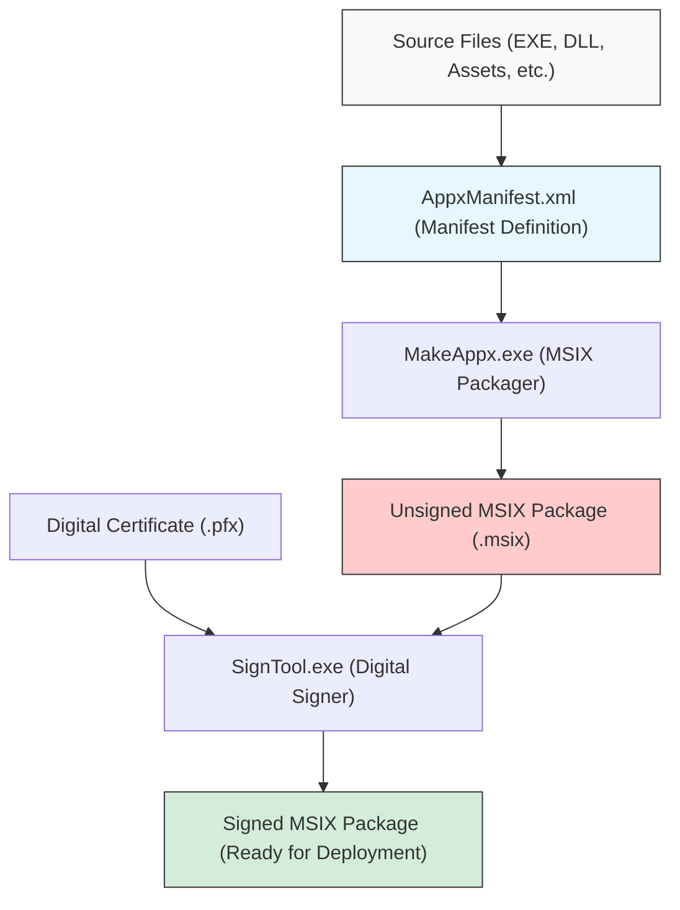
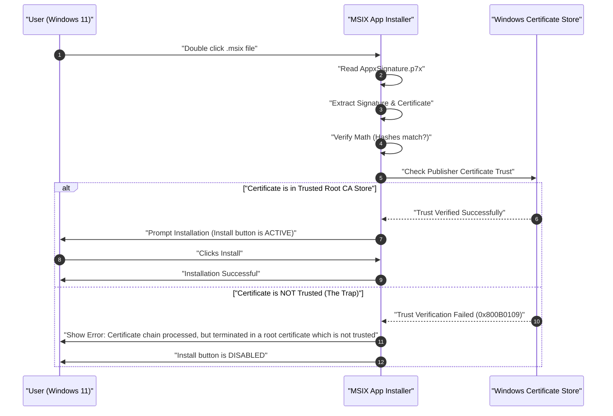

In the era of Windows 11, "MSIX" is becoming the standard choice for application distribution formats. Traditional installers like MSI and EXE had many issues, but MSIX is expected to be the next-generation packaging technology that solves them. However, when developers actually create an MSIX package and attempt sideloading in an organization or test environment, they often fall into the "self-signed certificate trap".

In this article, we will provide a very detailed explanation ranging from technical details of MSIX, how to create packages using Visual Studio and command-line tools, to the causes and solutions of the self-signed certificate errors that many developers face. We aim to make this a must-read guide for Windows app developers, infrastructure administrators, and packaging personnel.

## 1. What is MSIX? Comparison with Traditional MSI/EXE

MSIX is the latest application packaging format for Windows provided by Microsoft. It integrates all the excellent features and concepts of traditional MSIs (Microsoft Installers), .exe-based custom installers, App-V (Application Virtualization), and AppX (Universal Windows Platform app packages) introduced since Windows 8, and evolves them to meet modern security and deployment requirements.

### Issues with Traditional Installers (MSI/EXE)
MSI and EXE, which have long been used as standard installation formats for Windows, had the following fundamental problems:

1. **Win Rot**: As applications are repeatedly installed and uninstalled, unnecessary keys are left in the registry, and DLLs are left behind in system folders (such as `C:\Windows\System32`). This causes the OS itself to gradually slow down and become unstable.
2. **DLL Hell**: When multiple applications try to install DLLs with the same name (but different versions) into a shared system directory, the app installed later overwrites the existing DLL, causing the previously installed app to stop working properly.
3. **Instability from Custom Actions**: MSI packages can run arbitrary scripts or code called "custom actions" with system privileges during installation and uninstallation. This carried the risk of the installer crashing midway or causing unexpected system configuration changes.

### Solutions through MSIX Containerization Architecture
MSIX solves these issues by running applications inside a lightweight "container". This containerization approach offers the following tremendous benefits:

- **Clean Uninstalls**: Apps installed via MSIX perform file system and registry writes virtually (VFS: Virtual File System, VReg: Virtual Registry). Therefore, when uninstalled, this virtualized container is deleted entirely, leaving zero garbage (remnants) on the system. It completely prevents Win Rot.
- **Isolation and Security**: Each app runs within its own environment and does not directly corrupt the DLLs or resources of other apps. This frees you from DLL Hell.
- **Network Bandwidth Optimization**: The MSIX update mechanism is highly excellent and supports block-level differential updates. Since it only downloads the few blocks of binary data that have changed, it minimizes the load on the network even when updating large applications.
- **Reliable Installation State**: The package includes a manifest file (`AppxManifest.xml`), and the installation transaction is strictly managed at the OS level. If it fails, it is completely rolled back to its original state.

## 2. Overview of MSIX Package Creation and Toolchain

There are broadly two approaches to creating an MSIX package. One is to use the Visual Studio Integrated Development Environment (IDE), and the other is to make full use of the command-line tools (`MakeAppx.exe` and `SignTool.exe`) bundled with the Windows SDK.

The following Mermaid diagram shows the process from source files to the generation of the final signed MSIX package.



As can be seen from this process, simply gathering and bundling the files (packaging) is not enough; a "digital signature" step is absolutely necessary. For security reasons, Windows 11 does not permit the installation of unsigned MSIX packages at all.

## 3. Approach A: Creating MSIX using Visual Studio

The easiest and most common method is to use the "Windows Application Packaging Project (WAP)" in Visual Studio. Using this project template, you can easily convert WPF, Windows Forms, WinUI 3, and even legacy C++ Win32 apps into MSIX.

### Step-by-Step Guide
1. **Add a WAP Project**: Right-click your existing Visual Studio solution, select "Add New Project", and choose "Windows Application Packaging Project".
2. **Select Target Platforms**: Specify the minimum and target versions of Windows 10/11 supported by the app.
3. **Reference the Application**: Right-click the "Applications" node in the packaging project, select "Add Reference", and choose the main project you want to package (e.g., a WPF project).
4. **Configure the Manifest**: Double-click the `Package.appxmanifest` file to open the visual designer. Here, you set the app's display name, description, logo image, and most importantly, the "Identity Name" and "Publisher".
5. **Create the Package**: Right-click the project and select "Publish" -> "Create App Packages". Selecting "Sideloading" and choosing the architecture (x64, ARM64, etc.) allows Visual Studio to automatically handle compilation, packaging via `MakeAppx`, and even generating and signing with a self-signed certificate.

It is very seamless, but if you use the automatically generated self-signed certificate (Test Certificate) from Visual Studio here, you will fall into the "trap" described later.

## 4. Approach B: Creating using the Command Line (MakeAppx.exe)

Command-line tools are required for automation in CI/CD pipelines or when manually repackaging a set of files from an existing installer. If the Windows SDK is installed in your environment, you can access the following tools from the Developer Command Prompt.

### 1. Preparing the Manifest File
Create an `AppxManifest.xml` describing minimal information in the root directory of the package.

```xml
<?xml version="1.0" encoding="utf-8"?>
<Package xmlns="http://schemas.microsoft.com/appx/manifest/foundation/windows10"
         xmlns:uap="http://schemas.microsoft.com/appx/manifest/uap/windows10"
         xmlns:rescap="http://schemas.microsoft.com/appx/manifest/foundation/windows10/restrictedcapabilities">
  
  <Identity Name="MyCompany.AwesomeApp"
            Publisher="CN=MyCompany Self-Signed, O=MyCompany"
            Version="1.0.0.0"
            ProcessorArchitecture="x64" />
  
  <Properties>
    <DisplayName>Awesome App</DisplayName>
    <PublisherDisplayName>My Company</PublisherDisplayName>
    <Logo>Assets\StoreLogo.png</Logo>
  </Properties>
  
  <Resources>
    <Resource Language="en-us" />
    <Resource Language="ja-jp" />
  </Resources>
  
  <Dependencies>
    <TargetDeviceFamily Name="Windows.Desktop" MinVersion="10.0.17763.0" MaxVersionTested="10.0.22000.0" />
  </Dependencies>
  
  <Capabilities>
    <rescap:Capability Name="runFullTrust" />
  </Capabilities>
  
  <Applications>
    <Application Id="AwesomeApp" Executable="AwesomeApp.exe" EntryPoint="Windows.FullTrustApplication">
      <uap:VisualElements DisplayName="Awesome App"
                          Description="The best app ever."
                          BackgroundColor="transparent"
                          Square150x150Logo="Assets\Square150x150Logo.png"
                          Square44x44Logo="Assets\Square44x44Logo.png">
      </uap:VisualElements>
    </Application>
  </Applications>
</Package>
```
What is important here is that the value of `<Identity Publisher="..." />` must strictly match the Subject of the certificate that will be used for signing later.

### 2. Packaging with MakeAppx
Execute the following command in the Command Prompt to bundle the directory into an MSIX file.

```cmd
MakeAppx.exe pack /d "C:\Path\To\AppFolder" /p "C:\Path\To\Output\AwesomeApp_1.0.0.0_x64.msix"
```
This completes an unsigned MSIX file, but it cannot be installed on Windows in this state.

## 5. Mathematical Background of Digital Signatures and Cryptography

To deeply understand why an MSIX package requires a signature, you need to understand the cryptographic mechanisms behind digital signatures. A digital signature guarantees that the package was "certainly created by the specified publisher (Authentication)" and that it "has not been tampered with by a third party between creation and the present (Integrity)".

RSA cryptography and SHA-256 (Secure Hash Algorithm 256-bit) are typically combined and used for MSIX signatures.

### Application of Hash Functions
First, let the entire binary (contents) of the MSIX package be the message $M$. The signing tool (SignTool.exe) applies SHA-256, a cryptographic hash function, to this message $M$ to compute a fixed-length (256-bit) hash value $H(M)$.

### Generation of the Signature (Publisher)
Next, the publisher encrypts the hash value using their own "Private Key" $d$ to generate the digital signature $\sigma$. In the context of the RSA algorithm, this is expressed as a modular exponentiation operation as follows:

$$ \sigma \equiv (H(M))^d \pmod n $$

Here, $n$ is the RSA modulus (the product of two huge prime numbers). A certificate (X.509 format) containing this signature $\sigma$ and the publisher's "Public Key" $e$ is embedded as part of the MSIX package (`AppxSignature.p7x`).

### Verification of the Signature (Windows OS)
When a user attempts to install the MSIX, the Windows OS extracts the public key $e$ from the certificate inside the package and performs the following calculation to restore the hash value $H'(M)$:

$$ H'(M) \equiv \sigma^e \pmod n $$

At the same time, the OS recalculates the hash value $H(M)$ of the entire downloaded MSIX package $M$ on its own.
Finally, it verifies whether the restored hash value and the recalculated hash value are equal ($H(M) = H'(M)$). If this equation holds true, it mathematically proves that "not a single bit of the file has been tampered with since signing".

## 6. The Biggest Barrier: "The Self-Signed Certificate Trap"

Even if the mathematical proof above is perfect, Windows 11 will not permit the installation with just that. This is because it needs to verify a "Chain of Trust", asking "is the owner of that public key (certificate) truly the secure organization/person they claim to be?".

If the certificate was issued by a public Root Certificate Authority (Root CA) that is pre-trusted by the OS, such as VeriSign or DigiCert, it can be installed without any problems (apps distributed via the Microsoft Store are similarly trusted by Microsoft's root certificate).

However, when costs for purchasing a public certificate cannot be justified, such as during development or for internal-only tools, developers issue a certificate themselves. This is a "Self-Signed Certificate".

The following sequence diagram shows the behavior of the OS when attempting to install an MSIX package signed with a self-signed certificate.



This is exactly the "trap". Even though the developer created and correctly signed it themselves, the default state of Windows 11 does not know (does not trust) that self-signed certificate, so the installation is blocked with the error code `0x800B0109`. The "Install" button on the installer is grayed out and cannot be clicked.

Many developers face this error and fall into the maze of rewriting manifest files repeatedly, thinking "MSIX is full of bugs" or "the configuration must be wrong", but the problem lies not in the package structure, but in whether or not it is registered in the OS Certificate Store.

## 7. Solution: Creating and Deploying a Self-Signed Certificate using PowerShell

To solve this problem, you must reliably execute the following two steps.
1. Create a valid self-signed certificate and export a PFX file containing the private key.
2. Install the public key portion (CER file) of the created certificate into the **"Trusted Root Certification Authorities" store of all target PCs**.

By using PowerShell, these can be processed reliably and automatically.

### Step 1: Creating and Exporting a Self-Signed Certificate

First, launch PowerShell with administrator privileges and run the following script to create a certificate. Here, we generate a certificate specialized for Code Signing purposes.

```powershell
# 1. Parameter Definition
$SubjectName = "CN=MyCompany Self-Signed, O=MyCompany"
$CertStoreLocation = "Cert:\CurrentUser\My"

# 2. Generate Self-Signed Certificate (For Code Signing: 1.3.6.1.5.5.7.3.3)
$Cert = New-SelfSignedCertificate -Type Custom `
    -Subject $SubjectName `
    -KeyUsage DigitalSignature `
    -FriendlyName "MyCompany MSIX Signing Cert" `
    -CertStoreLocation $CertStoreLocation `
    -TextExtension @("2.5.29.37={text}1.3.6.1.5.5.7.3.3", "2.5.29.19={text}")

Write-Host "Certificate generated. Thumbprint: $($Cert.Thumbprint)"

# 3. Create Password for PFX Export (including private key)
$Password = ConvertTo-SecureString -String "YourSecurePassword123!" -Force -AsPlainText

# 4. Export PFX File (For signing with SignTool)
$PfxPath = "C:\Path\To\Output\MyCompanyCert.pfx"
Export-PfxCertificate -Cert $Cert -FilePath $PfxPath -Password $Password

# 5. Export CER (Public key only) (For installation on client PCs)
$CerPath = "C:\Path\To\Output\MyCompanyCert.cer"
Export-Certificate -Cert $Cert -FilePath $CerPath
```

Sign the MSIX package using the `$PfxPath` file created here.

```cmd
SignTool.exe sign /fd SHA256 /a /f "C:\Path\To\Output\MyCompanyCert.pfx" /p "YourSecurePassword123!" "C:\Path\To\Output\AwesomeApp_1.0.0.0_x64.msix"
```

### Step 2: Installing the Certificate on Client PCs (Disarming the Trap)

Even if you take the signed MSIX to another PC (or virtual environment) and double-click it as is, it cannot be installed as mentioned earlier. Beforehand (or simultaneously), you must install the `$CerPath` file exported earlier into the "Trusted Root Certification Authorities" of the "Local Machine".

To do this, open PowerShell with **administrator privileges** on the deployment target PC and execute the following command.

```powershell
# Path to the CER file
$CerPath = "C:\Path\To\Output\MyCompanyCert.cer"

# Import into the "Trusted Root Certification Authorities" of the local machine
Import-Certificate -FilePath $CerPath -CertStoreLocation "Cert:\LocalMachine\Root"

Write-Host "Certificate installed to Trusted Root Certification Authorities."
```

> [!CAUTION]
> Administrator privileges are required to add it to the root certification authority store of the "Local Machine" (`LocalMachine`). Be careful because if you put it in a user's personal store (`CurrentUser`), it may not be recognized due to the permission context of the App Installer.

Immediately after this script succeeds, try double-clicking the MSIX file that was producing an error earlier again. Just like magic, the error message should disappear, and a bright blue active "Install" button should be displayed. You have now completely broken through the "Self-Signed Certificate Trap".

## 8. Enterprise Environment Operations and Best Practices

For a developer's local testing, the above procedure is sufficient, but when deploying a sideloaded app to dozens or hundreds of PCs within a company, it is unrealistic to have each user run the certificate installation script, and it also comes with security risks.

Best practices in an enterprise environment are as follows:

### 1. Utilizing Active Directory Group Policy (GPO)
If Active Directory is introduced in your company, you can use the "Public Key Policies" of a GPO to automatically distribute the self-signed certificate (CER file) to the "Trusted Root Certification Authorities" of all domain-joined PCs. This allows employees to install simply by double-clicking the MSIX file on a shared folder without being conscious of certificates at all.

### 2. Deployment via Microsoft Intune (MDM)
In modern environments, device management is performed using Microsoft Intune. In Intune, you can push a trusted certificate (.cer) to endpoints using the "Configuration profile" feature. Afterward, it is possible to deploy the MSIX package itself as a Line of Business (LOB) application as a silent install.

### 3. Automatic Updates via App Installer Files (.appinstaller)
MSIX is equipped with a powerful feature to automate app updates. By creating an XML-based `.appinstaller` file and placing it on a web server or SMB shared folder, you can have it check for new versions of the MSIX in the background when the app launches and automatically apply updates.

```xml
<?xml version="1.0" encoding="utf-8"?>
<AppInstaller
    Uri="https://internal.mycompany.com/apps/AwesomeApp.appinstaller"
    Version="1.0.0.0"
    xmlns="http://schemas.microsoft.com/appx/appinstaller/2018">
    <MainPackage
        Name="MyCompany.AwesomeApp"
        Publisher="CN=MyCompany Self-Signed, O=MyCompany"
        Version="1.0.0.0"
        ProcessorArchitecture="x64"
        Uri="https://internal.mycompany.com/apps/AwesomeApp_1.0.0.0_x64.msix" />
    <UpdateSettings>
        <OnLaunch HoursBetweenUpdateChecks="0" />
    </UpdateSettings>
</AppInstaller>
```
By distributing this file to users and having them install it, you can subsequently update the apps for all users automatically just by replacing the MSIX file on the server and updating the version number in the `.appinstaller`.

## 9. Troubleshooting: Common Certificate-Related Errors

Finally, let's summarize other common errors and solutions related to certificates and signing that may occur.

- **0x800B0101**: The certificate used for signing has expired. Reissue a new certificate, or use a timestamp server (e.g., `http://timestamp.digicert.com`) during signing to prove that it was signed within the certificate's validity period (if a timestamp is attached, the signature is considered valid even if the certificate itself expires).
- **0x80080204**: The `Publisher` value listed in `AppxManifest.xml` does not perfectly match the `Subject` value of the certificate. Strictly check whether they are an exact string match, including the presence or absence of spaces after commas.
- **Checking the Event Viewer**: To investigate the detailed cause of an error, it is very important to open the Windows Event Viewer and check the logs under "Applications and Services Logs" -> "Microsoft" -> "Windows" -> "AppxPackagingOM" or "AppXDeployment-Server".

## 10. Conclusion

MSIX packaging for Windows 11 is a powerful technology that dramatically improves the lifecycle management of applications. You can be freed from Win Rot and DLL Hell, providing users with a clean and secure environment.

On the other hand, because the security model has become stricter, a deep understanding of digital signatures and the "Chain of Trust" of certificates is indispensable. The "Self-Signed Certificate Trap" is a gateway that almost all developers who touch MSIX technology for the first time will face. By understanding the mechanisms of generating, exporting, and importing certificates into the appropriate stores explained in this article, and automating them using scripts or GPOs, you will be able to realize a smooth deployment that maximizes the potential of MSIX.

Please utilize this knowledge to build a next-generation, clean Windows application distribution environment.
