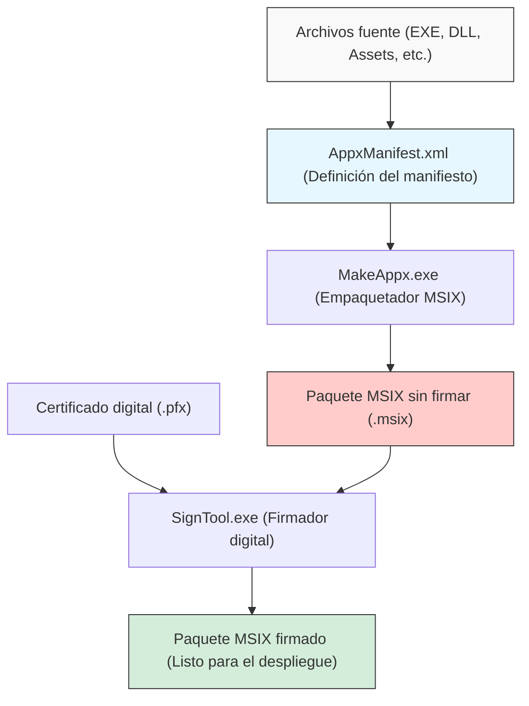
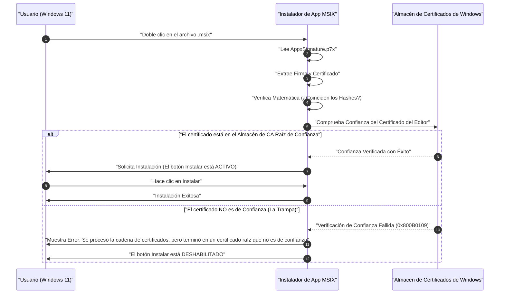

En la era de Windows 11, "MSIX" se está convirtiendo en la opción estándar como formato de distribución de aplicaciones. Los instaladores tradicionales como MSI o EXE tenían muchos problemas, pero se espera que MSIX sea la tecnología de empaquetado de próxima generación que los resuelva. Sin embargo, cuando los desarrolladores intentan crear un paquete MSIX y realizar "sideloading" (carga lateral) en su organización o entorno de prueba, a menudo caen en la "trampa de los certificados autofirmados".

En este artículo, explicaremos con gran detalle desde los aspectos técnicos de MSIX, cómo crear paquetes utilizando Visual Studio o herramientas de línea de comandos, hasta las causas y soluciones de los errores relacionados con los certificados autofirmados a los que se enfrentan muchos desarrolladores. Nuestro objetivo es que esta sea una guía de lectura obligatoria para los desarrolladores de aplicaciones de Windows, administradores de infraestructura y encargados de empaquetado.

## 1. ¿Qué es MSIX? Comparación con los tradicionales MSI/EXE

MSIX es el formato de paquete de aplicaciones más reciente para Windows proporcionado por Microsoft. Integra todas las excelentes características y conceptos del tradicional MSI (Microsoft Installer), instaladores personalizados basados en .exe, App-V (Application Virtualization) y AppX (paquete de aplicaciones Universal Windows Platform) introducido desde Windows 8, y los ha evolucionado para satisfacer los requisitos modernos de seguridad y despliegue.

### Problemas con los instaladores tradicionales (MSI/EXE)
MSI y EXE, que se han utilizado como formatos de instalación estándar de Windows durante muchos años, tenían los siguientes problemas fundamentales.

1. **Fenómeno de Win Rot (Degradación de Windows)**: El problema en el que, a medida que se instalan y desinstalan aplicaciones repetidamente, quedan claves innecesarias en el registro y DLLs abandonadas en las carpetas del sistema (como `C:\Windows\System32`). Esto provoca que el rendimiento del propio sistema operativo se vuelva gradualmente más lento e inestable.
2. **Infierno de las DLL (DLL Hell)**: El problema que ocurre cuando varias aplicaciones intentan instalar una DLL con el mismo nombre (pero con versiones diferentes) en un directorio del sistema compartido. La aplicación instalada posteriormente sobrescribe la DLL existente, lo que hace que la aplicación instalada previamente deje de funcionar correctamente.
3. **Inestabilidad debido a acciones personalizadas**: En los paquetes MSI, cualquier script o código llamado "acción personalizada" puede ejecutarse con privilegios del sistema durante la instalación o desinstalación. Esto conllevaba el riesgo de que el instalador fallara en medio del proceso o provocara cambios inesperados en la configuración del sistema.

### Solución mediante la arquitectura en contenedores de MSIX
MSIX resuelve estos problemas haciendo que la aplicación se ejecute dentro de un "contenedor" ligero. Este enfoque en contenedores tiene las siguientes ventajas enormes.

- **Desinstalación limpia**: Las aplicaciones instaladas con MSIX escriben en el sistema de archivos y el registro de forma virtualizada (VFS: Virtual File System, VReg: Virtual Registry). Por lo tanto, al desinstalar, todo este contenedor virtualizado se elimina, sin dejar basura (restos) en el sistema. Evita completamente el Win Rot.
- **Aislamiento y seguridad (Isolation)**: Cada aplicación se ejecuta en su propio entorno y no destruye directamente las DLL o los recursos de otras aplicaciones. Esto te libera del Infierno de las DLL.
- **Optimización del ancho de banda de red**: El mecanismo de actualización de MSIX es excelente y soporta actualizaciones diferenciales a nivel de bloque (Differential Update). Dado que solo descarga los pocos bloques de datos binarios que han cambiado, minimiza la carga en la red incluso al actualizar aplicaciones de gran tamaño.
- **Estado de instalación confiable**: El paquete incluye un archivo de manifiesto (`AppxManifest.xml`), y las transacciones de instalación se gestionan estrictamente a nivel del sistema operativo. Si falla, se revierte completamente al estado original.

## 2. Visión general de la creación de paquetes MSIX y la cadena de herramientas

Para crear un paquete MSIX, existen principalmente dos enfoques. Uno es usar el entorno de desarrollo integrado (IDE) de Visual Studio, y el otro es aprovechar al máximo las herramientas de línea de comandos incluidas en el Windows SDK (como `MakeAppx.exe` y `SignTool.exe`).

El siguiente diagrama Mermaid muestra el proceso desde los archivos fuente hasta la generación final del paquete MSIX firmado.



Como se puede ver en este proceso, no basta con simplemente reunir y comprimir los archivos (empaquetado); el paso de la "firma digital" es absolutamente necesario. Windows 11 no permite de ninguna manera la instalación de paquetes MSIX sin firmar por razones de seguridad.

## 3. Enfoque A: Creación de MSIX utilizando Visual Studio

El método más fácil y común es usar el "Proyecto de empaquetado de aplicaciones de Windows" (Windows Application Packaging Project - WAP) de Visual Studio. Usando esta plantilla de proyecto, puedes convertir fácilmente a MSIX aplicaciones WPF, Windows Forms, WinUI 3 e incluso aplicaciones Win32 heredadas de C++.

### Guía paso a paso
1. **Agregar proyecto WAP**: Haz clic derecho en una solución de Visual Studio existente y selecciona "Proyecto de empaquetado de aplicaciones de Windows" desde "Agregar nuevo proyecto".
2. **Selección de la plataforma de destino**: Especifica la versión mínima y la versión de destino de Windows 10/11 que admite tu aplicación.
3. **Referencia de la aplicación**: Haz clic derecho en el nodo "Aplicaciones" del proyecto de empaquetado y, en "Agregar referencia", selecciona el proyecto principal que deseas empaquetar (por ejemplo, el proyecto WPF).
4. **Configuración del manifiesto**: Haz doble clic en el archivo `Package.appxmanifest` para abrir el diseñador visual. Aquí se configura el nombre de visualización de la aplicación, la descripción, la imagen del logotipo y, lo que es más importante, el "Nombre del paquete (Identity Name)" y el "Editor (Publisher)".
5. **Creación del paquete**: Haz clic derecho en el proyecto y selecciona "Publicar" -> "Crear paquetes de aplicaciones". Al seleccionar "Para instalación de prueba (Sideloading)" y elegir la arquitectura (x64, ARM64, etc.), Visual Studio se encarga automáticamente de compilar, empaquetar con `MakeAppx`, y generar y firmar con un certificado autofirmado.

Aunque es muy fluido, si utilizas el certificado autofirmado (Test Certificate) generado automáticamente por Visual Studio aquí, caerás en la "trampa" que se describe más adelante.

## 4. Enfoque B: Creación utilizando la línea de comandos (MakeAppx.exe)

Las herramientas de línea de comandos son necesarias para la automatización en canalizaciones CI/CD o cuando se reempaquetan manualmente un conjunto de archivos desde un instalador existente. Si el Windows SDK está instalado, puedes acceder a las siguientes herramientas desde el Símbolo del sistema para desarrolladores.

### 1. Preparación del archivo de manifiesto
En el directorio raíz del paquete, crea un `AppxManifest.xml` con la información mínima necesaria.

```xml
<?xml version="1.0" encoding="utf-8"?>
<Package xmlns="http://schemas.microsoft.com/appx/manifest/foundation/windows10"
         xmlns:uap="http://schemas.microsoft.com/appx/manifest/uap/windows10"
         xmlns:rescap="http://schemas.microsoft.com/appx/manifest/foundation/windows10/restrictedcapabilities">
  
  <Identity Name="MyCompany.AwesomeApp"
            Publisher="CN=MyCompany Self-Signed, O=MyCompany"
            Version="1.0.0.0"
            ProcessorArchitecture="x64" />
  
  <Properties>
    <DisplayName>Awesome App</DisplayName>
    <PublisherDisplayName>My Company</PublisherDisplayName>
    <Logo>Assets\StoreLogo.png</Logo>
  </Properties>
  
  <Resources>
    <Resource Language="en-us" />
    <Resource Language="ja-jp" />
  </Resources>
  
  <Dependencies>
    <TargetDeviceFamily Name="Windows.Desktop" MinVersion="10.0.17763.0" MaxVersionTested="10.0.22000.0" />
  </Dependencies>
  
  <Capabilities>
    <rescap:Capability Name="runFullTrust" />
  </Capabilities>
  
  <Applications>
    <Application Id="AwesomeApp" Executable="AwesomeApp.exe" EntryPoint="Windows.FullTrustApplication">
      <uap:VisualElements DisplayName="Awesome App"
                          Description="The best app ever."
                          BackgroundColor="transparent"
                          Square150x150Logo="Assets\Square150x150Logo.png"
                          Square44x44Logo="Assets\Square44x44Logo.png">
      </uap:VisualElements>
    </Application>
  </Applications>
</Package>
```
Lo importante aquí es que el valor de `<Identity Publisher="..." />` debe coincidir exactamente con el Subject del certificado que se utilizará posteriormente para la firma.

### 2. Empaquetado con MakeAppx
Ejecuta el siguiente comando en el símbolo del sistema para comprimir el directorio en un archivo MSIX.

```cmd
MakeAppx.exe pack /d "C:\Path\To\AppFolder" /p "C:\Path\To\Output\AwesomeApp_1.0.0.0_x64.msix"
```
Con esto se completa el archivo MSIX sin firmar, pero en este estado no se puede instalar en Windows.

## 5. Firma digital y fundamentos matemáticos de la criptografía

Para entender profundamente por qué un paquete MSIX necesita estar firmado, es necesario comprender el mecanismo criptográfico detrás de las firmas digitales. La firma digital garantiza que el paquete "fue creado indudablemente por el editor especificado (autenticidad)" y que "no ha sido alterado por terceros desde su creación hasta el presente (integridad)".

La firma de MSIX suele utilizar una combinación de cifrado RSA y SHA-256 (Secure Hash Algorithm de 256 bits).

### Aplicación de la función hash
Primero, consideremos todo el contenido binario del paquete MSIX como el mensaje $M$. La herramienta de firma (SignTool.exe) aplica la función hash criptográfica SHA-256 a este mensaje $M$ y calcula un valor hash de longitud fija (256 bits) $H(M)$.

### Generación de la firma (Editor)
A continuación, el editor utiliza su "Clave Privada (Private Key)" $d$ para cifrar el valor hash y generar una firma digital $\sigma$. En el contexto del algoritmo RSA, esto se expresa como una exponenciación modular de la siguiente manera:

$$ \sigma \equiv (H(M))^d \pmod n $$

Donde $n$ es el módulo RSA (el producto de dos grandes números primos). Un certificado (formato X.509) que contiene esta firma $\sigma$ y la "Clave Pública (Public Key)" $e$ del editor se incrusta como parte del paquete MSIX (`AppxSignature.p7x`).

### Verificación de la firma (Windows OS)
Cuando el usuario intenta instalar el MSIX, el sistema operativo Windows extrae la clave pública $e$ del certificado dentro del paquete y realiza el siguiente cálculo para restaurar el valor hash $H'(M)$.

$$ H'(M) \equiv \sigma^e \pmod n $$

Al mismo tiempo, el sistema operativo recalcula por sí mismo el valor hash $H(M)$ de todo el paquete MSIX descargado $M$.
Finalmente, verifica si el valor hash restaurado y el valor hash recalculado son iguales ($H(M) = H'(M)$). Si esta ecuación se cumple, se demuestra matemáticamente que "el archivo no ha sido alterado ni un solo bit después de ser firmado".

## 6. La mayor barrera: "La trampa de los certificados autofirmados"

Incluso si la prueba matemática anterior es perfecta, Windows 11 no permitirá la instalación solo por eso. Esto se debe a que debe verificar la "Cadena de Confianza (Chain of Trust)", que responde a la pregunta: "¿Es el propietario de esta clave pública (certificado) realmente la persona u organización segura que dice ser?".

Si el certificado ha sido emitido por una Autoridad de Certificación Raíz (Root CA) pública de confianza por el sistema operativo de antemano, como VeriSign o DigiCert, se puede instalar sin problemas (las aplicaciones distribuidas a través de Microsoft Store también confían en el certificado raíz de Microsoft de la misma manera).

Sin embargo, cuando no se puede asumir el costo de comprar un certificado público, como durante el desarrollo o para herramientas exclusivas de la empresa, los desarrolladores emiten el certificado por sí mismos. Esto es un "Certificado Autofirmado (Self-Signed Certificate)".

El siguiente diagrama de secuencia muestra el comportamiento del sistema operativo al intentar instalar un paquete MSIX firmado con un certificado autofirmado.



Esta es exactamente la "trampa". A pesar de que el desarrollador lo creó y lo firmó correctamente, por defecto Windows 11 no conoce (no confía en) ese certificado autofirmado, por lo que la instalación se bloquea con el código de error `0x800B0109`. El botón "Instalar" del instalador aparece en gris y no se puede presionar.

Muchos desarrolladores se enfrentan a este error y caen en el laberinto de reescribir repetidamente el archivo de manifiesto pensando que "MSIX está lleno de errores" o "la configuración debe estar mal", pero el problema no es la estructura del paquete, sino si está registrado o no en el almacén de certificados (Certificate Store) del sistema operativo.

## 7. Solución: Creación y despliegue de certificados autofirmados mediante PowerShell

Para resolver este problema, es necesario ejecutar de manera segura los siguientes dos pasos:
1. Crear un certificado autofirmado válido y exportar un archivo PFX que contenga la clave privada.
2. Instalar la parte de la clave pública (archivo CER) del certificado creado en el almacén de **"Entidades de certificación raíz de confianza" (Trusted Root Certification Authorities) de todas las PC de destino**.

Estos procesos se pueden realizar de forma fiable y automática mediante PowerShell.

### Paso 1: Creación y exportación de un certificado autofirmado

Primero, inicia PowerShell con privilegios de administrador y ejecuta el siguiente script para crear el certificado. Aquí generaremos un certificado especializado para uso de firma de código (Code Signing).

```powershell
# 1. Definición de parámetros
$SubjectName = "CN=MyCompany Self-Signed, O=MyCompany"
$CertStoreLocation = "Cert:\CurrentUser\My"

# 2. Generación del certificado autofirmado (Para firma de código: 1.3.6.1.5.5.7.3.3)
$Cert = New-SelfSignedCertificate -Type Custom `
    -Subject $SubjectName `
    -KeyUsage DigitalSignature `
    -FriendlyName "MyCompany MSIX Signing Cert" `
    -CertStoreLocation $CertStoreLocation `
    -TextExtension @("2.5.29.37={text}1.3.6.1.5.5.7.3.3", "2.5.29.19={text}")

Write-Host "Se ha generado el certificado. Thumbprint: $($Cert.Thumbprint)"

# 3. Creación de la contraseña para la exportación del PFX (incluyendo clave privada)
$Password = ConvertTo-SecureString -String "YourSecurePassword123!" -Force -AsPlainText

# 4. Exportación del archivo PFX (Para firmar con SignTool)
$PfxPath = "C:\Path\To\Output\MyCompanyCert.pfx"
Export-PfxCertificate -Cert $Cert -FilePath $PfxPath -Password $Password

# 5. Exportación del CER (solo clave pública, para instalar en la PC cliente)
$CerPath = "C:\Path\To\Output\MyCompanyCert.cer"
Export-Certificate -Cert $Cert -FilePath $CerPath
```

Usa el archivo `$PfxPath` creado aquí para firmar el paquete MSIX.

```cmd
SignTool.exe sign /fd SHA256 /a /f "C:\Path\To\Output\MyCompanyCert.pfx" /p "YourSecurePassword123!" "C:\Path\To\Output\AwesomeApp_1.0.0.0_x64.msix"
```

### Paso 2: Instalación del certificado en la PC cliente (Desactivación de la trampa)

Si llevas el MSIX firmado a otra PC (o entorno virtual) y haces doble clic en él tal cual, no podrás instalarlo como se mencionó anteriormente. Antes de eso (o al mismo tiempo), es necesario instalar el archivo `$CerPath` que exportamos anteriormente en las "Entidades de certificación raíz de confianza" del "Equipo local".

Para hacer esto, abre PowerShell **con privilegios de administrador** en la PC de destino y ejecuta el siguiente comando.

```powershell
# Ruta del archivo CER
$CerPath = "C:\Path\To\Output\MyCompanyCert.cer"

# Importar en "Entidades de certificación raíz de confianza" de la máquina local
Import-Certificate -FilePath $CerPath -CertStoreLocation "Cert:\LocalMachine\Root"

Write-Host "El certificado se ha instalado en las Entidades de certificación raíz de confianza."
```

> [!CAUTION]
> Agregar al almacén de autoridades de certificación raíz del "Equipo local (`LocalMachine`)" requiere estrictamente privilegios de administrador. Ten en cuenta que si lo colocas en el almacén personal del usuario (`CurrentUser`), puede que no sea reconocido debido al contexto de permisos de App Installer.

Inmediatamente después de que este script se ejecute correctamente, intenta hacer doble clic de nuevo en el archivo MSIX que daba error anteriormente. Como por arte de magia, el mensaje de error desaparecerá y debería mostrarse un botón "Instalar" activo de color azul brillante. Con esto, habrás superado completamente la "trampa de los certificados autofirmados".

## 8. Operación y mejores prácticas en entornos empresariales

Aunque los pasos anteriores son suficientes para las pruebas locales de un desarrollador, cuando se implementa una aplicación mediante sideloading en decenas o cientos de PC de la empresa, no es práctico hacer que cada usuario ejecute el script de instalación del certificado, y esto también conlleva riesgos de seguridad.

Las mejores prácticas en un entorno empresarial son las siguientes:

### 1. Aprovechamiento de la Política de Grupo (GPO) de Active Directory
Si se ha implementado Active Directory en la empresa, puedes usar las "Políticas de clave pública" de GPO para distribuir automáticamente el certificado autofirmado (archivo CER) a las "Entidades de certificación raíz de confianza" de todas las PC unidas al dominio. De esta manera, los empleados pueden instalar la aplicación simplemente haciendo doble clic en el archivo MSIX en una carpeta compartida, sin tener que ser conscientes del certificado en absoluto.

### 2. Despliegue mediante Microsoft Intune (MDM)
En entornos modernos, la gestión de dispositivos se realiza mediante Microsoft Intune. En Intune, puedes usar la función "Perfil de configuración" para enviar certificados de confianza (.cer) a los puntos de conexión. Posteriormente, el propio paquete MSIX se puede desplegar mediante una instalación silenciosa como una aplicación LOB (Line of Business).

### 3. Actualización automática mediante el archivo App Installer (.appinstaller)
MSIX viene con una potente función para automatizar la actualización de aplicaciones. Al crear un archivo `.appinstaller` basado en XML y colocarlo en un servidor web o carpeta compartida SMB, al iniciar la aplicación, verificará en segundo plano si hay una nueva versión del MSIX y puede aplicar automáticamente la actualización.

```xml
<?xml version="1.0" encoding="utf-8"?>
<AppInstaller
    Uri="https://internal.mycompany.com/apps/AwesomeApp.appinstaller"
    Version="1.0.0.0"
    xmlns="http://schemas.microsoft.com/appx/appinstaller/2018">
    <MainPackage
        Name="MyCompany.AwesomeApp"
        Publisher="CN=MyCompany Self-Signed, O=MyCompany"
        Version="1.0.0.0"
        ProcessorArchitecture="x64"
        Uri="https://internal.mycompany.com/apps/AwesomeApp_1.0.0.0_x64.msix" />
    <UpdateSettings>
        <OnLaunch HoursBetweenUpdateChecks="0" />
    </UpdateSettings>
</AppInstaller>
```
Al distribuir e instalar este archivo a los usuarios, a partir de entonces simplemente reemplazando el archivo MSIX en el servidor y actualizando el número de versión de `.appinstaller`, la aplicación de todos los usuarios se actualizará automáticamente.

## 9. Solución de problemas: Errores comunes relacionados con los certificados

Finalmente, resumiremos otros errores comunes que pueden ocurrir relacionados con los certificados y firmas, y sus soluciones.

- **0x800B0101**: El certificado utilizado para la firma ha caducado. Vuelve a emitir un nuevo certificado o utiliza un servidor de sellado de tiempo al firmar (por ejemplo: `http://timestamp.digicert.com`) para poder demostrar que se firmó dentro del período de validez del certificado (si agregas un sello de tiempo, la firma se considerará válida incluso si el certificado en sí ha caducado).
- **0x80080204**: El valor de `Publisher` escrito en `AppxManifest.xml` y el valor del `Subject` del certificado no coinciden exactamente. Verifica rigurosamente que coincidan exactamente como cadenas, incluida la presencia o ausencia de espacios después de las comas.
- **Revisión del Visor de eventos**: Para encontrar una causa más detallada del error, es muy importante abrir el Visor de eventos de Windows y verificar los registros en "Registros de aplicaciones y servicios" -> "Microsoft" -> "Windows" -> "AppxPackagingOM" o "AppXDeployment-Server".

## 10. Conclusión

El empaquetado MSIX para Windows 11 es una poderosa tecnología que mejora drásticamente la gestión del ciclo de vida de las aplicaciones. Libera del Win Rot y del Infierno de las DLL, y proporciona a los usuarios un entorno limpio y seguro.

Por otro lado, dado que el modelo de seguridad es más estricto, es esencial una comprensión profunda de las firmas digitales y la "cadena de confianza" de los certificados. La "trampa de los certificados autofirmados" es un rito de iniciación al que casi todos los desarrolladores que tocan la tecnología MSIX por primera vez se enfrentan invariablemente. Al comprender los mecanismos de generación, exportación y la importación adecuada de certificados en los almacenes explicados en este artículo, y al automatizarlos utilizando scripts y GPO, podrás lograr un despliegue fluido que maximice el potencial de MSIX.

Por favor, aprovecha este conocimiento y construye un entorno limpio de distribución de aplicaciones de Windows de próxima generación.
