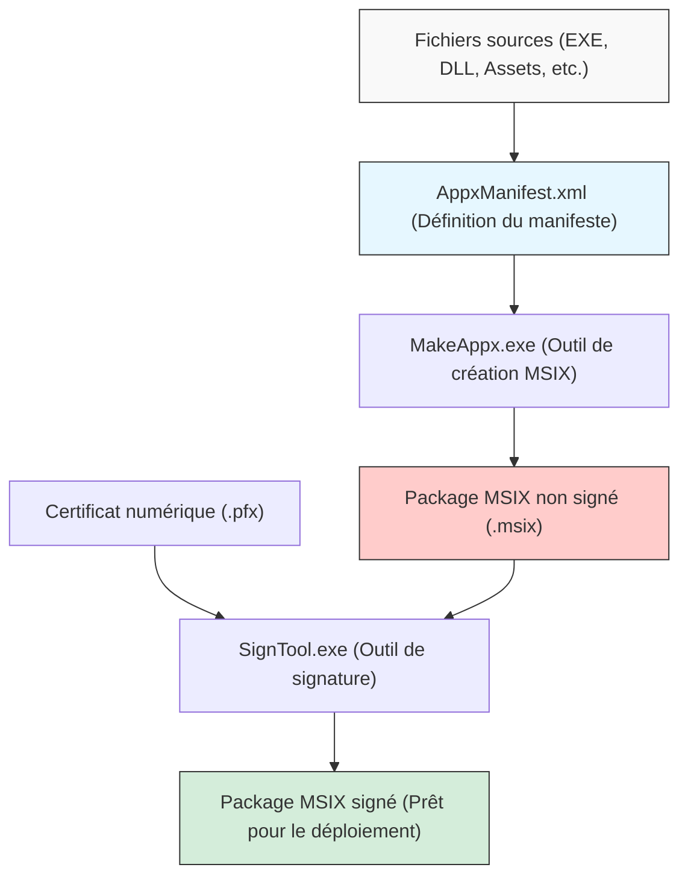
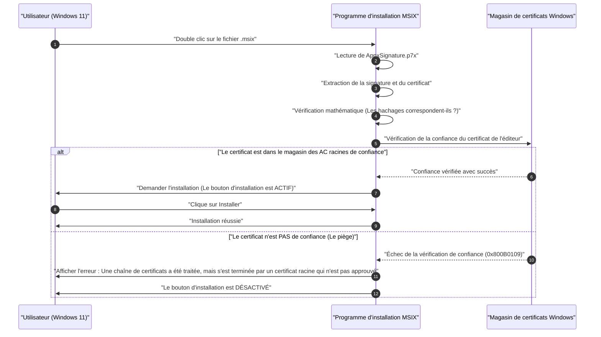

À l'ère de Windows 11, le « MSIX » devient le choix standard comme format de distribution des applications. Bien que les installateurs traditionnels tels que MSI et EXE présentaient de nombreux problèmes, on attend du MSIX qu'il soit la technologie d'empaquetage de nouvelle génération qui les résoudra. Cependant, lorsque les développeurs essaient de créer un package MSIX et d'effectuer un chargement latéral (Sideloading) au sein de leur organisation ou dans un environnement de test, ils tombent souvent dans le « piège des certificats auto-signés ».

Cet article expliquera très en détail les détails techniques du MSIX, comment créer des packages à l'aide de Visual Studio ou d'outils en ligne de commande, ainsi que les causes et solutions aux erreurs liées aux certificats auto-signés auxquelles de nombreux développeurs sont confrontés. L'objectif est d'en faire un guide de lecture incontournable pour les développeurs d'applications Windows, les administrateurs d'infrastructure et les responsables de l'empaquetage.

## 1. Qu'est-ce que le MSIX ? Comparaison avec les anciens MSI/EXE

MSIX est le dernier format de package d'applications pour Windows fourni par Microsoft. Il intègre toutes les meilleures fonctionnalités et concepts des formats existants : MSI (Microsoft Installer), les installateurs personnalisés basés sur .exe, App-V (Application Virtualization) et AppX (packages d'applications Universal Windows Platform) introduits depuis Windows 8, tout en évoluant pour répondre aux exigences modernes de sécurité et de déploiement.

### Problèmes des installateurs traditionnels (MSI/EXE)
Les MSI et EXE, utilisés pendant de nombreuses années comme formats d'installation standard sous Windows, présentaient des problèmes fondamentaux tels que :

1. **Phénomène de Win Rot (Dégradation de Windows)** : À mesure que les applications sont installées et désinstallées, des clés inutiles restent dans le registre et des DLL sont laissées dans les dossiers système (comme `C:\Windows\System32`). Cela provoque un ralentissement progressif du système d'exploitation et le rend instable.
2. **L'enfer des DLL (DLL Hell)** : Lorsque plusieurs applications tentent d'installer une DLL portant le même nom (mais de version différente) dans un répertoire système partagé, l'application installée en dernier écrase la DLL existante, ce qui empêche l'application installée en premier de fonctionner correctement.
3. **Instabilité due aux actions personnalisées (Custom Actions)** : Dans les packages MSI, des scripts ou du code arbitraires, appelés « actions personnalisées », peuvent être exécutés avec les privilèges système pendant l'installation ou la désinstallation. Cela risquait de faire planter l'installateur en cours de route ou d'entraîner des modifications inattendues de la configuration du système.

### Solution grâce à l'architecture conteneurisée du MSIX
MSIX résout ces problèmes en exécutant les applications dans des « conteneurs » légers. Cette approche de conteneurisation présente des avantages considérables :

- **Désinstallation propre (Clean Uninstall)** : Les applications installées avec MSIX virtualisent les écritures sur le système de fichiers et le registre (VFS : Virtual File System, VReg : Virtual Registry). Par conséquent, lors de la désinstallation, ce conteneur virtualisé est supprimé dans son intégralité, ne laissant aucun déchet (résidu) sur le système. Cela empêche complètement le Win Rot.
- **Isolation et sécurité (Isolation)** : Chaque application s'exécute dans son propre environnement et ne détruit pas directement les DLL ou les ressources des autres applications. Cela vous libère de l'enfer des DLL.
- **Optimisation de la bande passante réseau** : Le mécanisme de mise à jour de MSIX est très efficace, prenant en charge les mises à jour différentielles au niveau des blocs (Differential Update). Comme il ne télécharge que les quelques blocs de données binaires qui ont été modifiés, la charge sur le réseau est minimisée, même pour les mises à jour d'applications volumineuses.
- **État d'installation fiable** : Le package inclut un fichier manifeste (`AppxManifest.xml`), et les transactions d'installation sont strictement gérées au niveau du système d'exploitation. En cas d'échec, il y a une restauration complète (rollback) à l'état initial.

## 2. Vue d'ensemble de la création de packages MSIX et chaîne d'outils

Il existe principalement deux approches pour créer un package MSIX. La première consiste à utiliser l'environnement de développement intégré (IDE) Visual Studio, et la seconde consiste à utiliser les outils en ligne de commande inclus dans le SDK Windows (`MakeAppx.exe` et `SignTool.exe`).

Le diagramme Mermaid suivant illustre le processus allant des fichiers sources à la génération du package MSIX signé final.



Comme on peut le voir dans ce processus, il ne suffit pas de rassembler et de compresser les fichiers (empaquetage) ; l'étape de « signature numérique » est absolument nécessaire. Pour des raisons de sécurité, Windows 11 n'autorise aucune installation de packages MSIX non signés.

## 3. Approche A : Création de MSIX à l'aide de Visual Studio

La méthode la plus simple et la plus courante consiste à utiliser le « Projet de création de packages d'applications Windows » (Windows Application Packaging Project - WAP) de Visual Studio. En utilisant ce modèle de projet, il est possible de convertir facilement en MSIX des applications WPF, Windows Forms, WinUI 3 ou même des applications Win32 existantes en C++.

### Guide étape par étape
1. **Ajout d'un projet WAP** : Faites un clic droit sur votre solution Visual Studio existante, sélectionnez "Ajouter un nouveau projet" puis choisissez "Projet de création de packages d'applications Windows".
2. **Sélection des plateformes cibles** : Spécifiez les versions minimale et cible de Windows 10/11 prises en charge par l'application.
3. **Référence de l'application** : Faites un clic droit sur le nœud "Applications" du projet de package, sélectionnez "Ajouter une référence" et choisissez le projet principal (par exemple, le projet WPF) que vous souhaitez empaqueter.
4. **Configuration du manifeste** : Double-cliquez sur le fichier `Package.appxmanifest` pour ouvrir le concepteur visuel. Ici, vous définirez le nom d'affichage de l'application, la description, l'image du logo et, plus important encore, le « Nom du package » (Identity Name) et l'« Éditeur » (Publisher).
5. **Création du package** : Faites un clic droit sur le projet et sélectionnez "Publier" -> "Créer des packages d'application". Si vous sélectionnez "Sideloading" (pour le chargement latéral) et choisissez l'architecture (x64, ARM64, etc.), Visual Studio se chargera automatiquement de la compilation, de l'empaquetage via `MakeAppx`, ainsi que de la génération et de la signature avec un certificat auto-signé.

C'est très fluide, mais c'est ici que si vous utilisez le certificat auto-signé (Test Certificate) généré automatiquement par Visual Studio, vous tomberez dans le « piège » décrit plus loin.

## 4. Approche B : Création via la ligne de commande (MakeAppx.exe)

Les outils en ligne de commande sont nécessaires pour l'automatisation dans des pipelines CI/CD ou lors du réempaquetage manuel de fichiers à partir d'un installateur existant. Si le SDK Windows est installé, vous pouvez accéder aux outils suivants depuis l'invite de commandes du développeur.

### 1. Préparation du fichier manifeste
Créez un `AppxManifest.xml` à la racine du package avec les informations minimales requises.

```xml
<?xml version="1.0" encoding="utf-8"?>
<Package xmlns="http://schemas.microsoft.com/appx/manifest/foundation/windows10"
         xmlns:uap="http://schemas.microsoft.com/appx/manifest/uap/windows10"
         xmlns:rescap="http://schemas.microsoft.com/appx/manifest/foundation/windows10/restrictedcapabilities">
  
  <Identity Name="MyCompany.AwesomeApp"
            Publisher="CN=MyCompany Self-Signed, O=MyCompany"
            Version="1.0.0.0"
            ProcessorArchitecture="x64" />
  
  <Properties>
    <DisplayName>Awesome App</DisplayName>
    <PublisherDisplayName>My Company</PublisherDisplayName>
    <Logo>Assets\StoreLogo.png</Logo>
  </Properties>
  
  <Resources>
    <Resource Language="en-us" />
    <Resource Language="ja-jp" />
  </Resources>
  
  <Dependencies>
    <TargetDeviceFamily Name="Windows.Desktop" MinVersion="10.0.17763.0" MaxVersionTested="10.0.22000.0" />
  </Dependencies>
  
  <Capabilities>
    <rescap:Capability Name="runFullTrust" />
  </Capabilities>
  
  <Applications>
    <Application Id="AwesomeApp" Executable="AwesomeApp.exe" EntryPoint="Windows.FullTrustApplication">
      <uap:VisualElements DisplayName="Awesome App"
                          Description="The best app ever."
                          BackgroundColor="transparent"
                          Square150x150Logo="Assets\Square150x150Logo.png"
                          Square44x44Logo="Assets\Square44x44Logo.png">
      </uap:VisualElements>
    </Application>
  </Applications>
</Package>
```
Il est important de noter ici que la valeur de `<Identity Publisher="..." />` doit correspondre exactement au sujet (Subject) du certificat utilisé pour la signature ultérieure.

### 2. Empaquetage avec MakeAppx
Exécutez la commande suivante dans l'invite de commandes pour compresser le répertoire en un fichier MSIX.

```cmd
MakeAppx.exe pack /d "C:\Path\To\AppFolder" /p "C:\Path\To\Output\AwesomeApp_1.0.0.0_x64.msix"
```
Cela produit un fichier MSIX non signé, mais dans cet état, il ne peut pas être installé sur Windows.

## 5. Signature numérique et contexte mathématique de la cryptographie

Pour comprendre en profondeur pourquoi un package MSIX nécessite une signature, il faut comprendre les mécanismes cryptographiques sous-jacents de la signature numérique. Une signature numérique garantit que le package « a bien été créé par l'éditeur spécifié (Authentification) » et « n'a pas été altéré par un tiers depuis sa création jusqu'à présent (Intégrité) ».

La signature d'un MSIX utilise généralement une combinaison de la cryptographie RSA et de l'algorithme SHA-256 (Secure Hash Algorithm 256-bit).

### Application de la fonction de hachage
Tout d'abord, on considère l'ensemble du binaire du package MSIX (le contenu) comme un message $M$. L'outil de signature (SignTool.exe) applique la fonction de hachage cryptographique SHA-256 à ce message $M$ pour calculer une valeur de hachage de longueur fixe (256 bits), $H(M)$.

### Génération de la signature (Éditeur)
Ensuite, l'éditeur utilise sa propre « Clé Privée » (Private Key) $d$ pour chiffrer la valeur de hachage et générer une signature numérique $\sigma$. Dans le contexte de l'algorithme RSA, cela est exprimé sous forme d'exponentiation modulaire de la manière suivante :

$$ \sigma \equiv (H(M))^d \pmod n $$

Où $n$ est le module RSA (le produit de deux très grands nombres premiers). Le certificat (format X.509) contenant cette signature $\sigma$ et la « Clé Publique » (Public Key) $e$ de l'éditeur est intégré en tant que partie du package MSIX (`AppxSignature.p7x`).

### Vérification de la signature (Windows OS)
Lorsqu'un utilisateur tente d'installer le MSIX, le système d'exploitation Windows extrait la clé publique $e$ du certificat dans le package et effectue le calcul suivant pour restaurer la valeur de hachage $H'(M)$.

$$ H'(M) \equiv \sigma^e \pmod n $$

En même temps, l'OS recalcule lui-même la valeur de hachage $H(M)$ de l'ensemble du package MSIX téléchargé $M$.
Finalement, il vérifie si la valeur de hachage restaurée et la valeur de hachage recalculée sont égales ($H(M) = H'(M)$). Si cette équation est vérifiée, il est mathématiquement prouvé qu'« aucun bit du fichier n'a été altéré après la signature ».

## 6. L'obstacle majeur : le « piège des certificats auto-signés »

Même si la preuve mathématique ci-dessus est parfaite, Windows 11 n'autorisera pas l'installation pour autant. En effet, il est nécessaire de vérifier la « Chaîne de confiance » (Chain of Trust) pour répondre à la question : « Le propriétaire de cette clé publique (certificat) est-il vraiment l'organisation ou la personne sûre qu'il prétend être ? ».

Si le certificat a été émis par une autorité de certification racine (Root CA) publique préalablement reconnue par l'OS, telle que VeriSign ou DigiCert, l'installation se déroulera sans problème (les applications distribuées via le Microsoft Store sont également reconnues par le certificat racine de Microsoft).

Cependant, dans des cas comme le développement en cours ou les outils internes exclusifs à une entreprise, où le coût d'achat d'un certificat public ne peut être justifié, les développeurs émettent leurs propres certificats. C'est ce qu'on appelle un « Certificat auto-signé » (Self-Signed Certificate).

Le diagramme de séquence ci-dessous montre le comportement de l'OS lorsqu'on tente d'installer un package MSIX signé avec un certificat auto-signé.



C'est exactement ça, le « piège ». Bien que le développeur ait créé et correctement signé le package, Windows 11 par défaut ne connaît pas (ne fait pas confiance à) ce certificat auto-signé, bloquant ainsi l'installation avec le code d'erreur `0x800B0109`. Le bouton "Installer" de l'installateur est grisé et on ne peut pas cliquer dessus.

De nombreux développeurs se heurtent à cette erreur et s'embourbent à réécrire leurs fichiers manifestes en se disant que "le MSIX est plein de bugs" ou que "les paramètres doivent être mauvais", mais le problème ne réside pas dans la structure du package, mais dans la présence ou l'absence du certificat dans le magasin de certificats (Certificate Store) de l'OS.

## 7. Solution : Création et déploiement d'un certificat auto-signé avec PowerShell

Pour résoudre ce problème, il faut exécuter les 2 étapes suivantes :
1. Créer un certificat auto-signé valide et exporter un fichier PFX contenant la clé privée.
2. Installer la partie clé publique du certificat créé (fichier CER) dans le magasin des **« Autorités de certification racines de confiance » (Trusted Root Certification Authorities) de tous les PC cibles**.

Cela peut être traité de manière fiable et automatique en utilisant PowerShell.

### Étape 1 : Création et exportation du certificat auto-signé

Ouvrez d'abord PowerShell avec les droits d'administrateur, et exécutez le script suivant pour créer le certificat. Ici, nous générons un certificat spécifique à la signature de code (Code Signing).

```powershell
# 1. Définition des paramètres
$SubjectName = "CN=MyCompany Self-Signed, O=MyCompany"
$CertStoreLocation = "Cert:\CurrentUser\My"

# 2. Génération du certificat auto-signé (Usage signature de code : 1.3.6.1.5.5.7.3.3)
$Cert = New-SelfSignedCertificate -Type Custom `
    -Subject $SubjectName `
    -KeyUsage DigitalSignature `
    -FriendlyName "MyCompany MSIX Signing Cert" `
    -CertStoreLocation $CertStoreLocation `
    -TextExtension @("2.5.29.37={text}1.3.6.1.5.5.7.3.3", "2.5.29.19={text}")

Write-Host "Le certificat a été généré. Empreinte (Thumbprint) : $($Cert.Thumbprint)"

# 3. Création du mot de passe pour l'exportation du PFX (incluant la clé privée)
$Password = ConvertTo-SecureString -String "YourSecurePassword123!" -Force -AsPlainText

# 4. Exportation du fichier PFX (Pour la signature avec SignTool)
$PfxPath = "C:\Path\To\Output\MyCompanyCert.pfx"
Export-PfxCertificate -Cert $Cert -FilePath $PfxPath -Password $Password

# 5. Exportation du fichier CER (Clé publique uniquement, pour l'installation sur les PC clients)
$CerPath = "C:\Path\To\Output\MyCompanyCert.cer"
Export-Certificate -Cert $Cert -FilePath $CerPath
```

Utilisez le fichier `$PfxPath` créé ici pour signer le package MSIX.

```cmd
SignTool.exe sign /fd SHA256 /a /f "C:\Path\To\Output\MyCompanyCert.pfx" /p "YourSecurePassword123!" "C:\Path\To\Output\AwesomeApp_1.0.0.0_x64.msix"
```

### Étape 2 : Installation du certificat sur les PC clients (Désamorçage du piège)

Si vous apportez le MSIX signé sur un autre PC (ou une machine virtuelle) et que vous double-cliquez dessus, il ne s'installera toujours pas, comme expliqué précédemment. Auparavant (ou en même temps), vous devez installer le fichier `$CerPath` exporté tout à l'heure dans les « Autorités de certification racines de confiance » de l'« Ordinateur local ».

Pour ce faire, ouvrez PowerShell avec des **droits d'administrateur** sur le PC de déploiement et exécutez la commande suivante.

```powershell
# Chemin vers le fichier CER
$CerPath = "C:\Path\To\Output\MyCompanyCert.cer"

# Importation dans les « Autorités de certification racines de confiance » de la machine locale
Import-Certificate -FilePath $CerPath -CertStoreLocation "Cert:\LocalMachine\Root"

Write-Host "Le certificat a été installé dans les autorités de certification racines de confiance."
```

> [!CAUTION]
> Les droits d'administrateur sont obligatoires pour ajouter un certificat au magasin des autorités racines de l'« Ordinateur local » (`LocalMachine`). Soyez conscient que si vous le mettez dans le magasin personnel de l'utilisateur (`CurrentUser`), il se peut qu'il ne soit pas reconnu en raison du contexte de privilèges du Programme d'installation d'application (App Installer).

Immédiatement après l'exécution réussie de ce script, essayez de double-cliquer à nouveau sur le fichier MSIX qui provoquait une erreur précédemment. Comme par magie, le message d'erreur devrait disparaître et un bouton "Installer" actif bleu vif devrait s'afficher. Le « piège des certificats auto-signés » est désormais complètement surmonté.

## 8. Déploiement et bonnes pratiques en environnement d'entreprise

Alors que les étapes ci-dessus sont suffisantes pour les tests locaux des développeurs, lorsque vous déployez des applications chargées latéralement sur des dizaines ou des centaines de PC au sein d'une entreprise, il n'est pas réaliste de demander à chaque utilisateur d'exécuter un script d'installation de certificat, et cela comporte également des risques de sécurité.

Les bonnes pratiques dans un environnement d'entreprise sont les suivantes :

### 1. Utilisation des stratégies de groupe Active Directory (GPO)
Si votre entreprise dispose d'un Active Directory, vous pouvez utiliser la stratégie « Stratégies de clé publique » de la GPO pour distribuer automatiquement le certificat auto-signé (fichier CER) dans le magasin des « Autorités de certification racines de confiance » de tous les PC joints au domaine. Ainsi, les employés peuvent installer l'application par un simple double-clic sur le fichier MSIX dans un dossier partagé, sans même avoir à se soucier du certificat.

### 2. Déploiement via Microsoft Intune (MDM)
Les environnements modernes utilisent Microsoft Intune pour la gestion des appareils. Dans Intune, vous pouvez utiliser la fonctionnalité des « Profils de configuration » pour pousser et déployer des certificats de confiance (.cer) sur les points de terminaison. Ensuite, le package MSIX lui-même peut être déployé sous forme d'installation silencieuse en tant qu'application LOB (Line of Business).

### 3. Mise à jour automatique via les fichiers App Installer (.appinstaller)
MSIX possède une fonctionnalité puissante pour automatiser les mises à jour des applications. En créant un fichier `.appinstaller` basé sur XML et en le plaçant sur un serveur Web ou un dossier partagé SMB, vous pouvez vérifier en arrière-plan la présence d'une nouvelle version de MSIX au lancement de l'application et appliquer automatiquement la mise à jour.

```xml
<?xml version="1.0" encoding="utf-8"?>
<AppInstaller
    Uri="https://internal.mycompany.com/apps/AwesomeApp.appinstaller"
    Version="1.0.0.0"
    xmlns="http://schemas.microsoft.com/appx/appinstaller/2018">
    <MainPackage
        Name="MyCompany.AwesomeApp"
        Publisher="CN=MyCompany Self-Signed, O=MyCompany"
        Version="1.0.0.0"
        ProcessorArchitecture="x64"
        Uri="https://internal.mycompany.com/apps/AwesomeApp_1.0.0.0_x64.msix" />
    <UpdateSettings>
        <OnLaunch HoursBetweenUpdateChecks="0" />
    </UpdateSettings>
</AppInstaller>
```
En distribuant et en faisant installer ce fichier aux utilisateurs, il suffira par la suite de remplacer le fichier MSIX sur le serveur et de mettre à jour le numéro de version dans le `.appinstaller` pour que les applications de tous les utilisateurs soient automatiquement mises à jour.

## 9. Dépannage : erreurs fréquentes liées aux certificats

Enfin, voici un résumé des autres erreurs courantes qui peuvent survenir en lien avec les certificats et la signature, ainsi que leurs solutions.

- **0x800B0101** : Le certificat utilisé pour la signature a expiré. Soit vous émettez un nouveau certificat, soit vous utilisez un serveur d'horodatage (ex : `http://timestamp.digicert.com`) lors de la signature pour prouver qu'elle a eu lieu pendant la période de validité du certificat (avec un horodatage, la signature est considérée comme valide même si le certificat lui-même a expiré).
- **0x80080204** : La valeur du `Publisher` décrite dans `AppxManifest.xml` ne correspond pas parfaitement à la valeur du `Subject` du certificat. Vérifiez strictement s'ils correspondent exactement en tant que chaînes de caractères, y compris la présence ou l'absence d'espaces après les virgules.
- **Vérification de l'Observateur d'événements** : Pour trouver la cause plus détaillée de l'erreur, il est très important d'ouvrir l'Observateur d'événements Windows et de vérifier les journaux sous "Journaux des applications et des services" -> "Microsoft" -> "Windows" -> "AppxPackagingOM" ou "AppXDeployment-Server".

## 10. Conclusion

L'empaquetage MSIX pour Windows 11 est une technologie puissante qui améliore considérablement la gestion du cycle de vie des applications. Elle vous libère du Win Rot et de l'enfer des DLL, offrant ainsi un environnement propre et sécurisé aux utilisateurs.

D'autre part, en raison des modèles de sécurité stricts, une compréhension approfondie des signatures numériques et de la « chaîne de confiance » des certificats est essentielle. Le « piège des certificats auto-signés » est un rite de passage que rencontrent presque systématiquement les développeurs abordant la technologie MSIX pour la première fois. En comprenant les mécanismes de génération, d'exportation et d'importation appropriée des certificats dans les magasins expliqués dans cet article, et en automatisant ces processus à l'aide de scripts ou de GPO, vous pourrez réaliser un déploiement fluide en tirant pleinement parti du potentiel de MSIX.

N'hésitez pas à utiliser ces connaissances pour créer un environnement de distribution d'applications Windows de nouvelle génération propre.
