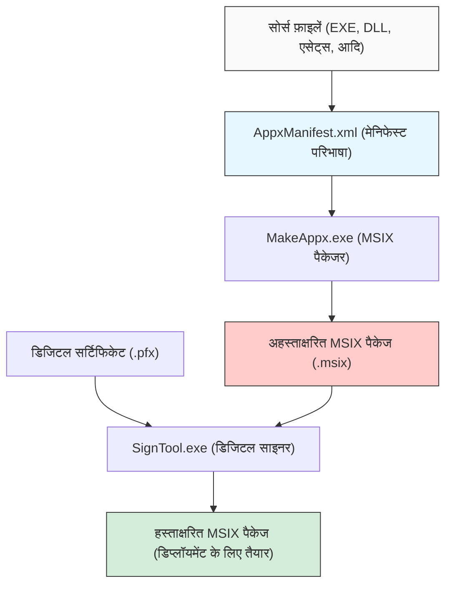
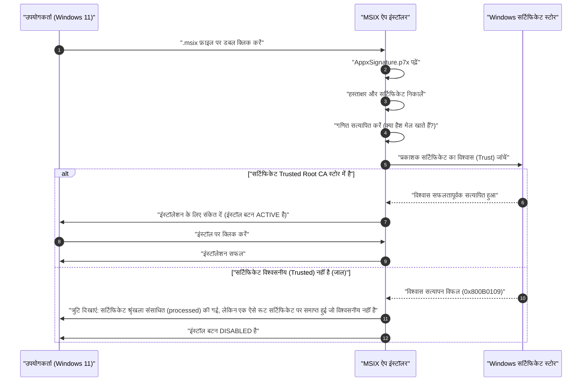

Windows 11 के युग में, "MSIX" एप्लिकेशन वितरण (डिस्ट्रीब्यूशन) फॉर्मेट के रूप में एक मानक विकल्प बनता जा रहा है। पारंपरिक MSI और EXE जैसे इंस्टॉलरों में कई चुनौतियां थीं, लेकिन MSIX से उन समस्याओं को हल करने वाली अगली पीढ़ी (next-generation) की पैकेजिंग तकनीक के रूप में उम्मीद की जाती है। हालांकि, जब डेवलपर्स MSIX पैकेज बनाते हैं और अपने संगठन (organization) या परीक्षण वातावरण (test environment) में साइडलोडिंग (Sideloading) करने का प्रयास करते हैं, तो वे अक्सर "सेल्फ-साइन्ड सर्टिफिकेट के जाल (Trap of Self-Signed Certificate)" में फंस जाते हैं।

इस लेख में, हम MSIX के तकनीकी विवरण से लेकर विजुअल स्टूडियो (Visual Studio) और कमांड लाइन टूल्स का उपयोग करके पैकेज बनाने की विधि, और कई डेवलपर्स द्वारा सामना किए जाने वाले सेल्फ-साइन्ड सर्टिफिकेट से संबंधित त्रुटियों (errors) के कारणों और समाधानों तक बहुत विस्तार से चर्चा करेंगे। हमारा उद्देश्य इसे Windows ऐप डेवलपर्स, इंफ्रास्ट्रक्चर एडमिनिस्ट्रेटर्स और पैकेजिंग के प्रभारी लोगों के लिए एक आवश्यक गाइड बनाना है।

## 1. MSIX क्या है? पारंपरिक MSI/EXE के साथ तुलना

MSIX, Microsoft द्वारा प्रदान किया गया Windows के लिए नवीनतम (latest) एप्लिकेशन पैकेज फॉर्मेट है। यह पारंपरिक रूप से मौजूद MSI (Microsoft Installer), .exe-आधारित कस्टम इंस्टॉलर, App-V (Application Virtualization) और Windows 8 के बाद पेश किए गए AppX (Universal Windows Platform ऐप पैकेज) की सभी बेहतरीन सुविधाओं और अवधारणाओं (concepts) को एकीकृत करता है, और इसे आधुनिक सुरक्षा और डिप्लॉयमेंट (deployment) आवश्यकताओं को पूरा करने के लिए विकसित किया गया है।

### पारंपरिक इंस्टॉलर (MSI/EXE) की चुनौतियां
कई वर्षों से Windows के मानक इंस्टॉलेशन फॉर्मेट के रूप में उपयोग किए जा रहे MSI और EXE में निम्नलिखित मूलभूत समस्याएं थीं:

1. **विन रॉट (Win Rot) की समस्या**: एप्लिकेशन को बार-बार इंस्टॉल और अनइंस्टॉल करने से, अनावश्यक कुंजियाँ (keys) रजिस्ट्री में रह जाती हैं और DLL सिस्टम फोल्डर (जैसे `C:\Windows\System32`) में छूट जाते हैं। इसके कारण, OS का प्रदर्शन धीरे-धीरे धीमा हो जाता है और अस्थिरता (instability) की समस्या उत्पन्न होती है।
2. **DLL हेल (DLL Hell)**: जब कई एप्लिकेशन एक ही नाम के (लेकिन अलग-अलग वर्जन वाले) DLL को साझा (shared) सिस्टम डायरेक्टरी में इंस्टॉल करने का प्रयास करते हैं, तो बाद में इंस्टॉल किया गया ऐप मौजूदा DLL को ओवरराइट कर देता है, जिससे पहले इंस्टॉल किया गया ऐप काम करना बंद कर देता है।
3. **कस्टम एक्शन के कारण अस्थिरता**: MSI पैकेज में, "कस्टम एक्शन" नामक किसी भी स्क्रिप्ट या कोड को इंस्टॉलेशन या अनइंस्टॉलेशन के दौरान सिस्टम विशेषाधिकारों (system privileges) के साथ निष्पादित (execute) किया जा सकता है। इससे इंस्टॉलर के बीच में क्रैश होने या सिस्टम में अप्रत्याशित (unexpected) कॉन्फ़िगरेशन परिवर्तन होने का जोखिम (risk) रहता था।

### MSIX के कंटेनराइजेशन आर्किटेक्चर द्वारा समाधान
MSIX एप्लिकेशनों को एक हल्के "कंटेनर" के भीतर चलाकर इन चुनौतियों का समाधान करता है। इस कंटेनरीकृत (containerized) दृष्टिकोण के निम्नलिखित बड़े फायदे हैं:

- **क्लीन अनइंस्टॉल**: MSIX द्वारा इंस्टॉल किए गए ऐप्स फ़ाइल सिस्टम और रजिस्ट्री में अपने बदलावों को वर्चुअलाइज़ (VFS: Virtual File System, VReg: Virtual Registry) करके करते हैं। इसलिए, अनइंस्टॉल करते समय, इस वर्चुअलाइज्ड कंटेनर को पूरी तरह से हटा दिया जाता है, जिससे सिस्टम में कोई कचरा (अवशेष) नहीं बचता। यह Win Rot को पूरी तरह से रोकता है।
- **आइसोलेशन और सुरक्षा (Isolation)**: प्रत्येक ऐप अपने स्वयं के वातावरण में चलता है और सीधे अन्य ऐप्स के DLL या संसाधनों (resources) को नष्ट नहीं करता है। यह हमें DLL हेल से मुक्त करता है।
- **नेटवर्क बैंडविड्थ ऑप्टिमाइजेशन**: MSIX का अपडेट मैकेनिज्म बहुत उत्कृष्ट है और यह ब्लॉक-स्तर के डिफरेंशियल अपडेट (Differential Update) का समर्थन करता है। बाइनरी डेटा के केवल उन छोटे ब्लॉकों को डाउनलोड किया जाता है जिन्हें बदला गया है, जिससे बड़े ऐप अपडेट में भी नेटवर्क पर लोड कम से कम हो जाता है।
- **विश्वसनीय इंस्टॉलेशन स्थिति**: पैकेज में एक मेनिफेस्ट फ़ाइल (`AppxManifest.xml`) शामिल होती है, और इंस्टॉलेशन ट्रांजेक्शन OS स्तर पर सख्ती से प्रबंधित किए जाते हैं। यदि यह विफल रहता है, तो इसे पूरी तरह से अपनी मूल स्थिति में वापस (rollback) कर दिया जाता है।

## 2. MSIX पैकेज बनाने का समग्र दृष्टिकोण (Overview) और टूलचेन

MSIX पैकेज बनाने के लिए मुख्य रूप से दो दृष्टिकोण (approaches) हैं। पहला Visual Studio के इंटीग्रेटेड डेवलपमेंट एनवायरनमेंट (IDE) का उपयोग करना है, और दूसरा Windows SDK में शामिल कमांड लाइन टूल्स (`MakeAppx.exe` और `SignTool.exe`) का पूर्ण उपयोग करना है।

निम्नलिखित मर्मेड (Mermaid) आरेख (diagram) सोर्स फ़ाइलों से अंतिम हस्ताक्षरित (signed) MSIX पैकेज उत्पन्न होने तक की प्रक्रिया को दर्शाता है।



जैसा कि इस प्रक्रिया से देखा जा सकता है, केवल फ़ाइलों को एकत्र करना और उन्हें पैक करना (पैकेजिंग) पर्याप्त नहीं है; "डिजिटल हस्ताक्षर (Digital Signature)" का चरण हमेशा आवश्यक होता है। सुरक्षा कारणों से Windows 11 बिना हस्ताक्षर वाले MSIX पैकेज को इंस्टॉल करने की अनुमति बिल्कुल नहीं देता है।

## 3. दृष्टिकोण A: Visual Studio का उपयोग करके MSIX बनाना

सबसे आसान और सबसे आम तरीका Visual Studio के "Windows एप्लिकेशन पैकेजिंग प्रोजेक्ट (Windows Application Packaging Project - WAP)" का उपयोग करना है। इस प्रोजेक्ट टेम्पलेट का उपयोग करके, आप WPF, Windows Forms, WinUI 3, या यहाँ तक कि लिगेसी (legacy) C++ Win32 ऐप्स को भी आसानी से MSIX में बदल सकते हैं।

### स्टेप-बाय-स्टेप गाइड
1. **WAP प्रोजेक्ट जोड़ें**: अपने मौजूदा Visual Studio सॉल्यूशन पर राइट-क्लिक करें, "नया प्रोजेक्ट जोड़ें (Add New Project)" चुनें और "Windows एप्लिकेशन पैकेजिंग प्रोजेक्ट" चुनें।
2. **लक्ष्य प्लेटफ़ॉर्म (Target Platform) का चयन**: वह न्यूनतम (minimum) और लक्ष्य (target) Windows 10/11 संस्करण (version) निर्दिष्ट करें जिसका आपका ऐप समर्थन करता है।
3. **एप्लिकेशन का संदर्भ (Reference)**: पैकेज प्रोजेक्ट के "एप्लिकेशन" नोड पर राइट-क्लिक करें, "संदर्भ जोड़ें (Add Reference)" चुनें और उस मुख्य प्रोजेक्ट (जैसे WPF प्रोजेक्ट) का चयन करें जिसे आप पैकेज करना चाहते हैं।
4. **मेनिफेस्ट सेटिंग**: `Package.appxmanifest` फ़ाइल पर डबल-क्लिक करें और विज़ुअल डिज़ाइनर खोलें। यहाँ, ऐप का डिस्प्ले नाम, विवरण, लोगो छवि, और सबसे महत्वपूर्ण "पैकेज का नाम (Identity Name)" और "प्रकाशक (Publisher)" सेट करें।
5. **पैकेज बनाना**: प्रोजेक्ट पर राइट-क्लिक करें, "प्रकाशित करें (Publish)" -> "ऐप पैकेज बनाएं (Create App Packages)" चुनें। "साइडलोडिंग के लिए (For Sideloading)" चुनें, आर्किटेक्चर (x64, ARM64 आदि) चुनें, और Visual Studio स्वचालित रूप से संकलन (compile) करेगा, `MakeAppx` के साथ पैकेजिंग करेगा, और सेल्फ-साइन्ड सर्टिफिकेट बनाने और हस्ताक्षर करने का पूरा काम संभाल लेगा।

यह बहुत ही सहज (seamless) है, लेकिन यदि आप यहाँ Visual Studio द्वारा स्वतः-निर्मित सेल्फ-साइन्ड सर्टिफिकेट (Test Certificate) का उपयोग करते हैं, तो आप उस "जाल" में फंस जाएंगे जिसकी चर्चा हम बाद में करेंगे।

## 4. दृष्टिकोण B: कमांड लाइन (MakeAppx.exe) का उपयोग करके बनाना

यदि आपको CI/CD पाइपलाइन में स्वचालन (automation) की आवश्यकता है, या आप मौजूदा इंस्टॉलर से फ़ाइलों को मैन्युअल रूप से फिर से पैकेज करना चाहते हैं, तो कमांड लाइन टूल्स की आवश्यकता होती है। यदि आपके पर्यावरण में Windows SDK इंस्टॉल है, तो आप डेवलपर कमांड प्रॉम्प्ट से निम्न टूल तक पहुंच सकते हैं।

### 1. मेनिफेस्ट फ़ाइल तैयार करना
पैकेज की रूट डायरेक्टरी में आवश्यक न्यूनतम जानकारी के साथ एक `AppxManifest.xml` बनाएं।

```xml
<?xml version="1.0" encoding="utf-8"?>
<Package xmlns="http://schemas.microsoft.com/appx/manifest/foundation/windows10"
         xmlns:uap="http://schemas.microsoft.com/appx/manifest/uap/windows10"
         xmlns:rescap="http://schemas.microsoft.com/appx/manifest/foundation/windows10/restrictedcapabilities">
  
  <Identity Name="MyCompany.AwesomeApp"
            Publisher="CN=MyCompany Self-Signed, O=MyCompany"
            Version="1.0.0.0"
            ProcessorArchitecture="x64" />
  
  <Properties>
    <DisplayName>Awesome App</DisplayName>
    <PublisherDisplayName>My Company</PublisherDisplayName>
    <Logo>Assets\StoreLogo.png</Logo>
  </Properties>
  
  <Resources>
    <Resource Language="en-us" />
    <Resource Language="ja-jp" />
  </Resources>
  
  <Dependencies>
    <TargetDeviceFamily Name="Windows.Desktop" MinVersion="10.0.17763.0" MaxVersionTested="10.0.22000.0" />
  </Dependencies>
  
  <Capabilities>
    <rescap:Capability Name="runFullTrust" />
  </Capabilities>
  
  <Applications>
    <Application Id="AwesomeApp" Executable="AwesomeApp.exe" EntryPoint="Windows.FullTrustApplication">
      <uap:VisualElements DisplayName="Awesome App"
                          Description="The best app ever."
                          BackgroundColor="transparent"
                          Square150x150Logo="Assets\Square150x150Logo.png"
                          Square44x44Logo="Assets\Square44x44Logo.png">
      </uap:VisualElements>
    </Application>
  </Applications>
</Package>
```
यहाँ महत्वपूर्ण बात यह है कि `<Identity Publisher="..." />` का मान उस सर्टिफिकेट के Subject से पूरी तरह मेल खाना चाहिए जिसका उपयोग आप बाद में हस्ताक्षर करने के लिए करेंगे।

### 2. MakeAppx के साथ पैकेजिंग
कमांड प्रॉम्प्ट में निम्नलिखित कमांड निष्पादित (execute) करें और डायरेक्टरी को MSIX फ़ाइल में पैक करें।

```cmd
MakeAppx.exe pack /d "C:\Path\To\AppFolder" /p "C:\Path\To\Output\AwesomeApp_1.0.0.0_x64.msix"
```
यह अहस्ताक्षरित (unsigned) MSIX फ़ाइल को पूरा करता है, लेकिन इस स्थिति में इसे Windows पर इंस्टॉल नहीं किया जा सकता है।

## 5. डिजिटल हस्ताक्षर और क्रिप्टोग्राफी की गणितीय पृष्ठभूमि (Mathematical Background)

MSIX पैकेज के लिए हस्ताक्षर क्यों आवश्यक है, इसे गहराई से समझने के लिए, डिजिटल हस्ताक्षर के पीछे के क्रिप्टोग्राफ़िक तंत्र (cryptographic mechanism) को समझना आवश्यक है। एक डिजिटल हस्ताक्षर गारंटी देता है कि पैकेज "निश्चित रूप से निर्दिष्ट प्रकाशक (publisher) द्वारा बनाया गया था (प्रमाणीकरण/Authentication)" और "बनाए जाने के बाद से किसी तीसरे पक्ष द्वारा इसमें कोई बदलाव नहीं किया गया है (अखंडता/Integrity)"।

MSIX हस्ताक्षर आमतौर पर RSA एन्क्रिप्शन और SHA-256 (Secure Hash Algorithm 256-bit) के संयोजन (combination) का उपयोग करता है।

### हैश फ़ंक्शन (Hash Function) लागू करना
सबसे पहले, मान लें कि संपूर्ण MSIX पैकेज (सामग्री) बाइनरी एक संदेश $M$ है। साइनिंग टूल (SignTool.exe) इस संदेश $M$ पर एक क्रिप्टोग्राफ़िक हैश फ़ंक्शन, SHA-256 लागू करता है, और एक निश्चित लंबाई (256-बिट) हैश मान $H(M)$ की गणना करता है।

### हस्ताक्षर उत्पन्न करना (प्रकाशक)
इसके बाद, प्रकाशक हैश मान को एन्क्रिप्ट करने और एक डिजिटल हस्ताक्षर $\sigma$ उत्पन्न करने के लिए अपनी "निजी कुंजी (Private Key)" $d$ का उपयोग करता है। RSA एल्गोरिथम के संदर्भ में, इसे मॉड्यूलर एक्सपोनेंटिएशन (modular exponentiation) के रूप में निम्नानुसार व्यक्त किया गया है:

$$ \sigma \equiv (H(M))^d \pmod n $$

जहाँ $n$ RSA मॉड्यूलस (दो बहुत बड़े अभाज्य संख्याओं का गुणनफल) है। इस हस्ताक्षर $\sigma$ और प्रकाशक की "सार्वजनिक कुंजी (Public Key)" $e$ वाले सर्टिफिकेट (X.509 प्रारूप) को MSIX पैकेज (`AppxSignature.p7x`) के हिस्से के रूप में एम्बेड किया जाता है।

### हस्ताक्षर सत्यापन (Windows OS)
जब कोई उपयोगकर्ता MSIX इंस्टॉल करने का प्रयास करता है, तो Windows OS पैकेज के भीतर सर्टिफिकेट से सार्वजनिक कुंजी $e$ निकालता है और हैश मान $H'(M)$ को पुनर्स्थापित करने के लिए निम्नलिखित गणना करता है:

$$ H'(M) \equiv \sigma^e \pmod n $$

साथ ही, OS स्वयं संपूर्ण डाउनलोड किए गए MSIX पैकेज $M$ के हैश मान $H(M)$ की पुनर्गणना (recalculate) करता है।
अंत में, यह सत्यापित करता है कि पुनर्स्थापित हैश मान और पुनर्गणना किया गया हैश मान बराबर हैं या नहीं ($H(M) = H'(M)$)। यदि यह समीकरण सही है, तो यह गणितीय रूप से सिद्ध हो जाता है कि "हस्ताक्षर के बाद फ़ाइल में एक बिट का भी बदलाव नहीं किया गया है"।

## 6. सबसे बड़ी बाधा: "सेल्फ-साइन्ड सर्टिफिकेट का जाल"

भले ही उपरोक्त गणितीय प्रमाण पूर्ण हो, केवल उसी से Windows 11 इंस्टॉलेशन की अनुमति नहीं देगा। ऐसा इसलिए है क्योंकि इसे "विश्वास की श्रृंखला (Chain of Trust)" को सत्यापित करने की आवश्यकता है: "क्या इस सार्वजनिक कुंजी (सर्टिफिकेट) का स्वामी वास्तव में वही सुरक्षित संगठन/व्यक्ति है जिसका वह दावा कर रहा है?"

यदि सर्टिफिकेट VeriSign या DigiCert जैसे आधिकारिक रूट सर्टिफिकेट अथॉरिटी (Root CA) द्वारा जारी किया गया है जिस पर OS पहले से भरोसा करता है, तो इसे बिना किसी समस्या के इंस्टॉल किया जा सकता है (Microsoft Store के माध्यम से वितरित ऐप्स भी इसी तरह Microsoft के रूट सर्टिफिकेट द्वारा विश्वसनीय होते हैं)।

हालाँकि, जब आप किसी आधिकारिक सर्टिफिकेट को खरीदने का खर्च वहन नहीं कर सकते, जैसे कि विकास के दौरान या केवल इन-हाउस (internal) टूल्स के लिए, तो डेवलपर्स स्वयं अपने सर्टिफिकेट जारी करते हैं। इसे "सेल्फ-साइन्ड सर्टिफिकेट (Self-Signed Certificate)" कहा जाता है।

निम्नलिखित अनुक्रम आरेख (sequence diagram) OS के व्यवहार को दर्शाता है जब वह सेल्फ-साइन्ड सर्टिफिकेट के साथ हस्ताक्षरित MSIX पैकेज को इंस्टॉल करने का प्रयास करता है।



यही वह "जाल" है। भले ही डेवलपर ने इसे स्वयं बनाया हो और इसे सही ढंग से हस्ताक्षरित किया हो, डिफ़ॉल्ट Windows 11 स्थिति उस सेल्फ-साइन्ड सर्टिफिकेट को नहीं जानती है (उस पर भरोसा नहीं करती है), इसलिए इंस्टॉलेशन त्रुटि कोड `0x800B0109` के साथ अवरुद्ध (blocked) हो जाता है। इंस्टॉलर का "इंस्टॉल" बटन ग्रे-आउट (greyed out) हो जाता है और उसे दबाया नहीं जा सकता।

कई डेवलपर्स इस त्रुटि का सामना करते हैं और इस भ्रम में पड़ जाते हैं कि "MSIX बग्स से भरा है" या "सेटिंग्स गलत होनी चाहिए", और वे बार-बार मेनिफेस्ट फ़ाइल को फिर से लिखते हैं। लेकिन समस्या पैकेज की संरचना (structure) के साथ नहीं है, बल्कि OS के सर्टिफिकेट स्टोर (Certificate Store) में इसके पंजीकरण (registration) की कमी के साथ है।

## 7. समाधान: PowerShell का उपयोग करके सेल्फ-साइन्ड सर्टिफिकेट बनाना और तैनात (Deploy) करना

इस समस्या को हल करने के लिए, आपको निम्नलिखित 2 चरणों को सुनिश्चित करना होगा:
1. एक वैध सेल्फ-साइन्ड सर्टिफिकेट बनाएं और निजी कुंजी युक्त (containing) PFX फ़ाइल निर्यात (export) करें।
2. बनाए गए सर्टिफिकेट के सार्वजनिक कुंजी भाग (CER फ़ाइल) को लक्षित **सभी PC के "Trusted Root Certification Authorities" (विश्वसनीय रूट प्रमाणन प्राधिकरण) स्टोर में इंस्टॉल करें**।

PowerShell का उपयोग करके इन्हें मज़बूती से और स्वचालित रूप से (automatically) संसाधित किया जा सकता है।

### चरण 1: सेल्फ-साइन्ड सर्टिफिकेट बनाना और निर्यात (Export) करना

सबसे पहले, प्रशासक विशेषाधिकारों (Administrator privileges) के साथ PowerShell प्रारंभ करें और सर्टिफिकेट बनाने के लिए निम्न स्क्रिप्ट निष्पादित करें। यहाँ, हम कोड साइनिंग (Code Signing) उद्देश्यों के लिए विशेष रूप से एक सर्टिफिकेट उत्पन्न करेंगे।

```powershell
# 1. पैरामीटर परिभाषित करें
$SubjectName = "CN=MyCompany Self-Signed, O=MyCompany"
$CertStoreLocation = "Cert:\CurrentUser\My"

# 2. सेल्फ-साइन्ड सर्टिफिकेट बनाना (कोड साइनिंग उपयोग: 1.3.6.1.5.5.7.3.3)
$Cert = New-SelfSignedCertificate -Type Custom `
    -Subject $SubjectName `
    -KeyUsage DigitalSignature `
    -FriendlyName "MyCompany MSIX Signing Cert" `
    -CertStoreLocation $CertStoreLocation `
    -TextExtension @("2.5.29.37={text}1.3.6.1.5.5.7.3.3", "2.5.29.19={text}")

Write-Host "सर्टिफिकेट जनरेट हो गया है। Thumbprint: $($Cert.Thumbprint)"

# 3. PFX (निजी कुंजी सहित) के निर्यात के लिए पासवर्ड बनाना
$Password = ConvertTo-SecureString -String "YourSecurePassword123!" -Force -AsPlainText

# 4. PFX फ़ाइल का निर्यात (SignTool के साथ हस्ताक्षर करने के लिए)
$PfxPath = "C:\Path\To\Output\MyCompanyCert.pfx"
Export-PfxCertificate -Cert $Cert -FilePath $PfxPath -Password $Password

# 5. CER (केवल सार्वजनिक कुंजी) का निर्यात (क्लाइंट PC पर इंस्टॉलेशन के लिए)
$CerPath = "C:\Path\To\Output\MyCompanyCert.cer"
Export-Certificate -Cert $Cert -FilePath $CerPath
```

MSIX पैकेज पर हस्ताक्षर करने के लिए यहां बनाई गई `$PfxPath` की फ़ाइल का उपयोग करें।

```cmd
SignTool.exe sign /fd SHA256 /a /f "C:\Path\To\Output\MyCompanyCert.pfx" /p "YourSecurePassword123!" "C:\Path\To\Output\AwesomeApp_1.0.0.0_x64.msix"
```

### चरण 2: क्लाइंट PC पर सर्टिफिकेट इंस्टॉल करना (जाल को तोड़ना)

यदि आप हस्ताक्षरित MSIX को दूसरे PC (या वर्चुअल मशीन) में ले जाते हैं और उस पर डबल-क्लिक करते हैं, तब भी यह इंस्टॉल नहीं होगा, जैसा कि पहले बताया गया है। इससे पहले (या उसी समय), आपको पहले से निर्यात की गई `$CerPath` फ़ाइल को "स्थानीय कंप्यूटर (Local Computer)" के "विश्वसनीय रूट प्रमाणन प्राधिकरण (Trusted Root Certification Authorities)" में इंस्टॉल करना होगा।

ऐसा करने के लिए, डिप्लॉयमेंट डेस्टिनेशन PC पर **प्रशासक विशेषाधिकारों (Administrator privileges)** के साथ PowerShell खोलें और निम्न कमांड चलाएँ:

```powershell
# CER फ़ाइल का पथ (Path)
$CerPath = "C:\Path\To\Output\MyCompanyCert.cer"

# स्थानीय मशीन (Local Machine) के "Trusted Root Certification Authorities" में आयात (Import) करें
Import-Certificate -FilePath $CerPath -CertStoreLocation "Cert:\LocalMachine\Root"

Write-Host "सर्टिफिकेट को विश्वसनीय रूट प्रमाणन प्राधिकरण में इंस्टॉल कर दिया गया है।"
```

> [!CAUTION]
> "स्थानीय कंप्यूटर (`LocalMachine`)" के रूट सर्टिफिकेट अथॉरिटी स्टोर में सर्टिफिकेट जोड़ने के लिए प्रशासक विशेषाधिकार अनिवार्य हैं। यदि आप इसे उपयोगकर्ता के व्यक्तिगत स्टोर (`CurrentUser`) में डालते हैं, तो ऐप इंस्टॉलर के अनुमति संदर्भ (permission context) के कारण इसे पहचाना नहीं जा सकता है, इसलिए सावधान रहें।

इस स्क्रिप्ट के सफल होने के तुरंत बाद, उस MSIX फ़ाइल पर फिर से डबल-क्लिक करने का प्रयास करें जो पहले एक त्रुटि दे रही थी। जादू की तरह, त्रुटि संदेश गायब हो जाना चाहिए और आपको एक चमकदार नीला, सक्रिय "इंस्टॉल" बटन दिखाई देना चाहिए। आपने "सेल्फ-साइन्ड सर्टिफिकेट के जाल" को पूरी तरह से पार कर लिया है।

## 8. एंटरप्राइज़ वातावरण में संचालन (Operations) और सर्वोत्तम प्रथाएँ (Best Practices)

डेवलपर के स्थानीय परीक्षण के लिए उपरोक्त चरण पर्याप्त हैं, लेकिन जब आप किसी कंपनी के भीतर दर्जनों या सैकड़ों PC पर साइडलोडिंग ऐप तैनात (deploy) करते हैं, तो प्रत्येक उपयोगकर्ता से सर्टिफिकेट इंस्टॉलेशन स्क्रिप्ट निष्पादित करवाना अव्यावहारिक है और इसके साथ सुरक्षा जोखिम (security risks) भी जुड़े हैं।

एंटरप्राइज़ वातावरण के लिए सर्वोत्तम प्रथाएँ निम्नलिखित हैं:

### 1. Active Directory Group Policy (GPO) का उपयोग करना
यदि आपकी कंपनी में Active Directory स्थापित है, तो आप "सार्वजनिक कुंजी नीतियां (Public Key Policies)" GPO का उपयोग करके डोमेन से जुड़े सभी PC के "विश्वसनीय रूट प्रमाणन प्राधिकरण" में सेल्फ-साइन्ड सर्टिफिकेट (CER फ़ाइल) स्वचालित रूप से वितरित (distribute) कर सकते हैं। यह कर्मचारियों को सर्टिफिकेट के बारे में सोचे बिना, साझा फ़ोल्डर (shared folder) पर MSIX फ़ाइल पर डबल-क्लिक करके ऐप इंस्टॉल करने की अनुमति देता है।

### 2. Microsoft Intune (MDM) के माध्यम से डिप्लॉयमेंट
आधुनिक वातावरण डिवाइस प्रबंधन (device management) के लिए Microsoft Intune का उपयोग करते हैं। Intune के साथ, आप "कॉन्फ़िगरेशन प्रोफ़ाइल (Configuration Profile)" सुविधा का उपयोग करके विश्वसनीय सर्टिफिकेट (.cer) को एंडपॉइंट्स पर पुश कर सकते हैं। उसके बाद, आप LOB (Line of Business) एप्लिकेशन के रूप में MSIX पैकेज को ही साइलेंट इंस्टॉलेशन के रूप में डिप्लॉय कर सकते हैं।

### 3. App Installer फ़ाइल (.appinstaller) के माध्यम से स्वचालित अपडेट
MSIX में ऐप अपडेट को स्वचालित करने के लिए एक शक्तिशाली सुविधा है। एक XML-आधारित `.appinstaller` फ़ाइल बनाकर और इसे वेब सर्वर या SMB साझा फ़ोल्डर में रखकर, आप ऐप लॉन्च होने पर पृष्ठभूमि (background) में नए MSIX संस्करण की जांच कर सकते हैं, और स्वचालित रूप से अपडेट लागू कर सकते हैं।

```xml
<?xml version="1.0" encoding="utf-8"?>
<AppInstaller
    Uri="https://internal.mycompany.com/apps/AwesomeApp.appinstaller"
    Version="1.0.0.0"
    xmlns="http://schemas.microsoft.com/appx/appinstaller/2018">
    <MainPackage
        Name="MyCompany.AwesomeApp"
        Publisher="CN=MyCompany Self-Signed, O=MyCompany"
        Version="1.0.0.0"
        ProcessorArchitecture="x64"
        Uri="https://internal.mycompany.com/apps/AwesomeApp_1.0.0.0_x64.msix" />
    <UpdateSettings>
        <OnLaunch HoursBetweenUpdateChecks="0" />
    </UpdateSettings>
</AppInstaller>
```
इस फ़ाइल को उपयोगकर्ताओं को वितरित और इंस्टॉल करने से, बाद में सर्वर पर MSIX फ़ाइल को बदलकर और `.appinstaller` संस्करण संख्या को अपडेट करके, सभी उपयोगकर्ताओं के ऐप्स स्वचालित रूप से अपडेट हो जाएंगे।

## 9. समस्या निवारण (Troubleshooting): सर्टिफिकेट से संबंधित सामान्य त्रुटियां

अंत में, यहाँ कुछ अन्य सामान्य त्रुटियाँ और उनके समाधान दिए गए हैं जो सर्टिफिकेट या हस्ताक्षर के संबंध में हो सकते हैं:

- **0x800B0101**: हस्ताक्षर के लिए उपयोग किए गए सर्टिफिकेट की अवधि समाप्त (expired) हो गई है। या तो एक नया सर्टिफिकेट फिर से जारी करें, या हस्ताक्षर करते समय टाइमस्टैम्प सर्वर (जैसे: `http://timestamp.digicert.com`) का उपयोग करें, यह साबित करने के लिए कि सर्टिफिकेट अपनी वैधता अवधि के भीतर हस्ताक्षरित किया गया था (यदि आप टाइमस्टैम्प संलग्न চুক্ত करते हैं, तो हस्ताक्षर को मान्य माना जाता है भले ही सर्टिफिकेट की अवधि समाप्त हो जाए)।
- **0x80080204**: `AppxManifest.xml` में निर्दिष्ट `Publisher` का मान और सर्टिफिकेट के `Subject` का मान पूरी तरह से मेल नहीं खाते हैं। कड़ाई से जांचें कि क्या वे स्ट्रिंग के रूप में बिल्कुल मेल खाते हैं, जिसमें अल्पविराम (comma) के बाद रिक्त स्थान (spaces) भी शामिल हैं।
- **इवेंट व्यूअर (Event Viewer) की जांच करना**: त्रुटि के अधिक विस्तृत कारण का पता लगाने के लिए, Windows इवेंट व्यूअर खोलना और "एप्लिकेशन और सेवा लॉग" -> "Microsoft" -> "Windows" -> "AppxPackagingOM" या "AppXDeployment-Server" के लॉग की जांच करना बहुत महत्वपूर्ण है।

## 10. निष्कर्ष (Conclusion)

Windows 11 के लिए MSIX पैकेजिंग एक शक्तिशाली तकनीक है जो एप्लिकेशन जीवनचक्र प्रबंधन (lifecycle management) में नाटकीय रूप से सुधार करती है। यह Win Rot और DLL हेल से छुटकारा दिलाती है और उपयोगकर्ताओं को एक साफ और सुरक्षित वातावरण प्रदान करती है।

दूसरी ओर, क्योंकि सुरक्षा मॉडल अधिक सख्त (strict) हो गया है, डिजिटल हस्ताक्षर और सर्टिफिकेट के "विश्वास की श्रृंखला (Chain of Trust)" की गहरी समझ आवश्यक है। "सेल्फ-साइन्ड सर्टिफिकेट का जाल" एक ऐसी बाधा है जिसका सामना लगभग हर वह डेवलपर करता है जो MSIX तकनीक के लिए नया है। इस लेख में बताए गए सर्टिफिकेट निर्माण, निर्यात और उपयुक्त स्टोर में आयात के तंत्र (mechanism) को समझकर, और स्क्रिप्ट और GPO के साथ इसे स्वचालित (automate) करके, आप MSIX की क्षमता (potential) को अधिकतम करने वाली सुचारू डिप्लॉयमेंट (smooth deployment) प्राप्त कर सकते हैं।

अगली पीढ़ी के स्वच्छ Windows एप्लिकेशन वितरण वातावरण के निर्माण के लिए कृपया इस ज्ञान का उपयोग करें।
