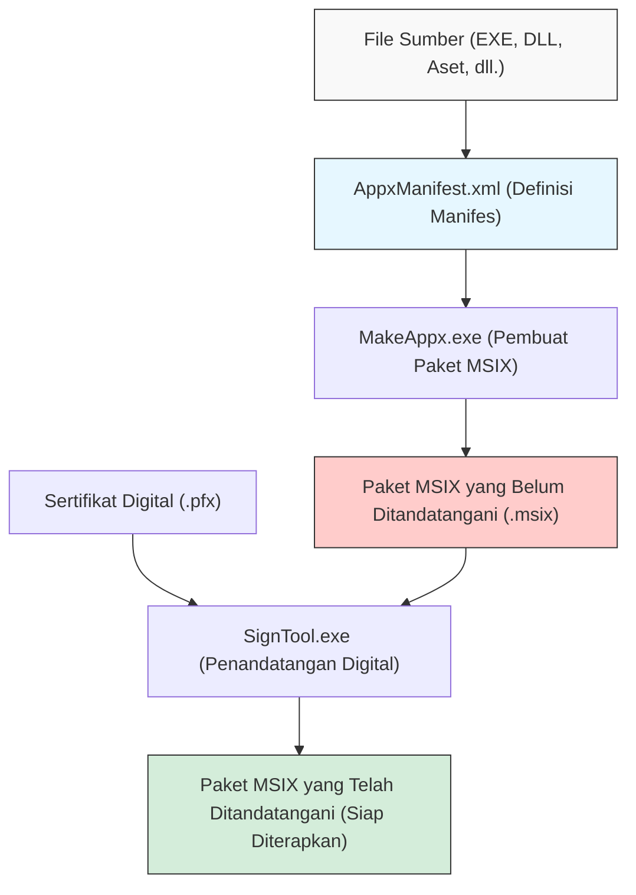
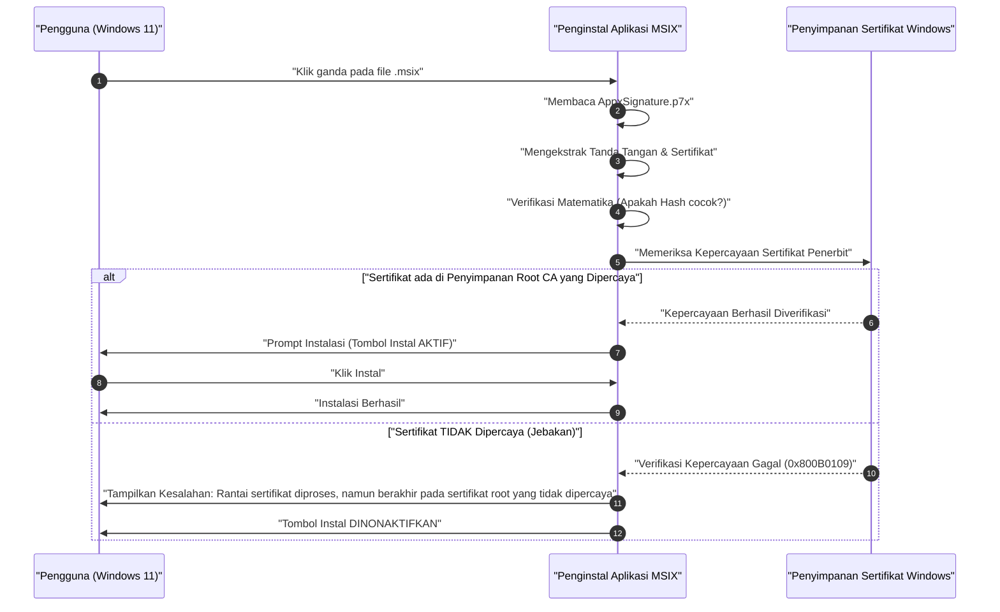

Di era Windows 11, "MSIX" semakin menjadi pilihan standar sebagai format distribusi aplikasi. Penginstal tradisional seperti MSI dan EXE memiliki banyak masalah, namun MSIX diharapkan dapat menjadi teknologi pemaketan generasi berikutnya yang menyelesaikan masalah tersebut. Namun, ketika pengembang benar-benar membuat paket MSIX dan mencoba melakukan sideload (Sideloading) di dalam organisasi atau di lingkungan pengujian, mereka sering kali jatuh ke dalam "jebakan sertifikat yang ditandatangani sendiri (self-signed certificate)".

Dalam artikel ini, kami akan menjelaskan dengan sangat detail mulai dari detail teknis MSIX, cara membuat paket menggunakan Visual Studio atau alat baris perintah, hingga penyebab dan solusi dari kesalahan terkait sertifikat yang ditandatangani sendiri yang dihadapi oleh banyak pengembang. Kami bertujuan untuk menjadikannya panduan wajib baca bagi pengembang aplikasi Windows, administrator infrastruktur, dan staf pemaketan.

## 1. Apa itu MSIX? Perbandingan dengan MSI/EXE Tradisional

MSIX adalah format paket aplikasi terbaru untuk Windows yang disediakan oleh Microsoft. Ini mengintegrasikan semua fitur dan konsep unggulan dari penginstal tradisional yang ada seperti MSI (Microsoft Installer), penginstal kustom berbasis .exe, App-V (Application Virtualization), dan AppX (paket aplikasi Universal Windows Platform) yang diperkenalkan sejak Windows 8, serta terus dikembangkan agar sesuai dengan kebutuhan keamanan dan penerapan modern.

### Masalah pada Penginstal Tradisional (MSI/EXE)

MSI dan EXE, yang telah digunakan sebagai format instalasi standar untuk Windows selama bertahun-tahun, memiliki masalah mendasar berikut.

1. **Fenomena Win Rot (Penurunan Performa Windows)**: Ini adalah masalah di mana kunci-kunci yang tidak perlu tertinggal di registri dan DLL tertinggal di folder sistem (seperti `C:\Windows\System32`) setelah menginstal dan mencopot pemasangan aplikasi berulang kali. Akibatnya, pengoperasian OS itu sendiri secara bertahap menjadi lambat dan tidak stabil.
2. **Neraka DLL (DLL Hell)**: Ketika beberapa aplikasi mencoba menginstal DLL dengan nama yang sama (tetapi versi yang berbeda) ke direktori sistem bersama, aplikasi yang diinstal belakangan akan menimpa DLL yang sudah ada, menyebabkan aplikasi yang diinstal lebih awal berhenti berfungsi dengan baik.
3. **Ketidakstabilan karena Tindakan Kustom (Custom Actions)**: Pada paket MSI, skrip atau kode apa pun yang disebut "tindakan kustom" dapat dijalankan dengan hak istimewa sistem selama instalasi dan pencopotan pemasangan. Ini membawa risiko bahwa penginstal dapat mogok di tengah jalan atau menyebabkan perubahan pengaturan sistem yang tidak terduga.

### Solusi melalui Arsitektur Kontainerisasi MSIX

MSIX menyelesaikan masalah ini dengan menjalankan aplikasi dalam "kontainer" yang ringan. Pendekatan kontainerisasi ini memiliki manfaat luar biasa berikut.

- **Pencopotan Pemasangan (Uninstall) yang Bersih**: Aplikasi yang diinstal dengan MSIX melakukan penulisan ke sistem file dan registri secara virtual (VFS: Virtual File System, VReg: Virtual Registry). Oleh karena itu, saat mencopot pemasangan, kontainer virtual ini dihapus secara keseluruhan, sehingga tidak meninggalkan sampah (sisa) apa pun di sistem. Ini sepenuhnya mencegah Win Rot.
- **Isolasi dan Keamanan**: Setiap aplikasi berjalan di dalam lingkungannya sendiri dan tidak akan secara langsung merusak DLL atau sumber daya aplikasi lain. Ini membebaskan Anda dari neraka DLL.
- **Optimalisasi Bandwidth Jaringan**: Mekanisme pembaruan MSIX sangat luar biasa dan mendukung pembaruan diferensial tingkat blok. Karena hanya mengunduh sedikit blok data biner yang diubah, beban jaringan dapat diminimalkan bahkan saat memperbarui aplikasi berkapasitas besar.
- **Status Instalasi yang Pasti**: Paket menyertakan file manifes (`AppxManifest.xml`), dan transaksi instalasi dikelola secara ketat pada tingkat OS. Jika gagal, ini akan sepenuhnya dibatalkan (rolled back) ke kondisi aslinya.

## 2. Gambaran Umum Pembuatan Paket MSIX dan Rantai Alat (Toolchain)

Ada dua pendekatan utama untuk membuat paket MSIX. Salah satunya adalah menggunakan Integrated Development Environment (IDE) Visual Studio, dan yang lainnya adalah memanfaatkan sepenuhnya alat baris perintah yang disertakan dalam Windows SDK (seperti `MakeAppx.exe` dan `SignTool.exe`).

Diagram Mermaid berikut menunjukkan proses dari file sumber hingga paket MSIX akhir yang telah ditandatangani dihasilkan.



Seperti yang dapat dilihat dari proses ini, sekadar mengumpulkan dan menggabungkan file (pemaketan) tidaklah cukup, langkah "tanda tangan digital" selalu diperlukan. Karena alasan keamanan, Windows 11 sama sekali tidak mengizinkan penginstalan paket MSIX yang tidak ditandatangani.

## 3. Pendekatan A: Membuat MSIX menggunakan Visual Studio

Cara termudah dan paling umum adalah dengan menggunakan "Windows Application Packaging Project - WAP" (Proyek Pemaketan Aplikasi Windows) di Visual Studio. Dengan menggunakan templat proyek ini, Anda dapat dengan mudah mengonversi aplikasi WPF, Windows Forms, WinUI 3, dan bahkan aplikasi Win32 lama dalam C++ ke MSIX.

### Panduan Langkah demi Langkah

1. **Menambahkan Proyek WAP**: Klik kanan pada solusi Visual Studio yang ada, lalu pilih "Proyek Pemaketan Aplikasi Windows" (Windows Application Packaging Project) dari "Tambahkan Proyek Baru".
2. **Memilih Platform Target**: Tentukan versi minimum dan versi target dari Windows 10/11 yang didukung oleh aplikasi Anda.
3. **Referensi Aplikasi**: Klik kanan pada node "Aplikasi" di proyek paket, lalu pilih proyek utama yang ingin Anda paketkan (misalnya proyek WPF) dari "Tambahkan Referensi".
4. **Pengaturan Manifes**: Klik dua kali pada file `Package.appxmanifest` untuk membuka desainer visual. Di sini, Anda menetapkan nama tampilan aplikasi, deskripsi, gambar logo, dan yang paling penting, "Nama Paket" (Identity Name) serta "Penerbit" (Publisher).
5. **Membuat Paket**: Klik kanan pada proyek, lalu pilih "Publikasikan" (Publish) -> "Buat Paket Aplikasi" (Create App Packages). Pilih opsi untuk "Sideloading", tentukan arsitektur (x64, ARM64, dll.), lalu Visual Studio akan secara otomatis menangani kompilasi, pemaketan menggunakan `MakeAppx`, serta pembuatan dan penandatanganan dengan sertifikat yang ditandatangani sendiri (self-signed).

Proses ini sangat mulus, namun jika Anda menggunakan sertifikat yang ditandatangani sendiri (Test Certificate) yang secara otomatis dihasilkan oleh Visual Studio di sini, Anda akan terjebak dalam "jebakan" yang akan dijelaskan nanti.

## 4. Pendekatan B: Membuat dengan Baris Perintah (MakeAppx.exe)

Untuk otomatisasi dalam alur CI/CD atau saat Anda mempaketkan ulang sekumpulan file secara manual dari penginstal yang sudah ada, diperlukan alat baris perintah. Jika Windows SDK telah diinstal pada lingkungan Anda, Anda dapat mengakses alat-alat berikut dari Prompt Perintah Pengembang (Developer Command Prompt).

### 1. Mempersiapkan File Manifes

Buatlah file `AppxManifest.xml` dengan informasi minimum yang diperlukan pada direktori root paket.

```xml
<?xml version="1.0" encoding="utf-8"?>
<Package xmlns="http://schemas.microsoft.com/appx/manifest/foundation/windows10"
         xmlns:uap="http://schemas.microsoft.com/appx/manifest/uap/windows10"
         xmlns:rescap="http://schemas.microsoft.com/appx/manifest/foundation/windows10/restrictedcapabilities">
  
  <Identity Name="MyCompany.AwesomeApp"
            Publisher="CN=MyCompany Self-Signed, O=MyCompany"
            Version="1.0.0.0"
            ProcessorArchitecture="x64" />
  
  <Properties>
    <DisplayName>Awesome App</DisplayName>
    <PublisherDisplayName>My Company</PublisherDisplayName>
    <Logo>Assets\StoreLogo.png</Logo>
  </Properties>
  
  <Resources>
    <Resource Language="en-us" />
    <Resource Language="ja-jp" />
  </Resources>
  
  <Dependencies>
    <TargetDeviceFamily Name="Windows.Desktop" MinVersion="10.0.17763.0" MaxVersionTested="10.0.22000.0" />
  </Dependencies>
  
  <Capabilities>
    <rescap:Capability Name="runFullTrust" />
  </Capabilities>
  
  <Applications>
    <Application Id="AwesomeApp" Executable="AwesomeApp.exe" EntryPoint="Windows.FullTrustApplication">
      <uap:VisualElements DisplayName="Awesome App"
                          Description="The best app ever."
                          BackgroundColor="transparent"
                          Square150x150Logo="Assets\Square150x150Logo.png"
                          Square44x44Logo="Assets\Square44x44Logo.png">
      </uap:VisualElements>
    </Application>
  </Applications>
</Package>
```

Hal penting di sini adalah nilai dari `<Identity Publisher="..." />` harus benar-benar cocok dengan Subjek sertifikat yang nantinya digunakan untuk penandatanganan.

### 2. Pemaketan Menggunakan MakeAppx

Jalankan perintah berikut di command prompt untuk mengemas direktori ke dalam file MSIX.

```cmd
MakeAppx.exe pack /d "C:\Path\To\AppFolder" /p "C:\Path\To\Output\AwesomeApp_1.0.0.0_x64.msix"
```

Dengan ini, file MSIX yang belum ditandatangani telah selesai, namun tidak dapat diinstal di Windows dalam keadaan ini.

## 5. Latar Belakang Matematis dari Tanda Tangan Digital dan Teknologi Kriptografi

Untuk memahami lebih dalam mengapa paket MSIX perlu ditandatangani, Anda perlu memahami mekanisme kriptografi di balik tanda tangan digital. Tanda tangan digital menjamin bahwa paket "secara meyakinkan dibuat oleh penerbit yang ditentukan (autentikasi)" dan "tidak dimodifikasi oleh pihak ketiga sejak dibuat hingga saat ini (integritas)".

Penandatanganan MSIX biasanya menggunakan kombinasi kriptografi RSA dan SHA-256 (Secure Hash Algorithm 256-bit).

### Penerapan Fungsi Hash

Pertama, biarkan seluruh biner (konten) paket MSIX menjadi pesan $M$. Alat penandatanganan (SignTool.exe) menerapkan SHA-256, sebuah fungsi hash kriptografi, ke pesan $M$ ini dan menghitung nilai hash $H(M)$ dengan panjang tetap (256-bit).

### Pembuatan Tanda Tangan (Penerbit)

Selanjutnya, penerbit mengenkripsi nilai hash tersebut menggunakan "Kunci Privat (Private Key)" $d$ miliknya dan menghasilkan tanda tangan digital $\sigma$. Dalam konteks algoritma RSA, hal ini direpresentasikan sebagai operasi eksponensiasi modular sebagai berikut:

$$ \sigma \equiv (H(M))^d \pmod n $$

Di sini, $n$ adalah modulus RSA (produk dari dua bilangan prima raksasa). Sertifikat (format X.509) yang berisi tanda tangan $\sigma$ ini beserta "Kunci Publik (Public Key)" $e$ milik penerbit tertanam sebagai bagian dari paket MSIX (`AppxSignature.p7x`).

### Verifikasi Tanda Tangan (Sistem Operasi Windows)

Saat pengguna mencoba menginstal MSIX, OS Windows akan mengekstrak kunci publik $e$ dari sertifikat di dalam paket dan melakukan perhitungan berikut untuk memulihkan nilai hash $H'(M)$:

$$ H'(M) \equiv \sigma^e \pmod n $$

Pada saat yang sama, OS menghitung ulang nilai hash $H(M)$ dari seluruh paket MSIX $M$ yang diunduhnya.
Pada akhirnya, akan diverifikasi apakah nilai hash yang dipulihkan sama dengan nilai hash yang dihitung ulang ($H(M) = H'(M)$). Jika persamaan ini berlaku, secara matematis telah terbukti bahwa "tidak ada satu bit pun dari file yang telah diubah sejak ditandatangani".

## 6. Kendala Terbesar: "Jebakan Sertifikat yang Ditandatangani Sendiri"

Bahkan jika bukti matematis di atas sempurna, Windows 11 tidak akan mengizinkan penginstalan hanya dengan bukti tersebut. Sebab, sistem perlu memverifikasi "Rantai Kepercayaan" (Chain of Trust) mengenai "apakah pemilik kunci publik (sertifikat) tersebut benar-benar organisasi atau individu yang aman seperti yang diakui?".

Jika sertifikat dikeluarkan oleh Otoritas Sertifikasi Akar (Root CA) publik yang telah dipercaya sebelumnya oleh OS, seperti VeriSign atau DigiCert, aplikasi dapat diinstal tanpa masalah (Aplikasi yang didistribusikan melalui Microsoft Store juga serupa, karena dipercaya oleh sertifikat akar Microsoft).

Namun, selama pengembangan atau untuk alat internal yang khusus di mana biaya pembelian sertifikat publik tidak dapat dikeluarkan, pengembang mengeluarkan sertifikat mereka sendiri. Inilah yang disebut "Sertifikat yang Ditandatangani Sendiri (Self-Signed Certificate)".

Diagram urutan (sequence diagram) di bawah ini menunjukkan perilaku OS saat mencoba menginstal paket MSIX yang ditandatangani dengan sertifikat yang ditandatangani sendiri.



Inilah yang disebut "jebakan". Terlepas dari kenyataan bahwa pengembang sendiri yang membuatnya dan menandatanganinya dengan benar, karena status bawaan Windows 11 tidak mengetahui (tidak mempercayai) sertifikat yang ditandatangani sendiri tersebut, instalasi diblokir dengan kode kesalahan `0x800B0109`. Tombol "Instal" di penginstal menjadi abu-abu dan tidak dapat diklik.

Banyak pengembang menghadapi kesalahan ini dan jatuh ke dalam labirin dengan menulis ulang file manifes berulang kali, berpikir bahwa "MSIX penuh dengan bug" atau "pastilah pengaturannya yang salah". Namun, masalahnya tidak terletak pada struktur paket, melainkan pada apakah sertifikat tersebut telah terdaftar di Penyimpanan Sertifikat (Certificate Store) OS atau belum.

## 7. Solusi: Pembuatan dan Pemasangan Sertifikat yang Ditandatangani Sendiri Menggunakan PowerShell

Untuk mengatasi masalah ini, dua langkah berikut harus dijalankan dengan benar:

1. Buat sertifikat yang ditandatangani sendiri yang valid dan ekspor file PFX yang berisi kunci privat.
2. **Instal bagian kunci publik (file CER) dari sertifikat yang dibuat ke penyimpanan "Otoritas Sertifikasi Akar Tepercaya (Trusted Root Certification Authorities)" pada semua PC target**.

Langkah-langkah ini dapat ditangani secara andal dan otomatis dengan menggunakan PowerShell.

### Langkah 1: Pembuatan dan Pengeksporan Sertifikat yang Ditandatangani Sendiri

Pertama-tama, mulai PowerShell dengan hak administrator, dan jalankan skrip berikut untuk membuat sertifikat. Di sini, kita akan menghasilkan sertifikat yang dikhususkan untuk tujuan Code Signing.

```powershell
# 1. Parameter Definisi
$SubjectName = "CN=MyCompany Self-Signed, O=MyCompany"
$CertStoreLocation = "Cert:\CurrentUser\My"

# 2. Pembuatan sertifikat yang ditandatangani sendiri (Tujuan Code Signing: 1.3.6.1.5.5.7.3.3)
$Cert = New-SelfSignedCertificate -Type Custom `
    -Subject $SubjectName `
    -KeyUsage DigitalSignature `
    -FriendlyName "MyCompany MSIX Signing Cert" `
    -CertStoreLocation $CertStoreLocation `
    -TextExtension @("2.5.29.37={text}1.3.6.1.5.5.7.3.3", "2.5.29.19={text}")

Write-Host "Sertifikat berhasil dibuat. Thumbprint: $($Cert.Thumbprint)"

# 3. Pembuatan kata sandi untuk ekspor PFX (termasuk kunci privat)
$Password = ConvertTo-SecureString -String "YourSecurePassword123!" -Force -AsPlainText

# 4. Mengekspor file PFX (Untuk penandatanganan di SignTool)
$PfxPath = "C:\Path\To\Output\MyCompanyCert.pfx"
Export-PfxCertificate -Cert $Cert -FilePath $PfxPath -Password $Password

# 5. Mengekspor file CER (hanya kunci publik) (Untuk instalasi pada PC klien)
$CerPath = "C:\Path\To\Output\MyCompanyCert.cer"
Export-Certificate -Cert $Cert -FilePath $CerPath
```

Gunakan file yang berada di jalur `$PfxPath` yang telah dibuat di sini untuk menandatangani paket MSIX.

```cmd
SignTool.exe sign /fd SHA256 /a /f "C:\Path\To\Output\MyCompanyCert.pfx" /p "YourSecurePassword123!" "C:\Path\To\Output\AwesomeApp_1.0.0.0_x64.msix"
```

### Langkah 2: Instalasi Sertifikat pada PC Klien (Melepaskan Jebakan)

Bahkan jika Anda membawa MSIX yang telah ditandatangani ke PC lain (atau lingkungan virtual) dan mengkliknya dua kali seperti biasa, itu tidak akan dapat diinstal, seperti yang dijelaskan sebelumnya. Sebelumnya (atau pada saat yang bersamaan), Anda perlu menginstal file dari `$CerPath` yang Anda ekspor sebelumnya ke "Otoritas Sertifikasi Akar Tepercaya" (Trusted Root Certification Authorities) di bawah "Komputer Lokal" (Local Machine).

Untuk melakukannya, buka PowerShell dengan **hak administrator** di PC tujuan penerapan, dan jalankan perintah berikut:

```powershell
# Jalur dari file CER
$CerPath = "C:\Path\To\Output\MyCompanyCert.cer"

# Mengimpor ke "Otoritas Sertifikasi Akar Tepercaya" pada komputer lokal
Import-Certificate -FilePath $CerPath -CertStoreLocation "Cert:\LocalMachine\Root"

Write-Host "Sertifikat berhasil diinstal di Otoritas Sertifikasi Akar Tepercaya."
```

> [!CAUTION]
> Menambahkan ke penyimpanan Otoritas Sertifikasi Akar "Komputer Lokal (`LocalMachine`)" memerlukan hak istimewa administrator. Perlu diperhatikan bahwa jika Anda memasukkannya ke penyimpanan individu pengguna (`CurrentUser`), sertifikat tersebut mungkin tidak dikenali karena alasan konteks izin dari Penginstal Aplikasi.

Segera setelah skrip ini berhasil dijalankan, coba klik dua kali lagi file MSIX yang sebelumnya mengalami kesalahan. Seolah-olah karena keajaiban, pesan kesalahan akan hilang, dan tombol "Instal" yang aktif dengan warna biru cerah akan muncul. Dengan ini, Anda telah berhasil melewati "jebakan sertifikat yang ditandatangani sendiri" sepenuhnya.

## 8. Operasional dan Praktik Terbaik dalam Lingkungan Perusahaan

Meskipun langkah-langkah di atas sudah cukup untuk pengujian lokal oleh pengembang, namun saat menerapkan aplikasi sideload ke puluhan atau ratusan PC dalam sebuah perusahaan, sangat tidak realistis bagi setiap pengguna untuk menjalankan skrip instalasi sertifikat secara individu, dan hal ini juga disertai dengan risiko keamanan.

Praktik terbaik di lingkungan perusahaan adalah sebagai berikut.

### 1. Pemanfaatan Group Policy Active Directory (GPO)

Jika Active Directory telah diterapkan di dalam perusahaan, Anda dapat menggunakan "Kebijakan Kunci Publik" (Public Key Policies) GPO untuk secara otomatis mendistribusikan sertifikat yang ditandatangani sendiri (file CER) ke "Otoritas Sertifikasi Akar Tepercaya" di semua PC yang bergabung dalam domain. Dengan melakukan ini, karyawan dapat menginstal hanya dengan mengklik dua kali file MSIX di folder bersama tanpa perlu memikirkan tentang sertifikat sama sekali.

### 2. Penerapan melalui Microsoft Intune (MDM)

Lingkungan modern menggunakan Microsoft Intune untuk manajemen perangkat. Di Intune, Anda dapat menggunakan fitur "Profil Konfigurasi" untuk mendorong dan mendistribusikan sertifikat tepercaya (.cer) ke titik akhir (endpoint). Setelah itu, dimungkinkan untuk menerapkan paket MSIX itu sendiri sebagai instalasi senyap sebagai aplikasi LOB (Line of Business).

### 3. Pembaruan Otomatis melalui File Penginstal Aplikasi (.appinstaller)

MSIX memiliki fitur canggih untuk mengotomatiskan pembaruan aplikasi. Dengan membuat file XML `.appinstaller` dan menempatkannya di server Web atau folder bersama SMB, sistem akan memeriksa apakah ada versi MSIX baru di latar belakang saat aplikasi diluncurkan, dan dapat menerapkan pembaruan secara otomatis.

```xml
<?xml version="1.0" encoding="utf-8"?>
<AppInstaller
    Uri="https://internal.mycompany.com/apps/AwesomeApp.appinstaller"
    Version="1.0.0.0"
    xmlns="http://schemas.microsoft.com/appx/appinstaller/2018">
    <MainPackage
        Name="MyCompany.AwesomeApp"
        Publisher="CN=MyCompany Self-Signed, O=MyCompany"
        Version="1.0.0.0"
        ProcessorArchitecture="x64"
        Uri="https://internal.mycompany.com/apps/AwesomeApp_1.0.0.0_x64.msix" />
    <UpdateSettings>
        <OnLaunch HoursBetweenUpdateChecks="0" />
    </UpdateSettings>
</AppInstaller>
```

Dengan mendistribusikan file ini kepada pengguna dan membiarkan mereka menginstalnya, Anda hanya perlu mengganti file MSIX di server dan memperbarui nomor versi `.appinstaller` dari waktu ke waktu, dan aplikasi untuk semua pengguna akan diperbarui secara otomatis.

## 9. Pemecahan Masalah: Kesalahan Umum Terkait Sertifikat

Terakhir, saya akan merangkum kesalahan umum lainnya dan solusi yang mungkin terjadi terkait dengan sertifikat dan tanda tangan.

- **0x800B0101**: Sertifikat yang digunakan untuk menandatangani telah kedaluwarsa. Tolong keluarkan sertifikat baru lagi, atau gunakan server stempel waktu (misalnya, `http://timestamp.digicert.com`) pada saat penandatanganan untuk dapat membuktikan bahwa penandatanganan dilakukan selama masa berlaku sertifikat (Jika Anda menambahkan stempel waktu, tanda tangan dianggap sah meskipun sertifikat itu sendiri kedaluwarsa).
- **0x80080204**: Nilai `Publisher` yang tertulis di `AppxManifest.xml` dan nilai `Subject` di sertifikat tidak sepenuhnya sama. Silakan periksa dengan saksama apakah string karakter cocok persis, seperti ada atau tidaknya spasi setelah koma.
- **Pemeriksaan Event Viewer (Peraga Peristiwa)**: Untuk menyelidiki penyebab kesalahan yang lebih detail, sangat penting untuk membuka Windows Event Viewer dan memeriksa log di bawah "Log Aplikasi dan Layanan" (Applications and Services Logs) -> "Microsoft" -> "Windows" -> "AppxPackagingOM" atau "AppXDeployment-Server".

## 10. Kesimpulan

Pemaketan MSIX untuk Windows 11 adalah teknologi yang ampuh yang secara drastis meningkatkan manajemen siklus hidup aplikasi. Ini membebaskan dari Win Rot dan Neraka DLL, dan dapat menyediakan lingkungan yang bersih dan aman bagi pengguna.

Di sisi lain, karena model keamanannya diperketat, pemahaman yang mendalam tentang tanda tangan digital dan "Rantai Kepercayaan" sertifikat sangatlah penting. "Jebakan Sertifikat yang Ditandatangani Sendiri" hampir bisa dikatakan sebagai rintangan awal yang dihadapi oleh pengembang yang baru pertama kali menyentuh teknologi MSIX. Dengan memahami mekanisme pembuatan, pengeksporan, dan pengimporan sertifikat ke dalam penyimpanan yang sesuai yang dijelaskan dalam artikel ini, serta mengotomatisasinya menggunakan skrip dan GPO, Anda akan dapat mewujudkan penerapan yang lancar yang memaksimalkan potensi MSIX.

Dengan segala cara, silakan gunakan pengetahuan ini untuk membangun lingkungan distribusi aplikasi Windows masa depan yang bersih.
