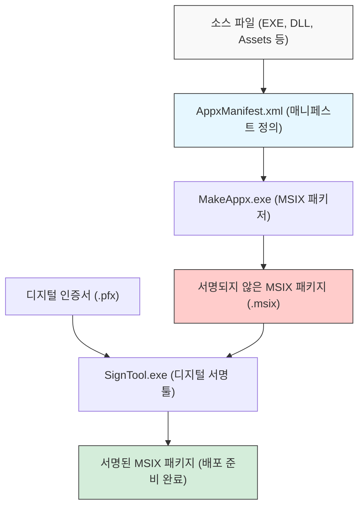
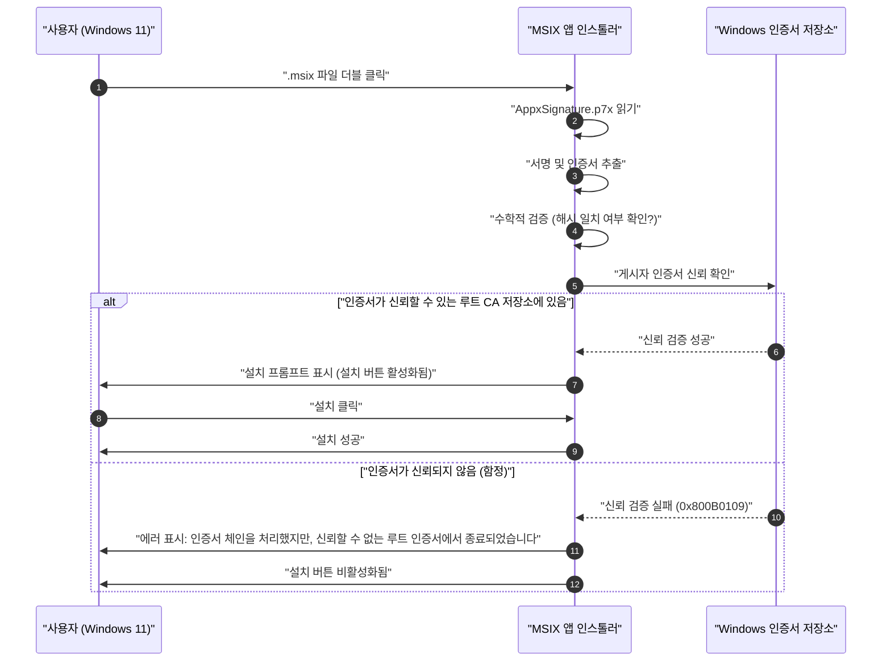

Windows 11 시대에서 애플리케이션 배포 포맷으로 "MSIX"가 표준적인 선택지가 되어가고 있습니다. 기존의 MSI나 EXE 같은 인스톨러에는 많은 과제가 있었지만, MSIX는 그것들을 해결할 차세대 패키징 기술로서 기대받고 있습니다. 그러나 개발자가 막상 MSIX 패키지를 생성하여 조직 내나 테스트 환경에서 사이드로딩(Sideloading)을 하려고 하면 "자체 서명 인증서의 함정"에 빠지는 경우가 적지 않습니다.

본 문서에서는 MSIX의 기술적인 상세 내용부터 Visual Studio나 커맨드 라인 툴을 사용한 패키지 생성 방법, 그리고 많은 개발자가 직면하는 자체 서명 인증서 관련 에러의 원인과 해결책까지 아주 상세하게 해설합니다. Windows 앱 개발자, 인프라 관리자, 그리고 패키징 담당자에게 필독 가이드가 되기를 바랍니다.

## 1. MSIX란 무엇인가? 기존 MSI/EXE와의 비교

MSIX는 Microsoft가 제공하는 Windows용 최신 애플리케이션 패키지 형식입니다. 기존부터 존재했던 MSI(Microsoft Installer), .exe 기반의 커스텀 인스톨러, App-V(Application Virtualization), 그리고 Windows 8 이후 도입된 AppX(Universal Windows Platform 앱 패키지)의 모든 뛰어난 기능과 개념을 통합하고 나아가 현대의 보안과 배포 요건에 맞춰 진화시킨 것입니다.

### 기존 인스톨러(MSI/EXE)의 과제
오랜 기간 Windows의 표준적인 설치 형식으로 사용되어 온 MSI나 EXE에는 다음과 같은 근본적인 문제가 있었습니다.

1. **Win Rot(Windows 노후화) 현상**: 애플리케이션의 설치와 제거를 반복하는 과정에서 레지스트리에 불필요한 키가 남고 시스템 폴더(`C:\Windows\System32` 등)에 DLL이 남겨지는 문제입니다. 이로 인해 OS 자체의 동작이 점차 느려지고 불안정해지는 현상이 발생합니다.
2. **DLL 지옥(DLL Hell)**: 여러 애플리케이션이 동일한 이름의 DLL(단, 버전은 다름)을 공유 시스템 디렉터리에 설치하려고 할 경우, 나중에 설치된 앱이 기존의 DLL을 덮어써서 먼저 설치되어 있던 앱이 정상적으로 동작하지 않게 되는 문제입니다.
3. **커스텀 액션에 의한 불안정성**: MSI 패키지에서는 "커스텀 액션"이라고 불리는 임의의 스크립트나 코드를 설치 중 및 제거 중에 시스템 권한으로 실행할 수 있습니다. 이로 인해 인스톨러가 도중에 크래시(Crash)되거나 시스템의 예기치 않은 설정 변경을 일으킬 위험이 있었습니다.

### MSIX의 컨테이너화 아키텍처를 통한 해결책
MSIX는 애플리케이션을 경량화된 "컨테이너" 내에서 동작시킴으로써 이러한 과제들을 해결합니다. 이 컨테이너화 접근 방식에는 다음과 같은 절대적인 장점이 있습니다.

- **깔끔한 제거**: MSIX로 설치된 앱은 파일 시스템이나 레지스트리에 대한 쓰기를 가상화(VFS: Virtual File System, VReg: Virtual Registry)하여 진행합니다. 따라서 제거 시에는 이 가상화된 컨테이너 자체가 삭제되므로 시스템에 어떠한 쓰레기(잔해)도 남기지 않습니다. Win Rot을 완벽하게 방지합니다.
- **분리와 보안(Isolation)**: 각 앱은 자신만의 환경 내에서 동작하며, 다른 앱의 DLL이나 리소스를 직접 파괴하지 않습니다. 이로 인해 DLL 지옥에서 해방됩니다.
- **네트워크 대역폭 최적화**: MSIX의 업데이트 메커니즘은 매우 우수하여 블록 레벨의 차분 업데이트(Differential Update)를 지원합니다. 바이너리 데이터 중 변경된 극히 일부의 블록만을 다운로드하므로, 대용량 앱의 업데이트에서도 네트워크에 미치는 부하를 최소화할 수 있습니다.
- **확실한 설치 상태**: 패키지에는 매니페스트 파일(`AppxManifest.xml`)이 포함되어 있으며, 설치 트랜잭션이 OS 레벨에서 엄격하게 관리됩니다. 실패할 경우에는 원래 상태로 완전히 롤백됩니다.

## 2. MSIX 패키지 생성의 전체 그림과 툴체인

MSIX 패키지를 생성하기 위해서는 크게 두 가지 접근 방식이 있습니다. 하나는 Visual Studio의 통합 개발 환경(IDE)을 이용하는 방법이고, 다른 하나는 Windows SDK에 동봉된 커맨드 라인 툴(`MakeAppx.exe`나 `SignTool.exe`)을 활용하는 방법입니다.

다음의 Mermaid 다이어그램은 소스 파일에서 최종적으로 서명된 MSIX 패키지가 생성되기까지의 프로세스를 보여줍니다.



이 프로세스에서 알 수 있듯이, 단순히 파일들을 모아 하나로 묶는(패키징) 것만으로는 충분하지 않으며, 반드시 "디지털 서명" 단계가 필요합니다. Windows 11은 서명이 없는 MSIX 패키지의 설치를 보안상의 이유로 일절 허용하지 않습니다.

## 3. 접근 방식 A: Visual Studio를 이용한 MSIX 생성

가장 쉽고 일반적인 방법은 Visual Studio의 "Windows 애플리케이션 패키지 프로젝트 (Windows Application Packaging Project - WAP)"를 사용하는 것입니다. 이 프로젝트 템플릿을 사용하면 WPF, Windows Forms, WinUI 3, 심지어 C++의 레거시 Win32 앱이라 하더라도 쉽게 MSIX화 할 수 있습니다.

### 단계별 가이드
1. **WAP 프로젝트 추가**: 기존 Visual Studio 솔루션을 마우스 오른쪽 버튼으로 클릭하고, "새 프로젝트 추가"에서 "Windows 애플리케이션 패키지 프로젝트"를 선택합니다.
2. **대상 플랫폼 선택**: 앱이 지원할 Windows 10/11의 최소 버전과 대상 버전을 지정합니다.
3. **애플리케이션 참조**: 패키지 프로젝트의 "애플리케이션" 노드를 마우스 오른쪽 버튼으로 클릭하고 "참조 추가"를 통해 패키징하고 싶은 메인 프로젝트(예: WPF 프로젝트)를 선택합니다.
4. **매니페스트 설정**: `Package.appxmanifest` 파일을 더블 클릭하여 비주얼 디자이너를 엽니다. 여기서 앱의 표시 이름, 설명, 로고 이미지, 그리고 가장 중요한 "패키지 이름(Identity Name)"과 "게시자(Publisher)"를 설정합니다.
5. **패키지 생성**: 프로젝트를 마우스 오른쪽 버튼으로 클릭하고, "게시" -> "앱 패키지 만들기"를 선택합니다. "사이드로딩용"을 선택하고 아키텍처(x64, ARM64 등)를 선택하면, Visual Studio가 자동으로 컴파일, `MakeAppx`를 통한 패키징, 그리고 자체 서명 인증서 생성과 서명까지 일괄적으로 처리해 줍니다.

매우 매끄럽지만, 여기서 Visual Studio가 자동 생성한 자체 서명 인증서(Test Certificate)를 사용하면 나중에 설명할 "함정"에 빠지게 됩니다.

## 4. 접근 방식 B: 커맨드 라인(MakeAppx.exe)을 이용한 생성

CI/CD 파이프라인에서의 자동화나, 기존 인스톨러에서 수동으로 파일들을 재패키징하는 경우 등에는 커맨드 라인 툴이 필요합니다. Windows SDK가 설치된 환경이라면 개발자 명령 프롬프트에서 다음의 툴에 접근할 수 있습니다.

### 1. 매니페스트 파일 준비
패키지의 루트 디렉터리에 최소한의 정보를 기술한 `AppxManifest.xml`을 생성합니다.

```xml
<?xml version="1.0" encoding="utf-8"?>
<Package xmlns="http://schemas.microsoft.com/appx/manifest/foundation/windows10"
         xmlns:uap="http://schemas.microsoft.com/appx/manifest/uap/windows10"
         xmlns:rescap="http://schemas.microsoft.com/appx/manifest/foundation/windows10/restrictedcapabilities">
  
  <Identity Name="MyCompany.AwesomeApp"
            Publisher="CN=MyCompany Self-Signed, O=MyCompany"
            Version="1.0.0.0"
            ProcessorArchitecture="x64" />
  
  <Properties>
    <DisplayName>Awesome App</DisplayName>
    <PublisherDisplayName>My Company</PublisherDisplayName>
    <Logo>Assets\StoreLogo.png</Logo>
  </Properties>
  
  <Resources>
    <Resource Language="en-us" />
    <Resource Language="ja-jp" />
  </Resources>
  
  <Dependencies>
    <TargetDeviceFamily Name="Windows.Desktop" MinVersion="10.0.17763.0" MaxVersionTested="10.0.22000.0" />
  </Dependencies>
  
  <Capabilities>
    <rescap:Capability Name="runFullTrust" />
  </Capabilities>
  
  <Applications>
    <Application Id="AwesomeApp" Executable="AwesomeApp.exe" EntryPoint="Windows.FullTrustApplication">
      <uap:VisualElements DisplayName="Awesome App"
                          Description="The best app ever."
                          BackgroundColor="transparent"
                          Square150x150Logo="Assets\Square150x150Logo.png"
                          Square44x44Logo="Assets\Square44x44Logo.png">
      </uap:VisualElements>
    </Application>
  </Applications>
</Package>
```
여기서 중요한 것은 `<Identity Publisher="..." />` 의 값이 나중에 서명에 사용할 인증서의 Subject와 완벽하게 일치해야 한다는 점입니다.

### 2. MakeAppx를 통한 패키징
명령 프롬프트에서 다음 명령어를 실행하여 디렉터리를 MSIX 파일로 압축합니다.

```cmd
MakeAppx.exe pack /d "C:\Path\To\AppFolder" /p "C:\Path\To\Output\AwesomeApp_1.0.0.0_x64.msix"
```
이것으로 서명되지 않은 MSIX 파일이 완성되지만, 이 상태에서는 Windows에 설치할 수 없습니다.

## 5. 디지털 서명과 암호 기술의 수학적 배경

MSIX 패키지에 왜 서명이 필요한지를 깊이 이해하기 위해서는 디지털 서명 이면에 있는 암호학적 메커니즘을 이해해야 합니다. 디지털 서명은 패키지가 "확실하게 지정된 게시자에 의해 생성되었다는 것(인증)"과 "생성 후부터 현재까지 제3자에 의해 변조되지 않았다는 것(무결성)"을 보증합니다.

MSIX 서명에는 일반적으로 RSA 암호와 SHA-256(Secure Hash Algorithm 256-bit)이 결합되어 사용됩니다.

### 해시 함수의 적용
먼저 MSIX 패키지의 바이너리 전체(내용물)를 메시지 $M$이라고 합시다. 서명 툴(SignTool.exe)은 이 메시지 $M$에 대해 암호학적 해시 함수인 SHA-256을 적용하여 고정 길이(256비트)의 해시값 $H(M)$을 계산합니다.

### 서명 생성(게시자)
다음으로 게시자는 자신의 "개인 키(Private Key)" $d$를 사용하여 해시값을 암호화하고 디지털 서명 $\sigma$를 생성합니다. RSA 알고리즘의 맥락에서 이는 모듈러 거듭제곱 연산으로서 다음과 같이 표현됩니다.

$$ \sigma \equiv (H(M))^d \pmod n $$

여기서 $n$은 RSA 모듈러스(두 개의 거대한 소수의 곱)입니다. 이 서명 $\sigma$와 게시자의 "공개 키(Public Key)" $e$를 포함하는 인증서(X.509 형식)가 MSIX 패키지의 일부(`AppxSignature.p7x`)로 임베드됩니다.

### 서명 검증(Windows OS)
사용자가 MSIX를 설치하려고 할 때, Windows OS는 패키지 내의 인증서에서 공개 키 $e$를 추출하고 다음의 계산을 수행하여 해시값 $H'(M)$을 복원합니다.

$$ H'(M) \equiv \sigma^e \pmod n $$

동시에 OS는 스스로 다운로드한 MSIX 패키지 $M$ 전체의 해시값 $H(M)$을 다시 계산합니다.
최종적으로 복원한 해시값과 다시 계산한 해시값이 동일한지($H(M) = H'(M)$)를 검증합니다. 이 등식이 성립하면 "서명 이후 파일이 1비트도 변조되지 않았다"는 것이 수학적으로 증명된 셈입니다.

## 6. 최대의 장벽: "자체 서명 인증서의 함정"

위의 수학적 증명이 완벽하더라도 Windows 11은 그것만으로 설치를 허용하지 않습니다. 왜냐하면 "해당 공개 키(인증서)의 소유자가 정말로 표방하는 바와 같은 안전한 조직이나 인물인가?"라는 '신뢰망(Chain of Trust)'을 검증해야 하기 때문입니다.

인증서가 VeriSign이나 DigiCert와 같이 OS에 미리 신뢰되어 있는 공인된 루트 인증 기관(Root CA)으로부터 발급된 것이라면 문제없이 설치할 수 있습니다(Microsoft Store를 통해 배포되는 앱도 마찬가지로 Microsoft의 루트 인증서로 신뢰됩니다).

하지만 개발 중이나 사내 전용 툴 등, 공인 인증서를 구매할 비용을 들이기 어려운 경우, 개발자는 스스로 인증서를 발급합니다. 이것이 "자체 서명 인증서(Self-Signed Certificate)"입니다.

다음의 시퀀스 다이어그램은 자체 서명 인증서로 서명된 MSIX 패키지를 설치하려고 할 때 OS의 동작을 보여줍니다.



바로 이것이 "함정"입니다. 개발자 자신이 작성하고 올바르게 서명했음에도 불구하고, Windows 11의 기본 상태에서는 해당 자체 서명 인증서를 알지 못하기(신뢰하지 않기) 때문에 에러 코드 `0x800B0109`와 함께 설치가 차단되어 버립니다. 인스톨러의 "설치" 버튼은 회색으로 비활성화되어 누를 수 없습니다.

많은 개발자가 이 에러에 직면하고 "MSIX는 버그투성이다", "설정이 잘못된 것이 틀림없다"라며 매니페스트 파일 등을 몇 번이나 다시 쓰는 미궁에 빠지지만, 문제는 패키지의 구조가 아니라 OS의 인증서 저장소(Certificate Store)에 등록되어 있는지 여부에 있습니다.

## 7. 해결책: PowerShell을 이용한 자체 서명 인증서 생성 및 배포

이 문제를 해결하려면 다음의 두 단계를 확실하게 실행해야 합니다.
1. 유효한 자체 서명 인증서를 생성하고, 개인 키를 포함한 PFX 파일을 내보낸다.
2. 생성한 인증서의 공개 키 부분(CER 파일)을 대상이 되는 **모든 PC의 "신뢰할 수 있는 루트 인증 기관(Trusted 일 루트 인증 기관(Trusted Root Certification Authorities)" 저장소에 설치한다**.

이러한 작업들은 PowerShell을 사용함으로써 확실하고 자동으로 처리할 수 있습니다.

### 단계 1: 자체 서명 인증서 생성 및 내보내기

먼저 관리자 권한으로 PowerShell을 실행하고, 다음 스크립트를 실행하여 인증서를 생성합니다. 여기서는 코드 서명(Code Signing) 용도에 특화된 인증서를 생성합니다.

```powershell
# 1. 파라미터 정의
$SubjectName = "CN=MyCompany Self-Signed, O=MyCompany"
$CertStoreLocation = "Cert:\CurrentUser\My"

# 2. 자체 서명 인증서 생성 (코드 서명 용도: 1.3.6.1.5.5.7.3.3)
$Cert = New-SelfSignedCertificate -Type Custom `
    -Subject $SubjectName `
    -KeyUsage DigitalSignature `
    -FriendlyName "MyCompany MSIX Signing Cert" `
    -CertStoreLocation $CertStoreLocation `
    -TextExtension @("2.5.29.37={text}1.3.6.1.5.5.7.3.3", "2.5.29.19={text}")

Write-Host "인증서가 생성되었습니다. Thumbprint: $($Cert.Thumbprint)"

# 3. PFX(개인 키 포함) 내보내기용 암호 생성
$Password = ConvertTo-SecureString -String "YourSecurePassword123!" -Force -AsPlainText

# 4. PFX 파일 내보내기 (SignTool에서의 서명용)
$PfxPath = "C:\Path\To\Output\MyCompanyCert.pfx"
Export-PfxCertificate -Cert $Cert -FilePath $PfxPath -Password $Password

# 5. CER(공개 키만) 내보내기 (클라이언트 PC 설치용)
$CerPath = "C:\Path\To\Output\MyCompanyCert.cer"
Export-Certificate -Cert $Cert -FilePath $CerPath
```

여기서 생성한 `$PfxPath`의 파일을 사용하여 MSIX 패키지에 서명을 진행합니다.

```cmd
SignTool.exe sign /fd SHA256 /a /f "C:\Path\To\Output\MyCompanyCert.pfx" /p "YourSecurePassword123!" "C:\Path\To\Output\AwesomeApp_1.0.0.0_x64.msix"
```

### 단계 2: 클라이언트 PC에 인증서 설치(함정 해제)

서명된 MSIX를 다른 PC(또는 가상 환경)로 가져가서 그대로 더블 클릭해도 앞서 설명한 바와 같이 설치할 수 없습니다. 사전에(또는 동시에) 방금 내보낸 `$CerPath` 파일을 "로컬 컴퓨터"의 "신뢰할 수 있는 루트 인증 기관"에 설치해야 합니다.

이를 수행하려면 배포 대상 PC에서 **관리자 권한**의 PowerShell을 열고, 다음 명령어를 실행합니다.

```powershell
# CER 파일의 경로
$CerPath = "C:\Path\To\Output\MyCompanyCert.cer"

# 로컬 머신의 "신뢰할 수 있는 루트 인증 기관"으로 가져오기
Import-Certificate -FilePath $CerPath -CertStoreLocation "Cert:\LocalMachine\Root"

Write-Host "인증서를 신뢰할 수 있는 루트 인증 기관에 설치했습니다."
```

> [!CAUTION]
> "로컬 컴퓨터(`LocalMachine`)"의 루트 인증 기관 저장소에 추가하는 작업은 관리자 권한이 필수입니다. 사용자 개인의 저장소(`CurrentUser`)에 넣어도 App Installer의 권한 컨텍스트 때문에 인식되지 않는 경우가 있으므로 주의가 필요합니다.

이 스크립트가 성공한 직후, 방금 전 에러가 났던 MSIX 파일을 다시 더블 클릭해 보십시오. 마치 마법처럼 에러 메시지가 사라지고 선명한 파란색의 활성화된 "설치" 버튼이 표시될 것입니다. 이로써 "자체 서명 인증서의 함정"을 완전히 돌파했습니다.

## 8. 엔터프라이즈 환경에서의 운영 및 모범 사례

개발자의 로컬 테스트라면 위 절차로 충분하지만, 사내의 수십 대, 수백 대의 PC에 사이드로딩 앱을 배포할 경우, 사용자 한 명 한 명에게 인증서 설치 스크립트를 실행하게 하는 것은 비현실적이며 보안 위험도 따릅니다.

엔터프라이즈 환경에서의 모범 사례는 다음과 같습니다.

### 1. Active Directory 그룹 정책(GPO) 활용
사내에 Active Directory가 도입되어 있는 경우, GPO의 "공개 키 정책"을 사용하여 자체 서명 인증서(CER 파일)를 도메인에 가입된 모든 PC의 "신뢰할 수 있는 루트 인증 기관"에 자동으로 배포할 수 있습니다. 이를 통해 직원은 인증서에 대해 전혀 신경 쓸 필요 없이 공유 폴더의 MSIX 파일을 더블 클릭하는 것만으로 설치가 가능해집니다.

### 2. Microsoft Intune(MDM)을 통한 배포
모던한 환경에서는 Microsoft Intune을 사용하여 디바이스 관리를 수행합니다. Intune에서는 "구성 프로필" 기능을 사용하여 신뢰할 수 있는 인증서(.cer)를 엔드포인트에 푸시 배포할 수 있습니다. 그 후 LOB(Line of Business) 애플리케이션으로서 MSIX 패키지 자체를 백그라운드 설치(Silent Install)로 배포하는 것이 가능합니다.

### 3. App Installer 파일(.appinstaller)을 통한 자동 업데이트
MSIX에는 앱 업데이트를 자동화하는 강력한 기능이 갖추어져 있습니다. XML 기반의 `.appinstaller` 파일을 생성하고 웹 서버나 SMB 공유 폴더에 배치해 둠으로써, 앱 시작 시 백그라운드에서 새 버전의 MSIX가 있는지 확인하고 자동으로 업데이트를 적용시킬 수 있습니다.

```xml
<?xml version="1.0" encoding="utf-8"?>
<AppInstaller
    Uri="https://internal.mycompany.com/apps/AwesomeApp.appinstaller"
    Version="1.0.0.0"
    xmlns="http://schemas.microsoft.com/appx/appinstaller/2018">
    <MainPackage
        Name="MyCompany.AwesomeApp"
        Publisher="CN=MyCompany Self-Signed, O=MyCompany"
        Version="1.0.0.0"
        ProcessorArchitecture="x64"
        Uri="https://internal.mycompany.com/apps/AwesomeApp_1.0.0.0_x64.msix" />
    <UpdateSettings>
        <OnLaunch HoursBetweenUpdateChecks="0" />
    </UpdateSettings>
</AppInstaller>
```
이 파일을 사용자에게 배포하고 설치하게 함으로써, 이후에는 서버 상의 MSIX 파일을 교체하고 `.appinstaller`의 버전 번호를 업데이트하는 것만으로 모든 사용자의 앱이 자동으로 업데이트되게 됩니다.

## 9. 문제 해결: 인증서 관련 자주 발생하는 에러

마지막으로 인증서나 서명과 관련하여 발생할 수 있는 기타 일반적인 에러와 해결책을 정리해 둡니다.

- **0x800B0101**: 서명에 사용된 인증서의 유효 기간이 만료되었습니다. 새 인증서를 다시 발급받거나 서명 시에 타임스탬프 서버(예: `http://timestamp.digicert.com`)를 사용하여, 인증서 유효 기간 내에 서명되었음을 증명할 수 있도록 하십시오(타임스탬프를 부여하면 인증서 자체의 기한이 만료되더라도 서명은 유효한 것으로 간주됩니다).
- **0x80080204**: `AppxManifest.xml`에 기재된 `Publisher`의 값과 인증서의 `Subject` 값이 완벽하게 일치하지 않습니다. 쉼표 뒤의 공백 유무 등, 문자열로서 완전히 일치하는지 엄밀하게 확인하십시오.
- **이벤트 뷰어 확인**: 에러의 더 상세한 원인을 찾으려면 Windows 이벤트 뷰어를 열고, "응용 프로그램 및 서비스 로그" -> "Microsoft" -> "Windows" -> "AppxPackagingOM" 또는 "AppXDeployment-Server"의 로그를 확인하는 것이 매우 중요합니다.

## 10. 요약

Windows 11을 겨냥한 MSIX 패키징은 애플리케이션의 수명 주기 관리를 비약적으로 향상시키는 강력한 기술입니다. Win Rot이나 DLL 지옥에서 해방되어 깔끔하고 안전한 환경을 사용자에게 제공할 수 있습니다.

한편으로는 보안 모델이 엄격해졌기 때문에 디지털 서명과 인증서의 "신뢰망"에 대한 깊은 이해가 필수적입니다. "자체 서명 인증서의 함정"은 MSIX 기술을 처음 접하는 개발자가 반드시 직면하게 되는 관문입니다. 본 문서에서 해설한 인증서의 생성, 내보내기, 그리고 적절한 저장소로의 가져오기 메커니즘을 이해하고, 스크립트나 GPO를 활용하여 자동화함으로써 MSIX의 잠재력을 최대한으로 끌어낸 원활한 배포를 실현할 수 있을 것입니다.

이 지식을 활용하여 차세대 클린 Windows 애플리케이션 배포 환경을 구축하시기 바랍니다.
