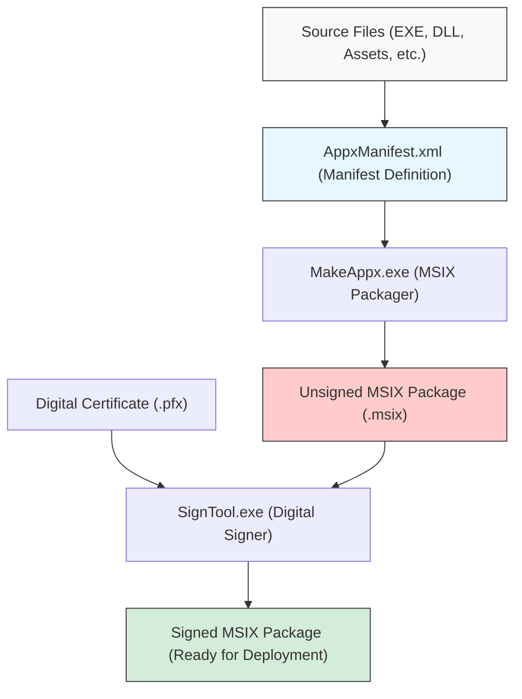
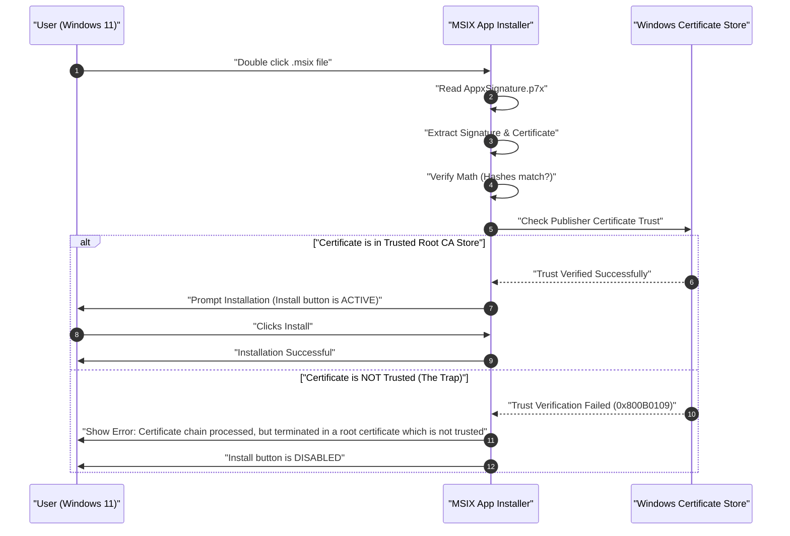

Windows 11の時代において、アプリケーションの配布フォーマットとして「MSIX」が標準的な選択肢となりつつあります。従来のMSIやEXEといったインストーラーには多くの課題がありましたが、MSIXはそれらを解決する次世代のパッケージング技術として期待されています。しかし、開発者がいざMSIXパッケージを作成し、組織内やテスト環境でサイドローディング（Sideloading）を行おうとすると、「自己署名証明書の罠」に陥ることが少なくありません。

本記事では、MSIXの技術的な詳細から、Visual Studioやコマンドラインツールを用いたパッケージの作成方法、そして多くの開発者が直面する自己署名証明書に関するエラーの原因と解決策まで、非常に詳細に解説します。Windowsアプリ開発者、インフラ管理者、そしてパッケージング担当者にとって必読のガイドとなることを目指します。

## 1. MSIXとは何か？ 従来のMSI/EXEとの比較

MSIXは、Microsoftが提供するWindows向けの最新のアプリケーションパッケージ形式です。従来から存在したMSI（Microsoft Installer）、.exeベースのカスタムインストーラー、App-V（Application Virtualization）、そしてWindows 8以降で導入されたAppX（Universal Windows Platformアプリのパッケージ）のすべての優れた機能と概念を統合し、さらに現代のセキュリティとデプロイメントの要件に合わせて進化させたものです。

### 従来のインストーラー（MSI/EXE）の課題
長年Windowsの標準的なインストール形式として使われてきたMSIやEXEには、以下のような根本的な問題がありました。

1. **Win Rot（Windowsの劣化）現象**: アプリケーションのインストールとアンインストールを繰り返すうちに、レジストリに不要なキーが残り、システムフォルダ（`C:\Windows\System32`など）にDLLが取り残される問題です。これにより、OS自体の動作が次第に遅くなり、不安定になる現象が発生します。
2. **DLL地獄（DLL Hell）**: 複数のアプリケーションが同じ名前のDLL（ただしバージョンが異なる）を共有システムディレクトリにインストールしようとした場合、後からインストールされたアプリが既存のDLLを上書きしてしまい、先にインストールされていたアプリが正常に動作しなくなる問題です。
3. **カスタムアクションによる不安定性**: MSIパッケージでは「カスタムアクション」と呼ばれる任意のスクリプトやコードをインストール中・アンインストール中にシステム権限で実行できます。これにより、インストーラーが途中でクラッシュしたり、システムの予期せぬ設定変更を引き起こしたりするリスクがありました。

### MSIXのコンテナ化アーキテクチャによる解決策
MSIXは、アプリケーションを軽量な「コンテナ」内で動作させることでこれらの課題を解決します。このコンテナ化アプローチには以下のような絶大なメリットがあります。

- **クリーンなアンインストール**: MSIXでインストールされたアプリは、ファイルシステムやレジストリへの書き込みを仮想化（VFS: Virtual File System, VReg: Virtual Registry）して行います。したがって、アンインストール時にはこの仮想化されたコンテナごと削除されるため、システムに一切のゴミ（残骸）を残しません。Win Rotを完全に防止します。
- **分離とセキュリティ（Isolation）**: 各アプリは自分自身の環境内で動作し、他のアプリのDLLやリソースを直接破壊することはありません。これによりDLL地獄から解放されます。
- **ネットワーク帯域の最適化**: MSIXのアップデート機構は非常に優秀で、ブロックレベルでの差分アップデート（Differential Update）をサポートしています。バイナリデータのうち変更されたわずかなブロックだけをダウンロードするため、大容量アプリの更新でもネットワークへの負荷を最小限に抑えられます。
- **確実なインストール状態**: パッケージにはマニフェストファイル（`AppxManifest.xml`）が含まれており、インストールのトランザクションがOSレベルで厳密に管理されます。失敗した場合は元の状態に完全にロールバックされます。

## 2. MSIXパッケージ作成の全体像とツールチェーン

MSIXパッケージを作成するためには、大きく分けて2つのアプローチがあります。1つはVisual Studioの統合開発環境（IDE）を利用する方法、もう1つはWindows SDKに同梱されているコマンドラインツール（`MakeAppx.exe`や`SignTool.exe`）を駆使する方法です。

以下のMermaidダイアグラムは、ソースファイルから最終的な署名済みMSIXパッケージが生成されるまでのプロセスを示しています。



このプロセスから分かる通り、単にファイルを集めて固める（パッケージング）だけでは不十分であり、必ず「デジタル署名」のステップが必要になります。Windows 11は、署名のないMSIXパッケージのインストールをセキュリティ上の理由から一切許可しません。

## 3. アプローチA：Visual Studioを用いたMSIXの作成

最も簡単かつ一般的な方法は、Visual Studioの「Windows アプリケーション パッケージ プロジェクト (Windows Application Packaging Project - WAP)」を使用することです。このプロジェクトテンプレートを使用すると、WPF、Windows Forms、WinUI 3、さらにはC++のレガシーなWin32アプリであっても、簡単にMSIX化することができます。

### ステップバイステップガイド
1. **WAPプロジェクトの追加**: 既存のVisual Studioソリューションを右開き、「新しいプロジェクトの追加」から「Windows アプリケーション パッケージ プロジェクト」を選択します。
2. **対象プラットフォームの選択**: アプリがサポートするWindows 10/11の最小バージョンとターゲットバージョンを指定します。
3. **アプリケーションの参照**: パッケージプロジェクトの「アプリケーション」ノードを右クリックし、「参照の追加」からパッケージングしたいメインのプロジェクト（例えばWPFプロジェクト）を選択します。
4. **マニフェストの設定**: `Package.appxmanifest`ファイルをダブルクリックし、ビジュアルデザイナーを開きます。ここで、アプリの表示名、説明、ロゴ画像、そして最も重要な「パッケージ名（Identity Name）」と「発行元（Publisher）」を設定します。
5. **パッケージの作成**: プロジェクトを右クリックし、「公開」->「アプリ パッケージの作成」を選択します。「サイドローディング用」を選択し、アーキテクチャ（x64, ARM64など）を選択すると、Visual Studioが自動的にコンパイル、`MakeAppx`によるパッケージング、そして自己署名証明書の生成と署名までを一手に引き受けてくれます。

非常にシームレスですが、ここでVisual Studioが自動生成した自己署名証明書（Test Certificate）を使用すると、後述する「罠」にハマることになります。

## 4. アプローチB：コマンドライン（MakeAppx.exe）を用いた作成

CI/CDパイプラインでの自動化や、既存のインストーラーから手動でファイル群を再パッケージングする場合などには、コマンドラインツールが必要です。Windows SDKがインストールされている環境であれば、開発者コマンドプロンプトから以下のツールにアクセスできます。

### 1. マニフェストファイルの準備
パッケージのルートディレクトリに、最低限の情報を記述した`AppxManifest.xml`を作成します。

```xml
<?xml version="1.0" encoding="utf-8"?>
<Package xmlns="http://schemas.microsoft.com/appx/manifest/foundation/windows10"
         xmlns:uap="http://schemas.microsoft.com/appx/manifest/uap/windows10"
         xmlns:rescap="http://schemas.microsoft.com/appx/manifest/foundation/windows10/restrictedcapabilities">
  
  <Identity Name="MyCompany.AwesomeApp"
            Publisher="CN=MyCompany Self-Signed, O=MyCompany"
            Version="1.0.0.0"
            ProcessorArchitecture="x64" />
  
  <Properties>
    <DisplayName>Awesome App</DisplayName>
    <PublisherDisplayName>My Company</PublisherDisplayName>
    <Logo>Assets\StoreLogo.png</Logo>
  </Properties>
  
  <Resources>
    <Resource Language="en-us" />
    <Resource Language="ja-jp" />
  </Resources>
  
  <Dependencies>
    <TargetDeviceFamily Name="Windows.Desktop" MinVersion="10.0.17763.0" MaxVersionTested="10.0.22000.0" />
  </Dependencies>
  
  <Capabilities>
    <rescap:Capability Name="runFullTrust" />
  </Capabilities>
  
  <Applications>
    <Application Id="AwesomeApp" Executable="AwesomeApp.exe" EntryPoint="Windows.FullTrustApplication">
      <uap:VisualElements DisplayName="Awesome App"
                          Description="The best app ever."
                          BackgroundColor="transparent"
                          Square150x150Logo="Assets\Square150x150Logo.png"
                          Square44x44Logo="Assets\Square44x44Logo.png">
      </uap:VisualElements>
    </Application>
  </Applications>
</Package>
```
ここで重要なのは、`<Identity Publisher="..." />` の値が、後で署名に使用する証明書のSubjectと完全に一致している必要があるということです。

### 2. MakeAppxによるパッケージング
コマンドプロンプトで以下のコマンドを実行し、ディレクトリをMSIXファイルに固めます。

```cmd
MakeAppx.exe pack /d "C:\Path\To\AppFolder" /p "C:\Path\To\Output\AwesomeApp_1.0.0.0_x64.msix"
```
これで未署名のMSIXファイルが完成しますが、この状態ではWindowsにインストールすることはできません。

## 5. デジタル署名と暗号技術の数学的背景

MSIXパッケージになぜ署名が必要なのかを深く理解するためには、デジタル署名の背後にある暗号学的なメカニズムを理解する必要があります。デジタル署名は、パッケージが「確実に指定された発行元によって作成されたこと（認証）」と、「作成後から現在までに第三者によって改ざんされていないこと（完全性）」を保証します。

MSIXの署名には通常、RSA暗号とSHA-256（Secure Hash Algorithm 256-bit）が組み合わされて使用されます。

### ハッシュ関数の適用
まず、MSIXパッケージのバイナリ全体（内容物）をメッセージ $M$ とします。署名ツール（SignTool.exe）は、このメッセージ $M$ に対して暗号学的ハッシュ関数であるSHA-256を適用し、固定長（256ビット）のハッシュ値 $H(M)$ を計算します。

### 署名の生成（発行元）
次に、発行元は自身の「秘密鍵（Private Key）」 $d$ を使用してハッシュ値を暗号化し、デジタル署名 $\sigma$ を生成します。RSAアルゴリズムの文脈において、これはモジュラ・べき乗演算として以下のように表現されます。

$$ \sigma \equiv (H(M))^d \pmod n $$

ここで $n$ はRSAモジュラス（2つの巨大な素数の積）です。この署名 $\sigma$ と発行元の「公開鍵（Public Key）」 $e$ を含む証明書（X.509形式）が、MSIXパッケージの一部（`AppxSignature.p7x`）として埋め込まれます。

### 署名の検証（Windows OS）
ユーザーがMSIXをインストールしようとした際、Windows OSはパッケージ内の証明書から公開鍵 $e$ を取り出し、以下の計算を行ってハッシュ値 $H'(M)$ を復元します。

$$ H'(M) \equiv \sigma^e \pmod n $$

同時に、OSは自分自身でダウンロードしたMSIXパッケージ $M$ 全体のハッシュ値 $H(M)$ を再計算します。
最終的に、復元したハッシュ値と再計算したハッシュ値が等しいか（$H(M) = H'(M)$）を検証します。この等式が成立すれば、「署名後にファイルは1ビットも改ざんされていない」ことが数学的に証明されたことになります。

## 6. 最大の障壁：「自己署名証明書の罠」

上記の数学的証明が完璧であったとしても、Windows 11はそれだけでインストールを許可しません。なぜなら、「その公開鍵（証明書）の持ち主が、本当に名乗っている通りの安全な組織・人物なのか？」という『信頼の連鎖（Chain of Trust）』を検証する必要があるからです。

証明書がVeriSignやDigiCertといったOSにあらかじめ信頼されている公的なルート証明機関（Root CA）から発行されたものであれば、問題なくインストールできます（Microsoft Store経由で配布されるアプリも同様にMicrosoftのルート証明書で信頼されます）。

しかし、開発中や社内専用ツールなど、公的な証明書を購入するコストをかけられない場合、開発者は自分自身で証明書を発行します。これが「自己署名証明書（Self-Signed Certificate）」です。

以下のシーケンス図は、自己署名証明書で署名されたMSIXパッケージをインストールしようとした際のOSの挙動を示しています。



まさにこれが「罠」です。開発者自身が作成し、正しく署名したにもかかわらず、Windows 11のデフォルト状態ではその自己署名証明書を知らない（信頼していない）ため、エラーコード `0x800B0109` と共にインストールがブロックされてしまいます。インストーラーの「インストール」ボタンはグレーアウトされ、押すことができません。

多くの開発者がこのエラーに直面し、「MSIXはバグだらけだ」「設定が間違っているに違いない」とマニフェストファイルなどを何度も書き直す迷宮に陥りますが、問題はパッケージの構造ではなく、OSの証明書ストア（Certificate Store）への登録有無にあります。

## 7. 解決策：PowerShellを用いた自己署名証明書の作成と展開

この問題を解決するには、以下の2ステップを確実に実行する必要があります。
1. 有効な自己署名証明書を作成し、秘密鍵を含むPFXファイルをエクスポートする。
2. 作成した証明書の公開鍵部分（CERファイル）を、対象となる**すべてのPCの「信頼されたルート証明機関（Trusted Root Certification Authorities）」ストアにインストールする**。

これらはPowerShellを使うことで、確実かつ自動的に処理することができます。

### ステップ1：自己署名証明書の作成とエクスポート

まずは管理者権限でPowerShellを起動し、以下のスクリプトを実行して証明書を作成します。ここでは、コードサイニング（Code Signing）用途に特化した証明書を生成します。

```powershell
# 1. パラメータの定義
$SubjectName = "CN=MyCompany Self-Signed, O=MyCompany"
$CertStoreLocation = "Cert:\CurrentUser\My"

# 2. 自己署名証明書の生成 (コードサイニング用途: 1.3.6.1.5.5.7.3.3)
$Cert = New-SelfSignedCertificate -Type Custom `
    -Subject $SubjectName `
    -KeyUsage DigitalSignature `
    -FriendlyName "MyCompany MSIX Signing Cert" `
    -CertStoreLocation $CertStoreLocation `
    -TextExtension @("2.5.29.37={text}1.3.6.1.5.5.7.3.3", "2.5.29.19={text}")

Write-Host "証明書が生成されました。Thumbprint: $($Cert.Thumbprint)"

# 3. PFX（秘密鍵込み）のエクスポート用パスワードの作成
$Password = ConvertTo-SecureString -String "YourSecurePassword123!" -Force -AsPlainText

# 4. PFXファイルのエクスポート (SignToolでの署名用)
$PfxPath = "C:\Path\To\Output\MyCompanyCert.pfx"
Export-PfxCertificate -Cert $Cert -FilePath $PfxPath -Password $Password

# 5. CER（公開鍵のみ）のエクスポート (クライアントPCへのインストール用)
$CerPath = "C:\Path\To\Output\MyCompanyCert.cer"
Export-Certificate -Cert $Cert -FilePath $CerPath
```

ここで作成した `$PfxPath` のファイルを用いて、MSIXパッケージに署名を行います。

```cmd
SignTool.exe sign /fd SHA256 /a /f "C:\Path\To\Output\MyCompanyCert.pfx" /p "YourSecurePassword123!" "C:\Path\To\Output\AwesomeApp_1.0.0.0_x64.msix"
```

### ステップ2：クライアントPCへの証明書のインストール（罠の解除）

署名済みMSIXを別のPC（または仮想環境）に持っていき、そのままダブルクリックしても先述の通りインストールできません。事前に（あるいは同時に）、先ほどエクスポートした `$CerPath` のファイルを「ローカルコンピューター」の「信頼されたルート証明機関」にインストールする必要があります。

これを行うには、デプロイ先のPCで**管理者権限**のPowerShellを開き、以下のコマンドを実行します。

```powershell
# CERファイルのパス
$CerPath = "C:\Path\To\Output\MyCompanyCert.cer"

# ローカルマシンの「信頼されたルート証明機関」にインポート
Import-Certificate -FilePath $CerPath -CertStoreLocation "Cert:\LocalMachine\Root"

Write-Host "証明書を信頼されたルート証明機関にインストールしました。"
```

> [!CAUTION]
> 「ローカルコンピューター（`LocalMachine`）」のルート証明機関ストアへの追加は管理者権限が必須です。ユーザー個人のストア（`CurrentUser`）に入れても、App Installerの権限コンテキストの都合上、認識されないケースがあるため注意が必要です。

このスクリプトが成功した直後、先ほどエラーになっていたMSIXファイルを再度ダブルクリックしてみてください。まるで魔法のようにエラーメッセージが消え、鮮やかな青色のアクティブな「インストール」ボタンが表示されるはずです。これで「自己署名証明書の罠」を完全に突破できました。

## 8. エンタープライズ環境での運用とベストプラクティス

開発者のローカルテストであれば上記の手順で十分ですが、社内の数十台、数百台のPCにサイドローディングアプリを展開する場合、ユーザー一人ひとりに証明書のインストールスクリプトを実行させるのは非現実的であり、セキュリティリスクも伴います。

エンタープライズ環境でのベストプラクティスは以下の通りです。

### 1. Active Directory グループポリシー (GPO) の活用
社内にActive Directoryが導入されている場合、GPOの「公開鍵ポリシー」を使用して、自己署名証明書（CERファイル）をドメイン参加しているすべてのPCの「信頼されたルート証明機関」へ自動的に配布することができます。これにより、社員は証明書について一切意識することなく、共有フォルダ上のMSIXファイルをダブルクリックするだけでインストールが可能になります。

### 2. Microsoft Intune (MDM) によるデプロイ
モダンな環境ではMicrosoft Intuneを使用してデバイス管理を行っています。Intuneでは、「構成プロファイル」機能を使って信頼された証明書（.cer）をエンドポイントにプッシュ配信できます。その後、LOB (Line of Business) アプリケーションとしてMSIXパッケージ自体をサイレントインストールとしてデプロイすることが可能です。

### 3. App Installerファイル (.appinstaller) による自動更新
MSIXには、アプリのアップデートを自動化する強力な機能が備わっています。XMLベースの`.appinstaller`ファイルを作成し、WebサーバーまたはSMB共有フォルダ上に配置しておくことで、アプリ起動時にバックグラウンドで新しいバージョンのMSIXがないか確認し、自動的にアップデートを適用させることができます。

```xml
<?xml version="1.0" encoding="utf-8"?>
<AppInstaller
    Uri="https://internal.mycompany.com/apps/AwesomeApp.appinstaller"
    Version="1.0.0.0"
    xmlns="http://schemas.microsoft.com/appx/appinstaller/2018">
    <MainPackage
        Name="MyCompany.AwesomeApp"
        Publisher="CN=MyCompany Self-Signed, O=MyCompany"
        Version="1.0.0.0"
        ProcessorArchitecture="x64"
        Uri="https://internal.mycompany.com/apps/AwesomeApp_1.0.0.0_x64.msix" />
    <UpdateSettings>
        <OnLaunch HoursBetweenUpdateChecks="0" />
    </UpdateSettings>
</AppInstaller>
```
このファイルをユーザーに配布しインストールさせることで、以降はサーバー上のMSIXファイルを差し替え、`.appinstaller`のバージョン番号を更新するだけで、全ユーザーのアプリが自動的にアップデートされるようになります。

## 9. トラブルシューティング：証明書関連のよくあるエラー

最後に、証明書や署名に関連して発生しうるその他の一般的なエラーと解決策をまとめておきます。

- **0x800B0101**: 署名に使用された証明書の有効期限が切れています。新しい証明書を発行し直すか、署名時にタイムスタンプサーバー（例: `http://timestamp.digicert.com`）を使用して、証明書有効期間内に署名されたことを証明できるようにしてください（タイムスタンプを付与すれば、証明書自体の期限が切れても署名は有効と見なされます）。
- **0x80080204**: `AppxManifest.xml`に記載されている`Publisher`の値と、証明書の`Subject`の値が完全に一致していません。カンマの後のスペースの有無など、文字列として完全一致しているか厳密に確認してください。
- **イベントビューアーの確認**: エラーのより詳細な原因を探るには、Windowsのイベントビューアーを開き、「アプリケーションとサービス ログ」 -> 「Microsoft」 -> 「Windows」 -> 「AppxPackagingOM」または「AppXDeployment-Server」のログを確認することが非常に重要です。

## 10. まとめ

Windows 11に向けたMSIXパッケージングは、アプリケーションのライフサイクル管理を飛躍的に向上させる強力な技術です。Win RotやDLL地獄から解放され、クリーンで安全な環境をユーザーに提供できます。

一方で、セキュリティモデルが厳格化されているため、デジタル署名と証明書の「信頼の連鎖」に関する深い理解が不可欠です。「自己署名証明書の罠」は、MSIXの技術に初めて触れる開発者が必ずと言っていいほど直面する登竜門です。本記事で解説した証明書の生成、エクスポート、そして適切なストアへのインポートの仕組みを理解し、スクリプトやGPOを活用して自動化することで、MSIXのポテンシャルを最大限に引き出したスムーズなデプロイメントが実現できるでしょう。

ぜひ、この知識を活かして、次世代のクリーンなWindowsアプリケーション配布環境を構築してください。
