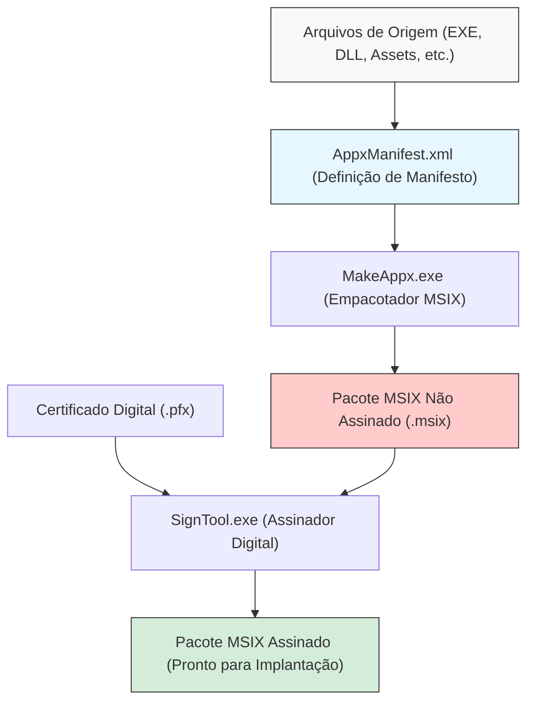
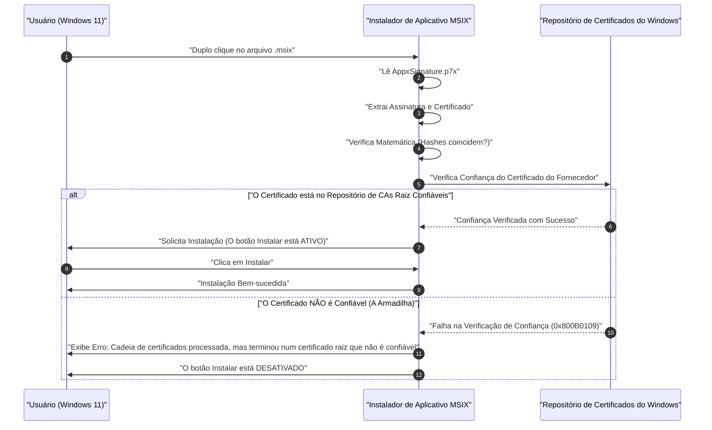

Na era do Windows 11, o "MSIX" está se tornando a escolha padrão como formato de distribuição de aplicativos. Os instaladores tradicionais como MSI e EXE tinham muitos problemas, mas o MSIX é esperado como uma tecnologia de empacotamento de próxima geração que os resolve. No entanto, quando os desenvolvedores tentam criar um pacote MSIX e realizar o sideloading em um ambiente de teste ou na organização, eles frequentemente caem na "armadilha do certificado autoassinado".

Neste artigo, explicaremos de forma muito detalhada desde os detalhes técnicos do MSIX, como criar pacotes usando o Visual Studio ou ferramentas de linha de comando, até as causas e soluções para os erros relacionados a certificados autoassinados que muitos desenvolvedores enfrentam. O objetivo é ser um guia essencial para desenvolvedores de aplicativos do Windows, administradores de infraestrutura e responsáveis por empacotamento.

## 1. O que é MSIX? Comparação com MSI/EXE tradicionais

O MSIX é o formato de pacote de aplicativos mais recente para Windows fornecido pela Microsoft. Ele integra todos os excelentes recursos e conceitos do MSI (Microsoft Installer), instaladores personalizados baseados em .exe, App-V (Application Virtualization) e AppX (pacote de aplicativos da Universal Windows Platform) introduzidos a partir do Windows 8, e evoluiu para atender aos modernos requisitos de segurança e implantação.

### Problemas dos instaladores tradicionais (MSI/EXE)
O MSI e o EXE, que têm sido usados como o formato de instalação padrão do Windows por muitos anos, tinham problemas fundamentais como os seguintes.

1. **Fenômeno Win Rot (Degradação do Windows)**: À medida que os aplicativos são instalados e desinstalados repetidamente, chaves desnecessárias permanecem no registro e DLLs são deixadas em pastas do sistema (como `C:\Windows\System32`). Isso faz com que o funcionamento do próprio sistema operacional fique gradualmente mais lento e instável.
2. **Inferno de DLL (DLL Hell)**: Quando vários aplicativos tentam instalar uma DLL com o mesmo nome (mas de versões diferentes) em um diretório de sistema compartilhado, o aplicativo instalado posteriormente pode sobrescrever a DLL existente, fazendo com que o aplicativo instalado anteriormente pare de funcionar corretamente.
3. **Instabilidade devido a ações personalizadas**: Em pacotes MSI, scripts arbitrários ou código chamado "ação personalizada" (custom action) podem ser executados com privilégios de sistema durante a instalação e desinstalação. Isso trazia o risco de o instalador travar no meio do processo ou causar alterações inesperadas nas configurações do sistema.

### Solução através da arquitetura em contêineres do MSIX
O MSIX resolve esses problemas executando aplicativos em "contêineres" leves. Essa abordagem de conteinerização oferece benefícios enormes como os seguintes:

- **Desinstalação limpa**: Aplicativos instalados via MSIX realizam gravações no sistema de arquivos e no registro de forma virtualizada (VFS: Virtual File System, VReg: Virtual Registry). Portanto, na desinstalação, esse contêiner virtualizado é excluído por completo, não deixando lixo (resquícios) no sistema. Previne completamente o Win Rot.
- **Isolamento e Segurança (Isolation)**: Cada aplicativo é executado dentro de seu próprio ambiente e não destrói diretamente as DLLs ou recursos de outros aplicativos. Isso liberta do inferno de DLL.
- **Otimização da largura de banda de rede**: O mecanismo de atualização do MSIX é excelente, suportando atualizações diferenciais em nível de bloco (Differential Update). Como ele baixa apenas os poucos blocos alterados nos dados binários, o impacto na rede é minimizado mesmo ao atualizar aplicativos grandes.
- **Estado de instalação garantido**: O pacote inclui um arquivo de manifesto (`AppxManifest.xml`), e as transações de instalação são rigorosamente gerenciadas em nível de sistema operacional. Em caso de falha, ocorre a reversão completa (rollback) para o estado original.

## 2. Visão geral da criação de pacotes MSIX e cadeia de ferramentas (Toolchain)

Para criar pacotes MSIX, existem duas abordagens principais. Uma é usar o Ambiente de Desenvolvimento Integrado (IDE) do Visual Studio e a outra é fazer uso total das ferramentas de linha de comando (`MakeAppx.exe` e `SignTool.exe`) incluídas no Windows SDK.

O diagrama Mermaid abaixo mostra o processo desde os arquivos de origem até a geração final do pacote MSIX assinado.



Como pode ser visto a partir desse processo, simplesmente reunir e empacotar os arquivos (packaging) não é suficiente; a etapa de "assinatura digital" é sempre necessária. O Windows 11 não permite a instalação de pacotes MSIX não assinados por razões de segurança, em nenhuma circunstância.

## 3. Abordagem A: Criando MSIX usando o Visual Studio

O método mais fácil e comum é usar o "Windows Application Packaging Project (WAP)" do Visual Studio. Usando esse modelo de projeto, é possível converter facilmente para MSIX aplicativos em WPF, Windows Forms, WinUI 3 ou até mesmo aplicativos legados Win32 em C++.

### Guia passo a passo
1. **Adicionar o projeto WAP**: Clique com o botão direito do mouse na solução existente do Visual Studio e selecione "Adicionar Novo Projeto" -> "Windows Application Packaging Project".
2. **Selecionar a plataforma de destino**: Especifique a versão mínima e a versão de destino do Windows 10/11 suportada pelo aplicativo.
3. **Referência do aplicativo**: Clique com o botão direito do mouse no nó "Aplicativos" do projeto de empacotamento e, em "Adicionar Referência", selecione o projeto principal que deseja empacotar (por exemplo, um projeto WPF).
4. **Configuração do manifesto**: Dê um duplo clique no arquivo `Package.appxmanifest` para abrir o designer visual. Aqui, configure o nome de exibição, a descrição, a imagem do logotipo do aplicativo e, mais importante, o "Nome do Pacote (Identity Name)" e o "Fornecedor (Publisher)".
5. **Criação do pacote**: Clique com o botão direito do mouse no projeto e selecione "Publicar" -> "Criar Pacotes de Aplicativos". Ao selecionar "Sideloading" e escolher a arquitetura (x64, ARM64, etc.), o Visual Studio cuidará automaticamente da compilação, do empacotamento com o `MakeAppx` e da geração de um certificado autoassinado junto com a assinatura.

É um processo muito fluido, mas se você usar o certificado autoassinado (Test Certificate) gerado automaticamente pelo Visual Studio aqui, você cairá na "armadilha" mencionada mais adiante.

## 4. Abordagem B: Criando usando a linha de comando (MakeAppx.exe)

As ferramentas de linha de comando são necessárias para automação em pipelines CI/CD ou ao reempacotar manualmente arquivos de um instalador existente. Se o Windows SDK estiver instalado no seu ambiente, você pode acessar as seguintes ferramentas através do prompt de comando do desenvolvedor.

### 1. Preparação do arquivo de manifesto
Crie um `AppxManifest.xml` com as informações mínimas necessárias no diretório raiz do pacote.

```xml
<?xml version="1.0" encoding="utf-8"?>
<Package xmlns="http://schemas.microsoft.com/appx/manifest/foundation/windows10"
         xmlns:uap="http://schemas.microsoft.com/appx/manifest/uap/windows10"
         xmlns:rescap="http://schemas.microsoft.com/appx/manifest/foundation/windows10/restrictedcapabilities">
  
  <Identity Name="MyCompany.AwesomeApp"
            Publisher="CN=MyCompany Self-Signed, O=MyCompany"
            Version="1.0.0.0"
            ProcessorArchitecture="x64" />
  
  <Properties>
    <DisplayName>Awesome App</DisplayName>
    <PublisherDisplayName>My Company</PublisherDisplayName>
    <Logo>Assets\StoreLogo.png</Logo>
  </Properties>
  
  <Resources>
    <Resource Language="en-us" />
    <Resource Language="ja-jp" />
  </Resources>
  
  <Dependencies>
    <TargetDeviceFamily Name="Windows.Desktop" MinVersion="10.0.17763.0" MaxVersionTested="10.0.22000.0" />
  </Dependencies>
  
  <Capabilities>
    <rescap:Capability Name="runFullTrust" />
  </Capabilities>
  
  <Applications>
    <Application Id="AwesomeApp" Executable="AwesomeApp.exe" EntryPoint="Windows.FullTrustApplication">
      <uap:VisualElements DisplayName="Awesome App"
                          Description="The best app ever."
                          BackgroundColor="transparent"
                          Square150x150Logo="Assets\Square150x150Logo.png"
                          Square44x44Logo="Assets\Square44x44Logo.png">
      </uap:VisualElements>
    </Application>
  </Applications>
</Package>
```
O importante aqui é que o valor de `<Identity Publisher="..." />` deve corresponder exatamente ao Subject do certificado que será usado posteriormente para a assinatura.

### 2. Empacotamento com o MakeAppx
Execute o seguinte comando no prompt de comando para consolidar o diretório em um arquivo MSIX.

```cmd
MakeAppx.exe pack /d "C:\Path\To\AppFolder" /p "C:\Path\To\Output\AwesomeApp_1.0.0.0_x64.msix"
```
Isso concluirá a criação do arquivo MSIX não assinado, mas, nesse estado, ele não pode ser instalado no Windows.

## 5. Assinatura digital e contexto matemático da criptografia

Para entender profundamente por que os pacotes MSIX precisam de assinatura, é necessário compreender o mecanismo criptográfico por trás da assinatura digital. A assinatura digital garante que o pacote "foi certamente criado pelo fornecedor especificado (autenticidade)" e "não foi adulterado por terceiros desde a sua criação até agora (integridade)".

A assinatura do MSIX geralmente usa uma combinação da criptografia RSA e SHA-256 (Secure Hash Algorithm 256-bit).

### Aplicação da função hash
Primeiro, considere que todos os binários (conteúdo) do pacote MSIX sejam a mensagem $M$. A ferramenta de assinatura (SignTool.exe) aplica a função de hash criptográfico SHA-256 a esta mensagem $M$ para calcular um valor de hash $H(M)$ de comprimento fixo (256 bits).

### Geração da assinatura (Fornecedor)
Em seguida, o fornecedor usa a sua própria "chave privada (Private Key)" $d$ para criptografar o valor do hash e gerar a assinatura digital $\sigma$. No contexto do algoritmo RSA, isso é expresso como uma exponenciação modular, da seguinte forma:

$$ \sigma \equiv (H(M))^d \pmod n $$

Aqui, $n$ é o módulo RSA (o produto de dois grandes números primos). Um certificado (no formato X.509) contendo esta assinatura $\sigma$ e a "chave pública (Public Key)" $e$ do fornecedor é incorporado como parte do pacote MSIX (`AppxSignature.p7x`).

### Verificação da assinatura (Sistema Operacional Windows)
Quando o usuário tenta instalar o MSIX, o sistema operacional Windows extrai a chave pública $e$ do certificado dentro do pacote e realiza o seguinte cálculo para restaurar o valor do hash $H'(M)$:

$$ H'(M) \equiv \sigma^e \pmod n $$

Simultaneamente, o sistema operacional recalcula o valor de hash $H(M)$ de todo o pacote MSIX baixado $M$ por conta própria.
Por fim, ele verifica se o valor do hash restaurado é igual ao valor do hash recalculado ($H(M) = H'(M)$). Se essa equação for verdadeira, está matematicamente provado que "o arquivo não foi adulterado nem em 1 bit após a assinatura".

## 6. A maior barreira: "A armadilha do certificado autoassinado"

Mesmo que a prova matemática acima seja perfeita, o Windows 11 não permite a instalação apenas com isso. Isso ocorre porque é necessário verificar a "Cadeia de Confiança (Chain of Trust)": "O proprietário da chave pública (certificado) é realmente a organização/pessoa segura que afirma ser?"

Se o certificado for emitido por uma Autoridade de Certificação Raiz (Root CA) pública, previamente confiável pelo sistema operacional, como VeriSign ou DigiCert, ele pode ser instalado sem problemas (os aplicativos distribuídos via Microsoft Store também são igualmente confiáveis pelo certificado raiz da Microsoft).

No entanto, em ferramentas exclusivas internas ou em desenvolvimento, onde o custo de compra de um certificado público não se justifica, o desenvolvedor emite o certificado por conta própria. Isso é o "certificado autoassinado (Self-Signed Certificate)".

O diagrama de sequência abaixo mostra o comportamento do sistema operacional ao tentar instalar um pacote MSIX assinado com um certificado autoassinado.



Isso é exatamente a "armadilha". Mesmo que o próprio desenvolvedor o tenha criado e assinado corretamente, o estado padrão do Windows 11 não conhece (não confia) nesse certificado autoassinado, de modo que a instalação é bloqueada com o código de erro `0x800B0109`. O botão "Instalar" do instalador fica acinzentado e não pode ser pressionado.

Muitos desenvolvedores se deparam com esse erro e caem no labirinto de reescrever o arquivo de manifesto várias vezes pensando "O MSIX está cheio de bugs" ou "Minhas configurações devem estar incorretas", mas o problema não está na estrutura do pacote, e sim na presença ou ausência do registro no Repositório de Certificados (Certificate Store) do sistema operacional.

## 7. Solução: Criação e implantação de um certificado autoassinado usando PowerShell

Para resolver esse problema, é necessário executar confiavelmente as duas etapas a seguir.
1. Criar um certificado autoassinado válido e exportar o arquivo PFX contendo a chave privada.
2. Instalar a parte da chave pública do certificado criado (arquivo CER) no repositório **"Autoridades de Certificação Raiz Confiáveis" (Trusted Root Certification Authorities) de todos os PCs de destino**.

Isso pode ser feito de forma confiável e automática usando o PowerShell.

### Etapa 1: Criação e exportação do certificado autoassinado

Primeiro, inicie o PowerShell com privilégios de administrador e execute o script a seguir para criar o certificado. Aqui, iremos gerar um certificado especializado para assinatura de código (Code Signing).

```powershell
# 1. Definição de parâmetros
$SubjectName = "CN=MyCompany Self-Signed, O=MyCompany"
$CertStoreLocation = "Cert:\CurrentUser\My"

# 2. Geração do certificado autoassinado (Uso para Code Signing: 1.3.6.1.5.5.7.3.3)
$Cert = New-SelfSignedCertificate -Type Custom `
    -Subject $SubjectName `
    -KeyUsage DigitalSignature `
    -FriendlyName "MyCompany MSIX Signing Cert" `
    -CertStoreLocation $CertStoreLocation `
    -TextExtension @("2.5.29.37={text}1.3.6.1.5.5.7.3.3", "2.5.29.19={text}")

Write-Host "Certificado gerado com sucesso. Thumbprint: $($Cert.Thumbprint)"

# 3. Criação de senha para exportação do PFX (com chave privada)
$Password = ConvertTo-SecureString -String "YourSecurePassword123!" -Force -AsPlainText

# 4. Exportação do arquivo PFX (Para assinatura com SignTool)
$PfxPath = "C:\Path\To\Output\MyCompanyCert.pfx"
Export-PfxCertificate -Cert $Cert -FilePath $PfxPath -Password $Password

# 5. Exportação do arquivo CER (Apenas chave pública, para instalação em PCs clientes)
$CerPath = "C:\Path\To\Output\MyCompanyCert.cer"
Export-Certificate -Cert $Cert -FilePath $CerPath
```

Usaremos o arquivo `$PfxPath` criado aqui para assinar o pacote MSIX.

```cmd
SignTool.exe sign /fd SHA256 /a /f "C:\Path\To\Output\MyCompanyCert.pfx" /p "YourSecurePassword123!" "C:\Path\To\Output\AwesomeApp_1.0.0.0_x64.msix"
```

### Etapa 2: Instalação do certificado no PC cliente (Desarmando a armadilha)

Se você levar o MSIX assinado para outro PC (ou ambiente virtual) e simplesmente der um duplo clique, ele não será instalado, conforme mencionado antes. Previamente (ou simultaneamente), você deve instalar o arquivo `$CerPath` exportado anteriormente nas "Autoridades de Certificação Raiz Confiáveis" do "Computador local".

Para fazer isso, abra o PowerShell com **privilégios de administrador** no PC de destino e execute o seguinte comando.

```powershell
# Caminho para o arquivo CER
$CerPath = "C:\Path\To\Output\MyCompanyCert.cer"

# Importar para as "Autoridades de Certificação Raiz Confiáveis" da máquina local
Import-Certificate -FilePath $CerPath -CertStoreLocation "Cert:\LocalMachine\Root"

Write-Host "O certificado foi instalado nas Autoridades de Certificação Raiz Confiáveis."
```

> [!CAUTION]
> A adição ao repositório de autoridades de certificação raiz do "Computador local (`LocalMachine`)" exige privilégios de administrador. Tenha cuidado, pois colocar no repositório individual do usuário (`CurrentUser`) pode não ser reconhecido devido ao contexto de permissões do App Installer.

Logo após a execução bem-sucedida desse script, tente dar um duplo clique novamente no arquivo MSIX que apresentava erro. Como um passe de mágica, a mensagem de erro desaparecerá e um botão de "Instalar" ativo e azul brilhante deve ser exibido. Com isso, superamos completamente a "armadilha do certificado autoassinado".

## 8. Operação e melhores práticas em ambiente corporativo

Embora as etapas acima sejam suficientes para testes locais do desenvolvedor, quando se implementa um aplicativo de sideloading em dezenas ou centenas de PCs na empresa, fazer com que cada usuário execute o script de instalação do certificado é inviável e traz riscos de segurança.

As melhores práticas em um ambiente corporativo são as seguintes:

### 1. Utilização de Políticas de Grupo do Active Directory (GPO)
Se a sua empresa usa Active Directory, você pode usar as "Políticas de Chave Pública" da GPO para distribuir automaticamente certificados autoassinados (arquivos CER) para as "Autoridades de Certificação Raiz Confiáveis" de todos os PCs no domínio. Dessa forma, os funcionários podem instalar os aplicativos com um simples duplo clique no arquivo MSIX de uma pasta compartilhada, sem sequer precisarem se preocupar com os certificados.

### 2. Implantação através do Microsoft Intune (MDM)
Em ambientes modernos, o gerenciamento de dispositivos é feito usando o Microsoft Intune. Com o Intune, você pode usar o recurso de "Perfil de configuração" (Configuration Profile) para enviar o certificado confiável (.cer) aos endpoints via push. Em seguida, o próprio pacote MSIX pode ser implantado como uma instalação silenciosa, como um aplicativo LOB (Line of Business).

### 3. Atualizações automáticas com o arquivo App Installer (.appinstaller)
O MSIX possui um poderoso recurso integrado para automatizar atualizações de aplicativos. Ao criar um arquivo `.appinstaller` baseado em XML e colocá-lo em um servidor web ou pasta compartilhada SMB, o aplicativo verificará automaticamente, em segundo plano durante a inicialização, a existência de novas versões do MSIX e aplicará a atualização automaticamente.

```xml
<?xml version="1.0" encoding="utf-8"?>
<AppInstaller
    Uri="https://internal.mycompany.com/apps/AwesomeApp.appinstaller"
    Version="1.0.0.0"
    xmlns="http://schemas.microsoft.com/appx/appinstaller/2018">
    <MainPackage
        Name="MyCompany.AwesomeApp"
        Publisher="CN=MyCompany Self-Signed, O=MyCompany"
        Version="1.0.0.0"
        ProcessorArchitecture="x64"
        Uri="https://internal.mycompany.com/apps/AwesomeApp_1.0.0.0_x64.msix" />
    <UpdateSettings>
        <OnLaunch HoursBetweenUpdateChecks="0" />
    </UpdateSettings>
</AppInstaller>
```
Ao distribuir e instalar este arquivo para os usuários, a partir desse momento, as atualizações de todos os usuários acontecerão automaticamente bastando substituir o arquivo MSIX no servidor e atualizar o número da versão no `.appinstaller`.

## 9. Solução de Problemas: Erros comuns relacionados a certificados

Por fim, aqui está um resumo de outros erros comuns que podem ocorrer em relação a certificados e assinaturas, juntamente com suas soluções.

- **0x800B0101**: O certificado usado para a assinatura expirou. Emita um novo certificado ou certifique-se de usar um servidor de carimbo de data/hora (por exemplo, `http://timestamp.digicert.com`) no momento da assinatura para comprovar que o arquivo foi assinado durante o período de validade do certificado (se você adicionar o carimbo de data/hora, a assinatura será considerada válida mesmo após o vencimento do próprio certificado).
- **0x80080204**: O valor de `Publisher` descrito no `AppxManifest.xml` não corresponde exatamente ao valor de `Subject` no certificado. Verifique rigorosamente a exatidão exata da string, incluindo a presença ou ausência de espaços após as vírgulas.
- **Verificando o Visualizador de Eventos (Event Viewer)**: Para encontrar a causa mais detalhada de um erro, é extremamente importante abrir o Visualizador de Eventos do Windows e verificar os logs em "Logs de Aplicativos e Serviços" -> "Microsoft" -> "Windows" -> "AppxPackagingOM" ou "AppXDeployment-Server".

## 10. Conclusão

O empacotamento MSIX para o Windows 11 é uma tecnologia poderosa que melhora dramaticamente a gestão do ciclo de vida dos aplicativos. Liberta os utilizadores do Win Rot e do Inferno de DLLs, proporcionando um ambiente limpo e seguro.

Por outro lado, como o modelo de segurança se tornou mais rigoroso, é essencial um profundo entendimento de assinaturas digitais e da "cadeia de confiança" dos certificados. A "armadilha do certificado autoassinado" é um obstáculo enfrentado por quase todos os desenvolvedores ao entrar em contato com as tecnologias do MSIX pela primeira vez. Compreendendo os mecanismos de geração, exportação e importação de certificados para o repositório adequado explicados neste artigo, e usando scripts ou GPO para automação, você conseguirá realizar uma implantação tranquila, maximizando todo o potencial do MSIX.

Use esse conhecimento e crie o ambiente de distribuição limpo de aplicativos Windows da próxima geração.
