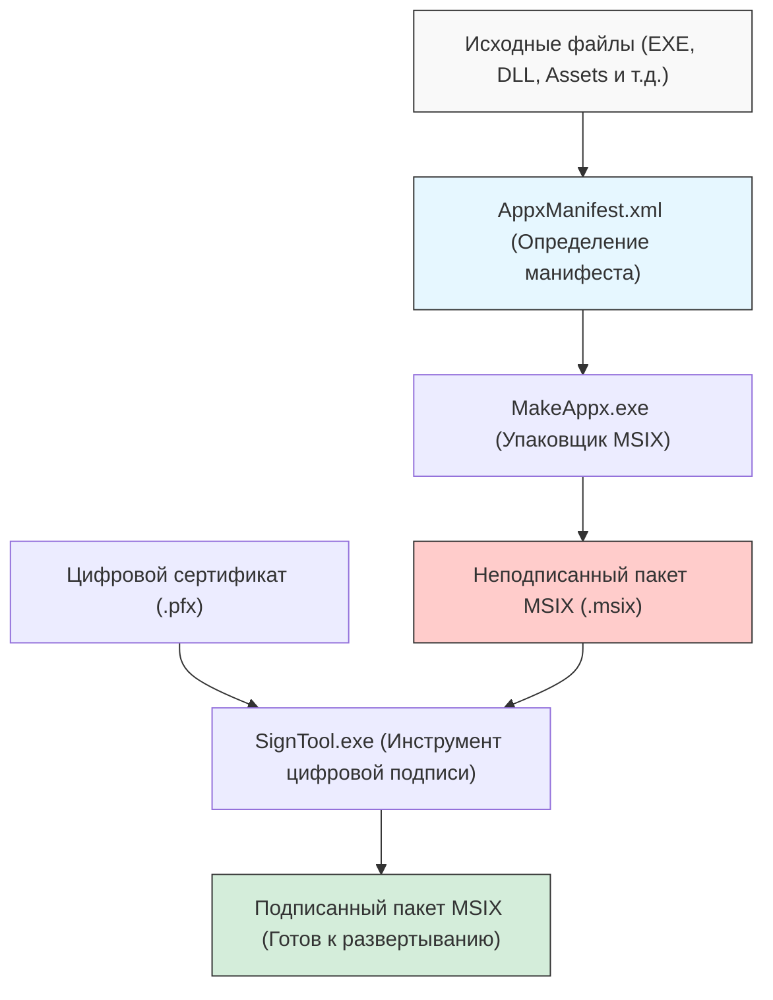
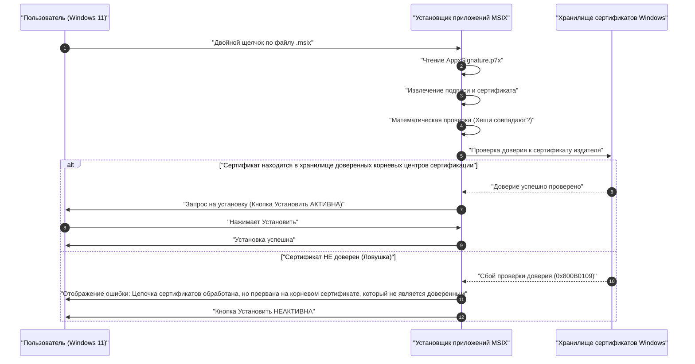

В эпоху Windows 11 формат "MSIX" становится стандартным выбором для распространения приложений. Традиционные установщики, такие как MSI и EXE, имели множество проблем, но ожидается, что MSIX, как технология упаковки следующего поколения, их решит. Однако, когда разработчики пытаются создать пакет MSIX и выполнить неопубликованную загрузку (Sideloading) в организации или тестовой среде, они часто попадают в "ловушку самоподписанных сертификатов".

В этой статье подробно рассматриваются технические детали MSIX, способы создания пакетов с помощью Visual Studio и инструментов командной строки, а также причины и решения ошибок, связанных с самоподписанными сертификатами, с которыми сталкиваются многие разработчики. Мы надеемся, что это станет обязательным руководством для разработчиков приложений для Windows, администраторов инфраструктуры и специалистов по упаковке.

## 1. Что такое MSIX? Сравнение с традиционными MSI/EXE

MSIX — это новейший формат пакетов приложений для Windows, предоставляемый Microsoft. Он объединяет все лучшие функции и концепции традиционных установщиков MSI (Microsoft Installer), пользовательских установщиков на основе .exe, App-V (Application Virtualization) и AppX (пакеты приложений Universal Windows Platform), представленных в Windows 8, и развивает их в соответствии с современными требованиями безопасности и развертывания.

### Проблемы традиционных установщиков (MSI/EXE)
MSI и EXE, которые долгое время использовались в качестве стандартных форматов установки в Windows, имели следующие фундаментальные проблемы.

1. **Явление Win Rot (деградация Windows)**: По мере того как вы неоднократно устанавливаете и удаляете приложения, в реестре остаются ненужные ключи, а в системных папках (таких как `C:\Windows\System32`) остаются библиотеки DLL. Из-за этого операционная система постепенно начинает работать медленнее и становится нестабильной.
2. **Ад DLL (DLL Hell)**: Если несколько приложений пытаются установить DLL с одинаковым именем (но разных версий) в общий системный каталог, приложение, установленное позже, перезаписывает существующую DLL, что приводит к некорректной работе ранее установленного приложения.
3. **Нестабильность из-за пользовательских действий**: В пакетах MSI во время установки и удаления с системными привилегиями можно выполнять произвольные скрипты или код, так называемые "пользовательские действия" (custom actions). Это создавало риск того, что установщик мог завершиться с ошибкой на полпути или вызвать непредвиденные изменения в настройках системы.

### Решение с помощью контейнерной архитектуры MSIX
MSIX решает эти проблемы за счет работы приложений в легковесных "контейнерах". Этот контейнерный подход дает следующие огромные преимущества:

- **Чистое удаление**: Приложения, установленные через MSIX, виртуализируют запись в файловую систему и реестр (VFS: Virtual File System, VReg: Virtual Registry). Поэтому при удалении удаляется весь виртуализированный контейнер, не оставляя в системе никакого мусора (остатков). Это полностью предотвращает Win Rot.
- **Изоляция и безопасность (Isolation)**: Каждое приложение работает в собственной среде и не может напрямую повредить библиотеки DLL или ресурсы других приложений. Это освобождает от DLL Hell.
- **Оптимизация пропускной способности сети**: Механизм обновления MSIX превосходен и поддерживает дифференциальное обновление (Differential Update) на уровне блоков. Поскольку загружаются только те несколько блоков двоичных данных, которые были изменены, нагрузка на сеть сводится к минимуму даже при обновлении крупных приложений.
- **Надежный статус установки**: Пакет включает файл манифеста (`AppxManifest.xml`), а транзакции установки строго контролируются на уровне ОС. В случае сбоя состояние полностью откатывается к исходному.

## 2. Общий обзор создания пакетов MSIX и инструментарий

Существует два основных подхода к созданию пакетов MSIX. Один — использовать интегрированную среду разработки (IDE) Visual Studio, а другой — в полной мере использовать инструменты командной строки (`MakeAppx.exe` и `SignTool.exe`), включенные в Windows SDK.

Следующая диаграмма Mermaid показывает процесс от исходных файлов до создания окончательного подписанного пакета MSIX.



Как видно из этого процесса, просто собрать файлы вместе (упаковка) недостаточно; всегда требуется этап "цифровой подписи". По соображениям безопасности Windows 11 не допускает установку неподписанных пакетов MSIX.

## 3. Подход А: Создание MSIX с помощью Visual Studio

Самый простой и распространенный метод — использовать "Проект упаковки приложений Windows" (Windows Application Packaging Project - WAP) в Visual Studio. Используя этот шаблон проекта, вы можете легко упаковать в MSIX приложения WPF, Windows Forms, WinUI 3 и даже старые приложения Win32 на C++.

### Пошаговое руководство
1. **Добавление проекта WAP**: Щелкните правой кнопкой мыши по существующему решению Visual Studio, выберите "Добавить новый проект" и выберите "Проект упаковки приложений Windows".
2. **Выбор целевой платформы**: Укажите минимальную и целевую версию Windows 10/11, поддерживаемую вашим приложением.
3. **Ссылка на приложение**: Щелкните правой кнопкой мыши узел "Приложения" в проекте пакета и выберите "Добавить ссылку", чтобы выбрать основной проект (например, проект WPF), который вы хотите упаковать.
4. **Настройка манифеста**: Дважды щелкните файл `Package.appxmanifest`, чтобы открыть визуальный конструктор. Здесь вы можете задать отображаемое имя, описание, логотип приложения, а также наиболее важные параметры: "Имя пакета (Identity Name)" и "Издатель (Publisher)".
5. **Создание пакета**: Щелкните проект правой кнопкой мыши и выберите "Опубликовать" -> "Создать пакеты приложения". Выберите "Для загрузки неопубликованных приложений" (Sideloading), выберите архитектуру (x64, ARM64 и т.д.), и Visual Studio автоматически выполнит компиляцию, упаковку с помощью `MakeAppx`, а также генерацию и подписание самоподписанным сертификатом.

Это работает очень гладко, но если вы будете использовать автоматически сгенерированный Visual Studio самоподписанный сертификат (Test Certificate), вы попадете в "ловушку", которая будет описана ниже.

## 4. Подход Б: Создание с помощью командной строки (MakeAppx.exe)

Для автоматизации в конвейерах CI/CD или ручной переупаковки набора файлов из существующего установщика необходимы инструменты командной строки. Если у вас установлена среда Windows SDK, вы можете получить доступ к следующим инструментам из командной строки разработчика.

### 1. Подготовка файла манифеста
Создайте в корневой директории пакета файл `AppxManifest.xml` с минимально необходимой информацией.

```xml
<?xml version="1.0" encoding="utf-8"?>
<Package xmlns="http://schemas.microsoft.com/appx/manifest/foundation/windows10"
         xmlns:uap="http://schemas.microsoft.com/appx/manifest/uap/windows10"
         xmlns:rescap="http://schemas.microsoft.com/appx/manifest/foundation/windows10/restrictedcapabilities">
  
  <Identity Name="MyCompany.AwesomeApp"
            Publisher="CN=MyCompany Self-Signed, O=MyCompany"
            Version="1.0.0.0"
            ProcessorArchitecture="x64" />
  
  <Properties>
    <DisplayName>Awesome App</DisplayName>
    <PublisherDisplayName>My Company</PublisherDisplayName>
    <Logo>Assets\StoreLogo.png</Logo>
  </Properties>
  
  <Resources>
    <Resource Language="en-us" />
    <Resource Language="ja-jp" />
  </Resources>
  
  <Dependencies>
    <TargetDeviceFamily Name="Windows.Desktop" MinVersion="10.0.17763.0" MaxVersionTested="10.0.22000.0" />
  </Dependencies>
  
  <Capabilities>
    <rescap:Capability Name="runFullTrust" />
  </Capabilities>
  
  <Applications>
    <Application Id="AwesomeApp" Executable="AwesomeApp.exe" EntryPoint="Windows.FullTrustApplication">
      <uap:VisualElements DisplayName="Awesome App"
                          Description="The best app ever."
                          BackgroundColor="transparent"
                          Square150x150Logo="Assets\Square150x150Logo.png"
                          Square44x44Logo="Assets\Square44x44Logo.png">
      </uap:VisualElements>
    </Application>
  </Applications>
</Package>
```
Здесь важно, чтобы значение `<Identity Publisher="..." />` в точности совпадало с Subject сертификата, который позже будет использоваться для подписания.

### 2. Упаковка с помощью MakeAppx
Выполните следующую команду в командной строке, чтобы упаковать директорию в файл MSIX.

```cmd
MakeAppx.exe pack /d "C:\Path\To\AppFolder" /p "C:\Path\To\Output\AwesomeApp_1.0.0.0_x64.msix"
```
Это создаст неподписанный файл MSIX, но в этом состоянии его нельзя установить в Windows.

## 5. Математические основы цифровой подписи и криптографии

Чтобы глубоко понять, почему пакет MSIX требует подписи, необходимо понять криптографические механизмы, стоящие за цифровыми подписями. Цифровая подпись гарантирует, что пакет "однозначно создан указанным издателем (аутентификация)" и что он "не был изменен третьими лицами с момента создания до настоящего времени (целостность)".

Для подписи MSIX обычно используется комбинация алгоритма шифрования RSA и SHA-256 (Secure Hash Algorithm 256-bit).

### Применение хеш-функции
Во-первых, примем весь двоичный код пакета MSIX (содержимое) за сообщение $M$. Инструмент подписи (SignTool.exe) применяет к этому сообщению $M$ криптографическую хеш-функцию SHA-256 для вычисления хеш-значения $H(M)$ фиксированной длины (256 бит).

### Создание подписи (Издатель)
Затем издатель использует свой "закрытый ключ" (Private Key) $d$ для шифрования хеш-значения и создания цифровой подписи $\sigma$. В контексте алгоритма RSA это выражается как модульное возведение в степень следующим образом:

$$ \sigma \equiv (H(M))^d \pmod n $$

Где $n$ — модуль RSA (произведение двух огромных простых чисел). Сертификат (в формате X.509), содержащий эту подпись $\sigma$ и "открытый ключ" (Public Key) $e$ издателя, встраивается в пакет MSIX (`AppxSignature.p7x`).

### Проверка подписи (ОС Windows)
Когда пользователь пытается установить MSIX, ОС Windows извлекает открытый ключ $e$ из сертификата в пакете и выполняет следующие вычисления для восстановления хеш-значения $H'(M)$.

$$ H'(M) \equiv \sigma^e \pmod n $$

Одновременно ОС заново вычисляет хеш-значение $H(M)$ для всего загруженного пакета MSIX $M$.
Наконец, она проверяет, равны ли восстановленное хеш-значение и пересчитанное хеш-значение ($H(M) = H'(M)$). Если это равенство выполняется, то математически доказано, что "файл не был изменен ни на бит после подписания".

## 6. Самое большое препятствие: "Ловушка самоподписанных сертификатов"

Даже если приведенное выше математическое доказательство безупречно, Windows 11 не разрешит установку только на этом основании. Это связано с тем, что необходимо проверить "Цепочку доверия" (Chain of Trust) — "является ли владелец открытого ключа (сертификата) действительно той безопасной организацией или лицом, за которое себя выдает?".

Если сертификат выдан официальным корневым центром сертификации (Root CA), которому ОС доверяет по умолчанию, таким как VeriSign или DigiCert, он может быть установлен без проблем (приложения, распространяемые через Microsoft Store, также доверяются корневым сертификатам Microsoft).

Однако во время разработки или для внутренних корпоративных инструментов, когда нет возможности потратиться на покупку официального сертификата, разработчики сами выпускают сертификат. Это и есть "самоподписанный сертификат" (Self-Signed Certificate).

Следующая диаграмма последовательности показывает поведение ОС при попытке установить пакет MSIX, подписанный самоподписанным сертификатом.



Это и есть та самая "ловушка". Несмотря на то, что разработчик сам создал пакет и правильно его подписал, в состоянии по умолчанию Windows 11 не знает (не доверяет) этот самоподписанный сертификат, поэтому установка блокируется с кодом ошибки `0x800B0109`. Кнопка "Установить" в установщике выделена серым цветом, и ее нельзя нажать.

Многие разработчики сталкиваются с этой ошибкой и впадают в заблуждение: "MSIX полон багов" или "Должно быть, настройки неверны", многократно переписывая файл манифеста, но проблема заключается не в структуре пакета, а в наличии или отсутствии сертификата в хранилище сертификатов (Certificate Store) ОС.

## 7. Решение: Создание и развертывание самоподписанного сертификата с помощью PowerShell

Чтобы решить эту проблему, необходимо надежно выполнить следующие два шага.
1. Создать действующий самоподписанный сертификат и экспортировать файл PFX, содержащий закрытый ключ.
2. Установить открытую часть созданного сертификата (файл CER) в хранилище **"Доверенные корневые центры сертификации" (Trusted Root Certification Authorities) на всех целевых ПК**.

Это можно выполнить надежно и автоматически с помощью PowerShell.

### Шаг 1: Создание и экспорт самоподписанного сертификата

Во-первых, запустите PowerShell с правами администратора и выполните следующий скрипт для создания сертификата. Здесь мы сгенерируем сертификат, специально предназначенный для подписи кода (Code Signing).

```powershell
# 1. Определение параметров
$SubjectName = "CN=MyCompany Self-Signed, O=MyCompany"
$CertStoreLocation = "Cert:\CurrentUser\My"

# 2. Создание самоподписанного сертификата (Для подписи кода: 1.3.6.1.5.5.7.3.3)
$Cert = New-SelfSignedCertificate -Type Custom `
    -Subject $SubjectName `
    -KeyUsage DigitalSignature `
    -FriendlyName "MyCompany MSIX Signing Cert" `
    -CertStoreLocation $CertStoreLocation `
    -TextExtension @("2.5.29.37={text}1.3.6.1.5.5.7.3.3", "2.5.29.19={text}")

Write-Host "Сертификат был сгенерирован. Отпечаток (Thumbprint): $($Cert.Thumbprint)"

# 3. Создание пароля для экспорта PFX (включая закрытый ключ)
$Password = ConvertTo-SecureString -String "YourSecurePassword123!" -Force -AsPlainText

# 4. Экспорт файла PFX (Для подписания с помощью SignTool)
$PfxPath = "C:\Path\To\Output\MyCompanyCert.pfx"
Export-PfxCertificate -Cert $Cert -FilePath $PfxPath -Password $Password

# 5. Экспорт CER (только открытый ключ) (Для установки на клиентские ПК)
$CerPath = "C:\Path\To\Output\MyCompanyCert.cer"
Export-Certificate -Cert $Cert -FilePath $CerPath
```

Используйте файл по пути `$PfxPath`, созданный здесь, для подписи пакета MSIX.

```cmd
SignTool.exe sign /fd SHA256 /a /f "C:\Path\To\Output\MyCompanyCert.pfx" /p "YourSecurePassword123!" "C:\Path\To\Output\AwesomeApp_1.0.0.0_x64.msix"
```

### Шаг 2: Установка сертификата на клиентский ПК (Обезвреживание ловушки)

Даже если вы перенесете подписанный MSIX на другой ПК (или виртуальную среду) и дважды щелкнете по нему, он, как упоминалось ранее, не установится. Заранее (или одновременно) необходимо установить экспортированный файл `$CerPath` в "Доверенные корневые центры сертификации" на "Локальном компьютере" (Local Machine).

Для этого откройте PowerShell **с правами администратора** на ПК, куда будет производиться развертывание, и выполните следующую команду.

```powershell
# Путь к файлу CER
$CerPath = "C:\Path\To\Output\MyCompanyCert.cer"

# Импорт в "Доверенные корневые центры сертификации" локальной машины
Import-Certificate -FilePath $CerPath -CertStoreLocation "Cert:\LocalMachine\Root"

Write-Host "Сертификат установлен в доверенные корневые центры сертификации."
```

> [!CAUTION]
> Добавление в хранилище корневых сертификатов "Локального компьютера" (`LocalMachine`) требует прав администратора. Обратите внимание, что даже если вы поместите его в хранилище текущего пользователя (`CurrentUser`), он может быть не распознан из-за контекста привилегий установщика приложений (App Installer).

Сразу после успешного выполнения этого скрипта попробуйте снова дважды щелкнуть файл MSIX, который ранее выдавал ошибку. Как по волшебству, сообщение об ошибке должно исчезнуть, и появится ярко-синяя активная кнопка "Установить". Таким образом, вы полностью преодолели "ловушку самоподписанных сертификатов".

## 8. Развертывание в корпоративной среде и лучшие практики

Для локального тестирования разработчиком описанных выше шагов достаточно, но при развертывании приложения путем неопубликованной загрузки на десятки или сотни ПК в компании заставлять каждого пользователя выполнять скрипт установки сертификата непрактично и сопряжено с рисками безопасности.

Лучшие практики в корпоративной среде заключаются в следующем.

### 1. Использование групповых политик Active Directory (GPO)
Если в компании внедрен Active Directory, вы можете использовать "Политику открытого ключа" в GPO для автоматического распространения самоподписанного сертификата (файла CER) в "Доверенные корневые центры сертификации" всех ПК, присоединенных к домену. Благодаря этому сотрудники смогут установить приложение, просто дважды щелкнув файл MSIX в общей папке, даже не задумываясь о сертификатах.

### 2. Развертывание с помощью Microsoft Intune (MDM)
В современных средах для управления устройствами используется Microsoft Intune. В Intune вы можете использовать функцию "Профили конфигурации", чтобы протолкнуть доверенный сертификат (.cer) на конечные точки. Затем можно развернуть сам пакет MSIX в тихом режиме как приложение бизнес-направления (LOB - Line of Business).

### 3. Автоматическое обновление через файл App Installer (.appinstaller)
MSIX обладает мощными функциями для автоматизации обновления приложений. Создав файл на основе XML `.appinstaller` и разместив его на веб-сервере или в общей папке SMB, вы можете заставить приложение в фоновом режиме проверять наличие новой версии MSIX при запуске и автоматически применять обновления.

```xml
<?xml version="1.0" encoding="utf-8"?>
<AppInstaller
    Uri="https://internal.mycompany.com/apps/AwesomeApp.appinstaller"
    Version="1.0.0.0"
    xmlns="http://schemas.microsoft.com/appx/appinstaller/2018">
    <MainPackage
        Name="MyCompany.AwesomeApp"
        Publisher="CN=MyCompany Self-Signed, O=MyCompany"
        Version="1.0.0.0"
        ProcessorArchitecture="x64"
        Uri="https://internal.mycompany.com/apps/AwesomeApp_1.0.0.0_x64.msix" />
    <UpdateSettings>
        <OnLaunch HoursBetweenUpdateChecks="0" />
    </UpdateSettings>
</AppInstaller>
```
Распространив этот файл среди пользователей и установив его, вы сможете автоматически обновлять приложения для всех пользователей, просто заменяя файл MSIX на сервере и обновляя номер версии в `.appinstaller`.

## 9. Устранение неполадок: Распространенные ошибки, связанные с сертификатами

Наконец, давайте обобщим другие распространенные ошибки, которые могут возникнуть в связи с сертификатами и подписями, а также их решения.

- **0x800B0101**: Срок действия сертификата, использованного для подписи, истек. Перевыпустите новый сертификат или используйте сервер меток времени при подписи (например, `http://timestamp.digicert.com`), чтобы можно было доказать, что подпись была сделана в течение срока действия сертификата (при наличии метки времени подпись считается действительной даже после истечения срока действия самого сертификата).
- **0x80080204**: Значение `Publisher`, указанное в `AppxManifest.xml`, и значение `Subject` в сертификате не совпадают полностью. Пожалуйста, строго проверьте, совпадают ли они в виде строк, включая наличие или отсутствие пробелов после запятых и т.д.
- **Проверка средства просмотра событий**: Чтобы найти более подробную причину ошибки, очень важно открыть средство просмотра событий Windows (Event Viewer) и проверить журналы в разделе "Журналы приложений и служб" (Applications and Services Logs) -> "Microsoft" -> "Windows" -> "AppxPackagingOM" или "AppXDeployment-Server".

## 10. Заключение

Упаковка MSIX для Windows 11 — это мощная технология, которая значительно улучшает управление жизненным циклом приложений. Она избавляет от Win Rot и DLL Hell, обеспечивая пользователям чистую и безопасную среду.

С другой стороны, из-за более строгой модели безопасности, глубокое понимание "Цепочки доверия" для цифровых подписей и сертификатов имеет важное значение. "Ловушка самоподписанных сертификатов" — это барьер, с которым почти каждый разработчик сталкивается при первом знакомстве с технологией MSIX. Поняв механизмы создания, экспорта и импорта сертификатов в соответствующее хранилище, объясненные в этой статье, и используя скрипты или GPO для автоматизации, вы сможете достичь плавного развертывания, максимально использующего потенциал MSIX.

Пожалуйста, воспользуйтесь этими знаниями, чтобы создать чистую среду распространения приложений для Windows следующего поколения.
