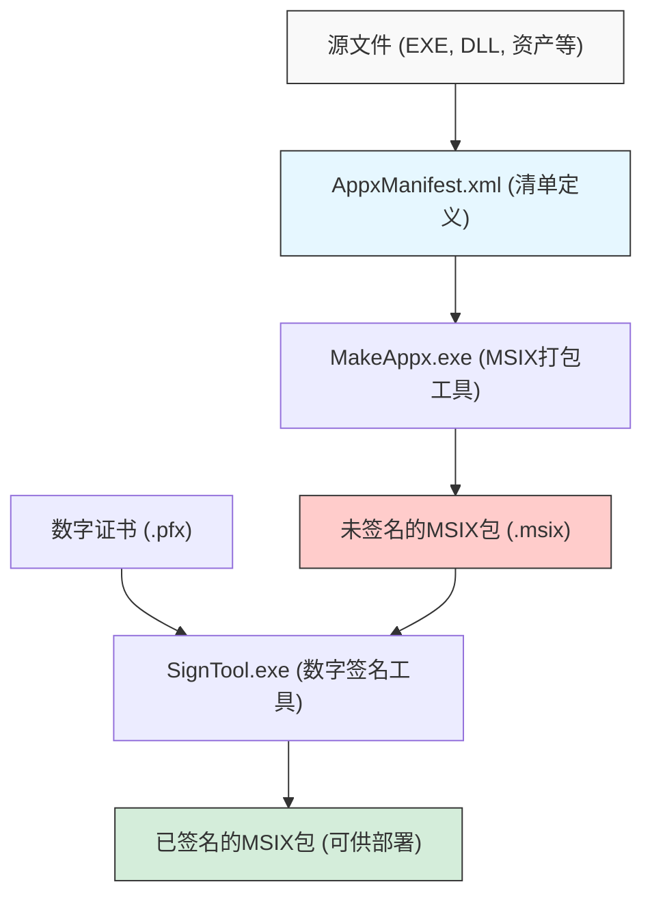
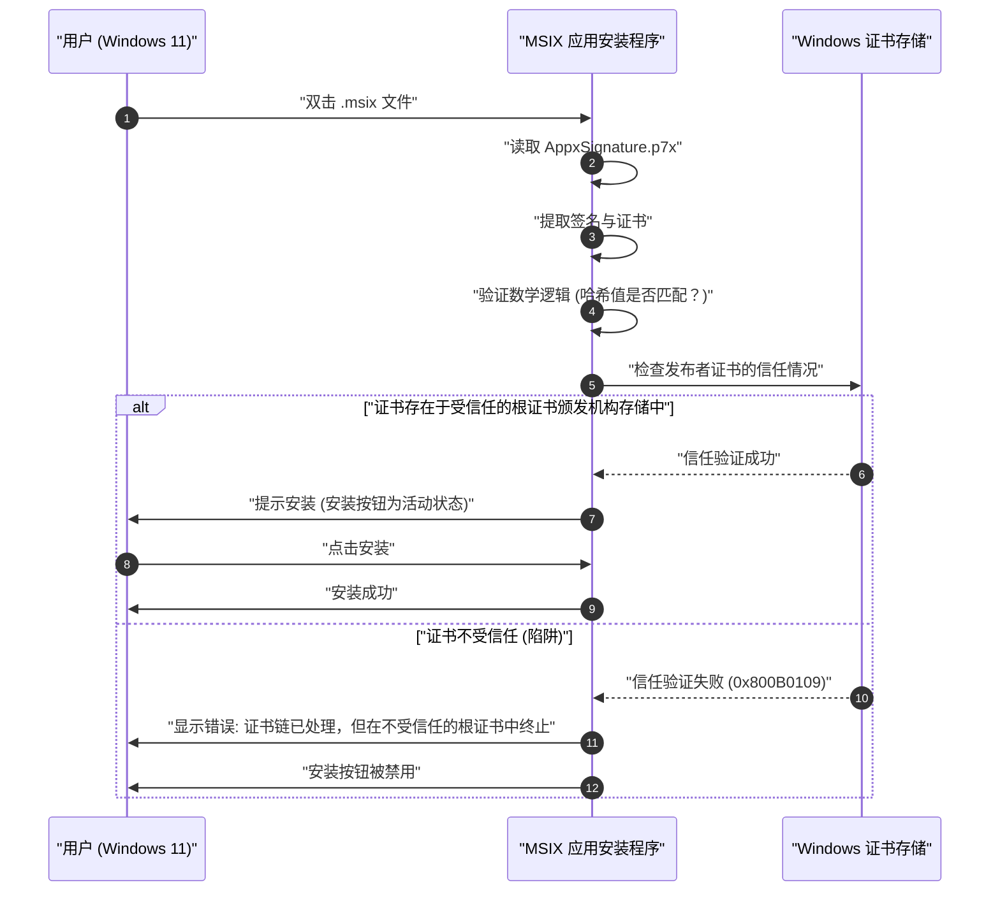

在Windows 11时代，“MSIX”正逐渐成为应用程序分发格式的标准选择。传统的MSI和EXE等安装程序存在许多问题，而MSIX作为解决这些问题的下一代打包技术备受期待。然而，当开发者真正开始创建MSIX包并尝试在组织内或测试环境中进行侧载（Sideloading）时，往往会陷入“自签名证书陷阱”。

本文将从MSIX的技术细节出发，详细讲解如何使用Visual Studio和命令行工具创建包，以及许多开发者所面临的自签名证书相关错误的原因与解决方案。我们希望这能成为Windows应用开发者、基础设施管理员以及打包负责人的必读指南。

## 1. MSIX是什么？与传统MSI/EXE的比较

MSIX是微软提供的针对Windows的最新应用程序打包格式。它整合了以往的MSI（Microsoft Installer）、基于.exe的自定义安装程序、App-V（Application Virtualization）以及Windows 8起引入的AppX（Universal Windows Platform应用包）的所有优秀功能与概念，并进一步适应现代的安全与部署要求进行了演进。

### 传统安装程序（MSI/EXE）的问题
多年来作为Windows标准安装格式使用的MSI和EXE，存在以下根本性问题：

1. **Win Rot（Windows系统退化）现象**：在反复安装和卸载应用程序的过程中，注册表中会留下不需要的键值，系统文件夹（如`C:\Windows\System32`）中也会遗留DLL文件。这会导致操作系统本身的运行逐渐变慢并变得不稳定。
2. **DLL地狱（DLL Hell）**：当多个应用程序尝试将同名但不同版本的DLL安装到共享系统目录时，后安装的应用会覆盖现有的DLL，导致先安装的应用无法正常运行。
3. **自定义操作导致的不稳定性**：在MSI包中，可以在安装或卸载过程中以系统权限执行被称为“自定义操作”的任意脚本或代码。这带来了安装程序中途崩溃或引发系统意外配置更改的风险。

### MSIX容器化架构的解决方案
MSIX通过在轻量级的“容器”内运行应用程序来解决这些问题。这种容器化方法具有以下巨大的优势：

- **干净的卸载**：通过MSIX安装的应用会对文件系统和注册表的写入进行虚拟化（VFS: 虚拟文件系统, VReg: 虚拟注册表）。因此，卸载时会连同这个虚拟化的容器一起删除，不会在系统中留下任何垃圾（残留物）。彻底防止了Win Rot。
- **隔离与安全性（Isolation）**：每个应用都在自己的环境中运行，不会直接破坏其他应用的DLL或资源。从而让你摆脱DLL地狱。
- **网络带宽优化**：MSIX的更新机制非常优秀，支持块级别的差异更新（Differential Update）。由于仅下载二进制数据中发生更改的少量数据块，因此即使更新大容量应用，也能将网络负载降至最低。
- **可靠的安装状态**：包中包含清单文件（`AppxManifest.xml`），安装事务由操作系统级别严格管理。如果失败，则会完全回滚到原始状态。

## 2. MSIX包创建的总体架构与工具链

创建MSIX包的方法主要分为两种。一种是利用Visual Studio集成开发环境（IDE），另一种是充分利用Windows SDK中附带的命令行工具（`MakeAppx.exe`和`SignTool.exe`）。

以下Mermaid图表展示了从源文件生成最终签名MSIX包的整个过程。



从这个过程可以看出，仅仅将文件收集并打包是不够的，必须经过“数字签名”这一步骤。出于安全原因，Windows 11完全不允许安装未签名的MSIX包。

## 3. 方法A：使用Visual Studio创建MSIX

最简单且最常见的方法是使用Visual Studio的“Windows 应用程序打包项目 (Windows Application Packaging Project - WAP)”。使用该项目模板，无论是WPF、Windows Forms、WinUI 3，还是传统的C++ Win32应用，都可以轻松地转换为MSIX格式。

### 分步指南
1. **添加WAP项目**：右键单击现有的Visual Studio解决方案，从“添加新项目”中选择“Windows 应用程序打包项目”。
2. **选择目标平台**：指定应用支持的Windows 10/11最低版本和目标版本。
3. **应用引用**：右键单击打包项目的“应用程序”节点，从“添加引用”中选择要打包的主项目（例如WPF项目）。
4. **清单设置**：双击`Package.appxmanifest`文件以打开可视化设计器。在这里，设置应用的显示名称、描述、徽标图像，以及最重要的“包名（Identity Name）”和“发布者（Publisher）”。
5. **创建包**：右键单击项目，选择“发布”->“创建应用程序包”。选择“用于侧载”，然后选择架构（如x64、ARM64等），Visual Studio就会自动完成编译、通过`MakeAppx`进行打包，以及生成自签名证书和签名等所有工作。

这非常无缝，但是如果你在这里使用了Visual Studio自动生成的自签名证书（测试证书），就会掉入后文所述的“陷阱”之中。

## 4. 方法B：使用命令行（MakeAppx.exe）创建

在CI/CD流水线中进行自动化，或者从现有安装程序手动重新打包文件时，需要使用命令行工具。只要安装了Windows SDK，就可以从开发者命令提示符访问以下工具。

### 1. 准备清单文件
在包的根目录下，创建一个包含最基本信息的`AppxManifest.xml`。

```xml
<?xml version="1.0" encoding="utf-8"?>
<Package xmlns="http://schemas.microsoft.com/appx/manifest/foundation/windows10"
         xmlns:uap="http://schemas.microsoft.com/appx/manifest/uap/windows10"
         xmlns:rescap="http://schemas.microsoft.com/appx/manifest/foundation/windows10/restrictedcapabilities">
  
  <Identity Name="MyCompany.AwesomeApp"
            Publisher="CN=MyCompany Self-Signed, O=MyCompany"
            Version="1.0.0.0"
            ProcessorArchitecture="x64" />
  
  <Properties>
    <DisplayName>Awesome App</DisplayName>
    <PublisherDisplayName>My Company</PublisherDisplayName>
    <Logo>Assets\StoreLogo.png</Logo>
  </Properties>
  
  <Resources>
    <Resource Language="en-us" />
    <Resource Language="ja-jp" />
  </Resources>
  
  <Dependencies>
    <TargetDeviceFamily Name="Windows.Desktop" MinVersion="10.0.17763.0" MaxVersionTested="10.0.22000.0" />
  </Dependencies>
  
  <Capabilities>
    <rescap:Capability Name="runFullTrust" />
  </Capabilities>
  
  <Applications>
    <Application Id="AwesomeApp" Executable="AwesomeApp.exe" EntryPoint="Windows.FullTrustApplication">
      <uap:VisualElements DisplayName="Awesome App"
                          Description="The best app ever."
                          BackgroundColor="transparent"
                          Square150x150Logo="Assets\Square150x150Logo.png"
                          Square44x44Logo="Assets\Square44x44Logo.png">
      </uap:VisualElements>
    </Application>
  </Applications>
</Package>
```
这里的重点是，`<Identity Publisher="..." />` 的值必须与之后用于签名的证书的Subject完全一致。

### 2. 使用MakeAppx进行打包
在命令提示符中执行以下命令，将目录打包成MSIX文件。

```cmd
MakeAppx.exe pack /d "C:\Path\To\AppFolder" /p "C:\Path\To\Output\AwesomeApp_1.0.0.0_x64.msix"
```
至此，未签名的MSIX文件就完成了，但在此状态下它是无法安装在Windows上的。

## 5. 数字签名与密码学的数学背景

为了深入理解为什么MSIX包需要签名，我们需要了解数字签名背后的密码学机制。数字签名保证了包“确实是由指定的发布者创建的（认证）”，并且“从创建后到目前为止没有被第三方篡改（完整性）”。

MSIX的签名通常结合使用RSA加密和SHA-256（Secure Hash Algorithm 256-bit）。

### 哈希函数的应用
首先，将MSIX包的整个二进制数据（内容）作为消息 $M$。签名工具（SignTool.exe）对该消息 $M$ 应用密码学哈希函数SHA-256，计算出固定长度（256位）的哈希值 $H(M)$。

### 签名的生成（发布者）
接下来，发布者使用自己的“私钥（Private Key）” $d$ 对哈希值进行加密，生成数字签名 $\sigma$。在RSA算法的语境下，这表示为模幂运算，如下所示：

$$ \sigma \equiv (H(M))^d \pmod n $$

这里的 $n$ 是RSA模数（两个巨大素数的乘积）。包含该签名 $\sigma$ 和发布者“公钥（Public Key）” $e$ 的证书（X.509格式）会被作为MSIX包的一部分（`AppxSignature.p7x`）嵌入其中。

### 签名的验证（Windows操作系统）
当用户尝试安装MSIX时，Windows操作系统会从包内的证书中提取公钥 $e$，进行以下计算以还原哈希值 $H'(M)$：

$$ H'(M) \equiv \sigma^e \pmod n $$

同时，操作系统会亲自重新计算下载的整个MSIX包 $M$ 的哈希值 $H(M)$。
最后，验证还原的哈希值与重新计算的哈希值是否相等（$H(M) = H'(M)$）。如果该等式成立，就在数学上证明了“文件在签名后连1个比特都没有被篡改过”。

## 6. 最大的障碍：“自签名证书陷阱”

即使上述数学证明完美无缺，Windows 11也不会仅仅因为这样就允许安装。因为它还需要验证『信任链（Chain of Trust）』：“那个公钥（证书）的所有者，真的就是其所声称的安全组织或个人吗？”。

如果证书是由VeriSign或DigiCert等已被操作系统预先信任的公共根证书颁发机构（Root CA）颁发的，那么就可以毫无问题地进行安装（通过Microsoft Store分发的应用也同样受到微软根证书的信任）。

然而，在开发阶段或内部专用工具等情况下，如果无法承担购买公共证书的成本，开发者就会自己颁发证书。这就是所谓的“自签名证书（Self-Signed Certificate）”。

以下时序图展示了尝试安装由自签名证书签名的MSIX包时操作系统的行为。



这正是所谓的“陷阱”。尽管是开发者自己创建且已正确签名的，但由于Windows 11在默认状态下不认识（不信任）该自签名证书，因此安装会被拦截，并显示错误代码 `0x800B0109`。安装程序的“安装”按钮变灰，无法点击。

许多开发者在遇到这个错误时，会陷入“MSIX全都是Bug”、“肯定是配置错了”的误区，从而反复修改清单文件等，但问题其实并不在于包的结构，而在于操作系统的证书存储（Certificate Store）中是否已注册该证书。

## 7. 解决方案：使用PowerShell创建与部署自签名证书

要解决这个问题，必须确保执行以下两个步骤：
1. 创建有效的自签名证书，并导出包含私钥的PFX文件。
2. 将创建的证书的公钥部分（CER文件），**安装到所有目标PC的“受信任的根证书颁发机构（Trusted Root Certification Authorities）”存储中**。

这些都可以通过使用PowerShell来进行可靠且自动化的处理。

### 步骤1：创建并导出自签名证书

首先以管理员权限启动PowerShell，并执行以下脚本来创建证书。这里我们将生成专门用于代码签名（Code Signing）用途的证书。

```powershell
# 1. 定义参数
$SubjectName = "CN=MyCompany Self-Signed, O=MyCompany"
$CertStoreLocation = "Cert:\CurrentUser\My"

# 2. 生成自签名证书 (代码签名用途: 1.3.6.1.5.5.7.3.3)
$Cert = New-SelfSignedCertificate -Type Custom `
    -Subject $SubjectName `
    -KeyUsage DigitalSignature `
    -FriendlyName "MyCompany MSIX Signing Cert" `
    -CertStoreLocation $CertStoreLocation `
    -TextExtension @("2.5.29.37={text}1.3.6.1.5.5.7.3.3", "2.5.29.19={text}")

Write-Host "证书已生成。指纹 (Thumbprint): $($Cert.Thumbprint)"

# 3. 创建用于导出PFX（包含私钥）的密码
$Password = ConvertTo-SecureString -String "YourSecurePassword123!" -Force -AsPlainText

# 4. 导出PFX文件 (供SignTool签名使用)
$PfxPath = "C:\Path\To\Output\MyCompanyCert.pfx"
Export-PfxCertificate -Cert $Cert -FilePath $PfxPath -Password $Password

# 5. 导出CER（仅包含公钥）(供客户端PC安装使用)
$CerPath = "C:\Path\To\Output\MyCompanyCert.cer"
Export-Certificate -Cert $Cert -FilePath $CerPath
```

使用在此创建的 `$PfxPath` 文件对MSIX包进行签名。

```cmd
SignTool.exe sign /fd SHA256 /a /f "C:\Path\To\Output\MyCompanyCert.pfx" /p "YourSecurePassword123!" "C:\Path\To\Output\AwesomeApp_1.0.0.0_x64.msix"
```

### 步骤2：将证书安装到客户端PC（解除陷阱）

如果你将签名后的MSIX带到另一台PC（或虚拟环境）上，直接双击仍然无法安装，正如前文所述。你必须事先（或同时）将刚才导出的 `$CerPath` 文件安装到“本地计算机”的“受信任的根证书颁发机构”中。

要执行此操作，请在部署目标的PC上打开**具有管理员权限**的PowerShell，然后执行以下命令：

```powershell
# CER文件的路径
$CerPath = "C:\Path\To\Output\MyCompanyCert.cer"

# 导入到本地计算机的“受信任的根证书颁发机构”
Import-Certificate -FilePath $CerPath -CertStoreLocation "Cert:\LocalMachine\Root"

Write-Host "证书已安装到受信任的根证书颁发机构。"
```

> [!CAUTION]
> 将证书添加到“本地计算机（`LocalMachine`）”的根证书颁发机构存储中必须具有管理员权限。请注意，即使将其放入用户个人的存储（`CurrentUser`）中，由于应用安装程序（App Installer）权限上下文的缘故，有时也会出现无法识别的情况。

在该脚本执行成功后，请尝试再次双击刚才报错的MSIX文件。你会发现错误消息像变魔术一样消失了，取而代之的是显示着鲜艳蓝色的、处于活动状态的“安装”按钮。至此，我们就彻底突破了“自签名证书陷阱”。

## 8. 企业环境中的运营与最佳实践

如果是开发者的本地测试，上述步骤已经足够了。但在企业内部将侧载应用部署到几十台甚至几百台PC时，让每位用户单独执行证书安装脚本是不现实的，而且还会伴随安全风险。

在企业环境中的最佳实践如下：

### 1. 充分利用 Active Directory 组策略 (GPO)
如果公司内部部署了Active Directory，可以使用GPO的“公钥策略”，将自签名证书（CER文件）自动分发到所有已加入域的PC的“受信任的根证书颁发机构”中。这样，员工无需对证书有任何感知，只需双击共享文件夹中的MSIX文件即可完成安装。

### 2. 使用 Microsoft Intune (MDM) 进行部署
在现代环境中，通常使用Microsoft Intune来进行设备管理。在Intune中，你可以通过“配置文件”功能将受信任的证书（.cer）推送到终端节点。随后，还可以将MSIX包本身作为LOB（Line of Business）应用程序以静默安装的方式进行部署。

### 3. 通过 App Installer 文件 (.appinstaller) 实现自动更新
MSIX具备强大的应用程序自动更新功能。你可以创建一个基于XML的`.appinstaller`文件，并将其放置在Web服务器或SMB共享文件夹中。这样一来，在应用启动时它就会在后台检查是否有新版本的MSIX，并自动应用更新。

```xml
<?xml version="1.0" encoding="utf-8"?>
<AppInstaller
    Uri="https://internal.mycompany.com/apps/AwesomeApp.appinstaller"
    Version="1.0.0.0"
    xmlns="http://schemas.microsoft.com/appx/appinstaller/2018">
    <MainPackage
        Name="MyCompany.AwesomeApp"
        Publisher="CN=MyCompany Self-Signed, O=MyCompany"
        Version="1.0.0.0"
        ProcessorArchitecture="x64"
        Uri="https://internal.mycompany.com/apps/AwesomeApp_1.0.0.0_x64.msix" />
    <UpdateSettings>
        <OnLaunch HoursBetweenUpdateChecks="0" />
    </UpdateSettings>
</AppInstaller>
```
通过将此文件分发给用户并让他们进行安装，此后只需替换服务器上的MSIX文件并更新`.appinstaller`的版本号，即可实现全体用户的应用自动更新。

## 9. 故障排除：证书相关的常见错误

最后，总结一下与证书或签名相关的其他常见错误及其解决方案：

- **0x800B0101**：用于签名的证书已过期。请重新颁发新证书，或者在签名时使用时间戳服务器（例如：`http://timestamp.digicert.com`），以证明该签名是在证书有效期内完成的（附加了时间戳后，即使证书本身过期，签名也会被视为有效）。
- **0x80080204**：`AppxManifest.xml`中填写的`Publisher`值与证书的`Subject`值不完全一致。请严格检查它们作为字符串是否完全一致，比如逗号后面是否有空格等。
- **检查事件查看器**：要查找错误的更详细原因，非常重要的一步是打开Windows的事件查看器，检查“应用程序和服务日志” -> “Microsoft” -> “Windows” -> “AppxPackagingOM”或“AppXDeployment-Server”中的日志。

## 10. 总结

面向Windows 11的MSIX打包是一项能够飞跃性提升应用程序生命周期管理的强大技术。它可以让你摆脱Win Rot和DLL地狱，为用户提供干净、安全的环境。

另一方面，由于安全模型变得更加严格，因此对数字签名和证书的“信任链”有深入的理解是不可或缺的。“自签名证书陷阱”几乎是每一位初次接触MSIX技术的开发者都会面临的一道难关。通过理解本文中讲解的证书生成、导出以及正确导入存储的机制，并利用脚本或GPO实现自动化，你就能最大限度地发挥MSIX的潜力，实现顺畅的部署。

希望你能充分利用这些知识，构建出下一代的、干净的Windows应用程序分发环境。
