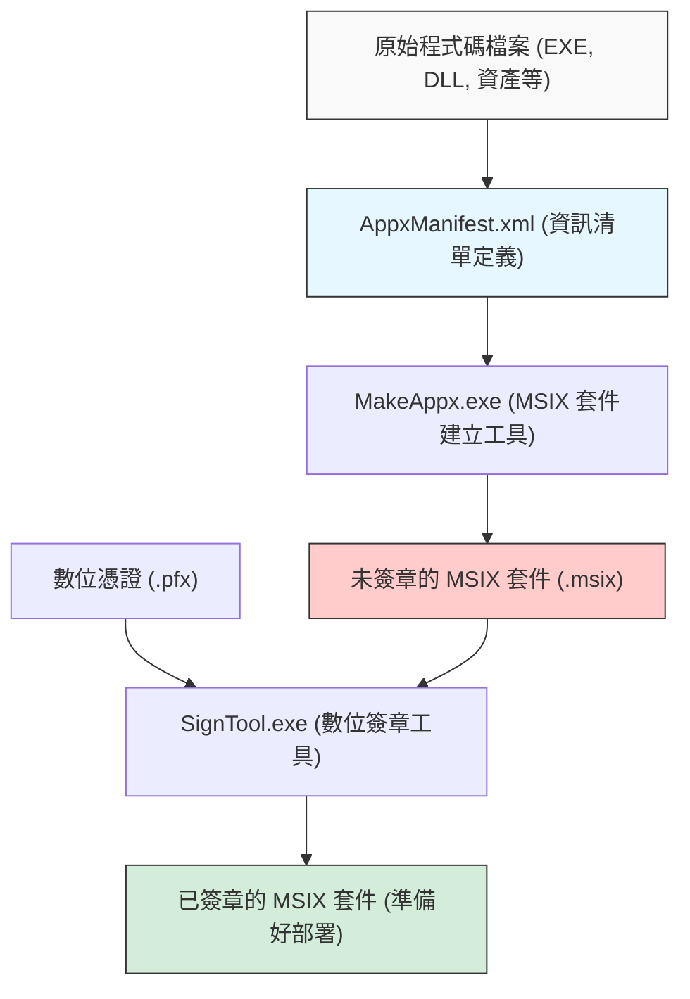
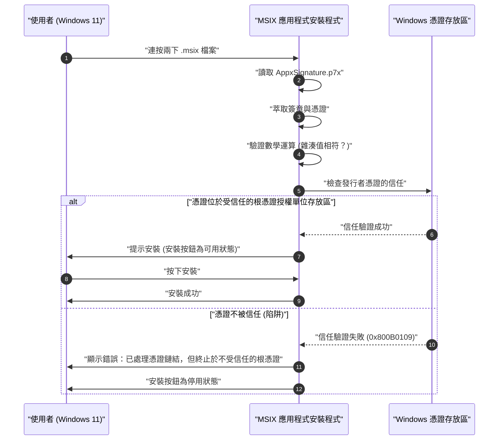

在 Windows 11 的時代，做為應用程式的散佈格式，「MSIX」正逐漸成為標準的選擇。傳統的 MSI 或 EXE 等安裝程式存在許多問題，而 MSIX 則被寄予厚望，成為解決這些問題的次世代套件技術。然而，當開發者實際製作 MSIX 套件，並試圖在組織內部或測試環境中進行側載（Sideloading）時，經常會陷入「自簽章憑證的陷阱」。

本文將從 MSIX 的技術細節、使用 Visual Studio 或命令列工具製作套件的方法，到許多開發者所面臨的自簽章憑證錯誤原因與解決方案，進行非常詳細的解說。我們希望能成為 Windows 應用程式開發者、基礎架構管理員以及套件負責人的必讀指南。

## 1. 什麼是 MSIX？與傳統 MSI/EXE 的比較

MSIX 是由 Microsoft 所提供、專為 Windows 設計的最新應用程式套件格式。它整合了以往存在的 MSI (Microsoft Installer)、以 .exe 為基礎的自訂安裝程式、App-V (Application Virtualization)，以及自 Windows 8 起導入的 AppX (通用 Windows 平台應用程式的套件) 中所有優良的功能與概念，並針對現代的安全性和部署需求進一步進化。

### 傳統安裝程式 (MSI/EXE) 的問題
長年做為 Windows 標準安裝格式的 MSI 與 EXE，存在以下根本性的問題：

1. **Win Rot (Windows 劣化) 現象**：隨著應用程式的重複安裝與解除安裝，登錄檔中會殘留不必要的機碼，且系統資料夾 (如 `C:\Windows\System32`) 中也會遺留 DLL 檔案。這將導致作業系統本身的運作逐漸變慢並產生不穩定的現象。
2. **DLL 地獄 (DLL Hell)**：當多個應用程式試圖將同名 (但版本不同) 的 DLL 安裝到共用系統目錄時，後安裝的應用程式會覆寫現有的 DLL，導致先安裝的應用程式無法正常運作。
3. **自訂動作帶來的不穩定性**：在 MSI 套件中，被稱為「自訂動作」的任意指令碼或程式碼可以在安裝與解除安裝期間以系統權限執行。這會帶來安裝程式中途當機或導致系統發生預期外設定變更的風險。

### MSIX 的容器化架構解決方案
MSIX 透過將應用程式放入輕量級的「容器」內執行，來解決這些問題。此容器化方法具有以下巨大的優勢：

- **乾淨的解除安裝**：透過 MSIX 安裝的應用程式，其對檔案系統與登錄檔的寫入都會被虛擬化 (VFS: 虛擬檔案系統, VReg: 虛擬登錄檔)。因此，解除安裝時會將此虛擬化的容器整個刪除，不會在系統上留下任何垃圾 (殘骸)。完全防止 Win Rot 現象。
- **隔離與安全性 (Isolation)**：各個應用程式都在自己的環境內執行，不會直接破壞其他應用程式的 DLL 或資源。從此擺脫 DLL 地獄。
- **網路頻寬的最佳化**：MSIX 的更新機制非常優秀，支援區塊層級的差異更新 (Differential Update)。由於僅下載二進位資料中被變更的少數區塊，即使是大型應用程式的更新，也能將對網路的負擔降至最低。
- **確實的安裝狀態**：套件內含資訊清單檔案 (`AppxManifest.xml`)，安裝的交易會由作業系統層級嚴密管理。若發生失敗，將完全復原至原始狀態。

## 2. MSIX 套件製作的全貌與工具鏈

製作 MSIX 套件大致可分為兩種方法。一種是使用 Visual Studio 的整合開發環境 (IDE)，另一種則是善用 Windows SDK 隨附的命令列工具 (`MakeAppx.exe` 與 `SignTool.exe`)。

以下的 Mermaid 區塊圖展示了從原始程式碼檔案到最終產生已簽章 MSIX 套件的程序。



從這個程序可以看出，單純收集檔案並封裝（封裝化）是不夠的，必須要有「數位簽章」的步驟。基於安全考量，Windows 11 完全不允許安裝未簽章的 MSIX 套件。

## 3. 方法 A：使用 Visual Studio 製作 MSIX

最簡單且最常見的方法是使用 Visual Studio 的「Windows 應用程式封裝專案 (Windows Application Packaging Project - WAP)」。只要使用此專案範本，不論是 WPF、Windows Forms、WinUI 3，甚至是 C++ 的舊版 Win32 應用程式，都能輕鬆轉換成 MSIX。

### 逐步指南
1. **新增 WAP 專案**：在現有的 Visual Studio 方案按右鍵，從「加入新的專案」中選擇「Windows 應用程式封裝專案」。
2. **選擇目標平台**：指定應用程式支援的 Windows 10/11 的最低版本與目標版本。
3. **參考應用程式**：以滑鼠右鍵按一下封裝專案的「應用程式」節點，從「加入參考」中選擇想要封裝的主要專案 (例如 WPF 專案)。
4. **設定資訊清單**：連按兩下 `Package.appxmanifest` 檔案，開啟視覺化設計工具。在這裡設定應用程式的顯示名稱、說明、標誌圖片，以及最重要的「套件名稱 (Identity Name)」與「發行者 (Publisher)」。
5. **建立套件**：在專案上按一下滑鼠右鍵，選擇「發佈」->「建立應用程式套件」。選擇「側載」，並選擇架構 (x64, ARM64 等)，Visual Studio 就會自動包辦編譯、透過 `MakeAppx` 進行封裝，以及自簽章憑證的產生與簽章。

雖然過程非常順暢，但如果在此處使用了 Visual Studio 自動產生的自簽章憑證 (Test Certificate)，將會陷入後述的「陷阱」中。

## 4. 方法 B：使用命令列 (MakeAppx.exe) 製作

在 CI/CD 管線的自動化，或是手動將現有安裝程式的檔案群重新封裝時，就需要命令列工具。只要安裝了 Windows SDK 的環境，就能從開發人員命令提示字元存取以下工具。

### 1. 準備資訊清單檔案
在套件的根目錄中，建立一個寫有最低限度資訊的 `AppxManifest.xml`。

```xml
<?xml version="1.0" encoding="utf-8"?>
<Package xmlns="http://schemas.microsoft.com/appx/manifest/foundation/windows10"
         xmlns:uap="http://schemas.microsoft.com/appx/manifest/uap/windows10"
         xmlns:rescap="http://schemas.microsoft.com/appx/manifest/foundation/windows10/restrictedcapabilities">
  
  <Identity Name="MyCompany.AwesomeApp"
            Publisher="CN=MyCompany Self-Signed, O=MyCompany"
            Version="1.0.0.0"
            ProcessorArchitecture="x64" />
  
  <Properties>
    <DisplayName>Awesome App</DisplayName>
    <PublisherDisplayName>My Company</PublisherDisplayName>
    <Logo>Assets\StoreLogo.png</Logo>
  </Properties>
  
  <Resources>
    <Resource Language="en-us" />
    <Resource Language="ja-jp" />
  </Resources>
  
  <Dependencies>
    <TargetDeviceFamily Name="Windows.Desktop" MinVersion="10.0.17763.0" MaxVersionTested="10.0.22000.0" />
  </Dependencies>
  
  <Capabilities>
    <rescap:Capability Name="runFullTrust" />
  </Capabilities>
  
  <Applications>
    <Application Id="AwesomeApp" Executable="AwesomeApp.exe" EntryPoint="Windows.FullTrustApplication">
      <uap:VisualElements DisplayName="Awesome App"
                          Description="The best app ever."
                          BackgroundColor="transparent"
                          Square150x150Logo="Assets\Square150x150Logo.png"
                          Square44x44Logo="Assets\Square44x44Logo.png">
      </uap:VisualElements>
    </Application>
  </Applications>
</Package>
```
這裡最重要的一點是，`<Identity Publisher="..." />` 的值必須與稍後用於簽章的憑證的 Subject 完全一致。

### 2. 透過 MakeAppx 進行封裝
在命令提示字元中執行以下命令，將目錄封裝成 MSIX 檔案。

```cmd
MakeAppx.exe pack /d "C:\Path\To\AppFolder" /p "C:\Path\To\Output\AwesomeApp_1.0.0.0_x64.msix"
```
這樣未簽章的 MSIX 檔案就完成了，但在此狀態下無法安裝到 Windows 上。

## 5. 數位簽章與密碼學的數學背景

為了深入理解為何 MSIX 套件需要簽章，我們必須了解數位簽章背後的密碼學機制。數位簽章保證了套件「確實是由指定的發行者所建立 (認證)」以及「建立後到目前為止未被第三方竄改 (完整性)」。

MSIX 的簽章通常結合了 RSA 加密與 SHA-256 (Secure Hash Algorithm 256-bit)。

### 套用雜湊函數
首先，將整個 MSIX 套件的二進位檔 (內容物) 視為訊息 $M$。簽章工具 (SignTool.exe) 會對此訊息 $M$ 套用密碼編譯雜湊函數 SHA-256，計算出固定長度 (256 位元) 的雜湊值 $H(M)$。

### 產生簽章 (發行者)
接著，發行者會使用自身的「私鑰 (Private Key)」$d$ 將雜湊值加密，產生數位簽章 $\sigma$。在 RSA 演算法的脈絡下，這可表示為如下的模組指數運算：

$$ \sigma \equiv (H(M))^d \pmod n $$

這裡的 $n$ 是 RSA 模數 (兩個巨大質數的乘積)。包含此簽章 $\sigma$ 與發行者「公鑰 (Public Key)」$e$ 的憑證 (X.509 格式)，將做為 MSIX 套件的一部分 (`AppxSignature.p7x`) 被嵌入其中。

### 驗證簽章 (Windows OS)
當使用者嘗試安裝 MSIX 時，Windows OS 會從套件內的憑證中取出公鑰 $e$，並執行以下計算以還原雜湊值 $H'(M)$：

$$ H'(M) \equiv \sigma^e \pmod n $$

同時，OS 會自行對下載的整個 MSIX 套件 $M$ 重新計算雜湊值 $H(M)$。
最後，驗證還原的雜湊值與重新計算的雜湊值是否相等 ($H(M) = H'(M)$)。若此等式成立，就等於在數學上證明了「檔案在簽章後連 1 位元都沒有被竄改」。

## 6. 最大的障礙：「自簽章憑證的陷阱」

即使上述的數學證明完美無缺，Windows 11 也無法僅憑藉這一點就允許安裝。因為它必須驗證『信任的鏈結 (Chain of Trust)』，也就是「該公鑰 (憑證) 的擁有者，是否真的是其所宣稱的安全組織或人員？」。

如果憑證是由 VeriSign 或 DigiCert 等已被 OS 預先信任的公開根憑證授權單位 (Root CA) 所發行，就能順利安裝 (透過 Microsoft Store 發佈的應用程式也同樣受到 Microsoft 根憑證的信任)。

然而，在開發中或做為公司內部專用工具等情況下，若無法負擔購買公開憑證的成本，開發者就會自行核發憑證。這就是「自簽章憑證 (Self-Signed Certificate)」。

以下的循序圖展示了嘗試安裝以自簽章憑證簽署的 MSIX 套件時，OS 的行為模式。



這正是所謂的「陷阱」。儘管開發者自行建立並正確簽署了套件，但在 Windows 11 的預設狀態下，因為它不認識（不信任）該自簽章憑證，所以會伴隨錯誤代碼 `0x800B0109` 而阻擋安裝。安裝程式的「安裝」按鈕會呈現灰色而無法點擊。

許多開發者在面臨這個錯誤時，會陷入「MSIX 滿是錯誤」、「一定是設定錯了」而反覆修改資訊清單檔案的迷宮中，但問題並不在於套件的結構，而是在於是否已將憑證登錄到 OS 的憑證存放區 (Certificate Store)。

## 7. 解決方案：使用 PowerShell 建立與部署自簽章憑證

為了解決這個問題，必須確實執行以下兩個步驟：
1. 建立有效的自簽章憑證，並匯出包含私鑰的 PFX 檔案。
2. 將所建立憑證的公鑰部分 (CER 檔案)，安裝到所有目標 PC 的**「受信任的根憑證授權單位 (Trusted Root Certification Authorities)」存放區**中。

透過使用 PowerShell，就能確實且自動地處理這些工作。

### 步驟 1：建立與匯出自簽章憑證

首先以系統管理員權限啟動 PowerShell，執行以下指令碼來建立憑證。在這裡，我們將產生專用於程式碼簽章 (Code Signing) 的憑證。

```powershell
# 1. 參數定義
$SubjectName = "CN=MyCompany Self-Signed, O=MyCompany"
$CertStoreLocation = "Cert:\CurrentUser\My"

# 2. 產生自簽章憑證 (程式碼簽章用途: 1.3.6.1.5.5.7.3.3)
$Cert = New-SelfSignedCertificate -Type Custom `
    -Subject $SubjectName `
    -KeyUsage DigitalSignature `
    -FriendlyName "MyCompany MSIX Signing Cert" `
    -CertStoreLocation $CertStoreLocation `
    -TextExtension @("2.5.29.37={text}1.3.6.1.5.5.7.3.3", "2.5.29.19={text}")

Write-Host "已產生憑證。指紋 (Thumbprint): $($Cert.Thumbprint)"

# 3. 建立匯出 PFX (含私鑰) 用的密碼
$Password = ConvertTo-SecureString -String "YourSecurePassword123!" -Force -AsPlainText

# 4. 匯出 PFX 檔案 (供 SignTool 簽章用)
$PfxPath = "C:\Path\To\Output\MyCompanyCert.pfx"
Export-PfxCertificate -Cert $Cert -FilePath $PfxPath -Password $Password

# 5. 匯出 CER (僅含公鑰) (供安裝至用戶端 PC 用)
$CerPath = "C:\Path\To\Output\MyCompanyCert.cer"
Export-Certificate -Cert $Cert -FilePath $CerPath
```

使用此處建立的 `$PfxPath` 檔案，為 MSIX 套件進行簽章。

```cmd
SignTool.exe sign /fd SHA256 /a /f "C:\Path\To\Output\MyCompanyCert.pfx" /p "YourSecurePassword123!" "C:\Path\To\Output\AwesomeApp_1.0.0.0_x64.msix"
```

### 步驟 2：將憑證安裝至用戶端 PC (解除陷阱)

即使將已簽章的 MSIX 帶到另一台 PC (或虛擬環境)，直接連按兩下也如前所述無法安裝。必須在事前 (或同時) 將剛才匯出的 `$CerPath` 檔案安裝到「本機電腦」的「受信任的根憑證授權單位」。

為此，請在部署目標的 PC 上開啟**具備系統管理員權限**的 PowerShell，並執行以下命令。

```powershell
# CER 檔案的路徑
$CerPath = "C:\Path\To\Output\MyCompanyCert.cer"

# 匯入至本機電腦的「受信任的根憑證授權單位」
Import-Certificate -FilePath $CerPath -CertStoreLocation "Cert:\LocalMachine\Root"

Write-Host "已將憑證安裝至受信任的根憑證授權單位。"
```

> [!CAUTION]
> 要新增至「本機電腦 (`LocalMachine`)」的根憑證授權單位存放區，必須具備系統管理員權限。如果放進使用者個人的存放區 (`CurrentUser`)，可能會因為 App Installer 權限情境的緣故而無法被識別，請務必注意。

此指令碼成功執行後，請嘗試再次連按兩下剛才發生錯誤的 MSIX 檔案。錯誤訊息會宛如施了魔法般消失，並顯示鮮豔藍色、處於可用狀態的「安裝」按鈕。如此一來便成功完全突破了「自簽章憑證的陷阱」。

## 8. 企業環境中的維運與最佳實務

如果是開發者的本機測試，上述步驟已經足夠，但若要將側載應用程式部署到公司內數十台、數百台的 PC 上，要求每位使用者執行憑證安裝指令碼是不切實際的，且伴隨著安全風險。

企業環境中的最佳實務如下：

### 1. 活用 Active Directory 群組原則 (GPO)
若公司內部有導入 Active Directory，可以使用 GPO 的「公開金鑰原則」，將自簽章憑證 (CER 檔案) 自動派發到所有加入網域的 PC 的「受信任的根憑證授權單位」。透過此方式，員工完全不需意識到憑證的存在，只需連按兩下共用資料夾上的 MSIX 檔案即可安裝。

### 2. 透過 Microsoft Intune (MDM) 部署
在現代化的環境中，會使用 Microsoft Intune 來進行裝置管理。在 Intune 中，可以使用「組態設定檔」功能將受信任的憑證 (.cer) 推送傳遞至端點。之後，即可將 MSIX 套件本身以無訊息安裝的方式做為企業營運 (LOB) 應用程式來部署。

### 3. 透過 App Installer 檔案 (.appinstaller) 自動更新
MSIX 具備強大的自動更新應用程式功能。只要建立以 XML 為基礎的 `.appinstaller` 檔案，並將其放置在網頁伺服器或 SMB 共用資料夾上，就能在應用程式啟動時於背景檢查是否有新版本的 MSIX，並自動套用更新。

```xml
<?xml version="1.0" encoding="utf-8"?>
<AppInstaller
    Uri="https://internal.mycompany.com/apps/AwesomeApp.appinstaller"
    Version="1.0.0.0"
    xmlns="http://schemas.microsoft.com/appx/appinstaller/2018">
    <MainPackage
        Name="MyCompany.AwesomeApp"
        Publisher="CN=MyCompany Self-Signed, O=MyCompany"
        Version="1.0.0.0"
        ProcessorArchitecture="x64"
        Uri="https://internal.mycompany.com/apps/AwesomeApp_1.0.0.0_x64.msix" />
    <UpdateSettings>
        <OnLaunch HoursBetweenUpdateChecks="0" />
    </UpdateSettings>
</AppInstaller>
```
將此檔案派發給使用者安裝後，未來只需替換伺服器上的 MSIX 檔案並更新 `.appinstaller` 的版本號碼，所有使用者的應用程式就會自動更新。

## 9. 疑難排解：與憑證相關的常見錯誤

最後，在此彙整其他與憑證或簽章相關、可能會發生的常見錯誤與解決方案。

- **0x800B0101**：用於簽章的憑證已過期。請重新核發新的憑證，或在簽章時使用時間戳記伺服器 (例如：`http://timestamp.digicert.com`)，以證明簽章是在憑證有效期間內進行的 (只要加上時間戳記，即使憑證本身過期，該簽章仍會被視為有效)。
- **0x80080204**：`AppxManifest.xml` 中記載的 `Publisher` 值與憑證的 `Subject` 值沒有完全一致。請嚴格確認字串是否完全相符，例如逗號後是否有空白等。
- **檢查事件檢視器**：要尋找錯誤更詳細的原因，開啟 Windows 的事件檢視器，並檢查「應用程式及服務記錄檔」->「Microsoft」->「Windows」->「AppxPackagingOM」或「AppXDeployment-Server」的記錄檔，這點非常重要。

## 10. 總結

面向 Windows 11 的 MSIX 封裝是一項強大的技術，能夠飛躍性地提升應用程式的生命週期管理。能從 Win Rot 與 DLL 地獄中解脫，提供使用者乾淨又安全的環境。

另一方面，由於安全模型變得更為嚴格，對於數位簽章與憑證「信任鏈結」的深入理解是不可或缺的。「自簽章憑證的陷阱」可說是初次接觸 MSIX 技術的開發者幾乎必然會面臨的難關。只要理解本文所解說的憑證產生、匯出，以及匯入適當存放區的機制，並活用指令碼或 GPO 來進行自動化，就能引出 MSIX 的最大潛力，實現順暢的部署。

請務必善用這些知識，建構次世代的乾淨 Windows 應用程式散佈環境。
