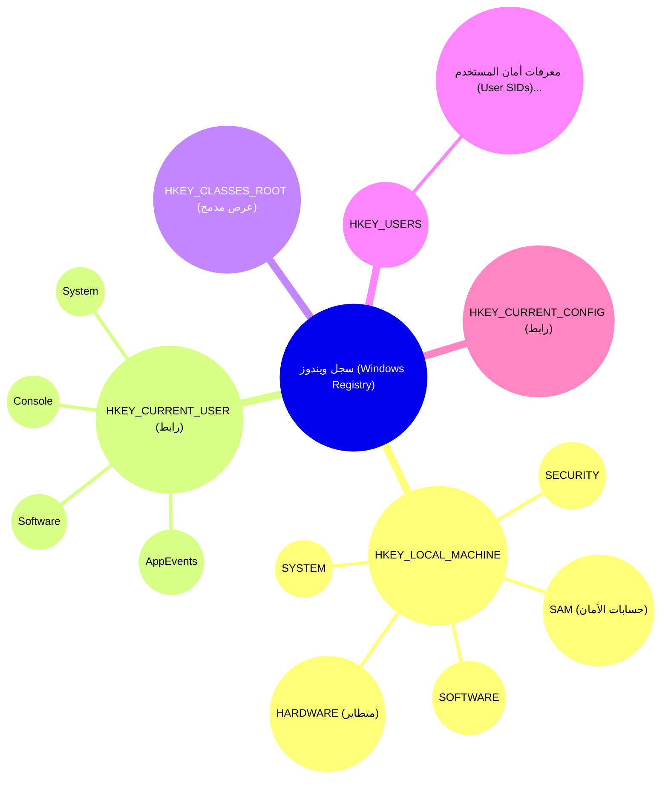
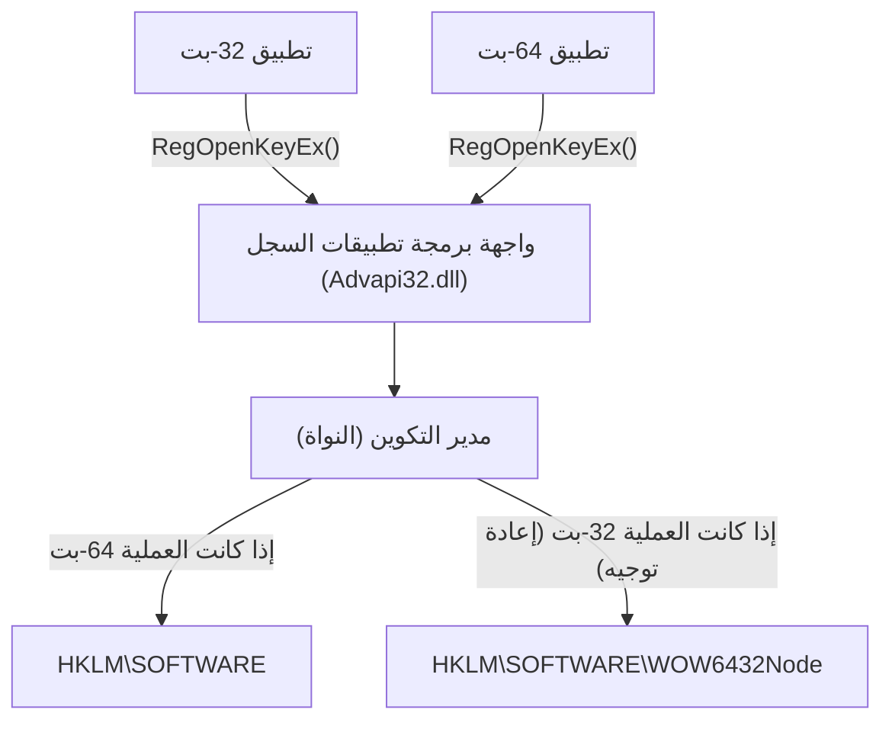
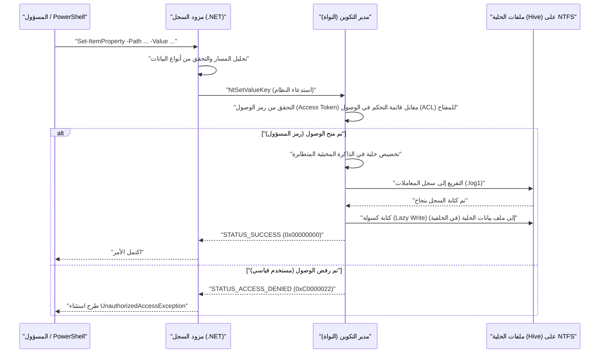

# أساسيات سجل ويندوز (Windows Registry) وطرق التحرير الآمنة والقابلة للبرمجة

في نظام التشغيل ويندوز (Windows)، يُعد "السجل" (Registry) قاعدة بيانات هرمية ضخمة تخزن التكوينات والإعدادات المختلفة للنظام والتطبيقات. في هذه المقالة، سنشرح بالتفصيل الشديد كل شيء بدءًا من البنية الأساسية لسجل ويندوز، ووصولاً إلى طرق التحرير الآمنة والقابلة للبرمجة باستخدام PowerShell و C#.

## 1. مقدمة: تاريخ وتطور سجل ويندوز

في الإصدارات الأولى من ويندوز (عصر Windows 3.x)، كانت إعدادات النظام والتطبيقات تُحفظ بشكل أساسي في ملفات `.ini` (ملفات التهيئة). ومع ذلك، أصبحت ملفات INI التي لا تعد ولا تحصى متناثرة في جميع أنحاء النظام لكل تطبيق، مما جعل الإدارة معقدة للغاية. بالإضافة إلى ذلك، نظرًا لأن ملفات INI تعتمد على النصوص العادية، كان من الصعب تخزين البيانات الثنائية (Binary data)، ولم تكن هناك آلية للتحكم في الوصول (الأمان). كما كانت سرعة تحليل الملفات بطيئة، مما جعلها غير مناسبة لتخزين الإعدادات واسعة النطاق.

لحل هذه المشكلات بشكل جذري، ومنذ نظامي التشغيل Windows NT و Windows 95 وما بعدهما، تم اعتماد "السجل" (Registry) بشكل كامل كقاعدة بيانات مركزية للإعدادات. السجل عبارة عن قاعدة بيانات هرمية توفر كتابة قوية (Strong typing)، ودعمًا للبيانات الثنائية، وميزات أمان قوية من خلال قوائم التحكم في الوصول (ACL). بفضل هذا، أصبح بإمكان أي مكون، من نواة نظام التشغيل (OS Kernel) إلى تطبيقات مساحة المستخدم (User-space applications)، قراءة الإعدادات وكتابتها من خلال واجهة موحدة (مجموعة دوال `Reg*` في واجهة برمجة تطبيقات Win32).

وحتى في نظام Windows 11 الحديث، لا يزال السجل يعمل كقلب نظام التشغيل. يتم تجميع كافة البيانات الوصفية (Metadata) اللازمة لتشغيل النظام في السجل، بما في ذلك تكوين الأجهزة، وترتيب تحميل برامج تشغيل الأجهزة (Device drivers)، وبيئة سطح مكتب المستخدم، وقائمة البرامج المثبتة.

## 2. عمق البنية: الكيانات الحقيقية لخلايا السجل (Registry Hives) وتعيين الذاكرة (Memory Mapping)

على الرغم من أن السجل يبدو منطقيًا كبنية شجرة (Tree) ضخمة واحدة، إلا أنه فعليًا مقسم إلى عدة ملفات تسمى "الخلايا" (Hives) ويتم تخزينها على القرص. هذا يفصل بين إعدادات النظام بالكامل وإعدادات المستخدم الخاصة، مما يتيح تحميلًا فعالاً.

توجد ملفات الخلايا الرئيسية عادةً في دليل `%SystemRoot%\System32\config`.
- `SYSTEM`: الإعدادات المهمة اللازمة لتمهيد نظام التشغيل (برامج التشغيل، الخدمات، تكوين التمهيد، إلخ).
- `SOFTWARE`: إعدادات النظام بالكامل للبرامج المثبتة. توجد هنا معظم إعدادات تطبيقات الجهات الخارجية.
- `SAM`: مدير حسابات الأمان (حسابات المستخدمين المحليين وتجزئات كلمات المرور).
- `SECURITY`: سياسات الأمان المحلية وتعيين الصلاحيات.
- `DEFAULT`: ملف تعريف المستخدم الافتراضي (قالب عند إنشاء مستخدم جديد).

توجد ملفات خلايا المستخدم الفردية كملفات مخفية في دليل ملف تعريف المستخدم (مثال: `C:\Users\Username`).
- `NTUSER.DAT`: الإعدادات الأساسية لذلك المستخدم (معظم محتويات HKCU).
- `UsrClass.dat`: إعدادات اقتران امتدادات الملفات لذلك المستخدم (موجودة في `AppData\Local\Microsoft\Windows`).

يتم تعيين هذه الملفات في ذاكرة تجمع صفحات النواة (Kernel page pool memory) بواسطة "مدير التكوين" (Configuration Manager - CM) الخاص بالنواة عند بدء تشغيل نظام التشغيل. مدير التكوين هو مكون يعمل في وضع النواة (Kernel-mode) ويعالج طلبات القراءة والكتابة في السجل.

ما يستحق الذكر هو أنه ليست كل بيانات السجل موجودة على القرص. على سبيل المثال، الخلية `HARDWARE` متطايرة (Volatile) ولا يتم حفظها على الإطلاق في أي ملف على القرص. في كل مرة يبدأ فيها تشغيل نظام التشغيل ويكتشف مدير "التوصيل والتشغيل" (PnP) الأجهزة، يتم إعادة بنائها ديناميكيًا في الذاكرة.

علاوة على ذلك، لزيادة موثوقية السجل، تطبق أحدث إصدارات ويندوز تسجيل المعاملات (Transaction logging). لا تتم كتابة التغييرات التي تطرأ على ملفات الخلايا مباشرة في ملف البيانات، بل يتم تسجيلها أولاً في سجل المعاملات (`.log1`، `.log2`). يمنع هذا تلف البيانات (Corruption) في حالة الانقطاع المفاجئ للتيار الكهربائي أو تعطل النظام أثناء الكتابة، ويضمن سلامة قاعدة البيانات بشكل قريب من خصائص ACID.

## 3. البنية الهرمية لمفاتيح وقيم السجل

يتمتع السجل ببنية هرمية تشبه إلى حد كبير نظام الملفات. تُسمى العقدة (Node) الجذرية "المفتاح الجذري" (Root Key) أو "الخلية" (Hive)، وتُخزن تحتها "المفاتيح" (Keys)، و"المفاتيح الفرعية" (Subkeys)، و"القيم" (Values) التي تمثل البيانات الفعلية. من الأسهل فهمها إذا اعتبرت أن المفاتيح تقابل الأدلة (Directories) والقيم تقابل الملفات.

تُصنف المفاتيح الجذرية الرئيسية إلى الخمسة التالية:

1. **HKEY_LOCAL_MACHINE (HKLM)**: يُخزن إعدادات النظام والبرامج التي تنطبق على الكمبيوتر بالكامل (جميع المستخدمين). يتطلب التعديل صلاحيات المسؤول (Administrator).
2. **HKEY_CURRENT_USER (HKCU)**: يُخزن الإعدادات الخاصة بالمستخدم الذي قام بتسجيل الدخول حاليًا. في الواقع، هذه ليست قاعدة بيانات مستقلة، بل هي مجرد ارتباط رمزي (Symbolic link / Alias) لمفتاح المعرف الأمني (SID) الخاص بالمستخدم المعني ضمن `HKEY_USERS`.
3. **HKEY_CLASSES_ROOT (HKCR)**: يُخزن اقترانات امتدادات الملفات، ومعلومات تسجيل فئات COM (نموذج كائن المكون)، وامتدادات واجهة المستخدم (Shell extensions). هذا المفتاح خاص؛ فهو عرض افتراضي (Virtual view) يتم فيه دمج (Merge) `HKLM\SOFTWARE\Classes` (للنظام بالكامل) و `HKCU\Software\Classes` (للمستخدم الحالي) بواسطة مدير التكوين. في حالة وجود تعارض، تُعطى الأولوية لإعدادات المستخدم الخاصة (HKCU).
4. **HKEY_USERS (HKU)**: يُخزن إعدادات جميع ملفات تعريف المستخدمين على النظام (تلك المحملة حاليًا في الذاكرة). يتم تنظيمه هرميًا بناءً على معرفات الأمان (SIDs).
5. **HKEY_CURRENT_CONFIG (HKCC)**: الإعدادات المتعلقة بملف تعريف الأجهزة الحالي. وهو في الواقع رابط إلى `HKLM\SYSTEM\CurrentControlSet\Hardware Profiles\Current`.

يمكن تصور هذه البنية الهرمية المعقدة وعلاقات الارتباط على النحو التالي:



## 4. أنواع بيانات السجل (شرح مفصل)

كل "قيمة" في السجل لها نوع بيانات محدد بدقة. عند التعامل مع السجل برمجيًا، من الضروري فهم هذه الأنواع بشكل صحيح وكتابة البيانات بالنوع المناسب. ستؤدي الكتابة بنوع خاطئ إلى رمي التطبيقات لاستثناءات (Exceptions) أو التسبب في توقف ميزات نظام التشغيل.

- **REG_SZ (قيمة سلسلة)**: نوع البيانات الأكثر شيوعًا. يخزن سلسلة نصية Unicode (UTF-16LE) منتهية بحرف NULL. يُستخدم لمسارات الملفات، وعناوين URL، وأسماء العرض في واجهة المستخدم، وما إلى ذلك.
- **REG_DWORD (قيمة عدد صحيح 32-بت)**: قيمة عدد صحيح غير إشارة (Unsigned integer) بحجم 32-بت (4 بايت). يُستخدم بشكل متكرر للقيم المنطقية (0 = معطل، 1 = ممكّن)، وقيم انتهاء المهلة بالمللي ثانية، وإعدادات رموز الخطأ. نظرًا لأن ويندوز يستخدم بنية Little Endian، فإنه يتم حفظه على القرص بدءًا من البايت الأقل أهمية (مثال: 0x12345678 يُحفظ كـ `78 56 34 12`).
- **REG_QWORD (قيمة عدد صحيح 64-بت)**: قيمة عدد صحيح بحجم 64-بت (8 بايت). مع انتشار معمارية 64-بت، يُستخدم لحفظ الأرقام الضخمة (مثل الحصص النسبية للقرص وتحديد حجم الذاكرة الكبيرة) وإعدادات حجم المؤشرات (Pointers).
- **REG_MULTI_SZ (قيمة سلسلة متعددة الأسطر)**: يخزن سلاسل نصية متعددة منتهية بحرف NULL بشكل متتابع، وينتهي في النهاية بحرف NULL إضافي فارغ (Double NULL). يُعد مناسبًا لتخزين بيانات تشبه المصفوفات (Arrays)، مثل قوائم عناوين IP، وقوائم الخدمات ذات التبعيات، وترتيب الارتباط (Binding order).
- **REG_EXPAND_SZ (قيمة سلسلة قابلة للتوسيع)**: نوع سلسلة خاص يتضمن سلاسل متغيرات البيئة غير الموسعة (Unexpanded) مثل `%USERPROFILE%` أو `%SystemRoot%`. عند قيام أحد التطبيقات بقراءتها عبر واجهة برمجة التطبيقات `RegQueryValueEx`، أو باستدعاء واجهة برمجة التطبيقات `ExpandEnvironmentStrings`، يتم توسيعها ديناميكيًا بواسطة نظام التشغيل إلى المسار المطلق الفعلي.
- **REG_BINARY (قيمة ثنائية)**: دفق بيانات ثنائية خام عشوائية. يخزن كلمات المرور المشفرة (مثل LSA Secrets)، والشهادات الرقمية، والهياكل المعقدة الخاصة بالتطبيقات، والبيانات المتسلسلة (Serialized data).
- **REG_NONE**: بيانات غير محددة النوع. نادر الاستخدام جدًا، لكنه يُستخدم في مناطق الحجز لمفاتيح التشفير وما إلى ذلك.
- **REG_RESOURCE_LIST** / **REG_FULL_RESOURCE_DESCRIPTOR**: أنواع متقدمة خاصة بالنواة (Kernel) تُستخدم بواسطة برامج تشغيل الأجهزة لتسجيل معلومات تخصيص موارد الأجهزة (طلبات المقاطعة IRQ، ومنافذ الإدخال/الإخراج I/O ports، وقنوات الوصول المباشر للذاكرة DMA).

## 5. النموذج الرياضي للسجل وأداؤه في نظام التشغيل

نظرًا لأن السجل يرتبط ارتباطًا مباشرًا بأداء نظام التشغيل (خاصة وقت التمهيد وسرعة تهيئة العمليات)، فقد تم تحسينه داخليًا باستخدام بنية بيانات متقدمة تشبه شجرة-B (B-Tree) تسمى "مؤشر الخلية" (Cell Index).

### التعقيد الزمني للبحث (Time Complexity)
يعتمد التعقيد الزمني $T_{\text{search}}$ عند البحث عن مفتاح معين (مسار) في السجل على عمق الشجرة وعدد العقد (Nodes) في كل مستوى. عند البحث في مفتاح فرعي ذي عمق $d$ (مثال: `A\B\C\D` يعني $d=4$)، يمكن نمذجة التعقيد نظريًا على النحو التالي:

$$
T_{\text{search}}(d, L) = \sum_{i=1}^{d} O(\log(C_i) \cdot L_i)
$$

هنا، $C_i$ هو عدد العقد التابعة (المفاتيح الفرعية أو القيم) في العمق $i$، و $L_i$ هو طول السلسلة (عدد الأحرف) التي تتم مقارنتها. داخل ملف الخلية الذي يمثل كيان السجل، يتم الاحتفاظ بقائمة المفاتيح الفرعية كفهرس مرتب أبجديًا أو بقيم التجزئة (Hash values) للأسماء. لذلك، بدلاً من البحث الخطي البسيط $O(C_i)$، يمكن إجراء بحث ثنائي (Binary Search) $O(\log(C_i))$، مما يحقق وصولاً سريعًا للغاية حتى لو كان هناك عشرات الآلاف من المفاتيح الفرعية ضمن مفتاح واحد.

### البصمة التخزينية (Space Complexity)
يتم حساب الحجم الإجمالي للسجل (المساحة المشغولة على القرص الفعلي) كمجموع جميع الخلايا.

$$
\text{Size}_{\text{Total}} = \sum_{h \in \text{Hives}} \left( N_{h} \times S_{\text{key\_metadata}} + \sum_{v \in h} S_{\text{value}}(v) \right) + S_{\text{overhead}}
$$

$N_h$ هو عدد المفاتيح في الخلية $h$، و $S_{\text{key\_metadata}}$ هو حجم البيانات الوصفية لكل مفتاح (مثل الطابع الزمني لآخر كتابة، ومؤشر إلى واصف الأمان، ومؤشر إلى المفتاح الأصل، إلخ)، و $S_{\text{value}}(v)$ هو حجم الحمولة للقيمة $v$. يتم أيضًا تضمين النفقات الإضافية $S_{\text{overhead}}$ الناتجة عن سجلات المعاملات والخلايا الفارغة التي لم يعد يُحتاج إليها (التجزئة - Fragmentation). إذا تركت بيانات غير ضرورية (مثل بقايا البرامج التي لم يتم إلغاء تثبيتها بالكامل) في السجل لفترة طويلة، فستزيد هذه البصمة، مما يضغط على ذاكرة تجمع صفحات نظام التشغيل ويؤدي إلى انخفاض الأداء.

## 6. مخاطر التحرير اليدوي واحتمالات التلف التي تهدد استقرار النظام

يجب اعتبار التحرير اليدوي باستخدام محرر السجل (`regedit.exe`) بمثابة الملاذ الأخير لإدارة النظام. لا يحتوي السجل على ميزة "تراجع" (Undo) كما هو الحال في محررات المستندات العامة، ويتم تطبيق تغييرات القيم أو حذف المفاتيح فورًا على النظام عبر مدير التكوين.

على وجه الخصوص، إذا قمت بالخطأ بتحرير أو حذف حرف واحد فقط من المفاتيح الحرجة (Critical keys) الضرورية لبدء تشغيل النظام (على سبيل المثال، إعدادات برامج تشغيل وحدة تحكم القرص تحت `HKLM\SYSTEM\CurrentControlSet\Services`، أو قيمة `Userinit` في `HKLM\SOFTWARE\Microsoft\Windows NT\CurrentVersion\Winlogon`)، فهناك خطر قاتل يتمثل في تعطل نظام التشغيل وظهور شاشة الموت الزرقاء (BSoD) أو عدم القدرة على تجاوز شاشة تسجيل الدخول (الشاشة السوداء).

### النموذج الرياضي لاحتمالية التلف
لنفكر في احتمالية حدوث فشل في النظام إذا تم تغيير المفاتيح أو حذفها عشوائيًا في السجل. لنفترض أن مجموعة المفاتيح الحرجة الضرورية لكي يعمل النظام بشكل طبيعي هي $C$، وإجمالي عددها هو $N_c = |C|$. ولنفترض أن إجمالي عدد المفاتيح في السجل بأكمله هو $N_{\text{total}}$.
إذا قمنا بحذف أو إتلاف عدد $k$ من المفاتيح بشكل عشوائي، فإن احتمالية إتلاف مفتاح حرج واحد على الأقل $P_{\text{failure}}$ يمكن التعبير عنها من خلال حساب احتمالية العينة بدون إرجاع (Sampling without replacement) على النحو التالي:

$$
P_{\text{failure}} = 1 - \frac{\binom{N_{\text{total}} - N_c}{k}}{\binom{N_{\text{total}}}{k}} = 1 - \prod_{i=0}^{k-1} \left( 1 - \frac{N_c}{N_{\text{total}} - i} \right)
$$

يقدر إجمالي عدد المفاتيح في السجل $N_{\text{total}}$ بمئات الآلاف إلى الملايين، ولكن يتواجد أيضًا عدد $N_c$ في نطاق عشرات الآلاف. رياضيًا، حتى مع العمليات العشوائية، سترتفع احتمالية الفشل بشكل حاد مع زيادة $k$. وعلاوة على ذلك، في العمليات اليدوية الواقعية، لا يقوم المستخدمون بالتحرير "عشوائيًا"، بل يتعمدون التلاعب (أثناء النظر إلى مواقع الدروس التعليمية وما إلى ذلك) في الأماكن المرتبطة ارتباطًا مباشرًا بإعدادات النظام وسلوكيات البرامج، لذلك تكون احتمالية المساس بالمفاتيح الحرجة أعلى بكثير من القيمة النظرية المذكورة أعلاه.

## 7. المحاكاة الافتراضية للسجل (Registry Virtualization) وبنية WOW64

للحفاظ على التوافق مع التطبيقات القديمة (Legacy applications)، ينفذ ويندوز بعض آليات "المحاكاة الافتراضية" (Virtualization / Redirection) المتقدمة للوصول إلى السجل. إذا قمت بالبرمجة دون فهم ذلك، فسوف يتسبب ذلك في حدوث أخطاء برمجية (Bugs) فادحة.

### المحاكاة الافتراضية للسجل وUAC
تم تقديم التحكم في حساب المستخدم (UAC) منذ نظام التشغيل Windows Vista. لمنع التطبيقات القديمة التي تم إنشاؤها في عصر Windows XP (والتي تعمل بصلاحيات مستخدم قياسي) من التعطل مع خطأ "تم رفض الوصول" (Access Denied) عندما تحاول الكتابة إلى مفاتيح محمية تتطلب في الأصل صلاحيات المسؤول مثل `HKLM\SOFTWARE`، يقوم ويندوز بإعادة توجيه تلك الكتابة سرًا إلى المتجر الافتراضي (Virtual Store) داخل ملف تعريف المستخدم: `HKCU\Software\Classes\VirtualStore\MACHINE\SOFTWARE`. عند القراءة، يقوم بدمج كل من الموقع الأصلي والمتجر الافتراضي وإعادتهما. يتيح ذلك للتطبيق الاستمرار في العمل بشكل طبيعي دون اكتشاف الأخطاء.
ومع ذلك، إذا كنت تقوم بتطوير أداة برمجية لتغيير إعدادات النظام بالكامل، فيجب عليك تحديد `<requestedExecutionLevel level="requireAdministrator" />` في ملف البيان (Manifest file) لتعطيل هذه المحاكاة الافتراضية.

### إعادة توجيه WOW64 (Windows 32-bit on Windows 64-bit)
عند تشغيل تطبيقات 32-بت قديمة على إصدار 64-بت من ويندوز (التيار السائد حاليًا)، يتم فصل مفاتيح سجل معينة وإعادة توجيهها تلقائيًا لمنع تطبيق 32-بت من الكتابة فوق إعدادات النظام الأصلية (Native) 64-بت عن طريق الخطأ أو تحميل ملفات DLL 64-بت غير متوافقة.
على سبيل المثال، عندما يحاول تطبيق 32-بت الوصول إلى `HKLM\SOFTWARE\Vendor\App`، يقوم نظام التشغيل بإعادة توجيهه بشفافية إلى `HKLM\SOFTWARE\WOW6432Node\Vendor\App`.


عند تحرير السجل من نصوص PowerShell أو تطبيقات C#، يجب أن تكون واعيًا تمامًا بما إذا كانت العملية قيد التشغيل نفسها 32-بت أم 64-بت. وإلا، فسوف تتسبب في مشكلة مزعجة تتمثل في "الإعدادات التي كان من المفترض كتابتها غير مرئية في مستكشف الملفات (مكتوبة في مكان آخر)".

## 8. التحرير الآمن والقابل للبرمجة باستخدام PowerShell

لتقليل مخاطر تحرير السجل يدويًا، من أفضل الممارسات الحديثة تدوين العمليات (البنية التحتية ككود - Infrastructure as Code) باستخدام نصوص PowerShell لضمان الأتمتة وإمكانية التكرار والقابلية للاختبار. يأتي PowerShell مزودًا بـ "مزود السجل" (Registry Provider)، مما يسمح لك بالتلاعب في السجل بشفافية باستخدام نفس الأوامر (Cmdlets) تمامًا (`Get-ChildItem`، `Get-ItemProperty`، `New-Item`، إلخ) المستخدمة للتعامل مع نظام الملفات (مثل محرك الأقراص C:).

في PowerShell، يتم تركيب محركات أقراص PSDrive مخصصة (تشبه أحرف محركات الأقراص) مثل `HKLM:` و `HKCU:` افتراضيًا.

### عمليات CRUD الأساسية
```powershell
# 1. التحقق من الوجود (Read)
$keyPath = "HKCU:\Software\MyCustomApp"
if (-Not (Test-Path -Path $keyPath)) {
    # 2. إنشاء مفتاح جديد (Create)
    New-Item -Path "HKCU:\Software" -Name "MyCustomApp" -Force | Out-Null
    Write-Host "تم إنشاء المفتاح."
}

# 3. كتابة/تحديث القيم (Update) - الكتابة كنوع REG_DWORD بقيمة 1
Set-ItemProperty -Path $keyPath -Name "EnableDebug" -Value 1 -Type DWord

# 4. قراءة القيم (Read)
$debugFlag = (Get-ItemProperty -Path $keyPath).EnableDebug
Write-Host "علم تصحيح الأخطاء الحالي: $debugFlag"

# 5. حذف القيم (Delete)
Remove-ItemProperty -Path $keyPath -Name "EnableDebug" -Force
```

### مثال عملي 1: التهيئة التلقائية لبيئة التطوير (إضافة مسار PATH إلى متغيرات البيئة)
يوضح البرنامج النصي التالي مثالاً لأتمتة إضافة دليل الأدوات المخصصة بأمان إلى متغير بيئة المستخدم `PATH` عندما يقوم المطور بإعداد جهاز ويندوز جديد.

```powershell
$envKey = "HKCU:\Environment"
$newPath = "C:\tools\bin"

# قراءة مسار PATH الحالي (قمع الأخطاء وجلبه بأمان)
$currentPathInfo = Get-ItemProperty -Path $envKey -Name "Path" -ErrorAction SilentlyContinue
$currentPath = if ($currentPathInfo) { $currentPathInfo.Path } else { "" }

# التحقق مما إذا كان مضمناً بالفعل باستخدام التعابير النمطية (Regex)
if ($currentPath -notmatch [regex]::Escape($newPath)) {
    # إضافة فاصلة منقوطة ودمجها إذا لم تكن موجودة في النهاية
    if ($currentPath -and $currentPath -notmatch ";$") {
        $currentPath += ";"
    }
    $updatedPath = $currentPath + $newPath
    
    # الكتابة كنوع REG_EXPAND_SZ (مهم)
    Set-ItemProperty -Path $envKey -Name "Path" -Value $updatedPath -Type ExpandString
    Write-Host "تم تحديث متغير بيئة PATH: $newPath"
    
    # إعلام العمليات الجارية بتغيير متغيرات البيئة (WM_SETTINGCHANGE)
    # يتيح ذلك انعكاس التغيير على متصفح الملفات الجديد وغيرها دون إعادة تشغيل
    [Environment]::SetEnvironmentVariable("Path", $updatedPath, [EnvironmentVariableTarget]::User)
} else {
    Write-Host "تم إضافة PATH بالفعل."
}
```

### مثال عملي 2: إضافة إجراء مخصص إلى قائمة السياق (Context Menu)
هذا برنامج نصي يضيف عنصرًا مخصصًا يسمى "فتح في بيئة التطوير (My IDE)" إلى قائمة السياق التي تظهر عند النقر بزر الماوس الأيمن فوق ملف أو دليل معين.

```powershell
# القائمة عند النقر بزر الماوس الأيمن فوق خلفية الدليل (مساحة بيضاء)
$menuPath = "HKCR:\Directory\Background\shell\OpenWithMyIDE"
$commandPath = "$menuPath\command"

try {
    # إنشاء المفتاح الأصل لعنصر القائمة
    New-Item -Path $menuPath -Force -ErrorAction Stop | Out-Null
    
    # تعيين اسم العرض للقيمة (الافتراضية)
    Set-ItemProperty -Path $menuPath -Name "(default)" -Value "فتح في بيئة التطوير (My IDE)" -Type String
    
    # تعيين الأيقونة (اختياري)
    Set-ItemProperty -Path $menuPath -Name "Icon" -Value "C:\Program Files\MyIDE\ide.exe,0" -Type String

    # إنشاء مفتاح command الفرعي وتعيين سطر الأوامر الذي سيتم تنفيذه
    # %V هو متغير يتم توسيعه إلى مسار الدليل الحالي
    New-Item -Path $commandPath -Force -ErrorAction Stop | Out-Null
    Set-ItemProperty -Path $commandPath -Name "(default)" -Value "`"C:\Program Files\MyIDE\ide.exe`" `"%V`"" -Type String

    Write-Host "تم إضافة قائمة السياق."
} catch {
    Write-Error "فشل تعديل السجل. يرجى التحقق مما إذا كنت تقوم بتشغيله بصلاحيات المسؤول. الخطأ: $_"
}
```

### تسلسل داخلي لوصول PowerShell إلى السجل
يوضح المخطط التالي التسلسل الداخلي لنظام التشغيل عندما يقوم نص PowerShell بتعديل السجل.



## 9. الوصول القوي إلى السجل باستخدام C# (.NET)

عند الوصول إلى السجل من تطبيق .NET (مثل C#)، يتم استخدام الفئة `Microsoft.Win32.Registry` والفئة `RegistryKey`.
الميزة الكبرى لاستخدام C# هي معالجة الأخطاء القوية من خلال المعالجة القوية للاستثناءات (`try-catch`)، والتحقق الصارم من النوع (Type checking)، والقدرة على تحديد العرض 32-بت / 64-بت بشكل صريح باستخدام التعداد (Enum) `RegistryView`.

فيما يلي مثال لشفرة C# البرمجية التي تقرأ وتكتب السجل بشكل موثوق على جانب 64-بت (تجنب إعادة توجيه WOW6432Node) في بيئة نظام تشغيل 64-بت.

```csharp
using System;
using System.Security;
using Microsoft.Win32;

class RegistryEditor
{
    static void Main()
    {
        // مسار تحت HKLM (يتطلب صلاحيات المسؤول)
        string keyPath = @"SOFTWARE\MyEnterpriseApp\Settings";

        // تحديد RegistryView.Registry64 لفتح العرض الأصلي 64-بت
        // استخدام عبارة using للتأكد من التخلص (Dispose) الآمن لمقبض مفتاح السجل (مورد غير مُدار - Unmanaged Resource)
        try
        {
            using (RegistryKey baseKey = RegistryKey.OpenBaseKey(RegistryHive.LocalMachine, RegistryView.Registry64))
            {
                // فتح المفتاح مع صلاحية الكتابة (writable: true). سيتم إنشاؤه إذا لم يكن موجوداً.
                using (RegistryKey subKey = baseKey.CreateSubKey(keyPath, writable: true))
                {
                    if (subKey != null)
                    {
                        // الكتابة كنوع REG_DWORD
                        subKey.SetValue("MaxConnections", 100, RegistryValueKind.DWord);
                        
                        // الكتابة كنوع REG_SZ
                        subKey.SetValue("ApiEndpoint", "https://api.example.com", RegistryValueKind.String);
                        
                        // الكتابة كنوع REG_BINARY (مصفوفة بايتات)
                        byte[] secretData = { 0x01, 0x02, 0x0A, 0xFF };
                        subKey.SetValue("BinarySecret", secretData, RegistryValueKind.Binary);
                        
                        Console.WriteLine("تمت الكتابة في السجل بنجاح.");
                    }
                }
            }
        }
        catch (UnauthorizedAccessException ex)
        {
            // يحدث غالبًا عندما لا يتم التشغيل كمسؤول
            Console.WriteLine($"خطأ في الصلاحيات: يرجى 'تشغيل البرنامج كمسؤول'. التفاصيل: {ex.Message}");
        }
        catch (SecurityException ex)
        {
            // عند حظره بواسطة أمان الوصول إلى التعليمات البرمجية (CAS) الخاص بـ .NET
            Console.WriteLine($"استثناء أمني: {ex.Message}");
        }
        catch (Exception ex)
        {
            // أخطاء إدخال/إخراج غير متوقعة أخرى
            Console.WriteLine($"خطأ غير متوقع: {ex.Message}");
        }
    }
}
```

"المقبض" (Handle) الذي يعيده نظام التشغيل عند فتح مفتاح السجل هو مورد غير مُدار يستهلك الذاكرة وموارد النظام. لذلك، من القواعد الصارمة في برمجة C# استخدام كتلة `using` أو استدعاء `.Dispose()` (أو `.Close()`) صراحةً داخل كتلة `finally` لمنع تسرب المقابض (Handle leaks).

## 10. طرق النسخ الاحتياطي واستعادة السجل

حتى مع الأتمتة باستخدام البرامج النصية أو البرامج، من الضروري للغاية أخذ نسخة احتياطية قبل إجراء تغييرات حرجة.

### النسخ الاحتياطي والاستيراد باستخدام ملفات .reg
الطريقة الأكثر كلاسيكية وتنوعًا هي التصدير إلى ملف `.reg`. هذا الملف هو ملف نصي ذو تنسيق خاص به، ويأخذ الهيكل التالي:

```text
Windows Registry Editor Version 5.00

[HKEY_CURRENT_USER\Software\MyCustomApp]
"EnableDebug"=dword:00000001
"ApiEndpoint"="https://api.example.com"
"BinaryData"=hex:01,02,0a,ff
```
*ملاحظة: يتم تمثيل البيانات الثنائية بأرقام سداسية عشرية مفصولة بفواصل وتأتي بعد `hex:`.*

باستخدام أداة سطر الأوامر `reg.exe`، يمكنك تنفيذ النسخ الاحتياطي التلقائي داخل البرامج النصية الدفعية (Batch scripts).
```cmd
REM نسخ احتياطي للمفتاح المحدد (يتم تصدير المفاتيح الفرعية بشكل متكرر أيضاً)
reg export HKLM\SOFTWARE\MyEnterpriseApp C:\backup\myapp_backup.reg /y

REM استعادة النسخة الاحتياطية
reg import C:\backup\myapp_backup.reg
```

### طريقة نسخ احتياطي أكثر تقدمًا باستخدام PowerShell
بدلاً من مجرد نصوص عادية، يمكنك الاستفادة من التوجه الكائني (Object-Oriented) في PowerShell لتصدير كائنات السجل وحفظها بتنسيق XML (CliXML). يتيح لك ذلك التعامل مع البيانات مع الحفاظ على معلومات النوع دون الاعتماد على تحليل السلاسل النصية عند الاستعادة.

```powershell
# أخذ نسخة احتياطية (حفظ الخصائص كـ XML)
Get-ItemProperty -Path "HKCU:\Software\MyCustomApp" | Export-Clixml -Path "C:\backup\reg_backup.xml"

# مفهوم الاستعادة
$backup = Import-Clixml -Path "C:\backup\reg_backup.xml"
# نظراً لأن المتغير $backup يحتوي على كائن PSObject المخصص المستعاد،
# يمكن بناء منطق لتكرار (Loop) خصائصه وتطبيقها مرة أخرى باستخدام Set-ItemProperty.
```

## 11. استكشاف الأخطاء وإصلاحها باستخدام Sysinternals Process Monitor (Procmon)

إذا لم تكن متأكدًا من المكان الذي يكتب فيه البرنامج في السجل، أو إذا كنت تبحث عن سبب الخطأ "تم رفض الوصول" (Access Denied)، فإن أداة **Process Monitor (Procmon)** التي توفرها مايكروسوفت (Microsoft) مجانًا تعتبر قوية للغاية.
باستخدام Procmon، يمكنك التقاط جميع استدعاءات واجهة برمجة تطبيقات السجل (مثل `RegOpenKey`، `RegQueryValue`، `RegSetValue`) التي تحدث على نظام التشغيل في الوقت الفعلي، ويمكنك استكشاف الأخطاء وإصلاحها باستخدام التصفية المتقدمة التالية:

- `Process Name` is `powershell.exe`
- `Operation` begins with `Reg`
- `Result` is `ACCESS DENIED`

يسمح لك هذا بتحديد قائمة التحكم في الوصول (ACL) المفقودة لأي مفتاح على الفور، أو ما إذا كان قد تم إعادة توجيهه عن طريق الخطأ إلى WOW6432Node.

## 12. الأمان وأفضل الممارسات

أخيرًا، نلخص مبادئ التصميم المهمة وأفضل الممارسات عند التعامل مع السجل.

1. **الالتزام بمبدأ الامتياز الأقل (Least Privilege)**: يجب حفظ إعدادات التطبيق أو البرنامج النصي ضمن المفتاح `Software` الموجود أسفل `HKCU` (للمستخدم الحالي) قدر الإمكان. تتطلب الكتابة إلى `HKLM` تصعيد صلاحيات المسؤول من خلال UAC، مما يوسع من سطح الهجوم (Attack surface) الأمني ويضر بتجربة المستخدم.
2. **تمكين التدقيق (Auditing)**: بالنسبة للمفاتيح المهمة أمنيًا (مثل مفتاح `Run` المسؤول عن بدء التشغيل التلقائي، ومفاتيح إعدادات الخدمات، وما إلى ذلك)، قم بتكوين قائمة التحكم في وصول النظام (SACL) لتسجيل (تدقيق) من قام بتغيير القيم أو حذفها ومتى تم ذلك في "سجل الأمان" (Security Log) الخاص بعارض أحداث ويندوز (Event Viewer).
3. **التعامل مع إيقاف ميزات المعاملات (Deprecation)**: تم إهمال (Deprecated) ميزة معاملات السجل (TxR) باستخدام "مدير معاملات النواة" (Kernel Transaction Manager - KTM) التي تم تقديمها مسبقًا في Windows Vista بدءًا من نظام التشغيل Windows 10 وما بعده. تحتاج التطبيقات إلى تنفيذ آليات النسخ الاحتياطي والتراجع الخاصة بها (مثل قراءة القيم الأصلية والاحتفاظ بها في الذاكرة قبل إجراء أي تغييرات).
4. **احذر من التعارض مع نهج المجموعة (Group Policy - GPO)**: يجب أن تكون مناطق `HKLM\SOFTWARE\Policies` و `HKCU\Software\Policies` مخصصة للإدارة المركزية بواسطة نهج مجموعة Active Directory. حتى إذا قمت بإعادة كتابة هذه المفاتيح مباشرة من البرنامج النصي، فسيتم الكتابة فوقها قسرًا بإعدادات وحدة تحكم المجال (Domain Controller) في دورة تحديث خلفية نهج المجموعة التالية (عادةً بفاصل زمني من 90 إلى 120 دقيقة)، مما يؤدي إلى عدم استمرار الإعدادات.

## الخلاصة

يعد سجل ويندوز (Windows Registry) نظامًا أساسيًا قويًا ومعقدًا يدير بشكل متكامل جميع سلوكيات نظام التشغيل وإعدادات التطبيقات. يحمل التحرير اليدوي العشوائي مخاطر عالية ومثبتة رياضيًا لإلحاق الضرر بالنظام. لذلك، فإن استخدام وسائل قابلة للبرمجة مثل PowerShell أو C# لإدارة التكوين بطريقة آمنة وقابلة للاختبار وقابلة للتكرار، وفقًا لمبدأ البنية التحتية ككود (Infrastructure as Code)، يعد أمرًا ضروريًا في إدارة الأنظمة وتطويرها في العصر الحديث. يُرجى الاستفادة من الفهم العميق للبنية وأنماط التنفيذ المشروحة في هذه المقالة لبناء بيئات ويندوز أكثر قوة وأمانًا.
