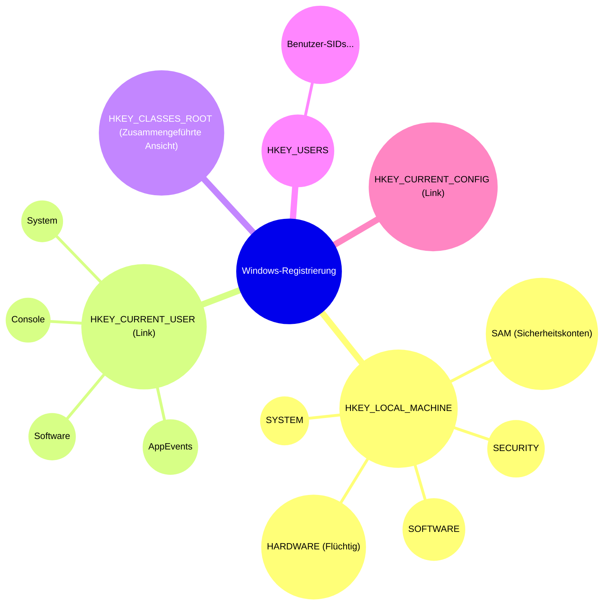
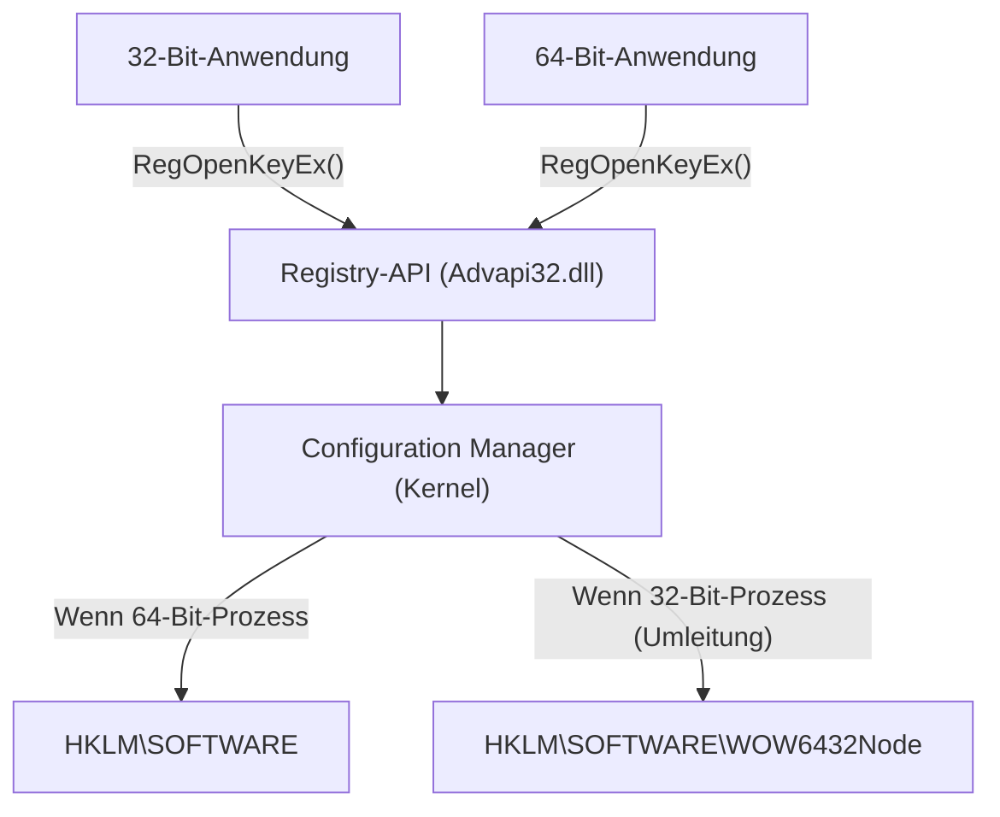
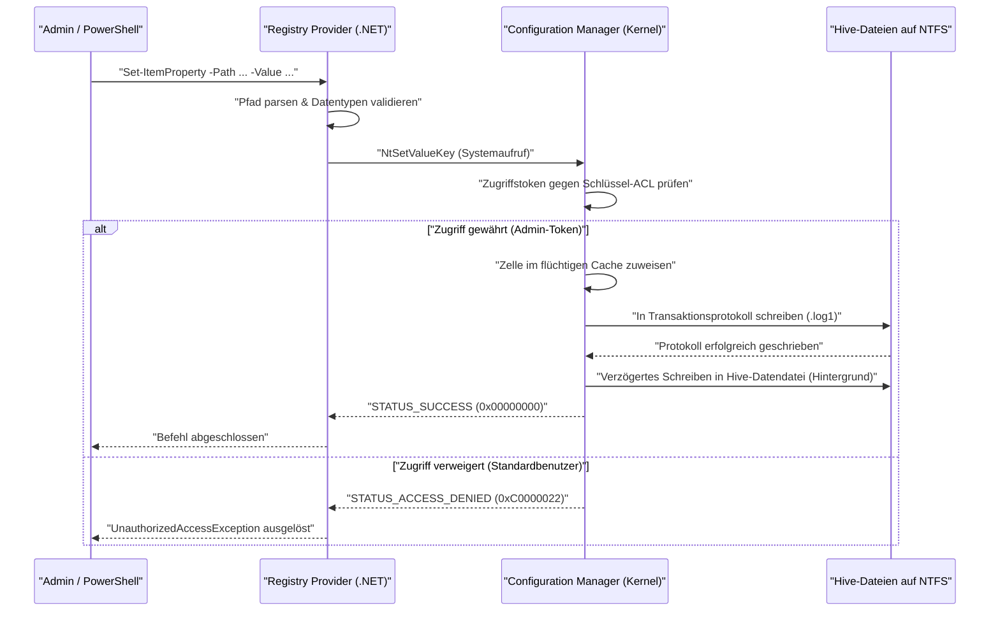

# Grundlagen der Windows-Registrierung und Methoden zur programmierbaren, sicheren Bearbeitung

Im Windows-Betriebssystem ist die „Registrierung“ (Registry) eine riesige hierarchische Datenbank, die verschiedene Einstellungen für das System und die Anwendungen speichert. In diesem Artikel erklären wir die grundlegende Architektur der Windows-Registrierung sowie Methoden zur programmierbaren und sicheren Bearbeitung der Registrierung mithilfe von PowerShell und C# sehr detailliert.

## 1. Einführung: Geschichte und Entwicklung der Windows-Registrierung

In den frühen Versionen von Windows (Windows 3.x-Ära) wurden System- und Anwendungseinstellungen hauptsächlich in `.ini`-Dateien (Initialisierungsdateien) gespeichert. Allerdings verteilten sich unzählige INI-Dateien für jede Anwendung über das gesamte System, was die Verwaltung extrem kompliziert machte. Da INI-Dateien zudem auf reinem Text basierten, war das Speichern von Binärdaten schwierig und es gab keinen Mechanismus zur Zugriffskontrolle (Sicherheit). Die Parsing-Geschwindigkeit von Dateien war ebenfalls langsam, weshalb sie ungeeignet waren, um umfangreiche Einstellungen zu speichern.

Um diese Probleme grundlegend zu lösen, wurde ab Windows NT und Windows 95 die „Registrierung“ als zentralisierte Einstellungsdatenbank ernsthaft eingeführt. Die Registrierung ist eine hierarchische Datenbank, die starke Typisierung, Unterstützung für Binärdaten und robuste Sicherheitsfunktionen durch Zugriffskontrolllisten (ACLs) bietet. Dadurch wurde es für alle Komponenten, vom Betriebssystem-Kernel bis hin zu Anwendungen im Benutzermodus, möglich, Einstellungen über eine einheitliche Schnittstelle (die `Reg*`-Funktionen der Win32-API) zu lesen und zu schreiben.

Bis hin zum modernen Windows 11 fungiert die Registrierung weiterhin als das Herzstück des Betriebssystems. Alle Metadaten, die für den Betrieb des Systems erforderlich sind – wie Hardwarekonfigurationen, Ladereihenfolge von Gerätetreibern, Desktop-Umgebung des Benutzers und die Liste der installierten Software –, werden in der Registrierung zentralisiert.

## 2. Die Tiefe der Architektur: Die Realität der Registrierungsstruktur (Hives) und Speicherzuordnung

Obwohl die Registrierung logisch als eine riesige Baumstruktur erscheint, ist sie physisch in mehrere Dateien auf der Festplatte unterteilt, die als „Hives“ (Strukturen) bezeichnet werden. Dadurch werden systemweite Einstellungen von benutzerspezifischen Einstellungen getrennt, was ein effizientes Laden ermöglicht.

Die wichtigsten Hive-Dateien befinden sich normalerweise im Verzeichnis `%SystemRoot%\System32\config`.
- `SYSTEM`: Wichtige Einstellungen, die für den Start des Betriebssystems erforderlich sind (Treiber, Dienste, Startkonfiguration usw.).
- `SOFTWARE`: Systemweite Einstellungen für installierte Software. Hier befinden sich die meisten Einstellungen von Drittanbieter-Anwendungen.
- `SAM`: Security Accounts Manager (lokale Benutzerkonten und Passwort-Hashes).
- `SECURITY`: Lokale Sicherheitsrichtlinien und Rechtezuweisungen.
- `DEFAULT`: Das Standardbenutzerprofil (Vorlage zum Erstellen neuer Benutzer).

Benutzerspezifische Hive-Dateien existieren als versteckte Dateien im Profilverzeichnis des Benutzers (z. B. `C:\Users\Username`).
- `NTUSER.DAT`: Die Grundeinstellungen des jeweiligen Benutzers (der Großteil von HKCU).
- `UsrClass.dat`: Die Dateierweiterungszuordnungen des jeweiligen Benutzers (befindet sich in `AppData\Local\Microsoft\Windows`).

Diese Dateien werden beim Systemstart vom „Configuration Manager (CM)“ des Kernels in den Paged-Pool-Speicher des Kernels gemappt. Der Configuration Manager ist eine Kernel-Modus-Komponente, die Lese- und Schreibanforderungen an die Registrierung verarbeitet.

Besonders bemerkenswert ist, dass nicht alle Registrierungsdaten auf der Festplatte existieren. Beispielsweise ist der Hive `HARDWARE` flüchtig (Volatile) und wird überhaupt nicht in Dateien auf der Festplatte gespeichert. Jedes Mal, wenn das Betriebssystem startet und der Plug-and-Play-Manager (PnP) Hardware erkennt, wird er dynamisch im Speicher neu aufgebaut.

Darüber hinaus implementieren moderne Windows-Versionen eine Transaktionsprotokollierung, um die Zuverlässigkeit der Registrierung zu erhöhen. Änderungen an den Hive-Dateien werden nicht direkt in die Datendateien geschrieben, sondern zuerst in Transaktionsprotokollen (`.log1`, `.log2`) aufgezeichnet. Dies verhindert Datenbeschädigungen (Corruption) im Falle eines unerwarteten Stromausfalls oder Systemabsturzes während des Schreibvorgangs und garantiert die Integrität der Datenbank in einer Form, die den ACID-Eigenschaften nahekommt.

## 3. Die hierarchische Struktur von Registrierungsschlüsseln und -werten

Die Registrierung hat eine hierarchische Struktur, die einem Dateisystem sehr ähnlich ist. Der Wurzelknoten wird als „Stammschlüssel“ (Root Key) oder „Hive“ bezeichnet. Darunter befinden sich „Schlüssel“ (Keys), „Unterschlüssel“ (Subkeys) und schließlich die eigentlichen Daten, die „Werte“ (Values) genannt werden. Man kann es sich leicht so vorstellen, dass Schlüssel Verzeichnissen und Werte Dateien entsprechen.

Die wichtigsten Stammschlüssel werden in die folgenden fünf Kategorien unterteilt:

1. **HKEY_LOCAL_MACHINE (HKLM)**: Speichert System- und Softwareeinstellungen, die für den gesamten Computer (alle Benutzer) gelten. Änderungen erfordern Administratorrechte.
2. **HKEY_CURRENT_USER (HKCU)**: Speichert Einstellungen, die spezifisch für den aktuell angemeldeten Benutzer sind. In Wirklichkeit ist dies keine unabhängige Datenbank, sondern lediglich ein symbolischer Link (Alias) zum entsprechenden SID-Schlüssel (Security Identifier) des Benutzers unter `HKEY_USERS`.
3. **HKEY_CLASSES_ROOT (HKCR)**: Speichert Dateierweiterungszuordnungen, Registrierungsinformationen für COM-Klassen (Component Object Model) und Shell-Erweiterungen. Dieser Schlüssel ist speziell; er ist eine virtuelle Ansicht, bei der der Configuration Manager `HKLM\SOFTWARE\Classes` (systemweit) und `HKCU\Software\Classes` (aktueller Benutzer) zusammenführt (mergt). Bei Konflikten haben die benutzerspezifischen Einstellungen (HKCU) Vorrang.
4. **HKEY_USERS (HKU)**: Speichert die Einstellungen aller Benutzerprofile auf dem System (die aktuell in den Speicher geladen sind). Sie sind basierend auf SIDs hierarchisch angeordnet.
5. **HKEY_CURRENT_CONFIG (HKCC)**: Einstellungen bezüglich des aktuellen Hardwareprofils. In Wirklichkeit ein Link zu `HKLM\SYSTEM\CurrentControlSet\Hardware Profiles\Current`.

Die Visualisierung dieser komplexen hierarchischen Struktur und der Verknüpfungen sieht wie folgt aus:



## 4. Datentypen der Registrierung (Detaillierte Erklärung)

Die „Werte“ in der Registrierung haben jeweils strikt definierte Datentypen. Wenn Sie die Registrierung programmierbar manipulieren, ist es unerlässlich, diese Typen richtig zu verstehen und Daten mit dem entsprechenden Typ zu schreiben. Das Schreiben mit einem falschen Typ führt dazu, dass Anwendungen Ausnahmen auslösen oder Funktionen des Betriebssystems nicht mehr funktionieren.

- **REG_SZ (Zeichenfolgenwert)**: Der häufigste Datentyp. Speichert eine NULL-terminierte Unicode-Zeichenfolge (UTF-16LE). Wird für Dateipfade, URLs, UI-Anzeigenamen usw. verwendet.
- **REG_DWORD (Wert eines 32-Bit-Wertes)**: Ein vorzeichenloser 32-Bit (4 Byte) Ganzzahlwert. Wird häufig für boolesche Werte (0=Deaktiviert, 1=Aktiviert), Timeout-Werte in Millisekunden und das Setzen von Fehlercodes verwendet. Da Windows eine Little-Endian-Architektur ist, werden die Bytes auf der Festplatte beginnend mit dem niederwertigsten Byte gespeichert (z. B. wird 0x12345678 als `78 56 34 12` gespeichert).
- **REG_QWORD (Wert eines 64-Bit-Wertes)**: Ein 64-Bit (8 Byte) Ganzzahlwert. Mit der Verbreitung von 64-Bit-Architekturen wird er verwendet, um riesige Zahlen (wie Datenträgerkontingente oder große Speichergrößenangaben) und zeigergroße Einstellungen zu speichern.
- **REG_MULTI_SZ (Wert der mehrteiligen Zeichenfolge)**: Ein Format, das mehrere NULL-terminierte Zeichenfolgen nacheinander speichert und am Ende ein weiteres leeres NULL-Terminierungszeichen (Double NULL) hinzufügt, um es abzuschließen. Eignet sich zum Speichern von Array-ähnlichen Daten wie Listen von IP-Adressen, Listen von abhängigen Diensten oder Bindungsreihenfolgen.
- **REG_EXPAND_SZ (Wert der erweiterbaren Zeichenfolge)**: Ein spezieller Zeichenfolgentyp, der nicht erweiterte Umgebungsvariablen wie `%USERPROFILE%` oder `%SystemRoot%` enthält. Wenn eine Anwendung ihn über die API `RegQueryValueEx` liest oder die API `ExpandEnvironmentStrings` aufruft, wird er vom Betriebssystem dynamisch in den tatsächlichen absoluten Pfad aufgelöst.
- **REG_BINARY (Binärwert)**: Ein beliebiger roher Binärdatenstrom. Speichert verschlüsselte Passwörter (wie LSA Secrets), digitale Zertifikate und anwendungsspezifische komplexe Strukturen oder serialisierte Daten.
- **REG_NONE**: Daten mit undefiniertem Typ. Sehr selten, wird aber manchmal für reservierte Bereiche von Verschlüsselungsschlüsseln verwendet.
- **REG_RESOURCE_LIST** / **REG_FULL_RESOURCE_DESCRIPTOR**: Fortgeschrittene, nur für den Kernel bestimmte Typen, die von Gerätetreibern verwendet werden, um Zuweisungsinformationen für Hardwareressourcen (IRQs, I/O-Ports, DMA-Kanäle) aufzuzeichnen.

## 5. Das mathematische Modell und die Leistung der Registrierung im Betriebssystem

Da die Registrierung direkt an die Leistung des Betriebssystems (insbesondere Boot-Zeit und Initialisierungsgeschwindigkeit von Prozessen) gekoppelt ist, wird sie intern mithilfe einer fortschrittlichen Datenstruktur optimiert, die als „Cell Index“ bezeichnet wird und einem B-Baum (B-Tree) ähnelt.

### Zeitkomplexität der Suche (Time Complexity)
Die Zeitkomplexität $T_{\text{search}}$ bei der Suche nach einem bestimmten Schlüssel (Pfad) innerhalb der Registrierung hängt von der Tiefe des Baums und der Anzahl der Knoten auf jeder Ebene ab. Die Komplexität beim Suchen eines Unterschlüssels der Tiefe $d$ (z. B. für `A\B\C\D` ist $d=4$) kann theoretisch wie folgt modelliert werden:

$$
T_{\text{search}}(d, L) = \sum_{i=1}^{d} O(\log(C_i) \cdot L_i)
$$

Hierbei ist $C_i$ die Anzahl der untergeordneten Knoten (Unterschlüssel oder Werte) auf der Tiefe $i$, und $L_i$ ist die Länge (Anzahl der Zeichen) der zu vergleichenden Zeichenfolge. Innerhalb der Hive-Datei, die das eigentliche Subjekt der Registrierung ist, wird die Liste der Unterschlüssel als Hash-Wert des Namens oder als alphabetisch sortierter Index beibehalten. Daher ist anstelle einer einfachen linearen Suche $O(C_i)$ eine binäre Suche $O(\log(C_i))$ möglich, was selbst dann einen extrem schnellen Zugriff ermöglicht, wenn sich Zehntausende von Unterschlüsseln unter einem einzigen Schlüssel befinden.

### Speicherbedarf (Space Complexity)
Die Gesamtgröße der Registrierung (der belegte Platz auf der physischen Festplatte) wird als Summe jedes Hives berechnet.

$$
\text{Size}_{\text{Total}} = \sum_{h \in \text{Hives}} \left( N_{h} \times S_{\text{key\_metadata}} + \sum_{v \in h} S_{\text{value}}(v) \right) + S_{\text{overhead}}
$$

$N_h$ ist die Anzahl der Schlüssel im Hive $h$, $S_{\text{key\_metadata}}$ ist die Größe der Metadaten pro Schlüssel (letzter Zeitstempel für Schreibvorgänge, Zeiger auf Sicherheitsbeschreibungen, Zeiger auf übergeordnete Schlüssel usw.), und $S_{\text{value}}(v)$ ist die Nutzlastgröße des Wertes $v$. Der Overhead $S_{\text{overhead}}$ durch Transaktionsprotokolle und nicht mehr benötigte leere Zellen (Fragmentierung) ist ebenfalls enthalten. Wenn unnötige Daten (wie Überreste von Software, die nicht vollständig deinstalliert wurde) über einen langen Zeitraum in der Registrierung belassen werden, erhöht sich dieser Speicherbedarf, was den Paged-Pool-Speicher des Betriebssystems belasten und zu Leistungseinbußen führen kann.

## 6. Risiken manueller Bearbeitung und Wahrscheinlichkeit von Beschädigungen, die die Systemstabilität bedrohen

Die manuelle Bearbeitung mit dem Registrierungs-Editor (`regedit.exe`) sollte als letztes Mittel der Systemverwaltung betrachtet werden. Der Registrierung fehlt eine „Rückgängig“ (Undo)-Funktion, die man in gewöhnlichen Dokumenteneditoren findet, und Änderungen an Werten oder das Löschen von Schlüsseln werden über den Configuration Manager sofort im System widergespiegelt.

Insbesondere das irrtümliche Ändern oder Löschen von nur einem Zeichen in kritischen Schlüsseln, die für den Systemstart unerlässlich sind (z. B. Einstellungen für Festplattencontroller-Treiber unter `HKLM\SYSTEM\CurrentControlSet\Services` oder der Wert `Userinit` in `HKLM\SOFTWARE\Microsoft\Windows NT\CurrentVersion\Winlogon`), birgt das fatale Risiko, dass das Betriebssystem einen Blue Screen (BSoD) verursacht und nicht mehr booten kann oder nicht über den Anmeldebildschirm hinauskommt (Black Screen).

### Mathematisches Modell der Beschädigungswahrscheinlichkeit
Betrachten wir die Wahrscheinlichkeit eines Systemausfalls, wenn Schlüssel in der Registrierung zufällig geändert oder gelöscht werden. Sei die Menge der kritischen Schlüssel, die für die ordnungsgemäße Funktion des Systems unerlässlich sind, $C$, und ihre Gesamtzahl $N_c = |C|$. Sei die Gesamtzahl der Schlüssel in der gesamten Registrierung $N_{\text{total}}$.
Wenn zufällig $k$ Schlüssel gelöscht oder zerstört werden, wird die Wahrscheinlichkeit $P_{\text{failure}}$, dass mindestens ein kritischer Schlüssel beschädigt wird, durch die Wahrscheinlichkeitsrechnung des Ziehens ohne Zurücklegen (Sampling without replacement) wie folgt ausgedrückt:

$$
P_{\text{failure}} = 1 - \frac{\binom{N_{\text{total}} - N_c}{k}}{\binom{N_{\text{total}}}{k}} = 1 - \prod_{i=0}^{k-1} \left( 1 - \frac{N_c}{N_{\text{total}} - i} \right)
$$

Die Gesamtzahl der Schlüssel in der Registrierung $N_{\text{total}}$ liegt in der Größenordnung von Hunderttausenden bis Millionen, aber auch $N_c$ existiert in der Größenordnung von Zehntausenden. Mathematisch gesehen steigt die Ausfallwahrscheinlichkeit selbst bei zufälligen Operationen stark an, wenn $k$ zunimmt. Darüber hinaus operieren Benutzer in der Praxis nicht „zufällig“, sondern manipulieren absichtlich Bereiche, die direkt mit Systemeinstellungen und dem Softwarebetrieb zusammenhängen (während sie auf Tutorial-Seiten usw. schauen), sodass die Wahrscheinlichkeit, einen kritischen Schlüssel zu berühren, weitaus höher ist als der oben genannte theoretische Wert.

## 7. Registrierungsvirtualisierung und WOW64-Architektur

Um die Kompatibilität mit Legacy-Anwendungen aufrechtzuerhalten, implementiert Windows einige fortschrittliche „Virtualisierungs“-Mechanismen (Umleitung) für den Registrierungszugriff. Die Programmierung ohne Verständnis dieser Mechanismen ist die Ursache für schwerwiegende Fehler.

### UAC-Registrierungsvirtualisierung (Registry Virtualization)
Ab Windows Vista wurde die Benutzerkontensteuerung (UAC) eingeführt. Wenn eine alte Anwendung, die in der Windows XP-Ära erstellt wurde (und mit Standardbenutzerrechten läuft), versucht, in geschützte Schlüssel wie `HKLM\SOFTWARE` zu schreiben, die eigentlich Administratorrechte erfordern, verhindert Windows Abstürze aufgrund von Zugriffsverweigerungsfehlern (Access Denied), indem es den Schreibvorgang heimlich in den virtuellen Speicher `HKCU\Software\Classes\VirtualStore\MACHINE\SOFTWARE` im Benutzerprofil umleitet. Beim Lesen fügt es sowohl den ursprünglichen Speicherort als auch den virtuellen Speicher zusammen und gibt sie zurück. Dadurch kann die Anwendung ohne Erkennung eines Fehlers normal weiterlaufen.
Wenn Sie jedoch ein Tool entwickeln, das systemweite Einstellungen programmierbar ändert, müssen Sie `<requestedExecutionLevel level="requireAdministrator" />` in der Manifestdatei angeben und diese Virtualisierung deaktivieren.

### WOW64 (Windows 32-bit on Windows 64-bit) Umleitung
Wenn eine ältere 32-Bit-Anwendung auf einer 64-Bit-Version von Windows (dem aktuellen Mainstream) ausgeführt wird, werden bestimmte Registrierungsschlüssel automatisch isoliert und umgeleitet, um zu verhindern, dass die 32-Bit-App versehentlich native 64-Bit-Systemeinstellungen überschreibt oder inkompatible 64-Bit-DLLs lädt.
Wenn beispielsweise eine 32-Bit-App versucht, auf `HKLM\SOFTWARE\Vendor\App` zuzugreifen, leitet das Betriebssystem sie transparent an `HKLM\SOFTWARE\WOW6432Node\Vendor\App` um.


Beim Bearbeiten der Registrierung über ein PowerShell-Skript oder eine C#-Anwendung müssen Sie sich unbedingt bewusst sein, ob der ausführende Prozess selbst 32-Bit oder 64-Bit ist. Andernfalls wird das lästige Problem verursacht, dass „die geschriebenen Einstellungen im Explorer nicht sichtbar sind (an einer anderen Stelle geschrieben wurden)“.

## 8. Programmierbare sichere Bearbeitung mit PowerShell

Um das Risiko der manuellen Bearbeitung der Registrierung zu minimieren, besteht die moderne Best Practice darin, Vorgänge mit PowerShell-Skripten zu codieren (Infrastructure as Code) und Automatisierung, Reproduzierbarkeit und Testbarkeit sicherzustellen. PowerShell verfügt über einen „Registry Provider“, mit dem Sie die Registrierung transparent mit genau denselben Cmdlets (`Get-ChildItem`, `Get-ItemProperty`, `New-Item` usw.) bearbeiten können, mit denen Sie auch Dateisysteme (wie das Laufwerk C:) bearbeiten.

In PowerShell sind dedizierte PSDrives (ähnlich wie Laufwerksbuchstaben) wie `HKLM:` und `HKCU:` standardmäßig gemountet.

### Grundlegende CRUD-Operationen
```powershell
# 1. Existenzprüfung (Read)
$keyPath = "HKCU:\Software\MyCustomApp"
if (-Not (Test-Path -Path $keyPath)) {
    # 2. Erstellen eines neuen Schlüssels (Create)
    New-Item -Path "HKCU:\Software" -Name "MyCustomApp" -Force | Out-Null
    Write-Host "Schlüssel erstellt."
}

# 3. Schreiben/Aktualisieren eines Wertes (Update) - Schreibt 1 als REG_DWORD
Set-ItemProperty -Path $keyPath -Name "EnableDebug" -Value 1 -Type DWord

# 4. Lesen eines Wertes (Read)
$debugFlag = (Get-ItemProperty -Path $keyPath).EnableDebug
Write-Host "Aktuelles Debug-Flag: $debugFlag"

# 5. Löschen eines Wertes (Delete)
Remove-ItemProperty -Path $keyPath -Name "EnableDebug" -Force
```

### Praxisbeispiel 1: Automatische Einrichtung der Entwicklungsumgebung (Hinzufügen von PATH-Umgebungsvariablen)
Das folgende Skript ist ein Automatisierungsbeispiel, das das Verzeichnis benutzerdefinierter Tools sicher zur Benutzerumgebungsvariablen `PATH` hinzufügt, wenn ein Entwickler einen neuen Windows-Computer einrichtet.

```powershell
$envKey = "HKCU:\Environment"
$newPath = "C:\tools\bin"

# Aktuellen PATH lesen (Fehler unterdrücken, um sicher zu erhalten)
$currentPathInfo = Get-ItemProperty -Path $envKey -Name "Path" -ErrorAction SilentlyContinue
$currentPath = if ($currentPathInfo) { $currentPathInfo.Path } else { "" }

# Mit regulärem Ausdruck prüfen, ob es bereits enthalten ist
if ($currentPath -notmatch [regex]::Escape($newPath)) {
    # Wenn am Ende kein Semikolon steht, hinzufügen und verbinden
    if ($currentPath -and $currentPath -notmatch ";$") {
        $currentPath += ";"
    }
    $updatedPath = $currentPath + $newPath
    
    # Als REG_EXPAND_SZ-Typ schreiben (Wichtig)
    Set-ItemProperty -Path $envKey -Name "Path" -Value $updatedPath -Type ExpandString
    Write-Host "PATH-Umgebungsvariable aktualisiert: $newPath"
    
    # Ausführende Prozesse über Änderungen der Umgebungsvariablen benachrichtigen (WM_SETTINGCHANGE)
    # Dadurch wird die Änderung in neuen Explorern usw. ohne Neustart wirksam
    [Environment]::SetEnvironmentVariable("Path", $updatedPath, [EnvironmentVariableTarget]::User)
} else {
    Write-Host "PATH ist bereits hinzugefügt."
}
```

### Praxisbeispiel 2: Hinzufügen einer benutzerdefinierten Aktion zum Kontextmenü
Dies ist ein Skript, das ein benutzerdefiniertes Element namens „In My IDE öffnen“ zum Kontextmenü hinzufügt, wenn Sie mit der rechten Maustaste auf eine bestimmte Datei oder ein bestimmtes Verzeichnis klicken.

```powershell
# Das Menü, wenn Sie mit der rechten Maustaste auf den Hintergrund (den leeren Bereich) eines Verzeichnisses klicken
$menuPath = "HKCR:\Directory\Background\shell\OpenWithMyIDE"
$commandPath = "$menuPath\command"

try {
    # Übergeordneten Schlüssel für das Menüelement erstellen
    New-Item -Path $menuPath -Force -ErrorAction Stop | Out-Null
    
    # Anzeigenamen im Wert (Standard) festlegen
    Set-ItemProperty -Path $menuPath -Name "(default)" -Value "In My IDE öffnen" -Type String
    
    # Symbol festlegen (Optional)
    Set-ItemProperty -Path $menuPath -Name "Icon" -Value "C:\Program Files\MyIDE\ide.exe,0" -Type String

    # command-Unterschlüssel erstellen und die auszuführende Befehlszeile festlegen
    # %V ist eine Variable, die zum Pfad des aktuellen Verzeichnisses erweitert wird
    New-Item -Path $commandPath -Force -ErrorAction Stop | Out-Null
    Set-ItemProperty -Path $commandPath -Name "(default)" -Value "`"C:\Program Files\MyIDE\ide.exe`" `"%V`"" -Type String

    Write-Host "Kontextmenü wurde hinzugefügt."
} catch {
    Write-Error "Ändern der Registrierung fehlgeschlagen. Überprüfen Sie, ob Sie es mit Administratorrechten ausführen. Fehler: $_"
}
```

### Interne Sequenz des Registrierungszugriffs von PowerShell
Die interne Betriebssystemsequenz, wenn ein PowerShell-Skript die Registrierung ändert, wird unten gezeigt.



## 9. Robuster Registrierungszugriff mit C# (.NET)

Wenn Sie von einer .NET-Anwendung (z. B. C#) auf die Registrierung zugreifen, verwenden Sie die Klassen `Microsoft.Win32.Registry` und `RegistryKey`.
Der größte Vorteil bei der Verwendung von C# ist eine robuste Fehlerbehandlung durch starke Ausnahmebehandlung (`try-catch`), strikte Typprüfung und die Möglichkeit, explizit 32-Bit/64-Bit-Ansichten mit der `RegistryView`-Enumeration anzugeben.

Das folgende C#-Codebeispiel liest und schreibt die Registrierung auf der 64-Bit-Seite zuverlässig (wobei die WOW6432Node-Umleitung vermieden wird) in einer 64-Bit-Betriebssystemumgebung.

```csharp
using System;
using System.Security;
using Microsoft.Win32;

class RegistryEditor
{
    static void Main()
    {
        // Pfad unter HKLM (erfordert Administratorrechte)
        string keyPath = @"SOFTWARE\MyEnterpriseApp\Settings";

        // Native 64-Bit-Ansicht durch Angabe von RegistryView.Registry64 öffnen
        // Verwenden der using-Anweisung, um sicherzustellen, dass das Handle des Registrierungsschlüssels (nicht verwaltete Ressource) zuverlässig freigegeben (Disposed) wird
        try
        {
            using (RegistryKey baseKey = RegistryKey.OpenBaseKey(RegistryHive.LocalMachine, RegistryView.Registry64))
            {
                // Schlüssel mit Schreibberechtigung (writable: true) öffnen. Erstellen, falls nicht vorhanden.
                using (RegistryKey subKey = baseKey.CreateSubKey(keyPath, writable: true))
                {
                    if (subKey != null)
                    {
                        // Wert als REG_DWORD schreiben
                        subKey.SetValue("MaxConnections", 100, RegistryValueKind.DWord);
                        
                        // Wert als REG_SZ schreiben
                        subKey.SetValue("ApiEndpoint", "https://api.example.com", RegistryValueKind.String);
                        
                        // Byte-Array als REG_BINARY schreiben
                        byte[] secretData = { 0x01, 0x02, 0x0A, 0xFF };
                        subKey.SetValue("BinarySecret", secretData, RegistryValueKind.Binary);
                        
                        Console.WriteLine("Schreiben in die Registrierung erfolgreich.");
                    }
                }
            }
        }
        catch (UnauthorizedAccessException ex)
        {
            // Tritt oft auf, wenn nicht als Administrator ausgeführt wird
            Console.WriteLine($"Berechtigungsfehler: Bitte führen Sie das Programm \"Als Administrator ausführen\" aus. Details: {ex.Message}");
        }
        catch (SecurityException ex)
        {
            // Wenn durch die Codezugriffssicherheit (CAS) von .NET blockiert
            Console.WriteLine($"Sicherheitsausnahme: {ex.Message}");
        }
        catch (Exception ex)
        {
            // Andere unerwartete E/A-Fehler usw.
            Console.WriteLine($"Unerwarteter Fehler: {ex.Message}");
        }
    }
}
```

Das vom Betriebssystem zurückgegebene „Handle“, wenn ein Registrierungsschlüssel geöffnet wird, ist eine nicht verwaltete Ressource, die Arbeitsspeicher und Systemressourcen verbraucht. Daher ist es eine eiserne Regel bei der C#-Programmierung, `using`-Blöcke zu verwenden oder `.Dispose()` (oder `.Close()`) explizit im `finally`-Block aufzurufen, um Handle-Lecks sicher zu verhindern.

## 10. Sicherungs- und Wiederherstellungsmethoden für die Registrierung

Selbst bei Automatisierung durch Skripte oder Programme ist es absolut unerlässlich, vor kritischen Änderungen ein Backup zu erstellen.

### Backup und Import mit .reg-Dateien
Die klassischste und universellste Methode ist der Export in eine `.reg`-Datei. Diese Datei ist eine textbasierte Datei mit einem eigenen Format, und ihre Struktur sieht wie folgt aus:

```text
Windows Registry Editor Version 5.00

[HKEY_CURRENT_USER\Software\MyCustomApp]
"EnableDebug"=dword:00000001
"ApiEndpoint"="https://api.example.com"
"BinaryData"=hex:01,02,0a,ff
```
*Hinweis: Binärdaten werden durch kommagetrennte Hexadezimalzahlen dargestellt, die auf `hex:` folgen.*

Sie können das Befehlszeilentool `reg.exe` verwenden, um automatische Backups in Batch-Skripten zu implementieren.
```cmd
REM Den angegebenen Schlüssel sichern (Unterschlüssel werden auch rekursiv exportiert)
reg export HKLM\SOFTWARE\MyEnterpriseApp C:\backup\myapp_backup.reg /y

REM Sicherung wiederherstellen
reg import C:\backup\myapp_backup.reg
```

### Fortgeschrittenere Sicherungsmethoden mit PowerShell
Anstatt nur einfachen Text zu verwenden, ist es auch möglich, die Objektorientierung von PowerShell zu nutzen, um Registrierungsobjekte zu exportieren und im XML-Format (CliXML) zu speichern. Dadurch können Sie bei der Wiederherstellung Typinformationen beibehalten, anstatt sich auf das Parsen von Zeichenfolgen zu verlassen.

```powershell
# Backup abrufen (Eigenschaften als XML speichern)
Get-ItemProperty -Path "HKCU:\Software\MyCustomApp" | Export-Clixml -Path "C:\backup\reg_backup.xml"

# Wiederherstellungskonzept
$backup = Import-Clixml -Path "C:\backup\reg_backup.xml"
# Da in $backup das wiederhergestellte benutzerdefinierte PSObject gespeichert ist,
# können Sie eine Logik aufbauen, um über dessen Eigenschaften zu schleifen und sie mit Set-ItemProperty erneut anzuwenden.
```

## 11. Fehlerbehebung mit Sysinternals Process Monitor (Procmon)

Wenn unklar ist, wo ein Programm in die Registrierung schreibt, oder wenn Sie nach der Ursache für „Access Denied“ suchen, ist der von Microsoft kostenlos bereitgestellte **Process Monitor (Procmon)** aus den Sysinternals-Tools extrem leistungsstark.
Mit Procmon können Sie alle Registrierungs-API-Aufrufe (wie `RegOpenKey`, `RegQueryValue`, `RegSetValue`), die im Betriebssystem auftreten, in Echtzeit erfassen und Fehler mit erweiterten Filtern wie den folgenden beheben:

- `Process Name` is `powershell.exe`
- `Operation` begins with `Reg`
- `Result` is `ACCESS DENIED`

Dadurch können Sie in Sekundenbruchteilen identifizieren, welchem Schlüssel die ACL-Einstellungen fehlen oder ob er fälschlicherweise an WOW6432Node umgeleitet wird.

## 12. Sicherheit und Best Practices

Abschließend fassen wir wichtige Designprinzipien und Best Practices im Umgang mit der Registrierung zusammen.

1. **Das Prinzip der geringsten Privilegien durchsetzen**: Einstellungen für Anwendungen und Skripte sollten nach Möglichkeit immer unter dem `Software`-Schlüssel in `HKCU` (dem aktuellen Benutzer) gespeichert werden. Das Schreiben nach `HKLM` erfordert eine UAC-Rechteausweitung auf Administratorrechte, was die Angriffsfläche (Attack Surface) für Sicherheitsbedrohungen vergrößert und die Benutzererfahrung beeinträchtigt.
2. **Überwachung (Auditing) aktivieren**: Für sicherheitskritische Schlüssel (z. B. der `Run`-Schlüssel, der das Autostartverhalten steuert, oder Dienstkonfigurationsschlüssel) sollten Sie eine SACL (System Access Control List) konfigurieren, um im „Sicherheitsprotokoll“ in der Windows-Ereignisanzeige aufzuzeichnen (zu überwachen), wer Werte wann geändert oder gelöscht hat.
3. **Umgang mit der Veraltung von Transaktionsfunktionen**: Die Transaktionsfunktion der Registrierung (TxR) unter Verwendung des in Windows Vista eingeführten „Kernel Transaction Manager (KTM)“ gilt ab Windows 10 als veraltet (Deprecated). Es ist erforderlich, einen eigenen Backup- und Rollback-Mechanismus in der Anwendung zu implementieren (z. B. den ursprünglichen Wert vor Änderungen lesen und im Speicher behalten).
4. **Vorsicht vor Konflikten mit Gruppenrichtlinien (GPO)**: Bereiche wie `HKLM\SOFTWARE\Policies` und `HKCU\Software\Policies` sollten durch Active Directory-Gruppenrichtlinien zentral verwaltet werden. Wenn Sie diese Schlüssel direkt aus einem Skript umschreiben, werden sie im nächsten Aktualisierungszyklus für Gruppenrichtlinien im Hintergrund (in der Regel alle 90 bis 120 Minuten) durch die Einstellungen des Domänencontrollers zwangsüberschrieben, weshalb die Einstellungen nicht dauerhaft bleiben.

## Fazit

Die Windows-Registrierung ist ein leistungsstarkes und komplexes Basissystem, das alle Verhaltensweisen des Betriebssystems und der Anwendungseinstellungen integriert verwaltet. Chaotisches manuelles Bearbeiten birgt ein hohes mathematisch nachgewiesenes Risiko für Systembeschädigungen. Daher ist es im modernen Systemmanagement und in der Entwicklung unerlässlich, programmierbare Mittel wie PowerShell oder C# zu verwenden, um das Konfigurationsmanagement nach den Prinzipien von Infrastructure as Code auf sichere, testbare und reproduzierbare Weise durchzuführen. Bitte nutzen Sie das in diesem Artikel erläuterte tiefe Verständnis der Architektur und die Implementierungsmuster, um eine robustere und sicherere Windows-Umgebung aufzubauen.
