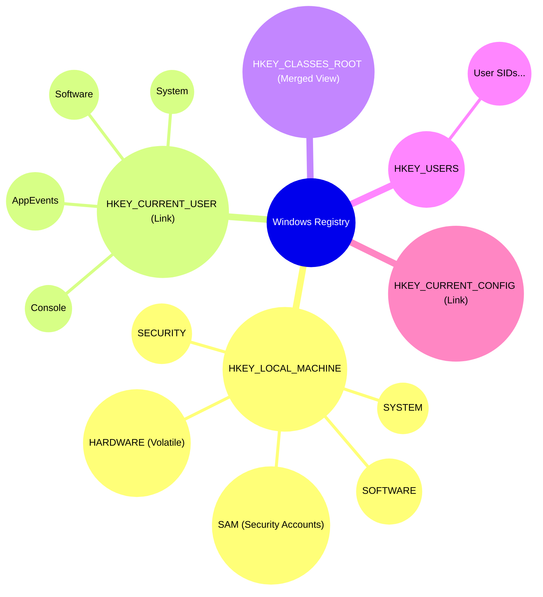
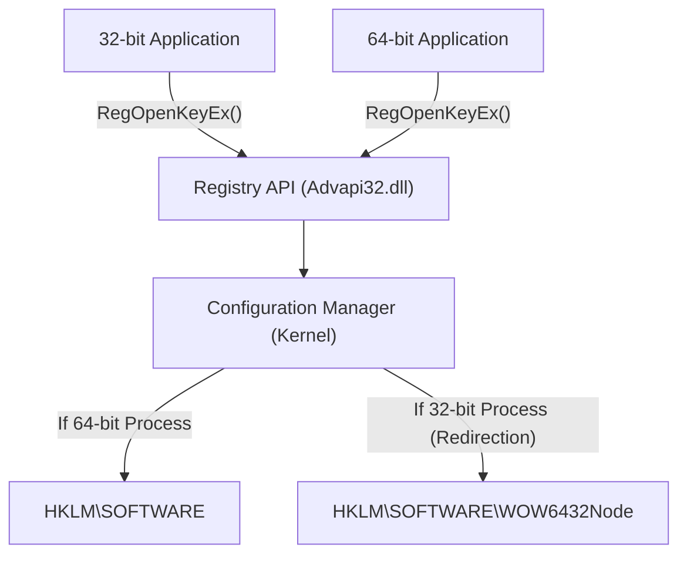
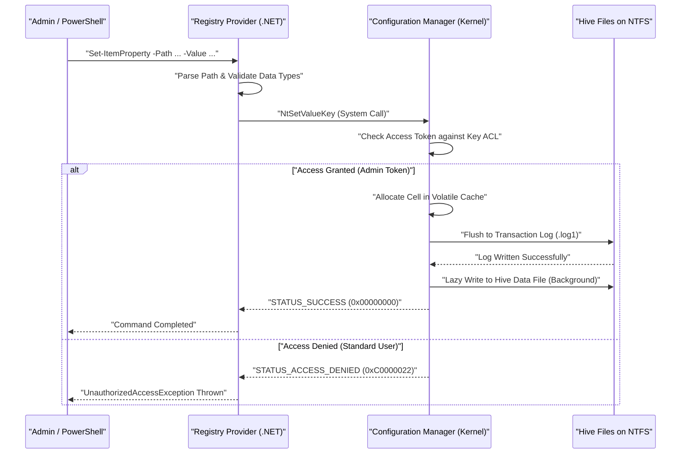

# Basic Knowledge of the Windows Registry and Safe Programmable Editing Methods

In the Windows operating system, the "Registry" is a massive hierarchical database that stores various settings for the system and applications. This article provides a very detailed explanation, starting from the basic architecture of the Windows Registry to programmable and safe registry editing methods using PowerShell and C#.

## 1. Introduction: History and Evolution of the Windows Registry

In early versions of Windows (Windows 3.x era), system and application settings were mainly stored in `.ini` (initialization) files. However, countless INI files for each application scattered across the entire system, making management significantly complicated. Furthermore, since INI files are plain text-based, saving binary data was difficult, and there was no access control (security) mechanism. The file parsing speed was also slow, making it unsuitable for saving large-scale settings.

To fundamentally resolve these issues, the "Registry" was fully adopted as a centralized configuration database starting from Windows NT and Windows 95. The registry is a hierarchical database that provides strong typing, support for binary data, and robust security features through Access Control Lists (ACLs). This allowed all components, from the OS kernel to user-space applications, to read and write settings using a unified interface (the `Reg*` functions of the Win32 API).

Up to the modern Windows 11, the registry continues to function as the heart of the OS. All metadata required for system operation, such as hardware configuration, device driver load order, user desktop environments, and lists of installed software, are consolidated in the registry.

## 2. Deep Dive into the Architecture: The Reality of Registry Hives and Memory Mapping

Although the registry logically appears as a single giant tree structure, physically it is split into multiple files called "Hives" stored on the disk. This separates system-wide settings from user-specific settings, enabling efficient loading.

The main hive files are usually located in the `%SystemRoot%\System32\config` directory.
- `SYSTEM`: Critical settings required for operating system boot (drivers, services, boot configurations, etc.).
- `SOFTWARE`: System-wide settings for installed software. Most third-party application settings go here.
- `SAM`: Security Accounts Manager (local user accounts and password hashes).
- `SECURITY`: Local security policies and privilege assignments.
- `DEFAULT`: The default user profile (template when creating a new user).

User-specific hive files exist as hidden files in the user's profile directory (e.g., `C:\Users\Username`).
- `NTUSER.DAT`: Basic settings for that user (most of HKCU).
- `UsrClass.dat`: File extension association settings for that user (located in `AppData\Local\Microsoft\Windows`).

These files are mapped into the kernel paged pool memory by the kernel's "Configuration Manager (CM)" during OS boot. The Configuration Manager is a kernel-mode component that processes registry read/write requests.

It is worth noting that not all registry data exists on the disk. For example, the `HARDWARE` hive is volatile and is never saved to a file on the disk. It is dynamically rebuilt in memory every time the OS boots and the Plug and Play (PnP) manager detects hardware.

Also, recent versions of Windows implement transaction logging to enhance registry reliability. Changes to hive files are not directly written to the data files, but are first recorded in transaction logs (`.log1`, `.log2`). This prevents data corruption during unexpected power losses or system crashes while writing, ensuring database integrity in a form close to ACID properties.

## 3. Hierarchical Structure of Registry Keys and Values

The registry has a hierarchical structure very similar to a file system. The root node is called a "Root Key" or "Hive", and under it, "Keys", "Subkeys", and "Values" (the actual data entities) are stored. It is easy to understand if you consider keys as directories and values as files.

The main root keys are classified into the following five:

1. **HKEY_LOCAL_MACHINE (HKLM)**: Stores system settings and software settings that apply to the entire computer (all users). Administrator privileges are required to make changes.
2. **HKEY_CURRENT_USER (HKCU)**: Stores specific settings for the currently logged-on user. Actually, this is not an independent database, but merely a symbolic link (alias) to the specific user's SID (Security Identifier) key under `HKEY_USERS`.
3. **HKEY_CLASSES_ROOT (HKCR)**: Stores file extension associations, COM (Component Object Model) class registration information, and shell extensions. This key is special; it is a virtual view created by the Configuration Manager merging `HKLM\SOFTWARE\Classes` (system-wide) and `HKCU\Software\Classes` (current user). In case of conflicts, user-specific settings (HKCU) take precedence.
4. **HKEY_USERS (HKU)**: Stores settings for all user profiles on the system (those currently loaded in memory). It is structured based on SIDs.
5. **HKEY_CURRENT_CONFIG (HKCC)**: Settings related to the current hardware profile. It is actually a link to `HKLM\SYSTEM\CurrentControlSet\Hardware Profiles\Current`.

Visualizing this complex hierarchical structure and relationship of links looks like the following:



## 4. Registry Data Types (Detailed Explanation)

A strict data type is defined for each "value" in the registry. When manipulating the registry programmatically, it is essential to properly understand these types and write data in the appropriate type. Writing with an incorrect type can cause applications to throw exceptions or OS features to stop functioning.

- **REG_SZ (String Value)**: The most common data type. It stores a NULL-terminated Unicode string (UTF-16LE). Used for file paths, URLs, UI display names, etc.
- **REG_DWORD (32-bit Integer Value)**: A 32-bit (4-byte) unsigned integer value. Frequently used for boolean values (0=disabled, 1=enabled), timeout values in milliseconds, error code settings, etc. Because Windows uses a little-endian architecture, it is saved on disk starting from the least significant byte (e.g., 0x12345678 is saved as `78 56 34 12`).
- **REG_QWORD (64-bit Integer Value)**: A 64-bit (8-byte) integer value. With the spread of 64-bit architecture, it is used to store huge numbers (such as disk quotas or large memory size specifications) and pointer-size settings.
- **REG_MULTI_SZ (Multi-String Value)**: A format that stores multiple NULL-terminated strings consecutively, terminated with an additional empty NULL-terminated character (double NULL) at the end. Suitable for storing array-like data, such as lists of IP addresses, lists of dependent services, and binding orders.
- **REG_EXPAND_SZ (Expandable String Value)**: A special string type that includes unexpanded environment variable strings like `%USERPROFILE%` or `%SystemRoot%`. When an application reads it through the `RegQueryValueEx` API, or by calling the `ExpandEnvironmentStrings` API, it is dynamically expanded to the actual absolute path by the OS.
- **REG_BINARY (Binary Value)**: Any raw binary data stream. It stores encrypted passwords (like LSA Secrets), digital certificates, and complex application-specific structures or serialized data.
- **REG_NONE**: Data with an undefined type. Very rare, but used for reserved areas of encryption keys, etc.
- **REG_RESOURCE_LIST** / **REG_FULL_RESOURCE_DESCRIPTOR**: Advanced types exclusively for the kernel, used by device drivers to record hardware resource allocation information (IRQs, I/O ports, DMA channels).

## 5. Mathematical Models and Performance of the Registry in the Operating System

Since the registry is directly linked to OS performance (especially boot time and process initialization speed), it is internally optimized using an advanced data structure similar to a B-Tree called "Cell Index".

### Search Time Complexity

The time complexity $T_{\text{search}}$ when searching for a specific key (path) in the registry depends on the depth of the tree and the number of nodes at each level. The computational complexity of searching a subkey of depth $d$ (e.g., $d=4$ for `A\B\C\D`) can theoretically be modeled as follows:

$$
T_{\text{search}}(d, L) = \sum_{i=1}^{d} O(\log(C_i) \cdot L_i)
$$

Here, $C_i$ is the number of child nodes (subkeys or values) at depth $i$, and $L_i$ is the length of the string to be compared (number of characters). Within the hive files, which are the actual entities of the registry, the list of subkeys is maintained as an index sorted by name hashes or alphabetically. Therefore, instead of a simple linear search $O(C_i)$, a binary search $O(\log(C_i))$ is possible, achieving extremely fast access even if there are tens of thousands of subkeys under a single key.

### Storage Footprint (Space Complexity)

The total size of the registry (the footprint on the physical disk) is calculated as the sum of each hive.

$$
\text{Size}_{\text{Total}} = \sum_{h \in \text{Hives}} \left( N_{h} \times S_{\text{key\_metadata}} + \sum_{v \in h} S_{\text{value}}(v) \right) + S_{\text{overhead}}
$$

$N_h$ is the number of keys in hive $h$, $S_{\text{key\_metadata}}$ is the size of the metadata per key (last write timestamp, pointer to the security descriptor, pointer to the parent key, etc.), and $S_{\text{value}}(v)$ is the payload size of value $v$. It also includes the overhead $S_{\text{overhead}}$ from transaction logs and unnecessary empty cells (fragmentation). Leaving unnecessary data in the registry for a long period (such as remnants of incompletely uninstalled software) increases this footprint, potentially putting pressure on the OS paged pool memory and leading to performance degradation.

## 6. Risks and Corruption Probabilities of Manual Editing Threatening System Robustness

Manual editing using the Registry Editor (`regedit.exe`) should be considered a last resort for system administration. The registry does not have an "Undo" feature like common document editors, and changes to values or deletions of keys are immediately reflected in the system through the Configuration Manager.

In particular, if critical keys essential for system boot (e.g., disk controller driver settings under `HKLM\SYSTEM\CurrentControlSet\Services`, or the `Userinit` value in `HKLM\SOFTWARE\Microsoft\Windows NT\CurrentVersion\Winlogon`) are incorrectly edited or deleted by even a single character, there is a fatal risk of the OS crashing with a Blue Screen of Death (BSoD) and becoming unbootable, or getting stuck after the login screen (Black Screen).

### Mathematical Model of Corruption Probability

Let's consider the probability of system failure if registry keys are randomly modified or deleted. Let $C$ be the set of critical keys essential for the system to operate normally, and $N_c = |C|$ be its total number. Let the total number of keys in the entire registry be $N_{\text{total}}$.

If $k$ keys are randomly deleted or corrupted, the probability $P_{\text{failure}}$ that at least one critical key is corrupted is expressed by probability calculation of sampling without replacement as follows:

$$
P_{\text{failure}} = 1 - \frac{\binom{N_{\text{total}} - N_c}{k}}{\binom{N_{\text{total}}}{k}} = 1 - \prod_{i=0}^{k-1} \left( 1 - \frac{N_c}{N_{\text{total}} - i} \right)
$$

The total number of keys in the entire registry $N_{\text{total}}$ is on the order of hundreds of thousands to millions, but $N_c$ is also on the order of tens of thousands. Mathematically, even with random operations, the failure probability rises sharply as $k$ increases. Furthermore, in real-world manual operations, users do not edit "randomly"; they intentionally manipulate areas directly related to system settings or software operations (often following tutorial sites), making the probability of touching critical keys much higher than the theoretical value above.

## 7. Registry Virtualization and the WOW64 Architecture

To maintain compatibility for legacy applications, Windows implements several advanced "virtualization (redirection)" mechanisms for registry access. Programming without understanding this can cause critical bugs.

### UAC Registry Virtualization

Starting with Windows Vista, User Account Control (UAC) was introduced. When old applications created in the Windows XP era (running with standard user privileges) try to write to protected keys like `HKLM\SOFTWARE` that natively require administrator privileges, Windows silently redirects the write to a Virtual Store within the user profile: `HKCU\Software\Classes\VirtualStore\MACHINE\SOFTWARE` to prevent them from crashing with an Access Denied error. When reading, it also merges and returns data from both the original location and the virtual store. This allows applications to continue operating normally without detecting errors.

However, when developing tools that programmatically change system-wide settings, you must specify `<requestedExecutionLevel level="requireAdministrator" />` in the manifest file to disable this virtualization.

### WOW64 (Windows 32-bit on Windows 64-bit) Redirection

When running old 32-bit applications on a 64-bit version of Windows (currently the mainstream), specific registry keys are automatically isolated and redirected so that 32-bit apps do not accidentally overwrite 64-bit native system settings or load incompatible 64-bit DLLs.

For example, if a 32-bit app tries to access `HKLM\SOFTWARE\Vendor\App`, the OS transparently redirects it to `HKLM\SOFTWARE\WOW6432Node\Vendor\App`.



When editing the registry from PowerShell scripts or C# applications, you must be keenly aware of whether the executing process itself is 32-bit or 64-bit. Otherwise, it will cause the troublesome issue of "settings that should have been written are not visible from Explorer (written to a different location)."

## 8. Programmable and Safe Editing with PowerShell

To minimize the risk of manually editing the registry, the modern best practice is to codify operations (Infrastructure as Code) using PowerShell scripts to ensure automation, reproducibility, and testability. PowerShell features a "Registry Provider," allowing transparent manipulation of the registry using exactly the same cmdlets (like `Get-ChildItem`, `Get-ItemProperty`, `New-Item`) used to manipulate the file system (e.g., the C: drive).

In PowerShell, dedicated PSDrives (similar to drive letters) like `HKLM:` and `HKCU:` are mounted by default.

### Basic CRUD Operations

```powershell
# 1. Check existence (Read)
$keyPath = "HKCU:\Software\MyCustomApp"
if (-Not (Test-Path -Path $keyPath)) {
    # 2. Create a new key (Create)
    New-Item -Path "HKCU:\Software" -Name "MyCustomApp" -Force | Out-Null
    Write-Host "Key created."
}

# 3. Write/Update value (Update) - Write 1 as REG_DWORD
Set-ItemProperty -Path $keyPath -Name "EnableDebug" -Value 1 -Type DWord

# 4. Read value (Read)
$debugFlag = (Get-ItemProperty -Path $keyPath).EnableDebug
Write-Host "Current debug flag: $debugFlag"

# 5. Delete value (Delete)
Remove-ItemProperty -Path $keyPath -Name "EnableDebug" -Force
```

### Practical Example 1: Automatic Setup of Development Environment (Adding PATH to Environment Variables)

The following script is an automation example that safely adds a custom tool directory to the user environment variable `PATH` when a developer sets up a new Windows machine.

```powershell
$envKey = "HKCU:\Environment"
$newPath = "C:\tools\bin"

# Read the current PATH (suppress errors for safe retrieval)
$currentPathInfo = Get-ItemProperty -Path $envKey -Name "Path" -ErrorAction SilentlyContinue
$currentPath = if ($currentPathInfo) { $currentPathInfo.Path } else { "" }

# Use regular expressions to check if it is already included
if ($currentPath -notmatch [regex]::Escape($newPath)) {
    # Append a semicolon if not present at the end and concatenate
    if ($currentPath -and $currentPath -notmatch ";$") {
        $currentPath += ";"
    }
    $updatedPath = $currentPath + $newPath
    
    # Write as REG_EXPAND_SZ type (important)
    Set-ItemProperty -Path $envKey -Name "Path" -Value $updatedPath -Type ExpandString
    Write-Host "Updated PATH environment variable: $newPath"
    
    # Notify running processes of environment variable changes (WM_SETTINGCHANGE)
    # This applies it to new Explorer windows, etc., without requiring a reboot
    [Environment]::SetEnvironmentVariable("Path", $updatedPath, [EnvironmentVariableTarget]::User)
} else {
    Write-Host "PATH is already added."
}
```

### Practical Example 2: Adding Custom Actions to the Context Menu

This is a script that adds a custom item called "Open with My IDE" to the context menu when right-clicking a specific file or directory.

```powershell
# Menu when right-clicking the directory background (blank space)
$menuPath = "HKCR:\Directory\Background\shell\OpenWithMyIDE"
$commandPath = "$menuPath\command"

try {
    # Create parent key for the menu item
    New-Item -Path $menuPath -Force -ErrorAction Stop | Out-Null
    
    # Set the display name in the (default) value
    Set-ItemProperty -Path $menuPath -Name "(default)" -Value "Open with My IDE" -Type String
    
    # Set icon (optional)
    Set-ItemProperty -Path $menuPath -Name "Icon" -Value "C:\Program Files\MyIDE\ide.exe,0" -Type String

    # Create command subkey and set the command line to be executed
    # %V is a variable expanded to the current directory path
    New-Item -Path $commandPath -Force -ErrorAction Stop | Out-Null
    Set-ItemProperty -Path $commandPath -Name "(default)" -Value "`"C:\Program Files\MyIDE\ide.exe`" `"%V`"" -Type String

    Write-Host "Context menu added."
} catch {
    Write-Error "Failed to modify the registry. Make sure you are running as administrator. Error: $_"
}
```

### Internal Sequence of Registry Access from PowerShell

The operational sequence inside the OS when a PowerShell script modifies the registry is shown below.



## 9. Robust Registry Access with C# (.NET)

When accessing the registry from a .NET application (such as C#), use the `Microsoft.Win32.Registry` and `RegistryKey` classes.
The greatest advantage of using C# is the capability for robust error handling via powerful exception handling (`try-catch`), strict type checking, and explicit specification of 32-bit/64-bit views using the `RegistryView` enumeration.

Below is an example of C# code that reliably reads and writes to the 64-bit registry (bypassing WOW6432Node redirection) in a 64-bit OS environment.

```csharp
using System;
using System.Security;
using Microsoft.Win32;

class RegistryEditor
{
    static void Main()
    {
        // Path under HKLM (Requires administrator privileges)
        string keyPath = @"SOFTWARE\MyEnterpriseApp\Settings";

        // Specify RegistryView.Registry64 to open a 64-bit native view
        // Use a using statement to reliably Dispose of the registry key handle (unmanaged resource)
        try
        {
            using (RegistryKey baseKey = RegistryKey.OpenBaseKey(RegistryHive.LocalMachine, RegistryView.Registry64))
            {
                // Open key with write permission (writable: true). Create if it doesn't exist.
                using (RegistryKey subKey = baseKey.CreateSubKey(keyPath, writable: true))
                {
                    if (subKey != null)
                    {
                        // Write value as REG_DWORD
                        subKey.SetValue("MaxConnections", 100, RegistryValueKind.DWord);
                        
                        // Write value as REG_SZ
                        subKey.SetValue("ApiEndpoint", "https://api.example.com", RegistryValueKind.String);
                        
                        // Write byte array as REG_BINARY
                        byte[] secretData = { 0x01, 0x02, 0x0A, 0xFF };
                        subKey.SetValue("BinarySecret", secretData, RegistryValueKind.Binary);
                        
                        Console.WriteLine("Successfully wrote to the registry.");
                    }
                }
            }
        }
        catch (UnauthorizedAccessException ex)
        {
            // Commonly occurs when not running as administrator
            Console.WriteLine($"Permission error: Please \"Run as administrator\". Details: {ex.Message}");
        }
        catch (SecurityException ex)
        {
            // If blocked by .NET Code Access Security (CAS)
            Console.WriteLine($"Security exception: {ex.Message}");
        }
        catch (Exception ex)
        {
            // Other unexpected IO errors, etc.
            Console.WriteLine($"Unexpected error: {ex.Message}");
        }
    }
}
```

The "handle" returned by the OS when opening a registry key is an unmanaged resource that consumes memory and system resources. Therefore, an ironclad rule in C# programming is to reliably prevent handle leaks by either using a `using` block or explicitly calling `.Dispose()` (or `.Close()`) within a `finally` block.

## 10. Registry Backup and Restore Methods

Even with automation via scripts or programs, it is absolutely essential to take a backup before making critical changes.

### Backup and Import using .reg Files

The most classical and versatile method is exporting to a `.reg` file. This is a text-based file with its own format, and its structure is as follows:

```text
Windows Registry Editor Version 5.00

[HKEY_CURRENT_USER\Software\MyCustomApp]
"EnableDebug"=dword:00000001
"ApiEndpoint"="https://api.example.com"
"BinaryData"=hex:01,02,0a,ff
```
*Note: Binary data is represented by comma-separated hexadecimal numbers following `hex:`.*

You can implement automatic backups in batch scripts using the command-line tool `reg.exe`.
```cmd
REM Backup specified key (subkeys are also exported recursively)
reg export HKLM\SOFTWARE\MyEnterpriseApp C:\backup\myapp_backup.reg /y

REM Restore backup
reg import C:\backup\myapp_backup.reg
```

### More Advanced Backup Methods Using PowerShell

Instead of just text, you can leverage PowerShell's object orientation to export registry objects and save them in XML format (CliXML). This allows you to handle them while maintaining type information during restoration, without relying on string parsing.

```powershell
# Take backup (Save properties as XML)
Get-ItemProperty -Path "HKCU:\Software\MyCustomApp" | Export-Clixml -Path "C:\backup\reg_backup.xml"

# Concept of restoring
$backup = Import-Clixml -Path "C:\backup\reg_backup.xml"
# Because $backup contains restored custom PSObjects,
# you can build logic to loop through its properties and reapply them with Set-ItemProperty.
```

## 11. Troubleshooting Using Sysinternals Process Monitor (Procmon)

If it's unclear where a program is writing in the registry, or if you want to find the cause of an "Access Denied" error, the **Process Monitor (Procmon)**—a free Sysinternals tool provided by Microsoft—is extremely powerful.
By using Procmon, you can capture all registry API calls (`RegOpenKey`, `RegQueryValue`, `RegSetValue`, etc.) occurring on the OS in real-time and troubleshoot with advanced filtering such as the following:

- `Process Name` is `powershell.exe`
- `Operation` begins with `Reg`
- `Result` is `ACCESS DENIED`

With this, you can instantly pinpoint which key lacks ACL settings, or whether it's being mistakenly redirected to the WOW6432Node.

## 12. Security and Best Practices

Finally, we summarize the important design principles and best practices for handling the registry.

1. **Strictly Enforce the Principle of Least Privilege**: Application and script settings should be stored under the `Software` key within `HKCU` (Current User) whenever possible. Writing to `HKLM` requires an administrator privilege escalation via UAC, which expands the security attack surface and degrades user experience.
2. **Enable Auditing**: For keys that are extremely critical to security (e.g., the `Run` key responsible for automatic startup, or service configuration keys), configure a SACL (System Access Control List) to record (audit) who modified or deleted values and when, in the Windows Event Viewer's "Security Log".
3. **Address the Deprecation of Transaction Features**: The registry transaction feature (TxR) utilizing the "Kernel Transaction Manager (KTM)", introduced back in Windows Vista, has been deprecated since Windows 10. The application side must implement its own backup and rollback mechanisms (such as reading the original value and keeping it in memory before making changes).
4. **Beware of Conflicts with Group Policy (GPO)**: The `HKLM\SOFTWARE\Policies` and `HKCU\Software\Policies` areas are to be centrally managed by Active Directory Group Policies. Even if you modify these keys directly from a script, they will be forcefully overwritten by the Domain Controller's settings during the next background Group Policy update cycle (typically every 90 to 120 minutes), causing your settings to not persist.

## Conclusion

The Windows Registry is a powerful and complex foundational system that integrally manages every behavior of the OS and application settings. Disorderly manual editing carries a high, mathematically proven risk of system corruption. Therefore, using programmable means such as PowerShell and C# to manage configurations securely, testably, and reproducibly, in accordance with the principles of Infrastructure as Code, is essential in modern system administration and development. Utilize the deep architectural understanding and implementation patterns explained in this article to aim for building a more robust and secure Windows environment.
