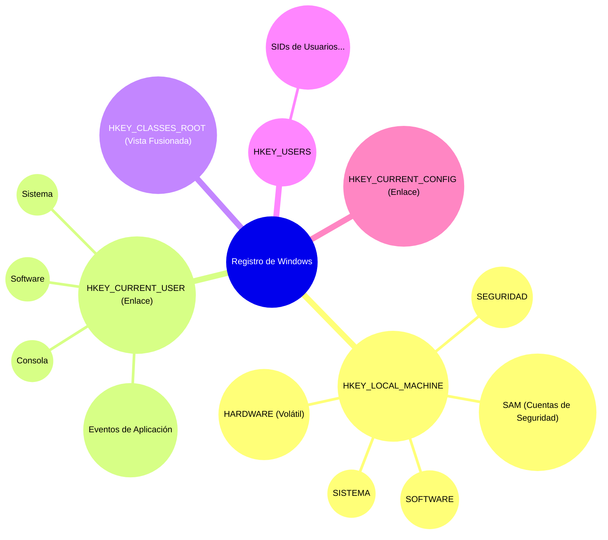
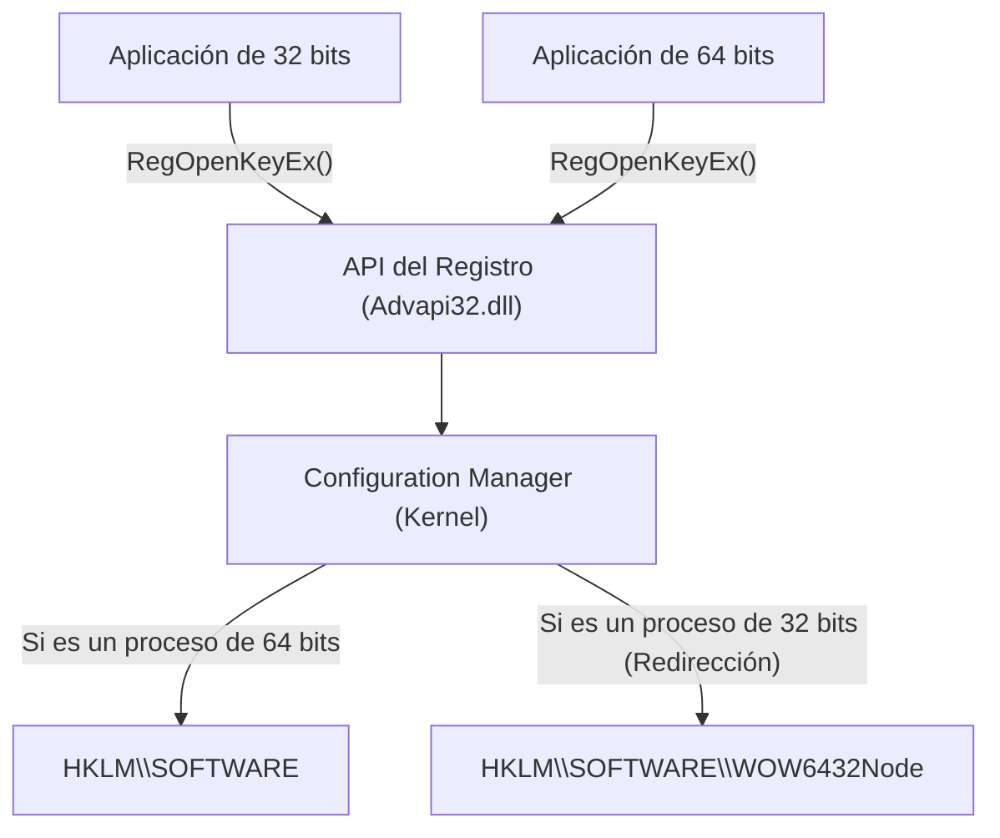
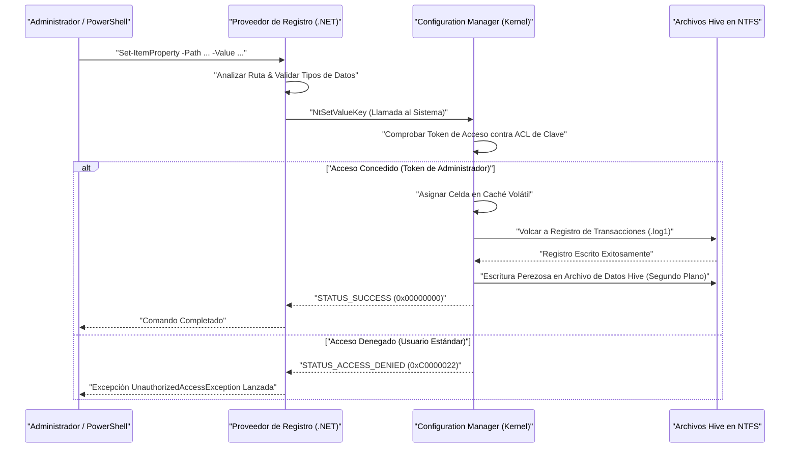

# Fundamentos del Registro de Windows y cómo editarlo de forma segura y programable

En el sistema operativo Windows, el "Registro" (Registry) es una enorme base de datos jerárquica que almacena diversas configuraciones del sistema y de las aplicaciones. En este artículo, explicaremos con mucho detalle desde la arquitectura básica del registro de Windows hasta métodos de edición seguros y programables utilizando PowerShell y C#.

## 1. Introducción: Historia y evolución del Registro de Windows

En las primeras versiones de Windows (era Windows 3.x), la configuración del sistema y de las aplicaciones se guardaba principalmente en archivos `.ini` (archivos de inicialización). Sin embargo, con el tiempo, innumerables archivos INI se esparcieron por todo el sistema para cada aplicación, lo que hizo que la gestión se volviera notablemente complicada. Además, como los archivos INI están basados en texto plano, era difícil guardar datos binarios y no existía un mecanismo de control de acceso (seguridad). La velocidad de análisis (parsing) de estos archivos también era lenta, lo que los hacía inadecuados para almacenar grandes cantidades de configuración.

Para resolver estos problemas de manera fundamental, a partir de Windows NT y Windows 95, se adoptó plenamente el "Registro" como una base de datos de configuración centralizada. El registro es una base de datos jerárquica que proporciona un tipado fuerte, soporte para datos binarios y características robustas de seguridad a través de listas de control de acceso (ACL). Esto permitió que todos los componentes, desde el kernel del sistema operativo hasta las aplicaciones en el espacio de usuario, pudieran leer y escribir configuraciones mediante una interfaz unificada (el conjunto de funciones `Reg*` de la API Win32).

Hasta el actual Windows 11, el registro sigue funcionando como el corazón del sistema operativo. Toda la metadata necesaria para el funcionamiento del sistema se concentra en el registro, como la configuración del hardware, el orden de carga de los controladores de dispositivos, el entorno de escritorio del usuario y la lista del software instalado.

## 2. Las profundidades de la arquitectura: La realidad de los Hives del registro y el mapeo de memoria

Aunque lógicamente el registro parece una enorme estructura de árbol único, físicamente está dividido en múltiples archivos llamados "Hives" que se guardan en el disco. Esto permite que la configuración de todo el sistema y la configuración específica del usuario estén separadas, lo que posibilita una carga eficiente.

Los archivos Hive principales se encuentran normalmente en el directorio `%SystemRoot%\System32\config`.
- `SYSTEM`: Configuraciones críticas necesarias para arrancar el sistema operativo (controladores, servicios, configuración de arranque, etc.).
- `SOFTWARE`: Configuraciones de todo el sistema del software instalado. La mayor parte de la configuración de las aplicaciones de terceros va aquí.
- `SAM`: Security Accounts Manager (cuentas de usuario local y hashes de contraseñas).
- `SECURITY`: Políticas de seguridad local y asignación de privilegios.
- `DEFAULT`: Perfil del usuario predeterminado (plantilla al crear un usuario nuevo).

Los archivos Hive específicos del usuario se encuentran como archivos ocultos en el directorio del perfil del usuario (ejemplo: `C:\Users\Username`).
- `NTUSER.DAT`: Configuraciones básicas de ese usuario (la mayor parte de HKCU).
- `UsrClass.dat`: Configuraciones de asociación de extensiones de archivo de ese usuario (se encuentra en `AppData\Local\Microsoft\Windows`).

Estos archivos son mapeados en la memoria paginada del kernel por el "Configuration Manager (CM)" del kernel cuando arranca el sistema operativo. El Configuration Manager es un componente en modo kernel que procesa las solicitudes de lectura y escritura del registro.

Es importante destacar que no todos los datos del registro existen en el disco. Por ejemplo, el Hive `HARDWARE` es volátil (Volatile) y no se guarda en ningún archivo del disco. Se reconstruye dinámicamente en la memoria cada vez que el sistema operativo arranca y el administrador de Plug and Play (PnP) detecta el hardware.

Además, en las versiones modernas de Windows, se ha implementado el registro transaccional (transaction logging) para aumentar la confiabilidad del registro. Los cambios realizados en los archivos Hive no se escriben directamente en el archivo de datos, sino que primero se registran en los registros de transacciones (`.log1`, `.log2`). Esto previene la corrupción de datos en caso de pérdida repentina de energía durante una escritura o por la caída del sistema, garantizando la integridad de la base de datos de una forma similar a las propiedades ACID.

## 3. La estructura jerárquica de claves y valores del Registro

El registro tiene una estructura jerárquica muy similar a un sistema de archivos. Los nodos raíz se denominan "Claves raíz" o "Hives", debajo de los cuales se almacenan las "Claves" (Keys), "Subclaves" (Subkeys), y las entidades de datos reales, llamadas "Valores" (Values). Es fácil entenderlo si consideramos que las claves equivalen a directorios y los valores a archivos.

Las claves raíz principales se clasifican en las siguientes 5 categorías:

1. **HKEY_LOCAL_MACHINE (HKLM)**: Almacena configuraciones del sistema y del software que se aplican a todo el equipo (todos los usuarios). Se requieren permisos de administrador para realizar cambios.
2. **HKEY_CURRENT_USER (HKCU)**: Almacena la configuración específica del usuario actualmente conectado. En realidad, esto no es una base de datos independiente, sino simplemente un enlace simbólico (alias) a la clave del SID (Identificador de Seguridad) del usuario correspondiente debajo de `HKEY_USERS`.
3. **HKEY_CLASSES_ROOT (HKCR)**: Almacena las asociaciones de extensiones de archivos, la información de registro de clases COM (Component Object Model) y las extensiones del shell. Esta clave es especial, ya que es una vista virtual que el Configuration Manager fusiona (une) entre `HKLM\SOFTWARE\Classes` (para todo el sistema) y `HKCU\Software\Classes` (para el usuario actual). Si hay conflictos, las configuraciones específicas del usuario (HKCU) tienen prioridad.
4. **HKEY_USERS (HKU)**: Almacena la configuración de todos los perfiles de usuario del sistema (los que están actualmente cargados en memoria). Está jerarquizada en base al SID.
5. **HKEY_CURRENT_CONFIG (HKCC)**: Configuraciones sobre el perfil de hardware actual. En realidad es un enlace a `HKLM\SYSTEM\CurrentControlSet\Hardware Profiles\Current`.

Visualizar esta compleja estructura jerárquica y relaciones de enlaces se vería de la siguiente manera:



## 4. Tipos de datos del Registro (Explicación detallada)

En el registro, a cada "valor" se le define estrictamente un tipo de dato. Cuando se manipula el registro de manera programable, es esencial comprender correctamente estos tipos y escribir los datos en el tipo adecuado. Escribir con un tipo incorrecto hará que las aplicaciones lancen excepciones o será la causa de que ciertas funciones del sistema operativo dejen de funcionar.

- **REG_SZ (Valor de cadena)**: El tipo de dato más común. Almacena una cadena Unicode terminada en NULL (UTF-16LE). Se utiliza para rutas de archivos, URLs, nombres para mostrar en la interfaz de usuario, etc.
- **REG_DWORD (Valor entero de 32 bits)**: Un valor entero sin signo de 32 bits (4 bytes). Se usa con frecuencia para valores booleanos (0=deshabilitado, 1=habilitado), valores de tiempo de espera en milisegundos o configuración de códigos de error. Dado que Windows es una arquitectura Little Endian, se guarda en el disco comenzando por el byte menos significativo (Ejemplo: 0x12345678 se guarda como `78 56 34 12`).
- **REG_QWORD (Valor entero de 64 bits)**: Un valor entero de 64 bits (8 bytes). Con la popularización de las arquitecturas de 64 bits, se utiliza para guardar números gigantescos (como cuotas de disco o la especificación del tamaño de la memoria de gran capacidad) o configuraciones de tamaño de punteros.
- **REG_MULTI_SZ (Valor de cadena de múltiples líneas)**: Almacena múltiples cadenas terminadas en NULL de forma consecutiva, finalizando con un carácter NULL vacío adicional (doble NULL). Es adecuado para guardar datos tipo matriz, como listas de direcciones IP, listas de servicios con dependencias o el orden de vinculación.
- **REG_EXPAND_SZ (Valor de cadena expandible)**: Un tipo de cadena especial que contiene cadenas de variables de entorno no expandidas, como `%USERPROFILE%` o `%SystemRoot%`. Cuando la aplicación la lee mediante la API `RegQueryValueEx` o llama a la API `ExpandEnvironmentStrings`, el sistema operativo la expande dinámicamente a la ruta absoluta real.
- **REG_BINARY (Valor binario)**: Un flujo de datos binarios sin procesar. Almacena contraseñas cifradas (como LSA Secrets), certificados digitales y estructuras complejas o datos serializados específicos de la aplicación.
- **REG_NONE**: Datos de tipo no definido. Es muy raro, pero se utiliza para áreas reservadas como claves de cifrado.
- **REG_RESOURCE_LIST** / **REG_FULL_RESOURCE_DESCRIPTOR**: Tipos avanzados exclusivos del kernel que utilizan los controladores de dispositivos para registrar la información de asignación de recursos de hardware (IRQ, puertos de E/S, canales DMA).

## 5. Modelos matemáticos del Registro y rendimiento en el Sistema Operativo

Dado que el registro afecta directamente el rendimiento del sistema operativo (especialmente el tiempo de arranque y la velocidad de inicialización de los procesos), internamente está optimizado utilizando una estructura de datos avanzada similar a un B-Tree (Árbol B) llamada "Cell Index" (Índice de Celdas).

### Complejidad de tiempo de búsqueda (Time Complexity)
La complejidad de tiempo $T_{\text{search}}$ al buscar una clave (ruta) específica en el registro depende de la profundidad del árbol y la cantidad de nodos en cada jerarquía. Al buscar una subclave de profundidad $d$ (por ejemplo, para `A\B\C\D`, $d=4$), la complejidad se puede modelar teóricamente de la siguiente manera:

$$
T_{\text{search}}(d, L) = \sum_{i=1}^{d} O(\log(C_i) \cdot L_i)
$$

Donde $C_i$ es el número de nodos hijos (subclaves o valores) en la profundidad $i$, y $L_i$ es la longitud de la cadena (número de caracteres) a comparar. Dentro del archivo Hive que es la entidad real del registro, la lista de subclaves se mantiene como un índice ordenado alfabéticamente o por el valor hash del nombre. Por lo tanto, en lugar de una simple búsqueda lineal $O(C_i)$, es posible realizar una búsqueda binaria $O(\log(C_i))$, logrando un acceso extremadamente rápido incluso si existen decenas de miles de subclaves debajo de una misma clave.

### Huella de almacenamiento (Space Complexity)
El tamaño total del registro (ocupación física en el disco) se calcula como la suma de cada Hive.

$$
\text{Size}_{\text{Total}} = \sum_{h \in \text{Hives}} \left( N_{h} \times S_{\text{key\_metadata}} + \sum_{v \in h} S_{\text{value}}(v) \right) + S_{\text{overhead}}
$$

$N_h$ es el número de claves en el Hive $h$, $S_{\text{key\_metadata}}$ es el tamaño de la metadata por cada clave (marca de tiempo de la última escritura, punteros a descriptores de seguridad, punteros a la clave principal, etc.), y $S_{\text{value}}(v)$ es el tamaño de la carga útil (payload) del valor $v$. También se incluye la sobrecarga (overhead) $S_{\text{overhead}}$ debido a los registros de transacciones o a celdas vacías que ya no se necesitan (fragmentación). Dejar datos innecesarios en el registro (como restos de software que no se desinstaló por completo) durante un largo período aumentará esta huella, lo que puede presionar la memoria paginada del sistema operativo y causar una degradación del rendimiento.

## 6. Los riesgos de la edición manual que amenazan la solidez del sistema y las probabilidades de corrupción

La edición manual mediante el Editor del Registro (`regedit.exe`) debe considerarse el último recurso para la administración del sistema. El registro no tiene una función incorporada para "Deshacer" (Undo) como los editores de documentos convencionales; la alteración de los valores o la eliminación de las claves se refleja instantáneamente en el sistema a través del Configuration Manager.

En particular, si editas o eliminas por error un solo carácter de las claves críticas necesarias para arrancar el sistema (por ejemplo, la configuración del controlador de discos debajo de `HKLM\SYSTEM\CurrentControlSet\Services` o el valor de `Userinit` en `HKLM\SOFTWARE\Microsoft\Windows NT\CurrentVersion\Winlogon`), existe un riesgo fatal de que el sistema operativo provoque una pantalla azul (BSoD) y sea incapaz de iniciar, o de que no pueda avanzar de la pantalla de inicio de sesión (pantalla negra).

### Modelo matemático de la probabilidad de corrupción
Pensemos en la probabilidad de que se produzca una falla del sistema en caso de que se alteren o eliminen claves al azar en el registro. Supongamos que el conjunto de claves críticas indispensables para que el sistema funcione normalmente es $C$, y que su cantidad total es $N_c = |C|$. Sea $N_{\text{total}}$ el número total de claves en todo el registro.
Si eliminamos o destruimos aleatoriamente $k$ claves, la probabilidad $P_{\text{failure}}$ de que se corrompa al menos una clave crítica, calculada mediante probabilidad por muestreo sin reemplazo (Sampling without replacement), se expresa de la siguiente manera:

$$
P_{\text{failure}} = 1 - \frac{\binom{N_{\text{total}} - N_c}{k}}{\binom{N_{\text{total}}}{k}} = 1 - \prod_{i=0}^{k-1} \left( 1 - \frac{N_c}{N_{\text{total}} - i} \right)
$$

El número total de claves del registro $N_{\text{total}}$ es del orden de cientos de miles a millones, pero $N_c$ también existe en el orden de las decenas de miles. Matemáticamente, la probabilidad de falla aumenta drásticamente a medida que aumenta $k$, incluso con operaciones aleatorias. Aún más, en operaciones manuales reales, el usuario no edita "al azar", sino que manipula intencionadamente partes que están directamente involucradas con la configuración del sistema o el funcionamiento del software (quizás siguiendo un sitio de tutoriales), por lo que la probabilidad de tocar una clave crítica es mucho mayor que el valor teórico indicado arriba.

## 7. Virtualización del Registro y la Arquitectura WOW64

Para mantener la compatibilidad con aplicaciones heredadas (legacy), Windows implementa varios mecanismos avanzados de "virtualización" (redireccionamiento) para el acceso al registro. Si programas sin entender esto, causarás errores graves.

### Virtualización del Registro de UAC (Registry Virtualization)
Desde Windows Vista, se introdujo el Control de cuentas de usuario (UAC). Si una aplicación antigua creada en la época de Windows XP (que se ejecuta con privilegios de usuario estándar) intenta escribir en claves protegidas que originalmente requieren permisos de administrador, como `HKLM\SOFTWARE`, para evitar que la aplicación falle por un error de Acceso Denegado (Access Denied), Windows redirige subrepticiamente esa escritura a una tienda virtual dentro del perfil de usuario `HKCU\Software\Classes\VirtualStore\MACHINE\SOFTWARE`. Al leer, también fusiona y devuelve tanto la ubicación original como la de la tienda virtual. Así, la aplicación puede seguir funcionando normalmente sin detectar ningún error.
Sin embargo, al desarrollar una herramienta para cambiar programáticamente la configuración del sistema completo, se debe especificar `<requestedExecutionLevel level="requireAdministrator" />` en el archivo de manifiesto para desactivar esta virtualización.

### Redirección WOW64 (Windows 32-bit on Windows 64-bit)
Al ejecutar aplicaciones antiguas de 32 bits en una versión de Windows de 64 bits (la principal en la actualidad), ciertas claves del registro se separan y se redirigen automáticamente para que la aplicación de 32 bits no sobrescriba accidentalmente la configuración nativa del sistema de 64 bits ni cargue archivos DLL de 64 bits incompatibles.
Por ejemplo, si una aplicación de 32 bits intenta acceder a `HKLM\SOFTWARE\Vendor\App`, el sistema operativo la redirige de forma transparente a `HKLM\SOFTWARE\WOW6432Node\Vendor\App`.


Cuando se edita el registro desde un script de PowerShell o una aplicación C#, hay que estar muy consciente de si el proceso en ejecución en sí es de 32 o 64 bits. De lo contrario, causará el molesto problema de "la configuración que supuestamente escribí no se puede ver desde el Explorador (está escrita en un lugar diferente)".

## 8. Edición programable y segura con PowerShell

Para minimizar el riesgo de editar manualmente el registro, la mejor práctica en la actualidad es codificar las operaciones (Infrastructure as Code) usando un script de PowerShell para asegurar la automatización, reproducibilidad y facilidad de prueba. PowerShell cuenta con un "Proveedor de Registro" (Registry Provider), lo que permite manipular el registro de manera transparente utilizando exactamente los mismos cmdlets (como `Get-ChildItem`, `Get-ItemProperty`, `New-Item`) que se usan para manipular el sistema de archivos (como la unidad C:).

En PowerShell, unidades PSDrive (similares a las letras de unidad) dedicadas como `HKLM:` y `HKCU:` están montadas por defecto.

### Operaciones CRUD básicas
```powershell
# 1. Comprobación de existencia (Read)
$keyPath = "HKCU:\Software\MyCustomApp"
if (-Not (Test-Path -Path $keyPath)) {
    # 2. Creación de una nueva clave (Create)
    New-Item -Path "HKCU:\Software" -Name "MyCustomApp" -Force | Out-Null
    Write-Host "Clave creada."
}

# 3. Escribir o actualizar valor (Update) - Escribir 1 como REG_DWORD
Set-ItemProperty -Path $keyPath -Name "EnableDebug" -Value 1 -Type DWord

# 4. Leer valor (Read)
$debugFlag = (Get-ItemProperty -Path $keyPath).EnableDebug
Write-Host "Bandera de depuración actual: $debugFlag"

# 5. Eliminar valor (Delete)
Remove-ItemProperty -Path $keyPath -Name "EnableDebug" -Force
```

### Ejemplo práctico 1: Configuración automática del entorno de desarrollo (Añadir PATH a variables de entorno)
El siguiente script es un ejemplo de automatización para que los desarrolladores añadan de forma segura el directorio de sus herramientas personalizadas a la variable de entorno de usuario `PATH` cuando configuren una máquina Windows nueva.

```powershell
$envKey = "HKCU:\Environment"
$newPath = "C:\tools\bin"

# Leer el PATH actual (suprimiendo errores para obtenerlo de forma segura)
$currentPathInfo = Get-ItemProperty -Path $envKey -Name "Path" -ErrorAction SilentlyContinue
$currentPath = if ($currentPathInfo) { $currentPathInfo.Path } else { "" }

# Comprobar si ya está incluido usando expresiones regulares
if ($currentPath -notmatch [regex]::Escape($newPath)) {
    # Añadir punto y coma al final si no lo tiene y concatenar
    if ($currentPath -and $currentPath -notmatch ";$") {
        $currentPath += ";"
    }
    $updatedPath = $currentPath + $newPath
    
    # Escribir como tipo REG_EXPAND_SZ (Importante)
    Set-ItemProperty -Path $envKey -Name "Path" -Value $updatedPath -Type ExpandString
    Write-Host "Variable de entorno PATH actualizada: $newPath"
    
    # Notificar a los procesos en ejecución sobre el cambio en las variables de entorno (WM_SETTINGCHANGE)
    # Esto permite reflejarlo en nuevos exploradores, etc., sin necesidad de reiniciar
    [Environment]::SetEnvironmentVariable("Path", $updatedPath, [EnvironmentVariableTarget]::User)
} else {
    Write-Host "PATH ya ha sido añadido."
}
```

### Ejemplo práctico 2: Añadir una acción personalizada al menú contextual
Este es un script que añade una opción propia que dice "Abrir con My IDE" al menú contextual cuando se hace clic con el botón derecho en un directorio específico o archivo.

```powershell
# Menú al hacer clic derecho en el fondo (área vacía) de un directorio
$menuPath = "HKCR:\Directory\Background\shell\OpenWithMyIDE"
$commandPath = "$menuPath\command"

try {
    # Crear la clave principal del elemento del menú
    New-Item -Path $menuPath -Force -ErrorAction Stop | Out-Null
    
    # Establecer el nombre para mostrar en el valor (Predeterminado)
    Set-ItemProperty -Path $menuPath -Name "(default)" -Value "Abrir con My IDE" -Type String
    
    # Establecer icono (Opcional)
    Set-ItemProperty -Path $menuPath -Name "Icon" -Value "C:\Program Files\MyIDE\ide.exe,0" -Type String

    # Crear subclave command y configurar la línea de comandos a ejecutar
    # %V es una variable que se expande a la ruta del directorio actual
    New-Item -Path $commandPath -Force -ErrorAction Stop | Out-Null
    Set-ItemProperty -Path $commandPath -Name "(default)" -Value "`"C:\Program Files\MyIDE\ide.exe`" `"%V`"" -Type String

    Write-Host "Se ha añadido el menú contextual."
} catch {
    Write-Error "Error al modificar el registro. Asegúrese de que se esté ejecutando con privilegios de administrador. Error: $_"
}
```

### Secuencia interna de acceso al Registro desde PowerShell
A continuación se muestra la secuencia de operaciones interna del sistema operativo cuando un script de PowerShell modifica el registro.



## 9. Acceso robusto al Registro mediante C# (.NET)

Al acceder al registro desde aplicaciones .NET (como C#), se utilizan las clases `Microsoft.Win32.Registry` y `RegistryKey`.
La principal ventaja de utilizar C# es la capacidad de contar con un manejo robusto de errores mediante un potente control de excepciones (`try-catch`), una estricta verificación de tipos y la posibilidad de especificar de forma explícita las vistas de 32 bits/64 bits utilizando la enumeración `RegistryView`.

A continuación, se muestra un ejemplo de código en C# que garantiza la lectura y escritura en el lado del registro de 64 bits (evitando la redirección de WOW6432Node) en un entorno de sistema operativo de 64 bits.

```csharp
using System;
using System.Security;
using Microsoft.Win32;

class RegistryEditor
{
    static void Main()
    {
        // Ruta debajo de HKLM (requiere permisos de administrador)
        string keyPath = @"SOFTWARE\MyEnterpriseApp\Settings";

        // Abrir la vista nativa de 64 bits especificando RegistryView.Registry64
        // Usar la instrucción using para hacer el Dispose del handle de la clave del registro (recurso no administrado) con seguridad
        try
        {
            using (RegistryKey baseKey = RegistryKey.OpenBaseKey(RegistryHive.LocalMachine, RegistryView.Registry64))
            {
                // Abrir la clave con permisos de escritura (writable: true). Crearla si no existe.
                using (RegistryKey subKey = baseKey.CreateSubKey(keyPath, writable: true))
                {
                    if (subKey != null)
                    {
                        // Escribir valor como REG_DWORD
                        subKey.SetValue("MaxConnections", 100, RegistryValueKind.DWord);
                        
                        // Escribir valor como REG_SZ
                        subKey.SetValue("ApiEndpoint", "https://api.example.com", RegistryValueKind.String);
                        
                        // Escribir matriz de bytes como REG_BINARY
                        byte[] secretData = { 0x01, 0x02, 0x0A, 0xFF };
                        subKey.SetValue("BinarySecret", secretData, RegistryValueKind.Binary);
                        
                        Console.WriteLine("Escritura en el registro exitosa.");
                    }
                }
            }
        }
        catch (UnauthorizedAccessException ex)
        {
            // Ocurre frecuentemente cuando no se ejecuta como administrador
            Console.WriteLine($"Error de permisos: Ejecute el programa como 'Administrador'. Detalles: {ex.Message}");
        }
        catch (SecurityException ex)
        {
            // Cuando es bloqueado por la Seguridad de Acceso al Código (CAS) de .NET
            Console.WriteLine($"Excepción de seguridad: {ex.Message}");
        }
        catch (Exception ex)
        {
            // Otros errores de E/S inesperados, etc.
            Console.WriteLine($"Error inesperado: {ex.Message}");
        }
    }
}
```

El "handle" devuelto por el sistema operativo al abrir una clave del registro es un recurso no administrado que consume memoria y recursos del sistema. Por lo tanto, usar un bloque `using` o llamar explícitamente a `.Dispose()` (o `.Close()`) dentro de un bloque `finally` para evitar fugas de handles de manera confiable es una regla de oro en la programación en C#.

## 10. Métodos de respaldo y restauración del Registro

Incluso al automatizar mediante scripts o programas, es absolutamente indispensable realizar una copia de seguridad antes de realizar cualquier modificación crítica.

### Copia de seguridad e importación usando archivos .reg
El método más clásico y universal es la exportación a un archivo `.reg`. Se trata de un archivo basado en texto con un formato propio, y su estructura es la siguiente:

```text
Windows Registry Editor Version 5.00

[HKEY_CURRENT_USER\Software\MyCustomApp]
"EnableDebug"=dword:00000001
"ApiEndpoint"="https://api.example.com"
"BinaryData"=hex:01,02,0a,ff
```
*Nota: Los datos binarios se representan con números hexadecimales separados por comas seguidos de `hex:`.*

Usando la herramienta de línea de comandos `reg.exe`, se puede implementar una copia de seguridad automática dentro de un script de comandos.
```cmd
REM Respaldar la clave especificada (las subclaves también se exportan de manera recursiva)
reg export HKLM\SOFTWARE\MyEnterpriseApp C:\backup\myapp_backup.reg /y

REM Restaurar la copia de seguridad
reg import C:\backup\myapp_backup.reg
```

### Método de copia de seguridad más avanzado usando PowerShell
En lugar de tratarlo como simple texto, aprovechando la orientación a objetos de PowerShell, es posible exportar objetos del registro y guardarlos en formato XML (CliXML). Esto permite manejar los datos durante la restauración manteniendo la información de tipos, sin depender del análisis de cadenas (parsing).

```powershell
# Obtener copia de seguridad (guardar propiedades como XML)
Get-ItemProperty -Path "HKCU:\Software\MyCustomApp" | Export-Clixml -Path "C:\backup\reg_backup.xml"

# Concepto de restauración
$backup = Import-Clixml -Path "C:\backup\reg_backup.xml"
# Puesto que $backup almacena el PSObject personalizado restaurado,
# puedes crear una lógica que recorra sus propiedades y las vuelva a aplicar con Set-ItemProperty.
```

## 11. Solución de problemas con Sysinternals Process Monitor (Procmon)

Si no sabes en qué parte del registro está escribiendo un programa o quieres encontrar la causa de un "Acceso Denegado" (Access Denied), el **Process Monitor (Procmon)**, una herramienta de Sysinternals proporcionada gratuitamente por Microsoft, es sumamente poderoso.
Usando Procmon, puedes capturar en tiempo real todas las llamadas a la API del registro (`RegOpenKey`, `RegQueryValue`, `RegSetValue`, etc.) que se producen en el sistema operativo, y llevar a cabo soluciones a problemas utilizando filtros avanzados como los siguientes:

- `Process Name` is `powershell.exe`
- `Operation` begins with `Reg`
- `Result` is `ACCESS DENIED`

Gracias a esto, podrás identificar al instante en qué claves faltan configuraciones de ACL o si hay un redireccionamiento incorrecto hacia WOW6432Node.

## 12. Seguridad y Mejores Prácticas

Para terminar, aquí tienes un resumen de principios de diseño y mejores prácticas importantes a la hora de manejar el registro.

1. **Cumplir estrictamente con el Principio de Menor Privilegio**: La configuración de aplicaciones o scripts debe almacenarse, en la medida de lo posible, bajo la clave `Software` de `HKCU` (usuario actual). Escribir en `HKLM` requiere la elevación de privilegios de administrador por parte de UAC, lo cual amplía la superficie de ataque de seguridad y perjudica la experiencia del usuario.
2. **Habilitar la Auditoría (Auditing)**: Para claves extremadamente importantes por motivos de seguridad (por ejemplo, la clave `Run` que controla el inicio automático, o las claves de configuración de servicios), se debe configurar un SACL (System Access Control List) de modo que se registre (audite) en el registro de seguridad del Visor de Eventos de Windows quién alteró o borró el valor y cuándo.
3. **Adaptarse a la desaprobación de funciones de transacciones**: La funcionalidad de transacciones en el registro (TxR) utilizando el Kernel Transaction Manager (KTM), introducida en Windows Vista, está obsoleta (Deprecated) a partir de Windows 10. Es necesario que el lado de la aplicación implemente sus propios mecanismos de copia de seguridad y retroceso (rollback) (por ejemplo, leyendo el valor original antes del cambio y manteniéndolo en memoria).
4. **Cuidado con los conflictos de la Política de Grupo (GPO)**: Las áreas `HKLM\SOFTWARE\Policies` o `HKCU\Software\Policies` son áreas que deben administrarse de manera centralizada mediante las Políticas de Grupo de Active Directory. Incluso si un script sobrescribe directamente estas claves, serán sobrescritas forzosamente por la configuración del controlador de dominio en el próximo ciclo de actualización en segundo plano de la política de grupo (generalmente intervalos de 90 a 120 minutos), por lo que las configuraciones no serán persistentes.

## Conclusión

El Registro de Windows es un sistema base poderoso y complejo que gestiona de manera integrada todos los comportamientos del sistema operativo y las configuraciones de las aplicaciones. La edición manual desordenada conlleva un alto riesgo de corrupción del sistema que ha sido comprobado matemáticamente. Por lo tanto, en el desarrollo y la administración de sistemas modernos es esencial realizar una gestión de la configuración de forma segura, verificable y reproducible siguiendo el principio de Infrastructure as Code, empleando medios programables como PowerShell o C#. Utiliza la profunda comprensión de la arquitectura y los patrones de implementación explicados en este artículo para intentar construir entornos de Windows más sólidos y seguros.
