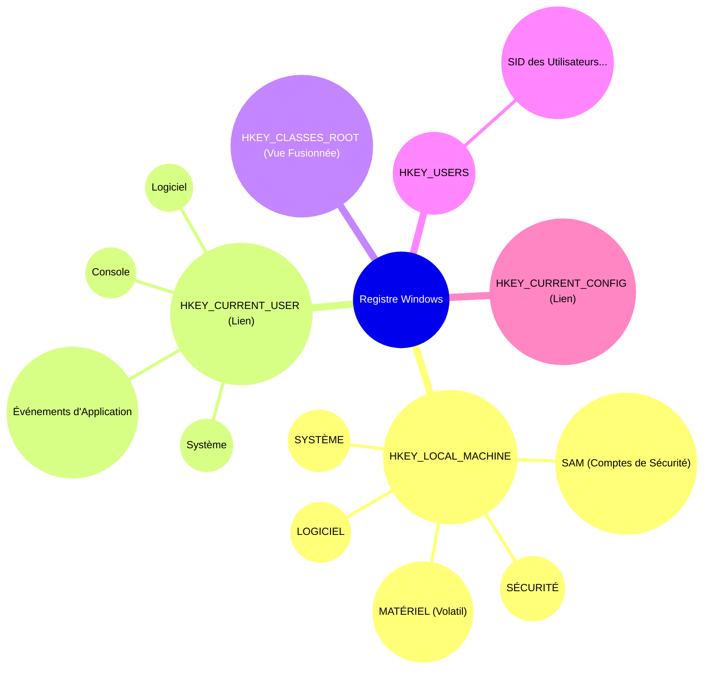
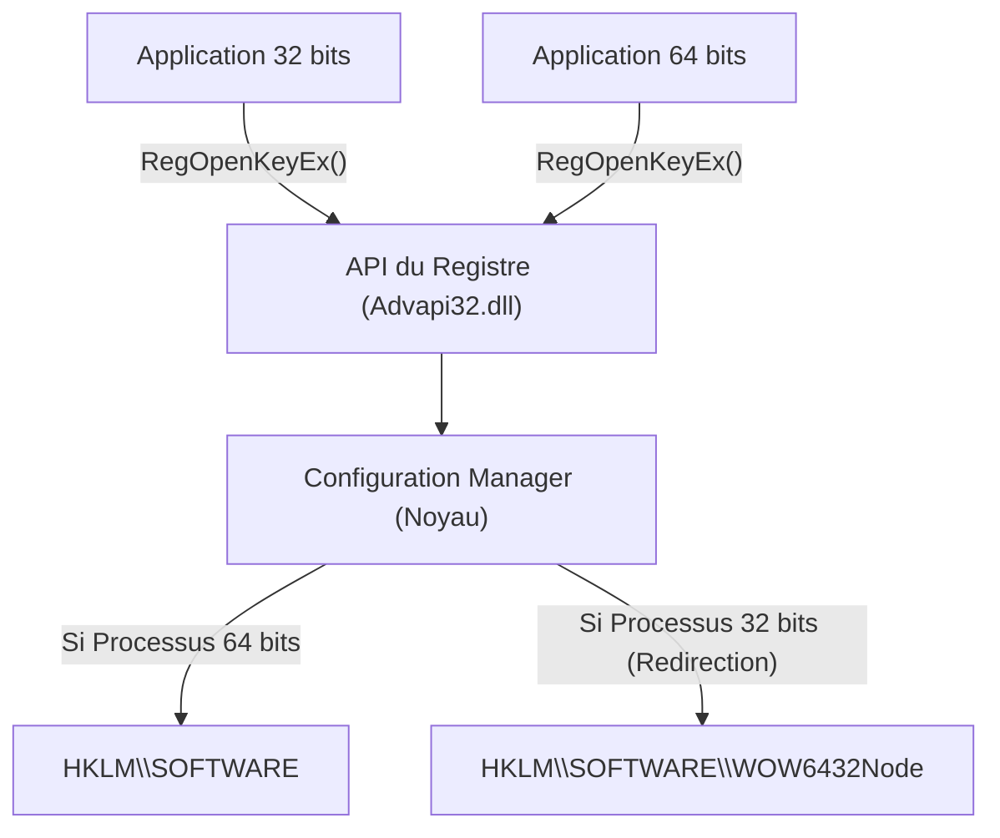
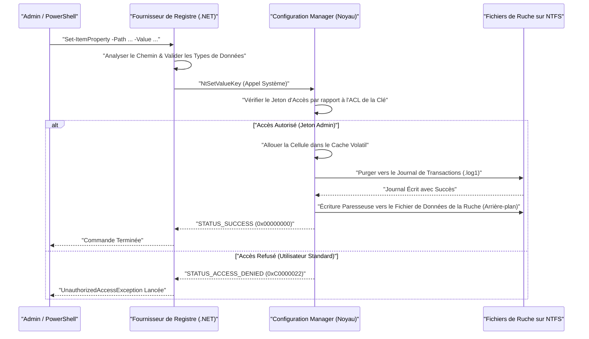

# Les bases du Registre Windows et les méthodes d'édition programmables et sécurisées

Dans le système d'exploitation Windows, le « Registre » (Registry) est une immense base de données hiérarchique qui stocke divers paramètres du système et des applications. Cet article explique en détail l'architecture de base du Registre Windows et les méthodes programmables et sécurisées pour le modifier à l'aide de PowerShell et C#.

## 1. Introduction : L'histoire et l'évolution du Registre Windows

Dans les premières versions de Windows (l'ère Windows 3.x), les paramètres du système et des applications étaient principalement enregistrés dans des fichiers `.ini` (fichiers d'initialisation). Cependant, d'innombrables fichiers INI se sont éparpillés dans tout le système pour chaque application, rendant la gestion considérablement complexe. De plus, comme les fichiers INI étaient basés sur du texte brut, il était difficile de stocker des données binaires, et il n'y avait aucun mécanisme de contrôle d'accès (sécurité). La vitesse d'analyse des fichiers était également lente, ce qui les rendait inadaptés à l'enregistrement de configurations à grande échelle.

Pour résoudre fondamentalement ces problèmes, à partir de Windows NT et Windows 95, le « Registre » a été adopté à grande échelle en tant que base de données de configuration centralisée. Le registre est une base de données hiérarchisée qui offre un typage fort, la prise en charge des données binaires et de solides fonctionnalités de sécurité via des listes de contrôle d'accès (ACL). Cela a permis à tous les composants, du noyau du système d'exploitation aux applications de l'espace utilisateur, de lire et d'écrire des paramètres via une interface unifiée (l'ensemble des fonctions `Reg*` de l'API Win32).

Jusqu'au Windows 11 moderne, le registre continue de fonctionner comme le cœur du système d'exploitation. La configuration matérielle, l'ordre de chargement des pilotes de périphériques, l'environnement de bureau de l'utilisateur, la liste des logiciels installés, et toutes les métadonnées nécessaires au fonctionnement du système sont consolidées dans le registre.

## 2. Au cœur de l'architecture : L'essence des ruches du Registre et le mappage en mémoire

Bien que le registre apparaisse logiquement comme une immense structure arborescente, il est physiquement divisé en plusieurs fichiers appelés « ruches » (Hives) enregistrés sur le disque. Cela sépare les paramètres à l'échelle du système des paramètres spécifiques à l'utilisateur, permettant un chargement efficace.

Les principaux fichiers de ruche se trouvent généralement dans le répertoire `%SystemRoot%\System32\config`.
- `SYSTEM` : Paramètres critiques nécessaires au démarrage du système d'exploitation (pilotes, services, configuration de démarrage, etc.).
- `SOFTWARE` : Paramètres globaux du système pour les logiciels installés. La plupart des paramètres des applications tierces s'y trouvent.
- `SAM` : Security Accounts Manager (comptes d'utilisateurs locaux et hachages de mots de passe).
- `SECURITY` : Politiques de sécurité locales et attribution des droits.
- `DEFAULT` : Profil d'utilisateur par défaut (modèle lors de la création d'un nouvel utilisateur).

Les fichiers de ruche spécifiques à l'utilisateur existent en tant que fichiers cachés dans le répertoire de profil de l'utilisateur (par exemple, `C:\Users\Username`).
- `NTUSER.DAT` : Les paramètres de base de cet utilisateur (la majeure partie de HKCU).
- `UsrClass.dat` : Les paramètres d'association d'extensions de fichiers de cet utilisateur (situé dans `AppData\Local\Microsoft\Windows`).

Ces fichiers sont mappés dans la mémoire du pool paginé du noyau par le « Configuration Manager (CM) » du noyau lors du démarrage du système d'exploitation. Le Configuration Manager est le composant en mode noyau qui traite les demandes de lecture/écriture du registre.

Il est à noter que toutes les données du registre n'existent pas sur le disque. Par exemple, la ruche `HARDWARE` est volatile et n'est jamais enregistrée dans un fichier sur le disque. Chaque fois que le système d'exploitation démarre et que le gestionnaire Plug-and-Play (PnP) détecte du matériel, elle est reconstruite de manière dynamique en mémoire.

De plus, dans les versions récentes de Windows, la journalisation des transactions est implémentée pour améliorer la fiabilité du registre. Les modifications apportées aux fichiers de ruche ne sont pas directement écrites dans les fichiers de données, mais sont d'abord enregistrées dans un journal de transactions (`.log1`, `.log2`). Cela empêche la corruption des données lors d'une perte d'alimentation inattendue pendant l'écriture ou lors d'un plantage du système, garantissant l'intégrité de la base de données d'une manière proche des propriétés ACID.

## 3. Structure hiérarchique des clés et des valeurs du Registre

Le registre a une structure hiérarchique très similaire à celle d'un système de fichiers. Le nœud racine est appelé « clé racine » (root key) ou « ruche » (hive), sous laquelle sont stockées les « clés » (keys), les « sous-clés » (subkeys), et l'essence même des données, les « valeurs » (values). Il est plus facile de comprendre en considérant les clés comme des répertoires et les valeurs comme des fichiers.

Les principales clés racines sont classées en cinq catégories :

1. **HKEY_LOCAL_MACHINE (HKLM)** : Stocke les paramètres du système et des logiciels applicables à l'ensemble de l'ordinateur (à tous les utilisateurs). Des privilèges d'administrateur sont nécessaires pour les modifications.
2. **HKEY_CURRENT_USER (HKCU)** : Stocke les paramètres spécifiques à l'utilisateur actuellement connecté. En réalité, il ne s'agit pas d'une base de données indépendante, mais d'un lien symbolique (alias) vers la clé SID (identifiant de sécurité) de l'utilisateur sous `HKEY_USERS`.
3. **HKEY_CLASSES_ROOT (HKCR)** : Stocke les associations d'extensions de fichiers, les informations d'enregistrement des classes COM (Component Object Model) et les extensions de l'interface graphique (shell). Cette clé est spéciale ; il s'agit d'une vue virtuelle où le Configuration Manager fusionne `HKLM\SOFTWARE\Classes` (à l'échelle du système) et `HKCU\Software\Classes` (utilisateur actuel). En cas de conflit, les paramètres spécifiques à l'utilisateur (HKCU) priment.
4. **HKEY_USERS (HKU)** : Stocke les paramètres de tous les profils d'utilisateurs sur le système (ceux actuellement chargés en mémoire). Ils sont hiérarchisés par SID.
5. **HKEY_CURRENT_CONFIG (HKCC)** : Paramètres concernant le profil matériel actuel. L'entité réelle est un lien vers `HKLM\SYSTEM\CurrentControlSet\Hardware Profiles\Current`.

La visualisation de cette structure hiérarchique complexe et des relations de liens donne ceci :



## 4. Types de données du Registre (Explication détaillée)

Les « valeurs » du registre ont chacune un type de données strictement défini. Lorsque l'on manipule le registre de manière programmable, il est essentiel de comprendre ces types et d'écrire les données avec le type approprié. Écrire avec un type incorrect peut amener les applications à lever des exceptions ou provoquer l'arrêt des fonctionnalités du système d'exploitation.

- **REG_SZ (Valeur chaîne)** : Le type de données le plus courant. Il stocke une chaîne Unicode (UTF-16LE) terminée par NULL. Il est utilisé pour les chemins de fichiers, les URL, les noms d'affichage de l'interface utilisateur, etc.
- **REG_DWORD (Valeur de mot double 32 bits)** : Une valeur entière non signée de 32 bits (4 octets). Il est fréquemment utilisé pour les valeurs booléennes (0=désactivé, 1=activé), les valeurs de délai d'attente en millisecondes et la définition des codes d'erreur. Étant donné que Windows est une architecture little-endian, les données sont stockées sur le disque à partir de l'octet de poids faible (ex: 0x12345678 est stocké comme `78 56 34 12`).
- **REG_QWORD (Valeur de mot quadruple 64 bits)** : Une valeur entière de 64 bits (8 octets). Avec la popularisation des architectures 64 bits, il est utilisé pour stocker de grands nombres (comme les quotas de disque ou la spécification de tailles de mémoire importantes) et les paramètres de taille de pointeur.
- **REG_MULTI_SZ (Valeur de chaînes multiples)** : Il stocke consécutivement plusieurs chaînes terminées par NULL, avec un autre caractère NULL vide (double NULL) à la fin pour marquer la terminaison. Il convient pour stocker des données sous forme de tableau, comme une liste d'adresses IP, une liste de services dépendants ou l'ordre des liaisons.
- **REG_EXPAND_SZ (Valeur chaîne extensible)** : Un type de chaîne spécial contenant des chaînes de variables d'environnement non étendues comme `%USERPROFILE%` ou `%SystemRoot%`. Lorsqu'une application la lit via l'API `RegQueryValueEx`, ou en appelant l'API `ExpandEnvironmentStrings`, le système d'exploitation l'étend dynamiquement en chemin absolu réel.
- **REG_BINARY (Valeur binaire)** : Un flux de données binaires brutes arbitraire. Il stocke des mots de passe chiffrés (comme LSA Secrets), des certificats numériques, et des structures complexes ou des données sérialisées spécifiques aux applications.
- **REG_NONE** : Données de type non défini. Très rare, mais utilisé pour les zones réservées aux clés de chiffrement, etc.
- **REG_RESOURCE_LIST** / **REG_FULL_RESOURCE_DESCRIPTOR** : Types avancés réservés au noyau, utilisés par les pilotes de périphériques pour enregistrer les informations d'allocation des ressources matérielles (IRQ, ports d'E/S, canaux DMA).

## 5. Modèles mathématiques et performances du Registre dans le système d'exploitation

Puisque le registre est directement lié aux performances du système d'exploitation (en particulier le temps de démarrage et la vitesse d'initialisation des processus), il est optimisé en interne à l'aide d'une structure de données avancée similaire à un B-Tree (Arbre B) appelée « Cell Index ».

### Complexité algorithmique de la recherche (Time Complexity)
La complexité temporelle $T_{\text{search}}$ lors de la recherche d'une clé spécifique (chemin) dans le registre dépend de la profondeur de l'arbre et du nombre de nœuds à chaque niveau de la hiérarchie. Lors de la recherche d'une sous-clé de profondeur $d$ (par exemple, $d=4$ pour `A\B\C\D`), la complexité peut théoriquement être modélisée comme suit :

$$
T_{\text{search}}(d, L) = \sum_{i=1}^{d} O(\log(C_i) \cdot L_i)
$$

Où $C_i$ est le nombre de nœuds enfants (sous-clés ou valeurs) à la profondeur $i$, et $L_i$ est la longueur de la chaîne (nombre de caractères) à comparer. Dans les fichiers de ruche, qui sont les entités physiques du registre, la liste des sous-clés est conservée sous forme d'index trié par la valeur de hachage du nom ou par ordre alphabétique. De ce fait, une recherche dichotomique $O(\log(C_i))$ est possible au lieu d'une simple recherche linéaire $O(C_i)$, permettant un accès extrêmement rapide même s'il y a des dizaines de milliers de sous-clés sous une seule clé.

### Empreinte de stockage (Space Complexity)
La taille globale du registre (l'espace occupé sur le disque physique) est calculée comme la somme de chaque ruche.

$$
\text{Size}_{\text{Total}} = \sum_{h \in \text{Hives}} \left( N_{h} \times S_{\text{key\_metadata}} + \sum_{v \in h} S_{\text{value}}(v) \right) + S_{\text{overhead}}
$$

$N_h$ est le nombre de clés dans la ruche $h$, $S_{\text{key\_metadata}}$ est la taille des métadonnées par clé (horodatage de la dernière écriture, pointeur vers le descripteur de sécurité, pointeur vers la clé parente, etc.), et $S_{\text{value}}(v)$ est la taille de la charge utile de la valeur $v$. Sont également inclus la surcharge (overhead) $S_{\text{overhead}}$ due aux journaux de transactions et aux cellules vides devenues inutiles (fragmentation). Si des données inutiles (comme les restes de logiciels mal désinstallés) sont laissées dans le registre pendant une longue période, cette empreinte augmentera, ce qui pourrait mettre sous pression la mémoire du pool paginé du système d'exploitation et entraîner une baisse des performances.

## 6. Les risques de l'édition manuelle menaçant la robustesse du système et la probabilité de corruption

L'édition manuelle à l'aide de l'Éditeur du Registre (`regedit.exe`) doit être considérée comme l'ultime recours en matière d'administration système. Le registre n'intègre pas de fonction « Annuler » (Undo) comme on en trouve dans les éditeurs de texte classiques, et les modifications de valeurs ou suppressions de clés sont immédiatement appliquées au système via le Configuration Manager.

En particulier, si vous modifiez ou supprimez par erreur ne serait-ce qu'un seul caractère dans une clé critique essentielle au démarrage du système (par exemple, les paramètres du pilote du contrôleur de disque sous `HKLM\SYSTEM\CurrentControlSet\Services` ou la valeur `Userinit` de `HKLM\SOFTWARE\Microsoft\Windows NT\CurrentVersion\Winlogon`), il existe un risque fatal que le système d'exploitation rencontre un écran bleu (BSoD) le rendant incapable de démarrer, ou reste bloqué à l'écran de connexion (écran noir).

### Modèle mathématique de la probabilité de corruption
Considérons la probabilité d'une panne système si nous modifions ou supprimons aléatoirement des clés dans le registre. Soit $C$ l'ensemble des clés critiques indispensables au bon fonctionnement du système, et $N_c = |C|$ leur nombre total. Soit $N_{\text{total}}$ le nombre total de clés dans l'ensemble du registre.
Si $k$ clés sont supprimées ou détruites de manière aléatoire, la probabilité $P_{\text{failure}}$ qu'au moins une clé critique soit corrompue est donnée par le calcul de probabilité d'un tirage sans remise (Sampling without replacement) comme suit :

$$
P_{\text{failure}} = 1 - \frac{\binom{N_{\text{total}} - N_c}{k}}{\binom{N_{\text{total}}}{k}} = 1 - \prod_{i=0}^{k-1} \left( 1 - \frac{N_c}{N_{\text{total}} - i} \right)
$$

Le nombre total de clés $N_{\text{total}}$ dans l'ensemble du registre est de l'ordre de centaines de milliers à des millions, mais $N_c$ se compte également en dizaines de milliers. Mathématiquement, même avec des opérations aléatoires, la probabilité de défaillance augmente drastiquement à mesure que $k$ augmente. De plus, dans la réalité des opérations manuelles, les utilisateurs ne modifient pas de manière « aléatoire » ; ils manipulent intentionnellement (en suivant des sites de tutoriels, etc.) des emplacements directement liés à la configuration du système et au comportement des logiciels, de sorte que la probabilité de toucher une clé critique est bien plus élevée que cette valeur théorique.

## 7. Virtualisation du Registre et architecture WOW64

Afin de maintenir la compatibilité avec les applications existantes (legacy), Windows implémente plusieurs mécanismes de « virtualisation » (redirection) avancés pour l'accès au registre. Programmer sans comprendre cela peut causer des bugs majeurs.

### Virtualisation du Registre UAC (Registry Virtualization)
Depuis Windows Vista, le Contrôle de compte d'utilisateur (UAC) a été introduit. Lorsqu'une ancienne application créée à l'époque de Windows XP (fonctionnant avec les privilèges d'un utilisateur standard) tente d'écrire dans des clés protégées comme `HKLM\SOFTWARE` qui nécessitent normalement des privilèges d'administrateur, afin d'éviter qu'elle ne plante avec une erreur d'accès refusé (Access Denied), Windows redirige silencieusement cette écriture vers le magasin virtuel dans le profil utilisateur : `HKCU\Software\Classes\VirtualStore\MACHINE\SOFTWARE`. Lors de la lecture, il fusionne les deux emplacements, celui d'origine et le magasin virtuel, et renvoie le résultat. Ainsi, l'application peut continuer à fonctionner normalement sans détecter d'erreur.
Cependant, si vous développez un outil pour modifier les paramètres de l'ensemble du système de manière programmable, vous devez spécifier `<requestedExecutionLevel level="requireAdministrator" />` dans le fichier manifeste et désactiver cette virtualisation.

### Redirection WOW64 (Windows 32-bit on Windows 64-bit)
Lors de l'exécution d'une ancienne application 32 bits sur une version 64 bits de Windows (le standard actuel), pour éviter que l'application 32 bits n'écrase accidentellement les paramètres système natifs 64 bits ou ne charge des DLL 64 bits incompatibles, certaines clés de registre sont automatiquement isolées et redirigées.
Par exemple, si une application 32 bits tente d'accéder à `HKLM\SOFTWARE\Vendor\App`, le système d'exploitation la redirige de manière transparente vers `HKLM\SOFTWARE\WOW6432Node\Vendor\App`.


Lorsque vous modifiez le registre à l'aide d'un script PowerShell ou d'une application C#, vous devez être très conscient du fait que le processus en cours d'exécution lui-même est en 32 bits ou en 64 bits. Sinon, vous rencontrerez le problème épineux des « paramètres qui devraient avoir été écrits mais qui ne sont pas visibles dans l'Explorateur (car ils ont été écrits ailleurs) ».

## 8. Édition programmable et sécurisée avec PowerShell

Pour minimiser les risques liés à la modification manuelle du registre, la meilleure pratique moderne consiste à coder les opérations (Infrastructure as Code) à l'aide de scripts PowerShell, garantissant ainsi l'automatisation, la reproductibilité et la testabilité. PowerShell dispose d'un « Fournisseur de Registre » (Registry Provider), vous permettant de manipuler le registre de manière transparente avec les mêmes applets de commande (`Get-ChildItem`, `Get-ItemProperty`, `New-Item`, etc.) que celles utilisées pour manipuler le système de fichiers (comme le lecteur C:).

Dans PowerShell, par défaut, des PSDrives dédiés (similaires à des lettres de lecteur) tels que `HKLM:` et `HKCU:` sont montés.

### Opérations CRUD de base
```powershell
# 1. Vérification de l'existence (Read)
$keyPath = "HKCU:\Software\MyCustomApp"
if (-Not (Test-Path -Path $keyPath)) {
    # 2. Création d'une nouvelle clé (Create)
    New-Item -Path "HKCU:\Software" -Name "MyCustomApp" -Force | Out-Null
    Write-Host "La clé a été créée."
}

# 3. Écriture / Mise à jour de la valeur (Update) - Écrire 1 en tant que REG_DWORD
Set-ItemProperty -Path $keyPath -Name "EnableDebug" -Value 1 -Type DWord

# 4. Lecture de la valeur (Read)
$debugFlag = (Get-ItemProperty -Path $keyPath).EnableDebug
Write-Host "Indicateur de débogage actuel : $debugFlag"

# 5. Suppression de la valeur (Delete)
Remove-ItemProperty -Path $keyPath -Name "EnableDebug" -Force
```

### Exemple pratique 1 : Configuration automatique de l'environnement de développement (Ajout au PATH des variables d'environnement)
Le script suivant est un exemple d'automatisation dans lequel un développeur ajoute en toute sécurité le répertoire d'un outil personnalisé à la variable d'environnement utilisateur `PATH` lors de la configuration d'une nouvelle machine Windows.

```powershell
$envKey = "HKCU:\Environment"
$newPath = "C:\tools\bin"

# Lire le PATH actuel (supprimer les erreurs pour une récupération sécurisée)
$currentPathInfo = Get-ItemProperty -Path $envKey -Name "Path" -ErrorAction SilentlyContinue
$currentPath = if ($currentPathInfo) { $currentPathInfo.Path } else { "" }

# Vérifier par expression régulière s'il est déjà inclus
if ($currentPath -notmatch [regex]::Escape($newPath)) {
    # Ajouter un point-virgule à la fin s'il n'y en a pas et concaténer
    if ($currentPath -and $currentPath -notmatch ";$") {
        $currentPath += ";"
    }
    $updatedPath = $currentPath + $newPath
    
    # L'écrire en tant que type REG_EXPAND_SZ (Important)
    Set-ItemProperty -Path $envKey -Name "Path" -Value $updatedPath -Type ExpandString
    Write-Host "La variable d'environnement PATH a été mise à jour : $newPath"
    
    # Informer les processus en cours de l'exécution de la modification des variables d'environnement (WM_SETTINGCHANGE)
    # Cela permet aux nouveaux explorateurs, etc., de refléter le changement sans redémarrer
    [Environment]::SetEnvironmentVariable("Path", $updatedPath, [EnvironmentVariableTarget]::User)
} else {
    Write-Host "Le PATH a déjà été ajouté."
}
```

### Exemple pratique 2 : Ajout d'une action personnalisée au menu contextuel
Il s'agit d'un script qui ajoute un élément personnalisé intitulé « Ouvrir avec My IDE » au menu contextuel qui apparaît lors d'un clic droit sur un répertoire ou un fichier spécifique.

```powershell
# Le menu lorsque vous faites un clic droit sur l'arrière-plan d'un répertoire (zone vide)
$menuPath = "HKCR:\Directory\Background\shell\OpenWithMyIDE"
$commandPath = "$menuPath\command"

try {
    # Créer la clé parente pour l'élément de menu
    New-Item -Path $menuPath -Force -ErrorAction Stop | Out-Null
    
    # Définir le nom d'affichage dans la valeur (par défaut)
    Set-ItemProperty -Path $menuPath -Name "(default)" -Value "Ouvrir avec My IDE" -Type String
    
    # Définir l'icône (Optionnel)
    Set-ItemProperty -Path $menuPath -Name "Icon" -Value "C:\Program Files\MyIDE\ide.exe,0" -Type String

    # Créer la sous-clé command et définir la ligne de commande à exécuter
    # %V est une variable qui se développe dans le chemin du répertoire de travail actuel
    New-Item -Path $commandPath -Force -ErrorAction Stop | Out-Null
    Set-ItemProperty -Path $commandPath -Name "(default)" -Value "`"C:\Program Files\MyIDE\ide.exe`" `"%V`"" -Type String

    Write-Host "Le menu contextuel a été ajouté."
} catch {
    Write-Error "Échec de la modification du registre. Veuillez vérifier si vous l'exécutez avec des privilèges d'administrateur. Erreur : $_"
}
```

### Séquence interne de l'accès au registre depuis PowerShell
La séquence d'actions internes au système d'exploitation lorsqu'un script PowerShell modifie le registre est illustrée ci-dessous.



## 9. Accès robuste au registre avec C# (.NET)

Lorsque vous accédez au registre à partir d'une application .NET (comme C#), vous utilisez les classes `Microsoft.Win32.Registry` et `RegistryKey`.
Le principal avantage d'utiliser C# réside dans une gestion robuste des erreurs grâce à une puissante gestion des exceptions (`try-catch`), une vérification de type stricte et la possibilité de spécifier explicitement une vue 32 bits/64 bits à l'aide de l'énumération `RegistryView`.

Voici un exemple de code C# permettant de lire et d'écrire en toute sécurité dans le registre côté 64 bits (en évitant la redirection WOW6432Node) dans un environnement de système d'exploitation 64 bits.

```csharp
using System;
using System.Security;
using Microsoft.Win32;

class RegistryEditor
{
    static void Main()
    {
        // Chemin sous HKLM (nécessite des privilèges d'administrateur)
        string keyPath = @"SOFTWARE\MyEnterpriseApp\Settings";

        // Ouvrir la vue native 64 bits en spécifiant RegistryView.Registry64
        // Utiliser l'instruction using pour s'assurer que le handle de la clé de registre (ressource non gérée) est libéré (Dispose)
        try
        {
            using (RegistryKey baseKey = RegistryKey.OpenBaseKey(RegistryHive.LocalMachine, RegistryView.Registry64))
            {
                // Ouvrir la clé avec les droits d'écriture (writable: true). Crée la clé si elle n'existe pas.
                using (RegistryKey subKey = baseKey.CreateSubKey(keyPath, writable: true))
                {
                    if (subKey != null)
                    {
                        // Écrire la valeur en tant que REG_DWORD
                        subKey.SetValue("MaxConnections", 100, RegistryValueKind.DWord);
                        
                        // Écrire la valeur en tant que REG_SZ
                        subKey.SetValue("ApiEndpoint", "https://api.example.com", RegistryValueKind.String);
                        
                        // Écrire un tableau d'octets en tant que REG_BINARY
                        byte[] secretData = { 0x01, 0x02, 0x0A, 0xFF };
                        subKey.SetValue("BinarySecret", secretData, RegistryValueKind.Binary);
                        
                        Console.WriteLine("L'écriture dans le registre a réussi.");
                    }
                }
            }
        }
        catch (UnauthorizedAccessException ex)
        {
            // Se produit souvent s'il n'est pas exécuté en tant qu'administrateur
            Console.WriteLine($"Erreur d'autorisation : Veuillez « Exécuter en tant qu'administrateur » le programme. Détails : {ex.Message}");
        }
        catch (SecurityException ex)
        {
            // Bloqué par la sécurité d'accès du code (CAS) de .NET
            Console.WriteLine($"Exception de sécurité : {ex.Message}");
        }
        catch (Exception ex)
        {
            // Autres erreurs IO inattendues, etc.
            Console.WriteLine($"Erreur inattendue : {ex.Message}");
        }
    }
}
```

Le « handle » renvoyé par le système d'exploitation lors de l'ouverture d'une clé de registre est une ressource non gérée (unmanaged resource) qui consomme de la mémoire et des ressources système. Par conséquent, il est de règle d'or dans la programmation C# d'utiliser un bloc `using` ou d'appeler explicitement `.Dispose()` (ou `.Close()`) dans un bloc `finally` pour prévenir de manière fiable les fuites de handle.

## 10. Méthodes de sauvegarde et de restauration du Registre

Même avec l'automatisation via des scripts ou des programmes, il est absolument impératif de réaliser une sauvegarde avant d'effectuer des modifications critiques.

### Sauvegarde et importation via les fichiers .reg
La méthode la plus classique et universelle est l'exportation vers un fichier `.reg`. Ce fichier est un fichier texte possédant un format spécifique dont la structure est la suivante :

```text
Windows Registry Editor Version 5.00

[HKEY_CURRENT_USER\Software\MyCustomApp]
"EnableDebug"=dword:00000001
"ApiEndpoint"="https://api.example.com"
"BinaryData"=hex:01,02,0a,ff
```
*Remarque : Les données binaires sont représentées par des valeurs hexadécimales séparées par des virgules à la suite de `hex:`.*

Vous pouvez implémenter des sauvegardes automatiques au sein de scripts batch en utilisant l'outil en ligne de commande `reg.exe`.
```cmd
REM Sauvegarder la clé spécifiée (les sous-clés sont également exportées de manière récursive)
reg export HKLM\SOFTWARE\MyEnterpriseApp C:\backup\myapp_backup.reg /y

REM Restaurer la sauvegarde
reg import C:\backup\myapp_backup.reg
```

### Méthodes de sauvegarde plus avancées utilisant PowerShell
Au lieu de le traiter comme un simple texte, vous pouvez exploiter l'orientation objet de PowerShell pour exporter les objets du registre et les enregistrer au format XML (CliXML). Ainsi, lors de la restauration, vous pouvez les gérer en conservant les informations de type, sans dépendre de l'analyse des chaînes de caractères.

```powershell
# Création de la sauvegarde (enregistrement des propriétés en tant que XML)
Get-ItemProperty -Path "HKCU:\Software\MyCustomApp" | Export-Clixml -Path "C:\backup\reg_backup.xml"

# Concept de restauration
$backup = Import-Clixml -Path "C:\backup\reg_backup.xml"
# Puisque $backup contient le PSObject personnalisé restauré,
# vous pouvez créer une logique pour boucler sur ses propriétés et les réappliquer avec Set-ItemProperty.
```

## 11. Dépannage avec Sysinternals Process Monitor (Procmon)

Si vous ne savez pas où un programme écrit dans le registre ou si vous recherchez la cause d'un accès refusé (« Access Denied »), l'outil **Process Monitor (Procmon)** de Sysinternals, fourni gratuitement par Microsoft, est très puissant.
Procmon permet de capturer en temps réel tous les appels d'API du registre (`RegOpenKey`, `RegQueryValue`, `RegSetValue`, etc.) survenant sur le système d'exploitation et permet le dépannage grâce à un filtrage avancé tel que :

- `Process Name` is `powershell.exe`
- `Operation` begins with `Reg`
- `Result` is `ACCESS DENIED`

Ceci vous permet d'identifier instantanément quelles configurations ACL de clé sont manquantes ou si elles ont été incorrectement redirigées vers WOW6432Node.

## 12. Sécurité et Bonnes Pratiques

Enfin, voici un résumé des principes de conception et des bonnes pratiques importants lors de la manipulation du registre.

1. **Appliquer strictement le principe du moindre privilège** : Les paramètres des applications et des scripts doivent être stockés autant que possible sous la clé `Software` de `HKCU` (utilisateur actuel). L'écriture dans `HKLM` nécessite une élévation de privilèges administrateur par l'UAC, ce qui élargit la surface d'attaque en termes de sécurité et détériore l'expérience utilisateur.
2. **Activation de l'Audit (Auditing)** : Pour les clés d'une importance extrême pour la sécurité (comme la clé `Run` gérant le démarrage automatique ou les clés de configuration des services), vous devez configurer la SACL (System Access Control List) et la configurer pour enregistrer (auditer) qui a modifié ou supprimé la valeur et quand, dans le journal de sécurité de l'Observateur d'événements de Windows.
3. **Réagir à l'obsolescence de la fonctionnalité transactionnelle** : La fonction de transaction du registre (TxR), introduite autrefois dans Windows Vista et utilisant le Gestionnaire de transactions du noyau (KTM), est dépréciée depuis Windows 10. Les applications doivent implémenter leurs propres mécanismes de sauvegarde et de restauration (comme la lecture de la valeur d'origine avant la modification pour la conserver en mémoire).
4. **Attention aux conflits avec la stratégie de groupe (GPO)** : Les zones de `HKLM\SOFTWARE\Policies` et de `HKCU\Software\Policies` sont des domaines qui devraient être gérés de manière centralisée par les stratégies de groupe d'Active Directory. Même si un script réécrit directement ces clés, elles seront écrasées de force par les paramètres du contrôleur de domaine lors du prochain cycle de mise à jour en arrière-plan des stratégies de groupe (généralement à des intervalles de 90 à 120 minutes), ce qui fait que les paramètres ne persistent pas.

## Résumé

Le Registre Windows est un système fondamental puissant et complexe qui gère de manière intégrée tous les comportements du système d'exploitation et les paramètres des applications. Les modifications manuelles non structurées comportent un risque très élevé de corruption du système, prouvé mathématiquement. C'est pourquoi, dans la gestion système et le développement modernes, il est essentiel de configurer et de gérer l'infrastructure de manière sûre, testable et reproductible à l'aide de méthodes programmables telles que PowerShell et C#, en adhérant aux principes de l'Infrastructure as Code. Utilisez la compréhension approfondie de l'architecture et les modèles d'implémentation expliqués dans cet article pour vous orienter vers la construction d'environnements Windows plus robustes et sécurisés.
