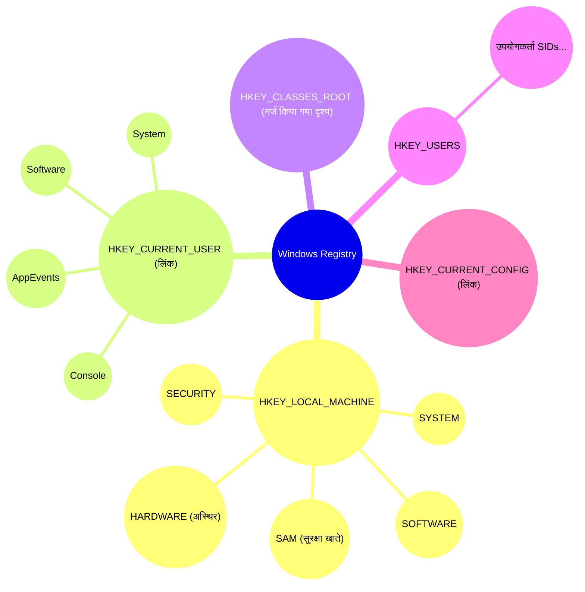
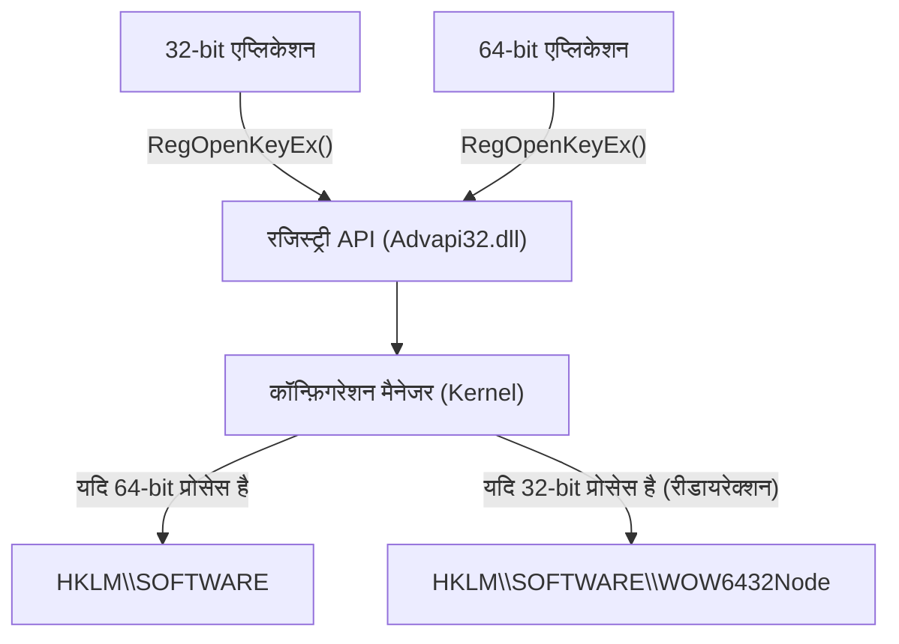
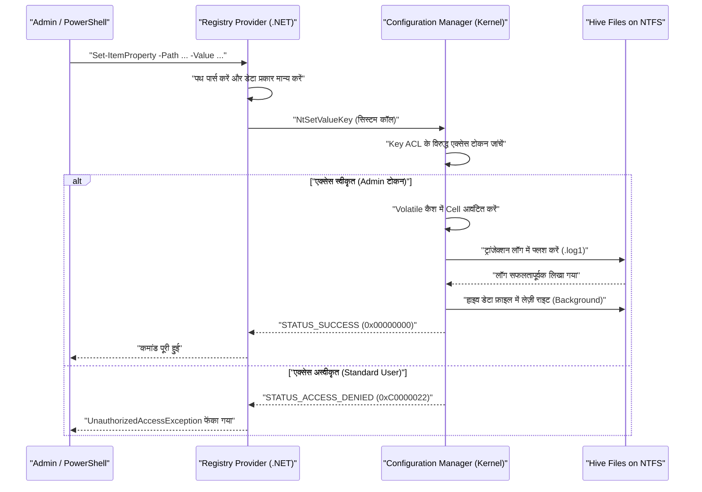

# Windows रजिस्ट्री का बुनियादी ज्ञान और प्रोग्राम करने योग्य सुरक्षित संपादन के तरीके

Windows ऑपरेटिंग सिस्टम में, "रजिस्ट्री (Registry)" एक विशाल पदानुक्रमित डेटाबेस (hierarchical database) है जो सिस्टम और एप्लिकेशन की विभिन्न सेटिंग्स को संग्रहीत करता है। इस लेख में, हम Windows रजिस्ट्री की बुनियादी वास्तुकला (architecture) से लेकर PowerShell और C# का उपयोग करके प्रोग्राम करने योग्य और सुरक्षित रजिस्ट्री संपादन विधियों तक बहुत विस्तार से चर्चा करेंगे।

## 1. परिचय: Windows रजिस्ट्री का इतिहास और विकास

Windows के शुरुआती संस्करणों (Windows 3.x युग) में, सिस्टम और एप्लिकेशन सेटिंग्स मुख्य रूप से `.ini` (आरंभीकरण फ़ाइलों) में सहेजी जाती थीं। हालांकि, अनगिनत INI फ़ाइलें हर एप्लिकेशन के लिए पूरे सिस्टम में बिखरी हुई होने लगीं, जिससे प्रबंधन काफी जटिल हो गया। इसके अलावा, चूंकि INI फ़ाइलें प्लेन-टेक्स्ट आधारित थीं, इसलिए बाइनरी डेटा को सहेजना मुश्किल था, और एक्सेस कंट्रोल (सुरक्षा) के लिए कोई तंत्र मौजूद नहीं था। फ़ाइल पार्स करने की गति भी धीमी थी, जिससे बड़े पैमाने पर सेटिंग्स सहेजने के लिए यह अनुपयुक्त था।

इन समस्याओं को मौलिक रूप से हल करने के लिए, Windows NT और Windows 95 के बाद से एक केंद्रीकृत सेटिंग डेटाबेस के रूप में "रजिस्ट्री" को पूरी तरह से अपनाया गया। रजिस्ट्री एक पदानुक्रमित डेटाबेस है, जो मजबूत टाइपिंग, बाइनरी डेटा सपोर्ट, और एक्सेस कंट्रोल लिस्ट (ACL) के माध्यम से मजबूत सुरक्षा सुविधाएँ प्रदान करता है। इससे OS कर्नेल से लेकर यूजर स्पेस एप्लिकेशन तक सभी घटकों (components) को एकीकृत इंटरफ़ेस (Win32 API के `Reg*` फ़ंक्शन) के माध्यम से सेटिंग्स पढ़ने और लिखने की अनुमति मिल गई।

आधुनिक Windows 11 तक, रजिस्ट्री OS के दिल के रूप में काम करती आ रही है। हार्डवेयर कॉन्फ़िगरेशन, डिवाइस ड्राइवर लोड क्रम, उपयोगकर्ता का डेस्कटॉप वातावरण, इंस्टॉल किए गए सॉफ़्टवेयर की सूची, आदि सिस्टम के संचालन के लिए आवश्यक सभी मेटाडेटा रजिस्ट्री में एकत्रित होते हैं।

## 2. वास्तुकला की गहराई: रजिस्ट्री हाइव (Hive) की वास्तविकता और मेमोरी मैपिंग

हालांकि तार्किक रूप से रजिस्ट्री एक विशाल ट्री संरचना के रूप में दिखाई देती है, लेकिन भौतिक रूप से इसे "हाइव (Hive)" नामक कई फ़ाइलों में विभाजित किया जाता है और डिस्क पर सहेजा जाता है। इसके कारण संपूर्ण सिस्टम सेटिंग्स और उपयोगकर्ता-विशिष्ट सेटिंग्स अलग हो जाती हैं, जिससे कुशल लोडिंग संभव हो पाती है।

मुख्य हाइव फ़ाइलें आमतौर पर `%SystemRoot%\System32\config` डायरेक्टरी में मौजूद होती हैं।
- `SYSTEM`: ऑपरेटिंग सिस्टम बूटिंग के लिए आवश्यक महत्वपूर्ण सेटिंग्स (ड्राइवर, सेवाएं, बूट कॉन्फ़िगरेशन, आदि)।
- `SOFTWARE`: इंस्टॉल किए गए सॉफ़्टवेयर के लिए पूरे सिस्टम की सेटिंग्स। थर्ड-पार्टी ऐप्स की अधिकांश सेटिंग्स यहाँ जाती हैं।
- `SAM`: Security Accounts Manager (स्थानीय उपयोगकर्ता खाते और पासवर्ड हैश)।
- `SECURITY`: स्थानीय सुरक्षा नीतियां (Local Security Policy) और अधिकार आवंटन।
- `DEFAULT`: डिफ़ॉल्ट उपयोगकर्ता प्रोफ़ाइल (नया उपयोगकर्ता बनाते समय टेम्पलेट)।

उपयोगकर्ता-विशिष्ट हाइव फ़ाइलें उपयोगकर्ता की प्रोफ़ाइल डायरेक्टरी (उदाहरण: `C:\Users\Username`) में छिपी हुई फ़ाइलों के रूप में मौजूद होती हैं।
- `NTUSER.DAT`: उस उपयोगकर्ता की बुनियादी सेटिंग्स (HKCU का अधिकांश भाग)।
- `UsrClass.dat`: उस उपयोगकर्ता के लिए फ़ाइल एक्सटेंशन एसोसिएशन सेटिंग्स (`AppData\Local\Microsoft\Windows` में स्थित)।

जब OS बूट होता है, तो कर्नेल के "Configuration Manager (CM)" द्वारा इन फ़ाइलों को कर्नेल पेज पूल मेमोरी पर मैप किया जाता है। Configuration Manager एक कर्नेल-मोड घटक है जो रजिस्ट्री के पढ़ने/लिखने के अनुरोधों को संभालता है।

विशेष रूप से ध्यान देने वाली बात यह है कि सारा रजिस्ट्री डेटा डिस्क पर मौजूद नहीं होता है। उदाहरण के लिए, `HARDWARE` हाइव अस्थिर (Volatile) है और डिस्क पर किसी भी फ़ाइल में बिल्कुल भी सहेजा नहीं जाता है। जब भी OS बूट होता है और प्लग एंड प्ले (PnP) मैनेजर हार्डवेयर का पता लगाता है, तो इसे मेमोरी में गतिशील रूप से फिर से बनाया जाता है।

इसके अलावा, नवीनतम Windows में रजिस्ट्री की विश्वसनीयता बढ़ाने के लिए ट्रांजेक्शन लॉगिंग (Transaction Logging) लागू की गई है। हाइव फ़ाइलों में परिवर्तन सीधे डेटा फ़ाइलों में नहीं लिखे जाते हैं, बल्कि पहले ट्रांजेक्शन लॉग (`.log1`, `.log2`) में दर्ज किए जाते हैं। यह लिखने के दौरान अप्रत्याशित बिजली विफलता या सिस्टम क्रैश होने पर डेटा भ्रष्टाचार (करप्शन) को रोकता है, और लगभग ACID गुणों के साथ डेटाबेस की अखंडता की गारंटी देता है।

## 3. रजिस्ट्री कुंजी (Key) और मान (Value) की पदानुक्रमित संरचना

रजिस्ट्री में फ़ाइल सिस्टम के समान एक पदानुक्रमित संरचना होती है। रूट नोड को "रूट कुंजी (Root Key)" या "हाइव" कहा जाता है, जिसके तहत "कुंजी (Key)", "उप-कुंजी (Subkey)", और "मान (Value)" जो वास्तविक डेटा होते हैं, संग्रहीत किए जाते हैं। इसे इस तरह समझना आसान है कि कुंजियाँ डायरेक्टरी के बराबर हैं और मान फ़ाइलों के बराबर हैं।

मुख्य रूट कुंजियों को निम्नलिखित 5 श्रेणियों में वर्गीकृत किया गया है।

1. **HKEY_LOCAL_MACHINE (HKLM)**: सिस्टम सेटिंग्स और सॉफ़्टवेयर सेटिंग्स जो संपूर्ण कंप्यूटर (सभी उपयोगकर्ताओं) पर लागू होती हैं, संग्रहीत की जाती हैं। परिवर्तनों के लिए व्यवस्थापक (Administrator) विशेषाधिकारों की आवश्यकता होती है।
2. **HKEY_CURRENT_USER (HKCU)**: वर्तमान में लॉग ऑन उपयोगकर्ता-विशिष्ट सेटिंग्स संग्रहीत की जाती हैं। वास्तव में, यह कोई स्वतंत्र डेटाबेस नहीं है, बल्कि `HKEY_USERS` के तहत संबंधित उपयोगकर्ता की SID (Security Identifier) कुंजी के लिए केवल एक सिम्बोलिक लिंक (उपनाम) है।
3. **HKEY_CLASSES_ROOT (HKCR)**: फ़ाइल एक्सटेंशन एसोसिएशन, COM (Component Object Model) क्लास पंजीकरण जानकारी, और शेल एक्सटेंशन संग्रहीत किए जाते हैं। यह कुंजी एक विशेष और आभासी (virtual) दृश्य है जिसे Configuration Manager `HKLM\SOFTWARE\Classes` (पूरा सिस्टम) और `HKCU\Software\Classes` (वर्तमान उपयोगकर्ता) को मर्ज (मर्ज) करके प्रदर्शित करता है। टकराव की स्थिति में, उपयोगकर्ता-विशिष्ट सेटिंग्स (HKCU) को प्राथमिकता दी जाती है।
4. **HKEY_USERS (HKU)**: सिस्टम पर सभी उपयोगकर्ता प्रोफ़ाइलों (वर्तमान में मेमोरी में लोड) की सेटिंग्स संग्रहीत की जाती हैं। यह SID के आधार पर पदानुक्रमित है।
5. **HKEY_CURRENT_CONFIG (HKCC)**: वर्तमान हार्डवेयर प्रोफ़ाइल से संबंधित सेटिंग्स। वास्तव में यह `HKLM\SYSTEM\CurrentControlSet\Hardware Profiles\Current` का एक लिंक है।

इस जटिल पदानुक्रमित संरचना और लिंक संबंधों को दर्शाने के लिए नीचे विज़ुअलाइज़ेशन दिया गया है।



## 4. रजिस्ट्री डेटा प्रकार (विस्तृत विवरण)

रजिस्ट्री में "मान (Value)" के लिए कड़े डेटा प्रकार परिभाषित हैं। रजिस्ट्री को प्रोग्रामेटिक रूप से प्रबंधित करते समय, इन प्रकारों को सही ढंग से समझना और उचित प्रकार के साथ डेटा लिखना आवश्यक है। गलत प्रकार से लिखने पर एप्लिकेशन अपवाद (exception) फेंक सकता है या OS के कार्य बंद हो सकते हैं।

- **REG_SZ (स्ट्रिंग मान)**: सबसे आम डेटा प्रकार। यह NULL-टर्मिनेटेड यूनिकोड स्ट्रिंग (UTF-16LE) को संग्रहीत करता है। इसका उपयोग फ़ाइल पथ, URL, UI के प्रदर्शन नाम आदि के लिए किया जाता है।
- **REG_DWORD (32-बिट पूर्णांक मान)**: 32-बिट (4 बाइट) अनसाइन्ड (unsigned) पूर्णांक मान। इसका अक्सर बूलियन मान (0=अक्षम, 1=सक्षम), मिलीसेकंड में टाइमआउट मान, और त्रुटि कोड सेट करने के लिए उपयोग किया जाता है। चूंकि Windows लिटिल-एंडियन (little-endian) वास्तुकला है, इसलिए डिस्क पर इसे लोअर बाइट से क्रमिक रूप से (उदाहरण: 0x12345678 `78 56 34 12` के रूप में) सहेजा जाता है।
- **REG_QWORD (64-बिट पूर्णांक मान)**: 64-बिट (8 बाइट) पूर्णांक मान। 64-बिट वास्तुकला के प्रसार के साथ, इसका उपयोग बड़ी संख्या (डिस्क कोटा या बड़ी क्षमता वाले मेमोरी आकार विनिर्देश, आदि) और पॉइंटर-आकार सेटिंग्स को सहेजने के लिए किया जाता है।
- **REG_MULTI_SZ (मल्टी-स्ट्रिंग मान)**: एक प्रारूप जो लगातार कई NULL-टर्मिनेटेड स्ट्रिंग्स को संग्रहीत करता है, और अंत में एक और खाली NULL-टर्मिनेटेड कैरेक्टर (डबल NULL) रखकर इसे समाप्त करता है। यह सरणी (array) जैसा डेटा सहेजने के लिए उपयुक्त है, जैसे कि IP पतों की सूची, निर्भर सेवाओं की सूची, बाइंडिंग का क्रम आदि।
- **REG_EXPAND_SZ (विस्तार योग्य स्ट्रिंग मान)**: एक विशेष स्ट्रिंग प्रकार जिसमें अन-एक्सपेंडेड पर्यावरण चर (environment variable) स्ट्रिंग जैसे `%USERPROFILE%` या `%SystemRoot%` शामिल हैं। जब कोई एप्लिकेशन इसे `RegQueryValueEx` API के माध्यम से पढ़ता है, या `ExpandEnvironmentStrings` API को कॉल करता है, तो OS द्वारा इसे गतिशील रूप से वास्तविक पूर्ण (absolute) पथ में विस्तारित किया जाता है।
- **REG_BINARY (बाइनरी मान)**: कोई भी रॉ बाइनरी डेटा स्ट्रीम। इसमें एन्क्रिप्टेड पासवर्ड (LSA सीक्रेट्स, आदि), डिजिटल सर्टिफिकेट, एप्लिकेशन-विशिष्ट जटिल संरचनाएं और क्रमिक (serialized) डेटा संग्रहीत किए जाते हैं।
- **REG_NONE**: अपरिभाषित प्रकार का डेटा। यह बहुत दुर्लभ है, लेकिन इसका उपयोग एन्क्रिप्शन कुंजियों के आरक्षित क्षेत्र आदि में किया जाता है।
- **REG_RESOURCE_LIST** / **REG_FULL_RESOURCE_DESCRIPTOR**: डिवाइस ड्राइवरों द्वारा हार्डवेयर संसाधनों (IRQ, I/O पोर्ट, DMA चैनल) की आवंटन जानकारी रिकॉर्ड करने के लिए उपयोग किए जाने वाले कर्नेल-विशिष्ट उन्नत प्रकार।

## 5. ऑपरेटिंग सिस्टम में रजिस्ट्री का गणितीय मॉडल और प्रदर्शन

रजिस्ट्री सीधे OS के प्रदर्शन (विशेष रूप से बूट समय और प्रक्रिया आरंभीकरण गति) से संबंधित है, इसलिए आंतरिक रूप से इसे "Cell Index" नामक B-Tree (B-ट्री) के समान एक उन्नत डेटा संरचना का उपयोग करके अनुकूलित किया गया है।

### खोज की समय जटिलता (Time Complexity)
रजिस्ट्री में किसी विशिष्ट कुंजी (पथ) को खोजते समय समय जटिलता $T_{\text{search}}$ ट्री की गहराई और प्रत्येक पदानुक्रम स्तर में नोड्स की संख्या पर निर्भर करती है। गहराई $d$ की उप-कुंजी (उदाहरण: यदि `A\B\C\D` है तो $d=4$) को खोजने की जटिलता सैद्धांतिक रूप से इस प्रकार मॉडल की जा सकती है:

$$
T_{\text{search}}(d, L) = \sum_{i=1}^{d} O(\log(C_i) \cdot L_i)
$$

यहाँ, $C_i$ गहराई $i$ पर चाइल्ड नोड्स (उप-कुंजियाँ या मान) की संख्या है, और $L_i$ तुलना की जाने वाली स्ट्रिंग की लंबाई (वर्णों की संख्या) है। हाइव फ़ाइल के अंदर जो रजिस्ट्री की वास्तविक इकाई है, उप-कुंजियों की सूची को नाम के हैश मान या वर्णानुक्रम में सॉर्ट किए गए इंडेक्स के रूप में रखा जाता है। इसलिए, सरल रैखिक खोज (linear search) $O(C_i)$ के बजाय बाइनरी खोज $O(\log(C_i))$ संभव है, जिससे किसी एक कुंजी के नीचे हजारों उप-कुंजियां होने पर भी अत्यंत तीव्र पहुंच (access) प्राप्त होती है।

### स्टोरेज फुटप्रिंट (Space Complexity)
रजिस्ट्री का कुल आकार (भौतिक डिस्क पर अधिकृत स्थान) प्रत्येक हाइव के योग के रूप में गणना की जाती है।

$$
\text{Size}_{\text{Total}} = \sum_{h \in \text{Hives}} \left( N_{h} \times S_{\text{key\_metadata}} + \sum_{v \in h} S_{\text{value}}(v) \right) + S_{\text{overhead}}
$$

$N_h$ हाइव $h$ में कुंजियों की संख्या है, $S_{\text{key\_metadata}}$ प्रति कुंजी मेटाडेटा (अंतिम लेखन टाइमस्टैम्प, सुरक्षा डिस्क्रिप्टर का पॉइंटर, पैरेंट कुंजी का पॉइंटर आदि) का आकार है, $S_{\text{value}}(v)$ मान $v$ का पेलोड आकार है। ट्रांजेक्शन लॉग और अनावश्यक खाली कोशिकाओं (विखंडन/fragmentation) के कारण ओवरहेड $S_{\text{overhead}}$ भी शामिल है। यदि आप लंबे समय तक रजिस्ट्री में अनावश्यक डेटा (जैसे अनइंस्टॉल किए गए सॉफ़्टवेयर के अवशेष) छोड़ते हैं, तो यह फुटप्रिंट बढ़ जाता है, जो OS की पेज पूल मेमोरी पर दबाव डाल सकता है और प्रदर्शन में कमी ला सकता है।

## 6. मैन्युअल संपादन के जोखिम और सिस्टम की स्थिरता को खतरे में डालने की विफलता की संभावना

रजिस्ट्री संपादक (`regedit.exe`) का उपयोग करके मैन्युअल संपादन को सिस्टम प्रबंधन के अंतिम उपाय के रूप में देखा जाना चाहिए। सामान्य दस्तावेज़ संपादकों के विपरीत, रजिस्ट्री में कोई "पूर्ववत करें (Undo)" सुविधा शामिल नहीं है, और मानों में परिवर्तन या कुंजियों का हटाना तुरंत Configuration Manager के माध्यम से सिस्टम में परिलक्षित होता है।

विशेष रूप से, यदि आप सिस्टम बूट के लिए आवश्यक किसी महत्वपूर्ण कुंजी (क्रिटिकल की) में एक वर्ण भी गलती से संपादित या हटा देते हैं (उदाहरण के लिए: `HKLM\SYSTEM\CurrentControlSet\Services` के अंतर्गत डिस्क नियंत्रक ड्राइवर सेटिंग्स, या `HKLM\SOFTWARE\Microsoft\Windows NT\CurrentVersion\Winlogon` का `Userinit` मान), तो एक घातक जोखिम होता है कि OS ब्लू स्क्रीन (BSoD) का अनुभव करेगा और बूट करने में असमर्थ होगा, या यह लॉगिन स्क्रीन (ब्लैक स्क्रीन) से आगे नहीं बढ़ पाएगा।

### विफलता संभावना का गणितीय मॉडल
आइए उस प्रणाली विफलता की संभावना पर विचार करें यदि हम गलती से रजिस्ट्री में कुंजियों को बेतरतीब ढंग से बदलते हैं या हटा देते हैं। मान लें कि सिस्टम के ठीक से काम करने के लिए आवश्यक महत्वपूर्ण कुंजियों का सेट $C$ है, और उनकी कुल संख्या $N_c = |C|$ है। मान लें कि पूरी रजिस्ट्री में कुंजियों की कुल संख्या $N_{\text{total}}$ है।
यदि आप यादृच्छिक (random) रूप से $k$ कुंजियाँ हटाते हैं या नष्ट करते हैं, तो कम से कम एक महत्वपूर्ण कुंजी के नष्ट होने की संभावना $P_{\text{failure}}$, गैर-प्रतिस्थापन नमूनाकरण (Sampling without replacement) संभावना गणना द्वारा निम्नानुसार व्यक्त की जाती है:

$$
P_{\text{failure}} = 1 - \frac{\binom{N_{\text{total}} - N_c}{k}}{\binom{N_{\text{total}}}{k}} = 1 - \prod_{i=0}^{k-1} \left( 1 - \frac{N_c}{N_{\text{total}} - i} \right)
$$

हालाँकि पूरी रजिस्ट्री में कुंजियों की संख्या $N_{\text{total}}$ सैकड़ों हजारों से लाखों के क्रम में है, $N_c$ भी हजारों के क्रम में है। गणितीय रूप से, यहां तक कि यादृच्छिक संचालन के साथ भी, जैसे-जैसे $k$ बढ़ता है विफलता की संभावना तेजी से बढ़ती है। इसके अलावा, वास्तविक मैन्युअल संचालन में, उपयोगकर्ता "यादृच्छिक रूप से" संपादन नहीं करते हैं, बल्कि जानबूझकर (ट्यूटोरियल साइटों आदि को देखते हुए) उन क्षेत्रों में हेरफेर करते हैं जो सीधे सिस्टम सेटिंग्स या सॉफ़्टवेयर संचालन से संबंधित हैं, इसलिए महत्वपूर्ण कुंजी को छूने की संभावना सैद्धांतिक मान की तुलना में बहुत अधिक है।

## 7. रजिस्ट्री वर्चुअलाइजेशन और WOW64 वास्तुकला

विरासत अनुप्रयोगों (legacy applications) के साथ संगतता बनाए रखने के लिए, Windows रजिस्ट्री एक्सेस के लिए कुछ उन्नत "वर्चुअलाइजेशन (रीडायरेक्ट)" तंत्र लागू करता है। यदि आप इसे समझे बिना प्रोग्राम करते हैं, तो यह गंभीर बग का कारण बन सकता है।

### UAC रजिस्ट्री वर्चुअलाइजेशन (Registry Virtualization)
Windows Vista से, उपयोगकर्ता खाता नियंत्रण (UAC) पेश किया गया था। जब Windows XP युग में बनाया गया कोई पुराना एप्लिकेशन (मानक उपयोगकर्ता विशेषाधिकारों के साथ चल रहा हो) संरक्षित कुंजियों जैसे `HKLM\SOFTWARE` पर लिखने का प्रयास करता है, जिसके लिए व्यवस्थापक विशेषाधिकारों की आवश्यकता होती है, तो उसे पहुंच अस्वीकृत (Access Denied) त्रुटि के साथ क्रैश होने से बचाने के लिए, Windows गुप्त रूप से उस लेखन को उपयोगकर्ता प्रोफ़ाइल के वर्चुअल स्टोर `HKCU\Software\Classes\VirtualStore\MACHINE\SOFTWARE` पर रीडायरेक्ट कर देता है। पढ़ते समय भी, यह मूल स्थान और वर्चुअल स्टोर दोनों को मिलाता (मर्ज) है और उन्हें लौटाता है। इससे एप्लिकेशन बिना किसी त्रुटि का पता लगाए सामान्य रूप से काम करना जारी रख सकता है।
हालांकि, पूरे सिस्टम के लिए सेटिंग्स को प्रोग्रामेटिक रूप से बदलने के लिए एक टूल विकसित करते समय, आपको मेनिफ़ेस्ट फ़ाइल में `<requestedExecutionLevel level="requireAdministrator" />` निर्दिष्ट करना होगा और इस वर्चुअलाइजेशन को अक्षम (disable) करना होगा।

### WOW64 (Windows 32-bit on Windows 64-bit) का रीडायरेक्शन
64-बिट Windows (वर्तमान मुख्यधारा) पर एक पुराने 32-बिट एप्लिकेशन को चलाते समय, कुछ रजिस्ट्री कुंजियों को स्वचालित रूप से अलग कर दिया जाता है और रीडायरेक्ट किया जाता है ताकि यह सुनिश्चित हो सके कि 32-बिट एप्लिकेशन गलती से 64-बिट देशी सिस्टम सेटिंग्स को अधिलेखित (overwrite) न करे या असंगत 64-बिट DLL लोड न करे।
उदाहरण के लिए, जब 32-बिट ऐप `HKLM\SOFTWARE\Vendor\App` को एक्सेस करने का प्रयास करता है, तो OS पारदर्शी रूप से इसे `HKLM\SOFTWARE\WOW6432Node\Vendor\App` पर रीडायरेक्ट करता है।


PowerShell स्क्रिप्ट या C# एप्लिकेशन से रजिस्ट्री को संपादित करते समय, इस बात का दृढ़ता से ध्यान रखना चाहिए कि निष्पादन प्रक्रिया 32-बिट है या 64-बिट। अन्यथा, यह एक कष्टप्रद समस्या पैदा कर सकता है जैसे "मैंने जो सेटिंग लिखी है वह एक्सप्लोरर से दिखाई नहीं दे रही है (इसे कहीं और लिखा गया है)"।

## 8. PowerShell के माध्यम से प्रोग्राम करने योग्य सुरक्षित संपादन

रजिस्ट्री को मैन्युअल रूप से संपादित करने के जोखिम को कम करने के लिए, PowerShell स्क्रिप्ट का उपयोग करके संचालन को कोडित (Infrastructure as Code) करना, और स्वचालन (automation), पुनरुत्पादन (reproducibility) और परीक्षण क्षमता (testability) सुनिश्चित करना आधुनिक सर्वोत्तम अभ्यास है। PowerShell एक "Registry Provider" से लैस है, जो आपको कमांडलेट्स (जैसे `Get-ChildItem`, `Get-ItemProperty`, `New-Item`, आदि) का उपयोग करके फ़ाइल सिस्टम (C: ड्राइव, आदि) में हेरफेर करने के समान ही पारदर्शी रूप से रजिस्ट्री में हेरफेर करने की अनुमति देता है।

PowerShell में, `HKLM:` और `HKCU:` जैसे समर्पित PSDrive (ड्राइव लेटर के समान) डिफ़ॉल्ट रूप से माउंट किए जाते हैं।

### बुनियादी CRUD ऑपरेशन
```powershell
# 1. अस्तित्व की जांच (Read)
$keyPath = "HKCU:\Software\MyCustomApp"
if (-Not (Test-Path -Path $keyPath)) {
    # 2. नई कुंजी बनाना (Create)
    New-Item -Path "HKCU:\Software" -Name "MyCustomApp" -Force | Out-Null
    Write-Host "कुंजी बना दी गई है।"
}

# 3. मान लिखना/अपडेट करना (Update) - REG_DWORD के रूप में 1 लिखें
Set-ItemProperty -Path $keyPath -Name "EnableDebug" -Value 1 -Type DWord

# 4. मान पढ़ना (Read)
$debugFlag = (Get-ItemProperty -Path $keyPath).EnableDebug
Write-Host "वर्तमान डिबग फ़्लैग: $debugFlag"

# 5. मान हटाना (Delete)
Remove-ItemProperty -Path $keyPath -Name "EnableDebug" -Force
```

### व्यावहारिक उदाहरण 1: विकास परिवेश की स्वचालित सेटिंग (पर्यावरण चर PATH में जोड़ना)
निम्नलिखित स्क्रिप्ट एक स्वचालन उदाहरण है जो डेवलपर्स द्वारा एक नई Windows मशीन स्थापित करते समय उपयोगकर्ता पर्यावरण चर (environment variable) `PATH` में कस्टम टूल की डायरेक्टरी को सुरक्षित रूप से जोड़ता है।

```powershell
$envKey = "HKCU:\Environment"
$newPath = "C:\tools\bin"

# वर्तमान PATH पढ़ें (त्रुटियों को दबाकर सुरक्षित रूप से प्राप्त करें)
$currentPathInfo = Get-ItemProperty -Path $envKey -Name "Path" -ErrorAction SilentlyContinue
$currentPath = if ($currentPathInfo) { $currentPathInfo.Path } else { "" }

# नियमित अभिव्यक्ति (regex) के साथ जाँचें कि क्या यह पहले से शामिल है
if ($currentPath -notmatch [regex]::Escape($newPath)) {
    # यदि अंत में कोई सेमीकोलन नहीं है, तो उसे जोड़ें
    if ($currentPath -and $currentPath -notmatch ";$") {
        $currentPath += ";"
    }
    $updatedPath = $currentPath + $newPath
    
    # REG_EXPAND_SZ प्रकार के रूप में लिखें (महत्वपूर्ण)
    Set-ItemProperty -Path $envKey -Name "Path" -Value $updatedPath -Type ExpandString
    Write-Host "PATH पर्यावरण चर को अपडेट कर दिया गया है: $newPath"
    
    # चल रही प्रक्रियाओं को पर्यावरण चर परिवर्तन के बारे में सूचित करें (WM_SETTINGCHANGE)
    # यह बिना रिबूट किए नए एक्सप्लोरर आदि में परिलक्षित होगा
    [Environment]::SetEnvironmentVariable("Path", $updatedPath, [EnvironmentVariableTarget]::User)
} else {
    Write-Host "PATH पहले ही जोड़ा जा चुका है।"
}
```

### व्यावहारिक उदाहरण 2: संदर्भ मेनू (Context Menu) में कस्टम क्रिया जोड़ना
यह एक स्क्रिप्ट है जो किसी विशिष्ट फ़ाइल या डायरेक्टरी पर राइट-क्लिक करने पर संदर्भ मेनू में "My IDE में खोलें" नामक एक कस्टम आइटम जोड़ती है।

```powershell
# पृष्ठभूमि (खाली जगह) पर राइट-क्लिक करते समय मेनू
$menuPath = "HKCR:\Directory\Background\shell\OpenWithMyIDE"
$commandPath = "$menuPath\command"

try {
    # मेनू आइटम की मूल (parent) कुंजी बनाएँ
    New-Item -Path $menuPath -Force -ErrorAction Stop | Out-Null
    
    # (default) मान को प्रदर्शन नाम पर सेट करें
    Set-ItemProperty -Path $menuPath -Name "(default)" -Value "My IDE में खोलें" -Type String
    
    # आइकन सेट करें (वैकल्पिक)
    Set-ItemProperty -Path $menuPath -Name "Icon" -Value "C:\Program Files\MyIDE\ide.exe,0" -Type String

    # command उप-कुंजी बनाएँ और निष्पादित की जाने वाली कमांड लाइन सेट करें
    # %V एक चर है जो वर्तमान डायरेक्टरी के पथ में विस्तारित होता है
    New-Item -Path $commandPath -Force -ErrorAction Stop | Out-Null
    Set-ItemProperty -Path $commandPath -Name "(default)" -Value "`"C:\Program Files\MyIDE\ide.exe`" `"%V`"" -Type String

    Write-Host "संदर्भ मेनू जोड़ दिया गया है।"
} catch {
    Write-Error "रजिस्ट्री को बदलने में विफल रहा। सुनिश्चित करें कि आप व्यवस्थापक विशेषाधिकारों के साथ चला रहे हैं। त्रुटि: $_"
}
```

### PowerShell से रजिस्ट्री एक्सेस का आंतरिक अनुक्रम (Sequence)
नीचे OS के अंदर क्रिया अनुक्रम दिखाया गया है जब PowerShell स्क्रिप्ट रजिस्ट्री को बदलती है।



## 9. C# (.NET) के साथ मजबूत रजिस्ट्री एक्सेस

.NET एप्लिकेशन (C# आदि) से रजिस्ट्री तक पहुँचने के लिए, `Microsoft.Win32.Registry` वर्ग और `RegistryKey` वर्ग का उपयोग किया जाता है।
C# का उपयोग करने का सबसे बड़ा लाभ यह है कि यह शक्तिशाली अपवाद हैंडलिंग (`try-catch`) के माध्यम से मजबूत त्रुटि हैंडलिंग, सख्त प्रकार की जाँच (type checking), और `RegistryView` एन्यूमरेशन का उपयोग करके स्पष्ट 32-बिट/64-बिट दृश्य निर्दिष्ट करने की क्षमता प्रदान करता है।

नीचे एक C# कोड का उदाहरण है जो सुरक्षित रूप से 64-बिट OS वातावरण में 64-बिट साइड रजिस्ट्री को पढ़ता और लिखता है (WOW6432Node के रीडायरेक्शन से बचते हुए)।

```csharp
using System;
using System.Security;
using Microsoft.Win32;

class RegistryEditor
{
    static void Main()
    {
        // HKLM के नीचे पथ (व्यवस्थापक विशेषाधिकार आवश्यक हैं)
        string keyPath = @"SOFTWARE\MyEnterpriseApp\Settings";

        // 64-बिट नेटिव व्यू खोलने के लिए RegistryView.Registry64 निर्दिष्ट करें
        // using स्टेटमेंट का उपयोग करके, सुनिश्चित करें कि रजिस्ट्री कुंजी का हैंडल (अप्रबंधित संसाधन) डिस्पोज़ किया गया है
        try
        {
            using (RegistryKey baseKey = RegistryKey.OpenBaseKey(RegistryHive.LocalMachine, RegistryView.Registry64))
            {
                // लेखन अनुमति (writable: true) के साथ कुंजी खोलें। यदि यह मौजूद नहीं है, तो इसे बनाएँ।
                using (RegistryKey subKey = baseKey.CreateSubKey(keyPath, writable: true))
                {
                    if (subKey != null)
                    {
                        // REG_DWORD के रूप में मान लिखें
                        subKey.SetValue("MaxConnections", 100, RegistryValueKind.DWord);
                        
                        // REG_SZ के रूप में मान लिखें
                        subKey.SetValue("ApiEndpoint", "https://api.example.com", RegistryValueKind.String);
                        
                        // बाइट ऐरे को REG_BINARY के रूप में लिखें
                        byte[] secretData = { 0x01, 0x02, 0x0A, 0xFF };
                        subKey.SetValue("BinarySecret", secretData, RegistryValueKind.Binary);
                        
                        Console.WriteLine("रजिस्ट्री में सफलतापूर्वक लिखा गया।");
                    }
                }
            }
        }
        catch (UnauthorizedAccessException ex)
        {
            // अक्सर तब होता है जब व्यवस्थापक के रूप में नहीं चलाया जा रहा हो
            Console.WriteLine($"अनुमति त्रुटि: कृपया प्रोग्राम को 'व्यवस्थापक के रूप में चलाएं'। विवरण: {ex.Message}");
        }
        catch (SecurityException ex)
        {
            // यदि .NET कोड एक्सेस सुरक्षा (CAS) द्वारा ब्लॉक किया गया हो
            Console.WriteLine($"सुरक्षा अपवाद: {ex.Message}");
        }
        catch (Exception ex)
        {
            // अन्य अप्रत्याशित IO त्रुटियां आदि।
            Console.WriteLine($"अप्रत्याशित त्रुटि: {ex.Message}");
        }
    }
}
```

रजिस्ट्री कुंजी खोलने पर OS से प्राप्त "हैंडल (Handle)" एक अप्रबंधित संसाधन (unmanaged resource) है जो मेमोरी और सिस्टम संसाधनों की खपत करता है। इसलिए, C# प्रोग्रामिंग में यह एक सख्त नियम है कि `using` ब्लॉक का उपयोग करें या `finally` ब्लॉक के भीतर `.Dispose()` (या `.Close()`) को स्पष्ट रूप से कॉल करें ताकि हैंडल के लीक को पूरी तरह से रोका जा सके।

## 10. रजिस्ट्री बैकअप और रिस्टोर के तरीके

भले ही आप स्क्रिप्ट या प्रोग्राम द्वारा स्वचालित रूप से कार्य कर रहे हों, कोई भी महत्वपूर्ण परिवर्तन करने से पहले बैकअप लेना अत्यंत आवश्यक है।

### .reg फ़ाइलों का उपयोग करके बैकअप और आयात
सबसे शास्त्रीय और सामान्य तरीका `.reg` फ़ाइल में निर्यात करना है। इस फ़ाइल का अपना विशिष्ट प्रारूप होता है और यह टेक्स्ट-आधारित होती है, जिसकी संरचना इस प्रकार होती है:

```text
Windows Registry Editor Version 5.00

[HKEY_CURRENT_USER\Software\MyCustomApp]
"EnableDebug"=dword:00000001
"ApiEndpoint"="https://api.example.com"
"BinaryData"=hex:01,02,0a,ff
```
*नोट: बाइनरी डेटा को `hex:` के बाद अल्पविराम (comma) से अलग किए गए हेक्साडेसिमल मानों के रूप में दर्शाया जाता है।*

कमांड-लाइन टूल `reg.exe` का उपयोग करके बैच स्क्रिप्ट के भीतर स्वचालित बैकअप लागू किया जा सकता है।
```cmd
REM निर्दिष्ट कुंजी का बैकअप लें (उप-कुंजियों को भी पुनरावर्ती रूप से निर्यात किया जाता है)
reg export HKLM\SOFTWARE\MyEnterpriseApp C:\backup\myapp_backup.reg /y

REM बैकअप रिस्टोर करना
reg import C:\backup\myapp_backup.reg
```

### PowerShell का उपयोग करके अधिक उन्नत बैकअप विधियाँ
केवल सादे पाठ (text) के बजाय, PowerShell की वस्तु-उन्मुख (object-oriented) प्रकृति का लाभ उठाते हुए, आप रजिस्ट्री ऑब्जेक्ट्स को निर्यात कर सकते हैं और उन्हें XML प्रारूप (CliXML) में सहेज सकते हैं। यह आपको रिस्टोरिंग करते समय स्ट्रिंग पार्सिंग पर भरोसा किए बिना प्रकार (type) की जानकारी को बनाए रखने की अनुमति देता है।

```powershell
# बैकअप प्राप्त करें (गुणों/properties को XML के रूप में सहेजें)
Get-ItemProperty -Path "HKCU:\Software\MyCustomApp" | Export-Clixml -Path "C:\backup\reg_backup.xml"

# रिस्टोर (Restore) की अवधारणा
$backup = Import-Clixml -Path "C:\backup\reg_backup.xml"
# चूंकि $backup में पुनर्स्थापित कस्टम PSObject शामिल है,
# आप इसके गुणों पर लूप करने और सेटिंग्स को फिर से लागू करने के लिए Set-ItemProperty का उपयोग करके तर्क बना सकते हैं।
```

## 11. Sysinternals Process Monitor (Procmon) का उपयोग करके समस्या निवारण (Troubleshooting)

यदि आप सुनिश्चित नहीं हैं कि कोई प्रोग्राम रजिस्ट्री में कहाँ लिख रहा है, या "Access Denied" का कारण ढूंढ रहे हैं, तो Microsoft द्वारा मुफ्त प्रदान किया गया Sysinternals टूल **Process Monitor (Procmon)** बहुत शक्तिशाली है।
Procmon का उपयोग करके, आप OS पर होने वाली सभी रजिस्ट्री API कॉल (जैसे `RegOpenKey`, `RegQueryValue`, `RegSetValue`) को वास्तविक समय में कैप्चर कर सकते हैं, और उन्नत फ़िल्टरिंग का उपयोग करके समस्या निवारण कर सकते हैं, जैसे:

- `Process Name` is `powershell.exe`
- `Operation` begins with `Reg`
- `Result` is `ACCESS DENIED`

इससे आप तुरंत पहचान सकते हैं कि किस कुंजी में ACL सेटिंग्स की कमी है, या क्या इसे गलती से WOW6432Node पर रीडायरेक्ट किया गया है।

## 12. सुरक्षा और सर्वोत्तम अभ्यास

अंत में, रजिस्ट्री से निपटने के लिए हम महत्वपूर्ण डिज़ाइन सिद्धांतों और सर्वोत्तम प्रथाओं को सारांशित कर रहे हैं।

1. **न्यूनतम विशेषाधिकार सिद्धांत (Principle of least privilege) को सख्ती से लागू करें**: एप्लिकेशन या स्क्रिप्ट सेटिंग्स को यथासंभव `HKCU` (वर्तमान उपयोगकर्ता) के भीतर `Software` कुंजी के तहत सहेजा जाना चाहिए। `HKLM` में लिखने के लिए UAC द्वारा व्यवस्थापक विशेषाधिकारों की आवश्यकता होती है, जो सुरक्षा के लिए हमले की सतह (attack surface) को बढ़ाता है और उपयोगकर्ता अनुभव को खराब करता है।
2. **ऑडिटिंग (Auditing) सक्षम करें**: सुरक्षा की दृष्टि से बेहद महत्वपूर्ण कुंजियों (जैसे ऑटो-स्टार्ट को नियंत्रित करने वाली `Run` कुंजी या सर्विस सेटिंग्स) के लिए, SACL (System Access Control List) कॉन्फ़िगर करें ताकि यह रिकॉर्ड किया जा सके कि किसने और कब मानों को बदला या हटाया। इसे Windows इवेंट व्यूअर के "सुरक्षा लॉग" में लॉग (ऑडिट) किया जाता है।
3. **ट्रांजेक्शन सुविधा के बहिष्करण (Deprecation) के प्रति प्रतिक्रिया**: रजिस्ट्री ट्रांजेक्शन सुविधा (TxR), जो "Kernel Transaction Manager (KTM)" का उपयोग करती है और Windows Vista में पेश की गई थी, Windows 10 के बाद से बहिष्कृत (Deprecated) हो गई है। एप्लिकेशन पक्ष को स्वयं बैकअप और रोलबैक तंत्र लागू करना चाहिए (जैसे कि परिवर्तन से पहले मूल मान को पढ़ना और उसे मेमोरी में बनाए रखना)।
4. **समूह नीति (Group Policy - GPO) के साथ टकराव से सावधान रहें**: `HKLM\SOFTWARE\Policies` और `HKCU\Software\Policies` क्षेत्र Active Directory की समूह नीति द्वारा केंद्रीय रूप से प्रबंधित किए जाने चाहिए। यदि आप सीधे स्क्रिप्ट से इन कुंजियों को ओवरराइट करते हैं, तो वे अगले समूह नीति पृष्ठभूमि अपडेट चक्र (आमतौर पर 90 से 120 मिनट के अंतराल) के दौरान डोमेन नियंत्रक सेटिंग्स द्वारा जबरन अधिलेखित कर दिए जाएंगे, जिससे आपकी सेटिंग्स स्थायी नहीं रह पाएंगी।

## निष्कर्ष

Windows रजिस्ट्री एक शक्तिशाली और जटिल आधारभूत प्रणाली है जो OS के सभी व्यवहारों और एप्लिकेशन सेटिंग्स का व्यापक प्रबंधन करती है। इसके मैन्युअल, अव्यवस्थित संपादन से सिस्टम विफलता का उच्च जोखिम होता है, जो गणितीय रूप से सिद्ध हो चुका है। इसलिए, PowerShell और C# जैसे प्रोग्राम करने योग्य साधनों का उपयोग करते हुए, Infrastructure as Code के सिद्धांतों के अनुसार सुरक्षित, परीक्षण योग्य और पुनरुत्पादन योग्य कॉन्फ़िगरेशन प्रबंधन करना आधुनिक सिस्टम प्रशासन और विकास में आवश्यक है। इस लेख में समझाए गए गहरे वास्तुकला ज्ञान और कार्यान्वयन पैटर्न का लाभ उठाएं, और अधिक मजबूत और सुरक्षित Windows वातावरण बनाने का लक्ष्य रखें。
