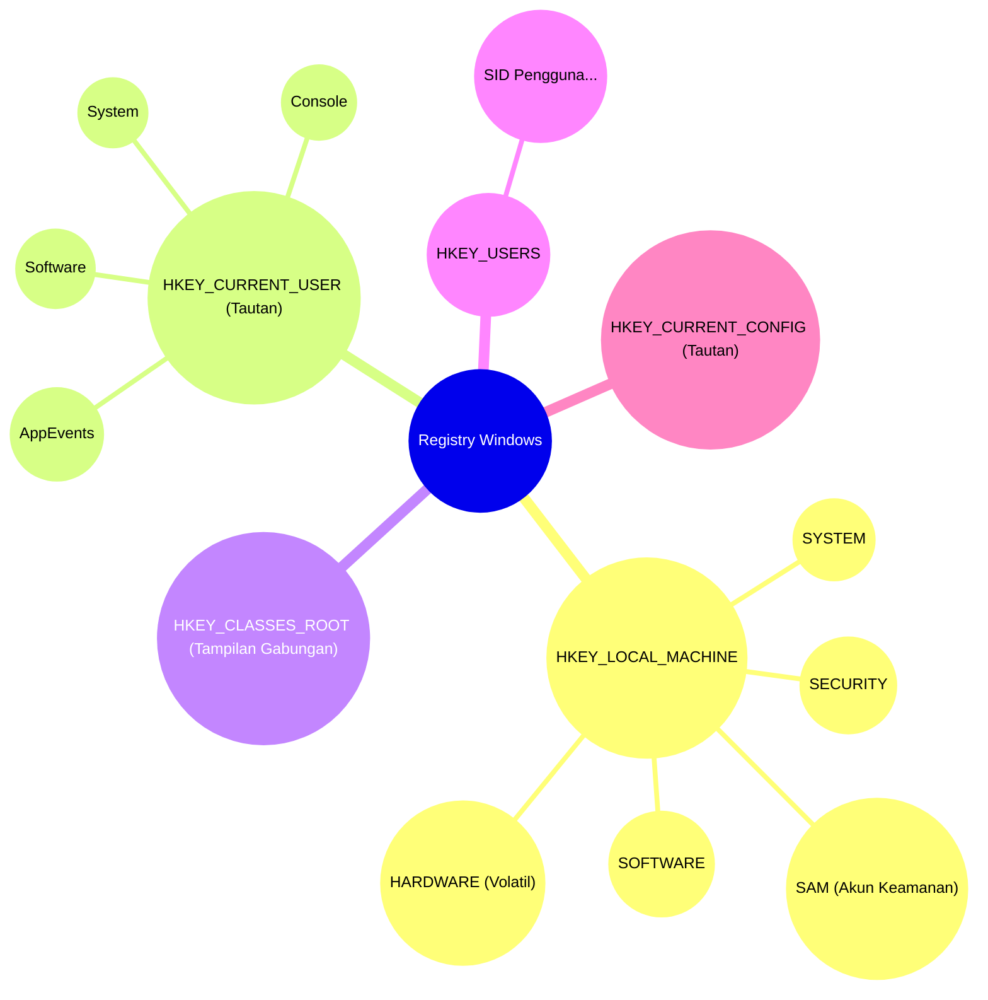
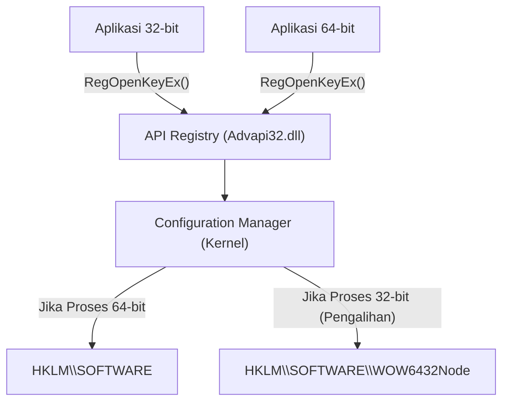
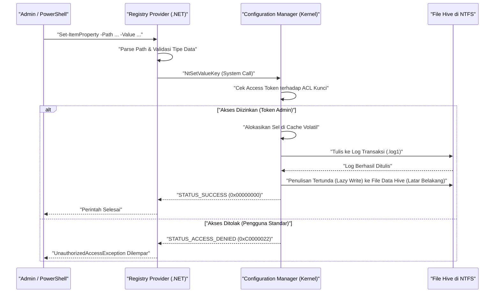

# Pengetahuan Dasar Registry Windows dan Metode Pengeditan Aman secara Terprogram

Dalam sistem operasi Windows, "Registry" adalah basis data hierarkis raksasa yang menyimpan berbagai pengaturan sistem dan aplikasi. Artikel ini akan menjelaskan secara sangat mendetail mulai dari arsitektur dasar Registry Windows hingga metode pengeditan Registry yang aman dan terprogram menggunakan PowerShell atau C#.

## 1. Pendahuluan: Sejarah dan Evolusi Registry Windows

Pada versi awal Windows (era Windows 3.x), pengaturan sistem dan aplikasi sebagian besar disimpan dalam file `.ini` (file inisialisasi). Namun, file INI yang tak terhitung jumlahnya untuk setiap aplikasi menjadi tersebar di seluruh sistem, membuat manajemen menjadi sangat rumit. Selain itu, karena file INI berbasis teks biasa, sulit untuk menyimpan data biner, dan tidak ada mekanisme kontrol akses (keamanan). Kecepatan parsing file juga lambat, sehingga tidak cocok untuk menyimpan pengaturan skala besar.

Untuk menyelesaikan masalah ini secara mendasar, sejak Windows NT dan Windows 95, "Registry" mulai diadopsi secara penuh sebagai basis data pengaturan terpusat. Registry adalah basis data hierarkis yang menyediakan pengetikan yang kuat, dukungan untuk data biner, serta fitur keamanan yang tangguh melalui Daftar Kontrol Akses (ACL). Dengan ini, setiap komponen mulai dari kernel OS hingga aplikasi di ruang pengguna dapat membaca dan menulis pengaturan menggunakan antarmuka terpadu (kumpulan fungsi `Reg*` dari Win32 API).

Hingga Windows 11 modern, Registry terus berfungsi sebagai jantung dari sistem operasi. Semua metadata yang diperlukan untuk pengoperasian sistem, seperti konfigurasi perangkat keras, urutan pemuatan driver perangkat, lingkungan desktop pengguna, hingga daftar perangkat lunak yang diinstal, terpusat di dalam Registry.

## 2. Kedalaman Arsitektur: Entitas Hive Registry dan Pemetaan Memori

Meskipun secara logis Registry terlihat sebagai satu struktur pohon raksasa, secara fisik ia dibagi menjadi beberapa file yang disebut "Hive" dan disimpan di disk. Hal ini memisahkan pengaturan seluruh sistem dan pengaturan khusus pengguna, sehingga memungkinkan pemuatan yang efisien.

File hive utama biasanya berada di direktori `%SystemRoot%\System32\config`:
- `SYSTEM`: Pengaturan penting yang diperlukan untuk memulai sistem operasi (driver, layanan, konfigurasi booting, dll.).
- `SOFTWARE`: Pengaturan seluruh sistem untuk perangkat lunak yang diinstal. Sebagian besar pengaturan aplikasi pihak ketiga masuk ke sini.
- `SAM`: Security Accounts Manager (akun pengguna lokal dan hash kata sandi).
- `SECURITY`: Kebijakan keamanan lokal dan penugasan hak istimewa.
- `DEFAULT`: Profil pengguna default (templat saat membuat pengguna baru).

File hive khusus pengguna ada sebagai file tersembunyi di direktori profil pengguna (misalnya: `C:\Users\Username`):
- `NTUSER.DAT`: Pengaturan dasar pengguna tersebut (sebagian besar HKCU).
- `UsrClass.dat`: Pengaturan asosiasi ekstensi file untuk pengguna tersebut (terdapat di dalam `AppData\Local\Microsoft\Windows`).

File-file ini dipetakan ke dalam memori kernel page pool oleh "Configuration Manager (CM)" dari kernel saat OS di-boot. Configuration Manager adalah komponen mode kernel yang memproses permintaan baca/tulis Registry.

Hal yang patut dicatat adalah bahwa tidak semua data Registry ada di disk. Sebagai contoh, hive `HARDWARE` bersifat volatil (sementara) dan tidak disimpan sama sekali dalam file di disk. Setiap kali OS di-boot dan manajer Plug and Play (PnP) mendeteksi perangkat keras, ia dibangun ulang secara dinamis di dalam memori.

Selain itu, pada Windows terbaru, pencatatan transaksi (transaction logging) telah diimplementasikan untuk meningkatkan keandalan Registry. Perubahan pada file hive tidak langsung ditulis ke file data, melainkan dicatat terlebih dahulu di log transaksi (`.log1`, `.log2`). Ini mencegah kerusakan (korupsi) data saat terjadi kehilangan daya yang tidak terduga atau sistem crash di tengah proses penulisan, serta menjamin integritas basis data dalam bentuk yang mendekati sifat ACID.

## 3. Struktur Hierarki Kunci (Key) dan Nilai (Value) Registry

Registry memiliki struktur hierarki yang sangat mirip dengan sistem file. Node yang menjadi akar disebut "Root Key" atau "Hive", dan di bawahnya terdapat "Key" (kunci), "Subkey" (subkunci), dan "Value" (nilai) yang merupakan entitas datanya. Sangat mudah memahaminya dengan menganggap Kunci sebagai direktori dan Nilai sebagai file.

Root key utama diklasifikasikan ke dalam 5 bagian berikut:

1. **HKEY_LOCAL_MACHINE (HKLM)**: Menyimpan pengaturan sistem dan perangkat lunak yang diterapkan ke seluruh komputer (semua pengguna). Hak istimewa administrator diperlukan untuk mengubahnya.
2. **HKEY_CURRENT_USER (HKCU)**: Menyimpan pengaturan khusus untuk pengguna yang saat ini masuk. Sebenarnya, ini bukanlah basis data independen, melainkan hanya tautan simbolik (alias) ke kunci SID (Pengidentifikasi Keamanan) milik pengguna yang bersangkutan di bawah `HKEY_USERS`.
3. **HKEY_CLASSES_ROOT (HKCR)**: Menyimpan asosiasi ekstensi file, informasi pendaftaran kelas COM (Component Object Model), dan ekstensi shell. Kunci ini unik, ia adalah tampilan virtual tempat Configuration Manager menggabungkan `HKLM\SOFTWARE\Classes` (seluruh sistem) dan `HKCU\Software\Classes` (pengguna saat ini) untuk menampilkannya. Jika terjadi konflik, pengaturan khusus pengguna (HKCU) akan lebih diutamakan.
4. **HKEY_USERS (HKU)**: Menyimpan pengaturan profil dari semua pengguna pada sistem (yang saat ini dimuat ke dalam memori). Dibuat secara hierarkis berbasis SID.
5. **HKEY_CURRENT_CONFIG (HKCC)**: Pengaturan tentang profil perangkat keras saat ini. Entitas aslinya adalah tautan ke `HKLM\SYSTEM\CurrentControlSet\Hardware Profiles\Current`.

Jika memvisualisasikan struktur hierarki dan hubungan tautan yang kompleks ini, bentuknya akan seperti ini:



## 4. Tipe Data Registry (Penjelasan Mendetail)

Masing-masing "Nilai" pada Registry memiliki tipe data yang didefinisikan secara ketat. Ketika memanipulasi Registry secara terprogram, sangat penting untuk memahami tipe-tipe ini dengan benar dan menulis data dengan tipe yang tepat. Menulis dengan tipe yang salah dapat menyebabkan aplikasi menampilkan pengecualian atau menyebabkan fitur OS berhenti berfungsi.

- **REG_SZ (Nilai String)**: Tipe data yang paling umum. Menyimpan string Unicode yang diakhiri NULL (UTF-16LE). Digunakan untuk path file, URL, nama tampilan antarmuka pengguna, dan lainnya.
- **REG_DWORD (Nilai Integer 32-bit)**: Nilai integer tak bertanda 32-bit (4 byte). Sering digunakan untuk nilai boolean (0=dinonaktifkan, 1=diaktifkan), nilai batas waktu dalam milidetik, pengaturan kode kesalahan, dll. Karena Windows menggunakan arsitektur little-endian, data ini disimpan di disk mulai dari byte paling rendah (contoh: 0x12345678 disimpan sebagai `78 56 34 12`).
- **REG_QWORD (Nilai Integer 64-bit)**: Nilai integer 64-bit (8 byte). Seiring dengan populernya arsitektur 64-bit, ini digunakan untuk menyimpan angka besar (seperti kuota disk atau menentukan ukuran memori besar) atau pengaturan ukuran pointer.
- **REG_MULTI_SZ (Nilai String Banyak Baris)**: Menyimpan beberapa string yang diakhiri NULL secara berurutan, dengan karakter NULL kosong tambahan (Double NULL) di bagian akhir sebagai penutup. Sangat cocok untuk menyimpan data seperti array, seperti daftar alamat IP, daftar layanan dengan dependensi, atau urutan pengikatan.
- **REG_EXPAND_SZ (Nilai String yang Dapat Diekspansi)**: Tipe string khusus yang berisi string variabel lingkungan yang belum diekspansi seperti `%USERPROFILE%` atau `%SystemRoot%`. String ini akan diekspansi secara dinamis menjadi path absolut yang sebenarnya oleh OS saat aplikasi membacanya melalui API `RegQueryValueEx` atau dengan memanggil API `ExpandEnvironmentStrings`.
- **REG_BINARY (Nilai Biner)**: Aliran data biner mentah secara arbitrer. Digunakan untuk menyimpan kata sandi yang dienkripsi (seperti LSA Secrets), sertifikat digital, struktur kompleks khusus aplikasi, atau data yang diserialisasi.
- **REG_NONE**: Data yang tipe datanya tidak terdefinisi. Sangat langka, namun terkadang digunakan untuk area cadangan kunci enkripsi.
- **REG_RESOURCE_LIST** / **REG_FULL_RESOURCE_DESCRIPTOR**: Tipe data tingkat lanjut khusus kernel yang digunakan oleh driver perangkat untuk merekam informasi alokasi sumber daya perangkat keras (IRQ, port I/O, saluran DMA).

## 5. Model Matematika dan Performa Registry pada Sistem Operasi

Karena Registry berhubungan langsung dengan performa OS (terutama waktu booting dan kecepatan inisialisasi proses), secara internal ia dioptimalkan menggunakan struktur data tingkat lanjut mirip B-Tree yang disebut "Cell Index".

### Kompleksitas Waktu Pencarian (Time Complexity)
Kompleksitas waktu $T_{\text{search}}$ untuk mencari kunci (path) tertentu di dalam Registry bergantung pada kedalaman pohon dan jumlah node di setiap hierarki. Kompleksitas mencari subkunci dengan kedalaman $d$ (contoh: `A\B\C\D` memiliki $d=4$) secara teoritis dapat dimodelkan sebagai berikut:

$$
T_{\text{search}}(d, L) = \sum_{i=1}^{d} O(\log(C_i) \cdot L_i)
$$

Di mana $C_i$ adalah jumlah node anak (subkunci atau nilai) pada kedalaman $i$, dan $L_i$ adalah panjang (jumlah karakter) string yang dibandingkan. Di dalam file hive yang merupakan entitas Registry, daftar subkunci disimpan sebagai indeks yang diurutkan berdasarkan nilai hash nama atau secara alfabet. Oleh karena itu, bukan pencarian linier sederhana $O(C_i)$ yang dilakukan, melainkan pencarian biner $O(\log(C_i))$, yang memungkinkan akses sangat cepat meskipun terdapat puluhan ribu subkunci di bawah satu kunci.

### Jejak Penyimpanan (Space Complexity)
Ukuran total Registry (jumlah ruang yang ditempati pada disk fisik) dihitung sebagai jumlah dari semua hive:

$$
\text{Size}_{\text{Total}} = \sum_{h \in \text{Hives}} \left( N_{h} \times S_{\text{key\_metadata}} + \sum_{v \in h} S_{\text{value}}(v) \right) + S_{\text{overhead}}
$$

$N_h$ adalah jumlah kunci di dalam hive $h$, $S_{\text{key\_metadata}}$ adalah ukuran metadata per kunci (tanda waktu penulisan terakhir, pointer ke deskriptor keamanan, pointer ke kunci induk, dll.), dan $S_{\text{value}}(v)$ adalah ukuran muatan data dari nilai $v$. Overhead seperti log transaksi atau sel kosong yang tidak lagi diperlukan (fragmentasi) $S_{\text{overhead}}$ juga dihitung di dalamnya. Jika data yang tidak diperlukan dibiarkan dalam Registry untuk jangka waktu yang lama (seperti sisa perangkat lunak yang belum dicopot sepenuhnya), jejak penyimpanan ini akan meningkat dan menekan memori page pool OS, yang dapat menyebabkan penurunan kinerja.

## 6. Risiko Pengeditan Manual dan Probabilitas Kerusakan yang Mengancam Ketangguhan Sistem

Pengeditan manual menggunakan Registry Editor (`regedit.exe`) harus dianggap sebagai pilihan terakhir dalam administrasi sistem. Registry tidak memiliki fungsi "Urungkan" (Undo) bawaan seperti editor dokumen biasa, dan perubahan nilai atau penghapusan kunci akan langsung tercermin pada sistem melalui Configuration Manager.

Secara khusus, jika terjadi kesalahan sedikit saja—walau hanya 1 karakter—dalam mengedit atau menghapus kunci kritis yang penting untuk proses booting sistem (contohnya: pengaturan driver kontroler disk di bawah `HKLM\SYSTEM\CurrentControlSet\Services` atau nilai `Userinit` di `HKLM\SOFTWARE\Microsoft\Windows NT\CurrentVersion\Winlogon`), terdapat risiko fatal yang dapat menyebabkan OS mengalami Blue Screen of Death (BSoD) sehingga tidak bisa melakukan booting, atau tidak dapat melewati layar login (Black Screen).

### Model Matematika dari Probabilitas Kerusakan
Mari kita pertimbangkan probabilitas terjadinya kegagalan sistem ketika kunci di dalam Registry diubah atau dihapus secara acak. Misalkan kumpulan kunci kritis yang mutlak diperlukan agar sistem beroperasi dengan normal adalah $C$, dan jumlah totalnya adalah $N_c = |C|$. Misalkan jumlah keseluruhan kunci dalam Registry adalah $N_{\text{total}}$.
Probabilitas setidaknya satu kunci kritis rusak $P_{\text{failure}}$ jika $k$ kunci dihapus atau dihancurkan secara acak dinyatakan dengan rumus probabilitas penarikan tanpa pengembalian (Sampling without replacement) berikut:

$$
P_{\text{failure}} = 1 - \frac{\binom{N_{\text{total}} - N_c}{k}}{\binom{N_{\text{total}}}{k}} = 1 - \prod_{i=0}^{k-1} \left( 1 - \frac{N_c}{N_{\text{total}} - i} \right)
$$

Jumlah kunci di seluruh Registry $N_{\text{total}}$ berada pada kisaran ratusan ribu hingga jutaan, sementara $N_c$ juga berada pada kisaran puluhan ribu. Secara matematis, bahkan dengan operasi acak sekalipun, saat $k$ meningkat, probabilitas kegagalan akan melonjak tajam. Apalagi dalam operasi manual yang nyata, pengguna tidak mengedit secara "acak", melainkan secara sengaja memodifikasi bagian yang secara langsung terkait dengan pengaturan sistem atau fungsi perangkat lunak (misalnya dengan mengikuti situs tutorial), sehingga kemungkinan menyentuh kunci kritis jauh lebih tinggi daripada nilai teoretis di atas.

## 7. Virtualisasi Registry dan Arsitektur WOW64

Untuk menjaga kompatibilitas dengan aplikasi lawas (legacy), Windows menerapkan beberapa mekanisme virtualisasi (pengalihan) yang canggih untuk akses Registry. Jika memprogram tanpa memahami mekanisme ini, hal ini dapat menjadi penyebab terjadinya bug yang parah.

### Virtualisasi Registry UAC
Mulai dari Windows Vista, User Account Control (UAC) mulai diperkenalkan. Ketika aplikasi lama yang dibuat pada era Windows XP (yang berjalan dengan hak pengguna standar) mencoba menulis ke kunci yang dilindungi yang sebenarnya memerlukan hak istimewa administrator, seperti `HKLM\SOFTWARE`, agar tidak mengalami crash akibat kesalahan Akses Ditolak (Access Denied), Windows secara diam-diam mengalihkan penulisan tersebut ke toko virtual dalam profil pengguna yaitu `HKCU\Software\Classes\VirtualStore\MACHINE\SOFTWARE`. Saat membaca pun, Windows akan menggabungkan hasil dari lokasi asli dan toko virtual lalu mengembalikannya. Dengan ini, aplikasi dapat terus beroperasi normal tanpa mendeteksi adanya kesalahan.
Namun, ketika mengembangkan alat untuk mengubah pengaturan sistem secara keseluruhan secara terprogram, Anda harus menentukan `<requestedExecutionLevel level="requireAdministrator" />` pada file manifes untuk menonaktifkan virtualisasi ini.

### Pengalihan WOW64 (Windows 32-bit pada Windows 64-bit)
Ketika menjalankan aplikasi 32-bit lawas pada Windows versi 64-bit (yang lazim saat ini), agar aplikasi 32-bit tersebut tidak menimpa pengaturan sistem asli 64-bit secara tak sengaja atau memuat DLL 64-bit yang tidak kompatibel, kunci Registry tertentu akan dipisahkan dan dialihkan secara otomatis.
Sebagai contoh, jika sebuah aplikasi 32-bit mencoba mengakses `HKLM\SOFTWARE\Vendor\App`, OS akan secara transparan mengalihkannya ke `HKLM\SOFTWARE\WOW6432Node\Vendor\App`.


Saat mengedit Registry dari skrip PowerShell atau aplikasi C#, Anda harus sangat menyadari apakah proses yang dijalankan itu sendiri 32-bit atau 64-bit. Jika tidak, akan timbul masalah pelik seperti "pengaturan yang seharusnya ditulis tidak terlihat dari Explorer (karena ditulis ke lokasi yang berbeda)".

## 8. Pengeditan Aman secara Terprogram dengan PowerShell

Untuk meminimalkan risiko dari pengeditan Registry secara manual, praktik terbaik modern adalah mengubah operasi tersebut menjadi kode (Infrastructure as Code) menggunakan skrip PowerShell untuk memastikan otomatisasi, reproduktifitas, dan kemudahan pengujian. PowerShell dilengkapi dengan "Registry Provider", sehingga Anda dapat memanipulasi Registry secara transparan menggunakan cmdlet yang sama persis seperti saat memanipulasi sistem file (seperti drive C:), contohnya `Get-ChildItem`, `Get-ItemProperty`, `New-Item`, dll.

Di PowerShell, PSDrive khusus (sejenis huruf drive) seperti `HKLM:` dan `HKCU:` telah terpasang secara default.

### Operasi CRUD Dasar
```powershell
# 1. Memeriksa keberadaan (Read)
$keyPath = "HKCU:\Software\MyCustomApp"
if (-Not (Test-Path -Path $keyPath)) {
    # 2. Membuat kunci baru (Create)
    New-Item -Path "HKCU:\Software" -Name "MyCustomApp" -Force | Out-Null
    Write-Host "Kunci telah dibuat."
}

# 3. Menulis atau memperbarui nilai (Update) - Menulis 1 sebagai REG_DWORD
Set-ItemProperty -Path $keyPath -Name "EnableDebug" -Value 1 -Type DWord

# 4. Membaca nilai (Read)
$debugFlag = (Get-ItemProperty -Path $keyPath).EnableDebug
Write-Host "Flag debug saat ini: $debugFlag"

# 5. Menghapus nilai (Delete)
Remove-ItemProperty -Path $keyPath -Name "EnableDebug" -Force
```

### Contoh Praktis 1: Konfigurasi Otomatis Lingkungan Pengembangan (Menambahkan PATH ke Variabel Lingkungan)
Skrip berikut adalah contoh otomatisasi agar pengembang secara aman dapat menambahkan direktori alat khusus ke variabel lingkungan `PATH` pengguna saat menyiapkan mesin Windows baru.

```powershell
$envKey = "HKCU:\Environment"
$newPath = "C:\tools\bin"

# Membaca PATH saat ini (Mendapatkannya dengan aman dengan menekan error)
$currentPathInfo = Get-ItemProperty -Path $envKey -Name "Path" -ErrorAction SilentlyContinue
$currentPath = if ($currentPathInfo) { $currentPathInfo.Path } else { "" }

# Memeriksa apakah sudah ada menggunakan reguler ekspresi
if ($currentPath -notmatch [regex]::Escape($newPath)) {
    # Jika tidak ada titik koma di akhir, tambahkan sebelum digabungkan
    if ($currentPath -and $currentPath -notmatch ";$") {
        $currentPath += ";"
    }
    $updatedPath = $currentPath + $newPath
    
    # Menulis sebagai tipe REG_EXPAND_SZ (Penting)
    Set-ItemProperty -Path $envKey -Name "Path" -Value $updatedPath -Type ExpandString
    Write-Host "Variabel lingkungan PATH telah diperbarui: $newPath"
    
    # Memberitahu perubahan variabel lingkungan ke proses yang sedang berjalan (WM_SETTINGCHANGE)
    # Dengan ini, perubahan akan tercermin pada Explorer baru, dll. tanpa perlu me-restart PC
    [Environment]::SetEnvironmentVariable("Path", $updatedPath, [EnvironmentVariableTarget]::User)
} else {
    Write-Host "PATH sudah ditambahkan."
}
```

### Contoh Praktis 2: Menambahkan Aksi Kustom ke Menu Konteks
Ini adalah skrip untuk menambahkan item khusus "Buka dengan My IDE" ke menu konteks saat mengklik kanan file atau direktori tertentu.

```powershell
# Menu saat mengklik kanan pada latar belakang direktori (area kosong)
$menuPath = "HKCR:\Directory\Background\shell\OpenWithMyIDE"
$commandPath = "$menuPath\command"

try {
    # Membuat kunci induk untuk item menu
    New-Item -Path $menuPath -Force -ErrorAction Stop | Out-Null
    
    # Menetapkan nama tampilan ke nilai (default)
    Set-ItemProperty -Path $menuPath -Name "(default)" -Value "Buka dengan My IDE" -Type String
    
    # Mengatur ikon (opsional)
    Set-ItemProperty -Path $menuPath -Name "Icon" -Value "C:\Program Files\MyIDE\ide.exe,0" -Type String

    # Membuat subkunci command dan menetapkan baris perintah yang akan dieksekusi
    # %V adalah variabel yang akan diperluas menjadi path dari direktori saat ini
    New-Item -Path $commandPath -Force -ErrorAction Stop | Out-Null
    Set-ItemProperty -Path $commandPath -Name "(default)" -Value "`"C:\Program Files\MyIDE\ide.exe`" `"%V`"" -Type String

    Write-Host "Menu konteks berhasil ditambahkan."
} catch {
    Write-Error "Gagal mengubah Registry. Harap periksa apakah dijalankan dengan hak istimewa administrator. Error: $_"
}
```

### Urutan Internal Akses Registry dari PowerShell
Urutan internal OS saat skrip PowerShell mengubah Registry adalah sebagai berikut.



## 9. Akses Registry Tangguh dengan C# (.NET)

Saat mengakses Registry dari aplikasi .NET (seperti C#), gunakan kelas `Microsoft.Win32.Registry` dan kelas `RegistryKey`.
Keuntungan terbesar dari menggunakan C# adalah penanganan kesalahan yang tangguh melalui penanganan pengecualian (`try-catch`), pemeriksaan tipe yang ketat, dan kemampuan untuk menentukan tampilan 32-bit/64-bit secara eksplisit menggunakan enumerasi `RegistryView`.

Berikut adalah contoh kode C# di lingkungan OS 64-bit untuk dengan pasti membaca/menulis ke sisi Registry 64-bit (menghindari pengalihan WOW6432Node).

```csharp
using System;
using System.Security;
using Microsoft.Win32;

class RegistryEditor
{
    static void Main()
    {
        // Path di bawah HKLM (Memerlukan hak istimewa administrator)
        string keyPath = @"SOFTWARE\MyEnterpriseApp\Settings";

        // Menentukan RegistryView.Registry64 untuk membuka tampilan asli 64-bit
        // Menggunakan pernyataan using untuk memastikan handel kunci registri (sumber daya tidak terkelola) dibuang (Dispose)
        try
        {
            using (RegistryKey baseKey = RegistryKey.OpenBaseKey(RegistryHive.LocalMachine, RegistryView.Registry64))
            {
                // Membuka kunci dengan hak tulis (writable: true). Membuat jika belum ada.
                using (RegistryKey subKey = baseKey.CreateSubKey(keyPath, writable: true))
                {
                    if (subKey != null)
                    {
                        // Menulis nilai sebagai REG_DWORD
                        subKey.SetValue("MaxConnections", 100, RegistryValueKind.DWord);
                        
                        // Menulis nilai sebagai REG_SZ
                        subKey.SetValue("ApiEndpoint", "https://api.example.com", RegistryValueKind.String);
                        
                        // Menulis array byte sebagai REG_BINARY
                        byte[] secretData = { 0x01, 0x02, 0x0A, 0xFF };
                        subKey.SetValue("BinarySecret", secretData, RegistryValueKind.Binary);
                        
                        Console.WriteLine("Penulisan Registry berhasil.");
                    }
                }
            }
        }
        catch (UnauthorizedAccessException ex)
        {
            // Sering terjadi jika program tidak "Dijalankan sebagai administrator"
            Console.WriteLine($"Kesalahan izin: Harap 'Jalankan sebagai administrator'. Detail: {ex.Message}");
        }
        catch (SecurityException ex)
        {
            // Jika diblokir oleh Keamanan Akses Kode (CAS) di .NET
            Console.WriteLine($"Pengecualian keamanan: {ex.Message}");
        }
        catch (Exception ex)
        {
            // Kesalahan I/O lain yang tidak terduga, dll.
            Console.WriteLine($"Kesalahan tak terduga: {ex.Message}");
        }
    }
}
```

"Handel" yang dikembalikan dari OS saat kunci Registry dibuka adalah sumber daya tak terkelola yang mengonsumsi memori dan sumber daya sistem. Oleh karena itu, sudah menjadi aturan mutlak dalam pemrograman C# untuk mencegah kebocoran handel dengan menggunakan blok `using` atau memanggil `.Dispose()` (atau `.Close()`) secara eksplisit di dalam blok `finally`.

## 10. Metode Pencadangan (Backup) dan Pemulihan (Restore) Registry

Sekalipun Anda mengotomatiskan melalui skrip atau program, membuat cadangan sebelum melakukan perubahan kritis adalah suatu keharusan mutlak.

### Mencadangkan dan Mengimpor dengan File .reg
Metode paling klasik dan serbaguna adalah mengekspornya menjadi file `.reg`. Ini adalah file berbasis teks dengan format yang unik, dan strukturnya adalah sebagai berikut.

```text
Windows Registry Editor Version 5.00

[HKEY_CURRENT_USER\Software\MyCustomApp]
"EnableDebug"=dword:00000001
"ApiEndpoint"="https://api.example.com"
"BinaryData"=hex:01,02,0a,ff
```
*Catatan: Data biner direpresentasikan sebagai angka heksadesimal yang dipisahkan koma dan diawali dengan `hex:`.*

Anda dapat mengimplementasikan pencadangan otomatis dalam skrip batch dengan menggunakan alat baris perintah `reg.exe`.
```cmd
REM Mencadangkan kunci yang ditentukan (Subkunci juga akan diekspor secara rekursif)
reg export HKLM\SOFTWARE\MyEnterpriseApp C:\backup\myapp_backup.reg /y

REM Memulihkan cadangan
reg import C:\backup\myapp_backup.reg
```

### Metode Pencadangan Tingkat Lanjut Menggunakan PowerShell
Anda tidak hanya menyimpannya sebagai teks biasa, tetapi juga dapat memanfaatkan aspek berorientasi objek PowerShell untuk mengekspor objek Registry dan menyimpannya dalam format XML (CliXML). Dengan begitu, saat Anda melakukan pemulihan, Anda dapat menangani data sembari mempertahankan informasi tipe tanpa harus bergantung pada proses parsing string.

```powershell
# Mengambil cadangan (Menyimpan properti sebagai XML)
Get-ItemProperty -Path "HKCU:\Software\MyCustomApp" | Export-Clixml -Path "C:\backup\reg_backup.xml"

# Konsep Pemulihan
$backup = Import-Clixml -Path "C:\backup\reg_backup.xml"
# Karena PSObject kustom yang telah dipulihkan disimpan di $backup,
# Anda bisa merancang logika untuk melakukan iterasi pada propertinya dan menerapkannya kembali dengan Set-ItemProperty.
```

## 11. Mengatasi Masalah dengan Sysinternals Process Monitor (Procmon)

Jika tidak jelas di bagian Registry mana suatu program menulis, atau saat mencari tahu penyebab "Akses Ditolak", alat **Process Monitor (Procmon)** yang disediakan secara gratis oleh Microsoft melalui Sysinternals adalah senjata yang sangat hebat.
Dengan menggunakan Procmon, semua panggilan API Registry (seperti `RegOpenKey`, `RegQueryValue`, `RegSetValue`) yang terjadi pada OS dapat ditangkap secara waktu nyata, dan Anda dapat mengatasi masalah dengan pemfilteran tingkat lanjut sebagai berikut:

- `Process Name` is `powershell.exe`
- `Operation` begins with `Reg`
- `Result` is `ACCESS DENIED`

Dengan ini, Anda bisa secara seketika mengidentifikasi kunci mana yang kekurangan konfigurasi ACL, atau apakah dialihkan secara tidak sengaja ke WOW6432Node.

## 12. Keamanan dan Praktik Terbaik

Terakhir, berikut adalah rangkuman prinsip desain yang penting dan praktik terbaik dalam menangani Registry.

1. **Menerapkan Prinsip Hak Istimewa Minimum Secara Ketat**: Pengaturan aplikasi atau skrip sebisa mungkin harus disimpan di bawah kunci `Software` yang ada dalam `HKCU` (pengguna saat ini). Penulisan ke dalam `HKLM` membutuhkan peningkatan hak istimewa menjadi hak administrator melalui UAC, yang akan memperluas area yang rentan diserang dan mengganggu pengalaman pengguna.
2. **Mengaktifkan Audit**: Untuk kunci-kunci yang sangat penting dari sudut pandang keamanan (misalnya, kunci `Run` yang mengontrol jalannya program otomatis saat startup, atau pengaturan layanan), konfigurasikan SACL (System Access Control List) agar dapat mencatat atau mengaudit siapa dan kapan nilai tersebut diubah atau dihapus ke dalam "Log Keamanan" pada Windows Event Viewer.
3. **Merespons Dekapresiasi (Tidak Lagi Disarankan) Fungsi Transaksi**: Fungsi transaksi Registry (TxR) menggunakan "Kernel Transaction Manager (KTM)", yang pernah diperkenalkan pada Windows Vista, telah dinyatakan tidak disarankan sejak Windows 10. Aplikasi harus menerapkan mekanisme pencadangan dan pemulihan ke kondisi semula milik mereka sendiri (seperti membaca nilai asli dan menyimpannya di memori sebelum melakukan perubahan, dsb.).
4. **Waspadai Konflik dengan Group Policy (GPO)**: Area seperti `HKLM\SOFTWARE\Policies` dan `HKCU\Software\Policies` seharusnya dikelola secara terpusat oleh Group Policy di Active Directory. Jika Anda menulis ulang kunci tersebut langsung melalui skrip, nilainya akan ditimpa secara paksa oleh pengaturan dari pengontrol domain (Domain Controller) pada siklus pembaruan Group Policy berikutnya di latar belakang (biasanya tiap interval 90 hingga 120 menit), sehingga pengaturan Anda menjadi tidak permanen.

## Kesimpulan

Registry Windows adalah sistem berbasis yang tangguh namun kompleks untuk mengelola seluruh perilaku OS serta pengaturan aplikasi secara terpadu. Pengeditan manual yang tidak beraturan menyimpan risiko kerusakan sistem yang sangat tinggi yang dapat dibuktikan secara matematis. Karenanya, dalam pengembangan dan administrasi sistem modern, Anda harus melakukan pengelolaan konfigurasi dalam bentuk yang dapat direproduksi, dapat diuji, dan aman, yang berpegang pada prinsip Infrastructure as Code. Hal tersebut bisa dicapai dengan menggunakan metode yang dapat diprogram seperti PowerShell atau C#. Dengan memahami arsitektur mendalam dan memanfaatkan pola-pola implementasi yang telah dibahas dalam artikel ini, bangunlah lingkungan Windows yang lebih tangguh dan aman.
