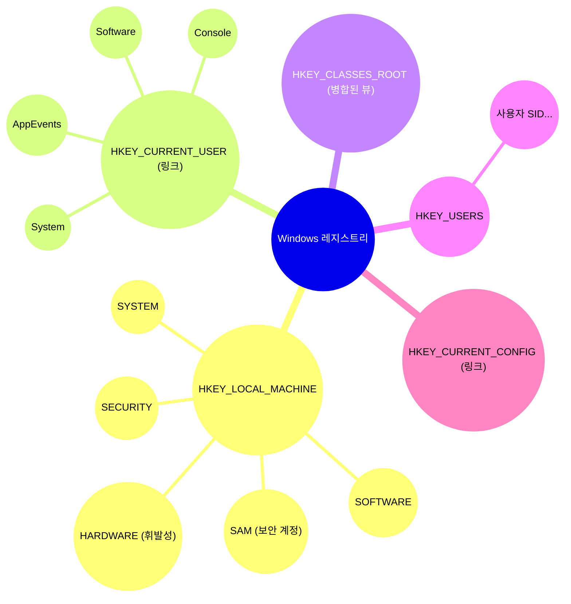
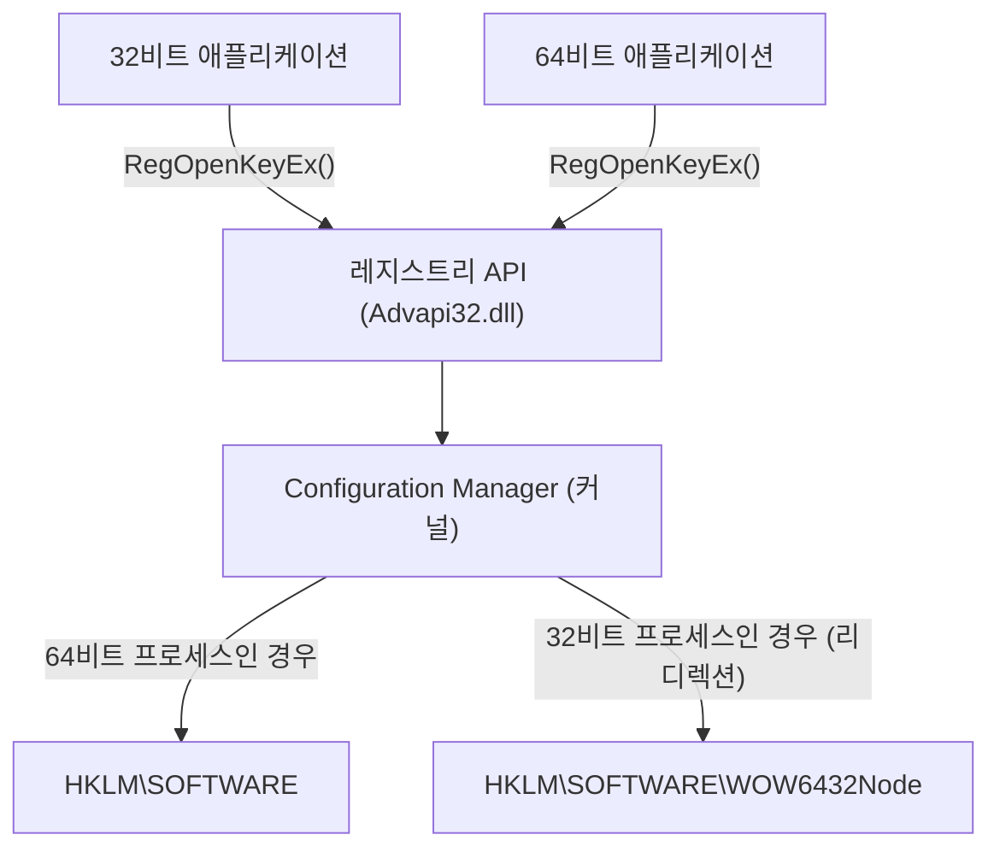
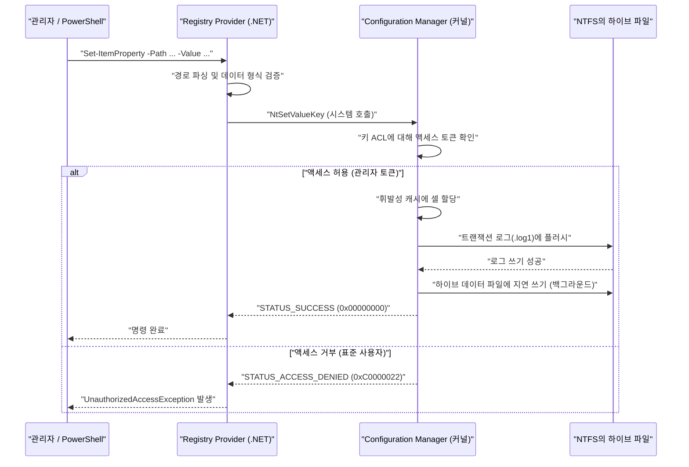

# Windows 레지스트리의 기초 지식과 프로그래밍 가능한 안전한 편집 방법

Windows 운영 체제에서 "레지스트리(Registry)"는 시스템 및 애플리케이션의 다양한 설정을 저장하는 거대한 계층형 데이터베이스입니다. 본 기사에서는 Windows 레지스트리의 기초적인 아키텍처부터 PowerShell이나 C#을 사용한 프로그래밍 가능하고 안전한 레지스트리 편집 방법에 대해 매우 자세히 해설합니다.

## 1. 시작하며: Windows 레지스트리의 역사와 진화

Windows의 초기 버전(Windows 3.x 시대)에서는 시스템이나 애플리케이션의 설정은 주로 `.ini`(초기화 파일)에 저장되었습니다. 그러나 애플리케이션마다 무수히 많은 INI 파일이 시스템 전체에 흩어지게 되어 관리가 현저히 번거로워졌습니다. 또한 INI 파일은 일반 텍스트 기반이기 때문에 바이너리 데이터의 저장이 어렵고, 액세스 제어(보안) 구조도 존재하지 않았습니다. 파일 파싱 속도도 느려 대규모 설정을 저장하는 데는 적합하지 않았습니다.

이러한 문제들을 근본적으로 해결하기 위해 Windows NT 및 Windows 95 이후 중앙 집중식 설정 데이터베이스로서 "레지스트리"가 본격적으로 채택되었습니다. 레지스트리는 계층화된 데이터베이스로, 강력한 타입 지정, 바이너리 데이터 지원 및 접근 제어 목록(ACL)에 의한 견고한 보안 기능을 제공합니다. 이를 통해 OS 커널에서 사용자 공간의 애플리케이션까지 모든 구성 요소가 통일된 인터페이스(Win32 API의 `Reg*` 함수군)로 설정을 읽고 쓸 수 있게 되었습니다.

현대의 Windows 11에 이르기까지 레지스트리는 OS의 심장부로 계속 기능하고 있습니다. 하드웨어 구성, 디바이스 드라이버 로드 순서, 사용자의 데스크톱 환경, 설치된 소프트웨어 목록 등 시스템 동작에 필요한 모든 메타데이터가 레지스트리에 집약되어 있습니다.

## 2. 아키텍처의 심층: 레지스트리 하이브의 실체와 메모리 매핑

레지스트리는 논리적으로 하나의 거대한 트리 구조로 보이지만, 물리적으로는 "하이브(Hive)"라고 불리는 여러 파일로 분할되어 디스크에 저장됩니다. 이를 통해 시스템 전체의 설정과 사용자 고유의 설정이 분리되어 효율적인 읽기가 가능해집니다.

주요 하이브 파일은 보통 `%SystemRoot%\System32\config` 디렉토리에 존재합니다.
- `SYSTEM`: 운영 체제 부팅에 필요한 중요한 설정 (드라이버, 서비스, 부팅 구성 등).
- `SOFTWARE`: 설치된 소프트웨어의 시스템 전체 설정. 서드파티 앱 설정의 대부분이 여기에 들어갑니다.
- `SAM`: Security Accounts Manager (로컬 사용자 계정과 암호 해시).
- `SECURITY`: 로컬 보안 정책 및 권한 할당.
- `DEFAULT`: 기본 사용자 프로필 (새 사용자 생성 시 템플릿).

사용자 개별 하이브 파일은 사용자의 프로필 디렉토리(예: `C:\Users\Username`)에 숨김 파일로 존재합니다.
- `NTUSER.DAT`: 해당 사용자의 기본 설정 (HKCU의 대부분).
- `UsrClass.dat`: 해당 사용자의 파일 확장자 연결 설정 (`AppData\Local\Microsoft\Windows` 내에 존재).

이 파일들은 OS 부팅 시 커널의 "Configuration Manager (CM)"에 의해 커널 페이지 풀 메모리에 매핑됩니다. Configuration Manager는 레지스트리의 읽기/쓰기 요청을 처리하는 커널 모드 구성 요소입니다.

특기할 점은 모든 레지스트리 데이터가 디스크 상에 존재하는 것은 아니라는 것입니다. 예를 들어 `HARDWARE` 하이브는 휘발성(Volatile)이며 디스크의 파일에는 전혀 저장되지 않습니다. OS가 부팅되고 플러그 앤 플레이(PnP) 관리자가 하드웨어를 감지할 때마다 메모리 상에서 동적으로 재구성됩니다.

또한 최신 Windows에서는 레지스트리의 신뢰성을 높이기 위해 트랜잭션 로깅이 구현되어 있습니다. 하이브 파일에 대한 변경 사항은 데이터 파일에 직접 기록되는 것이 아니라 먼저 트랜잭션 로그(`.log1`, `.log2`)에 기록됩니다. 이를 통해 쓰기 중 예상치 못한 전원 손실이나 시스템 크래시 시의 데이터 손상(Corruption)을 방지하고, 데이터베이스의 무결성을 ACID 특성에 가까운 형태로 보장합니다.

## 3. 레지스트리 키와 값의 계층 구조

레지스트리는 파일 시스템과 매우 유사한 계층 구조를 가지고 있습니다. 루트가 되는 노드는 "루트 키" 또는 "하이브"라고 불리며, 그 아래에 "키", "서브 키", 그리고 데이터의 실체인 "값(Value)"이 저장됩니다. 키는 디렉토리에, 값은 파일에 해당한다고 생각하면 이해하기 쉽습니다.

주요 루트 키는 다음 5가지로 분류됩니다.

1. **HKEY_LOCAL_MACHINE (HKLM)**: 컴퓨터 전체(모든 사용자)에 적용되는 시스템 설정이나 소프트웨어 설정이 저장됩니다. 변경하려면 관리자 권한이 필요합니다.
2. **HKEY_CURRENT_USER (HKCU)**: 현재 로그온한 사용자 고유의 설정이 저장됩니다. 사실 이는 독립된 데이터베이스가 아니라 `HKEY_USERS` 아래에 있는 해당 사용자의 SID(보안 식별자) 키에 대한 심볼릭 링크(별칭)에 불과합니다.
3. **HKEY_CLASSES_ROOT (HKCR)**: 파일 확장자 연결, COM(Component Object Model) 클래스의 등록 정보, 셸 확장이 저장됩니다. 이 키는 특수하여 `HKLM\SOFTWARE\Classes` (시스템 전체)와 `HKCU\Software\Classes` (현재 사용자)를 Configuration Manager가 병합(통합)하여 표시하는 가상 뷰입니다. 충돌이 있는 경우 사용자 고유의 설정(HKCU)이 우선됩니다.
4. **HKEY_USERS (HKU)**: 시스템의 모든 사용자 프로필(현재 메모리에 로드된 것) 설정이 저장됩니다. SID 기반으로 계층화되어 있습니다.
5. **HKEY_CURRENT_CONFIG (HKCC)**: 현재 하드웨어 프로필에 관한 설정. 실체는 `HKLM\SYSTEM\CurrentControlSet\Hardware Profiles\Current`에 대한 링크입니다.

이 복잡한 계층 구조와 링크 관계를 시각화하면 다음과 같습니다.



## 4. 레지스트리의 데이터 형식 (상세 해설)

레지스트리의 "값"에는 각각 엄격한 데이터 형식이 정의되어 있습니다. 프로그래밍을 통해 레지스트리를 조작할 경우, 이러한 형식을 올바르게 이해하고 적절한 형식으로 데이터를 쓰는 것이 필수적입니다. 잘못된 형식으로 쓰면 애플리케이션에서 예외가 발생하거나 OS 기능이 정지하는 원인이 됩니다.

- **REG_SZ (문자열 값)**: 가장 일반적인 데이터 형식입니다. NULL로 끝나는 유니코드 문자열(UTF-16LE)을 저장합니다. 파일 경로, URL, UI의 표시 이름 등에 사용됩니다.
- **REG_DWORD (32비트 정수 값)**: 32비트(4바이트)의 부호 없는 정수 값입니다. 부울 값(0=비활성화, 1=활성화)이나 밀리초 단위의 타임아웃 값, 오류 코드 설정 등에 자주 사용됩니다. Windows는 리틀 엔디안 아키텍처이기 때문에 디스크 상에서는 하위 바이트부터 순서대로(예: 0x12345678은 `78 56 34 12`) 저장됩니다.
- **REG_QWORD (64비트 정수 값)**: 64비트(8바이트)의 정수 값입니다. 64비트 아키텍처가 보급됨에 따라 거대한 수치(디스크 할당량이나 대용량 메모리 크기 지정 등)나 포인터 크기의 설정을 저장하기 위해 사용됩니다.
- **REG_MULTI_SZ (다중 문자열 값)**: 여러 개의 NULL로 끝나는 문자열을 연속해서 저장하고, 마지막에 빈 NULL 종료 문자(Double NULL)를 두어 끝을 나타내는 형식입니다. IP 주소 목록, 종속성이 있는 서비스 목록, 바인딩 순서 등 배열적인 데이터를 저장하는 데 적합합니다.
- **REG_EXPAND_SZ (확장 가능한 문자열 값)**: `%USERPROFILE%`이나 `%SystemRoot%`와 같은 확장되지 않은 환경 변수 문자열을 포함하는 특수한 문자열 형식입니다. 애플리케이션이 `RegQueryValueEx` API를 통해 읽을 때, 또는 `ExpandEnvironmentStrings` API를 호출함으로써 OS에 의해 동적으로 실제 절대 경로로 확장됩니다.
- **REG_BINARY (이진 값)**: 임의의 원시 바이너리 데이터 스트림입니다. 암호화된 비밀번호(LSA Secrets 등), 디지털 인증서, 애플리케이션 고유의 복잡한 구조체나 직렬화된 데이터가 저장됩니다.
- **REG_NONE**: 형식이 정의되지 않은 데이터입니다. 매우 드물지만 암호화 키의 예약 영역 등에 사용됩니다.
- **REG_RESOURCE_LIST** / **REG_FULL_RESOURCE_DESCRIPTOR**: 디바이스 드라이버가 하드웨어 리소스(IRQ, I/O 포트, DMA 채널)의 할당 정보를 기록하기 위해 사용하는 커널 전용의 고급 형식입니다.

## 5. 운영 체제에서의 레지스트리 수리 모델과 성능

레지스트리는 OS의 성능(특히 부팅 시간과 프로세스 초기화 속도)에 직결되기 때문에, 내부적으로는 "Cell Index"라고 불리는 B-Tree(B-트리)와 유사한 고도의 데이터 구조를 사용하여 최적화되어 있습니다.

### 검색 시간 복잡도 (Time Complexity)
레지스트리 내의 특정 키(경로)를 검색할 때의 시간 복잡도 $T_{\text{search}}$는 트리의 깊이와 각 계층의 노드 수에 따라 달라집니다. 깊이가 $d$인 서브 키(예: `A\B\C\D`라면 $d=4$)를 탐색할 경우의 계산 복잡도는 이론상 다음과 같이 모델링할 수 있습니다.

$$
T_{\text{search}}(d, L) = \sum_{i=1}^{d} O(\log(C_i) \cdot L_i)
$$

여기서 $C_i$는 깊이 $i$에서의 자식 노드(서브 키 또는 값)의 수, $L_i$는 비교 대상이 되는 문자열의 길이(문자 수)입니다. 레지스트리의 실체인 하이브 파일 내에서 서브 키 목록은 이름의 해시 값 또는 알파벳 순으로 정렬된 인덱스로 유지됩니다. 따라서 단순한 선형 탐색 $O(C_i)$가 아닌 이진 탐색 $O(\log(C_i))$가 가능하며, 하나의 키 아래에 수만 개의 서브 키가 존재하더라도 매우 빠른 액세스를 실현합니다.

### 스토리지 풋프린트 (Space Complexity)
레지스트리의 전체 크기(물리 디스크 상의 점유량)는 각 하이브의 합계로 계산됩니다.

$$
\text{Size}_{\text{Total}} = \sum_{h \in \text{Hives}} \left( N_{h} \times S_{\text{key\_metadata}} + \sum_{v \in h} S_{\text{value}}(v) \right) + S_{\text{overhead}}
$$

$N_h$는 하이브 $h$ 내의 키 수, $S_{\text{key\_metadata}}$는 키 1개당 메타데이터(마지막 쓰기 타임스탬프, 보안 설명자에 대한 포인터, 부모 키에 대한 포인터 등)의 크기, $S_{\text{value}}(v)$는 값 $v$의 페이로드 크기입니다. 트랜잭션 로그나 불필요해진 빈 셀(단편화)로 인한 오버헤드 $S_{\text{overhead}}$도 포함됩니다. 레지스트리에 불필요한 데이터(제거가 완전히 되지 않은 소프트웨어의 잔해 등)를 장기간 방치하면 이 풋프린트가 증가하여 OS의 페이지 풀 메모리를 압박하고 성능 저하를 초래할 수 있습니다.

## 6. 시스템의 견고성을 위협하는 수동 편집의 위험과 손상 확률

레지스트리 편집기(`regedit.exe`)를 이용한 수작업 편집은 시스템 관리의 최후의 수단으로 간주되어야 합니다. 레지스트리에는 일반적인 문서 편집기와 같은 "실행 취소(Undo)" 기능이 내장되어 있지 않으며, 값의 변경이나 키의 삭제는 Configuration Manager를 통해 즉시 시스템에 반영됩니다.

특히 시스템 부팅에 필수적인 중요 키(예: `HKLM\SYSTEM\CurrentControlSet\Services` 아래의 디스크 컨트롤러 드라이버 설정이나 `HKLM\SOFTWARE\Microsoft\Windows NT\CurrentVersion\Winlogon`의 `Userinit` 값 등)를 한 글자라도 잘못 편집하거나 삭제할 경우, OS가 블루스크린(BSoD)을 일으켜 부팅할 수 없게 되거나 로그인 화면에서 더 이상 진행되지 않는(블랙스크린) 치명적인 위험이 있습니다.

### 손상 확률의 수학적 모델
레지스트리 내의 키를 무작위로 변경하거나 삭제했을 경우의 시스템 장애 발생 확률을 생각해 봅시다. 시스템이 정상적으로 동작하기 위해 필수적인 중요 키의 집합을 $C$, 그 총수를 $N_c = |C|$라고 합시다. 레지스트리 전체의 키 총수를 $N_{\text{total}}$이라고 합니다.
무작위로 $k$개의 키를 삭제하거나 파괴했을 때, 적어도 하나의 중요 키가 손상될 확률 $P_{\text{failure}}$는 비복원 추출(Sampling without replacement)의 확률 계산에 의해 다음과 같이 표현됩니다.

$$
P_{\text{failure}} = 1 - \frac{\binom{N_{\text{total}} - N_c}{k}}{\binom{N_{\text{total}}}{k}} = 1 - \prod_{i=0}^{k-1} \left( 1 - \frac{N_c}{N_{\text{total}} - i} \right)
$$

레지스트리 전체의 키 수 $N_{\text{total}}$은 수십만에서 수백만의 규모지만, $N_c$ 역시 수만의 규모로 존재합니다. 수학적으로 무작위 조작이라도 $k$가 증가하면 장애 확률은 급격히 상승합니다. 게다가 실제 수동 조작에서 사용자는 "무작위"로 편집하는 것이 아니라 시스템의 설정이나 소프트웨어의 동작과 직접 관련된 부분을 의도적으로(튜토리얼 사이트 등을 보면서) 조작하기 때문에, 중요 키를 건드릴 확률은 위의 이론값보다 훨씬 높아집니다.

## 7. 레지스트리 가상화와 WOW64 아키텍처

Windows는 레거시 애플리케이션의 호환성을 유지하기 위해 레지스트리 액세스에 대해 몇 가지 고도의 "가상화(리디렉션)" 메커니즘을 구현하고 있습니다. 이를 이해하지 않고 프로그래밍을 수행하면 심각한 버그를 유발하는 원인이 됩니다.

### UAC 레지스트리 가상화 (Registry Virtualization)
Windows Vista 이후 사용자 계정 컨트롤(UAC)이 도입되었습니다. Windows XP 시대에 만들어진 오래된 애플리케이션(표준 사용자 권한으로 동작)이 본래 관리자 권한이 필요한 `HKLM\SOFTWARE` 등의 보호된 키에 쓰기를 시도할 경우, 액세스 거부(Access Denied) 오류로 크래시되는 것을 방지하기 위해 Windows는 그 쓰기 작업을 몰래 사용자 프로필 내의 가상 스토어 `HKCU\Software\Classes\VirtualStore\MACHINE\SOFTWARE`로 리디렉션합니다. 읽기 시에도 원래 위치와 가상 스토어 양쪽을 병합하여 반환합니다. 이를 통해 애플리케이션은 오류를 감지하지 않고 정상적으로 동작을 계속할 수 있습니다.
단, 프로그래밍 방식으로 시스템 전체의 설정을 변경하는 도구를 개발할 경우에는 매니페스트 파일에 `<requestedExecutionLevel level="requireAdministrator" />`를 지정하여 이 가상화를 비활성화해야 합니다.

### WOW64 (Windows 32-bit on Windows 64-bit) 의 리디렉션
64비트 버전의 Windows(현재 주류)에서 기존 32비트 애플리케이션을 실행할 때, 32비트 앱이 64비트의 네이티브 시스템 설정을 잘못 덮어쓰거나 호환되지 않는 64비트 DLL을 로드하지 않도록 특정 레지스트리 키는 자동으로 분리 및 리디렉션됩니다.
예를 들어 32비트 앱이 `HKLM\SOFTWARE\Vendor\App`에 액세스하려고 하면 OS는 투명하게 `HKLM\SOFTWARE\WOW6432Node\Vendor\App`으로 리디렉션합니다.


PowerShell 스크립트나 C# 애플리케이션에서 레지스트리를 편집할 때는 실행 중인 프로세스 자체가 32비트인지 64비트인지를 강하게 의식해야 합니다. 그렇지 않으면 "분명히 쓴 설정이 탐색기에서 보이지 않는다(다른 곳에 쓰여 있다)"는 성가신 문제를 일으키게 됩니다.

## 8. PowerShell을 통한 프로그래밍 가능한 안전한 편집

레지스트리를 수동으로 편집하는 위험을 최소화하려면 PowerShell 스크립트를 사용하여 조작을 코드화(Infrastructure as Code)하고 자동화, 재현성, 테스트 가능성을 확보하는 것이 현대의 모범 사례입니다. PowerShell은 "Registry Provider"를 갖추고 있어 파일 시스템(C: 드라이브 등)을 조작하는 것과 완전히 동일한 cmdlet(`Get-ChildItem`, `Get-ItemProperty`, `New-Item` 등)으로 레지스트리를 투명하게 조작할 수 있습니다.

PowerShell에서는 기본적으로 `HKLM:`이나 `HKCU:`라는 전용 PSDrive(드라이브 문자 같은 것)가 마운트되어 있습니다.

### 기본적인 CRUD 조작
```powershell
# 1. 존재 확인 (Read)
$keyPath = "HKCU:\Software\MyCustomApp"
if (-Not (Test-Path -Path $keyPath)) {
    # 2. 새로운 키 생성 (Create)
    New-Item -Path "HKCU:\Software" -Name "MyCustomApp" -Force | Out-Null
    Write-Host "키를 생성했습니다."
}

# 3. 값 쓰기/업데이트 (Update) - REG_DWORD로 1을 쓰기
Set-ItemProperty -Path $keyPath -Name "EnableDebug" -Value 1 -Type DWord

# 4. 값 읽기 (Read)
$debugFlag = (Get-ItemProperty -Path $keyPath).EnableDebug
Write-Host "현재 디버그 플래그: $debugFlag"

# 5. 값 삭제 (Delete)
Remove-ItemProperty -Path $keyPath -Name "EnableDebug" -Force
```

### 실전 예제 1: 개발 환경 자동 설정 (환경 변수 PATH 추가)
다음 스크립트는 개발자가 새로운 Windows 머신을 설정할 때 사용자 환경 변수 `PATH`에 사용자 지정 도구 디렉토리를 안전하게 추가하는 자동화 예제입니다.

```powershell
$envKey = "HKCU:\Environment"
$newPath = "C:\tools\bin"

# 현재 PATH 읽기 (오류를 억제하여 안전하게 가져옴)
$currentPathInfo = Get-ItemProperty -Path $envKey -Name "Path" -ErrorAction SilentlyContinue
$currentPath = if ($currentPathInfo) { $currentPathInfo.Path } else { "" }

# 이미 포함되어 있는지 정규 표현식으로 확인
if ($currentPath -notmatch [regex]::Escape($newPath)) {
    # 끝에 세미콜론이 없으면 추가하여 결합
    if ($currentPath -and $currentPath -notmatch ";$") {
        $currentPath += ";"
    }
    $updatedPath = $currentPath + $newPath
    
    # REG_EXPAND_SZ 형식으로 쓰기 (중요)
    Set-ItemProperty -Path $envKey -Name "Path" -Value $updatedPath -Type ExpandString
    Write-Host "PATH 환경 변수를 업데이트했습니다: $newPath"
    
    # 실행 중인 프로세스에 환경 변수 변경을 알림 (WM_SETTINGCHANGE)
    # 이를 통해 재부팅 없이 새로운 탐색기 등에 반영됨
    [Environment]::SetEnvironmentVariable("Path", $updatedPath, [EnvironmentVariableTarget]::User)
} else {
    Write-Host "PATH가 이미 추가되어 있습니다."
}
```

### 실전 예제 2: 상황에 맞는 메뉴(Context Menu)에 사용자 지정 작업 추가
특정 파일이나 디렉토리를 마우스 오른쪽 버튼으로 클릭했을 때의 상황에 맞는 메뉴에 "My IDE로 열기"라는 고유 항목을 추가하는 스크립트입니다.

```powershell
# 디렉토리의 배경(여백 부분)을 마우스 오른쪽 버튼으로 클릭했을 때의 메뉴
$menuPath = "HKCR:\Directory\Background\shell\OpenWithMyIDE"
$commandPath = "$menuPath\command"

try {
    # 메뉴 항목의 부모 키 생성
    New-Item -Path $menuPath -Force -ErrorAction Stop | Out-Null
    
    # (default) 값에 표시 이름 설정
    Set-ItemProperty -Path $menuPath -Name "(default)" -Value "My IDE로 열기" -Type String
    
    # 아이콘 설정 (선택 사항)
    Set-ItemProperty -Path $menuPath -Name "Icon" -Value "C:\Program Files\MyIDE\ide.exe,0" -Type String

    # command 서브 키를 생성하고, 실행될 명령줄을 설정
    # %V 는 현재 디렉토리 경로로 확장되는 변수
    New-Item -Path $commandPath -Force -ErrorAction Stop | Out-Null
    Set-ItemProperty -Path $commandPath -Name "(default)" -Value "`"C:\Program Files\MyIDE\ide.exe`" `"%V`"" -Type String

    Write-Host "상황에 맞는 메뉴를 추가했습니다."
} catch {
    Write-Error "레지스트리 변경에 실패했습니다. 관리자 권한으로 실행 중인지 확인하세요. 오류: $_"
}
```

### PowerShell에서의 레지스트리 액세스 내부 시퀀스
PowerShell 스크립트가 레지스트리를 변경할 때의 OS 내부 동작 시퀀스를 아래에 나타냅니다.



## 9. C# (.NET)을 통한 견고한 레지스트리 액세스

.NET 애플리케이션(C# 등)에서 레지스트리에 액세스할 경우 `Microsoft.Win32.Registry` 클래스 및 `RegistryKey` 클래스를 사용합니다.
C#을 이용하는 가장 큰 장점은 강력한 예외 처리(`try-catch`)에 의한 견고한 오류 처리, 엄격한 타입 검사, 그리고 `RegistryView` 열거형을 사용한 명시적인 32비트/64비트 뷰 지정이 가능하다는 점입니다.

아래는 64비트 OS 환경에서 확실하게 64비트 측의 레지스트리(WOW6432Node의 리디렉션을 회피)를 읽고 쓰는 C# 코드 예제입니다.

```csharp
using System;
using System.Security;
using Microsoft.Win32;

class RegistryEditor
{
    static void Main()
    {
        // HKLM 아래의 경로 (관리자 권한 필요)
        string keyPath = @"SOFTWARE\MyEnterpriseApp\Settings";

        // RegistryView.Registry64 를 지정하여 64비트 네이티브 뷰 열기
        // using 문을 사용하여 레지스트리 키의 핸들(비관리 리소스)을 확실하게 Dispose함
        try
        {
            using (RegistryKey baseKey = RegistryKey.OpenBaseKey(RegistryHive.LocalMachine, RegistryView.Registry64))
            {
                // 쓰기 권限 (writable: true) 으로 키를 엽니다. 존재하지 않으면 생성.
                using (RegistryKey subKey = baseKey.CreateSubKey(keyPath, writable: true))
                {
                    if (subKey != null)
                    {
                        // REG_DWORD 로 값 쓰기
                        subKey.SetValue("MaxConnections", 100, RegistryValueKind.DWord);
                        
                        // REG_SZ 로 값 쓰기
                        subKey.SetValue("ApiEndpoint", "https://api.example.com", RegistryValueKind.String);
                        
                        // REG_BINARY 로 바이트 배열 쓰기
                        byte[] secretData = { 0x01, 0x02, 0x0A, 0xFF };
                        subKey.SetValue("BinarySecret", secretData, RegistryValueKind.Binary);
                        
                        Console.WriteLine("레지스트리 쓰기에 성공했습니다.");
                    }
                }
            }
        }
        catch (UnauthorizedAccessException ex)
        {
            // 관리자 권한으로 실행하지 않았을 때 자주 발생
            Console.WriteLine($"권한 오류: 프로그램을 '관리자 권한으로 실행'해 주세요. 상세: {ex.Message}");
        }
        catch (SecurityException ex)
        {
            // .NET의 코드 액세스 보안(CAS)에 의해 차단된 경우
            Console.WriteLine($"보안 예외: {ex.Message}");
        }
        catch (Exception ex)
        {
            // 기타 예기치 않은 IO 오류 등
            Console.WriteLine($"예기치 않은 오류: {ex.Message}");
        }
    }
}
```

레지스트리의 키를 열었을 때 OS로부터 반환되는 "핸들"은 메모리와 시스템 리소스를 소비하는 비관리 리소스입니다. 따라서 `using` 블록을 사용하거나 `finally` 블록 내에서 명시적으로 `.Dispose()` (또는 `.Close()`)를 호출하여 핸들 누수를 확실하게 방지하는 것이 C# 프로그래밍의 철칙입니다.

## 10. 레지스트리 백업 및 복원 방법

스크립트나 프로그램에 의한 자동화라 하더라도 중요한 변경을 가하기 전에는 백업을 확보하는 것이 절대적으로 필수적입니다.

### .reg 파일을 통한 백업 및 가져오기
가장 고전적이고 범용적인 방법은 `.reg` 파일로 내보내는 것입니다. 이 파일은 고유한 형식을 가진 텍스트 기반 파일이며 구조는 다음과 같습니다.

```text
Windows Registry Editor Version 5.00

[HKEY_CURRENT_USER\Software\MyCustomApp]
"EnableDebug"=dword:00000001
"ApiEndpoint"="https://api.example.com"
"BinaryData"=hex:01,02,0a,ff
```
*참고: 바이너리 데이터는 `hex:`에 이어지는 쉼표로 구분된 16진수로 표현됩니다.*

명령줄 도구 `reg.exe`를 사용하여 배치 스크립트 내에서 자동 백업을 구현할 수 있습니다.
```cmd
REM 지정한 키를 백업 (서브 키도 재귀적으로 내보내짐)
reg export HKLM\SOFTWARE\MyEnterpriseApp C:\backup\myapp_backup.reg /y

REM 백업 복원
reg import C:\backup\myapp_backup.reg
```

### PowerShell을 이용한 더 고급 백업 방법
단순한 텍스트로서가 아니라 PowerShell의 객체 지향성을 살려 레지스트리의 객체를 내보내고 XML 형식(CliXML)으로 저장하는 것도 가능합니다. 이를 통해 복원 시 문자열 파싱에 의존하지 않고 형식 정보를 유지한 채 처리할 수 있습니다.

```powershell
# 백업 확보 (속성을 XML로 저장)
Get-ItemProperty -Path "HKCU:\Software\MyCustomApp" | Export-Clixml -Path "C:\backup\reg_backup.xml"

# 복원의 개념
$backup = Import-Clixml -Path "C:\backup\reg_backup.xml"
# $backup 에는 복원된 사용자 지정 PSObject가 저장되어 있으므로,
# 그 속성을 순회하여 Set-ItemProperty 로 다시 적용하는 로직을 구성할 수 있습니다.
```

## 11. Sysinternals Process Monitor (Procmon)을 활용한 문제 해결

프로그램이 레지스트리의 어디에 쓰고 있는지 알 수 없는 경우나 "Access Denied"의 원인을 찾을 때, Microsoft가 무료로 제공하는 Sysinternals 도구인 **Process Monitor (Procmon)** 가 매우 강력합니다.
Procmon을 사용하면 OS 상에서 발생하는 모든 레지스트리 API 호출(`RegOpenKey`, `RegQueryValue`, `RegSetValue` 등)을 실시간으로 캡처하고 다음과 같은 고급 필터링으로 문제 해결이 가능합니다.

- `Process Name` is `powershell.exe`
- `Operation` begins with `Reg`
- `Result` is `ACCESS DENIED`

이를 통해 어느 키의 ACL 설정이 부족한지, 혹은 WOW6432Node로 잘못 리디렉션되고 있는지를 순식간에 특정할 수 있습니다.

## 12. 보안과 모범 사례

마지막으로 레지스트리를 다룰 때의 중요한 설계 원칙과 모범 사례를 정리합니다.

1. **최소 권한의 원칙을 철저히 한다**: 애플리케이션이나 스크립트의 설정은 가능한 한 `HKCU`(현재 사용자) 내의 `Software` 키 아래에 저장해야 합니다. `HKLM`에 대한 쓰기는 UAC에 의한 관리자 권한 상승을 요구하므로 보안상의 공격 표면(Attack Surface)을 넓히고 사용자 경험을 손상시킵니다.
2. **감사 (Auditing) 활성화**: 보안상 매우 중요한 키(예: 자동 시작을 관장하는 `Run` 키나 서비스 설정 키 등)에 대해서는 SACL(System Access Control List)을 구성하여, 누가 언제 값을 변경하거나 삭제했는지를 Windows 이벤트 뷰어의 "보안 로그"에 기록(감사)하도록 설정합니다.
3. **트랜잭션 기능의 사용 중단에 대응**: 과거 Windows Vista에서 도입된 "커널 트랜잭션 관리자(KTM)"를 이용한 레지스트리 트랜잭션 기능(TxR)은 Windows 10 이후 더 이상 사용되지 않습니다(Deprecated). 애플리케이션 측에서 독자적으로 백업 및 롤백 메커니즘(변경 전에 원래 값을 읽어 메모리에 보관해 두는 등)을 구현해야 합니다.
4. **그룹 정책 (GPO)과의 충돌 주의**: `HKLM\SOFTWARE\Policies`나 `HKCU\Software\Policies` 영역은 Active Directory의 그룹 정책에 의해 중앙 집중식으로 관리되어야 하는 영역입니다. 스크립트에서 직접 이러한 키를 수정하더라도, 다음번 그룹 정책 백그라운드 업데이트 주기(일반적으로 90분~120분 간격)에 도메인 컨트롤러의 설정에 의해 강제로 덮어씌워지므로 설정이 영구적으로 유지되지 않는 원인이 됩니다.

## 요약

Windows 레지스트리는 OS의 모든 동작과 애플리케이션 설정을 통합적으로 관리하는 강력하고 복잡한 기반 시스템입니다. 수동에 의한 무질서한 편집에는 수학적으로도 입증되는 높은 시스템 손상 위험이 따릅니다. 따라서 PowerShell이나 C# 등의 프로그래밍 가능한 수단을 사용하여 Infrastructure as Code의 원칙에 따라 안전하고 테스트 가능하며 재현성 있는 형태로 구성 관리를 수행하는 것이 현대의 시스템 관리와 개발에 있어 필수적입니다. 본 기사에서 해설한 깊은 아키텍처 이해와 구현 패턴을 활용하여 더욱 견고하고 안전한 Windows 환경 구축을 목표로 해 보세요.
