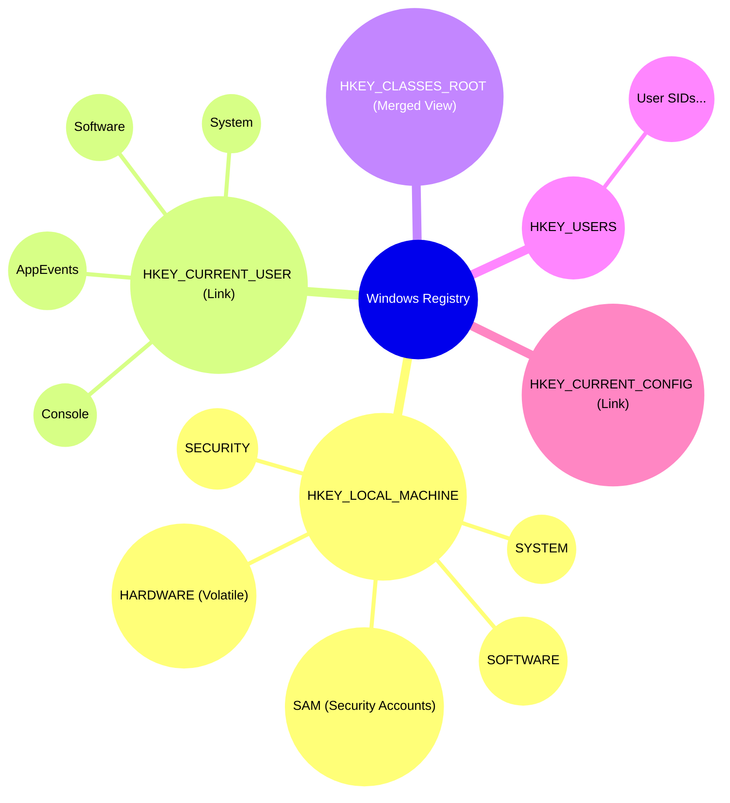
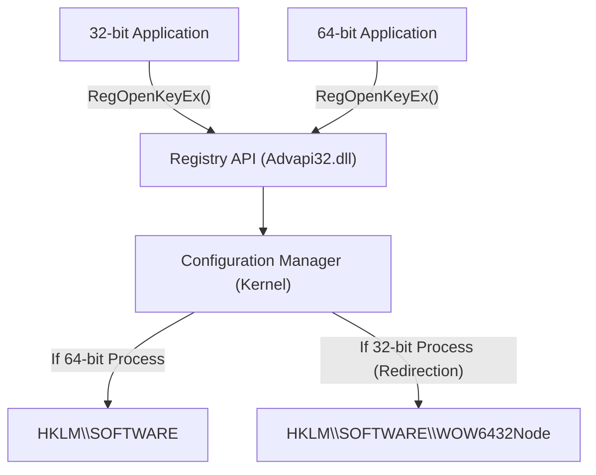
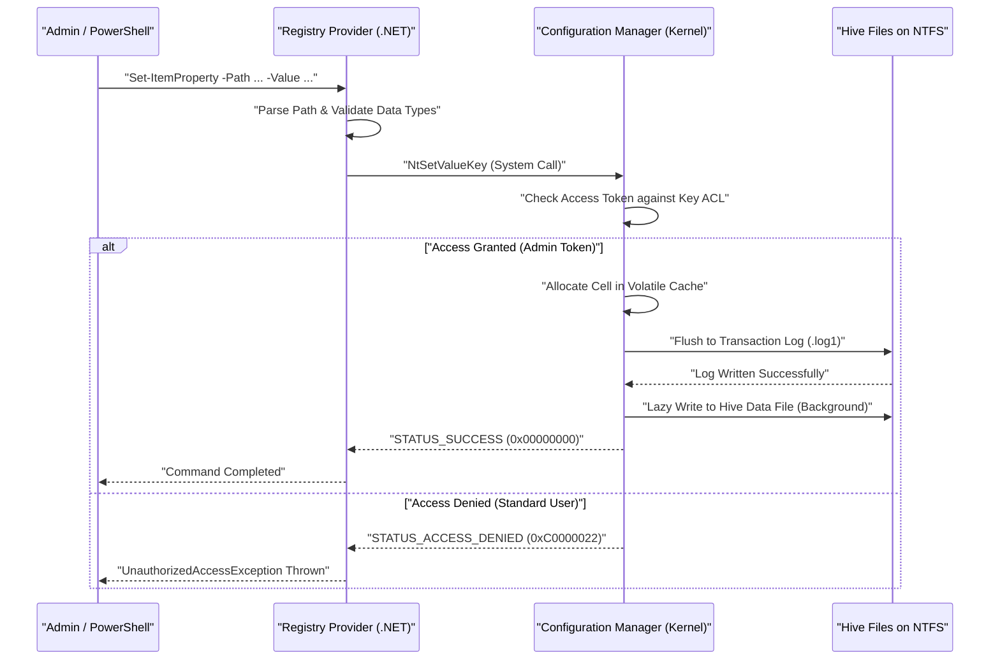

# Windowsレジストリの基礎知識と、プログラマブルな安全な編集方法

Windowsオペレーティングシステムにおいて、「レジストリ（Registry）」はシステムおよびアプリケーションの各種設定を格納する巨大な階層型データベースです。本記事では、Windowsレジストリの基礎的なアーキテクチャから、PowerShellやC#を用いたプログラマブルかつ安全なレジストリの編集手法について、非常に詳細に解説します。

## 1. はじめに：Windowsレジストリの歴史と進化

Windowsの初期バージョン（Windows 3.x時代）では、システムやアプリケーションの設定は主に `.ini` (初期化ファイル) に保存されていました。しかし、アプリケーションごとに無数のINIファイルがシステム全体に散在するようになり、管理が著しく煩雑化しました。また、INIファイルはプレーンテキストベースであるため、バイナリデータの保存が難しく、アクセス制御（セキュリティ）の仕組みも存在しませんでした。ファイルのパース速度も遅く、大規模な設定を保存するには不向きでした。

これらを根本的に解決するために、Windows NTおよびWindows 95以降、中央集権的な設定データベースとして「レジストリ」が本格的に採用されました。レジストリは階層化されたデータベースであり、強力な型付け、バイナリデータのサポート、そしてアクセス制御リスト（ACL）による堅牢なセキュリティ機能を提供します。これにより、OSのカーネルからユーザー空間のアプリケーションまで、あらゆるコンポーネントが統一されたインターフェース（Win32 APIの `Reg*` 関数群）で設定を読み書きできるようになりました。

現代のWindows 11に至るまで、レジストリはOSの心臓部として機能し続けています。ハードウェアの構成、デバイスドライバのロード順序、ユーザーのデスクトップ環境、インストールされたソフトウェアのリストなど、システムの動作に必要なあらゆるメタデータがレジストリに集約されています。

## 2. アーキテクチャの深層：レジストリハイブの実体とメモリマッピング

レジストリは論理的には一つの巨大なツリー構造として見えますが、物理的には「ハイブ（Hive）」と呼ばれる複数のファイルに分割されてディスク上に保存されています。これにより、システム全体の設定とユーザー固有の設定が分離され、効率的な読み込みが可能になっています。

主要なハイブファイルは、通常 `%SystemRoot%\System32\config` ディレクトリに存在します。
- `SYSTEM`: オペレーティングシステムの起動に必要な重要な設定（ドライバ、サービス、ブート構成など）。
- `SOFTWARE`: インストールされたソフトウェアのシステム全体の設定。サードパーティ製アプリの設定の多くがここに入ります。
- `SAM`: Security Accounts Manager（ローカルユーザーアカウントとパスワードハッシュ）。
- `SECURITY`: ローカルセキュリティポリシーと権限の割り当て。
- `DEFAULT`: デフォルトユーザーのプロファイル（新規ユーザー作成時のテンプレート）。

ユーザー個別のハイブファイルは、ユーザーのプロファイルディレクトリ（例：`C:\Users\Username`）に隠しファイルとして存在します。
- `NTUSER.DAT`: そのユーザーの基本設定（HKCUの大部分）。
- `UsrClass.dat`: そのユーザーのファイル拡張子関連付け設定（`AppData\Local\Microsoft\Windows` 内に存在）。

これらのファイルは、OSの起動時にカーネルの「Configuration Manager (CM)」によってカーネルページプールメモリ上にマッピングされます。Configuration Managerは、レジストリの読み書き要求を処理するカーネルモードのコンポーネントです。

特筆すべきは、すべてのレジストリデータがディスク上に存在するわけではないという点です。例えば、`HARDWARE` ハイブは揮発性（Volatile）であり、ディスク上のファイルには一切保存されません。OSが起動し、プラグアンドプレイ（PnP）マネージャーがハードウェアを検出するたびに、メモリ上で動的に再構築されます。

また、最新のWindowsではレジストリの信頼性を高めるためにトランザクションロギングが実装されています。ハイブファイルに対する変更は直接データファイルに書き込まれるのではなく、まずトランザクションログ（`.log1`, `.log2`）に記録されます。これにより、書き込み中の不意の電源喪失やシステムクラッシュ時のデータ破損（コラプション）を防ぎ、データベースの整合性をACID特性に近い形で保証しています。

## 3. レジストリキーと値の階層構造

レジストリはファイルシステムに非常によく似た階層構造を持っています。ルートとなるノードは「ルートキー」または「ハイブ」と呼ばれ、その下に「キー」、「サブキー」、そしてデータの実体である「値（Value）」が格納されます。キーはディレクトリに、値はファイルに相当すると考えると理解しやすいでしょう。

主要なルートキーは以下の5つに分類されます。

1. **HKEY_LOCAL_MACHINE (HKLM)**: コンピュータ全体（すべてのユーザー）に適用されるシステム設定やソフトウェア設定が格納されます。変更には管理者権限が必要です。
2. **HKEY_CURRENT_USER (HKCU)**: 現在ログオンしているユーザー固有の設定が格納されます。実のところ、これは独立したデータベースではなく、`HKEY_USERS` の下にある該当ユーザーのSID（セキュリティ識別子）キーへのシンボリックリンク（エイリアス）に過ぎません。
3. **HKEY_CLASSES_ROOT (HKCR)**: ファイルの拡張子の関連付けや、COM（Component Object Model）クラスの登録情報、シェル拡張が格納されます。このキーは特殊で、`HKLM\SOFTWARE\Classes` （システム全体）と `HKCU\Software\Classes` （現在のユーザー）をConfiguration Managerがマージ（統合）して表示する仮想的なビューです。競合がある場合は、ユーザー固有の設定（HKCU）が優先されます。
4. **HKEY_USERS (HKU)**: システム上のすべてのユーザープロファイル（現在メモリにロードされているもの）の設定が格納されます。SIDベースで階層化されています。
5. **HKEY_CURRENT_CONFIG (HKCC)**: 現在のハードウェアプロファイルに関する設定。実体は `HKLM\SYSTEM\CurrentControlSet\Hardware Profiles\Current` へのリンクです。

この複雑な階層構造とリンクの関係を視覚化すると以下のようになります。



## 4. レジストリのデータ型（詳細解説）

レジストリの「値」には、それぞれ厳密なデータ型が定義されています。プログラマブルにレジストリを操作する場合、これらの型を正しく理解し、適切な型でデータを書き込むことが不可欠です。誤った型で書き込むと、アプリケーションが例外をスローしたり、OSの機能が停止する原因となります。

- **REG_SZ (文字列値)**: 最も一般的なデータ型。NULL終端のUnicode文字列（UTF-16LE）を格納します。ファイルパス、URL、UIの表示名などに使用されます。
- **REG_DWORD (32ビット整数の値)**: 32ビット（4バイト）の符号なし整数値。ブール値（0=無効、1=有効）や、ミリ秒単位のタイムアウト値、エラーコードの設定などに頻繁に使用されます。Windowsはリトルエンディアンアーキテクチャであるため、ディスク上では下位バイトから順（例: 0x12345678 は `78 56 34 12`）に保存されます。
- **REG_QWORD (64ビット整数の値)**: 64ビット（8バイト）の整数値。64ビットアーキテクチャの普及に伴い、巨大な数値（ディスククォータや大容量メモリのサイズ指定など）やポインタサイズの設定を保存するために使用されます。
- **REG_MULTI_SZ (複数行文字列値)**: 複数のNULL終端文字列を連続して格納し、最後にさらに空のNULL終端文字（ダブルNULL）を置いて終端とする形式です。IPアドレスのリスト、依存関係のあるサービスのリスト、バインディングの順序など、配列的なデータを保存するのに適しています。
- **REG_EXPAND_SZ (展開可能な文字列値)**: `%USERPROFILE%` や `%SystemRoot%` のような未展開の環境変数文字列を含む特殊な文字列型。アプリケーションが `RegQueryValueEx` API を通じて読み取る際、または `ExpandEnvironmentStrings` API を呼び出すことで、OSによって動的に実際の絶対パスに展開されます。
- **REG_BINARY (バイナリ値)**: 任意の生のバイナリデータストリーム。暗号化されたパスワード（LSA Secretsなど）、デジタル証明書、アプリケーション固有の複雑な構造体やシリアライズデータが格納されます。
- **REG_NONE**: 型が未定義のデータ。非常に稀ですが、暗号化キーのリザーブ領域などに使われます。
- **REG_RESOURCE_LIST** / **REG_FULL_RESOURCE_DESCRIPTOR**: デバイスドライバがハードウェアリソース（IRQ、I/Oポート、DMAチャネル）の割り当て情報を記録するために使用する、カーネル専用の高度な型です。

## 5. オペレーティングシステムにおけるレジストリの数理モデルとパフォーマンス

レジストリはOSのパフォーマンス（特に起動時間とプロセスの初期化速度）に直結するため、内部的には「Cell Index」と呼ばれるB-Tree（B木）に似た高度なデータ構造を用いて最適化されています。

### 検索の計算量 (Time Complexity)
レジストリ内の特定のキー（パス）を検索する際の時間計算量 $T_{\text{search}}$ は、ツリーの深さと各階層におけるノードの数に依存します。深さ $d$ のサブキー（例: `A\B\C\D` なら $d=4$）を探索する場合の計算量は、理論上次のようにモデル化できます。

$$
T_{\text{search}}(d, L) = \sum_{i=1}^{d} O(\log(C_i) \cdot L_i)
$$

ここで、$C_i$ は深さ $i$ における子ノード（サブキーまたは値）の数、$L_i$ は比較対象となる文字列の長さ（文字数）です。レジストリの実体であるハイブファイル内では、サブキーのリストは名前のハッシュ値またはアルファベット順でソートされたインデックスとして保持されています。そのため、単純な線形探索 $O(C_i)$ ではなく、二分探索 $O(\log(C_i))$ が可能であり、1つのキーの下に数万のサブキーが存在しても極めて高速なアクセスを実現しています。

### ストレージフットプリント (Space Complexity)
レジストリの全体のサイズ（物理ディスク上の占有量）は、各ハイブの合計として計算されます。

$$
\text{Size}_{\text{Total}} = \sum_{h \in \text{Hives}} \left( N_{h} \times S_{\text{key\_metadata}} + \sum_{v \in h} S_{\text{value}}(v) \right) + S_{\text{overhead}}
$$

$N_h$ はハイブ $h$ 内のキー数、$S_{\text{key\_metadata}}$ はキー1つあたりのメタデータ（最終書き込みタイムスタンプ、セキュリティ記述子へのポインタ、親キーへのポインタなど）のサイズ、$S_{\text{value}}(v)$ は値 $v$ のペイロードサイズです。トランザクションログや不要になった空きセル（フラグメンテーション）によるオーバーヘッド $S_{\text{overhead}}$ も含まれます。レジストリに不要なデータ（アンインストールしきれなかったソフトの残骸など）を長期間放置すると、このフットプリントが増大し、OSのページプールメモリを圧迫してパフォーマンス低下を招く可能性があります。

## 6. システムの堅牢性を脅かす手動編集のリスクと破損確率

レジストリエディター（`regedit.exe`）を利用した手作業による編集は、システム管理の最終手段と見なされるべきです。レジストリには一般的なドキュメントエディタのような「元に戻す（Undo）」機能が組み込まれておらず、値の変更やキーの削除は即座にConfiguration Managerを通じてシステムに反映されます。

特に、システム起動に不可欠なクリティカルキー（例：`HKLM\SYSTEM\CurrentControlSet\Services` の下のディスクコントローラドライバ設定や、`HKLM\SOFTWARE\Microsoft\Windows NT\CurrentVersion\Winlogon` の `Userinit` 値など）を1文字でも誤って編集・削除した場合、OSがブルースクリーン（BSoD）を起こして起動不能になったり、ログイン画面から先に進めなくなる（ブラックスクリーン）致命的なリスクがあります。

### 破損確率の数理的モデル
レジストリ内のキーを無作為に変更・削除してしまった場合のシステム障害発生確率を考えてみましょう。システムが正常に動作するために不可欠なクリティカルキーの集合を $C$、その総数を $N_c = |C|$ とします。レジストリ全体のキーの総数を $N_{\text{total}}$ とします。
ランダムに $k$ 個のキーを削除または破壊した場合、少なくとも1つのクリティカルキーが破損する確率 $P_{\text{failure}}$ は、非復元抽出（Sampling without replacement）の確率計算により次のように表されます。

$$
P_{\text{failure}} = 1 - \frac{\binom{N_{\text{total}} - N_c}{k}}{\binom{N_{\text{total}}}{k}} = 1 - \prod_{i=0}^{k-1} \left( 1 - \frac{N_c}{N_{\text{total}} - i} \right)
$$

レジストリ全体のキー数 $N_{\text{total}}$ は数十万から数百万のオーダーですが、$N_c$ も数万のオーダーで存在します。数学的には、無作為な操作でも $k$ が増加すれば急激に障害確率は上昇します。さらに現実の手動操作では、ユーザーは「無作為」に編集するわけではなく、システムの設定やソフトウェアの動作に直接関わる箇所を意図的に（チュートリアルサイトなどを見ながら）操作するため、クリティカルキーに触れる確率は上記の理論値よりもはるかに高くなります。

## 7. レジストリの仮想化とWOW64アーキテクチャ

Windowsはレガシーアプリケーションの互換性を維持するために、レジストリアクセスに対していくつかの高度な「仮想化（リダイレクト）」メカニズムを実装しています。これを理解せずにプログラミングを行うと、重大なバグを引き起こす原因となります。

### UAC レジストリ仮想化 (Registry Virtualization)
Windows Vista以降、ユーザーアカウント制御（UAC）が導入されました。Windows XP時代に作られた古いアプリケーション（標準ユーザー権限で動作）が、本来管理者権限が必要な `HKLM\SOFTWARE` などの保護されたキーに書き込みを行おうとした場合、アクセス拒否（Access Denied）エラーでクラッシュするのを防ぐため、Windowsはその書き込みをこっそりとユーザープロファイル内の仮想ストア `HKCU\Software\Classes\VirtualStore\MACHINE\SOFTWARE` にリダイレクトします。読み取り時も、元の場所と仮想ストアの両方をマージして返します。これにより、アプリケーションはエラーを検知せずに正常に動作を継続できます。
ただし、プログラマブルにシステム全体の設定を変更するツールを開発する場合は、マニフェストファイルに `<requestedExecutionLevel level="requireAdministrator" />` を指定し、この仮想化を無効化しなければなりません。

### WOW64 (Windows 32-bit on Windows 64-bit) のリダイレクト
64ビット版のWindows（現在の主流）上で、古い32ビットアプリケーションを実行する際、32ビットアプリが64ビットのネイティブシステム設定を誤って上書きしたり、互換性のない64ビットDLLをロードしたりしないよう、特定のレジストリキーは自動的に分離・リダイレクトされます。
例えば、32ビットアプリが `HKLM\SOFTWARE\Vendor\App` にアクセスしようとすると、OSは透過的に `HKLM\SOFTWARE\WOW6432Node\Vendor\App` へとリダイレクトします。


PowerShellスクリプトやC#アプリケーションからレジストリを編集する際は、実行しているプロセス自体が32ビットか64ビットかを強く意識する必要があります。さもないと、「書き込んだはずの設定がエクスプローラーから見えない（別の場所に書き込まれている）」という厄介な問題を引き起こします。

## 8. PowerShellによるプログラマブルな安全な編集

レジストリを手動で編集するリスクを極小化するためには、PowerShellスクリプトを用いて操作をコード化（Infrastructure as Code）し、自動化・再現性・テスト可能性を確保することが現代のベストプラクティスです。PowerShellは「Registry Provider」を備えており、ファイルシステム（C:ドライブなど）を操作するのと全く同じコマンドレット（`Get-ChildItem`, `Get-ItemProperty`, `New-Item` など）でレジストリを透過的に操作できます。

PowerShellではデフォルトで `HKLM:` や `HKCU:` という専用のPSDrive（ドライブレターのようなもの）がマウントされています。

### 基本的なCRUD操作
```powershell
# 1. 存在確認 (Read)
$keyPath = "HKCU:\Software\MyCustomApp"
if (-Not (Test-Path -Path $keyPath)) {
    # 2. 新しいキーの作成 (Create)
    New-Item -Path "HKCU:\Software" -Name "MyCustomApp" -Force | Out-Null
    Write-Host "キーを作成しました。"
}

# 3. 値の書き込み・更新 (Update) - REG_DWORDとして1を書き込む
Set-ItemProperty -Path $keyPath -Name "EnableDebug" -Value 1 -Type DWord

# 4. 値の読み取り (Read)
$debugFlag = (Get-ItemProperty -Path $keyPath).EnableDebug
Write-Host "現在のデバッグフラグ: $debugFlag"

# 5. 値の削除 (Delete)
Remove-ItemProperty -Path $keyPath -Name "EnableDebug" -Force
```

### 実践例1：開発環境の自動設定（環境変数のPATH追加）
以下のスクリプトは、開発者が新しいWindowsマシンをセットアップする際に、ユーザー環境変数 `PATH` にカスタムツールのディレクトリを安全に追加する自動化例です。

```powershell
$envKey = "HKCU:\Environment"
$newPath = "C:\tools\bin"

# 現在のPATHを読み取る (エラーを抑制して安全に取得)
$currentPathInfo = Get-ItemProperty -Path $envKey -Name "Path" -ErrorAction SilentlyContinue
$currentPath = if ($currentPathInfo) { $currentPathInfo.Path } else { "" }

# 既に含まれているか正規表現でチェック
if ($currentPath -notmatch [regex]::Escape($newPath)) {
    # 末尾にセミコロンがなければ付与して結合
    if ($currentPath -and $currentPath -notmatch ";$") {
        $currentPath += ";"
    }
    $updatedPath = $currentPath + $newPath
    
    # REG_EXPAND_SZ 型として書き込む（重要）
    Set-ItemProperty -Path $envKey -Name "Path" -Value $updatedPath -Type ExpandString
    Write-Host "PATH環境変数を更新しました: $newPath"
    
    # 実行中のプロセスに環境変数の変更を通知 (WM_SETTINGCHANGE)
    # これにより、再起動せずに新しいエクスプローラー等に反映される
    [Environment]::SetEnvironmentVariable("Path", $updatedPath, [EnvironmentVariableTarget]::User)
} else {
    Write-Host "PATHは既に追加されています。"
}
```

### 実践例2：コンテキストメニューへのカスタムアクション追加
特定のファイルやディレクトリを右クリックしたときのコンテキストメニューに、「My IDEで開く」という独自項目を追加するスクリプトです。

```powershell
# ディレクトリの背景（余白部分）を右クリックしたときのメニュー
$menuPath = "HKCR:\Directory\Background\shell\OpenWithMyIDE"
$commandPath = "$menuPath\command"

try {
    # メニュー項目の親キーを作成
    New-Item -Path $menuPath -Force -ErrorAction Stop | Out-Null
    
    # (default) 値に表示名を設定
    Set-ItemProperty -Path $menuPath -Name "(default)" -Value "My IDE で開く" -Type String
    
    # アイコンを設定（オプショナル）
    Set-ItemProperty -Path $menuPath -Name "Icon" -Value "C:\Program Files\MyIDE\ide.exe,0" -Type String

    # commandサブキーを作成し、実行されるコマンドラインを設定
    # %V はカレントディレクトリのパスに展開される変数
    New-Item -Path $commandPath -Force -ErrorAction Stop | Out-Null
    Set-ItemProperty -Path $commandPath -Name "(default)" -Value "`"C:\Program Files\MyIDE\ide.exe`" `"%V`"" -Type String

    Write-Host "コンテキストメニューを追加しました。"
} catch {
    Write-Error "レジストリの変更に失敗しました。管理者権限で実行しているか確認してください。エラー: $_"
}
```

### PowerShellからのレジストリアクセス 内部シーケンス
PowerShellスクリプトがレジストリを変更する際のOS内部での動作シーケンスを以下に示します。



## 9. C# (.NET) による堅牢なレジストリアクセス

.NETアプリケーション（C#など）からレジストリにアクセスする場合、`Microsoft.Win32.Registry` クラスおよび `RegistryKey` クラスを使用します。
C#を利用する最大の利点は、強力な例外処理（`try-catch`）による堅牢なエラーハンドリング、厳密な型チェック、そして `RegistryView` 列挙体を用いた明示的な32ビット/64ビットビューの指定が可能な点です。

以下は、64ビットOS環境において、確実に64ビット側のレジストリ（WOW6432Nodeのリダイレクトを回避）を読み書きするC#のコード例です。

```csharp
using System;
using System.Security;
using Microsoft.Win32;

class RegistryEditor
{
    static void Main()
    {
        // HKLM以下のパス (管理者権限が必要)
        string keyPath = @"SOFTWARE\MyEnterpriseApp\Settings";

        // RegistryView.Registry64 を指定して64ビットネイティブビューを開く
        // usingステートメントを用いて、レジストリキーのハンドル(アンマネージドリソース)を確実にDisposeする
        try
        {
            using (RegistryKey baseKey = RegistryKey.OpenBaseKey(RegistryHive.LocalMachine, RegistryView.Registry64))
            {
                // 書き込み権限 (writable: true) でキーを開く。存在しない場合は作成。
                using (RegistryKey subKey = baseKey.CreateSubKey(keyPath, writable: true))
                {
                    if (subKey != null)
                    {
                        // REG_DWORD として値を書き込む
                        subKey.SetValue("MaxConnections", 100, RegistryValueKind.DWord);
                        
                        // REG_SZ として値を書き込む
                        subKey.SetValue("ApiEndpoint", "https://api.example.com", RegistryValueKind.String);
                        
                        // REG_BINARY としてバイト配列を書き込む
                        byte[] secretData = { 0x01, 0x02, 0x0A, 0xFF };
                        subKey.SetValue("BinarySecret", secretData, RegistryValueKind.Binary);
                        
                        Console.WriteLine("レジストリの書き込みに成功しました。");
                    }
                }
            }
        }
        catch (UnauthorizedAccessException ex)
        {
            // 管理者として実行していない場合によく発生する
            Console.WriteLine($"権限エラー: プログラムを「管理者として実行」してください。詳細: {ex.Message}");
        }
        catch (SecurityException ex)
        {
            // .NETのコードアクセスセキュリティ(CAS)によってブロックされた場合
            Console.WriteLine($"セキュリティ例外: {ex.Message}");
        }
        catch (Exception ex)
        {
            // その他の予期せぬIOエラーなど
            Console.WriteLine($"予期せぬエラー: {ex.Message}");
        }
    }
}
```

レジストリのキーを開いた際にOSから返される「ハンドル」は、メモリとシステムリソースを消費するアンマネージドリソースです。そのため、`using` ブロックを使用するか、`finally` ブロック内で明示的に `.Dispose()` （または `.Close()`）を呼び出して、ハンドルリークを確実に防ぐことがC#プログラミングにおける鉄則です。

## 10. レジストリのバックアップとリストア手法

スクリプトやプログラムによる自動化であっても、クリティカルな変更を加える前にはバックアップを取得することが絶対に不可欠です。

### .reg ファイルによるバックアップとインポート
最も古典的かつ汎用的な手法は `.reg` ファイルへのエクスポートです。このファイルは独自のフォーマットを持つテキストベースのファイルであり、構造は以下のようになっています。

```text
Windows Registry Editor Version 5.00

[HKEY_CURRENT_USER\Software\MyCustomApp]
"EnableDebug"=dword:00000001
"ApiEndpoint"="https://api.example.com"
"BinaryData"=hex:01,02,0a,ff
```
*注: バイナリデータは `hex:` に続くカンマ区切りの16進数で表現されます。*

コマンドラインツール `reg.exe` を使用して、バッチスクリプト内で自動バックアップを実装できます。
```cmd
REM 指定したキーをバックアップ (サブキーも再帰的にエクスポートされる)
reg export HKLM\SOFTWARE\MyEnterpriseApp C:\backup\myapp_backup.reg /y

REM バックアップの復元
reg import C:\backup\myapp_backup.reg
```

### PowerShellを利用したより高度なバックアップ手法
単なるテキストとしてではなく、PowerShellのオブジェクト指向性を活かして、レジストリのオブジェクトをエクスポートしXML形式（CliXML）で保存することも可能です。これにより、復元時に文字列のパースに頼ることなく、型情報を維持したまま扱うことができます。

```powershell
# バックアップの取得 (プロパティをXMLとして保存)
Get-ItemProperty -Path "HKCU:\Software\MyCustomApp" | Export-Clixml -Path "C:\backup\reg_backup.xml"

# リストアの概念
$backup = Import-Clixml -Path "C:\backup\reg_backup.xml"
# $backup には復元されたカスタムPSObjectが格納されているため、
# そのプロパティをループして Set-ItemProperty で適用し直すロジックを組むことができます。
```

## 11. Sysinternals Process Monitor (Procmon) を用いたトラブルシューティング

プログラムがレジストリのどこに書き込んでいるか不明な場合や、「Access Denied」の原因を探る場合、Microsoftが無償提供しているSysinternalsツールの **Process Monitor (Procmon)** が非常に強力です。
Procmonを使用すると、OS上で発生するすべてのレジストリAPI呼び出し（`RegOpenKey`, `RegQueryValue`, `RegSetValue` など）をリアルタイムでキャプチャし、以下のような高度なフィルタリングでトラブルシューティングが可能です。

- `Process Name` is `powershell.exe`
- `Operation` begins with `Reg`
- `Result` is `ACCESS DENIED`

これにより、どのキーのACL設定が不足しているか、あるいは WOW6432Node に誤ってリダイレクトされていないかを一瞬で特定できます。

## 12. セキュリティとベストプラクティス

最後に、レジストリを扱う上での重要な設計原則とベストプラクティスをまとめます。

1. **最小特権の原則を徹底する**: アプリケーションやスクリプトの設定は、可能な限り `HKCU`（現在のユーザー）内の `Software` キー以下に保存するべきです。`HKLM` への書き込みはUACによる管理者権限昇格を要求するため、セキュリティ上の攻撃対象領域（アタックサーフェス）を広げ、ユーザー体験を損ないます。
2. **監査 (Auditing) の有効化**: セキュリティ上極めて重要なキー（例：自動起動を司る `Run` キーや、サービスの設定キーなど）に対しては、SACL（System Access Control List）を構成し、誰がいつ値を変更・削除したかをWindowsイベントビューアーの「セキュリティログ」に記録（監査）するように設定します。
3. **トランザクション機能の非推奨化への対応**: かつてWindows Vistaで導入された「カーネルトランザクションマネージャー (KTM)」を利用したレジストリのトランザクション機能 (TxR) は、Windows 10以降非推奨（Deprecated）となっています。アプリケーション側で独自にバックアップとロールバックの仕組み（変更前に元の値を読み取ってメモリに保持しておくなど）を実装する必要があります。
4. **グループポリシー (GPO) との競合に注意**: `HKLM\SOFTWARE\Policies` や `HKCU\Software\Policies` の領域は、Active Directoryのグループポリシーによって一元管理されるべき領域です。スクリプトから直接これらのキーを書き換えても、次回のグループポリシーのバックグラウンド更新サイクル（通常90分〜120分間隔）でドメインコントローラーの設定によって強制的に上書きされてしまうため、設定が永続化しない原因となります。

## まとめ

Windowsレジストリは、OSのあらゆる挙動とアプリケーションの設定を統合的に管理する強力で複雑な基盤システムです。手動による無秩序な編集には、数理的にも実証される高いシステム破損リスクが伴います。そのため、PowerShellやC#などのプログラマブルな手段を用いて、Infrastructure as Codeの原則に則り、安全かつテスト可能・再現性のある形で構成管理を行うことが現代のシステム管理と開発において不可欠です。本記事で解説した深いアーキテクチャの理解と実装パターンを活用し、より堅牢でセキュアなWindows環境の構築を目指してください。
