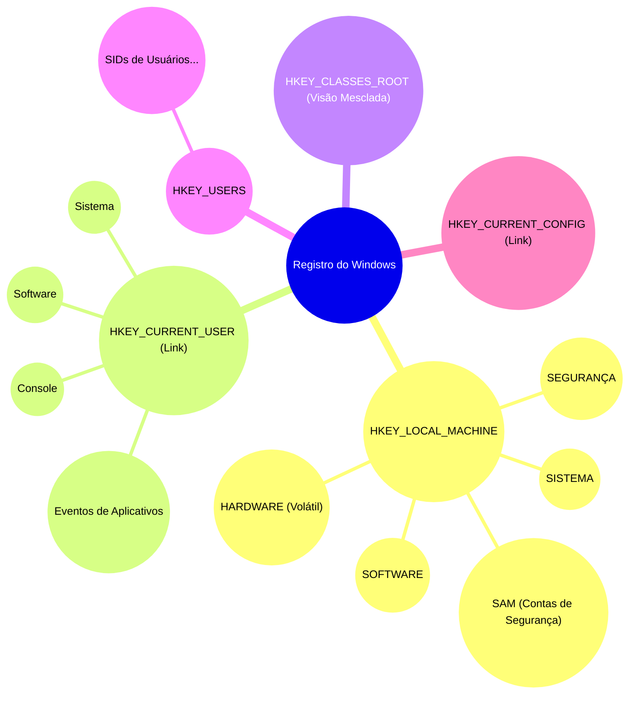
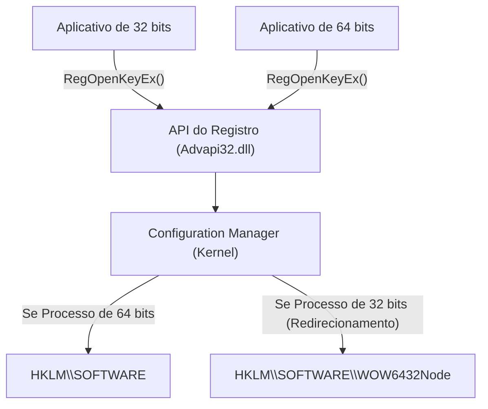
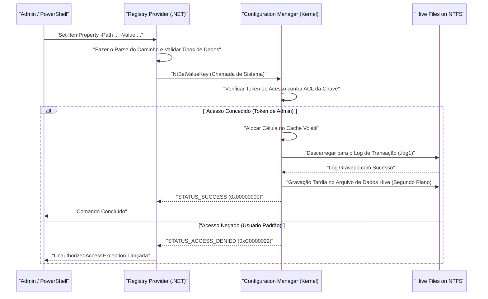

# Conhecimentos Básicos do Registro do Windows e Métodos de Edição Segura e Programável

No sistema operacional Windows, o "Registro" (Registry) é um enorme banco de dados hierárquico que armazena várias configurações do sistema e de aplicativos. Neste artigo, explicaremos detalhadamente a arquitetura básica do Registro do Windows, bem como métodos programáveis e seguros de edição do registro usando PowerShell e C#.

## 1. Introdução: História e Evolução do Registro do Windows

Nas versões iniciais do Windows (era do Windows 3.x), as configurações do sistema e de aplicativos eram salvas principalmente em arquivos `.ini` (arquivos de inicialização). No entanto, inúmeros arquivos INI para cada aplicativo começaram a se espalhar por todo o sistema, tornando o gerenciamento extremamente complexo. Além disso, como os arquivos INI são baseados em texto simples, era difícil salvar dados binários e não existia um mecanismo de controle de acesso (segurança). A velocidade de análise (parsing) dos arquivos também era lenta, tornando-os inadequados para armazenar configurações em larga escala.

Para resolver fundamentalmente esses problemas, o "Registro" foi adotado integralmente como um banco de dados centralizado de configurações a partir do Windows NT e Windows 95. O registro é um banco de dados hierárquico que oferece tipagem forte, suporte a dados binários e recursos robustos de segurança por meio de listas de controle de acesso (ACL). Com isso, todos os componentes, desde o kernel do sistema operacional até os aplicativos no espaço do usuário, passaram a poder ler e escrever configurações por meio de uma interface unificada (o grupo de funções `Reg*` da API Win32).

Até o atual Windows 11, o registro continua a funcionar como o coração do sistema operacional. Metadados essenciais para o funcionamento do sistema, como configurações de hardware, ordem de carregamento de drivers de dispositivo, ambiente de área de trabalho do usuário e lista de softwares instalados, estão todos centralizados no registro.

## 2. Profundezas da Arquitetura: A Verdadeira Natureza dos Hives do Registro e Mapeamento de Memória

Embora o registro pareça logicamente uma única estrutura de árvore enorme, ele é fisicamente dividido em vários arquivos chamados de "Hives" salvos no disco. Isso separa as configurações de todo o sistema das configurações específicas do usuário, permitindo um carregamento eficiente.

Os principais arquivos de hive geralmente residem no diretório `%SystemRoot%\System32\config`.
- `SYSTEM`: Configurações críticas necessárias para a inicialização do sistema operacional (drivers, serviços, configurações de inicialização, etc.).
- `SOFTWARE`: Configurações de todo o sistema para o software instalado. A maioria das configurações de aplicativos de terceiros entra aqui.
- `SAM`: Security Accounts Manager (contas de usuários locais e hashes de senhas).
- `SECURITY`: Política de segurança local e atribuições de privilégios.
- `DEFAULT`: Perfil do usuário padrão (modelo ao criar um novo usuário).

Os arquivos de hive individuais do usuário existem como arquivos ocultos no diretório de perfil do usuário (ex: `C:\Users\Username`).
- `NTUSER.DAT`: Configurações básicas daquele usuário (a maior parte do HKCU).
- `UsrClass.dat`: Configurações de associação de extensão de arquivo daquele usuário (localizado em `AppData\Local\Microsoft\Windows`).

Esses arquivos são mapeados para a memória pool paginável do kernel (kernel page pool) pelo "Configuration Manager (CM)" do kernel durante a inicialização do sistema operacional. O Configuration Manager é o componente de modo kernel que processa as solicitações de leitura e gravação no registro.

O que vale ressaltar é que nem todos os dados do registro existem no disco. Por exemplo, o hive `HARDWARE` é volátil (Volatile) e não é salvo em nenhum arquivo no disco. Ele é reconstruído dinamicamente na memória cada vez que o sistema operacional é inicializado e o gerenciador Plug and Play (PnP) detecta o hardware.

Além disso, o registro nos Windows mais recentes implementa log de transações para aumentar a confiabilidade. As alterações nos arquivos hive não são gravadas diretamente no arquivo de dados, mas são primeiro registradas no log de transações (`.log1`, `.log2`). Isso evita a corrupção de dados durante perda de energia repentina ou travamento do sistema durante a gravação, garantindo a integridade do banco de dados quase como propriedades ACID.

## 3. Estrutura Hierárquica de Chaves e Valores do Registro

O registro tem uma estrutura hierárquica muito semelhante a um sistema de arquivos. O nó raiz é chamado de "chave raiz" (Root Key) ou "hive", sob o qual são armazenadas "chaves" (Keys), "subchaves" (Subkeys) e os dados reais que são os "valores" (Values). Fica mais fácil entender se você pensar que chaves equivalem a diretórios e valores equivalem a arquivos.

As principais chaves raiz são classificadas nas cinco seguintes:

1. **HKEY_LOCAL_MACHINE (HKLM)**: Armazena as configurações de sistema e de software que se aplicam a todo o computador (a todos os usuários). Alterações requerem privilégios de administrador.
2. **HKEY_CURRENT_USER (HKCU)**: Armazena as configurações específicas do usuário atualmente conectado. Na verdade, este não é um banco de dados independente, mas apenas um link simbólico (alias) para a chave do SID (Identificador de Segurança) do respectivo usuário sob `HKEY_USERS`.
3. **HKEY_CLASSES_ROOT (HKCR)**: Armazena associações de extensão de arquivo, informações de registro de classes COM (Component Object Model) e extensões de shell. Essa chave é especial, sendo uma visão virtual gerada pela mescla (merge) do Configuration Manager entre `HKLM\SOFTWARE\Classes` (sistema inteiro) e `HKCU\Software\Classes` (usuário atual). Em caso de conflito, a configuração específica do usuário (HKCU) tem precedência.
4. **HKEY_USERS (HKU)**: Armazena as configurações de todos os perfis de usuário do sistema (os que estão atualmente carregados na memória). É hierarquizado com base no SID.
5. **HKEY_CURRENT_CONFIG (HKCC)**: Configurações relacionadas ao perfil de hardware atual. A verdadeira localização é um link para `HKLM\SYSTEM\CurrentControlSet\Hardware Profiles\Current`.

Visualizando essa complexa estrutura hierárquica e a relação de links, temos o seguinte:



## 4. Tipos de Dados do Registro (Explicação Detalhada)

Os "valores" do registro têm tipos de dados estritamente definidos. Ao manipular programaticamente o registro, é essencial entender esses tipos corretamente e gravar dados no tipo apropriado. Escrever com o tipo incorreto pode causar o lançamento de exceções por parte de aplicativos ou fazer com que funcionalidades do sistema operacional parem de funcionar.

- **REG_SZ (Valor de String)**: O tipo de dado mais comum. Armazena uma string Unicode terminada em NULL (UTF-16LE). É usado para caminhos de arquivos, URLs, nomes de exibição na interface, etc.
- **REG_DWORD (Valor Inteiro de 32 bits)**: Valor inteiro sem sinal de 32 bits (4 bytes). Frequentemente utilizado para valores booleanos (0=desativado, 1=ativado), valores de tempo limite em milissegundos, definições de códigos de erro, etc. Como a arquitetura do Windows é little-endian, ele é salvo no disco começando pelo byte de ordem inferior (Ex: 0x12345678 é salvo como `78 56 34 12`).
- **REG_QWORD (Valor Inteiro de 64 bits)**: Valor inteiro de 64 bits (8 bytes). Com a popularização da arquitetura de 64 bits, é usado para armazenar grandes valores numéricos (como cotas de disco e tamanhos de grandes quantidades de memória) e configurações de tamanho de ponteiro.
- **REG_MULTI_SZ (Valor de String de Múltiplas Linhas)**: Armazena sequencialmente múltiplas strings terminadas em NULL e finaliza o formato com outro caractere vazio terminado em NULL (duplo NULL) no final. Adequado para armazenar dados do tipo matriz, como lista de endereços IP, lista de serviços dependentes, ordem de vinculação (bindings), etc.
- **REG_EXPAND_SZ (Valor de String Expansível)**: Um tipo de string especial que contém strings de variáveis de ambiente não expandidas, como `%USERPROFILE%` ou `%SystemRoot%`. Ele é dinamicamente expandido para o caminho absoluto real pelo sistema operacional quando um aplicativo o lê por meio da API `RegQueryValueEx` ou ao chamar a API `ExpandEnvironmentStrings`.
- **REG_BINARY (Valor Binário)**: Um fluxo arbitrário de dados binários brutos. São armazenadas senhas criptografadas (como LSA Secrets), certificados digitais, e dados serializados ou estruturas complexas específicas de aplicativos.
- **REG_NONE**: Dados de tipo não definido. É muito raro, mas usado em áreas reservadas para chaves de criptografia, entre outros.
- **REG_RESOURCE_LIST** / **REG_FULL_RESOURCE_DESCRIPTOR**: Tipos avançados dedicados ao kernel usados ​​por drivers de dispositivo para registrar informações de alocação de recursos de hardware (IRQ, portas de E/S, canais DMA).

## 5. Modelo Matemático e Desempenho do Registro no Sistema Operacional

Como o registro afeta diretamente o desempenho do sistema operacional (especialmente o tempo de inicialização e a velocidade de inicialização do processo), ele é internamente otimizado usando uma estrutura de dados avançada chamada "Cell Index", semelhante a uma B-Tree (Árvore B).

### Complexidade de Tempo da Pesquisa (Time Complexity)
A complexidade de tempo $T_{\text{search}}$ ao pesquisar por uma chave (caminho) específica no registro depende da profundidade da árvore e do número de nós em cada nível. Ao pesquisar uma subchave na profundidade $d$ (ex: `A\B\C\D` implica $d=4$), a complexidade pode ser teoricamente modelada da seguinte forma:

$$
T_{\text{search}}(d, L) = \sum_{i=1}^{d} O(\log(C_i) \cdot L_i)
$$

Aqui, $C_i$ é o número de nós filhos (subchaves ou valores) na profundidade $i$, e $L_i$ é o comprimento da string (número de caracteres) a ser comparada. Dentro do arquivo hive que constitui o próprio registro, a lista de subchaves é mantida como um índice classificado pelo valor de hash do nome ou pela ordem alfabética. Por conta disso, uma pesquisa binária $O(\log(C_i))$ é possível em vez de uma simples pesquisa linear $O(C_i)$, alcançando assim um acesso extremamente rápido, mesmo que dezenas de milhares de subchaves existam sob uma única chave.

### Uso de Armazenamento (Space Complexity)
O tamanho total do registro (espaço ocupado no disco físico) é calculado como a soma de cada hive.

$$
\text{Size}_{\text{Total}} = \sum_{h \in \text{Hives}} \left( N_{h} \times S_{\text{key\_metadata}} + \sum_{v \in h} S_{\text{value}}(v) \right) + S_{\text{overhead}}
$$

Onde $N_h$ é o número de chaves dentro do hive $h$, $S_{\text{key\_metadata}}$ é o tamanho dos metadados por chave (como carimbo de data/hora de última gravação, ponteiro para descritor de segurança, ponteiro para chave pai, etc.), e $S_{\text{value}}(v)$ é o tamanho útil (payload) do valor $v$. As sobrecargas (overhead) $S_{\text{overhead}}$ causadas por logs de transação e células vazias não mais necessárias (fragmentação) também estão incluídas. Se os dados desnecessários (como os restos de um software que não pôde ser completamente desinstalado) forem deixados no registro por um longo período, esse uso de armazenamento aumentará, podendo pressionar a memória do pool paginado do sistema operacional e levar à degradação do desempenho.

## 6. O Risco da Edição Manual que Ameaça a Robustez do Sistema e as Probabilidades de Corrupção

A edição manual através do Editor do Registro (`regedit.exe`) deve ser considerada um último recurso de administração do sistema. O registro não possui uma função de "Desfazer (Undo)" incorporada como editores de documentos comuns, e alterações de valores ou exclusões de chaves são refletidas imediatamente no sistema por meio do Configuration Manager.

Em particular, se um único caractere for editado ou excluído por engano de uma chave crítica, essencial para a inicialização do sistema (por exemplo, configurações do driver de controlador de disco sob `HKLM\SYSTEM\CurrentControlSet\Services`, ou o valor `Userinit` em `HKLM\SOFTWARE\Microsoft\Windows NT\CurrentVersion\Winlogon`), existe um risco fatal de o sistema operacional travar com a Tela Azul da Morte (BSoD) e se tornar ininicializável, ou o sistema parar em uma tela preta após a tela de login.

### Modelo Matemático da Probabilidade de Corrupção
Vamos considerar a probabilidade de ocorrência de uma falha no sistema caso chaves dentro do registro sejam acidentalmente alteradas ou deletadas. O conjunto de chaves críticas vitais para o funcionamento normal do sistema será $C$, e o total das mesmas será $N_c = |C|$. Consideramos $N_{\text{total}}$ como o número total de chaves do registro.
Se alterarmos aleatoriamente ou deletarmos $k$ chaves, a probabilidade $P_{\text{failure}}$ de que pelo menos uma chave crítica seja corrompida, calculada através de amostragem sem reposição (Sampling without replacement), é expressa por:

$$
P_{\text{failure}} = 1 - \frac{\binom{N_{\text{total}} - N_c}{k}}{\binom{N_{\text{total}}}{k}} = 1 - \prod_{i=0}^{k-1} \left( 1 - \frac{N_c}{N_{\text{total}} - i} \right)
$$

A contagem total de chaves $N_{\text{total}}$ em todo o registro está na ordem de centenas de milhares a milhões, mas $N_c$ também existe na ordem de dezenas de milhares. Matematicamente, mesmo nas operações aleatórias, se $k$ aumentar, a taxa de falha saltará subitamente. Na edição manual do mundo real, o usuário não edita "aleatoriamente", pelo contrário, ele intencionalmente manipula áreas diretamente relacionadas às configurações do sistema e ao comportamento do software (geralmente acompanhando sites de tutoriais), então a chance de tocar em uma chave crítica é muito maior do que esse valor teórico.

## 7. Virtualização de Registro e a Arquitetura WOW64

O Windows implementa alguns mecanismos avançados de "Virtualização" (Redirecionamento) de acesso ao registro para manter a compatibilidade com aplicativos legados (Legacy Applications). Não entender isso durante a programação é uma causa para defeitos (bugs) substanciais.

### Virtualização de Registro UAC (Registry Virtualization)
O Controle de Conta de Usuário (UAC) foi introduzido a partir do Windows Vista. Quando um aplicativo antigo criado na era do Windows XP (que roda com privilégios de usuário padrão) tenta gravar em chaves protegidas como `HKLM\SOFTWARE` que normalmente exigiriam direitos de administrador, para evitar que o programa trave com erro de Acesso Negado (Access Denied), o Windows silenciosamente redireciona essa gravação à Loja Virtual (Virtual Store) dentro do perfil do usuário em `HKCU\Software\Classes\VirtualStore\MACHINE\SOFTWARE`. Nas leituras, a chave original e a Virtual Store também são unidas (mescladas) e retornadas. Isso permite que os aplicativos continuem executando normalmente, sem que os erros sejam perceptíveis a eles.
No entanto, quando se cria um utilitário programável que faça mudanças globais, você deve especificar `<requestedExecutionLevel level="requireAdministrator" />` no arquivo de manifesto, e então essa virtualização deve ser desativada.

### O Redirecionamento WOW64 (Windows 32-bit on Windows 64-bit)
Ao rodar um aplicativo mais velho de 32 bits em uma edição 64 bits do Windows (a principal atualmente), as chaves de registro também sofrem um redirecionamento automático para prevenir que aplicativos de 32 bits sobrescrevam acidentalmente o sistema nativo de 64 bits ou carreguem DLLs incompatíveis de 64 bits.
Por exemplo, se o aplicativo de 32 bits tentar ler ou alterar `HKLM\SOFTWARE\Vendor\App`, o sistema operacional fará transparentemente o redirecionamento para `HKLM\SOFTWARE\WOW6432Node\Vendor\App`.


Ao editar o registro através de scripts PowerShell ou aplicativos C#, é indispensável que se saiba que tipo de arquitetura do processo em execução (se 32 ou 64 bits). Senão, problemas irritantes do tipo "A configuração que salvei não aparece no Editor do Registro (foi salva em outro lugar)" poderão ocorrer.

## 8. Edição Segura e Programável via PowerShell

Para minimizar os riscos de editar manualmente os registros, as práticas mais modernas sugerem realizar operações no registro usando scripts do PowerShell, codificando as operações (Infrastructure as Code) a fim de garantir automação, reprodutibilidade e testabilidade.
O PowerShell possui um "Registry Provider", de modo que é capaz de realizar manipulações de forma transparente via comandos idênticos aos do sistema de arquivos (como no drive `C:`), como `Get-ChildItem`, `Get-ItemProperty` e `New-Item`.

No PowerShell, drives específicos como `HKLM:` e `HKCU:` (como letras de unidade) são montados por padrão.

### Operações Básicas de CRUD
```powershell
# 1. Verificação de Existência (Read)
$keyPath = "HKCU:\Software\MyCustomApp"
if (-Not (Test-Path -Path $keyPath)) {
    # 2. Criação de nova chave (Create)
    New-Item -Path "HKCU:\Software" -Name "MyCustomApp" -Force | Out-Null
    Write-Host "Chave criada."
}

# 3. Gravação e Atualização de Valores (Update) - Gravando 1 como REG_DWORD
Set-ItemProperty -Path $keyPath -Name "EnableDebug" -Value 1 -Type DWord

# 4. Leitura de Valor (Read)
$debugFlag = (Get-ItemProperty -Path $keyPath).EnableDebug
Write-Host "Sinalizador de depuração atual: $debugFlag"

# 5. Remoção de Valor (Delete)
Remove-ItemProperty -Path $keyPath -Name "EnableDebug" -Force
```

### Exemplo Prático 1: Configuração Automática do Ambiente de Desenvolvimento (Adição da variável de ambiente PATH)
O seguinte script é uma automação para quando um desenvolvedor está configurando uma nova máquina Windows e precisa adicionar, com segurança, um diretório de ferramentas personalizadas à variável de ambiente de usuário `PATH`.

```powershell
$envKey = "HKCU:\Environment"
$newPath = "C:\tools\bin"

# Obter estado do PATH atual (suprimir o erro para buscar com segurança)
$currentPathInfo = Get-ItemProperty -Path $envKey -Name "Path" -ErrorAction SilentlyContinue
$currentPath = if ($currentPathInfo) { $currentPathInfo.Path } else { "" }

# Analisar por meio de Expressões Regulares para ver se já está incluso
if ($currentPath -notmatch [regex]::Escape($newPath)) {
    # Adicionar o ponto e vírgula caso falte no final
    if ($currentPath -and $currentPath -notmatch ";$") {
        $currentPath += ";"
    }
    $updatedPath = $currentPath + $newPath
    
    # Gravar como o tipo REG_EXPAND_SZ (importante)
    Set-ItemProperty -Path $envKey -Name "Path" -Value $updatedPath -Type ExpandString
    Write-Host "A variável de ambiente PATH foi atualizada para: $newPath"
    
    # Alertar da mudança nas variáveis de ambiente aos processos em execução (WM_SETTINGCHANGE)
    # Graças a isso, é refletido no novo explorador e etc. sem necessidade de reiniciar.
    [Environment]::SetEnvironmentVariable("Path", $updatedPath, [EnvironmentVariableTarget]::User)
} else {
    Write-Host "O PATH já foi adicionado anteriormente."
}
```

### Exemplo Prático 2: Incluir Ações Personalizadas no Menu de Contexto
A intenção é integrar no menu de contexto ao clicar com o botão direito num diretório ou plano de fundo um item personalizado chamado "Abrir com My IDE".

```powershell
# Caminho do menu para o clique direito no plano de fundo do diretório
$menuPath = "HKCR:\Directory\Background\shell\OpenWithMyIDE"
$commandPath = "$menuPath\command"

try {
    # Crie uma subchave pai do menu
    New-Item -Path $menuPath -Force -ErrorAction Stop | Out-Null
    
    # O valor (default) é o nome exibido
    Set-ItemProperty -Path $menuPath -Name "(default)" -Value "Abrir com My IDE" -Type String
    
    # Configurar um ícone (Opcional)
    Set-ItemProperty -Path $menuPath -Name "Icon" -Value "C:\Program Files\MyIDE\ide.exe,0" -Type String

    # Crie a subchave command e defina a linha de comando a ser executada
    # A variável %V expande para o caminho do diretório atual
    New-Item -Path $commandPath -Force -ErrorAction Stop | Out-Null
    Set-ItemProperty -Path $commandPath -Name "(default)" -Value "`"C:\Program Files\MyIDE\ide.exe`" `"%V`"" -Type String

    Write-Host "Menu de contexto adicionado."
} catch {
    Write-Error "Falha ao alterar o registro. Verifique se você está executando com privilégios de administrador. Erro: $_"
}
```

### Sequência Interna de Acesso ao Registro via PowerShell
Esse diagrama de sequência mostra como o acesso ao registro via scripts do PowerShell funciona no sistema operacional:



## 9. Acesso Robusto ao Registro com C# (.NET)

Ao acessar o registro a partir de aplicativos .NET (como C#), você usa as classes `Microsoft.Win32.Registry` e `RegistryKey`.
A maior vantagem de usar o C# é o robusto tratamento de erros por meio de tratamento de exceção (`try-catch`), verificação rigorosa de tipos e a possibilidade de designar explicitamente a visão de 32 bits/64 bits usando a enumeração `RegistryView`.

Abaixo está um exemplo de código C# onde você faz leitura/gravação segura em ambiente de SO de 64 bits garantindo pular o redirecionamento (WOW6432Node) na área nativa do registro 64-bits:

```csharp
using System;
using System.Security;
using Microsoft.Win32;

class RegistryEditor
{
    static void Main()
    {
        // Caminho da chave sob HKLM (Requer permissões de administrador)
        string keyPath = @"SOFTWARE\MyEnterpriseApp\Settings";

        // Usando RegistryView.Registry64 para abrir a visão nativa de 64 bits
        // A instrução using é usada para garantir a liberação do identificador da chave de registro (recurso não gerenciado)
        try
        {
            using (RegistryKey baseKey = RegistryKey.OpenBaseKey(RegistryHive.LocalMachine, RegistryView.Registry64))
            {
                // Abrir a chave com permissão de gravação (writable: true). Cria se não existir.
                using (RegistryKey subKey = baseKey.CreateSubKey(keyPath, writable: true))
                {
                    if (subKey != null)
                    {
                        // Gravando o valor como REG_DWORD
                        subKey.SetValue("MaxConnections", 100, RegistryValueKind.DWord);
                        
                        // Gravando o valor como REG_SZ
                        subKey.SetValue("ApiEndpoint", "https://api.example.com", RegistryValueKind.String);
                        
                        // Gravando como valor binário REG_BINARY usando Matriz de Bytes
                        byte[] secretData = { 0x01, 0x02, 0x0A, 0xFF };
                        subKey.SetValue("BinarySecret", secretData, RegistryValueKind.Binary);
                        
                        Console.WriteLine("A gravação no registro foi concluída com sucesso.");
                    }
                }
            }
        }
        catch (UnauthorizedAccessException ex)
        {
            // Ocorre frequentemente quando não executado como Administrador
            Console.WriteLine($"Erro de permissão: Execute o programa como \"Administrador\". Detalhes: {ex.Message}");
        }
        catch (SecurityException ex)
        {
            // Ocorreu um bloqueio da segurança de acesso de código do .NET (CAS)
            Console.WriteLine($"Exceção de segurança: {ex.Message}");
        }
        catch (Exception ex)
        {
            // Outros erros imprevisíveis de IO, etc.
            Console.WriteLine($"Erro inesperado: {ex.Message}");
        }
    }
}
```

O "identificador (handle)" retornado do SO quando você abre uma chave de registro é um recurso não gerenciado que consome memória e recursos do sistema. Portanto, uma regra de ferro na programação C# é usar um bloco `using` ou chamar `.Dispose()` (ou `.Close()`) explicitamente no bloco `finally` para evitar, com certeza, o vazamento de memória (handle leak).

## 10. Métodos de Backup e Restauração do Registro

Mesmo se houver automações usando scripts e programas, é de extrema importância ter um backup criado antes da gravação nos ambientes críticos do registro.

### Backup e Importação por arquivos .reg
A abordagem mais clássica e universal é exportar para um arquivo `.reg`. Esse arquivo tem um formato próprio em texto básico, e se estrutura da seguinte maneira:

```text
Windows Registry Editor Version 5.00

[HKEY_CURRENT_USER\Software\MyCustomApp]
"EnableDebug"=dword:00000001
"ApiEndpoint"="https://api.example.com"
"BinaryData"=hex:01,02,0a,ff
```
*Nota: Dados Binários são formados começando com "hex:" e separados por vírgulas sob a notação hexadecimal.*

Você pode usar o aplicativo via comando de linha `reg.exe` dentro de scripts Batch para implementar backups automáticos.
```cmd
REM Exportar a chave especificada de backup (subchaves também são recursivamente exportadas)
reg export HKLM\SOFTWARE\MyEnterpriseApp C:\backup\myapp_backup.reg /y

REM Restaurando um arquivo de Backup
reg import C:\backup\myapp_backup.reg
```

### Método Avançado de Backup usando PowerShell
Ao invés de mantê-lo apenas como um simples texto, com o uso guiado da orientação por objetos no PowerShell, você consegue extrair objetos do Registro e guardá-los e exportá-los em um salvamento puro de XML (CliXml). Com isso, no ato da restauração do registro você não vai contar somente com uma conversão baseada em strings em formato de texto, pois os dados são recuperados puros de fábrica contendo suas naturezas originais do banco tipadas.

```powershell
# Realizando Backup (Salvar as propriedades como XML)
Get-ItemProperty -Path "HKCU:\Software\MyCustomApp" | Export-Clixml -Path "C:\backup\reg_backup.xml"

# Conceito da Restauração
$backup = Import-Clixml -Path "C:\backup\reg_backup.xml"
# Em $backup está armazenado o customizado PSObject restaurado.
# Então pode-se fazer loops de propriedades aplicando a função de retorno `Set-ItemProperty` novamente.
```

## 11. Solução de Problemas com Sysinternals Process Monitor (Procmon)

Nos casos em que você não sabe em qual local um programa vai buscar os registros ou deseja investigar a causa do "Acesso Negado" (Access Denied), o utilitário grátis e distribuído de forma nativa da Microsoft na suíte Sysinternals, chamado **Process Monitor (Procmon)** é extremamente formidável.
Quando você utiliza o Procmon, são capturados ao vivo todos os processamentos que envolvem as APIs da manipulação contínua do Registro (tais quais `RegOpenKey`, `RegQueryValue` e `RegSetValue`), possibilitando filtros incríveis de solução de problema como estes abaixo:

- `Process Name` is `powershell.exe`
- `Operation` begins with `Reg`
- `Result` is `ACCESS DENIED`

Isso permite identificar, em um instante, quais chaves carecem de configurações de ACL ou se foram incorretamente redirecionadas ao WOW6432Node.

## 12. Segurança e Melhores Práticas

Para concluir, vamos resumir as principais regras e melhores práticas de design da manipulação e uso base do registro.

1. **Princípio de Privilégio Mínimo Aplicado:** É o adequado e mandatório que os ajustes em aplicativos bem como em sistemas sejam direcionados em grande forma sob local do usuário `HKCU` sob a raiz do `Software`. Um simples acesso e a escrita requisitados aos subdiretórios sob níveis como o `HKLM` vão requisitar e aumentar restrições como as elevações aos direitos de Administrador a mando da janela do UAC. Estendendo com essa atitude as vulnerabilidades, pois expande áreas do tipo "Attack Surface" nos dados alvos ao invés de simplesmente manter o conforto da operação base.
2. **Ativação da Auditoria (Auditing):** A certas chaves essenciais com permissão vital local (como a chave automática de auto-start `Run`, diretórios que formam os registros via sistemas nos serviços, etc) exija que o registro passe pelos caminhos chamados SACL (System Access Control List), apontando de onde, quem e em qual dia a exclusão foi originada sendo essas salva no evento interno contido das observações base, localizadas dentro das opções sobre o utilitário nativo interno chamado Visualizador de Eventos em Registro de Auditorias (Log de Segurança).
3. **Gerenciando Depreciações Voltadas a Base Dos Registros Nas Transações:** As inovações presentes originárias na implementação nos tempos passados sob os comandos das configurações em Kernels pela manipulação base sob TxR "Kernel Transaction Manager (KTM)", agora encontram problemas de suportes, vindo a ser depreciadas integralmente (Deprecated) pelo OS atual depois do Windows 10 e seus remanescentes. Requer agora, para os programadores da corporação e em seus desenvolvimentos contínuos uma manipulação ou modelo em memória ou manual local de salvamento interno via lógicas nas rotinas (Como fazer leituras preventivas aos valores velhos guardando uma cópia viva em arrays locais contidos dentro do software, entre outros Rollbacks nativos a serem implementados via programação base pelo dev).
4. **Cuidado ao Conflitar a Base via GPO nas Redes Diretório de Organizações Globais:** Não atue usando scripts ou alterações nativas no campo das chaves `HKLM\SOFTWARE\Policies` junto do perfil das pastas `HKCU\Software\Policies`, sendo esses dois controlados ou atualizados puramente sob base do sistema por "Diretivas dos Grupos". Scripts forçados nessas áreas são apagados de tempos a tempos (a cada 90 ou mais de 120 minutos base de rotina do background) no controlador principal de Domain Controller em back-end sem nenhuma perpetuidade nativa em configurações reais dos computadores que compõem essas modificações sem fim.

## Conclusões Finais

Nesse tutorial verificou-se o quão vasto as áreas nos registros do seu Windows possuem de um banco que compõe regras à integridade central do Software ao Ambiente Nativo que baseiam a área visual dos sistemas de rotina nos computadores base da plataforma e aplicações e processos de usuários em todo um sistema. Operar modificações via meios visuais locais pelo Editor das configurações ao ambiente é uma medida insegura às possibilidades severas do OS com a alta chance real constatada base em equações na corrupção de subpastas a certas chaves que prejudicam todo os processos naturais integrativos Windows e sua própria viabilização do ambiente sem travamentos (O famoso BSoD). Para evitar prejuízos graves que custem a quebra da máquina é muito mais que essencial os processos através dos recursos pautáveis nativamente pela automação no uso como do C# via scripts ou uso integral do moderno e viável interpretador local de base no próprio "PowerShell", obedecendo aos parâmetros puros essenciais (O Princípio local - Infrastructure as Code / IaC) das organizações. De modos reprodutíveis nos códigos locais limpos ou testáveis via comandos isolados e ambientes propícios a manipulação robusta, viável para a execução assertiva. Se as noções das profundezas apresentadas pautadas aos conhecimentos das raízes em Arquitetura da base que apresentados nesta matéria ficarem fixadas as formas das seguras de execuções de registro ficará na marca integral ao gerenciamento da Base Dos Registros aos mais seguros cenários nas configurações base nativa das Máquinas.
