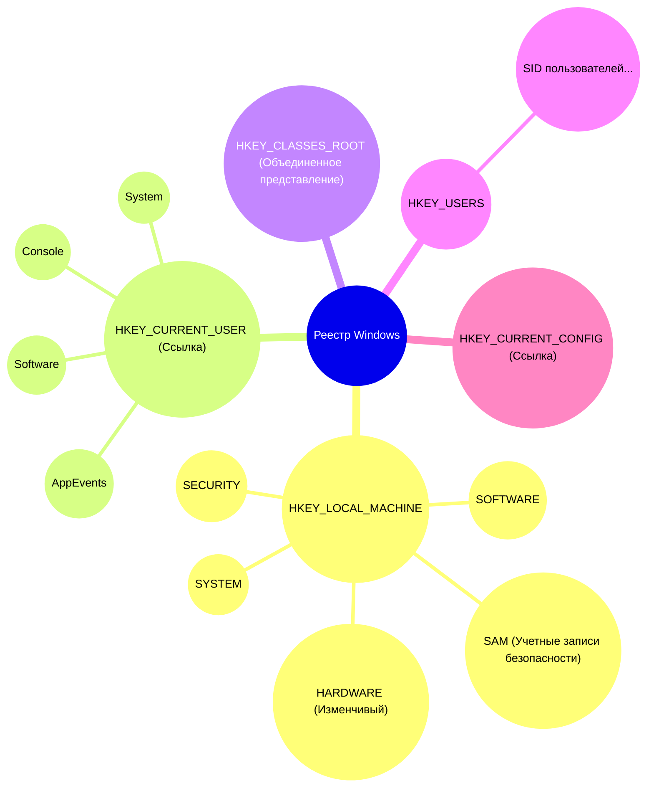
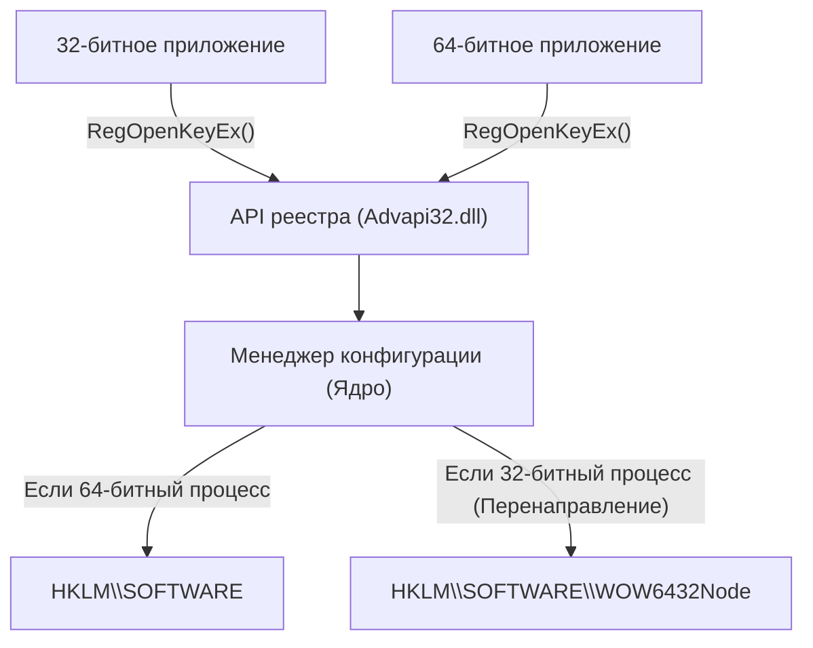
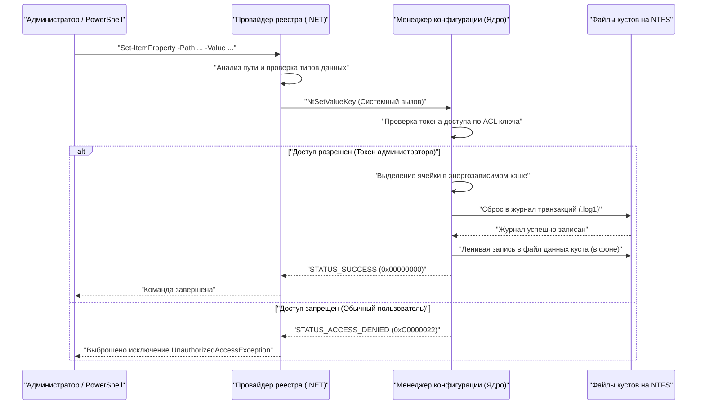

# Основы реестра Windows и программные методы безопасного редактирования

В операционной системе Windows «реестр» (Registry) представляет собой огромную иерархическую базу данных, в которой хранятся различные параметры системы и приложений. В этой статье мы подробно рассмотрим базовую архитектуру реестра Windows, а также программные методы его безопасного редактирования с использованием PowerShell и C#.

## 1. Введение: История и эволюция реестра Windows

В ранних версиях Windows (эпоха Windows 3.x) параметры системы и приложений в основном сохранялись в файлах инициализации `.ini`. Однако со временем бесчисленные INI-файлы каждого приложения стали разбросаны по всей системе, что сделало управление ими крайне сложным. Кроме того, поскольку INI-файлы основаны на простом тексте, в них было трудно сохранять двоичные данные, и не существовало механизма управления доступом (безопасности). Скорость парсинга файлов также была низкой, что делало их непригодными для хранения масштабных конфигураций.

Чтобы в корне решить эти проблемы, начиная с Windows NT и Windows 95, была полномасштабно внедрена концепция «реестра» как централизованной базы данных конфигураций. Реестр — это иерархическая база данных, которая обеспечивает строгую типизацию, поддержку двоичных данных и надежные функции безопасности с помощью списков управления доступом (ACL). Это позволило всем компонентам, от ядра ОС до приложений пользовательского пространства, читать и записывать настройки с использованием унифицированного интерфейса (набор функций `Reg*` в Win32 API).

Вплоть до современной Windows 11 реестр продолжает функционировать как сердце операционной системы. Все метаданные, необходимые для работы системы, такие как конфигурация оборудования, порядок загрузки драйверов устройств, среда рабочего стола пользователя и список установленного программного обеспечения, консолидированы в реестре.

## 2. Глубины архитектуры: Сущность кустов реестра и отображение в памяти

Хотя логически реестр выглядит как единая гигантская древовидная структура, физически он разделен на несколько файлов, называемых «кустами» (Hive), и хранится на диске. Это позволяет разделить общесистемные и пользовательские настройки, обеспечивая эффективную загрузку.

Основные файлы кустов обычно находятся в каталоге `%SystemRoot%\System32\config`:
- `SYSTEM`: Важные настройки, необходимые для загрузки операционной системы (драйверы, службы, конфигурация загрузки и т.д.).
- `SOFTWARE`: Общесистемные настройки установленного программного обеспечения. Здесь находится большинство настроек сторонних приложений.
- `SAM`: Security Accounts Manager (Менеджер учетных записей безопасности - локальные учетные записи пользователей и хеши паролей).
- `SECURITY`: Локальные политики безопасности и назначение прав.
- `DEFAULT`: Профиль пользователя по умолчанию (шаблон при создании нового пользователя).

Файлы кустов, специфичные для каждого пользователя, существуют как скрытые файлы в каталогах их профилей (например, `C:\Users\Username`):
- `NTUSER.DAT`: Базовые настройки этого пользователя (большая часть HKCU).
- `UsrClass.dat`: Настройки ассоциаций расширений файлов этого пользователя (находится в `AppData\Local\Microsoft\Windows`).

Во время загрузки ОС эти файлы отображаются в пул памяти страниц ядра с помощью «Менеджера конфигурации» (Configuration Manager, CM) ядра. Менеджер конфигурации — это компонент режима ядра, обрабатывающий запросы на чтение и запись в реестр.

Особо следует отметить, что не все данные реестра существуют на диске. Например, куст `HARDWARE` является изменчивым (Volatile) и вообще не сохраняется в виде файлов на диске. Он динамически перестраивается в памяти каждый раз при загрузке ОС и обнаружении оборудования менеджером Plug and Play (PnP).

Кроме того, для повышения надежности реестра в современных версиях Windows реализовано журналирование транзакций. Изменения в файлах кустов не записываются напрямую в файлы данных; сначала они фиксируются в журналах транзакций (`.log1`, `.log2`). Это предотвращает повреждение данных (коррупцию) в случае неожиданного отключения питания или сбоя системы во время записи, гарантируя целостность базы данных, близкую к свойствам ACID.

## 3. Иерархическая структура ключей и значений реестра

Реестр имеет иерархическую структуру, очень похожую на файловую систему. Корневые узлы называются «корневыми ключами» (Root Keys) или «кустами», а под ними хранятся «ключи» (Keys), «подключи» (Subkeys) и «значения» (Values), являющиеся самими данными. Для понимания можно считать, что ключи эквивалентны каталогам, а значения — файлам.

Основные корневые ключи делятся на следующие 5 категорий:

1. **HKEY_LOCAL_MACHINE (HKLM)**: Содержит системные настройки и настройки программного обеспечения, применяемые ко всему компьютеру (ко всем пользователям). Для внесения изменений требуются права администратора.
2. **HKEY_CURRENT_USER (HKCU)**: Содержит настройки, специфичные для текущего пользователя, вошедшего в систему. На самом деле это не отдельная база данных, а всего лишь символическая ссылка (псевдоним) на ключ SID (идентификатор безопасности) соответствующего пользователя внутри `HKEY_USERS`.
3. **HKEY_CLASSES_ROOT (HKCR)**: Содержит ассоциации расширений файлов, информацию о регистрации классов COM (Component Object Model) и расширения оболочки. Это особый ключ — виртуальное представление, в котором Менеджер конфигурации объединяет `HKLM\SOFTWARE\Classes` (в масштабе системы) и `HKCU\Software\Classes` (для текущего пользователя). В случае конфликтов приоритет отдается пользовательским настройкам (HKCU).
4. **HKEY_USERS (HKU)**: Содержит настройки для всех профилей пользователей в системе (тех, что в данный момент загружены в память). Они иерархически организованы на основе SID.
5. **HKEY_CURRENT_CONFIG (HKCC)**: Настройки, связанные с текущим профилем оборудования. На самом деле является ссылкой на `HKLM\SYSTEM\CurrentControlSet\Hardware Profiles\Current`.

Визуализация этой сложной иерархической структуры и связей выглядит следующим образом:



## 4. Типы данных реестра (подробное объяснение)

Для каждого «значения» в реестре определен строгий тип данных. При программном управлении реестром важно правильно понимать эти типы и записывать данные в соответствующем формате. Запись с неверным типом может привести к возникновению исключений в приложениях или сбою функций ОС.

- **REG_SZ (Строковое значение)**: Наиболее распространенный тип данных. Хранит Unicode-строку, завершающуюся нулем (UTF-16LE). Используется для путей к файлам, URL-адресов, отображаемых имен пользовательского интерфейса и т.д.
- **REG_DWORD (Параметр DWORD (32 бита))**: 32-битное (4 байта) беззнаковое целое число. Часто используется для булевых значений (0=отключено, 1=включено), значений тайм-аута в миллисекундах и кодов ошибок. Поскольку Windows использует архитектуру Little-Endian, на диске оно сохраняется начиная с младшего байта (например, 0x12345678 сохраняется как `78 56 34 12`).
- **REG_QWORD (Параметр QWORD (64 бита))**: 64-битное (8 байт) целое число. С распространением 64-битной архитектуры оно используется для хранения огромных чисел (например, квот дискового пространства или размеров большой памяти) и размеров указателей.
- **REG_MULTI_SZ (Многострочный параметр)**: Хранит несколько строк, завершающихся нулем, последовательно, заканчиваясь дополнительным нулевым символом (двойной ноль). Подходит для сохранения данных в виде массивов, таких как списки IP-адресов, списки зависимых служб или порядок привязки.
- **REG_EXPAND_SZ (Расширяемый строковый параметр)**: Специальный строковый тип, содержащий нераскрытые переменные среды, такие как `%USERPROFILE%` или `%SystemRoot%`. При чтении приложением через API `RegQueryValueEx` или при вызове API `ExpandEnvironmentStrings` ОС динамически преобразует их в фактические абсолютные пути.
- **REG_BINARY (Двоичный параметр)**: Любой необработанный поток двоичных данных. В нем хранятся зашифрованные пароли (например, LSA Secrets), цифровые сертификаты, сложные структуры, специфичные для приложений, и сериализованные данные.
- **REG_NONE**: Данные с неопределенным типом. Встречается крайне редко, но используется, например, для зарезервированных областей криптографических ключей.
- **REG_RESOURCE_LIST** / **REG_FULL_RESOURCE_DESCRIPTOR**: Расширенные типы, предназначенные только для ядра, которые драйверы устройств используют для записи информации о распределении аппаратных ресурсов (IRQ, порты ввода-вывода, каналы DMA).

## 5. Математическая модель реестра в операционной системе и производительность

Поскольку реестр напрямую влияет на производительность ОС (особенно на время загрузки и скорость инициализации процессов), внутренне он оптимизирован с использованием сложной структуры данных, похожей на B-дерево, называемой «Cell Index» (Индекс ячеек).

### Временная сложность поиска (Time Complexity)
Временная сложность поиска $T_{\text{search}}$ конкретного ключа (пути) в реестре зависит от глубины дерева и количества узлов на каждом уровне. Сложность поиска подраздела глубиной $d$ (например, $d=4$ для `A\B\C\D`) теоретически можно смоделировать следующим образом:

$$
T_{\text{search}}(d, L) = \sum_{i=1}^{d} O(\log(C_i) \cdot L_i)
$$

Здесь $C_i$ — количество дочерних узлов (подключей или значений) на глубине $i$, а $L_i$ — длина (количество символов) сравниваемой строки. В файлах кустов, являющихся сущностью реестра, списки подключей хранятся как индексы, отсортированные по хеш-значениям имен или в алфавитном порядке. Поэтому возможен бинарный поиск $O(\log(C_i))$, а не простой линейный поиск $O(C_i)$, что обеспечивает чрезвычайно быстрый доступ, даже если под одним ключом находятся десятки тысяч подключей.

### Объем занимаемой памяти (Space Complexity)
Общий размер реестра (объем, занимаемый на физическом диске) рассчитывается как сумма всех кустов:

$$
\text{Size}_{\text{Total}} = \sum_{h \in \text{Hives}} \left( N_{h} \times S_{\text{key\_metadata}} + \sum_{v \in h} S_{\text{value}}(v) \right) + S_{\text{overhead}}
$$

Где $N_h$ — количество ключей в кусте $h$, $S_{\text{key\_metadata}}$ — размер метаданных для каждого ключа (отметка времени последней записи, указатель на дескриптор безопасности, указатель на родительский ключ и т.д.), а $S_{\text{value}}(v)$ — размер полезной нагрузки значения $v$. Это также включает $S_{\text{overhead}}$ — накладные расходы, вызванные журналами транзакций и ненужными пустыми ячейками (фрагментация). Если ненужные данные (например, остатки не полностью удаленного программного обеспечения) остаются в реестре в течение длительного времени, этот объем увеличивается, создавая нагрузку на память пула страниц ОС и приводя к снижению производительности.

## 6. Риски ручного редактирования и вероятность повреждения, угрожающие стабильности системы

Редактирование вручную с помощью редактора реестра (`regedit.exe`) следует рассматривать как крайнюю меру в системном администрировании. В реестре нет встроенной функции «Отменить» (Undo), как в обычных текстовых редакторах, и изменения значений или удаление ключей немедленно отражаются в системе через Менеджер конфигурации.

В частности, если вы по ошибке отредактируете или удалите хотя бы один символ в критическом ключе, необходимом для загрузки системы (например, в настройках драйвера дискового контроллера в разделе `HKLM\SYSTEM\CurrentControlSet\Services` или значении `Userinit` в `HKLM\SOFTWARE\Microsoft\Windows NT\CurrentVersion\Winlogon`), существует фатальный риск того, что ОС выдаст «синий экран смерти» (BSoD) и перестанет загружаться, или не сможет продвинуться дальше экрана входа в систему («черный экран»).

### Математическая модель вероятности повреждения
Давайте рассмотрим вероятность отказа системы, если мы случайным образом изменим или удалим ключи в реестре. Пусть $C$ — набор критических ключей, необходимых для нормальной работы системы, а их общее количество $N_c = |C|$. Пусть общее количество ключей во всем реестре равно $N_{\text{total}}$.
Если $k$ ключей удалены или уничтожены случайным образом, вероятность того, что хотя бы один критический ключ будет поврежден, $P_{\text{failure}}$, выражается следующим образом в соответствии с расчетом вероятности для выборки без возвращения (Sampling without replacement):

$$
P_{\text{failure}} = 1 - \frac{\binom{N_{\text{total}} - N_c}{k}}{\binom{N_{\text{total}}}{k}} = 1 - \prod_{i=0}^{k-1} \left( 1 - \frac{N_c}{N_{\text{total}} - i} \right)
$$

Общее количество ключей во всем реестре $N_{\text{total}}$ исчисляется сотнями тысяч или миллионами, но $N_c$ также составляет десятки тысяч. Математически, даже при случайных операциях, вероятность сбоя резко возрастает с увеличением $k$. Более того, при ручных операциях в реальности пользователь редактирует не «случайным образом», а намеренно (часто следуя обучающим сайтам) манипулирует областями, непосредственно связанными с системными настройками или поведением ПО, поэтому вероятность затронуть критический ключ намного выше вышеуказанного теоретического значения.

## 7. Виртуализация реестра и архитектура WOW64

Для поддержания совместимости с устаревшими приложениями Windows реализует несколько продвинутых механизмов «виртуализации (перенаправления)» доступа к реестру. Программирование без понимания этого может привести к серьезным ошибкам.

### Виртуализация реестра UAC (Registry Virtualization)
Начиная с Windows Vista, был введен Контроль учетных записей пользователей (UAC). Чтобы предотвратить сбой с ошибкой «Отказано в доступе» (Access Denied), когда старые приложения эпохи Windows XP (работающие со стандартными правами пользователя) пытаются записать данные в защищенные ключи, такие как `HKLM\SOFTWARE`, требующие прав администратора, Windows незаметно перенаправляет эту запись в виртуальное хранилище в профиле пользователя: `HKCU\Software\Classes\VirtualStore\MACHINE\SOFTWARE`. При чтении также возвращается объединенный результат из исходного расположения и виртуального хранилища. Это позволяет приложению продолжать нормальную работу без обнаружения ошибки.
Однако при разработке инструментов для программного изменения системных настроек вы должны указать `<requestedExecutionLevel level="requireAdministrator" />` в файле манифеста, чтобы отключить эту виртуализацию.

### Перенаправление WOW64 (Windows 32-bit on Windows 64-bit)
При запуске старых 32-битных приложений на 64-битных версиях Windows (которые сейчас доминируют), некоторые ключи реестра автоматически изолируются и перенаправляются, чтобы 32-битное приложение по ошибке не перезаписало собственные 64-битные системные настройки или не загрузило несовместимые 64-битные DLL.
Например, если 32-битное приложение пытается получить доступ к `HKLM\SOFTWARE\Vendor\App`, ОС прозрачно перенаправит его на `HKLM\SOFTWARE\WOW6432Node\Vendor\App`.


При редактировании реестра из сценариев PowerShell или приложений на C# необходимо четко осознавать, является ли выполняемый процесс 32-битным или 64-битным. В противном случае возникнет неприятная проблема, когда «настройки, которые должны были быть записаны, не видны в Проводнике (они записаны в другое место)».

## 8. Программное безопасное редактирование с помощью PowerShell

Для минимизации рисков ручного редактирования реестра современной передовой практикой является кодирование операций (Infrastructure as Code) с помощью сценариев PowerShell, что обеспечивает автоматизацию, воспроизводимость и возможность тестирования. В PowerShell есть «Registry Provider» (Провайдер реестра), который позволяет прозрачно работать с реестром, используя те же самые командлеты (`Get-ChildItem`, `Get-ItemProperty`, `New-Item` и т.д.), что и для файловой системы (например, диска C:).

По умолчанию в PowerShell смонтированы специальные PSDrive (подобные буквам дисков), такие как `HKLM:` и `HKCU:`.

### Базовые операции CRUD
```powershell
# 1. Проверка существования (Read)
$keyPath = "HKCU:\Software\MyCustomApp"
if (-Not (Test-Path -Path $keyPath)) {
    # 2. Создание нового ключа (Create)
    New-Item -Path "HKCU:\Software" -Name "MyCustomApp" -Force | Out-Null
    Write-Host "Ключ создан."
}

# 3. Запись/Обновление значения (Update) - Запись 1 в формате REG_DWORD
Set-ItemProperty -Path $keyPath -Name "EnableDebug" -Value 1 -Type DWord

# 4. Чтение значения (Read)
$debugFlag = (Get-ItemProperty -Path $keyPath).EnableDebug
Write-Host "Текущий флаг отладки: $debugFlag"

# 5. Удаление значения (Delete)
Remove-ItemProperty -Path $keyPath -Name "EnableDebug" -Force
```

### Практический пример 1: Автоматическая настройка среды разработки (добавление переменной PATH)
Следующий сценарий представляет собой пример автоматизации безопасного добавления каталога пользовательских инструментов в переменную среды пользователя `PATH` при настройке нового компьютера Windows разработчиком.

```powershell
$envKey = "HKCU:\Environment"
$newPath = "C:\tools\bin"

# Чтение текущего PATH (с подавлением ошибок для безопасного получения)
$currentPathInfo = Get-ItemProperty -Path $envKey -Name "Path" -ErrorAction SilentlyContinue
$currentPath = if ($currentPathInfo) { $currentPathInfo.Path } else { "" }

# Проверка с помощью регулярного выражения на предмет того, включен ли он уже
if ($currentPath -notmatch [regex]::Escape($newPath)) {
    # Добавление точки с запятой в конце, если ее нет, и объединение
    if ($currentPath -and $currentPath -notmatch ";$") {
        $currentPath += ";"
    }
    $updatedPath = $currentPath + $newPath
    
    # Запись с типом REG_EXPAND_SZ (важно)
    Set-ItemProperty -Path $envKey -Name "Path" -Value $updatedPath -Type ExpandString
    Write-Host "Переменная среды PATH обновлена: $newPath"
    
    # Уведомление запущенных процессов об изменении переменных среды (WM_SETTINGCHANGE)
    # Это позволяет применить изменения к новому Проводнику и т.д. без перезагрузки
    [Environment]::SetEnvironmentVariable("Path", $updatedPath, [EnvironmentVariableTarget]::User)
} else {
    Write-Host "PATH уже добавлен."
}
```

### Практический пример 2: Добавление пользовательского действия в контекстное меню
Сценарий для добавления собственного пункта «Открыть в My IDE» в контекстное меню при щелчке правой кнопкой мыши по определенному файлу или каталогу.

```powershell
# Меню при щелчке правой кнопкой мыши по фону каталога (пустому месту)
$menuPath = "HKCR:\Directory\Background\shell\OpenWithMyIDE"
$commandPath = "$menuPath\command"

try {
    # Создание родительского ключа для пункта меню
    New-Item -Path $menuPath -Force -ErrorAction Stop | Out-Null
    
    # Установка отображаемого имени в значении (default)
    Set-ItemProperty -Path $menuPath -Name "(default)" -Value "Открыть в My IDE" -Type String
    
    # Установка значка (необязательно)
    Set-ItemProperty -Path $menuPath -Name "Icon" -Value "C:\Program Files\MyIDE\ide.exe,0" -Type String

    # Создание подключа command и установка выполняемой командной строки
    # %V - переменная, которая раскрывается в путь к текущему каталогу
    New-Item -Path $commandPath -Force -ErrorAction Stop | Out-Null
    Set-ItemProperty -Path $commandPath -Name "(default)" -Value "`"C:\Program Files\MyIDE\ide.exe`" `"%V`"" -Type String

    Write-Host "Контекстное меню добавлено."
} catch {
    Write-Error "Не удалось изменить реестр. Убедитесь, что вы запустили от имени администратора. Ошибка: $_"
}
```

### Внутренняя последовательность доступа к реестру из PowerShell
Ниже показана внутренняя последовательность действий в ОС при изменении реестра сценарием PowerShell.



## 9. Надежный доступ к реестру с помощью C# (.NET)

Для доступа к реестру из приложений .NET (например, на C#) используются классы `Microsoft.Win32.Registry` и `RegistryKey`.
Самое большое преимущество использования C# — это надежная обработка ошибок за счет мощной системы исключений (`try-catch`), строгая проверка типов, а также возможность явного указания 32-битного или 64-битного представления с помощью перечисления `RegistryView`.

Ниже приведен пример кода на C#, который надежно читает и записывает в 64-битный реестр (избегая перенаправления WOW6432Node) в среде 64-битной ОС.

```csharp
using System;
using System.Security;
using Microsoft.Win32;

class RegistryEditor
{
    static void Main()
    {
        // Путь в HKLM (требуются права администратора)
        string keyPath = @"SOFTWARE\MyEnterpriseApp\Settings";

        // Открытие 64-битного нативного представления путем указания RegistryView.Registry64
        // Использование оператора using для гарантированного освобождения (Dispose) дескриптора ключа реестра (неуправляемого ресурса)
        try
        {
            using (RegistryKey baseKey = RegistryKey.OpenBaseKey(RegistryHive.LocalMachine, RegistryView.Registry64))
            {
                // Открытие ключа с правами на запись (writable: true). Если он не существует, он будет создан.
                using (RegistryKey subKey = baseKey.CreateSubKey(keyPath, writable: true))
                {
                    if (subKey != null)
                    {
                        // Запись значения как REG_DWORD
                        subKey.SetValue("MaxConnections", 100, RegistryValueKind.DWord);
                        
                        // Запись значения как REG_SZ
                        subKey.SetValue("ApiEndpoint", "https://api.example.com", RegistryValueKind.String);
                        
                        // Запись массива байтов как REG_BINARY
                        byte[] secretData = { 0x01, 0x02, 0x0A, 0xFF };
                        subKey.SetValue("BinarySecret", secretData, RegistryValueKind.Binary);
                        
                        Console.WriteLine("Запись в реестр выполнена успешно.");
                    }
                }
            }
        }
        catch (UnauthorizedAccessException ex)
        {
            // Часто возникает при запуске не от имени администратора
            Console.WriteLine($"Ошибка прав: Запустите программу «От имени администратора». Подробности: {ex.Message}");
        }
        catch (SecurityException ex)
        {
            // Блокировка подсистемой Code Access Security (CAS) в .NET
            Console.WriteLine($"Исключение безопасности: {ex.Message}");
        }
        catch (Exception ex)
        {
            // Прочие непредвиденные ошибки ввода-вывода и т.д.
            Console.WriteLine($"Непредвиденная ошибка: {ex.Message}");
        }
    }
}
```

«Дескриптор», возвращаемый ОС при открытии ключа реестра, является неуправляемым ресурсом, потребляющим память и системные ресурсы. Поэтому железным правилом в программировании на C# является использование блока `using` или явный вызов `.Dispose()` (или `.Close()`) в блоке `finally` для надежного предотвращения утечки дескрипторов.

## 10. Методы резервного копирования и восстановления реестра

Даже при автоматизации с помощью сценариев или программ абсолютно необходимо создать резервную копию перед внесением критических изменений.

### Резервное копирование и импорт с помощью файлов .reg
Самый классический и универсальный метод — экспорт в файл `.reg`. Это текстовый файл с собственным форматом, структура которого выглядит следующим образом:

```text
Windows Registry Editor Version 5.00

[HKEY_CURRENT_USER\Software\MyCustomApp]
"EnableDebug"=dword:00000001
"ApiEndpoint"="https://api.example.com"
"BinaryData"=hex:01,02,0a,ff
```
*Примечание: Двоичные данные представлены в виде шестнадцатеричных значений, разделенных запятыми после `hex:`.*

Вы можете реализовать автоматическое резервное копирование в пакетных сценариях с помощью инструмента командной строки `reg.exe`.
```cmd
REM Резервное копирование указанного ключа (подключи также экспортируются рекурсивно)
reg export HKLM\SOFTWARE\MyEnterpriseApp C:\backup\myapp_backup.reg /y

REM Восстановление резервной копии
reg import C:\backup\myapp_backup.reg
```

### Более продвинутые методы резервного копирования с использованием PowerShell
Вместо обычного текста вы можете использовать объектно-ориентированную природу PowerShell для экспорта объектов реестра и их сохранения в формате XML (CliXML). Это позволяет сохранять информацию о типах при восстановлении без необходимости синтаксического анализа строк.

```powershell
# Получение резервной копии (свойства сохраняются как XML)
Get-ItemProperty -Path "HKCU:\Software\MyCustomApp" | Export-Clixml -Path "C:\backup\reg_backup.xml"

# Концепция восстановления
$backup = Import-Clixml -Path "C:\backup\reg_backup.xml"
# Поскольку $backup содержит восстановленный пользовательский PSObject,
# вы можете написать логику перебора его свойств и повторного их применения с помощью Set-ItemProperty.
```

## 11. Устранение неполадок с помощью Sysinternals Process Monitor (Procmon)

Если вы не знаете, куда именно в реестр пишет программа, или пытаетесь выяснить причину ошибки «Отказано в доступе» (Access Denied), **Process Monitor (Procmon)**, бесплатный инструмент Sysinternals от Microsoft, является чрезвычайно мощным средством.
Использование Procmon позволяет в режиме реального времени перехватывать все вызовы API реестра (такие как `RegOpenKey`, `RegQueryValue`, `RegSetValue` и т.д.), происходящие в ОС, и выполнять устранение неполадок с помощью расширенной фильтрации, например:

- `Process Name` is `powershell.exe`
- `Operation` begins with `Reg`
- `Result` is `ACCESS DENIED`

Это позволяет мгновенно определить, какому ключу не хватает настроек ACL, или не было ли выполнено ошибочное перенаправление в WOW6432Node.

## 12. Безопасность и лучшие практики

В заключение подведем итоги важных принципов проектирования и лучших практик при работе с реестром.

1. **Строгое соблюдение принципа наименьших привилегий**: Настройки приложений и сценариев должны по возможности сохраняться в ключе `Software` внутри `HKCU` (текущий пользователь). Запись в `HKLM` требует повышения прав администратора с помощью UAC, что увеличивает поверхность атаки с точки зрения безопасности и ухудшает пользовательский опыт.
2. **Включение аудита (Auditing)**: Для критически важных с точки зрения безопасности ключей (например, ключа `Run`, управляющего автозагрузкой, или ключей конфигурации служб) следует настроить SACL (System Access Control List) так, чтобы фиксировать (аудировать) в «Журнале безопасности» Просмотра событий Windows, кто и когда изменял или удалял значения.
3. **Работа с устареванием функции транзакций**: Функция транзакций реестра (TxR), использовавшая «Диспетчер транзакций ядра (KTM)» и введенная в Windows Vista, считается устаревшей (Deprecated) начиная с Windows 10. Приложения должны самостоятельно реализовывать собственные механизмы резервного копирования и отката (например, считывая исходное значение перед изменением и сохраняя его в памяти).
4. **Внимание к конфликтам с групповыми политиками (GPO)**: Области `HKLM\SOFTWARE\Policies` и `HKCU\Software\Policies` должны централизованно управляться групповыми политиками Active Directory. Даже если вы перезапишете эти ключи напрямую из сценария, при следующем цикле фонового обновления групповых политик (обычно каждые 90-120 минут) они будут принудительно перезаписаны настройками контроллера домена, что приведет к тому, что ваши настройки не сохранятся.

## Заключение

Реестр Windows — это мощная и сложная базовая система, которая интегрированно управляет всем поведением ОС и настройками приложений. Неупорядоченное ручное редактирование сопряжено с высоким риском повреждения системы, который также доказан математически. Поэтому в современном системном администрировании и разработке крайне важно использовать программные средства, такие как PowerShell или C#, для управления конфигурацией в соответствии с принципами Infrastructure as Code (инфраструктура как код) безопасным, тестируемым и воспроизводимым способом. Используйте глубокое понимание архитектуры и шаблоны реализации, описанные в этой статье, для создания более надежных и безопасных сред Windows.
