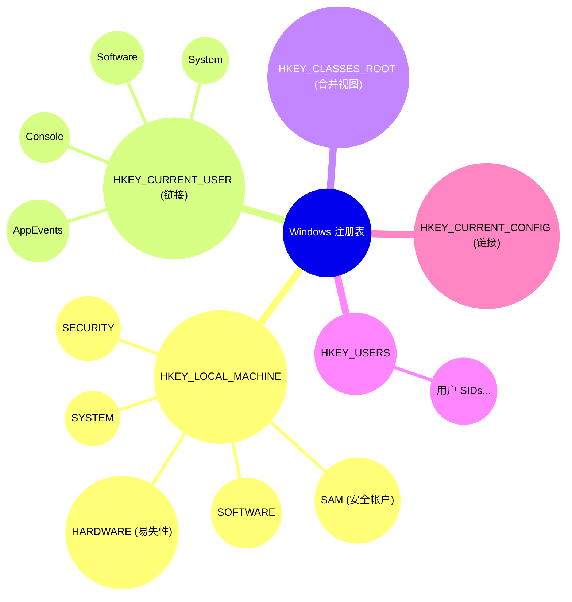
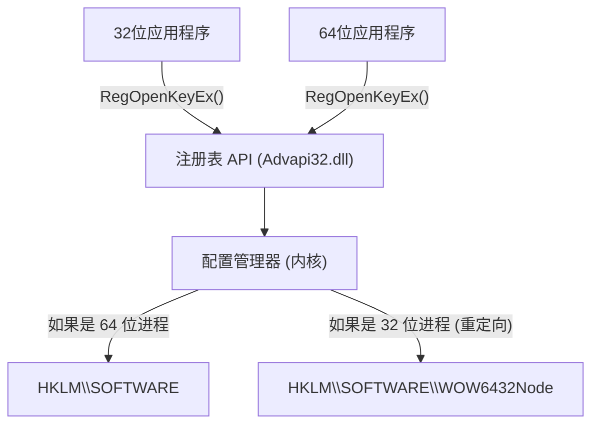
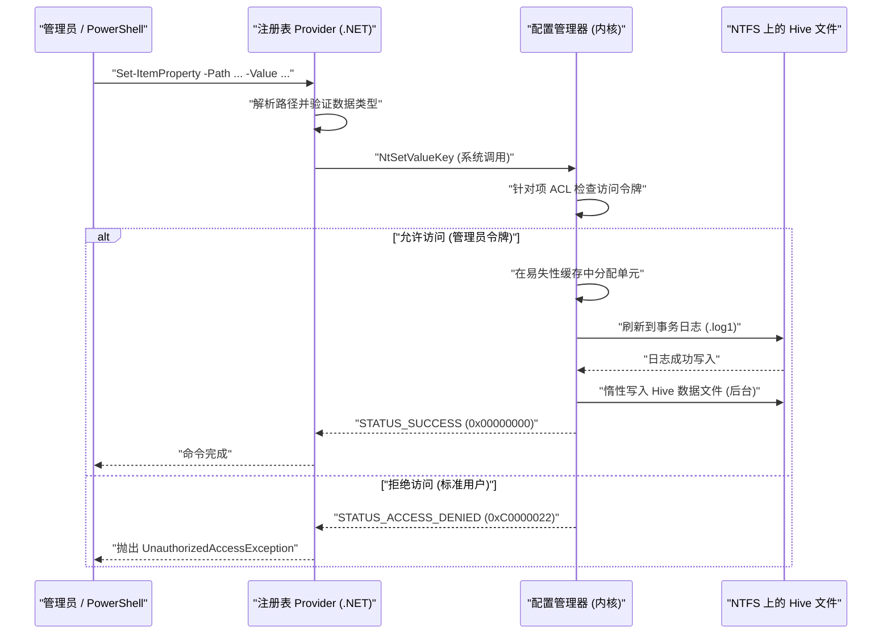

# Windows注册表基础知识与可编程的安全编辑方法

在Windows操作系统中，“注册表（Registry）”是一个巨大的分层数据库，用于存储系统和应用程序的各种设置。本文将非常详细地讲解Windows注册表的基础架构，以及如何使用PowerShell和C#对其进行可编程且安全的注册表编辑方法。

## 1. 简介：Windows注册表的历史与演变

在早期的Windows版本（Windows 3.x时代）中，系统和应用程序的设置主要保存在`.ini`（初始化文件）中。然而，随着每个应用程序产生无数的INI文件并散落在系统各处，管理变得极其繁琐。此外，由于INI文件基于纯文本，难以保存二进制数据，也不存在访问控制（安全）机制。文件的解析速度也很慢，不适合保存大规模设置。

为了从根本上解决这些问题，自Windows NT和Windows 95起，正式采用了“注册表”作为中央集权的设置数据库。注册表是一个分层数据库，提供强类型、对二进制数据的支持以及基于访问控制列表（ACL）的强大安全功能。由此，从操作系统的内核到用户空间的应用程序，所有组件都可以通过统一的接口（Win32 API中的`Reg*`函数族）来读写设置。

直到现代的Windows 11，注册表依然作为操作系统的核心在运作。从硬件配置、设备驱动程序的加载顺序、用户的桌面环境，到已安装软件的列表，系统运行所需的任何元数据都集中在注册表之中。

## 2. 架构深层：注册表配置单元（Hive）的实体与内存映射

虽然注册表在逻辑上看起来是一个巨大的树状结构，但在物理上，它被分割为多个被称为“配置单元（Hive）”的文件保存在磁盘上。这种设计将整个系统的设置与用户特有的设置分离开来，从而实现了高效的读取。

主要的配置文件通常位于 `%SystemRoot%\System32\config` 目录下。
- `SYSTEM`：操作系统启动所需的关键设置（驱动程序、服务、引导配置等）。
- `SOFTWARE`：已安装软件的系统级设置。大多数第三方应用程序的设置都在这里。
- `SAM`：安全帐户管理器（Security Accounts Manager，本地用户帐户和密码哈希）。
- `SECURITY`：本地安全策略和权限分配。
- `DEFAULT`：默认用户配置文件（创建新用户时的模板）。

用户特有的配置文件作为隐藏文件存在于用户的配置文件目录下（例如：`C:\Users\Username`）。
- `NTUSER.DAT`：该用户的基本设置（HKCU的大部分内容）。
- `UsrClass.dat`：该用户的文件扩展名关联设置（位于 `AppData\Local\Microsoft\Windows` 内）。

在操作系统启动时，这些文件会被内核的“配置管理器（Configuration Manager，CM）”映射到内核分页池内存中。配置管理器是负责处理注册表读写请求的内核模式组件。

值得一提的是，并非所有的注册表数据都存在于磁盘上。例如，`HARDWARE` 配置文件是易失性的（Volatile），完全不会保存在磁盘文件上。每次操作系统启动，并且即插即用（PnP）管理器检测到硬件时，它都会在内存中动态重建。

此外，为了提高注册表的可靠性，最新版本的Windows实现了事务日志记录。对配置文件的更改不会直接写入数据文件，而是首先记录在事务日志（`.log1`, `.log2`）中。这防止了写入过程中意外断电或系统崩溃导致的数据损坏（Corruption），从而以接近ACID特性的方式保证了数据库的完整性。

## 3. 注册表键与值的层级结构

注册表的层级结构与文件系统非常相似。根节点被称为“根键”或“配置单元（Hive）”，其下包含“项（Key）”、“子项（Subkey）”以及作为数据实体的“值（Value）”。可以简单地将项理解为目录，将值理解为文件，这样更容易理解。

主要的根键分为以下5个：

1. **HKEY_LOCAL_MACHINE (HKLM)**：存储适用于整个计算机（所有用户）的系统设置和软件设置。修改需要管理员权限。
2. **HKEY_CURRENT_USER (HKCU)**：存储当前登录用户专有的设置。事实上，它并不是一个独立的数据库，而仅仅是指向 `HKEY_USERS` 下相应用户的SID（安全标识符）项的符号链接（别名）。
3. **HKEY_CLASSES_ROOT (HKCR)**：存储文件扩展名的关联、COM（组件对象模型）类的注册信息以及Shell扩展。这个项比较特殊，它是配置管理器将 `HKLM\SOFTWARE\Classes`（系统全局）和 `HKCU\Software\Classes`（当前用户）合并后显示的一个虚拟视图。如果存在冲突，优先使用用户专有的设置（HKCU）。
4. **HKEY_USERS (HKU)**：存储系统上所有用户配置文件（当前已加载到内存中的部分）的设置。按基于SID的层次结构排列。
5. **HKEY_CURRENT_CONFIG (HKCC)**：关于当前硬件配置文件的设置。其实体是指向 `HKLM\SYSTEM\CurrentControlSet\Hardware Profiles\Current` 的链接。

如果将这种复杂的层级结构与链接关系可视化，如下所示：



## 4. 注册表数据类型（详细解说）

注册表的“值”都定义了严格的数据类型。在以编程方式操作注册表时，必须正确理解这些类型并使用合适的类型写入数据。如果以错误的类型写入，会导致应用程序抛出异常，或导致操作系统功能停止工作。

- **REG_SZ (字符串值)**：最常见的数据类型。存储以NULL结尾的Unicode字符串（UTF-16LE）。用于文件路径、URL、UI的显示名称等。
- **REG_DWORD (32位整数值)**：32位（4字节）无符号整数值。经常用于布尔值（0=禁用，1=启用）、以毫秒为单位的超时时间或错误代码的设置等。由于Windows是小端（Little Endian）架构，在磁盘上会从低位字节开始依次保存（例如：0x12345678 会保存为 `78 56 34 12`）。
- **REG_QWORD (64位整数值)**：64位（8字节）整数值。随着64位架构的普及，用于保存巨大的数值（如磁盘配额或大容量内存的大小指定）以及指针大小的设置。
- **REG_MULTI_SZ (多字符串值)**：连续存储多个以NULL结尾的字符串，最后再放置一个空的NULL结尾字符（双NULL）作为结束标志的格式。适合保存数组类型的数据，如IP地址列表、有依赖关系的服务列表、绑定顺序等。
- **REG_EXPAND_SZ (可扩充字符串值)**：包含类似 `%USERPROFILE%` 或 `%SystemRoot%` 这种未展开的环境变量字符串的特殊字符串类型。当应用程序通过 `RegQueryValueEx` API 读取，或者调用 `ExpandEnvironmentStrings` API 时，操作系统会将其动态展开为实际的绝对路径。
- **REG_BINARY (二进制值)**：任意原始二进制数据流。存储加密的密码（如 LSA Secrets）、数字证书、以及应用程序特定的复杂结构体或序列化数据。
- **REG_NONE**：类型未定义的数据。非常罕见，但有时用于加密密钥的保留区域等。
- **REG_RESOURCE_LIST** / **REG_FULL_RESOURCE_DESCRIPTOR**：由设备驱动程序用于记录硬件资源（IRQ、I/O端口、DMA通道）分配信息的内核专用高级类型。

## 5. 操作系统中注册表的数学模型与性能

因为注册表直接影响操作系统的性能（尤其是启动时间和进程初始化速度），因此在其内部，采用了名为“单元索引（Cell Index）”的类似于B-Tree（B树）的高级数据结构进行优化。

### 搜索的时间复杂度 (Time Complexity)
在注册表中搜索特定项（路径）时的时间复杂度 $T_{\text{search}}$，取决于树的深度以及每一层级中节点的数量。当搜索深度为 $d$ 的子项（例：如果是 `A\B\C\D` 则 $d=4$）时，理论上时间复杂度可以建模如下：

$$
T_{\text{search}}(d, L) = \sum_{i=1}^{d} O(\log(C_i) \cdot L_i)
$$

在这里，$C_i$ 是深度 $i$ 处子节点（子项或值）的数量，$L_i$ 是进行比较的字符串长度（字符数）。在作为注册表实体的配置文件内部，子项列表是作为按名称的哈希值或字母顺序排序的索引来维护的。因此，它可以进行二分查找 $O(\log(C_i))$，而不是简单的线性查找 $O(C_i)$，即使一个项下有几万个子项，也能实现极快的访问速度。

### 存储占用 (Space Complexity)
注册表的整体大小（在物理磁盘上占据的空间），是各配置文件大小的总和。

$$
\text{Size}_{\text{Total}} = \sum_{h \in \text{Hives}} \left( N_{h} \times S_{\text{key\_metadata}} + \sum_{v \in h} S_{\text{value}}(v) \right) + S_{\text{overhead}}
$$

$N_h$ 是配置文件 $h$ 中的项数量，$S_{\text{key\_metadata}}$ 是每个项的元数据（最后写入时间戳、指向安全描述符的指针、指向父项的指针等）的大小，$S_{\text{value}}(v)$ 是值 $v$ 的有效负载大小。此外还包括事务日志以及不再需要的空单元（碎片）所产生的开销 $S_{\text{overhead}}$。如果长期放置注册表中的无用数据（如未能完全卸载的软件残骸），会导致此空间占用增大，挤压操作系统的分页池内存，并引起性能下降。

## 6. 威胁系统稳健性的手动编辑风险与损坏概率

使用注册表编辑器（`regedit.exe`）进行手动编辑应该被视为系统管理的最后手段。注册表并没有像普通文档编辑器那样内置“撤销（Undo）”功能，任何值的修改或项的删除都会立刻通过配置管理器反映到系统中。

特别是，如果不小心修改或删除了对系统启动至关重要的关键项（例如：`HKLM\SYSTEM\CurrentControlSet\Services` 下的磁盘控制器驱动程序设置，或 `HKLM\SOFTWARE\Microsoft\Windows NT\CurrentVersion\Winlogon` 中的 `Userinit` 值等），哪怕只错了一个字符，也有导致操作系统发生蓝屏（BSoD）无法启动，或者卡在登录界面无法前进（黑屏）的致命风险。

### 损坏概率的数学模型
让我们考虑一下当随意修改或删除注册表中的项时，系统发生故障的概率。假设系统正常运行不可或缺的关键项集合为 $C$，其总数为 $N_c = |C|$。将注册表整体项的总数设为 $N_{\text{total}}$。
当随机删除或破坏 $k$ 个项时，至少有一个关键项损坏的概率 $P_{\text{failure}}$，可通过无放回抽样（Sampling without replacement）的概率计算表示如下：

$$
P_{\text{failure}} = 1 - \frac{\binom{N_{\text{total}} - N_c}{k}}{\binom{N_{\text{total}}}{k}} = 1 - \prod_{i=0}^{k-1} \left( 1 - \frac{N_c}{N_{\text{total}} - i} \right)
$$

虽然注册表总项数 $N_{\text{total}}$ 达几十万到上百万个级别，但 $N_c$ 也存在数万个的数量级。在数学上，即便只是随意的操作，只要 $k$ 增加，故障概率就会急剧上升。况且在现实的手动操作中，用户并不是“随机”编辑，而是有意识地（如参考教程网站等）操作直接关系到系统设置和软件运行的部分，因此触碰到关键项的概率远比上述理论值高得多。

## 7. 注册表的虚拟化与 WOW64 架构

为了保持旧版应用程序的兼容性，Windows对注册表访问实现了几种高级的“虚拟化（重定向）”机制。如果不了解这一点而进行编程，将导致严重的Bug。

### UAC 注册表虚拟化 (Registry Virtualization)
自 Windows Vista 开始引入了用户帐户控制（UAC）。当在 Windows XP 时代开发的老应用程序（以标准用户权限运行）试图向本应需要管理员权限的 `HKLM\SOFTWARE` 等受保护的项写入数据时，为了防止程序因访问被拒绝（Access Denied）错误而崩溃，Windows 会悄悄将这些写入操作重定向到用户配置文件内的虚拟存储 `HKCU\Software\Classes\VirtualStore\MACHINE\SOFTWARE` 中。在读取时，也会将原始位置和虚拟存储的内容合并后返回。这样一来，应用程序不会察觉到错误，并能继续正常运行。
但是，如果你要开发一个通过编程方式修改全系统设置的工具，必须在清单文件（Manifest file）中指定 `<requestedExecutionLevel level="requireAdministrator" />`，并禁用此虚拟化。

### WOW64 (Windows 32-bit on Windows 64-bit) 重定向
在64位版Windows（目前的主流）上运行旧的32位应用程序时，为了防止32位应用错误地覆盖64位原生系统设置，或者加载不兼容的64位DLL，特定的注册表项会被自动分离和重定向。
例如，如果32位应用尝试访问 `HKLM\SOFTWARE\Vendor\App`，操作系统会透明地将其重定向到 `HKLM\SOFTWARE\WOW6432Node\Vendor\App`。


在通过PowerShell脚本或C#应用程序编辑注册表时，必须强烈意识到执行进程本身是32位还是64位的。否则就会引起“明明写入了设置，却在资源管理器里看不到（被写入了别的地方）”这种麻烦的问题。

## 8. 使用 PowerShell 进行可编程的安全编辑

为了将手动编辑注册表的风险降到最低，现代的最佳实践是使用 PowerShell 脚本将操作代码化（Infrastructure as Code），以确保自动化、可重复性和可测试性。PowerShell 具备“Registry Provider”，让你能使用与操作文件系统（如 C: 驱动器等）完全相同的 Cmdlet（如 `Get-ChildItem`，`Get-ItemProperty`，`New-Item` 等）来透明地操作注册表。

在 PowerShell 中，默认挂载了诸如 `HKLM:` 或 `HKCU:` 这样的专用 PSDrive（类似于驱动器盘符）。

### 基本的 CRUD 操作
```powershell
# 1. 存在确认 (Read)
$keyPath = "HKCU:\Software\MyCustomApp"
if (-Not (Test-Path -Path $keyPath)) {
    # 2. 创建新项 (Create)
    New-Item -Path "HKCU:\Software" -Name "MyCustomApp" -Force | Out-Null
    Write-Host "已创建项。"
}

# 3. 写入/更新值 (Update) - 作为 REG_DWORD 写入 1
Set-ItemProperty -Path $keyPath -Name "EnableDebug" -Value 1 -Type DWord

# 4. 读取值 (Read)
$debugFlag = (Get-ItemProperty -Path $keyPath).EnableDebug
Write-Host "当前的调试标志: $debugFlag"

# 5. 删除值 (Delete)
Remove-ItemProperty -Path $keyPath -Name "EnableDebug" -Force
```

### 实践案例1：开发环境自动设置（向环境变量中添加PATH）
下面这个脚本是在开发者搭建新Windows机器时，安全地将自定义工具目录追加到用户环境变量 `PATH` 的自动化示例。

```powershell
$envKey = "HKCU:\Environment"
$newPath = "C:\tools\bin"

# 读取当前的 PATH (抑制错误以安全地获取)
$currentPathInfo = Get-ItemProperty -Path $envKey -Name "Path" -ErrorAction SilentlyContinue
$currentPath = if ($currentPathInfo) { $currentPathInfo.Path } else { "" }

# 使用正则表达式检查是否已经包含
if ($currentPath -notmatch [regex]::Escape($newPath)) {
    # 如果末尾没有分号，则添加并连接
    if ($currentPath -and $currentPath -notmatch ";$") {
        $currentPath += ";"
    }
    $updatedPath = $currentPath + $newPath
    
    # 作为 REG_EXPAND_SZ 类型写入（很重要）
    Set-ItemProperty -Path $envKey -Name "Path" -Value $updatedPath -Type ExpandString
    Write-Host "已更新 PATH 环境变量: $newPath"
    
    # 通知正在运行的进程环境变量已更改 (WM_SETTINGCHANGE)
    # 这使得无需重启即可在新的资源管理器等中生效
    [Environment]::SetEnvironmentVariable("Path", $updatedPath, [EnvironmentVariableTarget]::User)
} else {
    Write-Host "PATH 已经添加过。"
}
```

### 实践案例2：向右键菜单中添加自定义操作
该脚本用于在右键点击特定文件或目录时，向弹出的右键菜单中添加“使用 My IDE 打开”的自定义选项。

```powershell
# 右键点击目录背景（空白处）时的菜单
$menuPath = "HKCR:\Directory\Background\shell\OpenWithMyIDE"
$commandPath = "$menuPath\command"

try {
    # 创建菜单项的父项
    New-Item -Path $menuPath -Force -ErrorAction Stop | Out-Null
    
    # 设置 (默认) 值的显示名称
    Set-ItemProperty -Path $menuPath -Name "(default)" -Value "使用 My IDE 打开" -Type String
    
    # 设置图标 (可选)
    Set-ItemProperty -Path $menuPath -Name "Icon" -Value "C:\Program Files\MyIDE\ide.exe,0" -Type String

    # 创建 command 子项并设定执行的命令行
    # %V 是会被展开为当前目录路径的变量
    New-Item -Path $commandPath -Force -ErrorAction Stop | Out-Null
    Set-ItemProperty -Path $commandPath -Name "(default)" -Value "`"C:\Program Files\MyIDE\ide.exe`" `"%V`"" -Type String

    Write-Host "已添加右键菜单。"
} catch {
    Write-Error "修改注册表失败。请确认是否以管理员权限执行。错误: $_"
}
```

### 来自 PowerShell 的注册表访问 内部时序
下面展示了 PowerShell 脚本修改注册表时在操作系统内部的动作时序。



## 9. 利用 C# (.NET) 进行稳健的注册表访问

如果是从 .NET 应用程序（如 C#）访问注册表，需使用 `Microsoft.Win32.Registry` 类和 `RegistryKey` 类。
使用 C# 的最大优势在于：可以通过强大的异常处理（`try-catch`）来进行稳健的错误处理、拥有严格的类型检查，并且可以使用 `RegistryView` 枚举来显式指定读取 32位/64位 视图。

以下代码示例是在 64位 操作系统环境下，确保可靠地读写 64位 端的注册表（避开 WOW6432Node 重定向）的 C# 代码。

```csharp
using System;
using System.Security;
using Microsoft.Win32;

class RegistryEditor
{
    static void Main()
    {
        // HKLM 下的路径 (需要管理员权限)
        string keyPath = @"SOFTWARE\MyEnterpriseApp\Settings";

        // 指定 RegistryView.Registry64 来打开 64位 原生视图
        // 使用 using 语句，确保可靠地 Dispose 注册表项的句柄（非托管资源）
        try
        {
            using (RegistryKey baseKey = RegistryKey.OpenBaseKey(RegistryHive.LocalMachine, RegistryView.Registry64))
            {
                // 以写入权限 (writable: true) 打开项。如果不存在则创建。
                using (RegistryKey subKey = baseKey.CreateSubKey(keyPath, writable: true))
                {
                    if (subKey != null)
                    {
                        // 作为 REG_DWORD 写入值
                        subKey.SetValue("MaxConnections", 100, RegistryValueKind.DWord);
                        
                        // 作为 REG_SZ 写入值
                        subKey.SetValue("ApiEndpoint", "https://api.example.com", RegistryValueKind.String);
                        
                        // 作为 REG_BINARY 写入字节数组
                        byte[] secretData = { 0x01, 0x02, 0x0A, 0xFF };
                        subKey.SetValue("BinarySecret", secretData, RegistryValueKind.Binary);
                        
                        Console.WriteLine("注册表写入成功。");
                    }
                }
            }
        }
        catch (UnauthorizedAccessException ex)
        {
            // 在未以管理员身份运行时常发生此错误
            Console.WriteLine($"权限错误：请以“管理员身份运行”该程序。详细信息：{ex.Message}");
        }
        catch (SecurityException ex)
        {
            // 被 .NET 的代码访问安全 (CAS) 阻挡时
            Console.WriteLine($"安全异常：{ex.Message}");
        }
        catch (Exception ex)
        {
            // 其他意外的 IO 错误等
            Console.WriteLine($"意外错误：{ex.Message}");
        }
    }
}
```

打开注册表项时操作系统返回的“句柄（Handle）”，是会消耗内存和系统资源的非托管资源。因此，在 C# 编程中，无论是使用 `using` 代码块，还是在 `finally` 块中显式调用 `.Dispose()`（或者 `.Close()`）以确实防止句柄泄露，这都是一条铁律。

## 10. 注册表的备份与恢复方法

哪怕是基于脚本或程序的自动化处理，在做出关键修改前先进行备份都是绝对不可或缺的。

### 通过 .reg 文件的备份与导入
最经典也是最通用的方法是导出为 `.reg` 文件。这种文件是带有特有格式的基于文本的文件，其结构如下：

```text
Windows Registry Editor Version 5.00

[HKEY_CURRENT_USER\Software\MyCustomApp]
"EnableDebug"=dword:00000001
"ApiEndpoint"="https://api.example.com"
"BinaryData"=hex:01,02,0a,ff
```
*注：二进制数据以 `hex:` 后跟逗号分隔的十六进制数字表示。*

可以使用命令行工具 `reg.exe` 在批处理脚本中实现自动备份。
```cmd
REM 备份指定的项 (其子项也会被递归导出)
reg export HKLM\SOFTWARE\MyEnterpriseApp C:\backup\myapp_backup.reg /y

REM 恢复备份
reg import C:\backup\myapp_backup.reg
```

### 利用 PowerShell 实现更高级的备份方法
不仅仅是作为纯文本，还可以利用 PowerShell 的面向对象特性，将注册表对象导出并以 XML 格式 (CliXML) 保存。通过这种方式，恢复时就无需依赖对字符串的解析，而是可以在保持类型信息的同时进行处理。

```powershell
# 提取备份 (将属性保存为 XML)
Get-ItemProperty -Path "HKCU:\Software\MyCustomApp" | Export-Clixml -Path "C:\backup\reg_backup.xml"

# 恢复的概念
$backup = Import-Clixml -Path "C:\backup\reg_backup.xml"
# 因为 $backup 里存放了还原出来的自定义 PSObject，
# 所以可以通过遍历其属性并使用 Set-ItemProperty 重新应用的逻辑来实现恢复。
```

## 11. 使用 Sysinternals Process Monitor (Procmon) 进行故障排除

当你不知道程序正在往注册表的哪里写入内容，或者要查找导致“Access Denied”的原因时，Microsoft 免费提供的 Sysinternals 工具 **Process Monitor (Procmon)** 是一个非常强大的选择。
使用 Procmon 可以实时捕获操作系统上发生的所有注册表 API 调用（如 `RegOpenKey`, `RegQueryValue`, `RegSetValue` 等），并通过如下的高级过滤条件来进行故障排除。

- `Process Name` is `powershell.exe`
- `Operation` begins with `Reg`
- `Result` is `ACCESS DENIED`

借此，你能够在一瞬间定位出是哪个项的 ACL 设置缺失，或者是程序被错误地重定向到了 WOW6432Node。

## 12. 安全性与最佳实践

最后，我们来总结在处理注册表时的重要设计原则和最佳实践。

1. **贯彻最小权限原则**：应用程序和脚本的设置，应尽可能保存在 `HKCU`（当前用户）内的 `Software` 项下。向 `HKLM` 写入会要求 UAC 进行管理员权限提升，这将增加安全攻击面（Attack Surface）并损害用户体验。
2. **启用审核 (Auditing)**：对于对安全性至关重要的项（例如：控制自启动的 `Run` 项，或是服务的设置项等），应配置 SACL（系统访问控制列表），并设置当有人修改或删除值时，会被记录（审核）在 Windows 事件查看器的“安全日志”中。
3. **应对事务功能弃用**：过去在 Windows Vista 中引入的基于“内核事务管理器 (KTM)”的注册表事务功能 (TxR)，自 Windows 10 起已被标记为弃用 (Deprecated)。因此，需要在应用程序端自行实现备份和回滚机制（例如在修改之前将原有的值读取并保留在内存中）。
4. **注意与组策略 (GPO) 的冲突**：`HKLM\SOFTWARE\Policies` 和 `HKCU\Software\Policies` 区域是应由 Active Directory 组策略进行统一管理的领域。如果通过脚本直接修改这些项，在下一次组策略后台更新周期（通常是每 90 到 120 分钟间隔一次）到来时，它们会被域控制器的设置强制覆盖，导致设置无法持久化。

## 总结

Windows注册表是一个强大且复杂的基础系统，它统一管理操作系统的各种行为以及应用程序的设置。缺乏秩序的手动修改伴随着极高的系统损坏风险，这一点在数学上也已得到证明。因此，利用 PowerShell 或 C# 等可编程手段，遵循 Infrastructure as Code 原则，以一种安全、可测试并具有重现性的方式进行配置管理，在现代的系统管理和开发中是不可或缺的。希望你能运用在本文中所讲解的深度架构理解和实现模式，去构建一个更加坚固且安全的 Windows 环境。
