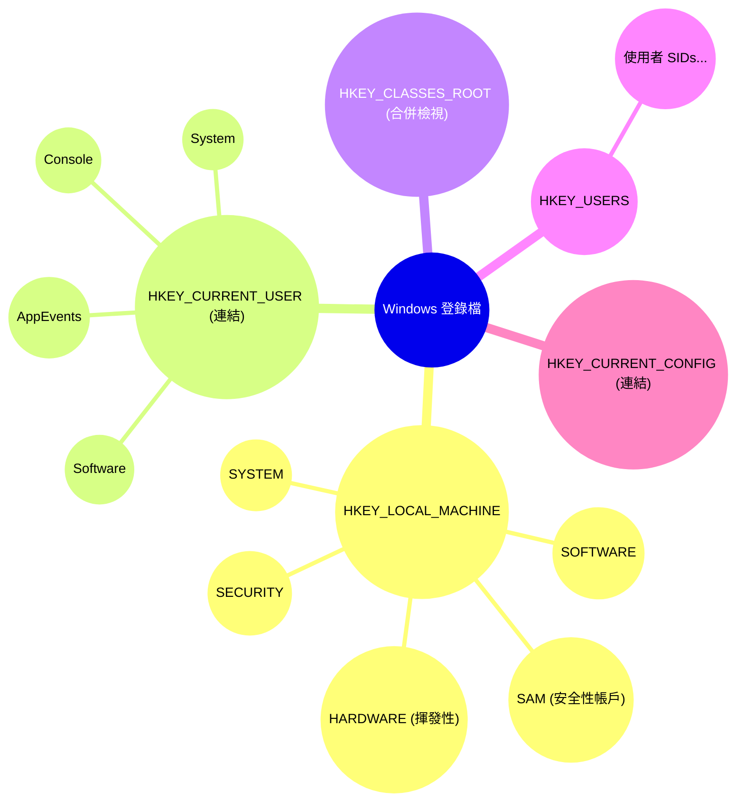
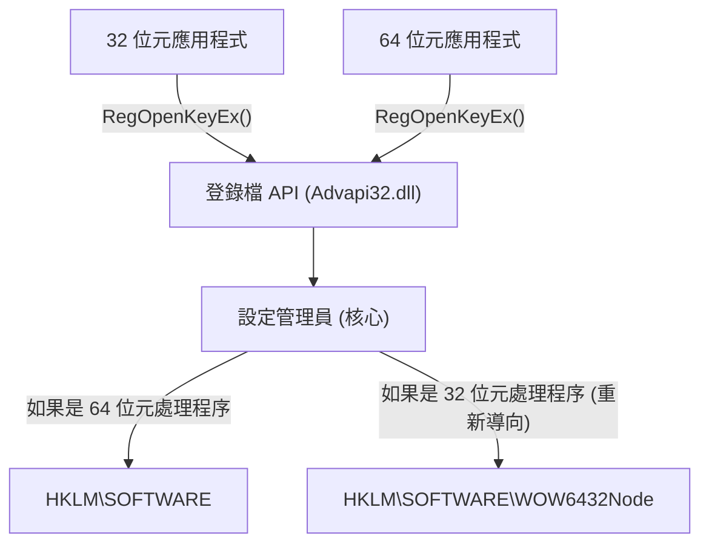
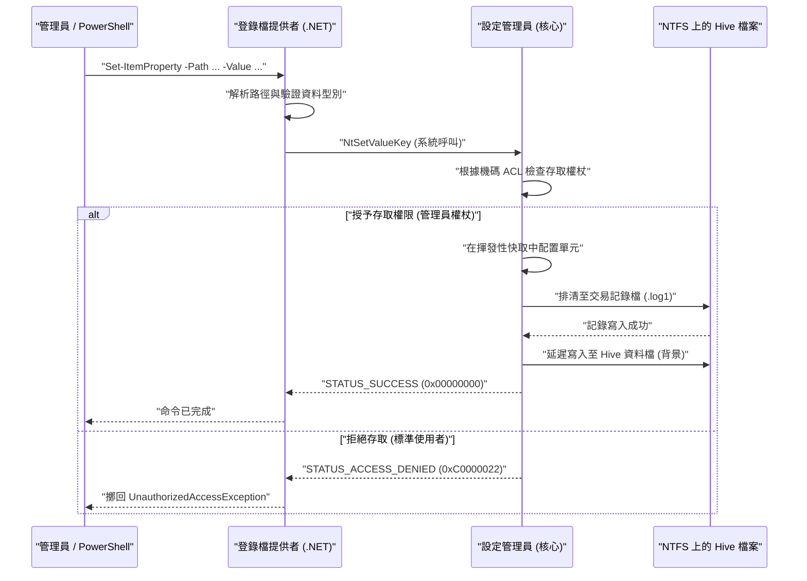

# Windows 登錄檔的基礎知識與可程式化之安全編輯方法

在 Windows 作業系統中，「登錄檔（Registry）」是一個用來儲存系統和應用程式各種設定的龐大階層式資料庫。本文將從 Windows 登錄檔的基礎架構開始，非常詳細地解說如何使用 PowerShell 和 C# 進行可程式化且安全的登錄檔編輯方法。

## 1. 簡介：Windows 登錄檔的歷史與演進

在 Windows 的早期版本（Windows 3.x 時代）中，系統與應用程式的設定主要儲存在 `.ini`（初始化檔案）裡。然而，隨著每個應用程式的無數 INI 檔案散佈在整個系統中，管理變得極度繁雜。此外，由於 INI 檔案是基於純文字格式，難以儲存二進位資料，且不存在存取控制（安全性）的機制。檔案的解析速度也很慢，不適合用來儲存大規模的設定。

為了根本解決這些問題，從 Windows NT 和 Windows 95 開始，正式採用了「登錄檔」作為集中式的設定資料庫。登錄檔是一個階層化的資料庫，提供強型別、二進位資料的支援，以及透過存取控制清單（ACL）達成的堅固安全性功能。這使得從作業系統核心到使用者空間的應用程式等所有元件，都能透過統一的介面（Win32 API 的 `Reg*` 函式群）來讀寫設定。

一直到現代的 Windows 11，登錄檔仍然持續作為作業系統的核心在運作。硬體配置、裝置驅動程式的載入順序、使用者的桌面環境、已安裝軟體的清單等，系統運作所需的所有中繼資料都集中在登錄檔中。

## 2. 架構深層：登錄檔 Hive 的實體與記憶體對應

登錄檔在邏輯上雖然看起來是一個巨大的樹狀結構，但在實體上是被分割成多個稱為「Hive」的檔案並儲存在磁碟上。這樣可以將整個系統的設定與使用者特定的設定分離，實現高效的讀取。

主要的 Hive 檔案通常存在於 `%SystemRoot%\System32\config` 目錄中。
- `SYSTEM`: 作業系統啟動所需的重要設定（驅動程式、服務、開機設定等）。
- `SOFTWARE`: 已安裝軟體之全系統設定。第三方應用程式的設定大多存放在這裡。
- `SAM`: 安全性帳戶管理員 (Security Accounts Manager)（本機使用者帳戶與密碼雜湊）。
- `SECURITY`: 本機安全性原則與權限指派。
- `DEFAULT`: 預設使用者的設定檔（建立新使用者時的範本）。

使用者個別的 Hive 檔案則作為隱藏檔案存在於使用者的設定檔目錄中（例如：`C:\Users\Username`）。
- `NTUSER.DAT`: 該使用者的基本設定（HKCU 的大部分）。
- `UsrClass.dat`: 該使用者的檔案副檔名關聯設定（存在於 `AppData\Local\Microsoft\Windows` 中）。

這些檔案會在作業系統啟動時，由核心的「設定管理員 (Configuration Manager, CM)」對應到核心分頁集區記憶體中。設定管理員是處理登錄檔讀寫要求的核心模式元件。

值得一提的是，並非所有登錄檔資料都存在於磁碟上。例如，`HARDWARE` Hive 是揮發性（Volatile）的，完全不會儲存在磁碟上的檔案中。每次作業系統啟動，隨插即用（PnP）管理員偵測到硬體時，就會在記憶體中動態重建。

此外，為了提高登錄檔的可靠性，最新的 Windows 實作了交易記錄（Transaction Logging）。對 Hive 檔案的變更不會直接寫入資料檔，而是會先記錄在交易記錄檔（`.log1`, `.log2`）中。這可以防止在寫入過程中發生意外斷電或系統當機時的資料損毀（Corruption），並以接近 ACID 特性的方式確保資料庫的完整性。

## 3. 登錄檔機碼與值的階層結構

登錄檔具有非常類似於檔案系統的階層結構。作為根節點的部分稱為「根機碼（Root Key）」或「Hive」，其下方會儲存「機碼（Key）」、「子機碼（Subkey）」，以及作為資料實體的「值（Value）」。可以將機碼想像成目錄，值想像成檔案，這樣會更容易理解。

主要的根機碼分為以下 5 種：

1. **HKEY_LOCAL_MACHINE (HKLM)**: 儲存適用於整部電腦（所有使用者）的系統設定與軟體設定。變更需要管理員權限。
2. **HKEY_CURRENT_USER (HKCU)**: 儲存目前登入使用者的專屬設定。事實上，這並不是一個獨立的資料庫，而只是指向 `HKEY_USERS` 下方對應使用者 SID（安全性識別碼）機碼的符號連結（別名）。
3. **HKEY_CLASSES_ROOT (HKCR)**: 儲存檔案副檔名關聯、COM（元件物件模型）類別的登錄資訊，以及 Shell 擴充功能。這個機碼很特殊，是由設定管理員將 `HKLM\SOFTWARE\Classes`（全系統）與 `HKCU\Software\Classes`（目前使用者）合併後顯示的虛擬檢視。若有衝突，則優先使用使用者特定的設定（HKCU）。
4. **HKEY_USERS (HKU)**: 儲存系統上所有使用者設定檔（目前已載入記憶體中者）的設定。它是基於 SID 進行階層化。
5. **HKEY_CURRENT_CONFIG (HKCC)**: 目前硬體設定檔的相關設定。實體是指向 `HKLM\SYSTEM\CurrentControlSet\Hardware Profiles\Current` 的連結。

將這個複雜的階層結構與連結關係視覺化如下：



## 4. 登錄檔的資料型別（詳細解說）

登錄檔的「值」各自都定義了嚴格的資料型別。當以程式化的方式操作登錄檔時，正確理解這些型別並以適當的型別寫入資料是不可或缺的。如果以錯誤的型別寫入，可能會導致應用程式擲回例外狀況，或成為作業系統功能停止運作的原因。

- **REG_SZ (字串值)**: 最常見的資料型別。儲存以 NULL 結尾的 Unicode 字串（UTF-16LE）。用於檔案路徑、URL、UI 顯示名稱等。
- **REG_DWORD (32 位元整數值)**: 32 位元（4 個位元組）的無號整數值。頻繁用於布林值（0=停用、1=啟用）、以毫秒為單位的逾時值、錯誤碼設定等。由於 Windows 是 Little-Endian 架構，因此在磁碟上會從低位元組開始依序儲存（例如：0x12345678 會儲存為 `78 56 34 12`）。
- **REG_QWORD (64 位元整數值)**: 64 位元（8 個位元組）的整數值。隨著 64 位元架構的普及，用來儲存龐大的數值（如磁碟配額、大容量記憶體的大小指定等）或指標大小的設定。
- **REG_MULTI_SZ (多字串值)**: 連續儲存多個以 NULL 結尾的字串，並在最後再放置一個空的 NULL 結尾字元（雙 NULL）作為終止的形式。適合用來儲存陣列狀的資料，如 IP 位址清單、具相依性的服務清單、繫結順序等。
- **REG_EXPAND_SZ (可擴充字串值)**: 包含未展開之環境變數字串（例如 `%USERPROFILE%` 或 `%SystemRoot%`）的特殊字串型別。當應用程式透過 `RegQueryValueEx` API 讀取，或呼叫 `ExpandEnvironmentStrings` API 時，作業系統會動態將其展開為實際的絕對路徑。
- **REG_BINARY (二進位值)**: 任意的原始二進位資料流。會儲存加密過的密碼（如 LSA Secrets）、數位憑證、應用程式特定的複雜結構或序列化資料。
- **REG_NONE**: 未定義型別的資料。非常罕見，但會用於加密金鑰的保留區域等。
- **REG_RESOURCE_LIST** / **REG_FULL_RESOURCE_DESCRIPTOR**: 裝置驅動程式用來記錄硬體資源（IRQ、I/O 連接埠、DMA 通道）分配資訊的進階核心專用型別。

## 5. 作業系統中登錄檔的數學模型與效能

由於登錄檔直接關係到作業系統的效能（尤其是開機時間和處理程序的初始化速度），其內部使用了稱為「Cell Index」、類似 B-Tree（B 樹）的進階資料結構來進行最佳化。

### 搜尋的時間複雜度 (Time Complexity)
搜尋登錄檔內特定機碼（路徑）的時間複雜度 $T_{\text{search}}$ 取決於樹狀結構的深度以及各階層中的節點數量。探索深度為 $d$ 的子機碼（例如：`A\B\C\D` 則 $d=4$）時的複雜度，理論上可以建立如下的模型：

$$
T_{\text{search}}(d, L) = \sum_{i=1}^{d} O(\log(C_i) \cdot L_i)
$$

這裡的 $C_i$ 是深度 $i$ 的子節點（子機碼或值）數量，$L_i$ 是作為比較目標的字串長度（字元數）。在作為登錄檔實體的 Hive 檔案中，子機碼清單是以名稱的雜湊值或依字母順序排序的索引來保存。因此，它可以進行二元搜尋 $O(\log(C_i))$，而不是單純的線性搜尋 $O(C_i)$，即使一個機碼下存在數萬個子機碼，也能實現極快的存取速度。

### 儲存空間使用量 (Space Complexity)
登錄檔的整體大小（在實體磁碟上的占用量）是計算各 Hive 的總和。

$$
\text{Size}_{\text{Total}} = \sum_{h \in \text{Hives}} \left( N_{h} \times S_{\text{key\_metadata}} + \sum_{v \in h} S_{\text{value}}(v) \right) + S_{\text{overhead}}
$$

$N_h$ 是 Hive $h$ 內的機碼數量，$S_{\text{key\_metadata}}$ 是每個機碼的中繼資料（最後寫入的時間戳記、安全性描述元的指標、父機碼的指標等）大小，$S_{\text{value}}(v)$ 則是值 $v$ 的有效負載大小。其中還包含了交易記錄檔或不再需要的空白單元（碎片化）所造成的額外負擔 $S_{\text{overhead}}$。如果登錄檔中長期放置不需要的資料（例如未完全解除安裝的軟體殘骸），這個空間占用就會增加，可能會壓迫作業系統的分頁集區記憶體，從而導致效能下降。

## 6. 威脅系統穩固性的手動編輯風險與損毀機率

使用登錄編輯程式（`regedit.exe`）進行手工作業的編輯，應被視為系統管理的最後手段。登錄檔並沒有內建像一般文件編輯器那樣的「復原（Undo）」功能，對於值的變更或機碼的刪除，會立即透過設定管理員反映在系統上。

特別是對於系統啟動不可或缺的關鍵機碼（例如：`HKLM\SYSTEM\CurrentControlSet\Services` 底下的磁碟控制器驅動程式設定，或是 `HKLM\SOFTWARE\Microsoft\Windows NT\CurrentVersion\Winlogon` 的 `Userinit` 值等），就算只是一個字元誤編或誤刪，都存在著導致作業系統發生藍白畫面（BSoD）而無法開機，或是停留在登入畫面無法繼續前進（黑畫面）的致命風險。

### 損毀機率的數學模型
讓我們來考慮一下，如果隨機變更或刪除登錄檔內的機碼，發生系統故障的機率。假設讓系統正常運作不可或缺的關鍵機碼集合為 $C$，其總數為 $N_c = |C|$。登錄檔整體的機碼總數為 $N_{\text{total}}$。
若隨機刪除或破壞 $k$ 個機碼，則至少有一個關鍵機碼損毀的機率 $P_{\text{failure}}$，可透過取出不放回（Sampling without replacement）的機率計算表示如下：

$$
P_{\text{failure}} = 1 - \frac{\binom{N_{\text{total}} - N_c}{k}}{\binom{N_{\text{total}}}{k}} = 1 - \prod_{i=0}^{k-1} \left( 1 - \frac{N_c}{N_{\text{total}} - i} \right)
$$

登錄檔整體的機碼數量 $N_{\text{total}}$ 大約在數十萬到數百萬的數量級，而 $N_c$ 也存在數萬的數量級。在數學上，即使是隨機操作，只要 $k$ 增加，故障機率就會急遽上升。況且在現實的手動操作中，使用者並非「隨機」編輯，而是會刻意去操作與系統設定或軟體運作有直接關係的部位（例如看著教學網站進行），因此觸碰到關鍵機碼的機率會遠比上述的理論值還要高。

## 7. 登錄檔的虛擬化與 WOW64 架構

Windows 為了維持舊版應用程式的相容性，對登錄檔存取實作了幾種進階的「虛擬化（重新導向）」機制。如果在不了解這一點的情況下進行程式設計，將會成為引發重大 Bug 的原因。

### UAC 登錄檔虛擬化 (Registry Virtualization)
從 Windows Vista 開始，引入了使用者帳戶控制（UAC）。當 Windows XP 時代所開發的舊應用程式（以標準使用者權限執行），嘗試寫入原本需要管理員權限的 `HKLM\SOFTWARE` 等受保護機碼時，為了防止因存取遭拒（Access Denied）錯誤而當機，Windows 會悄悄地將該寫入操作重新導向至使用者設定檔內的虛擬存放區 `HKCU\Software\Classes\VirtualStore\MACHINE\SOFTWARE`。讀取時，也會將原始位置與虛擬存放區合併後傳回。如此一來，應用程式就能在未偵測到錯誤的情況下繼續正常運作。
但是，如果要開發以程式化方式變更整個系統設定的工具，就必須在資訊清單檔案（Manifest file）中指定 `<requestedExecutionLevel level="requireAdministrator" />` 來停用此虛擬化功能。

### WOW64 (Windows 32-bit on Windows 64-bit) 的重新導向
在 64 位元版的 Windows（目前的主流）上執行舊的 32 位元應用程式時，為了避免 32 位元應用程式不小心覆寫了 64 位元原生的系統設定，或載入不相容的 64 位元 DLL，特定的登錄機碼會被自動隔離並重新導向。
例如，當 32 位元應用程式嘗試存取 `HKLM\SOFTWARE\Vendor\App` 時，作業系統會透通地將其重新導向至 `HKLM\SOFTWARE\WOW6432Node\Vendor\App`。


從 PowerShell 指令碼或 C# 應用程式編輯登錄檔時，必須強烈意識到正在執行的處理程序本身是 32 位元還是 64 位元。否則，將會引發「明明已經寫入的設定卻在檔案總管中看不到（寫到其他地方去了）」這種棘手的問題。

## 8. 透過 PowerShell 進行可程式化的安全編輯

為了將手動編輯登錄檔的風險降到最低，現代的最佳實務是使用 PowerShell 指令碼將操作程式碼化（基礎架構即程式碼，Infrastructure as Code），以確保自動化、可重現性與可測試性。PowerShell 具備了「Registry Provider（登錄檔提供者）」，能以操作檔案系統（如 C: 磁碟機）完全相同的 Cmdlet（例如 `Get-ChildItem`、`Get-ItemProperty`、`New-Item` 等）來透通地操作登錄檔。

PowerShell 預設已經掛載了 `HKLM:` 與 `HKCU:` 這種專屬的 PSDrive（類似於磁碟機代號）。

### 基本的 CRUD 操作
```powershell
# 1. 確認存在與否 (Read)
$keyPath = "HKCU:\Software\MyCustomApp"
if (-Not (Test-Path -Path $keyPath)) {
    # 2. 建立新機碼 (Create)
    New-Item -Path "HKCU:\Software" -Name "MyCustomApp" -Force | Out-Null
    Write-Host "已建立機碼。"
}

# 3. 寫入或更新值 (Update) - 將 1 寫入為 REG_DWORD
Set-ItemProperty -Path $keyPath -Name "EnableDebug" -Value 1 -Type DWord

# 4. 讀取值 (Read)
$debugFlag = (Get-ItemProperty -Path $keyPath).EnableDebug
Write-Host "目前的偵錯旗標: $debugFlag"

# 5. 刪除值 (Delete)
Remove-ItemProperty -Path $keyPath -Name "EnableDebug" -Force
```

### 實作範例 1：開發環境的自動設定（新增環境變數 PATH）
以下的指令碼是一個自動化的範例，可讓開發人員在設定新的 Windows 機器時，將自訂工具的目錄安全地新增至使用者環境變數 `PATH` 中。

```powershell
$envKey = "HKCU:\Environment"
$newPath = "C:\tools\bin"

# 讀取目前的 PATH（抑制錯誤以確保安全取得）
$currentPathInfo = Get-ItemProperty -Path $envKey -Name "Path" -ErrorAction SilentlyContinue
$currentPath = if ($currentPathInfo) { $currentPathInfo.Path } else { "" }

# 使用正則表達式檢查是否已經包含
if ($currentPath -notmatch [regex]::Escape($newPath)) {
    # 如果結尾沒有分號則加上並進行合併
    if ($currentPath -and $currentPath -notmatch ";$") {
        $currentPath += ";"
    }
    $updatedPath = $currentPath + $newPath
    
    # 以 REG_EXPAND_SZ 型別寫入（重要）
    Set-ItemProperty -Path $envKey -Name "Path" -Value $updatedPath -Type ExpandString
    Write-Host "已更新 PATH 環境變數: $newPath"
    
    # 通知執行中的處理程序環境變數已變更 (WM_SETTINGCHANGE)
    # 如此一來，不需重新開機即可反映在新的檔案總管等程式中
    [Environment]::SetEnvironmentVariable("Path", $updatedPath, [EnvironmentVariableTarget]::User)
} else {
    Write-Host "PATH 已經新增過了。"
}
```

### 實作範例 2：在快顯功能表中新增自訂動作
這個指令碼會在右鍵點擊特定的檔案或目錄時的快顯功能表中，新增一個「使用 My IDE 開啟」的獨立項目。

```powershell
# 在目錄背景（空白處）點擊右鍵時的功能表
$menuPath = "HKCR:\Directory\Background\shell\OpenWithMyIDE"
$commandPath = "$menuPath\command"

try {
    # 建立功能表項目的父機碼
    New-Item -Path $menuPath -Force -ErrorAction Stop | Out-Null
    
    # 在 (default) 值中設定顯示名稱
    Set-ItemProperty -Path $menuPath -Name "(default)" -Value "使用 My IDE 開啟" -Type String
    
    # 設定圖示（非必要）
    Set-ItemProperty -Path $menuPath -Name "Icon" -Value "C:\Program Files\MyIDE\ide.exe,0" -Type String

    # 建立 command 子機碼，並設定要執行的命令列
    # %V 會展開為目前目錄的路徑變數
    New-Item -Path $commandPath -Force -ErrorAction Stop | Out-Null
    Set-ItemProperty -Path $commandPath -Name "(default)" -Value "`"C:\Program Files\MyIDE\ide.exe`" `"%V`"" -Type String

    Write-Host "已新增快顯功能表項目。"
} catch {
    Write-Error "登錄檔變更失敗。請確認是否以管理員權限執行。錯誤: $_"
}
```

### 從 PowerShell 存取登錄檔的內部序列
以下為 PowerShell 指令碼變更登錄檔時，在作業系統內部的運作序列。



## 9. 透過 C# (.NET) 進行堅固的登錄檔存取

從 .NET 應用程式（如 C# 等）存取登錄檔時，會使用 `Microsoft.Win32.Registry` 類別與 `RegistryKey` 類別。
使用 C# 的最大優點在於：可透過強大的例外處理（`try-catch`）進行堅固的錯誤處理、嚴格的型別檢查，以及能使用 `RegistryView` 列舉明確指定 32 位元/64 位元的檢視畫面。

以下是在 64 位元作業系統環境下，確實讀寫 64 位元端登錄檔（迴避 WOW6432Node 重新導向）的 C# 程式碼範例。

```csharp
using System;
using System.Security;
using Microsoft.Win32;

class RegistryEditor
{
    static void Main()
    {
        // HKLM 底下的路徑 (需要管理員權限)
        string keyPath = @"SOFTWARE\MyEnterpriseApp\Settings";

        // 指定 RegistryView.Registry64 來開啟 64 位元原生檢視
        // 使用 using 陳述式，確保登錄機碼的控制代碼 (非受控資源) 確實被 Dispose
        try
        {
            using (RegistryKey baseKey = RegistryKey.OpenBaseKey(RegistryHive.LocalMachine, RegistryView.Registry64))
            {
                // 以寫入權限 (writable: true) 開啟機碼。若不存在則建立。
                using (RegistryKey subKey = baseKey.CreateSubKey(keyPath, writable: true))
                {
                    if (subKey != null)
                    {
                        // 寫入為 REG_DWORD 值
                        subKey.SetValue("MaxConnections", 100, RegistryValueKind.DWord);
                        
                        // 寫入為 REG_SZ 值
                        subKey.SetValue("ApiEndpoint", "https://api.example.com", RegistryValueKind.String);
                        
                        // 寫入為 REG_BINARY 位元組陣列
                        byte[] secretData = { 0x01, 0x02, 0x0A, 0xFF };
                        subKey.SetValue("BinarySecret", secretData, RegistryValueKind.Binary);
                        
                        Console.WriteLine("成功寫入登錄檔。");
                    }
                }
            }
        }
        catch (UnauthorizedAccessException ex)
        {
            // 未以管理員身分執行時經常發生
            Console.WriteLine($"權限錯誤: 請「以系統管理員身分執行」程式。詳細: {ex.Message}");
        }
        catch (SecurityException ex)
        {
            // 被 .NET 的程式碼存取安全性 (CAS) 封鎖時
            Console.WriteLine($"安全性例外狀況: {ex.Message}");
        }
        catch (Exception ex)
        {
            // 其他非預期的 IO 錯誤等
            Console.WriteLine($"非預期的錯誤: {ex.Message}");
        }
    }
}
```

開啟登錄機碼時，由作業系統傳回的「控制代碼（Handle）」，是會消耗記憶體與系統資源的非受控資源。因此，在 C# 程式設計中，使用 `using` 區塊，或在 `finally` 區塊內明確地呼叫 `.Dispose()`（或 `.Close()`）以確保防範控制代碼外洩，是一項鐵則。

## 10. 登錄檔的備份與還原手法

即使是透過指令碼或程式進行的自動化，在進行關鍵變更之前，取得備份絕對是不可或缺的。

### 透過 .reg 檔案備份與匯入
最古典且通用的方法就是匯出為 `.reg` 檔案。這個檔案是具有獨特格式的文字型檔案，其結構如下：

```text
Windows Registry Editor Version 5.00

[HKEY_CURRENT_USER\Software\MyCustomApp]
"EnableDebug"=dword:00000001
"ApiEndpoint"="https://api.example.com"
"BinaryData"=hex:01,02,0a,ff
```
*註：二進位資料是以接在 `hex:` 後面、以逗號分隔的 16 進位數來表示。*

您可以使用命令列工具 `reg.exe`，在批次指令碼內實作自動備份。
```cmd
REM 備份指定的機碼（也會遞迴匯出子機碼）
reg export HKLM\SOFTWARE\MyEnterpriseApp C:\backup\myapp_backup.reg /y

REM 還原備份
reg import C:\backup\myapp_backup.reg
```

### 利用 PowerShell 的進階備份手法
不僅僅是作為文字，我們還可以活用 PowerShell 的物件導向特性，將登錄檔的物件匯出並儲存為 XML 格式（CliXML）。這樣一來，在還原時就不必依賴字串的解析，並能在維持型別資訊的情況下進行處理。

```powershell
# 取得備份（將屬性儲存為 XML）
Get-ItemProperty -Path "HKCU:\Software\MyCustomApp" | Export-Clixml -Path "C:\backup\reg_backup.xml"

# 還原的概念
$backup = Import-Clixml -Path "C:\backup\reg_backup.xml"
# 由於 $backup 內儲存了已還原的自訂 PSObject，
# 因此可透過迴圈讀取其屬性，並編寫使用 Set-ItemProperty 重新套用的邏輯。
```

## 11. 使用 Sysinternals Process Monitor (Procmon) 進行疑難排解

若不清楚程式寫入了登錄檔的哪個地方，或者想尋找「Access Denied」的原因時，Microsoft 免費提供的 Sysinternals 工具 **Process Monitor (Procmon)** 非常強大。
使用 Procmon，可以即時擷取在作業系統上發生的所有登錄檔 API 呼叫（如 `RegOpenKey`、`RegQueryValue`、`RegSetValue` 等），並透過以下進階篩選功能進行疑難排解：

- `Process Name` is `powershell.exe`
- `Operation` begins with `Reg`
- `Result` is `ACCESS DENIED`

這樣一來，就能在瞬間找出是哪個機碼的 ACL 設定不足，或者是是否錯誤地重新導向到了 WOW6432Node。

## 12. 安全性與最佳實務

最後，總結在處理登錄檔時重要的設計原則與最佳實務。

1. **貫徹最低權限原則**：應用程式或指令碼的設定，應盡可能儲存在 `HKCU`（目前使用者）內的 `Software` 機碼底下。寫入 `HKLM` 會要求透過 UAC 提升至管理員權限，這將擴大安全性上的攻擊面（Attack Surface），並損害使用者體驗。
2. **啟用稽核 (Auditing)**：針對安全性上極其重要的機碼（例如：負責自動啟動的 `Run` 機碼，或服務設定的機碼等），應設定 SACL（System Access Control List，系統存取控制清單），以便在 Windows 事件檢視器的「安全性記錄」中，記錄（稽核）是誰在何時變更或刪除了值。
3. **因應交易功能的棄用**：過去在 Windows Vista 導入、利用「核心交易管理員 (KTM)」的登錄檔交易功能 (TxR)，自 Windows 10 起已標示為已被取代（Deprecated）。必須在應用程式端自行實作備份與復原機制（例如在變更前先讀取原始值並保留在記憶體中）。
4. **注意與群組原則 (GPO) 的衝突**：`HKLM\SOFTWARE\Policies` 和 `HKCU\Software\Policies` 區域，應交由 Active Directory 的群組原則統一管理。即使從指令碼直接改寫這些機碼，在下一次群組原則背景更新週期（通常每隔 90 到 120 分鐘）時，也會被網域控制站的設定強制覆寫，成為設定無法永久保留的原因。

## 總結

Windows 登錄檔是個強大且複雜的基礎系統，統整管理了作業系統的所有行為與應用程式設定。手動且無序的編輯將伴隨極高的系統損毀風險，這在數學上也是可以被證實的。因此，使用 PowerShell 和 C# 等可程式化的手段，遵循「基礎架構即程式碼 (Infrastructure as Code)」的原則，以安全、可測試且可重現的方式進行組態管理，在現代的系統管理與開發中是不可或缺的。請活用本文所解說的深層架構理解與實作模式，目標是建構出更堅固且安全的 Windows 環境。
