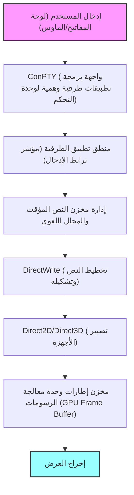
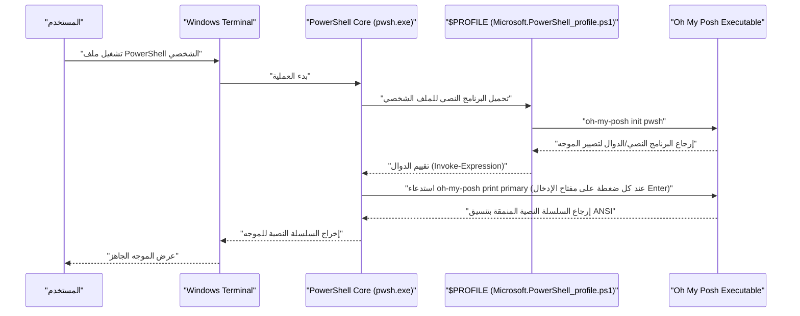

# مقدمة: لماذا نقوم بتخصيص Windows Terminal إلى أقصى حد؟

في تطوير البرمجيات الحديثة، تجاوز محاكي الطرفية (Terminal Emulator) كونه مجرد واجهة لإدخال وإخراج الأوامر، ليصبح "قمرة القيادة" الأهم التي تؤثر بشكل مباشر على إنتاجية المطور. في الماضي، كانت المعايير القياسية في بيئة Windows مثل "موجه الأوامر (cmd.exe)" ووحدة تحكم "Windows PowerShell" التقليدية (conhost.exe) تعاني من ضعف أداء الرسم، وقلة قابلية التخصيص، ودعم غير مكتمل لـ Unicode، مما جعلها تبدو ضعيفة جداً مقارنة ببيئات الطرفية المتطورة في Linux و macOS.

ومع ذلك، تغير هذا الوضع بشكل جذري مع ظهور "Windows Terminal" الذي تقود Microsoft تطويره كمشروع مفتوح المصدر. يقدم Windows Terminal تصييراً فائق السرعة للنصوص بفضل تسريع الأجهزة (Hardware Acceleration) المعتمد على DirectX، ودعماً أصلياً لواجهة المستخدم المبنية على علامات التبويب وتقسيم الألواح، وإمكانية إعداد اختصارات لوحة المفاتيح بحرية تامة، بالإضافة إلى ميزات إدارة الملفات الشخصية (Profiles) المتقدمة. Windows Terminal هو تطبيق قوي للغاية يلبي جميع متطلبات "الطرفية الحديثة" التي كان يبحث عنها المطورون حقاً.

في هذا المقال، سنقدم الدليل النهائي لتخصيص Windows Terminal للارتقاء به إلى بيئة "خارقة". لن نقتصر على تغييرات المظهر السطحية فحسب، بل سنقدم شرحاً من منظور تقني عميق وشامل يشمل النموذج الرياضي الذي يمثل أساس تصيير النصوص، والتركيب العميق لملف `settings.json`، وتقديم Oh My Posh في PowerShell، وإعداد Starship في بيئة WSL، وصولاً إلى التحليل النظري لتأخير الرسم (Rendering Latency).

نأمل أن يساعد هذا المقال القراء في بناء أفضل بيئة طرفية خاصة بهم وتحسين تجربة البرمجة اليومية بشكل كبير.

---

# 1. بنية تصيير Windows Terminal والنموذج الرياضي

السبب وراء الأداء السريع والسلس بشكل استثنائي لـ Windows Terminal هو وجود مسار تصيير (Rendering Pipeline) متطور يستفيد لأقصى حد من حزمة الرسومات الحديثة في Windows. كبديل لـ GDI (Graphics Device Interface) التقليدي، يعتمد Windows Terminal على تسريع الأجهزة المستند إلى وحدة معالجة الرسومات (GPU) باستخدام DirectWrite و DirectX (Direct2D/Direct3D).

فيما يلي رسم توضيحي لمسار تصيير الطرفية منذ إدخال المفتاح وحتى رسم الحرف على الشاشة.



## 1.1 تنعيم حواف البكسل الفرعي (Sub-pixel Antialiasing) للخطوط والهندسة

لضمان رؤية عالية لا ترهق العينين حتى خلال ساعات العمل الطويلة، تعتبر تقنية تنعيم الحواف (Antialiasing) ضرورية في تصيير النصوص. يدعم DirectWrite تقنية تنعيم حواف البكسل الفرعي المتقدمة التي تطبق تقنية ClearType.

تتكون كل بكسل في شاشات LCD (الكريستال السائل) العادية من ثلاثة بكسلات فرعية عمودية أو أفقية: R (الأحمر) و G (الأخضر) و B (الأزرق). تقنية تنعيم حواف البكسل الفرعي هي تقنية للتحكم في السطوع باستخدام دقة مكانية عالية تعادل 1/3 بكسل، بدلاً من وحدة البكسل الفردية (تنعيم الحواف بتدرج الرمادي).

لنفترض أن الدالة الثنائية التي تحدد المخطط التفصيلي المثالي لخط متجه هي $ f(x, y) $. إذا كان الإحداثي $ (x, y) $ داخل البكسل يقع داخل الحرف، فإن $ f(x, y) = 1 $، وإذا كان خارجه، فإن $ f(x, y) = 0 $.

يُحسب السطوع $ I_R $ لبكسل فرعي واحد (على سبيل المثال، البكسل الفرعي الأحمر) كتكامل لـ $ f(x, y) $ في المساحة المكانية $ S_R $ لذلك البكسل الفرعي، والتلاف (Convolution) مع دالة التصفية $ h(x, y) $ لتصحيح الخصائص الفيزيائية للشاشة والخصائص البصرية البشرية (مثل خصائص جاما).

$$
I_R = \iint_{S_R} f(x, y) \ast h(x, y) \,dx\,dy
$$

يتم احتساب اللونين الأخضر ($ I_G $) والأزرق ($ I_B $) بالمثل بناءً على مساحاتهما $ S_G, S_B $. في Windows Terminal، يتم إجراء عمليات التكامل والتلاف المعقدة هذه على مستوى البكسل الفرعي من خلال المعالجة المتوازية الفائقة باستخدام ذاكرة تخزين مؤقت للحروف تم إنشاؤها مسبقاً (نسيج أطلس Atlas Texture) ومظلل بكسل وحدة معالجة الرسومات (GPU Pixel Shader)، مما يتيح تصييراً جميلاً للنصوص دون أي تأخير ودون تشكيل عبء على وحدة المعالجة المركزية (CPU).

---

# 2. الفهم الكامل والضبط العميق لملف settings.json

يكمن جوهر تخصيص Windows Terminal في تعديل ملف الإعدادات `settings.json`. على الرغم من إمكانية تغيير العديد من العناصر من شاشة إعدادات واجهة المستخدم الرسومية (GUI)، فإن المعرفة المباشرة بتعديل JSON ضرورية للسعي وراء أقصى تخصيص وإدارة الإعدادات باستخدام أدوات التحكم في الإصدار مثل Git.

يتكون ملف الإعدادات بشكل أساسي من الأقسام الثلاثة الرئيسية التالية:

1. **`profiles`**: يحدد السلوك والمظهر (الخط، الخلفية، دليل البدء) لكل صدفة (PowerShell، cmd، WSL، Azure Cloud Shell، إلخ).
2. **`schemes`**: يحدد لوحات الألوان (Color Schemes) المكونة من 16 لوناً والمستخدمة داخل الطرفية.
3. **`actions`**: يحدد الإجراءات المخصصة (ارتباطات المفاتيح وتقسيم الألواح) التي يتم استدعاؤها من اختصارات لوحة المفاتيح أو لوحة الأوامر.

## 2.1 الهيكل الهرمي للملف الشخصي ونموذج الوراثة

في إعدادات الملف الشخصي، تتم كتابة الإعدادات المشتركة لجميع الملفات الشخصية في كائن `defaults`، وتكتب الإعدادات الفردية في الكائنات الموجودة داخل مصفوفة `list`. يعمل نموذج الوراثة هذا على إزالة التكرار في ملف الإعدادات وتحسين قابليته للصيانة.

```json
{
    "profiles": {
        "defaults": {
            "font": {
                "face": "CaskaydiaCove Nerd Font",
                "size": 11,
                "weight": "normal",
                "features": {
                    "calt": 1,
                    "liga": 1
                }
            },
            "useAcrylic": true,
            "acrylicOpacity": 0.85,
            "cursorShape": "filledBox",
            "cursorBlinking": true,
            "padding": "12, 12, 12, 12",
            "antialiasingMode": "cleartype",
            "historySize": 10000
        },
        "list": [
            {
                "guid": "{574e775e-4f2a-5b96-ac1e-a2962a402336}",
                "hidden": false,
                "name": "PowerShell 7",
                "source": "Windows.Terminal.PowershellCore",
                "colorScheme": "Tokyo Night",
                "backgroundImage": "C:\\Users\\Username\\Pictures\\Terminal\\cyberpunk_bg.png",
                "backgroundImageOpacity": 0.15,
                "backgroundImageStretchMode": "uniformToFill",
                "startingDirectory": "%USERPROFILE%\\Projects"
            },
            {
                "guid": "{2c4de342-38b7-51cf-b940-2309a097f518}",
                "hidden": false,
                "name": "Ubuntu-22.04",
                "source": "Windows.Terminal.Wsl",
                "colorScheme": "One Half Dark",
                "startingDirectory": "\\\\wsl$\\Ubuntu-22.04\\home\\username"
            }
        ]
    }
}
```

في المثال أعلاه، أضفنا إعداداً لتفعيل الأحرف المدمجة (Ligatures) في الخط `"features": { "calt": 1, "liga": 1 }`. من خلال ذلك، يتم تصيير رموز متعددة مثل `!=` أو `=>` كرمز واحد جميل ومناسب للبرمجة.

## 2.2 الإعدادات المعيارية باستخدام أجزاء JSON (JSON Fragments)

يدعم Windows Terminal آلية توسعة تسمى "أجزاء JSON" (JSON Fragments). وهي آلية تسمح للتطبيقات التابعة لجهات خارجية (على سبيل المثال، توزيعات WSL المثبتة حديثاً أو أدوات التطوير مثل Visual Studio) بإضافة ملفات شخصية أو أنظمة ألوان ديناميكياً وبأمان إلى الطرفية دون تعديل ملف `settings.json` الرئيسي للمستخدم مباشرةً.

يمكن للمطورين أيضاً استخدام هذه الآلية إذا أرادوا تقسيم إعداداتهم المخصصة وإدارتها (يتم دمجها بمجرد وضع ملفات JSON في الدليل المحدد).

---

# 3. التجربة البصرية القصوى: أسرار السمات والخطوط والخلفيات

لا يقتصر نظام الألوان في الطرفية على المظهر الجيد فحسب، بل هو عامل مهم يؤثر بشكل مباشر على قابلية قراءة الأكواد والسجلات، ويقلل من إجهاد العين أثناء العمل لفترات طويلة.

## 3.1 إنشاء أنظمة الألوان الخاصة بك وتطبيقها

تتوفر العديد من أنظمة ألوان Windows Terminal عبر الإنترنت (موقع "Windows Terminal Themes" مشهور جداً). يمكنك استخدام أي نظام ألوان بحرية عن طريق إضافته إلى مصفوفة `schemes`.

إليك مثالاً لتعريف JSON لموضوع "Tokyo Night" الذي يحظى بشعبية كبيرة بين المطورين في السنوات الأخيرة. إنه سمة مريحة للعين وعالية التباين وتعتمد على اللونين الأزرق والبنفسجي.

```json
"schemes": [
    {
        "name": "Tokyo Night",
        "background": "#1A1B26",
        "foreground": "#A9B1D6",
        "black": "#32344A",
        "red": "#F7768E",
        "green": "#9ECE6A",
        "yellow": "#E0AF68",
        "blue": "#7AA2F7",
        "purple": "#BB9AF7",
        "cyan": "#7DCFFF",
        "white": "#A9B1D6",
        "brightBlack": "#414868",
        "brightRed": "#F7768E",
        "brightGreen": "#9ECE6A",
        "brightYellow": "#E0AF68",
        "brightBlue": "#7AA2F7",
        "brightPurple": "#BB9AF7",
        "brightCyan": "#7DCFFF",
        "brightWhite": "#C0CAF5",
        "cursorColor": "#C0CAF5",
        "selectionBackground": "#33467C"
    }
]
```

يتم تحديد كل لون برمز لون سداسي عشري (HEX)، وهو يتوافق مع كل رقم لون (0 إلى 15) في تسلسلات هروب ANSI.

## 3.2 تثبيت خطوط Nerd وتحسين إعدادات الخط (CaskaydiaCove Nerd Font)

عند استخدام أدوات موجه أوامر متقدمة مثل Oh My Posh أو Starship (والتي سيتم شرحها لاحقاً)، ستحتاج إلى خطوط تتضمن رموزاً مخصصة (أيقونات) مثل أيقونات فروع Git، وشعارات لغات البرمجة، ورموز نظام التشغيل. يتم إنشاء "خطوط Nerd" (Nerd Fonts) عن طريق ترقيع (إضافة) هذه الأيقونات لخطوط البرمجة الحالية.

الخط البرمجي "Cascadia Code" الذي طورته شركة Microsoft رائع للغاية وسهل القراءة، ولكنه لا يتضمن أيقونات خطوط Nerd بشكل افتراضي. لذلك، نوصي بشدة بتثبيت خط "**CaskaydiaCove Nerd Font**"، وهو خط Cascadia Code الذي تم تطبيق تصحيح Nerd Font عليه.

### خطوات التثبيت:
1. قم بتنزيل ملف `CascadiaCode.zip` من [صفحة إصدارات GitHub الرسمية لخطوط Nerd](https://github.com/ryanoasis/nerd-fonts/releases).
2. قم بفك ضغط الملف، وحدد ملفات `.ttf` الموجودة بداخله، ثم انقر بزر الماوس الأيمن واختر "التثبيت لجميع المستخدمين".
3. في ملف `settings.json`، قم بتغيير القيمة `font.face` إلى `"CaskaydiaCove Nerd Font"`.

## 3.3 خلق الانغماس باستخدام تأثيرات الأكريليك وصور الخلفية

تأثير مادة "الأكريليك" (Acrylic) هو إحدى الميزات التي تجسد نظام تصميم Fluent الخاص بنظام التشغيل Windows 11. يمكنه جعل خلفية الطرفية شبه شفافة، مما يؤدي إلى تعتيم جميل للنافذة أو الخلفية الموجودة خلفها وشفافيتها.

```json
"useAcrylic": true,
"acrylicOpacity": 0.75,
```

بالإضافة إلى ذلك، يمكنك تعيين أي صورة كخلفية. يتم دعم الصور المتحركة (Gif) أيضاً، مما يسمح لك بإنشاء خلفية ديناميكية. يمكنك التحكم بدقة في موضع الصورة وشفافيتها.

```json
"backgroundImage": "C:\\Users\\Username\\Pictures\\wallpapers\\anime_cyberpunk.gif",
"backgroundImageOpacity": 0.2,
"backgroundImageStretchMode": "none",
"backgroundImageAlignment": "bottomRight"
```

يتيح لك هذا إجراء تخصيصات تحفيزية، كأن تضع شخصيتك المفضلة أو شعاراً بشكل خفي في الزاوية السفلية اليمنى من الطرفية.

---

# 4. تعظيم الإنتاجية: تقسيم الألواح، روابط المفاتيح، ولوحة الأوامر

يأتي Windows Terminal مزوداً بالميزات الأساسية بشكل أصلي (تقسيم ألواح الشاشة) التي توفرها معددات الإرسال الطرفية (Terminal Multiplexers) مثل tmux و screen.

من خلال تخصيص قسم `actions`، ستتمكن من تقسيم الشاشة وتحريكها وتغيير حجمها بحرية تامة باستخدام لوحة المفاتيح فقط دون لمس الماوس إطلاقاً.

```json
"actions": [
    { "command": { "action": "splitPane", "split": "auto", "splitMode": "duplicate" }, "keys": "alt+shift+d" },
    { "command": { "action": "splitPane", "split": "right" }, "keys": "alt+shift+plus" },
    { "command": { "action": "splitPane", "split": "down" }, "keys": "alt+shift+minus" },
    { "command": { "action": "moveFocus", "direction": "left" }, "keys": "alt+left" },
    { "command": { "action": "moveFocus", "direction": "right" }, "keys": "alt+right" },
    { "command": { "action": "moveFocus", "direction": "up" }, "keys": "alt+up" },
    { "command": { "action": "moveFocus", "direction": "down" }, "keys": "alt+down" },
    { "command": { "action": "resizePane", "direction": "left" }, "keys": "alt+shift+left" },
    { "command": { "action": "resizePane", "direction": "right" }, "keys": "alt+shift+right" },
    { "command": { "action": "resizePane", "direction": "up" }, "keys": "alt+shift+up" },
    { "command": { "action": "resizePane", "direction": "down" }, "keys": "alt+shift+down" },
    { "command": { "action": "closePane" }, "keys": "ctrl+w" }
]
```

بإعداد روابط المفاتيح المذكورة أعلاه، يمكنك ضبط حجم اللوح باستخدام `Alt + Shift + مفاتيح الأسهم`، ونقل التركيز فوراً بين الألواح باستخدام `Alt + مفاتيح الأسهم`. يتيح لك هذا أداء مهام متوازية متقدمة بسلاسة، مثل تشغيل خادم Node.js محلي ومراقبة سجلاته في أحد الألواح، وتشغيل أوامر Git في لوح آخر، والتحقق من حالة حاوية Docker في لوح ثالث.

## 4.1 وضع Quake (الطرفية العالمية المنسدلة)

يدعم التطبيق أيضاً "وضع Quake" (الوضع المنسدل Drop-down Mode)، والذي يتيح لك استدعاء الطرفية في أي وقت من أعلى الشاشة، على غرار شاشة وحدة التحكم في لعبة التصويب من منظور الشخص الأول "Quake". بشكل افتراضي، عند الضغط على مفاتيح `Win + \`، ستنزلق طرفية بنصف حجم الشاشة للأسفل مع رسوم متحركة من الأعلى. هذا مفيد للغاية عندما تريد كتابة أمر ما بشكل مؤقت.

---

# 5. أتمتة تخطيط بدء التشغيل باستخدام `wt.exe`

تعتبر أتمتة المهام الروتينية أمراً ضرورياً، مثل فتح الطرفية في دليل مشروع معين كل صباح عند بدء العمل، وتقسيم الشاشة إلى ثلاثة أقسام، وتنفيذ أوامر البناء للواجهة الأمامية، وتشغيل الخادم للواجهة الخلفية، ومراقبة قاعدة البيانات في كل منها على حدة.

يدعم `wt.exe`، وهو الملف التنفيذي الأساسي لـ Windows Terminal، وسيطات قوية لسطر الأوامر تتيح لك التحكم في تحديد الملف الشخصي وتخطيطات تقسيم الألواح عند بدء التشغيل من خلال الوسطاء.

```powershell
wt -p "PowerShell 7" -d "C:\Projects\MyApp" ; split-pane -p "Ubuntu-22.04" -d "/var/log" -V ; split-pane -p "cmd" -H
```

بحفظ هذا الأمر كاختصار Windows أو كملف دفعي (Batch File)، يمكنك استعادة تصميم بيئة تطوير معقدة بنقرة واحدة وفي لحظة.

---

# 6. تطور الموجه 1: PowerShell و Oh My Posh

تعد أداة "**Oh My Posh**" بمثابة تطور هائل لـ PowerShell، الصدفة القياسية في بيئة Windows (خاصة الإصدار الأحدث المتوافق مع مختلف المنصات، PowerShell 7 / PowerShell Core). Oh My Posh هو محرك موجه (Prompt) مخصص يدعم جميع أنواع الصدفات، ويقدم لك جميع الحالات اللازمة للتطوير بشكل مرئي وجذاب، مثل الدليل الحالي، وفرع Git وحالة التغيير، وإصدار Node.js أو Python، وسياق Kubernetes.

يوضح الشكل التالي التسلسل الزمني لكيفية تحميل Oh My Posh وتصيير الموجه عند بدء تشغيل PowerShell.



## 6.1 تثبيت وإعداد Oh My Posh

في بيئة Windows، يمكنك تثبيته بسهولة باستخدام مدير الحزم الرسمي `winget`.

```powershell
winget install JanDeDobbeleer.OhMyPosh -s winget
```

بعد التثبيت، قم بتحرير البرنامج النصي لملف PowerShell الشخصي لتهيئة Oh My Posh حتى يتم تحميله عند بدء التشغيل. يُخزن مسار الملف الشخصي في المتغير التلقائي `$PROFILE`.

```powershell
notepad $PROFILE
```

عند فتح الملف، أضف الكود التالي:

```powershell
# إعداد الأسماء المستعارة (Aliases)
Set-Alias ll ls
Set-Alias g git

# تفعيل التنبؤ الذكي (IntelliSense) (وحدة PSReadLine)
Set-PSReadLineOption -PredictionSource History
Set-PSReadLineOption -PredictionViewStyle ListView

# تهيئة Oh My Posh
# حدد السمة التي تفضلها (مثل: jandedobbeleer).
# يمكن العثور على مسار السمات المدمجة في متغير البيئة $env:POSH_THEMES_PATH.
oh-my-posh init pwsh --config "$env:POSH_THEMES_PATH\tokyonight_storm.omp.json" | Invoke-Expression

# وحدة Terminal-Icons لعرض الأيقونات للمجلدات والملفات
# (تتطلب تشغيل الأمر Install-Module -Name Terminal-Icons -Repository PSGallery -Force في المرة الأولى فقط)
Import-Module -Name Terminal-Icons
```

يوجد المئات من السمات (الإعدادات) المتاحة، ويمكنك أيضاً إنشاء سمتك الخاصة بالكامل بصيغ JSON، YAML، أو TOML. باستخدام مفهوم "الأجزاء" (Segments)، يمكنك تصميم الموجه من خلال دمج المعلومات التي يتم عرضها على الجانب الأيسر (Left) والجانب الأيمن (Right) بحرية.

---

# 7. تطور الموجه 2: دمج بنية WSL2 مع Starship

يعد النظام الفرعي لـ Windows لنظام Linux (WSL2)، والذي يسمح لك بتشغيل نواة Linux حقيقية على Windows، أمراً ضرورياً لتطوير الويب الحديث والتطوير السحابي الأصلي. يُعد "**Starship**" هو الحل الأمثل لتخصيص موجه الصدفة (Bash أو Zsh) داخل WSL.

Starship هو موجه أوامر متوافق مع مختلف الصدفات (Cross-shell)، مكتوب بلغة Rust، وهو فائق السرعة وقابل للتخصيص بدرجة عالية. وتكمن قوة هذه الأداة في أنها يمكنها إعادة إنشاء الموجه نفسه تماماً في أي صدفة مثل Bash أو Zsh أو Fish، بمجرد كتابة ملف إعدادات واحد (TOML).

## 7.1 تثبيت Starship

افتح طرفية WSL (مثل Ubuntu) وقم بتشغيل نص التثبيت الرسمي.

```bash
curl -sS https://starship.rs/install.sh | sh
```

بعد ذلك، إذا كنت تستخدم Bash، أضف السطر التالي إلى نهاية ملف `~/.bashrc` لتفعيل الخطاف (Hook).

```bash
# ~/.bashrc
eval "$(starship init bash)"
```

إذا كنت تستخدم Zsh، أضفه إلى نهاية ملف `~/.zshrc`.

```bash
# ~/.zshrc
eval "$(starship init zsh)"
```

## 7.2 التخصيص المطلق باستخدام starship.toml

تُكتب إعدادات Starship في الملف `~/.config/starship.toml`. نظراً لكونه بتنسيق TOML، فإنه يتميز بسهولة القراءة والكتابة بالنسبة للبشر مقارنةً بـ JSON، ويسمح أيضاً بكتابة التعليقات.

إليك مثال إعداد يحقق موجهاً حديثاً وغنياً بالمعلومات.

```toml
# ~/.config/starship.toml

# تحديد التنسيق العام للموجه (ترتيب العناصر)
format = """
[╭─](bold blue)$os$directory$git_branch$git_status$nodejs$python$golang$rust
[╰─$character](bold blue)"""

# إعدادات عرض أيقونة نظام التشغيل
[os]
disabled = false
format = "[$symbol]($style) "

[os.symbols]
Ubuntu = " "
Windows = " "
Macos = " "
Alpine = " "

# إعدادات عرض الدليل
[directory]
style = "bold cyan"
read_only = " "
truncation_length = 3
truncate_to_repo = true

# إعدادات فرع Git
[git_branch]
symbol = " "
style = "bold purple"

# إعدادات حالة Git
[git_status]
style = "bold red"
modified = " "
staged = " "
untracked = " "
deleted = "✖ "

# رمز الموجه (حرف سطر الإدخال)
[character]
success_symbol = "[❯](bold green)"
error_symbol = "[❯](bold red)"
```

في هذا الإعداد، يتكون الموجه من سطرين: السطر الأول يعرض أيقونة نظام التشغيل، ومسار الدليل الحالي، وفرع وحالة Git، ومعلومات إصدار بيئات اللغات المختلفة (Node.js، Python، إلخ). السطر الثاني عبارة عن سطر إدخال بسيط، لا يستهلك مساحة الشاشة حتى عند كتابة أوامر طويلة.

---

# 8. النموذج الرياضي لتأخير رسم الطرفية والأداء

من أهم المؤشرات لتقييم قابلية استخدام الطرفية هو "**تأخير الإدخال (Input Latency)**". يشير هذا إلى الوقت المستغرق منذ الضغط على مفتاح على لوحة المفاتيح حتى يتغير لون البكسل المقابل على الشاشة للحصول على التغذية الراجعة البصرية.

يمكن نمذجة التأخير الكلي $ T_{total} $ بشكل رياضي دقيق كمجموع المكونات التالية:

$$
T_{total} = T_{hw\_input} + T_{os} + T_{pty} + T_{app} + T_{render} + T_{display}
$$

معاني كل متغير والأوقات النموذجية المستغرقة هي كالتالي:

- $ T_{hw\_input} $: تأخير الأجهزة منذ تشغيل المفتاح الميكانيكي للوحة المفاتيح، وحتى فحصه بواسطة وحدة التحكم USB وإرسال إشارة المقاطعة (حوالي 1-5 مللي ثانية).
- $ T_{os} $: تأخير معالجة قائمة انتظار الرسائل بواسطة طبقة برنامج تشغيل HID (جهاز واجهة بشرية) في نظام التشغيل (حوالي 1-2 مللي ثانية).
- $ T_{pty} $: تأخير التخزين المؤقت وتحويل ترميز الأحرف (مثل من UTF-8 إلى UTF-16) بواسطة ConPTY (الطرفية الوهمية) (حوالي 2-10 مللي ثانية).
- $ T_{app} $: وقت المعالجة الخاص بتفسير الأمر في الصدفة (PowerShell/Bash) وعملية تحديد المخرجات على الشاشة. يشمل أيضاً وقت الحصول على حالة Git وغيرها بواسطة Oh My Posh أو Starship (حوالي 10-50 مللي ثانية).
- $ T_{render} $: تأخير التصيير منذ أن يقوم Windows Terminal (DirectWrite/DirectX) بتنقيط حروف النص كنسيج (Rasterize)، ونقله إلى ذاكرة GPU، وحتى قلب سلسلة المبادلة (Swap Chain) (حوالي 2-8 مللي ثانية).
- $ T_{display} $: تأخير الشاشة منذ إخراج الإشارة من مخزن إطارات GPU إلى الشاشة، وحتى استجابة جزيئات الكريستال السائل وتغير حالة الانبعاث الضوئي فعلياً (مثل وقت استجابة GtG، حوالي 5-20 مللي ثانية).

كرّس فريق تطوير Windows Terminal جهوداً كبيرة للحد من تأخيري $ T_{pty} $ و $ T_{render} $ بشكل خاص. في الإصدارات المبكرة، كانت هناك قفزات في التأخير (تخطي الإطارات) بسبب أخطاء في الذاكرة المؤقتة أثناء تنقيط النصوص، ولكن في أحدث الإصدارات، تم تقديم خوارزمية "ذاكرة التخزين المؤقت للحروف القائمة على الأطلس (Atlas-based glyph cache)".

من خلال تحويل الحروف إلى أطلس، يصبح رسم السلاسل النصية مجرد عملية رياضيات مصفوفات بسيطة على وحدة معالجة الرسومات، تتلخص في "اقتطاع الحرف من نسيج خط ضخم تم إنشاؤه مسبقاً في الذاكرة ومزج ألفا (Alpha Blending) على الشاشة".

عندما يكون عدد الأحرف المراد رسمها هو $ N $، فإن نهج GDI التقليدي المتسلسل باستخدام وحدة المعالجة المركزية (CPU) يستغرق زمناً قدره $ \mathcal{O}(N) $، ولكن في التصيير القائم على أطلس بوحدة معالجة الرسومات (GPU)، يتيح المظلل المتوازي (Parallel Shader) رسماً بوقت ثابت يقارب $ \mathcal{O}(1) $.

بفضل هذا، حتى في المواقف التي يتم فيها إخراج كميات هائلة من السجلات إلى الإخراج القياسي (مثل: `npm install` أو رسائل تجميع مشروع C++ ضخم)، يمكن لـ Windows Terminal الاستمرار في تمرير النصوص بسلاسة بمعدل 60 إطاراً في الثانية (أو في بيئة ذات معدل تحديث أعلى مثل 144 هرتز) دون حدوث أي تقطيع في المعالجة.

---

# 9. تقنيات متقدمة لاستكشاف الأخطاء وإصلاحها

أثناء قيامك بتخصيص Windows Terminal إلى أقصى حد، قد تواجه مشكلات غير متوقعة مثل أخطاء في بناء الجملة في ملف الإعدادات، أو أخطاء في تصيير الخطوط. نقدم لك هنا تقنيات متقدمة لاستكشاف الأخطاء وإصلاحها مخصصة للمهندسين.

## 9.1 التحقق من صحة ملف settings.json باستخدام مخطط JSON

يتم تحديد بنية `settings.json` بشكل صارم، ويوصى باستخدام محرر (مثل VS Code) للتحقق من بناء الجملة في الوقت الفعلي باستخدام مخطط JSON (JSON Schema). عند فتح `settings.json` في VS Code، يتم تطبيق مخطط Windows Terminal الافتراضي، وسيتم تحذيرك فوراً بخطوط متعرجة عن أخطاء نوع القيمة (مثل إدخال سلسلة نصية في مكان يتوقع وجود رقم) أو أسماء الخصائص غير الصالحة.

## 9.2 تحليل أداء الموجه

إذا كان عرض الموجه بطيئاً جداً (وجود تأخير زمني بين الضغط على مفتاح الإدخال وظهور سطر الإدخال التالي)، فمن المحتمل جداً أن يكون هناك مشكلة في وقت تنفيذ Oh My Posh أو Starship. يتضمن Oh My Posh وظائف تصحيح أخطاء متقدمة تقيس وقت رسم كل كتلة.

```powershell
oh-my-posh debug
```

عند تشغيل هذا الأمر، ستظهر لك متغيرات بيئة الطرفية، ومسار ملف الإعدادات المحمّل، ووقت المعالجة بالمللي ثانية (ms) لكل جزء يشكل الموجه بالتفصيل. بفضل هذا، يمكنك تحديد المعلومات التي تشكل عنق الزجاجة (على سبيل المثال، الحصول على حالة Git في مستودع أحادي ضخم Monorepo، أو التحقق من حالة مصادقة مزود السحابة، أو تأخير الشبكة، إلخ) بدقة، والقيام بضبط الأداء مثل تعطيل الوحدات غير الضرورية.

## 9.3 تعطيل تسريع الأجهزة (الرجوع إلى التصيير البرمجي)

في بعض الحالات النادرة التي تتضمن أجهزة قديمة أو عيوباً معينة في برنامج تشغيل GPU، قد يؤدي التصيير عبر أجهزة DirectX إلى حدوث وميض في الشاشة (Flicker) أو فقدان في الأحرف. في مثل هذه الحالات، يوجد خيار إعداد لإجبار العودة إلى التصيير البرمجي.

أضف الإعداد التالي إلى مستوى الجذر في ملف `settings.json`:

```json
"softwareRendering": true
```

من خلال ذلك، سيتم التبديل من الاعتماد على وحدة معالجة الرسومات (GPU) إلى التصيير القائم على وحدة المعالجة المركزية (CPU) عبر تقنية (WARP). وعلى الرغم من انخفاض الأداء، إلا أن هذا يضمن دقة الرسم. وهي تعتبر أداة قوية عند عزل وتشخيص المشاكل المتعلقة بالرسومات.

---

# خاتمة

تتجاوز القيمة الحقيقية لـ Windows Terminal بكثير مجرد كونه "بديلاً لموجه الأوامر القديم". حيث يوفر تقنيات التصيير الحديثة المستندة إلى DirectX، وآلية إعداد مرنة وقوية تعتمد على JSON، ودمج سلس مع مختلف الصدفات مثل WSL و PowerShell. من خلال فهم هذه الجوانب بعمق وتخصيصها لتناسب احتياجاتك، يمكنك تقليل الاحتكاك في عملية التطوير إلى أدنى حد ممكن.

العديد من طرق الإعداد الموضحة في هذا المقال - بدءاً من ضبط نظام الألوان، وتوسيع المعلومات المرئية باستخدام خطوط Nerd، وإعداد الموجهات الذكية المراعية للسياق مع Oh My Posh و Starship، وصولاً إلى إنشاء بيئة مهام متعددة باستخدام تقسيم الألواح - لا تساهم في تحسين تجربة البرمجة اليومية فحسب، بل ستعزز من دافعك وحماسك عند استخدام الطرفية.

لا يوجد حد لعملية تحسين بيئة التطوير. فمع ظهور أدوات سطر أوامر جديدة وتطور معمارية نظام التشغيل، ستتغير بيئة الطرفية لدينا وتتخذ أشكالاً جديدة. نأمل أن يكون هذا المقال دليلاً موثوقاً به في رحلتك المستمرة للبحث عن "بيئة التطوير الخارقة".
