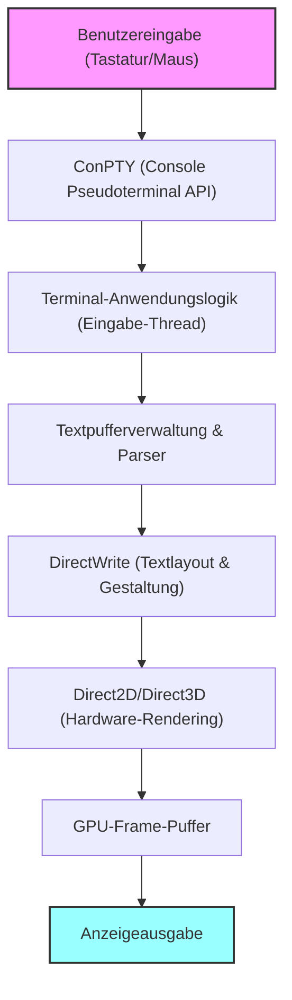
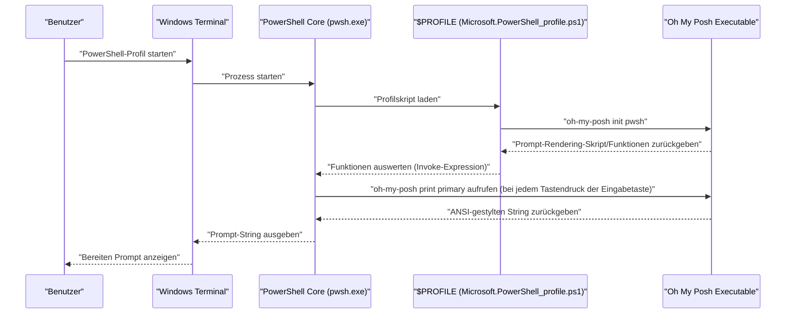

# Einführung: Warum Windows Terminal extrem anpassen?

In der modernen Softwareentwicklung ist ein Terminalemulator weit mehr als nur eine Schnittstelle für die Ein- und Ausgabe von Befehlen; er ist das wichtigste „Cockpit“, das die Produktivität von Entwicklern direkt beeinflusst. Die einstigen Standards in der Windows-Umgebung, die „Eingabeaufforderung (cmd.exe)“ und die herkömmliche „Windows PowerShell“-Konsole (conhost.exe), blieben aufgrund ihrer geringen Rendering-Leistung, mangelnden Anpassbarkeit und unvollständigen Unicode-Unterstützung im Vergleich zu den raffinierten Terminalumgebungen von Linux und macOS weit zurück.

Mit dem Erscheinen des „Windows Terminals“, dessen Open-Source-Entwicklung von Microsoft geleitet wird, hat sich diese Situation jedoch dramatisch verändert. Ultraschnelles Text-Rendering durch hardwarebeschleunigtes DirectX, native Unterstützung für Tab-Benutzeroberflächen und Fensterteilung (Panes), frei konfigurierbare Tastenkombinationen und ein fortschrittliches Profilmanagement. Das Windows Terminal ist eine extrem leistungsstarke Anwendung, die alle Anforderungen an ein „modernes Terminal“, die Entwickler wirklich gesucht haben, erfüllt.

In diesem Artikel bieten wir einen ultimativen Anpassungsleitfaden, um dieses Windows Terminal zur „stärksten“ Umgebung zu erheben. Wir beschränken uns nicht auf oberflächliche visuelle Änderungen, sondern erklären aus einer tiefgreifenden und technischen Perspektive: das mathematische Modell, das dem Text-Rendering zugrunde liegt, die tiefe Struktur der `settings.json`, die Einführung von Oh My Posh in PowerShell, die Einrichtung von Starship in einer WSL-Umgebung und sogar die theoretische Analyse der Rendering-Latenz.

Wir hoffen, dass dies den Lesern dabei hilft, ihre eigene beste Terminalumgebung zu erstellen und ihr tägliches Programmiererlebnis dramatisch zu verbessern.

---

# 1. Die Rendering-Architektur und das mathematische Modell von Windows Terminal

Hinter dem schnellen und flüssigen Betrieb des Windows Terminals verbirgt sich eine raffinierte Rendering-Pipeline, die den modernen Grafik-Stack von Windows voll ausnutzt. Anstelle des traditionellen GDI (Graphics Device Interface) verwendet das Windows Terminal hardwarebeschleunigtes GPU-Rendering auf Basis von DirectWrite und DirectX (Direct2D/Direct3D).

Das folgende Diagramm veranschaulicht das konzeptionelle Modell der Terminal-Rendering-Pipeline von der Tastatureingabe bis zum Zeichnen der Zeichen auf dem Bildschirm.



## 1.1 Subpixel-Antialiasing und Geometrie von Schriftarten

Beim Rendern von Text ist die Antialiasing-Technologie unerlässlich, um eine hohe Sichtbarkeit zu gewährleisten, die die Augen auch bei langen Arbeitszeiten nicht ermüdet. DirectWrite unterstützt fortschrittliches Subpixel-Antialiasing, das auf der ClearType-Technologie basiert.

Jedes Pixel eines typischen LCD-(Flüssigkristall-)Displays besteht aus drei vertikalen oder horizontalen Subpixeln: R (Rot), G (Grün) und B (Blau). Subpixel-Antialiasing ist eine Technologie, die die Helligkeit nicht auf der Ebene eines einzelnen Pixels (Graustufen-Antialiasing), sondern mithilfe der hohen räumlichen Auflösung dieser 1/3-Pixel-Einheiten steuert.

Angenommen, eine binäre Funktion $ f(x, y) $ definiert die Kontur der Glyphe einer idealen Vektorschrift. Wenn die Koordinate $ (x, y) $ innerhalb eines Pixels im Inneren der Glyphe liegt, ist $ f(x, y) = 1 $, und wenn sie außerhalb liegt, ist $ f(x, y) = 0 $.

Die Helligkeit $ I_R $ eines einzelnen Subpixels (zum Beispiel des roten Subpixels) wird berechnet als die Faltung (Convolution) des Integrals von $ f(x, y) $ im räumlichen Bereich $ S_R $ des Subpixels und einer Filterfunktion $ h(x, y) $ zur Korrektur der physikalischen Eigenschaften des Displays oder der visuellen Eigenschaften des Menschen (wie Gamma-Eigenschaften).

$$
I_R = \iint_{S_R} f(x, y) \ast h(x, y) \,dx\,dy
$$

Grün ($ I_G $) und Blau ($ I_B $) werden ebenfalls basierend auf ihren jeweiligen Bereichen $ S_G, S_B $ berechnet. Im Windows Terminal werden solche komplexen Integral- und Faltungsberechnungen auf Subpixel-Ebene massiv parallel verarbeitet, indem ein vorberechneter Glyphen-Cache (Atlas-Textur) und die Pixel-Shader der GPU verwendet werden, wodurch ein verzögerungsfreies und schönes Text-Rendering ohne Belastung der CPU erreicht wird.

---

# 2. Vollständiges Verständnis und tiefgehende Einstellungen von settings.json

Der Kern der Anpassung des Windows Terminals liegt in der Bearbeitung der Konfigurationsdatei `settings.json`. Viele Elemente können auch über die Einstellungs-GUI geändert werden, aber um die ultimative Anpassung zu erreichen und die Einstellungen mit Git oder ähnlichem zu versionieren, sind Kenntnisse in der direkten JSON-Bearbeitung unerlässlich.

Die Einstellungsdatei besteht hauptsächlich aus den folgenden drei Hauptabschnitten:

1. **`profiles`**: Definiert das Verhalten und Aussehen (Schriftart, Hintergrund, Startverzeichnis) für jede Shell (PowerShell, cmd, WSL, Azure Cloud Shell usw.).
2. **`schemes`**: Definiert die 16-Farben-Palette (Farbschema), die im Terminal verwendet wird.
3. **`actions`**: Definiert benutzerdefinierte Aktionen (Tastenkombinationen und Fensterteilungen), die über Tastaturkürzel oder die Befehlspalette aufgerufen werden.

## 2.1 Hierarchische Struktur von Profilen und Vererbungsmodell

In den Profileinstellungen werden Einstellungen, die allen Profilen gemeinsam sind, im Objekt `defaults` beschrieben, und individuelle Einstellungen in jedem Objekt innerhalb des Arrays `list`. Durch dieses Vererbungsmodell kann Redundanz in der Einstellungsdatei vermieden und die Wartbarkeit verbessert werden.

```json
{
    "profiles": {
        "defaults": {
            "font": {
                "face": "CaskaydiaCove Nerd Font",
                "size": 11,
                "weight": "normal",
                "features": {
                    "calt": 1,
                    "liga": 1
                }
            },
            "useAcrylic": true,
            "acrylicOpacity": 0.85,
            "cursorShape": "filledBox",
            "cursorBlinking": true,
            "padding": "12, 12, 12, 12",
            "antialiasingMode": "cleartype",
            "historySize": 10000
        },
        "list": [
            {
                "guid": "{574e775e-4f2a-5b96-ac1e-a2962a402336}",
                "hidden": false,
                "name": "PowerShell 7",
                "source": "Windows.Terminal.PowershellCore",
                "colorScheme": "Tokyo Night",
                "backgroundImage": "C:\\Users\\Username\\Pictures\\Terminal\\cyberpunk_bg.png",
                "backgroundImageOpacity": 0.15,
                "backgroundImageStretchMode": "uniformToFill",
                "startingDirectory": "%USERPROFILE%\\Projects"
            },
            {
                "guid": "{2c4de342-38b7-51cf-b940-2309a097f518}",
                "hidden": false,
                "name": "Ubuntu-22.04",
                "source": "Windows.Terminal.Wsl",
                "colorScheme": "One Half Dark",
                "startingDirectory": "\\\\wsl$\\Ubuntu-22.04\\home\\username"
            }
        ]
    }
}
```

Im obigen Beispiel wird die Einstellung `"features": { "calt": 1, "liga": 1 }` hinzugefügt, um Ligaturen für die Schriftart zu aktivieren. Dadurch werden Kombinationen aus mehreren Symbolen wie `!=` oder `=>` als ein einziges, schönes, für die Programmierung geeignetes Symbol gezeichnet.

## 2.2 Modularisierte Konfiguration durch JSON Fragments

Windows Terminal unterstützt einen Erweiterungsmechanismus namens „JSON Fragments“. Dies ist ein Mechanismus, durch den Drittanbieteranwendungen (wie neu installierte WSL-Distributionen oder Entwicklungstools wie Visual Studio) ihre eigenen Profile und Farbschemata dynamisch und sicher zum Terminal hinzufügen können, ohne die primäre `settings.json` des Benutzers direkt umzuschreiben.

Dieser Mechanismus kann auch verwendet werden, wenn Entwickler ihre eigenen Einstellungen getrennt verwalten möchten (durch einfaches Platzieren einer JSON-Datei in einem bestimmten Verzeichnis wird diese zusammengeführt).

---

# 3. Das höchste visuelle Erlebnis: Geheimnisse von Themes, Schriftarten und Hintergründen

Das Farbschema des Terminals ist ein wichtiges Element, das nicht nur das gute Aussehen betrifft, sondern auch direkt die Lesbarkeit von Code und Protokollen sowie die Verringerung der Augenbelastung bei langen Arbeitszeiten beeinflusst.

## 3.1 Erstellen und Anwenden eines Farbschemas

Im Internet sind viele Farbschemata für das Windows Terminal verfügbar (die Website „Windows Terminal Themes“ ist bekannt). Durch Hinzufügen dieser zum Array `schemes` können Sie beliebige Farbschemata verwenden.

Ein JSON-Definitionsbeispiel des Themas „Tokyo Night“, das in den letzten Jahren bei Entwicklern extrem beliebt geworden ist, wird unten gezeigt. Es ist ein augenfreundliches, kontrastreiches Thema basierend auf Blau und Lila.

```json
"schemes": [
    {
        "name": "Tokyo Night",
        "background": "#1A1B26",
        "foreground": "#A9B1D6",
        "black": "#32344A",
        "red": "#F7768E",
        "green": "#9ECE6A",
        "yellow": "#E0AF68",
        "blue": "#7AA2F7",
        "purple": "#BB9AF7",
        "cyan": "#7DCFFF",
        "white": "#A9B1D6",
        "brightBlack": "#414868",
        "brightRed": "#F7768E",
        "brightGreen": "#9ECE6A",
        "brightYellow": "#E0AF68",
        "brightBlue": "#7AA2F7",
        "brightPurple": "#BB9AF7",
        "brightCyan": "#7DCFFF",
        "brightWhite": "#C0CAF5",
        "cursorColor": "#C0CAF5",
        "selectionBackground": "#33467C"
    }
]
```

Jede Farbe wird als Hexadezimal-Farbcode (HEX) angegeben und entspricht einer der Farbnummern (0 bis 15) der ANSI-Escape-Sequenzen.

## 3.2 Einführung von Nerd Fonts und Optimierung der Schriftarteinstellungen (CaskaydiaCove Nerd Font)

Bei der Verwendung fortgeschrittener Prompt-Tools wie Oh My Posh oder Starship, die später beschrieben werden, ist eine Schriftart mit speziellen Glyphen (Symbolen) wie Git-Branch-Symbolen, Programmiersprachenlogos und Betriebssystemsymbolen unerlässlich. „**Nerd Fonts**“ sind bestehende Programmierschriftarten, die mit diesen Symbolen gepatched (ergänzt) wurden.

Die von Microsoft entwickelte Programmierschriftart „Cascadia Code“ ist sehr gut lesbar und exzellent, enthält aber standardmäßig keine Nerd-Font-Symbole. Daher wird dringend empfohlen, die „**CaskaydiaCove Nerd Font**“ einzuführen, bei der der Nerd-Font-Patch auf Cascadia Code angewendet wurde.

### Installationsschritte:
1. Laden Sie `CascadiaCode.zip` von der [offiziellen Nerd Fonts GitHub Releases-Seite](https://github.com/ryanoasis/nerd-fonts/releases) herunter.
2. Entpacken Sie die Datei, wählen Sie die darin enthaltenen `.ttf`-Dateien aus, klicken Sie mit der rechten Maustaste und wählen Sie „Für alle Benutzer installieren“.
3. Ändern Sie `font.face` in der `settings.json` in `"CaskaydiaCove Nerd Font"`.

## 3.3 Erzeugung von Immersion durch Acrylic-Effekt und Hintergrundbilder

Eines der Merkmale, die das Fluent Design System von Windows 11 verkörpern, ist der „Acrylic (Acryl)“-Materialeffekt. Er ermöglicht es Ihnen, den Hintergrund des Terminals durchscheinend zu machen und die Fenster oder Hintergrundbilder dahinter wunderschön unscharf durchscheinen zu lassen.

```json
"useAcrylic": true,
"acrylicOpacity": 0.75,
```

Außerdem ist es möglich, ein beliebiges Bild als Hintergrund festzulegen. Gif-Animationen werden ebenfalls unterstützt, wodurch Sie dynamische Hintergründe erstellen können. Die Positionierung und Deckkraft des Bildes können ebenfalls fein gesteuert werden.

```json
"backgroundImage": "C:\\Users\\Username\\Pictures\\wallpapers\\anime_cyberpunk.gif",
"backgroundImageOpacity": 0.2,
"backgroundImageStretchMode": "none",
"backgroundImageAlignment": "bottomRight"
```

Dies ermöglicht motivationssteigernde Anpassungen, wie zum Beispiel die dezente Platzierung Ihres Lieblingscharakters oder -logos in der unteren rechten Ecke des Terminals.

---

# 4. Produktivität maximieren: Fensterteilung (Panes), Tastenkombinationen und Befehlspalette

Das Windows Terminal bietet von Haus aus die grundlegenden Funktionen (Teilen des Bildschirms in Panes), die Terminal-Multiplexer wie tmux oder screen besitzen.

Durch die Anpassung des `actions`-Abschnitts können Sie den Bildschirm völlig frei per Tastatur aufteilen, verschieben und in der Größe ändern, ohne die Maus auch nur zu berühren.

```json
"actions": [
    { "command": { "action": "splitPane", "split": "auto", "splitMode": "duplicate" }, "keys": "alt+shift+d" },
    { "command": { "action": "splitPane", "split": "right" }, "keys": "alt+shift+plus" },
    { "command": { "action": "splitPane", "split": "down" }, "keys": "alt+shift+minus" },
    { "command": { "action": "moveFocus", "direction": "left" }, "keys": "alt+left" },
    { "command": { "action": "moveFocus", "direction": "right" }, "keys": "alt+right" },
    { "command": { "action": "moveFocus", "direction": "up" }, "keys": "alt+up" },
    { "command": { "action": "moveFocus", "direction": "down" }, "keys": "alt+down" },
    { "command": { "action": "resizePane", "direction": "left" }, "keys": "alt+shift+left" },
    { "command": { "action": "resizePane", "direction": "right" }, "keys": "alt+shift+right" },
    { "command": { "action": "resizePane", "direction": "up" }, "keys": "alt+shift+up" },
    { "command": { "action": "resizePane", "direction": "down" }, "keys": "alt+shift+down" },
    { "command": { "action": "closePane" }, "keys": "ctrl+w" }
]
```

Durch das Konfigurieren der obigen Tastenkombinationen können Sie die Größe der Panes mit `Alt + Shift + Pfeiltasten` anpassen und den Fokus sofort zwischen den Panes mit `Alt + Pfeiltasten` verschieben. Dies ermöglicht nahtlose, hochgradig parallele Arbeit, z. B. das Starten eines lokalen Node.js-Servers in einem Pane zur Überwachung von Protokollen, das Ausführen von Git-Befehlen in einem anderen und das Überprüfen des Status von Docker-Containern in noch einem weiteren.

## 4.1 Quake Mode (Globales Dropdown-Terminal)

Ebenfalls unterstützt wird der „Quake Mode (Dropdown-Modus)“, bei dem das Terminal jederzeit vom oberen Bildschirmrand aufgerufen werden kann, ähnlich wie der Konsolenbildschirm im FPS-Spiel „Quake“. Standardmäßig gleitet ein Terminal in der halben Fenstergröße animiert von oben nach unten, wenn Sie `Win + \` drücken. Dies ist sehr nützlich, wenn Sie vorübergehend einen Befehl eingeben möchten.

---

# 5. Automatisierung des Startlayouts mit `wt.exe`

Routinemäßige Aufgaben, wie das Öffnen eines Terminals in einem bestimmten Projektverzeichnis zu Beginn der Arbeit jeden Morgen, das Unterteilen des Bildschirms in drei Teile und das Ausführen von Frontend-Builds, Backend-Server-Starts und Datenbanküberwachungsbefehlen in jedem, sollten automatisiert werden.

Die ausführbare Datei von Windows Terminal, `wt.exe`, unterstützt leistungsstarke Befehlszeilenargumente, mit denen Sie das zu startende Profil und den Fensterteilungsstatus über Argumente steuern können.

```powershell
wt -p "PowerShell 7" -d "C:\Projects\MyApp" ; split-pane -p "Ubuntu-22.04" -d "/var/log" -V ; split-pane -p "cmd" -H
```

Wenn Sie diesen Befehl als Windows-Verknüpfung oder Batch-Datei speichern, kann das komplexe Layout Ihrer Entwicklungsumgebung mit nur einem Klick im Handumdrehen wiederhergestellt werden.

---

# 6. Evolution des Prompts 1: PowerShell und Oh My Posh

Was PowerShell, die Standard-Shell in Windows-Umgebungen (insbesondere die neueste plattformübergreifende PowerShell 7 / PowerShell Core), drastisch weiterentwickelt, ist „**Oh My Posh**“. Oh My Posh ist eine benutzerdefinierte Prompt-Engine für jede Shell, die alle für die Entwicklung notwendigen Zustände wunderschön und visuell darstellt, wie z.B. das aktuelle Verzeichnis, Git-Branches und Änderungsstatus, Node.js- oder Python-Versionen und Kubernetes-Kontexte.

Das folgende Diagramm zeigt den Ablauf, wie Oh My Posh beim Start von PowerShell geladen wird und der Prompt gerendert wird.



## 6.1 Installation und Konfiguration von Oh My Posh

In einer Windows-Umgebung kann es ganz einfach mit dem offiziellen Paketmanager `winget` installiert werden.

```powershell
winget install JanDeDobbeleer.OhMyPosh -s winget
```

Nach der Installation bearbeiten Sie das PowerShell-Profilskript so, dass Oh My Posh beim Start geladen und initialisiert wird. Der Profilpfad ist in der automatischen Variable `$PROFILE` gespeichert.

```powershell
notepad $PROFILE
```

Sobald die Datei geöffnet ist, fügen Sie den folgenden Code hinzu:

```powershell
# Alias-Einstellungen
Set-Alias ll ls
Set-Alias g git

# Vorhersagendes IntelliSense aktivieren (PSReadLine-Modul)
Set-PSReadLineOption -PredictionSource History
Set-PSReadLineOption -PredictionViewStyle ListView

# Initialisierung von Oh My Posh
# Geben Sie Ihr bevorzugtes Theme an (z.B. jandedobbeleer).
# Der Pfad für die integrierten Themes befindet sich in der Umgebungsvariable $env:POSH_THEMES_PATH.
oh-my-posh init pwsh --config "$env:POSH_THEMES_PATH\tokyonight_storm.omp.json" | Invoke-Expression

# Terminal-Icons Modul zum Anzeigen von Symbolen für Ordner und Dateien
# (Erfordert Install-Module -Name Terminal-Icons -Repository PSGallery -Force nur beim ersten Mal)
Import-Module -Name Terminal-Icons
```

Hunderte von Themes (configs) sind verfügbar, und es ist auch möglich, Ihr eigenes vollständig in den Formaten JSON, YAML oder TOML zu erstellen. Mithilfe des Konzepts der „Segmente“ können Sie den Prompt entwerfen, indem Sie die Informationen, die links (Left) und rechts (Right) angezeigt werden sollen, frei kombinieren.

---

# 7. Evolution des Prompts 2: WSL2-Architektur und die Fusion mit Starship

WSL2 (Windows Subsystem for Linux 2), das einen echten Linux-Kernel auf Windows ausführen kann, ist für die moderne Webentwicklung und Cloud-native Entwicklung unerlässlich. Um den Prompt von Shells in WSL (Bash oder Zsh) anzupassen, ist „**Starship**“ die optimale Lösung.

Starship ist ein in Rust geschriebener, extrem schneller und in hohem Maße anpassbarer plattformübergreifender Prompt. Seine Stärke liegt darin, dass Sie in jeder Shell wie Bash, Zsh, Fish usw. denselben Prompt reproduzieren können, indem Sie einfach eine einzige Konfigurationsdatei (TOML) schreiben.

## 7.1 Installation von Starship

Öffnen Sie ein WSL-Terminal (z. B. Ubuntu) und führen Sie das offizielle Installationsskript aus.

```bash
curl -sS https://starship.rs/install.sh | sh
```

Als Nächstes hängen Sie, wenn Sie Bash verwenden, Folgendes an das Ende der `~/.bashrc` an, um den Hook zu aktivieren:

```bash
# ~/.bashrc
eval "$(starship init bash)"
```

Wenn Sie Zsh verwenden, hängen Sie es an das Ende der `~/.zshrc` an:

```bash
# ~/.zshrc
eval "$(starship init zsh)"
```

## 7.2 Ultimative Anpassung über starship.toml

Starship wird in `~/.config/starship.toml` konfiguriert. Da das Format TOML ist, ist es für Menschen leichter zu lesen und zu schreiben als JSON, und es können Kommentare hinzugefügt werden.

Im Folgenden finden Sie ein Konfigurationsbeispiel, das einen modernen und informationsreichen Prompt realisiert:

```toml
# ~/.config/starship.toml

# Definiert das gesamte Prompt-Format (Reihenfolge)
format = """
[╭─](bold blue)$os$directory$git_branch$git_status$nodejs$python$golang$rust
[╰─$character](bold blue)"""

# OS-Icon Anzeige-Einstellungen
[os]
disabled = false
format = "[$symbol]($style) "

[os.symbols]
Ubuntu = " "
Windows = " "
Macos = " "
Alpine = " "

# Verzeichnis Anzeige-Einstellungen
[directory]
style = "bold cyan"
read_only = " "
truncation_length = 3
truncate_to_repo = true

# Git-Branch Einstellungen
[git_branch]
symbol = " "
style = "bold purple"

# Git-Status Einstellungen
[git_status]
style = "bold red"
modified = " "
staged = " "
untracked = " "
deleted = "✖ "

# Prompt-Zeichen (Eingabezeilensymbol)
[character]
success_symbol = "[❯](bold green)"
error_symbol = "[❯](bold red)"
```

In dieser Konfiguration besteht der Prompt aus zwei Zeilen: Die erste Zeile zeigt das OS-Icon, den aktuellen Verzeichnispfad, den Git-Branch und -Status sowie die Versionsinformationen der jeweiligen Sprachumgebungen (Node.js, Python usw.). Die zweite Zeile ist eine einfache Eingabezeile, was verhindert, dass die Eingabe langer Befehle den Bildschirmplatz einnimmt.

---

# 8. Terminal-Rendering-Latenz und mathematische Modelle der Leistung

Einer der wichtigsten Indikatoren bei der Bewertung der Benutzererfahrung eines Terminals ist die „**Eingabelatenz (Input Latency)**“. Sie bezieht sich auf die Zeitverzögerung von dem Moment, in dem eine Taste auf der Tastatur gedrückt wird, bis zu dem Zeitpunkt, an dem sich die Farbe des entsprechenden Pixels auf dem Bildschirm ändert und visuelles Feedback gegeben wird.

Diese Gesamtlatenz $ T_{total} $ lässt sich mathematisch streng als Summe der folgenden Komponenten modellieren:

$$
T_{total} = T_{hw\_input} + T_{os} + T_{pty} + T_{app} + T_{render} + T_{display}
$$

Die Bedeutung und die typische Dauer jeder Variablen sind wie folgt:

- $ T_{hw\_input} $: Die Hardwareverzögerung von der Aktivierung des mechanischen Schalters der Tastatur bis zum Abfragen über den USB-Controller und dem Senden des Interrupt-Signals (ca. 1–5 ms).
- $ T_{os} $: Die Nachrichtenwarteschlangen-Verarbeitungsverzögerung durch die OS HID (Human Interface Device) Treiberschicht (ca. 1–2 ms).
- $ T_{pty} $: Die Verzögerung der Pufferung und der Zeichencodierungskonvertierung (z.B. UTF-8 in UTF-16) durch ConPTY (Pseudo-Terminal) (ca. 2–10 ms).
- $ T_{app} $: Die Verarbeitungszeit für die Befehlsinterpretation auf der Shell-Seite (PowerShell/Bash) und die Bestimmung der Bildschirmausgabe. Dies schließt auch die Verarbeitungszeit für Aufgaben wie das Abrufen des Git-Status durch Oh My Posh oder Starship ein (ca. 10–50 ms).
- $ T_{render} $: Die Rendering-Verzögerung, bei der Windows Terminal (DirectWrite/DirectX) die Text-Glyphen als Texturen rastern, in den GPU-Speicher übertragen und die Swap-Chain spiegeln (flippen) (ca. 2–8 ms).
- $ T_{display} $: Die Display-Verzögerung, von der Ausgabe des Signals aus dem GPU-Frame-Puffer zum Monitor bis zur Änderung des physikalischen Leuchtzustands durch die Reaktion der Flüssigkristallmoleküle (z. B. GtG-Reaktionszeit. ca. 5–20 ms).

Das Entwicklungsteam des Windows Terminals hat erhebliche Anstrengungen unternommen, um insbesondere $ T_{pty} $ und $ T_{render} $ zu minimieren. In frühen Versionen traten aufgrund von Cache-Fehlwürfen beim Rastern von Text spitzenartige Verzögerungen (Frame-Drops) auf, in den neuesten Versionen wurde jedoch ein „Atlas-basierter Glyphen-Cache-Algorithmus (Atlas-based glyph cache)“ eingeführt.

Durch das Konvertieren von Glyphen in einen Atlas wird das Zeichnen von Zeichenfolgen zu einer einfachen Matrixoperation auf der GPU: „Ausschneiden aus einer riesigen Font-Textur, die vorab im Speicher generiert wurde, und Alpha-Blending-Komposition auf dem Bildschirm“.

Wenn die zu zeichnende Zeichenfolge $ N $ Zeichen lang ist, erforderte das sequenzielle CPU-Rendering mit dem traditionellen GDI-Ansatz eine Zeit von $ \mathcal{O}(N) $, während beim GPU-basierten Atlas-Rendering das Zeichnen durch parallele Shader in nahezu konstanter Zeit von $ \mathcal{O}(1) $ möglich ist.

Aus diesem Grund kann Windows Terminal selbst unter Bedingungen, in denen eine große Menge an Logs an die Standardausgabe gesendet wird (z. B. `npm install` oder bei Kompilierungsmeldungen von großen C++-Projekten), reibungslos mit 60 Bildern pro Sekunde (oder auf Umgebungen mit einer hohen Bildwiederholfrequenz von über 144 Hz) kontinuierlich Text scrollen, ohne dass es zu Leistungseinbrüchen kommt.

---

# 9. Fortgeschrittene Fehlerbehebung und Debugging-Techniken

Wenn Sie das Windows Terminal auf das Äußerste anpassen, können Sie auf unerwartete Probleme stoßen, wie z. B. Syntaxfehler in Einstellungsdateien oder Fehler bei der Schriftartdarstellung. Hier stellen wir einige fortgeschrittene Fehlerbehebungstechniken für Ingenieure vor.

## 9.1 JSON-Schema-Validierung für settings.json
Die Struktur der `settings.json` ist streng definiert, und es wird empfohlen, Editoren (wie VS Code) zu verwenden, die Echtzeit-Syntaxprüfungen mittels JSON Schema durchführen. Wenn Sie `settings.json` in VS Code öffnen, wird standardmäßig das Schema für Windows Terminal angewendet. Ungültige Eigenschaftsnamen oder Fehler beim Werttyp (z. B. Angabe eines Strings, wo eine Zahl erwartet wird) werden sofort mit einer geschwungenen Linie gewarnt.

## 9.2 Leistungs-Profiling von Prompts
Wenn die Anzeige des Prompts extrem langsam ist (es gibt eine Verzögerung, nachdem die Eingabetaste gedrückt wurde, bevor die nächste Eingabezeile erscheint), besteht eine hohe Wahrscheinlichkeit, dass ein Problem bei der Ausführungszeit von Oh My Posh oder Starship vorliegt. Oh My Posh verfügt über eine erweiterte Debugging-Funktion, die die Renderzeit jedes Blocks misst.

```powershell
oh-my-posh debug
```

Wenn dieser Befehl ausgeführt wird, werden Variablen der Terminalumgebung, geladene Konfigurationsdateipfade und die Verarbeitungszeit in Millisekunden (ms) für jedes Segment, aus dem der Prompt besteht, detailliert ausgegeben. Dies ermöglicht es, genau zu identifizieren, welcher Informationsabruf der Engpass ist (z. B. das Abrufen des Git-Status in einem riesigen Monorepo, die Überprüfung des Authentifizierungsstatus von Cloud-Anbietern oder Netzwerkverzögerungen) und das Problem durch Deaktivieren unnötiger Module zu optimieren.

## 9.3 Deaktivierung der GPU-Beschleunigung (Fallback auf Software-Rendering)
In seltenen Fällen kann Hardware-Rendering über DirectX zu Bildschirmflackern (Flicker) oder fehlenden Zeichen auf älterer Hardware oder aufgrund von Fehlern in bestimmten GPU-Treibern führen. In diesem Fall gibt es eine Einstellungsoption, um das Rendern per Software zu erzwingen.

Fügen Sie die folgende Einstellung auf der Root-Ebene der `settings.json` hinzu:

```json
"softwareRendering": true
```

Dadurch wird das Rendering von der GPU auf eine CPU-basierte Methode (WARP) umgeschaltet. Obwohl die Leistung abnimmt, wird die Genauigkeit des Renderings sichergestellt. Dies ist ein leistungsstarkes Mittel, um Probleme im Zusammenhang mit der Grafik zu isolieren.

---

# Fazit

Der wahre Wert des Windows Terminals geht weit über die Positionierung als bloßer „Ersatz für die alte Eingabeaufforderung“ hinaus. Modernste Rendering-Technologie mit DirectX, ein flexibler und leistungsstarker Konfigurationsmechanismus auf JSON-Basis und die nahtlose Integration mit verschiedenen Shells wie WSL und PowerShell. Wenn Sie diese tiefgreifend verstehen und sie so anpassen, dass sie perfekt in Ihre Hand passen, kann die Reibung (Friction) im Entwicklungsprozess auf das absolute Minimum reduziert werden.

Die zahlreichen in diesem Artikel beschriebenen Anpassungsmethoden – die Feinabstimmung von Farbschemata, die Erweiterung visueller Informationen durch Nerd Fonts, intelligente kontextsensitive Prompts mit Oh My Posh oder Starship und der Aufbau einer Multitasking-Umgebung mit Fensterteilung – werden nicht nur Ihr tägliches Programmiererlebnis verbessern, sondern auch Ihre Motivation bei der Arbeit mit dem Terminal selbst steigern.

Die Optimierung von Entwicklungsumgebungen ist ein endloser Prozess. Jedes Mal, wenn ein neues Kommandozeilenwerkzeug erscheint oder sich die Architektur des Betriebssystems weiterentwickelt, wird sich wahrscheinlich auch die Form unseres Terminals ändern. Wir hoffen aufrichtig, dass dieser Artikel ein verlässlicher Wegweiser auf Ihrer endlosen Reise zur Suche nach der „ultimativen Entwicklungsumgebung“ sein wird.
