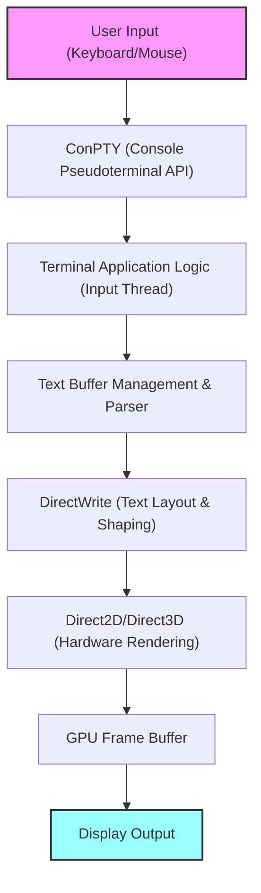
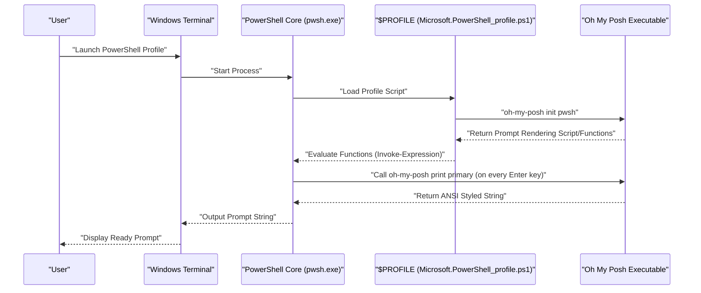

# Introduction: Why Customize Windows Terminal to the Limit?

In modern software development, a terminal emulator is more than just a command input/output interface; it has become the most crucial "cockpit" that directly dictates a developer's productivity. The standard "Command Prompt (cmd.exe)" and traditional "Windows PowerShell" console (conhost.exe) in past Windows environments were vastly inferior compared to the refined terminal environments of Linux and macOS due to their poor rendering performance, low customizability, and incomplete Unicode support.

However, with the advent of "Windows Terminal," an open-source project led by Microsoft, the situation has dramatically changed. With ultra-fast text rendering driven by DirectX-based hardware acceleration, native support for tabbed UI and pane splitting, freely configurable shortcut keys, and advanced profile management features, Windows Terminal is an extremely powerful application that satisfies all the requirements of a "modern terminal" that developers have truly sought after.

In this article, we provide an ultimate customization guide to elevate this Windows Terminal into the "strongest" environment. Going beyond superficial visual changes, we will provide thorough and technical explanations covering the mathematical models underlying text rendering, the deep structure of `settings.json`, the introduction of Oh My Posh in PowerShell, setting up Starship in a WSL environment, and even a theoretical analysis of rendering latency.

We hope this article helps readers build their own ultimate terminal environment and dramatically improve their daily coding experience.

---

# 1. Windows Terminal Rendering Architecture and Mathematical Model

Behind the incredibly fast and smooth operation of Windows Terminal lies a sophisticated rendering pipeline that fully utilizes the modern Windows graphics stack. Replacing the traditional GDI (Graphics Device Interface), Windows Terminal adopts GPU-based hardware acceleration utilizing DirectWrite and DirectX (Direct2D/Direct3D).

Below is a conceptual diagram of the terminal rendering pipeline from key input to text rendering on the screen.



## 1.1 Subpixel Antialiasing and Geometry of Fonts

In text rendering, antialiasing technology is essential to ensure high visibility that prevents eye fatigue even during long hours of work. DirectWrite supports advanced subpixel antialiasing applying ClearType technology.

Each pixel on a typical LCD (Liquid Crystal Display) consists of three vertical or horizontal subpixels: R (Red), G (Green), and B (Blue). Subpixel antialiasing is a technology that controls luminance using the high spatial resolution of these 1/3 pixel units rather than single pixel units (grayscale antialiasing).

Let $ f(x, y) $ be a binary function defining the ideal vector font glyph outline. If the coordinates $ (x, y) $ within a pixel are inside the glyph, $ f(x, y) = 1 $, and if outside, $ f(x, y) = 0 $.

The luminance $ I_R $ of a single subpixel (e.g., the red subpixel) is calculated as the convolution of the integral of $ f(x, y) $ in the spatial domain $ S_R $ of that subpixel and a filter function $ h(x, y) $ for correcting the physical characteristics of the display and human visual characteristics (such as gamma characteristics).

$$
I_R = \iint_{S_R} f(x, y) \ast h(x, y) \,dx\,dy
$$

Similarly, green ($ I_G $) and blue ($ I_B $) are calculated based on their respective domains $ S_G, S_B $. In Windows Terminal, these complex subpixel-level integration and convolution operations are massively parallel-processed using pre-generated glyph caches (Atlas textures) and GPU pixel shaders, realizing beautiful text rendering without delay and without putting a load on the CPU.

---

# 2. Complete Understanding and Deep Configuration of settings.json

The core of Windows Terminal customization lies in editing the configuration file, `settings.json`. While many items can be changed from the GUI settings screen, knowledge of editing JSON directly is essential for pursuing ultimate customization and for version-controlling settings with Git or similar tools.

The configuration file mainly consists of the following three major sections:

1. **`profiles`**: Defines the behavior and appearance (font, background, starting directory) for each shell (PowerShell, cmd, WSL, Azure Cloud Shell, etc.).
2. **`schemes`**: Defines the 16-color palettes (color schemes) used within the terminal.
3. **`actions`**: Defines custom actions (keybindings and pane splitting) invoked by shortcut keys or the command palette.

## 2.1 Profile Hierarchical Structure and Inheritance Model

In profile settings, configurations common to all profiles are described in the `defaults` object, and individual configurations are described in each object within the `list` array. This inheritance model eliminates redundancy in the configuration file and improves maintainability.

```json
{
    "profiles": {
        "defaults": {
            "font": {
                "face": "CaskaydiaCove Nerd Font",
                "size": 11,
                "weight": "normal",
                "features": {
                    "calt": 1,
                    "liga": 1
                }
            },
            "useAcrylic": true,
            "acrylicOpacity": 0.85,
            "cursorShape": "filledBox",
            "cursorBlinking": true,
            "padding": "12, 12, 12, 12",
            "antialiasingMode": "cleartype",
            "historySize": 10000
        },
        "list": [
            {
                "guid": "{574e775e-4f2a-5b96-ac1e-a2962a402336}",
                "hidden": false,
                "name": "PowerShell 7",
                "source": "Windows.Terminal.PowershellCore",
                "colorScheme": "Tokyo Night",
                "backgroundImage": "C:\\Users\\Username\\Pictures\\Terminal\\cyberpunk_bg.png",
                "backgroundImageOpacity": 0.15,
                "backgroundImageStretchMode": "uniformToFill",
                "startingDirectory": "%USERPROFILE%\\Projects"
            },
            {
                "guid": "{2c4de342-38b7-51cf-b940-2309a097f518}",
                "hidden": false,
                "name": "Ubuntu-22.04",
                "source": "Windows.Terminal.Wsl",
                "colorScheme": "One Half Dark",
                "startingDirectory": "\\\\wsl$\\Ubuntu-22.04\\home\\username"
            }
        ]
    }
}
```

In the example above, a setting to enable ligatures in the font `"features": { "calt": 1, "liga": 1 }` is added. This allows multiple symbols like `!=` and `=>` to be rendered as a single beautiful symbol suitable for programming.

## 2.2 Modular Configuration with JSON Fragments

Windows Terminal supports an extension mechanism called "JSON Fragments." This is a mechanism by which third-party applications (for example, a newly installed WSL distribution or a development tool like Visual Studio) can dynamically and safely add their own profiles and color schemes to the terminal without directly modifying the user's main `settings.json`.

Developers can also apply this mechanism when they want to manage their own settings in a modular way (simply placing JSON files in a specified directory will merge them).

---

# 3. Supreme Visual Experience: The Art of Themes, Fonts, and Backgrounds

Terminal color schemes are crucial factors directly tied not just to good looks, but to the readability of code and logs, and reducing eye strain during long hours of work.

## 3.1 Creating and Applying Color Schemes

Numerous color schemes for Windows Terminal are published on the internet (the website "Windows Terminal Themes" is well-known). By adding these to the `schemes` array, you can use any color palette you like.

Below is an example JSON definition for the "Tokyo Night" theme, which has been extremely popular among developers in recent years. It is an eye-friendly, high-contrast theme based on blue and purple.

```json
"schemes": [
    {
        "name": "Tokyo Night",
        "background": "#1A1B26",
        "foreground": "#A9B1D6",
        "black": "#32344A",
        "red": "#F7768E",
        "green": "#9ECE6A",
        "yellow": "#E0AF68",
        "blue": "#7AA2F7",
        "purple": "#BB9AF7",
        "cyan": "#7DCFFF",
        "white": "#A9B1D6",
        "brightBlack": "#414868",
        "brightRed": "#F7768E",
        "brightGreen": "#9ECE6A",
        "brightYellow": "#E0AF68",
        "brightBlue": "#7AA2F7",
        "brightPurple": "#BB9AF7",
        "brightCyan": "#7DCFFF",
        "brightWhite": "#C0CAF5",
        "cursorColor": "#C0CAF5",
        "selectionBackground": "#33467C"
    }
]
```

Each color is specified by a hexadecimal color code (HEX) and corresponds to each color number (0-15) of the ANSI escape sequence.

## 3.2 Introducing Nerd Fonts and Optimizing Font Settings (CaskaydiaCove Nerd Font)

When using advanced prompt tools like Oh My Posh or Starship (described later), a font containing special glyphs (icons) such as Git branch icons, programming language logos, and OS symbols is essential. Fonts that have patched (added) these icons to existing programming fonts are called "**Nerd Fonts**".

"Cascadia Code", a programming font developed by Microsoft, is extremely readable and excellent, but it does not include Nerd Font icons by default. Therefore, we highly recommend introducing "**CaskaydiaCove Nerd Font**", which applies the Nerd Font patch to Cascadia Code.

### Installation Steps:
1. Download `CascadiaCode.zip` from the [official Nerd Fonts GitHub releases page](https://github.com/ryanoasis/nerd-fonts/releases).
2. Extract it, right-click the `.ttf` files inside, and select "Install for all users".
3. Change `font.face` in `settings.json` to `"CaskaydiaCove Nerd Font"`.

## 3.3 Creating Immersion with Acrylic Effects and Background Images

One of the features embodying the Fluent Design System in Windows 11 is the "Acrylic" material effect. You can make the terminal background translucent, beautifully blurring and showing through the windows and wallpaper behind it.

```json
"useAcrylic": true,
"acrylicOpacity": 0.75,
```

Furthermore, it is also possible to set any image as the background. Gif animations are also supported, allowing you to create dynamic backgrounds. The placement and opacity of the image can also be finely controlled.

```json
"backgroundImage": "C:\\Users\\Username\\Pictures\\wallpapers\\anime_cyberpunk.gif",
"backgroundImageOpacity": 0.2,
"backgroundImageStretchMode": "none",
"backgroundImageAlignment": "bottomRight"
```

This allows for customizations that boost motivation, such as discreetly placing a favorite character or logo in the bottom right corner of the terminal.

---

# 4. Maximizing Productivity: Pane Splitting, Keybindings, and Command Palette

Windows Terminal natively features the basic functionalities (screen pane splitting) possessed by terminal multiplexers like tmux and screen.

By customizing the `actions` section, you can freely split, move, and resize screens using only keyboard operations, without ever touching the mouse.

```json
"actions": [
    { "command": { "action": "splitPane", "split": "auto", "splitMode": "duplicate" }, "keys": "alt+shift+d" },
    { "command": { "action": "splitPane", "split": "right" }, "keys": "alt+shift+plus" },
    { "command": { "action": "splitPane", "split": "down" }, "keys": "alt+shift+minus" },
    { "command": { "action": "moveFocus", "direction": "left" }, "keys": "alt+left" },
    { "command": { "action": "moveFocus", "direction": "right" }, "keys": "alt+right" },
    { "command": { "action": "moveFocus", "direction": "up" }, "keys": "alt+up" },
    { "command": { "action": "moveFocus", "direction": "down" }, "keys": "alt+down" },
    { "command": { "action": "resizePane", "direction": "left" }, "keys": "alt+shift+left" },
    { "command": { "action": "resizePane", "direction": "right" }, "keys": "alt+shift+right" },
    { "command": { "action": "resizePane", "direction": "up" }, "keys": "alt+shift+up" },
    { "command": { "action": "resizePane", "direction": "down" }, "keys": "alt+shift+down" },
    { "command": { "action": "closePane" }, "keys": "ctrl+w" }
]
```

By setting the keybindings above, you can adjust pane sizes with `Alt + Shift + Arrow keys` and instantly shift focus between panes with `Alt + Arrow keys`. This enables seamless advanced concurrent work, such as starting a Node.js local server in one pane to monitor logs, executing Git commands in another pane, and checking the status of Docker containers in yet another pane.

## 4.1 Quake Mode (Global Dropdown Terminal)

A "Quake Mode" (dropdown mode) is also supported, allowing you to summon the terminal from the top of the screen at any time, just like the console screen in the FPS game "Quake". By default, pressing the `Win + \` keys will slide down a terminal half the size of the window from the top with an animation. This is extremely convenient when you want to quickly type a command.

---

# 5. Automating Startup Layouts Using `wt.exe`

Routine tasks, such as opening a terminal in a specific project directory at the start of work every morning, splitting the screen into three, and executing commands for frontend building, backend server startup, and database monitoring in each, should be automated.

`wt.exe`, the actual executable for Windows Terminal, supports powerful command-line arguments, allowing you to control the profile specified at startup and the pane splitting state via arguments.

```powershell
wt -p "PowerShell 7" -d "C:\Projects\MyApp" ; split-pane -p "Ubuntu-22.04" -d "/var/log" -V ; split-pane -p "cmd" -H
```

By saving this command as a Windows shortcut or batch file, you can instantly restore a complex development environment layout with a single click.

---

# 6. The Evolution of Prompts 1: PowerShell and Oh My Posh

"**Oh My Posh**" dramatically evolves PowerShell (especially the cross-platform latest version PowerShell 7 / PowerShell Core), the standard shell in Windows environments. Oh My Posh is a custom prompt engine that supports all shells, beautifully and visually presenting all the states necessary for development, such as the current directory, Git branch and change status, Node.js and Python versions, Kubernetes contexts, and more.

The diagram below shows the sequence of how Oh My Posh is loaded and the prompt is rendered when PowerShell starts.



## 6.1 Installing and Configuring Oh My Posh

In a Windows environment, it can be easily installed using the official package manager, `winget`.

```powershell
winget install JanDeDobbeleer.OhMyPosh -s winget
```

After installation, edit your PowerShell profile script to initialize Oh My Posh so it is loaded at startup. The profile path is stored in the automatic variable `$PROFILE`.

```powershell
notepad $PROFILE
```

When the file opens, append the following code:

```powershell
# Set aliases
Set-Alias ll ls
Set-Alias g git

# Enable predictive IntelliSense (PSReadLine module)
Set-PSReadLineOption -PredictionSource History
Set-PSReadLineOption -PredictionViewStyle ListView

# Initialize Oh My Posh
# Specify your preferred theme (e.g., jandedobbeleer).
# Built-in theme paths are in the environment variable $env:POSH_THEMES_PATH.
oh-my-posh init pwsh --config "$env:POSH_THEMES_PATH\tokyonight_storm.omp.json" | Invoke-Expression

# Terminal-Icons module to display icons for folders and files
# (Requires Install-Module -Name Terminal-Icons -Repository PSGallery -Force for the first time)
Import-Module -Name Terminal-Icons
```

Hundreds of themes (configs) are available, and it is also possible to completely create your own in JSON, YAML, or TOML formats. Using the concept of "segments," you can design your prompt by freely combining the information displayed on the left and right sides.

---

# 7. The Evolution of Prompts 2: Fusion of WSL2 Architecture and Starship

WSL2 (Windows Subsystem for Linux 2), which allows you to run a real Linux kernel on Windows, is indispensable for modern web development and cloud-native development. To customize the prompt of the shell (Bash or Zsh) inside WSL, "**Starship**" is the optimal solution.

Starship is an extremely fast and highly customizable cross-shell prompt written in Rust. Its strength is that you can reproduce exactly the same prompt in any shell, such as Bash, Zsh, or Fish, just by writing one configuration file (TOML).

## 7.1 Installing Starship

Open a WSL terminal (Ubuntu, etc.) and run the official installation script.

```bash
curl -sS https://starship.rs/install.sh | sh
```

Next, if you are using Bash, append the following to the end of `~/.bashrc` to enable the hook:

```bash
# ~/.bashrc
eval "$(starship init bash)"
```

If you are using Zsh, append it to the end of `~/.zshrc`:

```bash
# ~/.zshrc
eval "$(starship init zsh)"
```

## 7.2 Ultimate Customization via starship.toml

Starship settings are written in `~/.config/starship.toml`. Because it's in TOML format, it is easier for humans to read and write than JSON, and it features the ability to write comments.

Below is a configuration example to achieve a modern and informative prompt.

```toml
# ~/.config/starship.toml

# Define the overall prompt format (order)
format = """
[╭─](bold blue)$os$directory$git_branch$git_status$nodejs$python$golang$rust
[╰─$character](bold blue)"""

# OS icon display settings
[os]
disabled = false
format = "[$symbol]($style) "

[os.symbols]
Ubuntu = " "
Windows = " "
Macos = " "
Alpine = " "

# Directory display settings
[directory]
style = "bold cyan"
read_only = " "
truncation_length = 3
truncate_to_repo = true

# Git branch settings
[git_branch]
symbol = " "
style = "bold purple"

# Git status settings
[git_status]
style = "bold red"
modified = " "
staged = " "
untracked = " "
deleted = "✖ "

# Prompt character (input line symbol)
[character]
success_symbol = "[❯](bold green)"
error_symbol = "[❯](bold red)"
```

In this configuration, the prompt is structured in two lines. The first line displays the OS icon, the current directory path, the Git branch and state, and version information for each language environment (Node.js, Python, etc.). The second line is a simple input line, which prevents taking up screen space even when typing long commands.

---

# 8. Terminal Rendering Latency and Performance Mathematical Model

One of the most important metrics for evaluating the usability of a terminal is "**Input Latency**". This refers to the time delay from pressing a key on the keyboard to the corresponding pixel color changing on the screen, providing visual feedback.

This total latency $ T_{total} $ can be strictly modeled mathematically as the sum of the following components:

$$
T_{total} = T_{hw\_input} + T_{os} + T_{pty} + T_{app} + T_{render} + T_{display}
$$

The meaning and typical required time for each variable are as follows:

- $ T_{hw\_input} $: Hardware delay from when a keyboard's mechanical switch turns on, is polled via the USB controller, and sends an interrupt signal (approx. 1-5 ms).
- $ T_{os} $: Message queue processing delay by the OS's HID (Human Interface Device) driver layer (approx. 1-2 ms).
- $ T_{pty} $: Buffering and character encoding (e.g., UTF-8 to UTF-16) conversion delay by ConPTY (pseudo-terminal) (approx. 2-10 ms).
- $ T_{app} $: Command interpretation by the shell (PowerShell/Bash) and processing time determining screen output. Processing time for fetching Git status by Oh My Posh or Starship is also included here (approx. 10-50 ms).
- $ T_{render} $: Rendering delay for Windows Terminal (DirectWrite/DirectX) to rasterize text glyphs as textures, transfer them to GPU memory, and flip the swap chain (approx. 2-8 ms).
- $ T_{display} $: Display delay from when the signal is output from the GPU frame buffer to the monitor until the liquid crystal molecules respond and physically change their emission state (such as GtG response time. approx. 5-20 ms).

The Windows Terminal development team has put immense effort into minimizing $ T_{pty} $ and $ T_{render} $ in particular. In early versions, spike-like delays (frame drops) occurred due to cache misses during text rasterization, but the latest versions have introduced an "Atlas-based glyph cache" algorithm.

By atlasing glyphs, string rendering is reduced to a simple matrix operation on the GPU: "cropping from a massive font texture generated in memory beforehand, and alpha blending onto the screen".

When the target string to be rendered is $ N $ characters long, the sequential rendering cost by the CPU in the traditional GDI approach required $ \mathcal{O}(N) $ time, but with GPU-based atlas rendering, parallel shaders enable rendering in near-constant time $ \mathcal{O}(1) $.

As a result, even under conditions where a massive amount of logs flow into standard output (e.g., `npm install` or compilation messages of a large C++ project), Windows Terminal can continue to scroll text smoothly at 60fps (or in a high refresh rate environment of 144Hz or more) without experiencing processing drops.

---

# 9. Advanced Troubleshooting and Debugging Techniques

When customizing Windows Terminal to the extreme, you may encounter unexpected issues such as syntax errors in the configuration file or font rendering glitches. Here, we introduce advanced troubleshooting techniques for engineers.

## 9.1 JSON Schema Validation for settings.json
The structure of `settings.json` is strictly defined, and it is recommended to perform real-time syntax checking in an editor (such as VS Code) using JSON Schema. When you open `settings.json` in VS Code, the Windows Terminal schema is applied by default, and invalid property names or value type errors (for example, specifying a string where a number is expected) are immediately warned with squiggly lines.

## 9.2 Prompt Performance Profiling
If the prompt display is extremely slow (if there is a lag between pressing the enter key and the next input line appearing), it is highly likely that there is an issue with the execution time of Oh My Posh or Starship. Oh My Posh is equipped with an advanced debugging feature that measures the drawing time of each block.

```powershell
oh-my-posh debug
```

Executing this command outputs terminal environment variables, loaded configuration file paths, and detailed processing milliseconds (ms) for each segment constituting the prompt. This allows you to pinpoint exactly which information retrieval (for example, getting Git status in a massive monorepo, checking cloud provider authentication status, or network latency) is the bottleneck, enabling tuning such as disabling unnecessary modules.

## 9.3 Disabling GPU Acceleration (Fallback to Software Rendering)
On older hardware, or due to bugs in specific GPU drivers, hardware rendering via DirectX may cause rare cases of screen flickering or missing characters. In this case, there is a configuration option to forcefully fall back to software rendering.

Add the following setting to the root level of `settings.json`.

```json
"softwareRendering": true
```

This switches the drawing from the GPU to CPU-based (WARP). While performance decreases, you can ensure the accuracy of rendering. This serves as a powerful means when isolating graphics-related issues.

---

# Conclusion

The true value of Windows Terminal goes far beyond simply being an "alternative to the old Command Prompt." The latest rendering technology utilizing DirectX, a flexible and powerful JSON-based configuration mechanism, and seamless integration with diverse shells like WSL and PowerShell. By deeply understanding these and customizing them to fit into your hands, the friction in the development process will be reduced to the absolute minimum.

The various configuration techniques explained in this article — tuning color schemes, expanding visual information with Nerd Fonts, smart context-aware prompts with Oh My Posh and Starship, and building a multitasking environment utilizing pane splitting. These will not only improve your daily coding experience but also heighten your very motivation when facing the terminal.

There is no end to optimizing development environments. Every time new command-line tools emerge and OS architectures evolve, our terminals will likely change shape as well. We sincerely hope that this article will serve as a reliable guide for readers in their endless journey to explore the "ultimate development environment."
